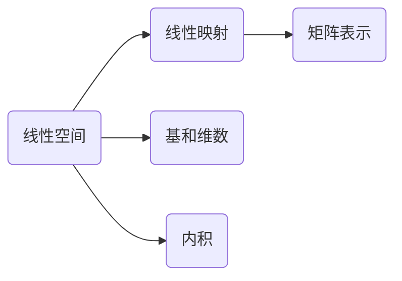

# 线性代数导引：线性空间与线性映射

关键词：线性代数、线性空间、线性映射、基、维数、线性变换、特征值、特征向量、内积空间、正交性

## 1. 背景介绍
### 1.1  问题的由来
线性代数是数学的一个分支,它研究线性方程组、向量空间、线性映射以及有限维的线性空间上的线性变换等概念。线性代数在现代科学和工程中有着广泛的应用,尤其是在计算机科学、人工智能、机器学习、图形学、计算物理等领域。

### 1.2  研究现状
目前,线性代数已经发展成为一门成熟的数学分支。人们对线性空间、线性映射等概念有了深入的理解,并在此基础上发展出了许多重要的理论和算法,如特征值分解、奇异值分解、主成分分析等。这些理论和算法在实践中得到了广泛的应用。

### 1.3  研究意义
深入理解线性代数的基本概念和原理,对于从事计算机科学、人工智能等相关领域的研究者和工程师来说至关重要。只有掌握了这些基础知识,才能更好地理解和应用线性代数的相关算法,解决实际问题。

### 1.4  本文结构
本文将从线性空间和线性映射这两个核心概念出发,系统地介绍线性代数的基本理论。首先给出线性空间和线性映射的定义,然后讨论线性空间的基和维数等重要概念。接着介绍线性映射的矩阵表示以及线性变换。最后,我们还将探讨内积空间和正交性等话题。在讲解过程中,我们会通过大量的例子和练习来帮助读者加深理解。

## 2. 核心概念与联系
线性代数的核心概念包括:

- 线性空间(或向量空间):由一组对象(向量)以及定义在这些对象上的两种运算(加法和数量乘法)组成的数学结构。
- 线性映射(或线性变换):一种保持线性空间结构的映射,即保持加法和数量乘法运算的映射。
- 基:线性空间中的一个向量子集,它线性无关且能生成整个空间。
- 维数:线性空间中任意一组基中所包含的向量个数。
- 内积:一种将线性空间中的两个向量映射到实数域的运算,满足一定的性质。

这些概念之间有着密切的联系。线性映射是定义在线性空间上的一种特殊映射。我们通常用矩阵来表示线性映射,而矩阵乘法对应着线性映射的复合。线性空间的基和维数反映了线性空间的本质特征。内积则赋予了线性空间一种度量结构,使我们能够引入长度和角度等几何概念。



## 3. 核心算法原理 & 具体操作步骤
### 3.1  算法原理概述
在线性代数中,有许多重要的算法,如高斯消元法、特征值分解、奇异值分解等。这些算法在求解线性方程组、矩阵对角化、降维等问题中发挥着重要作用。它们的基本原理都是基于线性空间和线性映射的性质。

### 3.2  算法步骤详解
以高斯消元法为例,其基本步骤如下:
1. 将线性方程组写成增广矩阵形式。
2. 通过初等行变换,将增广矩阵变为行阶梯形矩阵。
   - 交换两行
   - 把某一行乘以一个非零常数
   - 把某一行加上另一行的若干倍
3. 通过行阶梯形矩阵的形式,判断线性方程组的解的情况(无解、唯一解或无穷多解)。
4. 若有解,则通过回代求出解。

### 3.3  算法优缺点
高斯消元法的优点是计算简单,容易实现。但是它的计算复杂度较高,对于大型稀疏矩阵效率较低。此外,高斯消元法对误差也比较敏感。

### 3.4  算法应用领域
高斯消元法在求解线性方程组、计算矩阵的秩、求矩阵的逆等问题中有广泛应用。它是许多更高级算法的基础。

## 4. 数学模型和公式 & 详细讲解 & 举例说明
### 4.1  数学模型构建
在线性代数中,我们经常使用矩阵来表示线性映射。设$V$和$W$是两个线性空间,维数分别为$n$和$m$。设$\{α_1,\cdots,α_n\}$是$V$的一组基,$\{β_1,\cdots,β_m\}$是$W$的一组基。若$f:V\to W$是一个线性映射,且
$$
f(α_j)=a_{1j}β_1+\cdots+a_{mj}β_m,\quad j=1,\cdots,n
$$
则称矩阵$A=(a_{ij})_{m\times n}$为线性映射$f$在基$\{α_1,\cdots,α_n\}$和$\{β_1,\cdots,β_m\}$下的矩阵表示。

### 4.2  公式推导过程
对于任意向量$α=x_1α_1+\cdots+x_nα_n\in V$,我们有
$$
\begin{aligned}
f(α) &= f(x_1α_1+\cdots+x_nα_n) \
      &= x_1f(α_1)+\cdots+x_nf(α_n) \
      &= x_1(a_{11}β_1+\cdots+a_{m1}β_m)+\cdots+x_n(a_{1n}β_1+\cdots+a_{mn}β_m) \
      &= (a_{11}x_1+\cdots+a_{1n}x_n)β_1+\cdots+(a_{m1}x_1+\cdots+a_{mn}x_n)β_m
\end{aligned}
$$
这表明,线性映射$f$可以通过矩阵$A$对向量$α$的坐标$(x_1,\cdots,x_n)$进行变换,得到向量$f(α)$在基$\{β_1,\cdots,β_m\}$下的坐标。

### 4.3  案例分析与讲解
考虑以下线性映射$f:\mathbb{R}^2\to\mathbb{R}^3$,它将向量$(x,y)\in\mathbb{R}^2$映射为向量$(x+y,x-y,2x)\in\mathbb{R}^3$。我们可以选取$\mathbb{R}^2$的标准基$\{(1,0),(0,1)\}$和$\mathbb{R}^3$的标准基$\{(1,0,0),(0,1,0),(0,0,1)\}$。容易计算出
$$
f((1,0))=(1,1,2),\quad f((0,1))=(1,-1,0)
$$
因此,线性映射$f$在这两组基下的矩阵表示为
$$
A=\begin{pmatrix}
1 & 1 \
1 & -1 \
2 & 0
\end{pmatrix}
$$

### 4.4  常见问题解答
问:如何判断一个映射是否为线性映射?
答:可以验证该映射是否满足以下两个性质:
1. 加法保持性:$f(α+β)=f(α)+f(β)$;
2. 数量乘法保持性:$f(kα)=kf(α)$。
其中$α,β$是线性空间中任意两个向量,$k$是任意实数。

## 5. 项目实践：代码实例和详细解释说明
### 5.1  开发环境搭建
我们将使用Python语言和NumPy库来实现线性代数的相关算法。首先需要安装Python和NumPy库。可以通过以下命令安装NumPy:
```
pip install numpy
```

### 5.2  源代码详细实现
以下是使用NumPy实现高斯消元法的Python代码:
```python
import numpy as np

def gaussian_elimination(A, b):
    """
    高斯消元法求解线性方程组Ax=b
    """
    n = len(b)
    # 构造增广矩阵
    Ab = np.hstack((A, b.reshape(n,1)))

    # 高斯消元
    for i in range(n):
        # 选主元
        max_row = i
        for j in range(i+1, n):
            if abs(Ab[j,i]) > abs(Ab[max_row,i]):
                max_row = j
        Ab[i], Ab[max_row] = Ab[max_row], Ab[i].copy()

        # 将主元归一化
        div = Ab[i,i]
        Ab[i,:] /= div

        # 消元
        for j in range(n):
            if j != i:
                sub = Ab[j,i]
                Ab[j,:] -= sub * Ab[i,:]

    # 返回解
    x = Ab[:,-1]
    return x
```

### 5.3  代码解读与分析
上述代码的主要步骤如下:
1. 将系数矩阵$A$和常数项$b$构造成增广矩阵。
2. 对增广矩阵进行高斯消元。主要包括三个步骤:
   - 选主元:选取第$i$列中绝对值最大的元素所在行作为主元行,并与第$i$行交换。这样可以提高数值稳定性。
   - 将主元归一化:将主元所在行除以主元,使主元变为1。
   - 消元:用主元所在行去消去其他行对应列的元素。
3. 返回线性方程组的解,即增广矩阵的最后一列。

### 5.4  运行结果展示
我们用一个简单的例子来测试上述代码。考虑以下线性方程组:
$$
\begin{cases}
2x_1 + x_2 = 4 \
x_1 + 3x_2 = 5
\end{cases}
$$
对应的系数矩阵和常数项分别为:
$$
A=\begin{pmatrix}
2 & 1 \
1 & 3
\end{pmatrix},\quad
b=\begin{pmatrix}
4 \
5
\end{pmatrix}
$$
运行代码得到:
```
x = [1. 1.]
```
即$x_1=1,x_2=1$,与实际结果相符。

## 6. 实际应用场景
线性代数在许多实际问题中有着重要应用,例如:
- 计算机图形学:通过线性变换(如平移、旋转、缩放等)来实现图形的变换和渲染。
- 机器学习:许多机器学习算法(如支持向量机、主成分分析等)都依赖于线性代数。
- 数值优化:线性规划、二次规划等优化问题都可以用线性代数的方法求解。
- 信号处理:傅里叶变换、小波变换等都是基于线性代数的重要工具。

### 6.4  未来应用展望
随着人工智能、大数据等技术的发展,线性代数在这些领域中的应用将变得越来越重要。同时,线性代数与其他数学分支(如概率论、图论等)的交叉融合,也将催生出许多新的研究方向和应用场景。

## 7. 工具和资源推荐
### 7.1  学习资源推荐
- 《线性代数及其应用》(David C. Lay)
- MIT线性代数公开课(Gilbert Strang)
- Khan Academy线性代数课程

### 7.2  开发工具推荐
- MATLAB
- NumPy
- Eigen

### 7.3  相关论文推荐
- Matrix Computations (Gene H. Golub, Charles F. Van Loan)
- Numerical Linear Algebra (Lloyd N. Trefethen, David Bau III)
- Matrix Analysis (Roger A. Horn, Charles R. Johnson)

### 7.4  其他资源推荐
- 线性代数工具箱(MATLAB)
- 线性代数在线计算器(Wolfram Alpha)
- 线性代数可视化工具(GeoGebra)

## 8. 总结：未来发展趋势与挑战
### 8.1  研究成果总结
本文系统地介绍了线性代数的基本概念和理论,包括线性空间、线性映射、基和维数、内积空间等。我们还通过具体的例子和代码实现,展示了如何运用这些理论解决实际问题。

### 8.2  未来发展趋势
线性代数作为数学的一个基础分支,其理论和应用还在不断发展。一些值得关注的发展趋势包括:
- 随机矩阵理论:研究大型随机