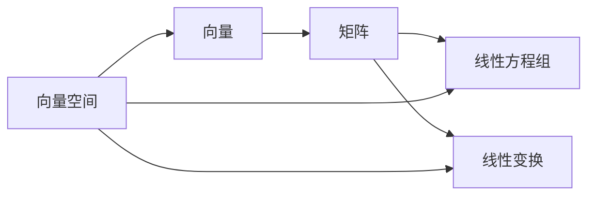

# 线性代数导引：线性结构

作者：禅与计算机程序设计艺术 / Zen and the Art of Computer Programming

## 1. 背景介绍

### 1.1 问题的由来

线性代数是数学的一个重要分支,它主要研究线性方程组、矩阵、向量空间、线性变换等内容。线性代数在科学、工程和技术领域有着广泛的应用,尤其在计算机科学、人工智能、机器学习、图形学、计算机视觉等领域更是不可或缺的数学工具。

### 1.2 研究现状

目前,线性代数已经发展成为一门成熟的数学学科,国内外学者对线性代数的理论研究和应用探索都取得了丰硕的成果。线性代数的教材和专著也层出不穷,为学习和研究线性代数提供了丰富的资源。

### 1.3 研究意义

深入学习和研究线性代数,不仅能够提高数学素养,更能够为解决实际问题提供有力的数学工具。尤其对于计算机专业的学生来说,学好线性代数是学习后续专业课程的基础,也是从事科研工作的必备技能。

### 1.4 本文结构

本文将从线性结构的角度来探讨线性代数的核心概念,主要包括向量、矩阵、线性方程组、向量空间、线性变换等内容。通过对这些概念的深入剖析,帮助读者建立线性代数的知识体系,并能够灵活运用线性代数解决实际问题。

## 2. 核心概念与联系

线性代数的核心概念包括:

- 向量:表示空间中的有向线段,是线性代数的基本元素。
- 矩阵:由数字或符号排列成的矩形阵列,是线性代数的重要工具。  
- 线性方程组:由若干个线性方程构成的方程组,求解线性方程组是线性代数的基本问题之一。
- 向量空间:由一组向量构成的集合,满足加法和数乘运算,是线性代数的研究对象。
- 线性变换:在向量空间之间建立映射关系,保持线性结构不变。

这些概念之间有着紧密的联系,向量是构成矩阵的基本元素,矩阵又可以表示线性方程组和线性变换,向量空间则为这些概念提供了统一的理论框架。理解这些概念之间的内在联系,是学习线性代数的关键。



## 3. 核心算法原理 & 具体操作步骤

### 3.1 算法原理概述

线性代数中的许多问题都可以通过算法求解,常见的算法包括:

- 高斯消元法:求解线性方程组的经典算法。
- LU分解:将矩阵分解为下三角矩阵和上三角矩阵的乘积。 
- QR分解:将矩阵分解为正交矩阵和上三角矩阵的乘积。
- 奇异值分解:将矩阵分解为若干个奇异值的乘积形式。
- 幂法和反幂法:求解矩阵的特征值和特征向量的迭代算法。

这些算法在数值计算和工程应用中有着重要作用,是线性代数的重要内容。

### 3.2 算法步骤详解

以高斯消元法为例,其基本步骤如下:

1. 将线性方程组写成增广矩阵形式。 
2. 通过初等行变换,将增广矩阵化为行阶梯形矩阵。
3. 通过回代,求出线性方程组的解。

具体操作时,可以通过选主元、列主元等策略,提高算法的数值稳定性。

### 3.3 算法优缺点

高斯消元法的优点是原理简单,易于实现;缺点是计算量较大,对于大型稀疏矩阵效率较低。LU分解、QR分解等算法通过对矩阵进行预处理,可以提高求解效率。不同算法在不同问题上各有优劣,需要根据具体情况选择合适的算法。

### 3.4 算法应用领域

线性代数算法在科学计算、机器学习、计算机图形学、信号处理等领域有着广泛应用。比如,在机器学习中,许多模型的训练都需要求解大型线性方程组;在计算机图形学中,几何变换可以用矩阵来表示,求解矩阵方程是图形学的基本问题之一。

## 4. 数学模型和公式 & 详细讲解 & 举例说明

### 4.1 数学模型构建

线性代数提供了多种数学模型,用于描述现实世界中的问题。比如,线性方程组可以用来描述多元一次方程的求解问题;矩阵可以用来描述线性变换;二次型可以用来描述几何曲线和曲面。合理地构建数学模型,是应用线性代数解决实际问题的基础。

### 4.2 公式推导过程

线性代数中有许多重要公式,如克拉默法则、行列式展开定理、矩阵乘法、特征值和特征向量、正交变换等。学习这些公式的推导过程,不仅能加深对概念的理解,更能提高运用能力。比如,对于线性方程组 $Ax=b$,若 $A$ 可逆,则其解为 $x=A^{-1}b$。

### 4.3 案例分析与讲解

学习线性代数,仅掌握理论知识是不够的,还需要能够应用知识解决实际问题。通过案例分析,可以加深对概念和方法的理解,提高分析问题和解决问题的能力。比如,利用矩阵的特征值和特征向量,可以分析动态系统的稳定性;利用奇异值分解,可以进行数据降维和特征提取。

### 4.4 常见问题解答

学习线性代数的过程中,难免会遇到一些疑惑和问题。及时解答这些问题,可以帮助读者消除障碍,深入理解线性代数的内容。比如,矩阵的乘法为什么不满足交换律?矩阵的秩与行列式有什么联系?特征值和奇异值有什么区别?

## 5. 项目实践：代码实例和详细解释说明

### 5.1 开发环境搭建

学习线性代数,除了掌握理论知识,还需要能够用编程语言实现算法。常用的编程语言包括MATLAB、Python、C++等。以Python为例,需要安装NumPy、SciPy等数值计算库,提供了丰富的线性代数函数。

### 5.2 源代码详细实现

利用Python实现线性代数算法,可以加深对算法的理解,提高编程能力。比如,下面的代码实现了高斯消元法求解线性方程组:

```python
import numpy as np

def gauss_elimination(A, b):
    n = len(b)
    Ab = np.hstack((A, b.reshape(n,1)))
    
    for i in range(n):
        # 选主元
        max_row = np.argmax(np.abs(Ab[i:, i])) + i
        Ab[i], Ab[max_row] = Ab[max_row], Ab[i].copy()
        
        # 消元
        pivot = Ab[i, i]
        Ab[i] = Ab[i] / pivot
        for j in range(i+1, n):
            Ab[j] -= Ab[j, i] * Ab[i]
            
    # 回代 
    x = np.zeros(n)
    for i in range(n-1, -1, -1):
        x[i] = Ab[i, n]
        for j in range(i+1, n):
            x[i] -= Ab[i, j] * x[j]
            
    return x
```

### 5.3 代码解读与分析

通过对代码的解读和分析,可以加深对算法实现细节的理解。比如,上述代码中,首先将系数矩阵 $A$ 和常数项 $b$ 合并成增广矩阵,然后通过选主元和消元操作,将增广矩阵化为上三角形式,最后通过回代求解。需要注意的是,为了提高数值稳定性,代码中使用了选主元策略。

### 5.4 运行结果展示

将算法应用到实际问题中,并展示运行结果,可以检验算法的正确性和有效性。比如,求解如下线性方程组:

$$
\begin{cases}
2x_1 + x_2 + x_3 = 4 \
x_1 + 2x_2 + x_3 = 5 \  
x_1 + x_2 + 2x_3 = 6
\end{cases}
$$

利用上述高斯消元法的Python实现,可以得到方程组的解为 $x_1=1,x_2=1,x_3=2$。

## 6. 实际应用场景

线性代数在科学、工程、经济等领域有着广泛的应用,下面列举几个典型的应用场景:

- 计算机图形学:利用矩阵表示几何变换,如平移、旋转、缩放等。
- 机器学习:许多机器学习模型都是基于线性代数构建的,如线性回归、主成分分析、支持向量机等。
- 运筹学:线性规划问题可以用矩阵不等式来描述,求解线性规划问题是运筹学的重要内容。  
- 量子力学:量子态可以用矢量来表示,量子门可以用矩阵来表示,线性代数是量子计算的数学基础。

### 6.4 未来应用展望

随着科学技术的发展,线性代数的应用领域还在不断拓展。比如,在人工智能领域,张量分解、深度学习等前沿技术都依赖于线性代数;在大数据领域,线性代数是处理高维数据的有力工具;在区块链领域,线性代数被用于构建零知识证明协议。线性代数在未来还有着广阔的应用前景。

## 7. 工具和资源推荐

### 7.1 学习资源推荐

- 《线性代数及其应用》(David C. Lay)
- MIT 18.06 线性代数公开课(Gilbert Strang)
- 3Blue1Brown线性代数可视化教程

### 7.2 开发工具推荐

- MATLAB
- NumPy/SciPy
- Eigen(C++)

### 7.3 相关论文推荐

- Matrix Computations (Gene H. Golub, Charles F. Van Loan)
- Numerical Linear Algebra (Lloyd N. Trefethen, David Bau III)
- Matrix Analysis (Roger A. Horn, Charles R. Johnson)

### 7.4 其他资源推荐

- 线性代数在线计算工具: https://matrixcalc.org/
- 线性代数可视化演示: https://textbooks.math.gatech.edu/ila/
- 线性代数知识图谱: https://www.zhihu.com/question/47705441/answer/1857149699

## 8. 总结：未来发展趋势与挑战

### 8.1 研究成果总结

线性代数经过几百年的发展,已经形成了完备的理论体系,并在科学和工程中得到了广泛应用。矩阵论、线性方程组、向量空间、线性变换等理论已经十分成熟,高斯消元、矩阵分解、特征值计算等算法也得到了深入研究。

### 8.2 未来发展趋势

尽管线性代数已经取得了丰硕的研究成果,但仍然有许多值得探索的方向。未来线性代数的研究热点可能包括:

- 大规模线性代数:研究如何利用高性能计算技术处理大型矩阵运算。
- 随机线性代数:利用随机采样技术加速传统算法。
- 量子线性代数:研究量子计算机上的线性代数算法。
- 非线性代数:将线性代数的思想拓展到非线性问题中。
- 线性代数与深度学习:利用线性代数优化深度学习模型。

### 8.3 面临的挑战

线性代数在未来的发展中,也面临着一些挑战:

- 数值稳定性:许多线性代数算法对误差和舍入非常敏感,如何提高数值稳定性是一大挑战。
- 高维数据处理:随着大数据时代的到来,如何利用线性代数处理高维数据是亟待解决的问题。
- 实时计算:在机器人、自动驾驶等实时系统中,需要线性代数算法能够快速响应,这对算法提