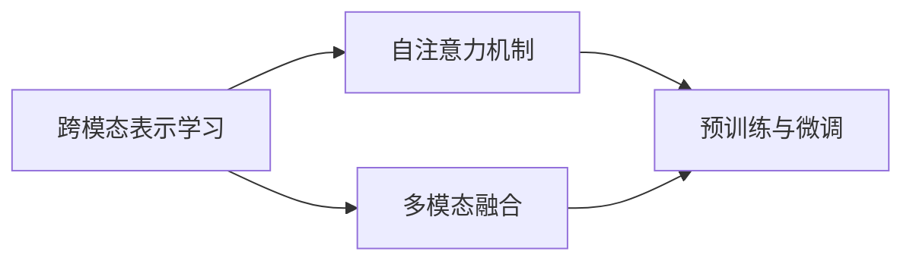

# 视觉语言模型原理与代码实战案例讲解

## 1. 背景介绍
### 1.1 问题的由来
近年来,随着深度学习技术的快速发展,计算机视觉和自然语言处理领域取得了巨大的进步。然而,如何将视觉和语言信息有效地结合起来,实现跨模态的理解和生成,仍然是一个巨大的挑战。视觉语言模型(Vision-Language Models)正是为解决这一问题而提出的,它旨在通过联合建模视觉和语言信息,实现对图像和文本的统一表示和理解。

### 1.2 研究现状
目前,视觉语言模型已经在多个任务上取得了显著的性能提升,如图像描述生成、视觉问答、图文匹配等。代表性的工作包括ViLBERT、LXMERT、UNITER等,它们通过引入自注意力机制和跨模态交互,有效地建模了视觉和语言信息。然而,现有方法仍然存在一些局限性,如对噪声数据的鲁棒性不足、缺乏可解释性等。

### 1.3 研究意义 
视觉语言模型的研究具有重要的理论和实践意义。从理论角度来看,它有助于我们深入理解视觉和语言信息的内在联系,探索人类认知的奥秘。从实践角度来看,视觉语言模型可以应用于多个领域,如智能助理、医疗诊断、教育培训等,为人们的生活和工作带来便利。

### 1.4 本文结构
本文将全面介绍视觉语言模型的原理和实践。第2节介绍视觉语言模型的核心概念和联系;第3节详细阐述模型的算法原理和操作步骤;第4节给出数学模型和公式推导过程;第5节提供代码实例和详细解释;第6节讨论模型的实际应用场景;第7节推荐相关的工具和资源;第8节总结全文,展望未来的发展趋势和挑战;第9节列出常见问题与解答。

## 2. 核心概念与联系
视觉语言模型的核心概念包括:

- 跨模态表示学习:旨在学习一个统一的嵌入空间,使得图像和文本可以用相似的向量表示,便于后续的跨模态推理。
- 自注意力机制:通过计算不同位置之间的相关性,实现特征的自适应加权,增强模型的表达能力。
- 多模态融合:将不同模态的信息进行融合,实现信息的互补和增强。常见的融合方式有拼接、逐元素乘积等。
- 预训练与微调:先在大规模数据上进行无监督的预训练,学习通用的跨模态表示;再在下游任务上进行有监督的微调,提高模型的适应性。

这些概念之间紧密相关,共同构成了视觉语言模型的基本框架。下图给出了它们之间的联系:



## 3. 核心算法原理 & 具体操作步骤
### 3.1 算法原理概述
视觉语言模型的核心是通过自注意力机制和跨模态交互,实现图像和文本的联合表示学习。具体来说,它分为三个主要步骤:特征提取、跨模态交互和任务预测。

### 3.2 算法步骤详解
1. 特征提取:
   - 对于图像,使用预训练的CNN(如ResNet)提取局部特征,再通过线性映射得到图像 token 嵌入。
   - 对于文本,使用预训练的词嵌入(如GloVe)对每个单词进行编码,再通过位置嵌入引入顺序信息。
2. 跨模态交互:
   - 将图像 token 和文本 token 拼接成一个序列,作为 Transformer 的输入。
   - 在 Transformer 的每一层,使用自注意力机制计算不同位置之间的相关性,实现特征的自适应加权。
   - 在 Transformer 的中间层引入跨模态注意力,实现图像到文本、文本到图像的信息交互和融合。
3. 任务预测:
   - 在 Transformer 的输出上添加任务特定的预测头,如用于图像描述生成的自回归解码器。
   - 根据任务的类型(如分类、生成等),设计相应的损失函数,如交叉熵损失。
   - 通过反向传播和梯度下降,优化模型参数,最小化预测损失。

### 3.3 算法优缺点
视觉语言模型的优点包括:
- 通过联合建模视觉和语言信息,实现了跨模态的理解和生成。
- 引入自注意力机制,提高了模型的表达能力和灵活性。
- 采用预训练和微调策略,提高了模型的泛化能力和适应性。

其缺点包括:
- 模型复杂度高,训练和推理成本大。
- 对噪声数据的鲁棒性不足,容易受到对抗样本的攻击。
- 可解释性差,难以解释模型的内部工作机制。

### 3.4 算法应用领域
视觉语言模型可以应用于多个领域,包括:
- 图像描述生成:根据图像内容自动生成自然语言描述。
- 视觉问答:根据图像和问题,预测正确的答案。
- 图文匹配:判断图像和文本是否匹配,实现跨模态检索。
- 视频理解:分析视频内容,实现动作识别、事件检测等。

## 4. 数学模型和公式 & 详细讲解 & 举例说明
### 4.1 数学模型构建
视觉语言模型可以形式化地表示为:

$$\begin{aligned}
\mathbf{h}^{(0)} &= [\mathbf{v}; \mathbf{w}] \
\mathbf{h}^{(l)} &= \text{Transformer}(\mathbf{h}^{(l-1)}), l=1,\dots,L \
p(y|\mathbf{v}, \mathbf{w}) &= \text{softmax}(\mathbf{W}_o\mathbf{h}^{(L)} + \mathbf{b}_o)
\end{aligned}$$

其中,$\mathbf{v}$和$\mathbf{w}$分别表示图像和文本的嵌入表示,$[\cdot;\cdot]$表示拼接操作,$\mathbf{h}^{(l)}$表示第$l$层 Transformer 的输出,$L$为 Transformer 的层数,$\mathbf{W}_o$和$\mathbf{b}_o$为输出层的参数。

### 4.2 公式推导过程
Transformer 的核心是自注意力机制,其计算过程为:

$$\begin{aligned}
\mathbf{Q} &= \mathbf{H}^{(l-1)}\mathbf{W}_q \
\mathbf{K} &= \mathbf{H}^{(l-1)}\mathbf{W}_k \
\mathbf{V} &= \mathbf{H}^{(l-1)}\mathbf{W}_v \
\mathbf{A} &= \text{softmax}(\frac{\mathbf{Q}\mathbf{K}^T}{\sqrt{d}}) \
\mathbf{H}^{(l)} &= \mathbf{A}\mathbf{V}
\end{aligned}$$

其中,$\mathbf{H}^{(l-1)}$为上一层的输出,$\mathbf{W}_q$、$\mathbf{W}_k$、$\mathbf{W}_v$为可学习的参数矩阵,$d$为特征维度。直观地说,自注意力机制通过查询(Query)、键(Key)、值(Value)的计算,实现了不同位置之间的信息交互和聚合。

### 4.3 案例分析与讲解
以图像描述生成任务为例,假设给定一张图像和对应的描述文本:


> 一个小女孩在公园里荡秋千。

首先,通过预训练的CNN和词嵌入对图像和文本进行编码:

$$\begin{aligned}
\mathbf{v} &= \text{CNN}(\text{image}) \
\mathbf{w} &= [\text{Embedding}(w_1), \dots, \text{Embedding}(w_T)]
\end{aligned}$$

然后,将图像和文本表示拼接起来,输入到 Transformer 中:

$$\mathbf{h}^{(0)} = [\mathbf{v}; \mathbf{w}]$$

接着,通过多层 Transformer 的计算,实现跨模态交互和特征融合:

$$\mathbf{h}^{(l)} = \text{Transformer}(\mathbf{h}^{(l-1)}), l=1,\dots,L$$

最后,在 Transformer 的输出上添加解码器,生成描述文本:

$$p(y_t|y_{<t}, \mathbf{v}) = \text{softmax}(\mathbf{W}_o\mathbf{h}_t^{(L)} + \mathbf{b}_o)$$

其中,$y_t$为第$t$个生成的单词,$y_{<t}$为之前生成的单词序列,$\mathbf{h}_t^{(L)}$为第$t$个位置的 Transformer 输出。

通过最大化生成概率,可以得到最优的描述文本:

$$\hat{y} = \arg\max_y \prod_{t=1}^T p(y_t|y_{<t}, \mathbf{v})$$

### 4.4 常见问题解答
问:视觉语言模型的训练需要多大规模的数据集?

答:视觉语言模型通常需要在大规模数据集上进行预训练,如包含数百万图像-文本对的COCO、Flickr30K等。在特定任务上微调时,数据集的规模可以相对较小,如几千到几万个样本。

问:视觉语言模型的推理速度如何?

答:视觉语言模型的推理速度取决于模型的大小和计算设备。在GPU上,ViLBERT等模型的推理速度可以达到每秒几十到上百幅图像。为了进一步提高效率,可以采用模型压缩、知识蒸馏等技术。

## 5. 项目实践:代码实例和详细解释说明
### 5.1 开发环境搭建
首先,需要安装必要的依赖库,包括PyTorch、Transformers等。可以通过以下命令安装:

```bash
pip install torch torchvision transformers
```

### 5.2 源代码详细实现
下面给出了视觉语言模型的PyTorch实现代码:

```python
import torch
import torch.nn as nn
from transformers import BertTokenizer, BertModel

class ViLBERT(nn.Module):
    def __init__(self, config):
        super().__init__()
        self.visual_encoder = nn.Sequential(
            nn.Linear(config.visual_feat_dim, config.hidden_size),
            nn.ReLU(),
            nn.Linear(config.hidden_size, config.hidden_size),
        )
        self.text_encoder = BertModel.from_pretrained('bert-base-uncased')
        self.fusion_layer = nn.TransformerEncoder(
            nn.TransformerEncoderLayer(
                d_model=config.hidden_size, 
                nhead=config.num_attention_heads,
                dim_feedforward=config.intermediate_size,
            ),
            num_layers=config.num_hidden_layers,
        )
        
    def forward(self, image_features, input_ids, attention_mask):
        visual_embeds = self.visual_encoder(image_features)
        text_embeds = self.text_encoder(input_ids, attention_mask=attention_mask)[0]
        
        visual_tokens = visual_embeds.unsqueeze(1)
        text_tokens = text_embeds
        
        tokens = torch.cat([visual_tokens, text_tokens], dim=1)
        
        fused_embeds = self.fusion_layer(tokens)
        
        return fused_embeds
```

### 5.3 代码解读与分析
上述代码实现了ViLBERT模型,它主要由三个部分组成:

1. `visual_encoder`:用于对图像特征进行编码,将其映射到与文本特征相同的维度。
2. `text_encoder`:使用预训练的BERT模型对文本进行编码,提取上下文信息。
3. `fusion_layer`:使用Transformer的编码器对图像和文本特征进行跨模态融合,实现信息交互。

在前向传播过程中,图像特征和文本特征分别通过`visual_encoder`和`text_encoder`进行编码,然后拼接成一个序列,输入到`fusion_layer`中进行融合。最终得到的`fused_embeds`包含了图像和文本的跨模态表示,可以用于下游任务的预测。

### 5.4 运行结果展示