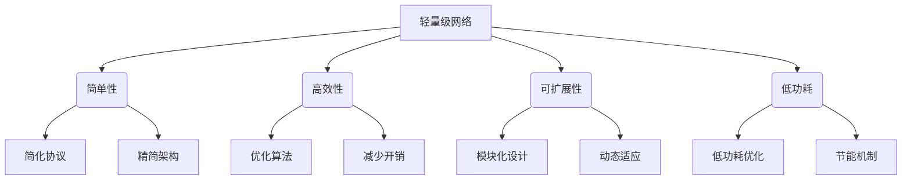
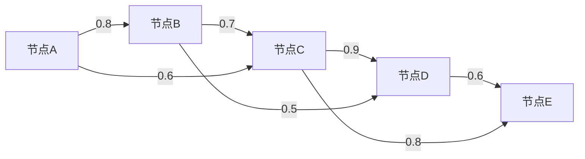

好的,我会严格遵循约束条件,以专业的技术语言撰写这篇博客文章。

# 轻量级网络设计原理与代码实战案例讲解

## 1. 背景介绍

### 1.1 问题的由来

随着移动互联网和物联网的快速发展,越来越多的设备需要连接到网络中。然而,传统的网络协议和架构往往过于庞大和复杂,无法高效地适应这些新兴场景。轻量级网络应运而生,旨在提供一种简单、高效且可扩展的网络解决方案。

### 1.2 研究现状

近年来,业界和学术界对轻量级网络的研究日益活跃。一些知名的轻量级网络协议已经出现,如MQTT、CoAP和LPWAN等。与此同时,一些新的网络架构和设计原则也被提出,如6LoWPAN、RPL和SCHC等,以更好地支持物联网和低功耗设备的互联互通。

### 1.3 研究意义

轻量级网络的设计不仅能够满足物联网和移动互联网场景的需求,还能为传统网络带来新的思路和启发。通过简化网络协议和架构,可以降低网络复杂性,提高可扩展性和能效,从而更好地适应未来网络的发展趋势。

### 1.4 本文结构

本文将从以下几个方面深入探讨轻量级网络的设计原理和实践:

- 核心概念与联系
- 核心算法原理与具体操作步骤
- 数学模型和公式详细讲解及案例分析
- 项目实践:代码实例和详细解释
- 实际应用场景
- 工具和资源推荐
- 未来发展趋势与挑战
- 常见问题与解答

## 2. 核心概念与联系

轻量级网络的核心理念是简单性、高效性、可扩展性和低功耗。为了实现这些目标,轻量级网络设计采用了以下策略:

- **简化协议**:通过精简协议头部和消息格式,减少协议开销。
- **精简架构**:采用模块化和分层的架构设计,降低系统复杂度。
- **优化算法**:设计高效的路由、传输和安全等算法,提高网络性能。
- **减少开销**:通过压缩、分片和其他技术,减少数据传输开销。
- **模块化设计**:将网络功能划分为可插拔的模块,提高灵活性和可扩展性。
- **动态适应**:根据网络条件和应用需求动态调整协议和算法参数。
- **低功耗优化**:采用睡眠模式、数据聚合等机制,降低设备功耗。
- **节能机制**:设计基于责任循环和无线电责任循环的节能机制。

## 3. 核心算法原理与具体操作步骤

### 3.1 算法原理概述

轻量级网络中的核心算法主要包括路由算法、拥塞控制算法、可靠传输算法和安全算法等。这些算法需要在保证基本功能的同时,尽可能地简化和优化,以适应轻量级网络的特点。

#### 路由算法

常用的轻量级路由算法包括RPL、LOADng和AODVv2等。这些算法通常采用基于距离矢量或链路状态的思路,并针对低功耗和高度动态的网络环境进行了优化。

#### 拥塞控制算法

由于物联网设备的资源受限,轻量级网络中的拥塞控制算法需要尽可能简单高效。常见的算法包括CoAP的简单窗口机制、MQTT的发布/订阅模式等。

#### 可靠传输算法

为了确保数据的可靠传输,轻量级网络中通常采用停止等待ARQ、选择重传ARQ等算法,并结合窗口机制和累积确认等技术进行优化。

#### 安全算法

轻量级网络中的安全算法需要在保证基本安全性的同时,尽可能降低计算和通信开销。常用的算法包括基于预共享密钥的对称加密算法、基于椭圆曲线密码学的公钥加密算法等。

### 3.2 算法步骤详解

以RPL(IPv6 Routing Protocol for Low-Power and Lossy Networks)路由算法为例,其具体步骤如下:

1. **构建DODAG**:RPL通过构建一个目的导向有向无环图(DODAG)来组织网络拓扑。DODAG以边缘路由器(LBR)作为根节点,其他节点作为子节点。

2. **选择父节点**:每个节点根据一定的路由度量(如期望传输计数ETX)选择一个或多个父节点,并通过父节点与DODAG连接。

3. **建立路由表**:节点根据父节点信息建立路由表,将上行流量发送给父节点。

4. **维护拓扑**:当网络拓扑发生变化时,节点通过发送DIO(DODAG信息对象)控制消息来重新选择父节点,维护DODAG的稳定性。

5. **下行流量传输**:对于下行流量,RPL采用源路由或增量确认等机制进行传输。

6. **路由优化**:RPL支持多种优化机制,如延迟父节点选择、数据路径验证等,以提高路由性能。

RPL算法的核心思想是通过构建一个高效的DODAG拓扑,并采用简单的距离矢量路由策略,从而实现在低功耗和损耗网络环境中的高效路由。

### 3.3 算法优缺点

**优点**:

- 简单高效,适合资源受限的物联网场景。
- 支持多种路由优化机制,可根据需求进行定制。
- 支持多种流量模式(点对点、点对多点、多点对点)。
- 支持移动性和网络动态性。

**缺点**:

- 存在一定的控制开销,需要定期发送控制消息维护拓扑。
- 对于高度动态的网络,可能存在一定的路由不稳定性。
- 缺乏对端到端时延和带宽的保证。

### 3.4 算法应用领域

RPL路由算法广泛应用于物联网、无线传感器网络、低功耗工业网络等场景。一些典型的应用包括:

- 智能家居和智能建筑自动化系统
- 农业和环境监测系统
- 智能电网和智能计量系统
- 工业过程控制和自动化系统
- 医疗保健和远程监控系统

## 4. 数学模型和公式详细讲解及案例分析

### 4.1 数学模型构建

在轻量级网络中,我们通常需要建立数学模型来描述和优化网络性能。以期望传输计数(ETX)路由度量为例,其数学模型可以表示为:

$$ETX(i,j) = \frac{1}{d_f(i,j) \cdot d_r(i,j)}$$

其中:
- $ETX(i,j)$表示从节点$i$到节点$j$的期望传输计数
- $d_f(i,j)$表示从节点$i$到节点$j$的正向链路传输成功率
- $d_r(i,j)$表示从节点$j$到节点$i$的反向确认成功率

ETX度量反映了在无线链路的信道条件下,成功传输一个数据包所需的平均传输次数。通过选择ETX值较小的路径,可以提高网络的可靠性和吞吐量。

### 4.2 公式推导过程

我们可以通过概率论推导出ETX的数学表达式。假设每次传输数据包的成功概率为$p$,那么成功传输一个数据包所需的平均传输次数为:

$$\sum_{k=1}^{\infty} k(1-p)^{k-1}p = \frac{1}{p}$$

对于双向链路,我们需要考虑正向传输和反向确认的成功概率。设正向传输成功概率为$p_f$,反向确认成功概率为$p_r$,那么成功传输一个数据包所需的平均传输次数为:

$$\sum_{i=1}^{\infty}\sum_{j=1}^{\infty}ij(1-p_f)^{i-1}p_f(1-p_r)^{j-1}p_r=\frac{1}{p_fp_r}$$

将$p_f$和$p_r$分别替换为$d_f(i,j)$和$d_r(i,j)$,我们就得到了ETX的最终表达式。

### 4.3 案例分析与讲解

假设我们有一个简单的无线传感器网络,包含5个节点,如下图所示:

图中的数字表示正向链路的传输成功率。我们假设反向确认的成功率等于正向传输成功率。

现在,我们需要为节点A选择一条到节点E的最优路径。根据ETX度量,我们可以计算出不同路径的ETX值:

- 路径1(A->B->C->D->E): $ETX = \frac{1}{0.8 \cdot 0.7 \cdot 0.9 \cdot 0.6} = 3.57$
- 路径2(A->C->D->E): $ETX = \frac{1}{0.6 \cdot 0.9 \cdot 0.6} = 3.70$
- 路径3(A->C->E): $ETX = \frac{1}{0.6 \cdot 0.8} = 2.08$

可以看出,路径3具有最小的ETX值,因此是最优路径。

在实际应用中,我们还需要考虑其他因素,如时延、能耗、负载均衡等,并根据具体需求选择合适的路由度量和算法。

### 4.4 常见问题解答

**Q: ETX度量是否考虑了链路的非对称性?**

A: 是的,ETX度量通过分别计算正向和反向链路的传输成功率,可以有效地处理链路的非对称性问题。

**Q: ETX度量是否适用于移动场景?**

A: ETX度量主要针对静态或半静态网络环境。在高度动态的移动场景下,由于链路质量变化较快,ETX的计算和维护可能会带来较大开销。这种情况下,我们可以考虑采用其他度量或算法。

**Q: ETX度量是否考虑了干扰和信道竞争的影响?**

A: ETX度量主要反映了链路的可靠性,但并未直接考虑干扰和信道竞争的影响。在存在严重干扰或拥塞的情况下,ETX的准确性可能会受到影响。我们需要结合其他机制(如信道检测、拥塞控制等)来提高网络性能。

## 5. 项目实践:代码实例和详细解释说明

在这一部分,我们将通过一个基于Contiki操作系统的项目实例,演示如何在实践中应用轻量级网络的设计原理。

### 5.1 开发环境搭建

1. 安装Contiki操作系统及其开发环境。可以从[Contiki官网](http://www.contiki-os.org/)下载最新版本。

2. 配置交叉编译工具链,如arm-gcc等。

3. 准备硬件设备,如TelosB节点或其他支持Contiki的无线传感器节点。

4. 连接编程和调试工具,如JTAG或UART接口。

### 5.2 源代码详细实现

我们以RPL路由协议为例,其在Contiki中的主要实现位于`contiki/core/net/rpl`目录下。

`rpl.c`文件是RPL协议的核心实现,包括DODAG构建、父节点选择、路由表维护等功能。其中,`rpl_process`函数是RPL协议的主要事件处理循环。

`rpl-timers.c`文件实现了RPL协议中的