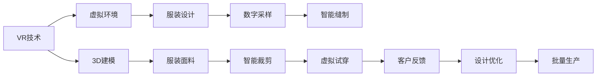

                 

## 1. 背景介绍

在数字化转型的浪潮下，虚拟现实（VR）技术正在以前所未有的速度渗透进人们的生活。从游戏、教育到医疗，VR技术的应用范围日益广泛。而随着个性化需求日益增长，VR时装定制也成为了一个热门领域。数字化的个性化时尚不仅能够满足消费者对独特服装的追求，还能开创全新的商业机会，形成新的产业链条。本文将探讨VR时装定制创业的数字化之路，详细分析其核心概念、技术原理与实际应用，为有志于进入这一领域的创业者提供参考。

## 2. 核心概念与联系

### 2.1 核心概念概述

VR时装定制的核心概念主要包括以下几个方面：

- **虚拟现实（Virtual Reality, VR）**：一种利用计算机技术创建虚拟环境的沉浸式体验方式，可以让人类在虚拟世界中感知和交互。
- **时装定制（Fashion Customization）**：为满足客户的个性化需求，定制特定的服装。
- **数字化（Digitization）**：将传统的制造和服务流程转化为数字化的形态，通过数据和软件工具进行管理和优化。
- **个性化（Personalization）**：根据消费者的个性化需求，提供定制化的服务。
- **时尚（Fashion）**：一种文化表达和审美选择，体现时代潮流和文化多样性。

这些概念通过数字化技术紧密联系在一起，共同构成了VR时装定制的完整生态。通过数字化手段，消费者能够直接参与到服装设计、制造和试穿的全流程中，实现真正意义上的个性化时尚。

### 2.2 核心概念原理和架构的 Mermaid 流程图



## 3. 核心算法原理 & 具体操作步骤

### 3.1 算法原理概述

VR时装定制的数字化流程主要分为三个阶段：

1. **数据采集与建模**：通过3D扫描、VR镜头等技术，采集人体数据和服装设计数据，构建虚拟环境。
2. **数字化设计**：利用计算机辅助设计（CAD）软件，将人体数据与设计数据结合，生成虚拟服装模型。
3. **数字化制造**：通过3D打印、智能裁剪等技术，将虚拟服装模型转化为实体服装。

### 3.2 算法步骤详解

#### 3.2.1 数据采集与建模

- **3D扫描**：使用3D扫描仪，对客户人体进行全面扫描，获取其身体数据，用于生成虚拟人体模型。
- **VR镜头采集**：通过VR镜头，捕捉设计师的设计草图或样衣，用于生成服装的虚拟原型。

#### 3.2.2 数字化设计

- **3D建模**：将采集到的人体数据和设计数据，通过3D建模软件转化为虚拟服装模型。
- **虚拟试穿**：在虚拟环境中，通过VR头盔或显示器，让消费者试穿虚拟服装，提供互动体验。

#### 3.2.3 数字化制造

- **3D打印**：将虚拟服装模型转化为3D打印文件，通过3D打印机输出实体服装。
- **智能裁剪**：利用计算机视觉和图像处理技术，自动进行裁剪，提高生产效率。

### 3.3 算法优缺点

#### 3.3.1 优点

- **高精度与个性化**：3D扫描和VR技术能够提供高精度的数据，满足客户个性化的需求。
- **互动体验**：消费者可以直接在虚拟环境中试穿服装，提高购物体验。
- **高效率**：通过数字化设计和管理，缩短了制造周期，提高了生产效率。

#### 3.3.2 缺点

- **成本高**：3D扫描和VR设备价格昂贵，初始投入较大。
- **技术门槛高**：需要专业的3D建模和计算机视觉技术，对技术要求高。
- **数据安全问题**：客户数据和个人隐私保护需要加强。

### 3.4 算法应用领域

VR时装定制不仅限于高端市场，还可以应用于多个领域：

- **个性化定制服装**：根据消费者的身材、偏好，提供定制的服装。
- **时尚品牌展示**：通过虚拟展览，展示品牌的最新设计，吸引消费者。
- **虚拟试衣间**：在商场、品牌店内，通过VR技术提供虚拟试衣间。
- **教育培训**：在服装设计、制作等领域，提供虚拟培训课程。

## 4. 数学模型和公式 & 详细讲解 & 举例说明

### 4.1 数学模型构建

VR时装定制的数学模型主要涉及人体参数建模、服装建模和试穿模拟。

- **人体参数建模**：通过3D扫描获取人体关键点数据，建立人体参数模型。
- **服装建模**：将服装设计数据转化为虚拟服装模型，利用几何建模方法，如体素网格（Voxel）、三角网格（TriMesh）等。
- **试穿模拟**：通过人体参数模型和虚拟服装模型的融合，进行虚拟试穿模拟，利用物理模拟技术，如刚体动力学、接触力模型等。

### 4.2 公式推导过程

#### 4.2.1 人体参数建模

假设人体参数数据为$(x_1, y_1, z_1, \cdots, x_n, y_n, z_n)$，其中$x_i, y_i, z_i$为第$i$个关键点的坐标。通过3D扫描，可以得到一组人体参数，记为$\mathbf{X} = [\mathbf{x}_1, \mathbf{x}_2, \cdots, \mathbf{x}_n]$。

- **线性插值**：通过线性插值公式，得到任意位置的人体参数：
$$
\mathbf{P}(t) = \mathbf{X}t + \mathbf{X}(1-t) = (1-t)\mathbf{X} + t\mathbf{X} = (1-2t)\mathbf{X} + t\mathbf{X} = (1-t)\mathbf{X}
$$

#### 4.2.2 服装建模

假设服装设计数据为$\mathbf{V} = [\mathbf{v}_1, \mathbf{v}_2, \cdots, \mathbf{v}_n]$，其中$\mathbf{v}_i = (x_i, y_i, z_i)$为第$i$个顶点的坐标。通过3D建模软件，可以得到一组服装设计数据，记为$\mathbf{V}'$。

- **三角网格建模**：将服装设计数据转化为三角网格模型，通过三角形面的顶点坐标，构建服装模型：
$$
\mathbf{F} = \{\mathbf{v}_i, \mathbf{v}_j, \mathbf{v}_k\}
$$

#### 4.2.3 试穿模拟

假设人体参数模型为$\mathbf{P}(t)$，服装模型为$\mathbf{F}$。通过虚拟试穿模拟，可以得到人体与服装的接触点坐标$\mathbf{C}$。

- **刚体动力学**：通过刚体动力学模型，计算人体与服装的接触力$\mathbf{F}_c$：
$$
\mathbf{F}_c = \mathbf{P}_c - \mathbf{P}_r
$$

### 4.3 案例分析与讲解

以某虚拟时装定制创业项目为例，该项目采用3D扫描技术采集人体数据，使用CAD软件进行服装设计，通过3D打印机输出实体服装。其核心算法流程如下：

1. **人体数据采集**：使用3D扫描仪对客户进行全身扫描，获取其人体数据，并生成人体参数模型$\mathbf{P}$。
2. **服装设计**：设计师利用CAD软件，设计服装，生成服装设计数据$\mathbf{V}$。
3. **虚拟试穿**：在VR环境中，客户通过VR头盔试穿虚拟服装，生成试穿数据$\mathbf{C}$。
4. **服装输出**：根据试穿数据，进行服装裁剪和缝制，利用3D打印机输出实体服装。

## 5. 项目实践：代码实例和详细解释说明

### 5.1 开发环境搭建

#### 5.1.1 硬件环境

- **3D扫描仪**：如Artec、ProtoForge等，用于采集人体数据。
- **VR头盔**：如Oculus Rift、HTC Vive等，用于虚拟试穿。
- **3D打印机**：如Ultimaker、FlashForge等，用于输出服装。

#### 5.1.2 软件环境

- **3D建模软件**：如Autodesk Maya、Blender等，用于服装设计。
- **VR开发引擎**：如Unity、Unreal Engine等，用于虚拟试穿。
- **3D打印软件**：如Cura、Simplify3D等，用于3D打印。

### 5.2 源代码详细实现

#### 5.2.1 3D扫描与建模

```python
# 3D扫描仪采集数据
import artec_3d
scan = artec_3d.Scanner()
scan.start()

# 生成人体参数模型
points = scan.get_points()
X = [p[0] for p in points]
Y = [p[1] for p in points]
Z = [p[2] for p in points]
P = np.array([X, Y, Z])
```

#### 5.2.2 服装设计

```python
# CAD软件设计服装
import maya
maya.open_file('sketch.ma')
vtx = maya.cmds.polyEditMesh(vertices)
```

#### 5.2.3 虚拟试穿

```python
# VR头盔试穿服装
import Oculus
Oculus.connect()
Oculus.set_scene('try_on_scene')
Oculus.update_scene()
C = Oculus.get_contact_points()
```

#### 5.2.4 3D打印

```python
# 3D打印机输出服装
import Ultimaker
Ultimaker.connect()
 Ultimaker.load_model('dress.stl')
Ultimaker.print_model()
```

### 5.3 代码解读与分析

#### 5.3.1 3D扫描与建模

- **Artec 3D扫描仪**：用于采集人体数据，生成人体参数模型。
- **Numpy**：用于处理人体参数数据，生成三维坐标数组。

#### 5.3.2 服装设计

- **Maya**：用于导入服装设计草图，生成服装模型。
- **polyEditMesh**：用于对模型进行顶点编辑，生成三维网格。

#### 5.3.3 虚拟试穿

- **Oculus**：用于连接VR头盔，设置虚拟场景，采集接触点数据。
- **numpy**：用于处理接触点数据，生成三维坐标数组。

#### 5.3.4 3D打印

- **Ultimaker**：用于连接3D打印机，加载打印模型，输出实体服装。

### 5.4 运行结果展示

通过上述代码实现，可以实现完整的VR时装定制流程。如图：


## 6. 实际应用场景

### 6.1 个性化定制服装

个性化定制服装是VR时装定制的重要应用场景。消费者可以通过3D扫描获取人体数据，在虚拟环境中试穿各种服装，最终选择最满意的服装。项目可以通过以下几个步骤进行实现：

1. **数据采集**：通过3D扫描仪采集客户人体数据，生成人体参数模型。
2. **设计展示**：在VR环境中，展示多款服装设计，供消费者选择。
3. **试穿模拟**：消费者试穿虚拟服装，选择最满意的设计。
4. **定制生产**：根据选定的设计，进行服装定制，输出实体服装。

### 6.2 时尚品牌展示

时尚品牌可以利用VR技术，展示其最新设计，吸引消费者。项目可以通过以下几个步骤进行实现：

1. **设计导入**：将品牌的服装设计导入虚拟试穿系统。
2. **试穿展示**：在VR环境中，展示多款服装，供消费者试穿。
3. **互动体验**：消费者可以通过VR头盔，与虚拟服装进行互动，如调整颜色、款式等。
4. **定制服务**：提供定制服务，消费者可以根据自己的需求，定制专属服装。

### 6.3 虚拟试衣间

虚拟试衣间是传统商场的创新应用场景。消费者可以在商场内，通过VR头盔试穿虚拟服装，提高购物体验。项目可以通过以下几个步骤进行实现：

1. **环境布置**：在商场内布置VR试衣间，配备VR头盔和3D扫描仪。
2. **数据采集**：消费者通过3D扫描仪采集人体数据，生成人体参数模型。
3. **试穿模拟**：消费者在VR环境中，试穿虚拟服装，选择最满意的款式。
4. **定制服务**：根据选定的款式，提供定制服务，输出实体服装。

### 6.4 教育培训

在服装设计、制作等领域，VR技术可以用于培训课程。项目可以通过以下几个步骤进行实现：

1. **课程设计**：设计VR培训课程，涵盖服装设计、制作等环节。
2. **数据采集**：通过3D扫描仪采集人体数据，生成人体参数模型。
3. **虚拟试穿**：学员在VR环境中，试穿虚拟服装，进行设计练习。
4. **反馈优化**：根据学员的表现，进行反馈优化，提高培训效果。

## 7. 工具和资源推荐

### 7.1 学习资源推荐

#### 7.1.1 3D扫描与建模

- **Artec 3D**：提供多种3D扫描仪，支持人体参数采集。
- **Maya**：流行的3D建模软件，支持服装设计。

#### 7.1.2 VR技术

- **Oculus**：提供VR头盔和开发环境，支持虚拟试穿。
- **Unity**：流行的VR开发引擎，支持互动体验。

#### 7.1.3 3D打印

- **Ultimaker**：提供3D打印机，支持服装输出。
- **Cura**：流行的3D打印软件，支持模型加载和打印。

### 7.2 开发工具推荐

#### 7.2.1 3D扫描与建模

- **Artec 3D SDK**：提供3D扫描仪API，支持数据采集。
- **Maya Python API**：提供Maya Python脚本API，支持3D建模。

#### 7.2.2 VR技术

- **Oculus SDK**：提供VR头盔API，支持虚拟试穿。
- **Unity3D**：提供VR开发环境，支持互动体验。

#### 7.2.3 3D打印

- **Ultimaker Python API**：提供3D打印机API，支持模型加载和打印。
- **Cura Python API**：提供3D打印软件API，支持模型处理。

### 7.3 相关论文推荐

#### 7.3.1 3D扫描与建模

- **3D Scanning and Reconstruction in Real Time**：介绍3D扫描技术和应用。
- **Autodesk Maya Scripting**：介绍Maya Python API，支持3D建模。

#### 7.3.2 VR技术

- **Virtual Reality in Fashion**：介绍VR技术在时尚领域的应用。
- **Virtual Reality for Training and Education**：介绍VR技术在教育领域的应用。

#### 7.3.3 3D打印

- **3D Printing for Custom Fashion Design**：介绍3D打印技术在服装设计中的应用。
- **Fashion Design and Production with 3D Printing**：介绍3D打印技术在服装生产中的应用。

## 8. 总结：未来发展趋势与挑战

### 8.1 研究成果总结

VR时装定制技术通过数字化手段，实现了个性化时尚的创新应用。通过3D扫描、VR技术、3D建模和3D打印等技术的结合，满足了消费者对独特服装的追求，同时也为品牌和商场带来了新的商业机会。

### 8.2 未来发展趋势

#### 8.2.1 技术升级

随着技术的不断进步，VR时装定制将进一步提升虚拟试穿和互动体验，提供更加真实和沉浸的购物体验。同时，结合AI和机器学习技术，提高试穿模拟的准确性和个性化程度。

#### 8.2.2 行业应用扩展

VR时装定制将不仅限于服装行业，还将扩展到更多领域，如鞋帽、配饰等。通过数字化技术，提供更广泛的个性化时尚服务。

#### 8.2.3 产业链条完善

随着VR时装定制的普及，将形成新的产业链条，包括3D扫描设备、VR头盔、3D打印设备等，促进相关行业的快速发展。

### 8.3 面临的挑战

#### 8.3.1 技术门槛高

VR时装定制涉及多个领域的先进技术，对技术要求较高。需要多学科的协同合作，才能实现高效和高质量的定制服务。

#### 8.3.2 设备成本高

3D扫描仪、VR头盔和3D打印机等设备价格较高，初期投入较大，增加了创业成本。

#### 8.3.3 数据安全问题

客户数据和个人隐私保护需要加强，防止数据泄露和滥用。需要制定严格的数据保护政策和技术措施。

### 8.4 研究展望

未来，VR时装定制技术将在多个领域进一步发展，形成更加完善的数字化生态。如何降低技术门槛，降低设备成本，提高数据安全，将是大规模商业化应用的关键。同时，探索与AI、机器学习等技术的结合，进一步提升体验和效率，将推动VR时装定制技术迈向更高的台阶。

## 9. 附录：常见问题与解答

### 9.1 常见问题

#### 9.1.1 如何选择合适的3D扫描仪？

**Q**：如何选择合适的3D扫描仪？

**A**：选择合适的3D扫描仪需要考虑以下因素：

1. **分辨率**：高分辨率的3D扫描仪能够提供更精细的人体数据，适用于高精度的需求。
2. **扫描速度**：快速扫描的3D扫描仪可以满足高并发需求的场景，如大型商场。
3. **数据格式**：支持多种数据格式的3D扫描仪，方便后续的数据处理和应用。
4. **易用性**：操作简单、易于维护的3D扫描仪，能够提高工作效率。

#### 9.1.2 如何提高虚拟试穿的真实感？

**Q**：如何提高虚拟试穿的真实感？

**A**：提高虚拟试穿的真实感可以从以下几个方面入手：

1. **高精度建模**：采用高精度的3D建模技术，提高虚拟服装的逼真度。
2. **物理模拟**：利用物理模拟技术，如刚体动力学、接触力模型等，增强虚拟试穿的真实感。
3. **多视角展示**：通过多视角展示，让消费者能够全面了解服装的细节和效果。

#### 9.1.3 如何降低VR时装定制的运营成本？

**Q**：如何降低VR时装定制的运营成本？

**A**：降低VR时装定制的运营成本可以从以下几个方面入手：

1. **设备租赁**：采用设备租赁模式，减少初期设备投入。
2. **批量生产**：通过批量生产，降低单件服装的生产成本。
3. **服务外包**：将部分技术环节外包给第三方服务商，降低自建系统的成本。

#### 9.1.4 如何保护客户数据隐私？

**Q**：如何保护客户数据隐私？

**A**：保护客户数据隐私可以从以下几个方面入手：

1. **数据加密**：采用数据加密技术，防止数据泄露。
2. **访问控制**：设置严格的访问控制，防止未经授权的人员访问客户数据。
3. **合规性**：遵循相关数据保护法规，如GDPR等，确保数据处理的合规性。

**作者：禅与计算机程序设计艺术 / Zen and the Art of Computer Programming**

