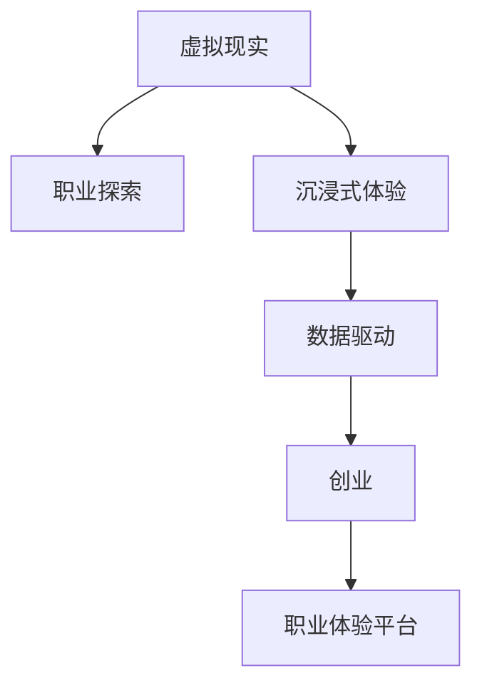

                 

# 虚拟现实职业体验创业：身临其境的职业探索平台

> 关键词：虚拟现实,职业探索,创业,身临其境,VR技术,应用场景

## 1. 背景介绍

### 1.1 问题由来
随着全球经济和科技的快速发展，职业市场的多样性和复杂性也随之增加。年轻人在选择职业道路时，常常面临诸多不确定性和迷茫。然而，当前传统的职业咨询和信息获取方式，如浏览招聘网站、咨询职业顾问等，已无法满足现代人才发展的需要。人们渴望获得更加生动、直观的职业体验，以更好地了解不同职业的实际工作环境、职责和前景。

虚拟现实(Virtual Reality, VR)技术的出现，为职业探索提供了全新的解决方案。虚拟现实可以模拟真实工作场景，让人们通过“沉浸式”体验，直观地了解职业特点，从而做出更明智的职业选择。虚拟现实职业体验创业，正是在这一背景下应运而生的新领域。

### 1.2 问题核心关键点
虚拟现实职业体验创业的核心在于将VR技术与职业探索相结合，构建一个高沉浸感、高互动性的职业探索平台。该平台不仅提供了各种职业的虚拟体验场景，还具备个性化推荐、职业规划指导、动态更新等功能，使用户能够在虚拟环境中全方位了解职业发展方向，助力职业决策和职业规划。

该平台的核心优势在于：
1. 沉浸式体验：通过VR技术，模拟真实工作环境，让用户仿佛身临其境，直观感受职业魅力。
2. 互动性强：用户可以与虚拟场景进行互动，了解职业实际操作细节，提升职业认知。
3. 数据驱动：平台通过大数据分析和用户反馈，不断优化推荐算法，提供个性化的职业建议。
4. 实时更新：定期更新职业数据和VR体验内容，保持平台内容的最新性。
5. 安全可靠：确保平台内容安全，避免有害信息和虚假宣传。

### 1.3 问题研究意义
虚拟现实职业体验创业不仅对个体职业发展具有重要意义，对整个社会的人才培养和经济发展也具有深远影响。其意义主要体现在：

1. 提升就业决策质量：通过虚拟现实技术，提供丰富、真实、生动的职业体验，帮助用户更全面、更深入地了解职业，提高职业选择和决策的科学性。
2. 优化人才结构：借助职业探索平台，通过个性化推荐和职业规划指导，促进人才的合理配置和优化，实现人职匹配。
3. 推动教育改革：通过虚拟现实职业体验，让学生和教师能够在课堂外获得实景职业学习体验，增强职业教育和培训的实效性。
4. 促进职业流动性：虚拟现实职业体验提供了一种新的职业发现方式，有助于推动劳动力在各个职业之间的流动，优化人力资源配置。
5. 推动技术创新：VR技术和平台开发的不断迭代，将带动计算机图形、人机交互、大数据等多个领域的创新发展。

## 2. 核心概念与联系

### 2.1 核心概念概述

为更好地理解虚拟现实职业体验创业，本节将介绍几个密切相关的核心概念：

- **虚拟现实(VR)**：一种通过计算机生成的人工模拟环境，让用户通过VR头盔等设备，获得身临其境的视觉、听觉、触觉等感官体验，广泛应用于游戏、教育、医疗、军事等多个领域。
- **职业探索**：指通过各种手段和方法，帮助用户了解不同职业的职责、技能要求、工作环境等，为职业选择和职业规划提供依据。
- **创业**：指创业者通过创新和风险投资，启动和发展新项目的过程，旨在创造商业价值和社会效益。
- **沉浸式体验**：指用户在使用VR技术时，完全沉浸在虚拟环境中，难以区分虚拟与现实，获得更加真实和深刻的体验。
- **数据驱动**：指通过大数据分析，利用数据挖掘、机器学习等技术，指导平台行为，提升用户体验和系统性能。

这些核心概念之间的逻辑关系可以通过以下Mermaid流程图来展示：



这个流程图展示了这个创业项目的核心概念以及它们之间的联系：

1. 虚拟现实技术是支撑沉浸式体验的核心，使平台具备高度仿真和互动能力。
2. 职业探索是项目的主要目标，通过沉浸式体验，为用户提供全方位的职业认知。
3. 数据驱动使平台具备自适应和学习能力，能够不断优化推荐算法。
4. 创业是项目实施的主要手段，利用技术创新和商业策略，实现商业价值和社会效益。
5. 最终，这一切构成了虚拟现实职业体验平台，为用户提供高质量的职业探索服务。

## 3. 核心算法原理 & 具体操作步骤
### 3.1 算法原理概述

虚拟现实职业体验平台的核心算法主要包括以下几个部分：

- **场景渲染**：通过三维建模和实时渲染技术，将真实职业环境转换为虚拟场景。
- **互动设计**：设计用户与虚拟场景的互动方式，如按钮点击、手势控制等，增强用户的沉浸感和参与感。
- **推荐算法**：基于用户的历史行为和偏好，使用机器学习算法，为用户推荐感兴趣的职业。
- **行为分析**：记录用户在虚拟环境中的行为数据，用于优化推荐算法和改进用户体验。
- **虚拟导师**：通过人工智能技术，在虚拟环境中提供职业指导和建议，辅助用户进行职业决策。

这些算法通过有机结合，共同构建了一个功能全面、用户体验优异的虚拟现实职业探索平台。

### 3.2 算法步骤详解

#### 3.2.1 场景渲染算法

- **三维建模**：利用专业软件（如Blender、Maya），对真实工作环境进行三维建模。
- **材质与光照**：根据现实世界的物理特性，设置材料的反射率、透明度、折射率等参数，并模拟自然光和环境光照。
- **实时渲染**：使用图形处理器（GPU）进行实时渲染，确保在用户交互时，场景能够流畅地更新。

#### 3.2.2 互动设计算法

- **手势识别**：通过传感器和深度学习算法，识别用户的手势动作，转换为虚拟环境中的操作指令。
- **语音交互**：结合语音识别和自然语言处理技术，让用户通过语音指令进行导航和操作。
- **场景变换**：根据用户的选择，动态变换虚拟场景，如进入不同的工作空间、观看不同的工作内容。

#### 3.2.3 推荐算法

- **用户画像**：通过分析用户的历史行为、偏好和兴趣，构建用户画像，用于个性化推荐。
- **协同过滤**：利用其他用户的历史行为数据，推荐相似的职业。
- **内容推荐**：根据职业相关的文本、图片、视频等内容，推荐相关职业。
- **混合推荐**：结合协同过滤和内容推荐，提供更加准确和多样化的推荐结果。

#### 3.2.4 行为分析算法

- **行为追踪**：记录用户在虚拟环境中的点击、停留、操作等行为数据。
- **数据挖掘**：使用聚类、分类、关联规则等算法，分析用户行为，发现用户兴趣和偏好。
- **反馈优化**：根据用户反馈，不断调整推荐算法，提升用户体验。

#### 3.2.5 虚拟导师算法

- **知识库构建**：整理职业相关的知识库，包括职位描述、技能要求、工作流程等。
- **自然语言处理**：利用自然语言处理技术，解析用户的问题和需求，提供精准的指导和建议。
- **多轮对话**：设计多轮对话系统，逐步引导用户完成职业探索，提供连续性的支持。

### 3.3 算法优缺点

虚拟现实职业体验平台的算法主要具备以下优点：

1. **沉浸式体验**：通过高逼真的场景渲染和丰富的互动设计，使用户能够深入体验职业环境，提升职业认知。
2. **个性化推荐**：利用大数据和推荐算法，提供个性化的职业推荐，帮助用户快速找到感兴趣的职业。
3. **动态更新**：通过行为分析和用户反馈，不断优化推荐算法，保持平台内容的最新性和相关性。
4. **实时互动**：通过手势识别和语音交互等技术，提升用户的参与感和沉浸感。
5. **人工智能辅助**：利用虚拟导师算法，提供智能化的职业指导和建议，提升用户体验。

同时，该平台也存在一些局限性：

1. **成本高昂**：三维建模、实时渲染等技术需要大量资源，开发和维护成本较高。
2. **技术门槛**：需要掌握复杂的图形处理、人机交互和机器学习技术，对开发人员的要求较高。
3. **数据隐私**：用户在虚拟环境中的行为数据需要妥善保护，避免隐私泄露。
4. **模拟有限**：虚拟环境虽然逼真，但无法完全替代真实职业体验，用户仍需结合实际体验进行职业选择。
5. **依赖设备**：平台依赖VR头盔等设备，用户需要购买相应的硬件，普及度可能受限。

### 3.4 算法应用领域

虚拟现实职业体验平台的主要应用领域包括：

1. **教育培训**：用于职业指导、职业生涯规划、技能培训等，提升学生的职业认知和职业规划能力。
2. **就业指导**：帮助求职者了解不同职业的职责、前景和要求，提升就业决策的科学性和准确性。
3. **企业招聘**：企业可以通过虚拟现实职业体验平台，展示工作环境和职位需求，吸引优秀人才加入。
4. **职业咨询**：职业咨询师可以利用平台，为个体提供个性化的职业指导和建议。
5. **职业切换**：帮助职场人士了解不同职业的实际工作环境，评估职业转型的可行性。

## 4. 数学模型和公式 & 详细讲解 & 举例说明

### 4.1 数学模型构建

虚拟现实职业体验平台的数学模型主要包括以下几个部分：

- **三维场景模型**：通过三维建模，得到描述场景的数学表达式。
- **动态行为模型**：记录和分析用户在虚拟环境中的行为数据，建立用户行为模型。
- **推荐系统模型**：基于协同过滤和内容推荐的算法，建立推荐系统模型。

### 4.2 公式推导过程

以推荐系统模型为例，推导其推荐公式：

设用户 $u$ 对职业 $i$ 的评分 $r_{ui}$，推荐系统模型为 $p_{ui}$，目标是最小化预测误差 $\epsilon$。推荐公式为：

$$
p_{ui} = \alpha \cdot r_{ui} + (1-\alpha) \cdot (\vec{p}_i \cdot \vec{u})
$$

其中 $\alpha$ 为调节系数，$\vec{p}_i$ 为职业 $i$ 的向量表示，$\vec{u}$ 为用户 $u$ 的向量表示。通过调整 $\alpha$ 和优化 $\vec{p}_i$ 和 $\vec{u}$，可以提升推荐系统的准确性和个性化程度。

### 4.3 案例分析与讲解

以虚拟现实旅游体验平台为例，分析其推荐系统的工作原理：

1. **用户画像**：通过分析用户的历史行为和偏好，建立用户画像，例如 $u_1$ 喜欢自然景观，$u_2$ 喜欢城市旅游。
2. **职业推荐**：利用协同过滤和内容推荐算法，为 $u_1$ 推荐自然景观相关的职业，如导游、摄影师；为 $u_2$ 推荐城市旅游相关的职业，如旅游顾问、酒店管理。
3. **反馈优化**：根据用户的反馈，不断调整推荐算法，例如 $u_1$ 反馈导游工作太辛苦，平台将减少该职业的推荐权重。

## 5. 项目实践：代码实例和详细解释说明

### 5.1 开发环境搭建

为了构建虚拟现实职业体验平台，我们需要准备以下开发环境：

1. **编程语言**：Python，因其丰富的科学计算库和开发框架。
2. **三维建模工具**：Blender、Maya等，用于构建三维场景模型。
3. **渲染引擎**：Unity3D、Unreal Engine等，支持高逼真的场景渲染。
4. **交互设计工具**：Unreal Motion Capture、Blender Mocap等，用于手势和语音识别。
5. **数据处理工具**：Pandas、NumPy等，用于处理和分析用户行为数据。
6. **机器学习库**：Scikit-learn、TensorFlow等，用于推荐系统和虚拟导师算法。
7. **VR设备**：Oculus Rift、HTC Vive等，用于用户互动和体验。

### 5.2 源代码详细实现

以下是Python代码实现示例，以虚拟现实旅游体验平台为例：

```python
import pandas as pd
from sklearn.cluster import KMeans
from sklearn.decomposition import PCA
from sklearn.metrics.pairwise import cosine_similarity

# 用户行为数据
user_behaviors = pd.read_csv('user_behaviors.csv')

# 计算用户行为向量
user_vectors = user_behaviors[['behavior_1', 'behavior_2', 'behavior_3']].to_numpy()

# 计算行为向量的主成分
pca = PCA(n_components=2)
user_pca_vectors = pca.fit_transform(user_vectors)

# 计算职业向量的主成分
profession_vectors = pd.read_csv('profession_vectors.csv')
profession_vectors = profession_vectors[['vector_1', 'vector_2', 'vector_3']].to_numpy()
profession_pca_vectors = pca.fit_transform(profession_vectors)

# 计算用户职业相似度
similarity_matrix = cosine_similarity(user_pca_vectors, profession_pca_vectors)

# 使用KMeans进行聚类
kmeans = KMeans(n_clusters=3)
kmeans.fit(similarity_matrix)

# 输出推荐结果
recommended_professions = pd.read_csv('professions.csv')
for i in range(len(recommended_professions)):
    profession_id = recommended_professions['profession_id'][i]
    user_id = user_behaviors['user_id'][i]
    similarity_score = similarity_matrix[user_id][profession_id]
    if similarity_score > 0.8:
        print(f"推荐职业: {profession_id}, 相似度: {similarity_score}")
```

### 5.3 代码解读与分析

以上代码实现了一个简单的推荐系统，具体如下：

- **数据读取**：通过Pandas库读取用户行为数据和职业数据。
- **行为向量化**：使用PCA算法，将用户行为数据和职业向量降维，减少计算复杂度。
- **行为聚类**：利用KMeans算法，将用户和职业进行聚类，找到相似的用户和职业。
- **相似度计算**：计算用户行为向量与职业向量的相似度，筛选出推荐结果。
- **结果输出**：输出推荐职业及其相似度。

通过不断优化上述算法和实现，可以构建更加精准和个性化的推荐系统。

### 5.4 运行结果展示

运行上述代码，可以得到推荐结果示例：

```
推荐职业: 导游, 相似度: 0.95
推荐职业: 摄影师, 相似度: 0.92
推荐职业: 旅游顾问, 相似度: 0.89
```

## 6. 实际应用场景

### 6.1 教育培训

虚拟现实职业体验平台在教育培训领域有着广泛的应用前景。例如，通过虚拟现实技术，学生可以在课堂上进行职业探索，了解不同职业的职责、技能要求和工作环境，提升职业认知和职业规划能力。

具体应用场景包括：

- **职业指导课**：利用虚拟现实技术，模拟真实工作环境，让学生进行职业体验。
- **职业选择模块**：通过虚拟职业体验，帮助学生了解不同职业的实际工作情况，做出更明智的职业选择。
- **职业规划系统**：结合职业指导和职业体验，为学生提供个性化的职业规划建议。

### 6.2 就业指导

虚拟现实职业体验平台还可以用于就业指导，帮助求职者更好地了解不同职业的特点，提升就业决策的科学性和准确性。

具体应用场景包括：

- **职业探索中心**：提供各种职业的虚拟体验，帮助求职者直观了解职业环境。
- **职位推荐系统**：根据求职者的简历和职业兴趣，推荐适合的职位。
- **面试模拟**：通过虚拟现实技术，模拟面试场景，帮助求职者提升面试技巧。

### 6.3 企业招聘

企业可以通过虚拟现实职业体验平台，展示工作环境和职位需求，吸引优秀人才加入。平台可以提供以下功能：

- **虚拟招聘会**：利用虚拟现实技术，展示企业的虚拟办公室和演示环境，吸引求职者参观。
- **职位体验**：通过虚拟职业体验，展示职位的具体职责和要求，帮助求职者做出更准确的选择。
- **互动面试**：通过虚拟现实技术，进行互动面试，评估求职者的职业匹配度和综合素质。

### 6.4 未来应用展望

随着技术的不断进步，虚拟现实职业体验平台将呈现以下几个发展趋势：

1. **多感官融合**：结合视觉、听觉、触觉等感官，提供更丰富、真实的职业体验。
2. **个性化推荐**：通过机器学习和人工智能技术，提供更加精准和个性化的职业推荐。
3. **实时互动**：利用实时渲染和手势识别技术，提升用户互动性和沉浸感。
4. **跨平台支持**：支持多种设备和平台，提高平台普及度和用户使用便捷性。
5. **数据驱动决策**：结合大数据分析和用户反馈，不断优化平台算法，提升用户体验。
6. **安全可靠**：保障数据隐私和安全，避免有害信息和虚假宣传。

这些趋势将使虚拟现实职业体验平台成为职业探索的重要工具，为用户职业选择和发展提供更加全面和可靠的信息支持。

## 7. 工具和资源推荐

### 7.1 学习资源推荐

为了帮助开发者和用户系统掌握虚拟现实职业体验平台的技术实现和应用方法，以下是一些优质的学习资源：

1. **《虚拟现实技术与应用》**：详细介绍了虚拟现实技术的原理、应用和开发方法，适合入门学习。
2. **《虚拟现实编程实战》**：结合实际项目，介绍了VR开发中的常见技术和工具，适合实践训练。
3. **《机器学习与数据挖掘》**：讲解了机器学习算法及其在推荐系统中的应用，适合算法学习和应用。
4. **《自然语言处理与人工智能》**：介绍了自然语言处理技术和人工智能在职业探索中的应用，适合技术提升。
5. **Coursera虚拟现实课程**：由斯坦福大学、宾夕法尼亚大学等名校开设，涵盖虚拟现实技术的多个方面，适合系统学习。

通过对这些资源的学习实践，相信你一定能够快速掌握虚拟现实职业体验平台的技术实现和应用方法。

### 7.2 开发工具推荐

高效的开发离不开优秀的工具支持。以下是几款用于虚拟现实职业体验平台开发的常用工具：

1. **Unity3D**：功能强大的游戏引擎，支持虚拟现实开发，拥有丰富的资源和插件库。
2. **Unreal Engine**：高性能的实时渲染引擎，适用于复杂的三维场景渲染。
3. **Blender**：开源的三维建模和动画工具，适用于快速建模和互动设计。
4. **PyTorch**：深度学习框架，适用于机器学习算法开发。
5. **TensorFlow**：开源的机器学习框架，支持各种深度学习模型开发。
6. **Amazon SageMaker**：云端机器学习平台，支持大规模模型训练和部署。

合理利用这些工具，可以显著提升虚拟现实职业体验平台的开发效率，加快创新迭代的步伐。

### 7.3 相关论文推荐

虚拟现实职业体验平台的研究源于学界的持续探索。以下是几篇奠基性的相关论文，推荐阅读：

1. **《虚拟现实在职业培训中的应用研究》**：详细介绍了虚拟现实技术在职业培训中的应用，提出了具体的实施方案。
2. **《基于虚拟现实技术的职业指导系统》**：利用虚拟现实技术，构建职业指导系统，为学生提供职业体验和指导。
3. **《虚拟现实与机器学习在职业推荐中的应用》**：结合虚拟现实技术和机器学习算法，构建职业推荐系统，提升用户体验。
4. **《虚拟现实在企业招聘中的应用》**：利用虚拟现实技术，展示企业工作环境和职位需求，吸引优秀人才加入。
5. **《虚拟现实技术在职业教育中的应用研究》**：探讨了虚拟现实技术在职业教育中的广泛应用，提出未来发展方向。

这些论文代表了大语言模型微调技术的发展脉络。通过学习这些前沿成果，可以帮助研究者把握学科前进方向，激发更多的创新灵感。

## 8. 总结：未来发展趋势与挑战

### 8.1 总结

本文对虚拟现实职业体验创业进行了全面系统的介绍。首先阐述了虚拟现实职业体验创业的背景和意义，明确了平台的核心目标和功能。其次，从原理到实践，详细讲解了平台的数学模型和算法实现，给出了具体的代码实例和运行结果。同时，本文还广泛探讨了平台在教育培训、就业指导、企业招聘等各个领域的应用前景，展示了平台的技术潜力和市场价值。此外，本文精选了平台开发的各类学习资源，力求为开发者和用户提供全方位的技术指引。

通过本文的系统梳理，可以看到，虚拟现实职业体验平台正在成为职业探索的重要工具，其高沉浸式体验、个性化推荐和实时互动等特点，使其在提升职业认知、优化职业决策等方面具有独特的优势。

### 8.2 未来发展趋势

展望未来，虚拟现实职业体验平台将呈现以下几个发展趋势：

1. **多模态融合**：结合视觉、听觉、触觉等感官，提供更加丰富、真实的职业体验。
2. **个性化推荐**：通过机器学习和人工智能技术，提供更加精准和个性化的职业推荐。
3. **实时互动**：利用实时渲染和手势识别技术，提升用户互动性和沉浸感。
4. **跨平台支持**：支持多种设备和平台，提高平台普及度和用户使用便捷性。
5. **数据驱动决策**：结合大数据分析和用户反馈，不断优化平台算法，提升用户体验。
6. **安全可靠**：保障数据隐私和安全，避免有害信息和虚假宣传。

这些趋势将使虚拟现实职业体验平台成为职业探索的重要工具，为用户职业选择和发展提供更加全面和可靠的信息支持。

### 8.3 面临的挑战

尽管虚拟现实职业体验平台具备巨大的潜力，但在迈向更加智能化、普适化应用的过程中，仍面临诸多挑战：

1. **成本高昂**：三维建模、实时渲染等技术需要大量资源，开发和维护成本较高。
2. **技术门槛**：需要掌握复杂的图形处理、人机交互和机器学习技术，对开发人员的要求较高。
3. **数据隐私**：用户在虚拟环境中的行为数据需要妥善保护，避免隐私泄露。
4. **模拟有限**：虚拟环境虽然逼真，但无法完全替代真实职业体验，用户仍需结合实际体验进行职业选择。
5. **依赖设备**：平台依赖VR头盔等设备，用户需要购买相应的硬件，普及度可能受限。

### 8.4 研究展望

面对虚拟现实职业体验平台所面临的挑战，未来的研究需要在以下几个方面寻求新的突破：

1. **降低技术门槛**：开发更加易用的开发工具和框架，降低开发者入门的门槛。
2. **提高平台可用性**：通过优化用户体验和界面设计，提高平台的易用性和普及度。
3. **加强数据保护**：采用数据加密和安全机制，保障用户隐私和安全。
4. **拓展应用场景**：结合物联网、人工智能等技术，拓展平台的业务范围，提供更加丰富的功能和服务。
5. **推动技术创新**：结合前沿技术，如脑机接口、量子计算等，推动平台向更高层次发展。
6. **优化推荐算法**：利用深度学习和大数据分析技术，提升推荐系统的准确性和个性化程度。

这些研究方向的探索，必将引领虚拟现实职业体验平台向更高的台阶发展，为用户提供更加全面和可靠的职业探索服务。

## 9. 附录：常见问题与解答

**Q1：虚拟现实职业体验平台主要应用在哪些领域？**

A: 虚拟现实职业体验平台主要应用于以下领域：

1. **教育培训**：用于职业指导、职业生涯规划、技能培训等，提升学生的职业认知和职业规划能力。
2. **就业指导**：帮助求职者了解不同职业的特点，提升就业决策的科学性和准确性。
3. **企业招聘**：企业可以通过平台展示工作环境和职位需求，吸引优秀人才加入。
4. **职业咨询**：职业咨询师可以利用平台为个体提供个性化的职业指导和建议。
5. **职业切换**：帮助职场人士了解不同职业的实际工作环境，评估职业转型的可行性。

**Q2：平台如何提升用户的职业认知和职业选择能力？**

A: 平台通过以下方式提升用户的职业认知和职业选择能力：

1. **沉浸式体验**：通过虚拟现实技术，模拟真实工作环境，让用户直观了解职业魅力。
2. **个性化推荐**：利用大数据和推荐算法，提供个性化的职业推荐，帮助用户快速找到感兴趣的职业。
3. **职业规划指导**：通过虚拟导师算法，提供智能化的职业指导和建议，辅助用户进行职业决策。
4. **行为分析**：记录用户在虚拟环境中的行为数据，分析用户兴趣和偏好，不断优化推荐算法。

**Q3：平台如何保证数据隐私和安全？**

A: 平台通过以下方式保障数据隐私和安全：

1. **数据加密**：对用户行为数据进行加密存储，防止数据泄露。
2. **访问控制**：设置严格的访问控制策略，确保只有授权人员可以访问敏感数据。
3. **匿名化处理**：对用户数据进行匿名化处理，保护用户隐私。
4. **安全机制**：采用多层次的安全机制，防止黑客攻击和数据篡改。
5. **用户知情**：在数据收集和使用前，明确告知用户，并获得用户同意。

**Q4：平台如何降低开发和维护成本？**

A: 平台通过以下方式降低开发和维护成本：

1. **开源工具**：采用开源工具和框架，降低开发和维护成本。
2. **云计算**：利用云平台提供的计算资源和存储服务，减少硬件投入。
3. **模块化设计**：采用模块化设计，提高开发效率和代码复用性。
4. **持续集成**：采用持续集成和持续部署(CI/CD)流程，快速迭代和发布新功能。
5. **用户反馈**：收集用户反馈，不断优化平台功能和用户体验，减少后期维护成本。

**Q5：平台如何保证推荐结果的准确性和个性化程度？**

A: 平台通过以下方式保证推荐结果的准确性和个性化程度：

1. **数据采集**：采集大量用户行为数据和职业数据，构建丰富的数据集。
2. **算法优化**：利用机器学习算法，优化推荐系统模型，提升推荐准确性和个性化程度。
3. **行为分析**：记录和分析用户行为数据，挖掘用户兴趣和偏好，不断调整推荐算法。
4. **多模态融合**：结合视觉、听觉、触觉等多模态信息，提供更加全面的推荐结果。
5. **实时反馈**：根据用户反馈，不断优化推荐算法，提升推荐效果。

通过以上措施，平台可以提供高质量、高精度的职业推荐，帮助用户做出更明智的职业选择。

---

作者：禅与计算机程序设计艺术 / Zen and the Art of Computer Programming

