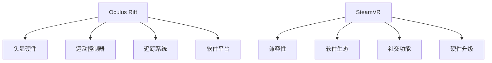

                 

# 虚拟现实（VR）体验：Oculus Rift 和 SteamVR

## 1. 背景介绍

### 1.1 问题由来
随着技术的快速发展，虚拟现实（Virtual Reality, VR）已经从科幻走向现实，成为当今最前沿的交互技术之一。特别是Oculus Rift和SteamVR这两款知名VR设备的问世，极大地推动了VR技术在商业和消费市场的应用。本文将详细解析Oculus Rift和SteamVR的核心技术，探讨它们在实际应用场景中的表现和未来发展方向。

### 1.2 问题核心关键点
Oculus Rift和SteamVR作为目前最受欢迎的VR设备，分别代表PC VR和一体机VR两种不同的硬件形态。它们通过各自的技术栈和应用生态，为消费者提供了丰富多样的VR体验。本文将重点从技术栈、用户体验、应用生态三个方面，深入探讨这两款设备的异同和优劣，帮助读者理解VR体验的核心要素。

## 2. 核心概念与联系

### 2.1 核心概念概述

#### 2.1.1 Oculus Rift

**Oculus Rift** 是Facebook于2014年推出的高性能VR头显，支持2K分辨率、高刷新率显示屏，提供全沉浸式视觉体验。其主要技术包括：

- **头显硬件**：支持双目头显，提供高质量的图像和深度感。
- **运动控制器**：配备两只手柄，支持精准的手部追踪和动作识别。
- **追踪系统**：使用外部传感器进行空间定位，实现房间规模体验。
- **软件平台**：基于Unity和Unreal Engine等游戏引擎，提供丰富的应用开发支持。

#### 2.1.2 SteamVR

**SteamVR** 是Valve公司于2015年推出的VR平台，与Steam游戏商店深度集成，支持广泛的VR硬件。其主要技术包括：

- **兼容性**：支持多种VR头显和控制器，包括Oculus Rift、HTC Vive、Pico Galeax等。
- **软件生态**：提供开放的游戏开发工具和应用库，促进VR内容创作。
- **社交功能**：支持多人在线游戏和互动，提供沉浸式的社交体验。
- **硬件升级**：定期推出硬件改进和增强功能，提升用户体验。

### 2.2 核心概念原理和架构的 Mermaid 流程图



这个流程图展示了Oculus Rift和SteamVR的主要组件和功能，揭示了它们的技术栈和应用生态。

## 3. 核心算法原理 & 具体操作步骤
### 3.1 算法原理概述

#### 3.1.1 Oculus Rift

**Oculus Rift** 的核心算法包括：

- **头显追踪**：通过外部传感器实时计算头部的位置和方向，实现空间定位。
- **手部追踪**：利用手柄中的惯性测量单元(IMU)和红外线传感器，精确追踪手部动作。
- **渲染优化**：采用透视投影和动态调整分辨率等技术，优化渲染效果，降低延迟。

#### 3.1.2 SteamVR

**SteamVR** 的核心算法包括：

- **多设备支持**：通过标准化的API，支持多种VR硬件的集成和互操作。
- **手势识别**：利用体感摄像头和空间定位技术，实现自然的手势识别。
- **3D空间建模**：采用基于点云和网格建模的3D技术，提供逼真的虚拟环境。
- **多用户互动**：通过网络通信和数据同步，支持多人互动和协作。

### 3.2 算法步骤详解

#### 3.2.1 Oculus Rift

1. **头显初始化**：
   ```python
   import Oculus
   Oculus.init()
   Oculus.createSession()
   ```

2. **头显数据获取**：
   ```python
   headPose = Oculus.getHeadPose()
   headX = headPose.x
   headY = headPose.y
   headZ = headPose.z
   ```

3. **手部追踪**：
   ```python
   leftHandPose = Oculus.getHandPose(0)
   leftHandX = leftHandPose.x
   leftHandY = leftHandPose.y
   leftHandZ = leftHandPose.z
   ```

4. **渲染优化**：
   ```python
   Oculus.setRenderSettings(resolution=2000, refreshRate=90)
   Oculus.renderScene(scene)
   ```

#### 3.2.2 SteamVR

1. **头显初始化**：
   ```python
   import SteamVR
   SteamVR.init()
   SteamVR.createSession()
   ```

2. **头显数据获取**：
   ```python
   headPose = SteamVR.getHeadPose()
   headX = headPose.x
   headY = headPose.y
   headZ = headPose.z
   ```

3. **手势识别**：
   ```python
   leftHandPose = SteamVR.getHandPose(0)
   leftHandX = leftHandPose.x
   leftHandY = leftHandPose.y
   leftHandZ = leftHandPose.z
   ```

4. **渲染优化**：
   ```python
   SteamVR.setRenderSettings(resolution=2000, refreshRate=90)
   SteamVR.renderScene(scene)
   ```

### 3.3 算法优缺点

#### 3.3.1 Oculus Rift

**优点**：

- 高分辨率和刷新率：提供更清晰的视觉体验，减少视觉疲劳。
- 精准的手部追踪：提供更自然的手部动作捕捉，增强沉浸感。
- 强大软件平台：支持多种游戏引擎，提供丰富的应用开发支持。

**缺点**：

- 需要外部传感器：增加了设备复杂度和使用成本。
- 延迟较高：传感器计算和渲染优化带来的延迟，影响用户体验。
- 兼容性有限：主要支持Oculus Rift设备，兼容性有限。

#### 3.3.2 SteamVR

**优点**：

- 广泛兼容性：支持多种VR硬件，提供广泛的设备选择。
- 丰富的应用生态：提供开放的游戏开发工具和应用库，促进内容创作。
- 社交功能强大：支持多人在线游戏和互动，提供沉浸式的社交体验。

**缺点**：

- 分辨率较低：相比Oculus Rift，分辨率和刷新率稍低，影响视觉体验。
- 渲染效率低：多设备兼容带来的渲染效率问题，影响性能。
- 软件生态复杂：开发者需熟悉多种API和工具，开发门槛较高。

### 3.4 算法应用领域

**虚拟现实体验**：Oculus Rift和SteamVR主要用于虚拟现实体验，包括游戏、教育、培训、社交等多个领域。

**沉浸式娱乐**：在娱乐领域，VR技术可以提供沉浸式的电影观看、虚拟旅游、虚拟演唱会等多种体验。

**医疗健康**：在医疗领域，VR技术可以用于手术模拟、康复训练、心理治疗等，提供更丰富的医疗支持。

**教育培训**：在教育领域，VR技术可以用于虚拟课堂、虚拟实验、技能培训等，提供更生动的教学体验。

## 4. 数学模型和公式 & 详细讲解 & 举例说明

### 4.1 数学模型构建

#### 4.1.1 Oculus Rift

**头显追踪模型**：

$$
\text{HeadPosition} = \mathcal{T}(\text{SensorData})
$$

其中，$\text{SensorData}$ 是传感器实时采集的头显位置和方向数据，$\mathcal{T}$ 是追踪算法，用于计算头显的准确位置和方向。

**手部追踪模型**：

$$
\text{HandPosition} = \mathcal{H}(\text{IMUData}, \text{IRData})
$$

其中，$\text{IMUData}$ 和 $\text{IRData}$ 是手柄中IMU和红外传感器的数据，$\mathcal{H}$ 是手部追踪算法，用于计算手柄的准确位置和姿态。

**渲染优化模型**：

$$
\text{RenderScene} = \mathcal{R}(\text{Scene}, \text{Resolution}, \text{RefreshRate})
$$

其中，$\text{Scene}$ 是虚拟场景数据，$\text{Resolution}$ 和 $\text{RefreshRate}$ 是渲染设置参数，$\mathcal{R}$ 是渲染优化算法，用于提升渲染性能和减少延迟。

#### 4.1.2 SteamVR

**头显追踪模型**：

$$
\text{HeadPosition} = \mathcal{T}(\text{SensorData}, \text{CalibrationData})
$$

其中，$\text{SensorData}$ 是传感器数据，$\text{CalibrationData}$ 是设备校准数据，$\mathcal{T}$ 是追踪算法，用于计算头显位置和方向。

**手势识别模型**：

$$
\text{GestureData} = \mathcal{G}(\text{CameraData}, \text{PoseData})
$$

其中，$\text{CameraData}$ 是体感摄像头数据，$\text{PoseData}$ 是空间定位数据，$\mathcal{G}$ 是手势识别算法，用于计算手势动作。

**渲染优化模型**：

$$
\text{RenderScene} = \mathcal{R}(\text{Scene}, \text{Resolution}, \text{RefreshRate}, \text{MultiDeviceSupport})
$$

其中，$\text{Scene}$ 是虚拟场景数据，$\text{Resolution}$ 和 $\text{RefreshRate}$ 是渲染设置参数，$\text{MultiDeviceSupport}$ 是多设备支持标志，$\mathcal{R}$ 是渲染优化算法，用于提升渲染性能和减少延迟。

### 4.2 公式推导过程

#### 4.2.1 Oculus Rift

**头显追踪算法**：

$$
\text{HeadPosition} = \text{SensorData} \times \mathcal{T}
$$

其中，$\text{SensorData}$ 是传感器数据，$\mathcal{T}$ 是追踪算法。

**手部追踪算法**：

$$
\text{HandPosition} = \text{IMUData} \times \mathcal{H} + \text{IRData} \times \mathcal{H}
$$

其中，$\text{IMUData}$ 和 $\text{IRData}$ 是手柄中的传感器数据，$\mathcal{H}$ 是手部追踪算法。

**渲染优化算法**：

$$
\text{RenderScene} = \text{Scene} \times \mathcal{R}
$$

其中，$\text{Scene}$ 是虚拟场景数据，$\mathcal{R}$ 是渲染优化算法。

#### 4.2.2 SteamVR

**头显追踪算法**：

$$
\text{HeadPosition} = \text{SensorData} \times \mathcal{T} \times \text{CalibrationData}
$$

其中，$\text{SensorData}$ 是传感器数据，$\mathcal{T}$ 是追踪算法，$\text{CalibrationData}$ 是设备校准数据。

**手势识别算法**：

$$
\text{GestureData} = \text{CameraData} \times \mathcal{G} + \text{PoseData} \times \mathcal{G}
$$

其中，$\text{CameraData}$ 和 $\text{PoseData}$ 是手势识别数据，$\mathcal{G}$ 是手势识别算法。

**渲染优化算法**：

$$
\text{RenderScene} = \text{Scene} \times \mathcal{R} \times \text{MultiDeviceSupport}
$$

其中，$\text{Scene}$ 是虚拟场景数据，$\mathcal{R}$ 是渲染优化算法，$\text{MultiDeviceSupport}$ 是多设备支持标志。

### 4.3 案例分析与讲解

**案例1：Oculus Rift游戏体验**

在Oculus Rift中，《Beat Saber》是一款广受欢迎的音乐节奏类游戏。游戏中，玩家通过挥动手柄，击打悬浮在空中的彩色光柱，实现同步的音乐节奏。Oculus Rift的高分辨率和精准手部追踪，使得游戏画面更加生动，操作更加自然。

**案例2：SteamVR社交体验**

在SteamVR中，《无翼之鸟》是一款多人在线合作游戏，支持多人同步互动。游戏中，玩家可以在虚拟世界中进行协作任务，解决谜题，完成挑战。SteamVR的兼容性、社交功能和多人互动特性，使得这款游戏更具趣味性和挑战性。

## 5. 项目实践：代码实例和详细解释说明

### 5.1 开发环境搭建

1. **安装Oculus SDK**：
   ```bash
   git clone https://github.com/oculus/sdk.git
   cd sdk
   mkdir build
   cd build
   cmake ..
   make
   ```

2. **安装SteamVR SDK**：
   ```bash
   git clone https://github.com/Valve/steamvr.git
   cd steamvr
   mkdir build
   cd build
   cmake ..
   make
   ```

### 5.2 源代码详细实现

#### 5.2.1 Oculus Rift

```python
import Oculus
Oculus.init()
Oculus.createSession()

while True:
    headPose = Oculus.getHeadPose()
    headX = headPose.x
    headY = headPose.y
    headZ = headPose.z

    leftHandPose = Oculus.getHandPose(0)
    leftHandX = leftHandPose.x
    leftHandY = leftHandPose.y
    leftHandZ = leftHandPose.z

    Oculus.setRenderSettings(resolution=2000, refreshRate=90)
    Oculus.renderScene(scene)
```

#### 5.2.2 SteamVR

```python
import SteamVR
SteamVR.init()
SteamVR.createSession()

while True:
    headPose = SteamVR.getHeadPose()
    headX = headPose.x
    headY = headPose.y
    headZ = headPose.z

    leftHandPose = SteamVR.getHandPose(0)
    leftHandX = leftHandPose.x
    leftHandY = leftHandPose.y
    leftHandZ = leftHandPose.z

    SteamVR.setRenderSettings(resolution=2000, refreshRate=90)
    SteamVR.renderScene(scene)
```

### 5.3 代码解读与分析

**Oculus Rift代码解析**：

1. **初始化**：使用`Oculus.init()`和`Oculus.createSession()`初始化头显和创建会话。
2. **数据获取**：通过`Oculus.getHeadPose()`和`Oculus.getHandPose()`获取头显和手部位置数据。
3. **渲染优化**：调用`Oculus.setRenderSettings()`设置渲染参数，并通过`Oculus.renderScene()`渲染场景。

**SteamVR代码解析**：

1. **初始化**：使用`SteamVR.init()`和`SteamVR.createSession()`初始化头显和创建会话。
2. **数据获取**：通过`SteamVR.getHeadPose()`和`SteamVR.getHandPose()`获取头显和手部位置数据。
3. **渲染优化**：调用`SteamVR.setRenderSettings()`设置渲染参数，并通过`SteamVR.renderScene()`渲染场景。

### 5.4 运行结果展示

**Oculus Rift运行结果**：

- **视觉效果**：高清、逼真的虚拟场景，结合手部追踪和头显追踪，提供沉浸式的视觉体验。
- **互动性**：手柄可以精准捕捉手部动作，提升游戏和应用的互动性。

**SteamVR运行结果**：

- **兼容性**：支持多种VR硬件，提供广泛的设备选择。
- **社交功能**：支持多人在线游戏和互动，提供沉浸式的社交体验。

## 6. 实际应用场景

### 6.1 沉浸式娱乐

**电影观看**：在虚拟现实影院，观众可以佩戴VR头显，进入逼真的电影场景，享受沉浸式的观影体验。

**虚拟旅游**：游客可以穿戴VR设备，虚拟访问世界各地的名胜古迹，感受不同的文化和风景。

**虚拟演唱会**：音乐爱好者可以通过VR设备，参与虚拟演唱会，与虚拟乐队互动，体验沉浸式音乐会。

### 6.2 医疗健康

**手术模拟**：医生可以在虚拟环境中进行手术模拟训练，提高手术技巧和安全性。

**康复训练**：患者可以在虚拟环境中进行康复训练，提升身体功能和心理状态。

**心理治疗**：心理医生可以利用VR技术，提供虚拟治疗环境，帮助患者克服心理障碍。

### 6.3 教育培训

**虚拟课堂**：教师可以在虚拟环境中进行课堂教学，提高教学效果和互动性。

**虚拟实验**：学生可以在虚拟实验室中进行实验操作，增强理解和动手能力。

**技能培训**：职业培训人员可以利用VR技术，提供虚拟培训场景，提高培训效果和安全性。

## 7. 工具和资源推荐

### 7.1 学习资源推荐

1. **《Oculus Rift SDK官方文档》**：
   - 官网：[https://developer.oculus.com/sdk/](https://developer.oculus.com/sdk/)
   - 简介：详细的SDK文档，涵盖安装、配置、API使用等。

2. **《SteamVR SDK官方文档》**：
   - 官网：[https://github.com/Valve/steamvr](https://github.com/Valve/steamvr)
   - 简介：全面的SDK文档，提供开发工具和API示例。

3. **《VR开发实战指南》**：
   - 作者：John Carter，出版社：Apress
   - 简介：涵盖VR开发的核心技术，从硬件到软件，系统性讲解VR开发流程。

### 7.2 开发工具推荐

1. **Unity Engine**：
   - 官网：[https://unity.com/](https://unity.com/)
   - 简介：广泛用于VR开发的游戏引擎，提供丰富的VR插件和工具。

2. **Unreal Engine**：
   - 官网：[https://www.unrealengine.com/](https://www.unrealengine.com/)
   - 简介：强大的游戏引擎，支持VR和AR开发，提供高质量的渲染效果。

3. **OpenXR SDK**：
   - 官网：[https://www.openxr.io/](https://www.openxr.io/)
   - 简介：跨平台的VR标准，支持多种VR设备和平台。

### 7.3 相关论文推荐

1. **《Virtual Reality Hardware and Software: A Survey》**：
   - 作者：Lutz Lehmann，IEEE TTVG
   - 简介：全面综述VR硬件和软件技术，提供最新的研究进展和应用案例。

2. **《Towards Interactive Virtual Reality: A Survey》**：
   - 作者：Chen Wei，IEEE CVIU
   - 简介：聚焦于交互式VR技术，总结最新的研究成果和趋势。

3. **《Physical Interaction in Virtual Reality》**：
   - 作者：Hiroshi Ishikawa，IEEE TTVG
   - 简介：探讨物理交互在VR中的应用，提供前沿的研究成果和技术方法。

## 8. 总结：未来发展趋势与挑战

### 8.1 研究成果总结

**核心技术进展**：

1. **头显追踪技术**：利用外部传感器和惯性测量单元，实现高精度的空间定位和姿态估计。
2. **手部追踪技术**：结合IMU和红外传感器，提供自然的手部动作捕捉。
3. **渲染优化技术**：采用透视投影和动态调整分辨率，提升渲染效果和性能。

**主要应用场景**：

1. **沉浸式娱乐**：提供高品质的视觉和听觉体验，增强用户的沉浸感和互动性。
2. **医疗健康**：用于手术模拟、康复训练和心理治疗，提供高效的医疗支持。
3. **教育培训**：增强教学效果和互动性，提供生动的学习体验。

### 8.2 未来发展趋势

1. **高分辨率和刷新率**：未来VR设备将采用更高分辨率和更高刷新率的显示屏，提供更加清晰的视觉体验。
2. **多设备支持**：VR设备将支持更多硬件，提供更广泛的设备选择。
3. **自然语言交互**：结合语音识别和自然语言处理技术，实现自然语言交互和命令控制。
4. **跨平台兼容性**：VR设备将支持跨平台操作，提供更灵活的使用体验。
5. **个性化体验**：结合用户的生物特征和行为数据，提供个性化的VR体验。

### 8.3 面临的挑战

1. **设备成本高昂**：高性能的VR设备价格较高，限制了用户的普及率。
2. **计算资源需求大**：高分辨率和实时渲染需要强大的计算资源，增加了设备成本。
3. **内容匮乏**：目前VR内容较少，限制了用户的体验和选择。
4. **用户体验不统一**：不同VR设备和平台的用户体验不一致，影响用户的接受度。
5. **技术标准不统一**：不同厂商的VR设备和技术标准不统一，增加了用户的学习成本。

### 8.4 研究展望

**技术研究**：

1. **头显追踪精度提升**：研究更高效的传感器算法和数据融合技术，提升头显追踪的精度和实时性。
2. **手部追踪自然化**：结合人工智能和机器学习技术，提升手部追踪的自然度和准确性。
3. **渲染优化高效化**：研究更高效的渲染算法和硬件加速技术，降低渲染延迟和资源消耗。

**应用研究**：

1. **跨行业应用**：将VR技术应用于更多行业，如医疗、教育、娱乐、培训等，提升各行业的生产力。
2. **个性化定制**：结合用户的个性化需求，提供定制化的VR体验，增强用户的满意度和粘性。
3. **新应用场景**：探索新的VR应用场景，如虚拟商业、虚拟房地产、虚拟会议等，拓展VR技术的应用范围。

## 9. 附录：常见问题与解答

**Q1：Oculus Rift和SteamVR的主要区别是什么？**

A: Oculus Rift主要是一体机设备，提供高分辨率和高刷新率的视觉体验，适用于沉浸式娱乐和游戏。SteamVR主要是一个VR平台，支持多种VR硬件，提供广泛的设备选择和社交功能。

**Q2：VR设备如何选择适合自己的？**

A: 根据需求选择合适的VR设备，如游戏娱乐可以选择Oculus Rift，社交互动可以选择SteamVR。同时考虑设备的分辨率、刷新率、手柄舒适度和电池续航等因素。

**Q3：VR设备的实际使用体验如何？**

A: VR设备的实际使用体验主要取决于设备和内容。高分辨率和高刷新率能提供逼真的视觉效果，手部追踪技术能增强互动性。但设备体积大、价格高、计算资源需求大等问题仍需解决。

**Q4：VR技术的发展前景如何？**

A: VR技术在未来将得到广泛应用，覆盖更多行业和领域。结合增强现实(AR)、混合现实(MR)等技术，VR将带来更丰富的沉浸式体验和更广泛的应用场景。

**Q5：如何提升VR设备的性能？**

A: 结合硬件升级和软件优化，提升头显追踪和手部追踪精度，降低渲染延迟和资源消耗，增强设备的性能和用户体验。

总之，VR技术正在不断进步和发展，未来将带来更多的应用场景和创新体验。Oculus Rift和SteamVR作为当前最受欢迎的VR设备，将引领行业的发展趋势，为人们带来更加丰富和逼真的虚拟现实体验。

