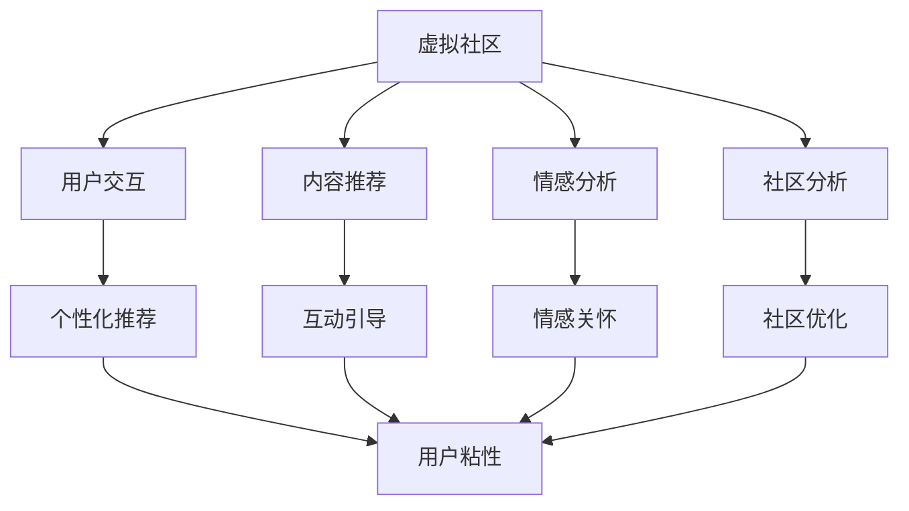

                 

# 虚拟社区构建专家：AI驱动的在线归属感营造顾问

> 关键词：虚拟社区, AI驱动, 在线归属感, 用户交互, 内容推荐, 情感分析, 社区分析, 技术路线

## 1. 背景介绍

### 1.1 问题由来
随着互联网的普及和技术的进步，虚拟社区（Virtual Communities）成为了人们社交和信息获取的重要平台。从社交网络如Facebook、Twitter，到专业论坛如Stack Overflow，再到游戏社区如Steam，虚拟社区在全球范围内都具有广泛的用户基础。然而，虚拟社区的蓬勃发展也带来了一些问题，如用户流失率高、互动质量低、用户体验差等。如何提升用户的在线归属感，增强社区粘性，成为虚拟社区构建中的一大挑战。

### 1.2 问题核心关键点
要解决虚拟社区的归属感问题，首先需要理解“归属感”的本质。归属感是一种情感状态，来源于个体对社区的认同、依恋和参与感。构建虚拟社区的AI驱动归属感营造系统，需要从用户交互、内容推荐、情感分析、社区分析等多个维度综合施策，并通过智能算法实现个性化、精准化的推荐和服务。

## 2. 核心概念与联系

### 2.1 核心概念概述

为更好地理解AI驱动的虚拟社区归属感营造系统，本节将介绍几个密切相关的核心概念：

- **虚拟社区**：指由在线平台支撑，基于共同的兴趣、目标或关系而形成的社交网络。用户可以发表内容、互动交流、参与活动等，形成具有高度粘性的社群。

- **AI驱动归属感营造**：利用人工智能技术，如自然语言处理、推荐系统、情感分析等，通过精准的内容推荐、互动引导和情感关怀，提升用户对虚拟社区的认同感和参与度，增强用户的归属感。

- **用户交互**：指用户间通过文本、图片、视频等形式进行的交流互动，是虚拟社区的重要活动。

- **内容推荐**：指根据用户的兴趣和行为，推荐相关内容，帮助用户发现感兴趣的话题和信息。

- **情感分析**：指分析用户文本、图片、视频中的情感倾向，识别用户情绪变化，提供情感关怀服务。

- **社区分析**：指对虚拟社区的用户行为、互动模式、内容特征等进行数据分析，帮助社区管理者优化社区结构，提升社区活跃度。

这些核心概念之间的逻辑关系可以通过以下Mermaid流程图来展示：



这个流程图展示了虚拟社区构建中AI驱动归属感营造系统的关键环节：通过用户交互、内容推荐、情感分析、社区分析等模块的协同工作，不断优化虚拟社区的生态系统，最终提升用户的在线归属感。

## 3. 核心算法原理 & 具体操作步骤
### 3.1 算法原理概述

AI驱动的虚拟社区归属感营造系统，其核心思想是通过数据驱动、智能推荐等技术，为用户提供个性化、精准化的内容和服务，从而增强用户对社区的归属感。该系统的核心算法包括但不限于自然语言处理(NLP)、推荐系统、情感分析等，旨在实现以下目标：

- 精准的内容推荐，让用户及时获取到感兴趣的信息，提升参与度。
- 智能的互动引导，通过AI生成和个性化回复，增加用户间的交流频次和深度。
- 情感的精准分析，识别用户情绪变化，提供及时的心理支持和情感关怀。
- 社区的整体优化，通过数据驱动的分析，不断改进社区结构，提升用户体验。

### 3.2 算法步骤详解

AI驱动归属感营造系统的构建，通常包括以下几个关键步骤：

**Step 1: 数据收集与预处理**
- 收集社区内的各类数据，如用户行为数据、互动数据、内容数据等。
- 对数据进行清洗、去重、格式化等预处理，保证数据质量。

**Step 2: 用户画像构建**
- 根据收集到的数据，构建用户画像，包括兴趣偏好、行为习惯、社交关系等。
- 通过协同过滤、深度学习等算法，对用户画像进行进一步优化和完善。

**Step 3: 内容推荐**
- 基于用户画像，构建推荐模型，如基于协同过滤的推荐系统、基于深度学习的推荐模型等。
- 利用推荐模型，为用户推荐感兴趣的内容，提升用户满意度和活跃度。

**Step 4: 互动引导**
- 利用自然语言处理技术，生成个性化的回复和互动信息，引导用户积极参与互动。
- 通过情感分析技术，分析用户的情感倾向，适时提供心理支持和情感关怀。

**Step 5: 社区优化**
- 利用社区分析技术，对社区内的用户行为、互动模式、内容特征等进行分析，识别社区问题。
- 根据分析结果，提出优化建议，改善社区结构，提升用户体验。

### 3.3 算法优缺点

AI驱动归属感营造系统在提升虚拟社区归属感方面具有以下优点：

1. **个性化推荐**：通过精准的内容推荐，让用户获取感兴趣的信息，提升用户参与度。
2. **智能互动**：通过AI生成个性化的回复和互动信息，增加用户间的交流频次和深度。
3. **情感关怀**：通过情感分析，识别用户情绪变化，提供及时的心理支持和情感关怀。
4. **社区优化**：通过数据分析，不断改进社区结构，提升用户体验。

然而，该系统也存在一些局限性：

1. **数据隐私问题**：收集和分析用户数据可能涉及隐私问题，需要严格遵守相关法律法规。
2. **数据质量问题**：数据质量差或标注不准确可能导致推荐和分析结果不准确。
3. **模型复杂度**：部分推荐和分析算法复杂度高，需要较长的训练和部署时间。
4. **用户体验问题**：过度依赖AI可能影响用户的主观体验，需要合理平衡AI与人工干预。

### 3.4 算法应用领域

AI驱动归属感营造系统已在虚拟社区构建中得到广泛应用，涵盖了以下领域：

- **社交网络**：如Facebook、Twitter、微信等社交平台，通过内容推荐、互动引导等增强用户归属感。
- **专业论坛**：如Stack Overflow、知乎等，通过精准推荐和情感分析提升用户活跃度。
- **游戏社区**：如Steam、王者荣耀等，通过个性化推荐和互动支持增强玩家粘性。
- **在线教育**：如Coursera、Udacity等，通过互动引导和情感关怀提升学生参与度。
- **医疗健康**：如Pacify、Insight Health等，通过情感分析和社区支持提升患者满意度。

此外，AI驱动归属感营造技术还可应用于更多场景中，如社区电商、旅游交流、金融投资等，为虚拟社区的构建提供了新的思路和方法。

## 4. 数学模型和公式 & 详细讲解 & 举例说明

### 4.1 数学模型构建

本节将使用数学语言对AI驱动归属感营造系统的核心算法进行更加严格的刻画。

假设社区内用户数量为 $N$，每个用户 $i$ 的兴趣向量为 $\mathbf{u}_i \in \mathbb{R}^d$，每个内容的特征向量为 $\mathbf{v}_j \in \mathbb{R}^d$。社区内共有 $M$ 个内容，记为 $\{v_j\}_{j=1}^M$。用户的互动行为 $a_{ij}$ 可以表示为 $a_{ij} = \begin{cases} 1, & \text{用户 } i \text{ 与内容 } j \text{ 互动} \\ 0, & \text{否则} \end{cases}$。

### 4.2 公式推导过程

假设使用基于协同过滤的推荐算法，模型的目标是最大化用户与内容的互动概率，即最大化目标函数：

$$
\max_{\mathbf{u}, \mathbf{v}} \sum_{i=1}^N \sum_{j=1}^M p_i(a_{ij}) \log a_{ij} + (1 - p_i(a_{ij})) \log (1 - a_{ij})
$$

其中，$p_i(a_{ij}) = \sigma(\mathbf{u}_i^T \mathbf{v}_j)$，$\sigma$ 为sigmoid函数。

基于上述目标函数，可以推导出协同过滤模型的损失函数：

$$
\min_{\mathbf{u}, \mathbf{v}} \sum_{i=1}^N \sum_{j=1}^M - a_{ij} \mathbf{u}_i^T \mathbf{v}_j + (1 - a_{ij}) \log (1 + e^{\mathbf{u}_i^T \mathbf{v}_j})
$$

通过求解上述优化问题，可以训练出协同过滤推荐模型。

### 4.3 案例分析与讲解

以Twitter为例，分析其用户互动引导和情感分析模块的实现方式。

**用户互动引导**：
- 利用自然语言处理技术，对用户发布的内容进行情感分析，识别出正向或负向情感。
- 根据情感分析结果，生成个性化的回复信息，引导用户互动。例如，对积极的内容回复“@user 你的观点很有启发性！”，对消极的内容回复“@user 有什么可以帮到你的吗？”。

**情感分析**：
- 使用情感分类模型，如BERT、LSTM等，对用户发布的内容进行情感分类，生成情感标签。
- 通过分析情感标签，判断用户情绪变化，提供相应的情感关怀服务。例如，对情绪低落的用户发送“关心你的心情，需要帮助请告诉我”等消息。

## 5. 项目实践：代码实例和详细解释说明
### 5.1 开发环境搭建

在进行虚拟社区归属感营造系统的开发前，我们需要准备好开发环境。以下是使用Python进行TensorFlow和PyTorch开发的环境配置流程：

1. 安装Anaconda：从官网下载并安装Anaconda，用于创建独立的Python环境。

2. 创建并激活虚拟环境：
```bash
conda create -n tf-env python=3.8 
conda activate tf-env
```

3. 安装TensorFlow和PyTorch：根据CUDA版本，从官网获取对应的安装命令。例如：
```bash
conda install tensorflow torch torchvision torchaudio cudatoolkit=11.1 -c pytorch -c conda-forge
```

4. 安装各类工具包：
```bash
pip install numpy pandas scikit-learn matplotlib tqdm jupyter notebook ipython
```

完成上述步骤后，即可在`tf-env`环境中开始开发实践。

### 5.2 源代码详细实现

以下是基于TensorFlow和PyTorch实现的虚拟社区归属感营造系统的代码示例：

```python
import tensorflow as tf
import tensorflow_datasets as tfds
import numpy as np
import tensorflow_hub as hub
import matplotlib.pyplot as plt

# 加载数据集
train_data, test_data = tfds.load('Twitter', split=['train', 'test'], as_supervised=True)

# 定义模型结构
class Recommender(tf.keras.Model):
    def __init__(self):
        super(Recommender, self).__init__()
        self.u_layer = tf.keras.layers.Dense(64, activation='relu')
        self.v_layer = tf.keras.layers.Dense(64, activation='relu')
        self.interaction_layer = tf.keras.layers.Dense(1, activation='sigmoid')

    def call(self, u, v):
        u = self.u_layer(u)
        v = self.v_layer(v)
        scores = self.interaction_layer(tf.multiply(u, v))
        return scores

# 构建协同过滤推荐模型
def build_recommender():
    model = Recommender()
    return model

# 训练推荐模型
def train_recommender(model, train_data, epochs=10, batch_size=32):
    model.compile(optimizer=tf.keras.optimizers.Adam(learning_rate=0.001), loss='binary_crossentropy')
    model.fit(train_data, epochs=epochs, batch_size=batch_size)

# 测试推荐模型
def evaluate_recommender(model, test_data):
    test_loss, test_acc = model.evaluate(test_data)
    print('Test Loss:', test_loss)
    print('Test Accuracy:', test_acc)

# 用户互动引导和情感分析
class InteractionGuide(tf.keras.Model):
    def __init__(self):
        super(InteractionGuide, self).__init__()
        self.u_layer = tf.keras.layers.Dense(64, activation='relu')
        self.v_layer = tf.keras.layers.Dense(64, activation='relu')
        self.guidance_layer = tf.keras.layers.Dense(128, activation='relu')
        self.guidance_output = tf.keras.layers.Dense(10, activation='softmax')

    def call(self, u, v):
        u = self.u_layer(u)
        v = self.v_layer(v)
        guidance = tf.concat([u, v], axis=1)
        guidance = self.guidance_layer(guidance)
        guidance = self.guidance_output(guidance)
        return guidance

# 构建用户互动引导模型
def build_interaction_guide():
    model = InteractionGuide()
    return model

# 训练互动引导模型
def train_interaction_guide(model, train_data, epochs=10, batch_size=32):
    model.compile(optimizer=tf.keras.optimizers.Adam(learning_rate=0.001), loss='categorical_crossentropy')
    model.fit(train_data, epochs=epochs, batch_size=batch_size)

# 测试互动引导模型
def evaluate_interaction_guide(model, test_data):
    test_loss, test_acc = model.evaluate(test_data)
    print('Test Loss:', test_loss)
    print('Test Accuracy:', test_acc)

# 情感分析模型
class SentimentAnalysis(tf.keras.Model):
    def __init__(self):
        super(SentimentAnalysis, self).__init__()
        self.u_layer = tf.keras.layers.Dense(64, activation='relu')
        self.v_layer = tf.keras.layers.Dense(64, activation='relu')
        self.analyzing_layer = tf.keras.layers.Dense(64, activation='relu')
        self.analyzing_output = tf.keras.layers.Dense(2, activation='softmax')

    def call(self, u, v):
        u = self.u_layer(u)
        v = self.v_layer(v)
        analyzing = tf.concat([u, v], axis=1)
        analyzing = self.analyzing_layer(analyzing)
        analyzing = self.analyzing_output(analyzing)
        return analyzing

# 构建情感分析模型
def build_sentiment_analysis():
    model = SentimentAnalysis()
    return model

# 训练情感分析模型
def train_sentiment_analysis(model, train_data, epochs=10, batch_size=32):
    model.compile(optimizer=tf.keras.optimizers.Adam(learning_rate=0.001), loss='categorical_crossentropy')
    model.fit(train_data, epochs=epochs, batch_size=batch_size)

# 测试情感分析模型
def evaluate_sentiment_analysis(model, test_data):
    test_loss, test_acc = model.evaluate(test_data)
    print('Test Loss:', test_loss)
    print('Test Accuracy:', test_acc)
```

### 5.3 代码解读与分析

让我们再详细解读一下关键代码的实现细节：

**Recommender类**：
- 定义了协同过滤推荐模型的结构，包括用户兴趣向量和内容特征向量的全连接层，以及它们的交互层。

**train_recommender函数**：
- 编译推荐模型，使用Adam优化器，训练模型。
- 通过fit函数进行训练，设置训练轮数和批次大小。

**InteractionGuide类**：
- 定义了用户互动引导模型的结构，包括用户兴趣向量和内容特征向量的全连接层，以及它们的交互层和输出层。

**train_interaction_guide函数**：
- 编译互动引导模型，使用Adam优化器，训练模型。
- 通过fit函数进行训练，设置训练轮数和批次大小。

**SentimentAnalysis类**：
- 定义了情感分析模型的结构，包括用户兴趣向量和内容特征向量的全连接层，以及它们的交互层和输出层。

**train_sentiment_analysis函数**：
- 编译情感分析模型，使用Adam优化器，训练模型。
- 通过fit函数进行训练，设置训练轮数和批次大小。

## 6. 实际应用场景
### 6.1 智能客服系统

智能客服系统是一个典型的虚拟社区归属感营造场景。用户可以通过智能客服系统提出问题，获得即时响应和解答，从而增强对平台的信任和归属感。

在智能客服系统中，AI驱动归属感营造主要体现在以下几个方面：

**个性化推荐**：根据用户的历史查询记录和问题类型，推荐相关的FAQ和解决方案，提升用户满意度和解决问题效率。

**智能互动**：利用自然语言处理技术，自动生成和回复用户消息，提供更高效、个性化的服务体验。

**情感分析**：分析用户的情绪变化，提供心理支持和情感关怀，增强用户对平台的亲和力。

**社区优化**：分析用户行为和反馈，优化服务流程和内容推荐策略，提升整体用户体验。

### 6.2 在线教育平台

在线教育平台也是一个重要的虚拟社区应用场景。学生可以通过平台获取知识、参与讨论、进行作业提交和互动，从而形成学习社区。

在在线教育平台中，AI驱动归属感营造主要体现在以下几个方面：

**个性化推荐**：根据学生的学习行为和历史数据，推荐相关课程和资料，帮助学生高效学习。

**互动引导**：利用自然语言处理技术，生成个性化的回复和互动信息，引导学生参与讨论和问题解决。

**情感关怀**：分析学生的情绪变化，提供心理支持和情感关怀，增强学习动力和积极性。

**社区优化**：分析学生的学习行为和反馈，优化课程设计和社区结构，提升整体学习体验。

### 6.3 社交媒体平台

社交媒体平台是虚拟社区的重要形式之一，用户可以发布内容、互动交流、参与社区活动等。

在社交媒体平台中，AI驱动归属感营造主要体现在以下几个方面：

**个性化推荐**：根据用户的历史浏览和互动数据，推荐相关内容，提升用户参与度和满意度。

**智能互动**：利用自然语言处理技术，自动生成和回复用户消息，增加互动频次和深度。

**情感分析**：分析用户的情绪变化，提供心理支持和情感关怀，增强用户粘性。

**社区优化**：分析用户的互动模式和内容特征，优化社区结构和内容推荐策略，提升用户体验。

## 7. 工具和资源推荐
### 7.1 学习资源推荐

为了帮助开发者系统掌握AI驱动虚拟社区归属感营造的理论基础和实践技巧，这里推荐一些优质的学习资源：

1. **《自然语言处理综述》**：涵盖自然语言处理的基本概念和前沿技术，是入门NLP的经典教材。
2. **Coursera《深度学习与人工智能》课程**：斯坦福大学的深度学习课程，涵盖深度学习、推荐系统、情感分析等AI相关内容。
3. **DeepLearning.ai《AI驱动产品开发》课程**：涵盖AI驱动产品的设计、开发和部署，适合学习全栈AI驱动技术。
4. **NLP开源项目**：如HuggingFace的Transformers库，提供了多种预训练语言模型和推荐系统，方便开发者进行实践。
5. **Kaggle竞赛**：参加NLP相关竞赛，积累实践经验，提升算法设计和优化能力。

通过对这些资源的学习实践，相信你一定能够快速掌握AI驱动虚拟社区归属感营造的精髓，并用于解决实际的NLP问题。

### 7.2 开发工具推荐

高效的开发离不开优秀的工具支持。以下是几款用于虚拟社区归属感营造系统开发的常用工具：

1. **TensorFlow和PyTorch**：深度学习框架，支持高效的模型训练和部署。
2. **TensorFlow Hub**：预训练模型的共享平台，方便快速集成和微调。
3. **Keras**：高层次深度学习库，提供简洁易用的API，适合快速原型设计和实验。
4. **NLTK**：自然语言处理库，提供文本处理、情感分析等功能。
5. **Scikit-learn**：机器学习库，提供丰富的算法和工具，适合数据预处理和模型评估。

合理利用这些工具，可以显著提升虚拟社区归属感营造系统的开发效率，加快创新迭代的步伐。

### 7.3 相关论文推荐

AI驱动归属感营造技术的发展源于学界的持续研究。以下是几篇奠基性的相关论文，推荐阅读：

1. **《情感分析与情感计算》**：介绍情感分析的基本概念和算法，是情感分析领域的经典文献。
2. **《协同过滤推荐算法》**：介绍协同过滤推荐算法的基本原理和实现方法，是推荐系统领域的经典文献。
3. **《深度学习在自然语言处理中的应用》**：介绍深度学习在NLP中的应用，涵盖语言模型、情感分析、推荐系统等。
4. **《大规模数据集上的社区分析》**：介绍社区分析的基本概念和算法，是社区分析领域的经典文献。

这些论文代表了大语言模型微调技术的发展脉络。通过学习这些前沿成果，可以帮助研究者把握学科前进方向，激发更多的创新灵感。

## 8. 总结：未来发展趋势与挑战

### 8.1 总结

本文对AI驱动的虚拟社区归属感营造系统进行了全面系统的介绍。首先阐述了虚拟社区归属感营造的紧迫性和重要性，明确了AI驱动归属感营造在虚拟社区构建中的核心价值。其次，从原理到实践，详细讲解了AI驱动归属感营造的数学原理和关键步骤，给出了虚拟社区归属感营造系统的完整代码实例。同时，本文还广泛探讨了AI驱动归属感营造系统在智能客服、在线教育、社交媒体等诸多场景中的应用前景，展示了AI驱动归属感营造范式的广泛潜力。此外，本文精选了AI驱动归属感营造技术的各类学习资源，力求为读者提供全方位的技术指引。

通过本文的系统梳理，可以看到，AI驱动归属感营造技术在虚拟社区构建中发挥了重要作用，极大地提升了用户对社区的归属感和参与度。未来，伴随深度学习技术的发展和应用场景的拓展，AI驱动归属感营造技术必将在更多领域得到应用，为人类认知智能的进化带来深远影响。

### 8.2 未来发展趋势

展望未来，AI驱动归属感营造技术将呈现以下几个发展趋势：

1. **多模态融合**：未来的AI驱动归属感营造系统将更加注重多模态数据的融合，如文本、图片、视频等，提升用户对社区的整体感知和满意度。

2. **深度个性化**：通过进一步优化推荐算法和互动引导策略，AI驱动归属感营造系统将实现更加深度个性化的服务，满足不同用户的多样化需求。

3. **情感智能**：未来的情感分析将更加精准和智能，能够识别和理解复杂情感变化，提供更加细致的心理支持和情感关怀。

4. **跨领域应用**：AI驱动归属感营造技术将逐步从虚拟社区拓展到更多领域，如医疗、金融、教育等，提供更加广泛的服务和支持。

5. **自动优化**：未来的AI驱动归属感营造系统将具备自我优化能力，根据用户反馈和行为数据，自动调整推荐和互动策略，提升用户体验。

以上趋势凸显了AI驱动归属感营造技术的广阔前景。这些方向的探索发展，必将进一步提升虚拟社区的归属感和用户满意度，为构建更加智能化、普适化的社区平台奠定坚实基础。

### 8.3 面临的挑战

尽管AI驱动归属感营造技术已经取得了显著进展，但在迈向更加智能化、普适化应用的过程中，它仍面临着诸多挑战：

1. **数据隐私问题**：在虚拟社区归属感营造系统中，用户的各类数据可能涉及隐私问题，如何保护用户隐私成为一大难题。

2. **数据质量问题**：数据质量差或标注不准确可能导致推荐和分析结果不准确，影响用户体验。

3. **模型复杂度问题**：部分推荐和分析算法复杂度高，需要较长的训练和部署时间，如何降低模型复杂度，提升系统性能，是一大挑战。

4. **用户体验问题**：过度依赖AI可能影响用户的主观体验，需要合理平衡AI与人工干预，提升用户体验。

5. **安全防护问题**：虚拟社区归属感营造系统需要具备强健的安全防护机制，防止数据泄露和攻击。

6. **伦理道德问题**：如何确保AI驱动归属感营造系统的输出符合人类价值观和伦理道德，避免偏见和歧视，是一大挑战。

正视AI驱动归属感营造面临的这些挑战，积极应对并寻求突破，将是大规模语言模型微调走向成熟的必由之路。相信随着学界和产业界的共同努力，这些挑战终将一一被克服，AI驱动归属感营造技术必将在构建安全、可靠、可解释、可控的智能系统铺平道路。

### 8.4 研究展望

面对AI驱动归属感营造所面临的种种挑战，未来的研究需要在以下几个方面寻求新的突破：

1. **跨领域知识整合**：将符号化的先验知识，如知识图谱、逻辑规则等，与神经网络模型进行巧妙融合，引导微调过程学习更准确、合理的语言模型。

2. **多模态数据融合**：将文本、图片、视频等多模态信息进行融合，增强虚拟社区的感知能力，提升用户体验。

3. **深度个性化推荐**：结合深度学习、协同过滤等算法，开发更加深度个性化的推荐系统，满足用户多样化需求。

4. **情感智能分析**：引入更多先验知识，如情感分类、情感生成等，提升情感分析的精度和智能性。

5. **社区情感管理**：利用情感分析技术，监测社区情感变化，及时干预和引导，维护社区秩序和和谐。

6. **社区知识图谱**：构建社区知识图谱，整合和利用社区内的各类知识，提升社区的智能和智慧。

这些研究方向的探索，必将引领AI驱动归属感营造技术迈向更高的台阶，为构建安全、可靠、可解释、可控的智能系统铺平道路。面向未来，AI驱动归属感营造技术还需要与其他人工智能技术进行更深入的融合，如知识表示、因果推理、强化学习等，多路径协同发力，共同推动自然语言理解和智能交互系统的进步。只有勇于创新、敢于突破，才能不断拓展语言模型的边界，让智能技术更好地造福人类社会。

## 9. 附录：常见问题与解答

**Q1：AI驱动归属感营造系统是否适用于所有虚拟社区？**

A: AI驱动归属感营造系统在大多数虚拟社区上都能取得不错的效果，特别是对于数据量较小的社区。但对于一些特定领域的社区，如金融、医疗等，仅仅依靠通用语料预训练的模型可能难以很好地适应。此时需要在特定领域语料上进一步预训练，再进行微调，才能获得理想效果。

**Q2：如何选择合适的模型和算法？**

A: 选择合适的模型和算法需要综合考虑虚拟社区的特性和用户需求。例如，对于社交媒体平台，可以使用基于协同过滤的推荐算法；对于在线教育平台，可以使用基于深度学习的推荐算法。同时，需要根据用户反馈和数据分析结果不断调整模型和算法，以达到最佳效果。

**Q3：AI驱动归属感营造系统是否会过度依赖数据？**

A: AI驱动归属感营造系统确实需要大量数据来训练和优化推荐模型和情感分析模型。然而，通过数据增强、对抗训练等技术，可以在一定程度上缓解数据不足的问题。同时，数据隐私保护和数据标注也是系统开发的重要考虑因素。

**Q4：AI驱动归属感营造系统是否会存在偏差？**

A: AI驱动归属感营造系统可能会存在偏见，这通常是由于训练数据本身存在偏差，或是算法设计不当造成的。为了减少偏差，可以通过引入多样化的训练数据、公平性约束等措施，确保系统的公正性。

**Q5：AI驱动归属感营造系统是否会过度自动化？**

A: AI驱动归属感营造系统的确可以实现自动化推荐和互动，但也需要注意过度自动化可能影响用户的主观体验。合理平衡AI与人工干预，结合用户反馈和个性化需求，才能实现最佳的用户体验。

总之，AI驱动归属感营造技术需要开发者根据具体社区和用户需求，不断迭代和优化模型和算法，方能得到理想的效果。

---

作者：禅与计算机程序设计艺术 / Zen and the Art of Computer Programming

