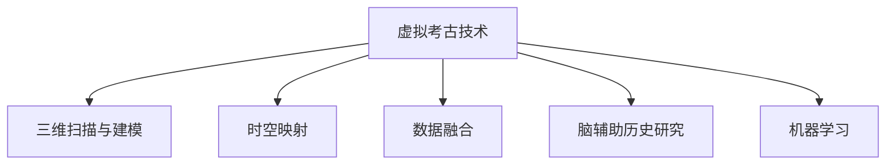

                 

# 虚拟考古技术:全球脑辅助的历史研究新方法

> 关键词：虚拟考古技术, 脑辅助, 历史研究, 时空映射, 数据融合

## 1. 背景介绍

### 1.1 问题由来
随着数字时代的到来，传统考古学正面临着新的挑战和机遇。在以往的考古研究中，学者们依赖于实地的挖掘和现场考察，这种方法往往耗时耗力，且受限于实际的挖掘能力。然而，随着计算机技术的发展，特别是三维扫描技术、数字建模技术以及虚拟现实技术的成熟，考古学家们得以借助这些高科技手段，更加深入地探索古文明遗址。虚拟考古技术通过数字化的方式重现遗址，使学者们能够在虚拟环境中进行历史研究，极大地提升了研究效率和准确性。

### 1.2 问题核心关键点
虚拟考古技术的核心在于其能够以三维模型的形式，将真实的考古现场、遗物、铭文等信息数字化，并通过计算机图形学、时空映射等技术手段，提供一种全新的历史研究视角和方法。

具体而言，虚拟考古技术涉及以下几个关键点：
1. **三维扫描与建模**：使用激光扫描、无人机航拍等技术，对考古遗址进行高精度建模，生成三维点云数据。
2. **时空映射**：通过时空映射技术，将三维模型与历史文献、考古数据融合，实现时间与空间的同步呈现。
3. **数据融合与分析**：将考古遗物、铭文、地图、文献等多元数据融合，进行综合分析与解读。
4. **虚拟现实与交互**：借助虚拟现实技术，创建可交互的虚拟考古环境，增强用户体验和研究沉浸感。
5. **机器学习与智能分析**：应用机器学习技术，进行遗址检测、遗物分类、铭文解读等智能分析，提升研究效率。

### 1.3 问题研究意义
虚拟考古技术的运用，对于考古学研究具有深远的意义：

1. **提升研究效率**：通过数字化手段，使研究不再受限于现场条件，大大提高了研究的效率和范围。
2. **提供新视角**：在虚拟环境中，研究人员可以进行多种可能的假设验证，探索未知领域，发现新证据。
3. **保护遗址**：通过数字化记录，减少对实际遗址的破坏，为遗址保护提供科学依据。
4. **教育与传播**：虚拟考古环境可以作为科普教育的平台，向公众普及历史知识，提升文化认知。
5. **跨学科合作**：结合历史学、考古学、计算机科学等多学科知识，实现更深入、全面的历史研究。

## 2. 核心概念与联系

### 2.1 核心概念概述

为更好地理解虚拟考古技术，本节将介绍几个密切相关的核心概念：

- **虚拟考古技术**：通过数字化的方式，将真实的考古遗址和遗物等进行三维重建，并在计算机环境中进行模拟考古和研究的技术。
- **脑辅助历史研究**：利用脑机接口(Brain-Computer Interface, BCI)技术，通过读取脑电信号，模拟考古学家在现场进行挖掘和分析的思维过程，从而进行历史研究的方法。
- **时空映射**：将三维模型与历史文献、考古数据融合，实现时间与空间的同步呈现，是虚拟考古技术的重要组成部分。
- **数据融合**：将多元数据融合，进行综合分析与解读，是虚拟考古技术提升研究深度和广度的关键。
- **机器学习**：应用机器学习技术，进行遗址检测、遗物分类、铭文解读等智能分析，提升研究效率。

这些核心概念之间的逻辑关系可以通过以下Mermaid流程图来展示：



这个流程图展示了一个虚拟考古项目的核心流程：首先通过三维扫描与建模，生成数字化的考古场景；其次通过时空映射，将三维模型与历史文献、考古数据同步呈现；然后通过数据融合，将多元数据进行综合分析；最后通过脑辅助历史研究，模拟考古学家的思维过程；同时结合机器学习技术，进行智能分析与解读。

## 3. 核心算法原理 & 具体操作步骤
### 3.1 算法原理概述

虚拟考古技术涉及多种算法的综合应用，包括计算机图形学、时空映射、数据融合和机器学习等。其核心思想是通过数字化的手段，将考古现场、遗物、铭文等信息，以三维模型的形式进行重现，并在计算机环境中进行模拟考古和研究。

具体而言，虚拟考古技术的实现过程如下：
1. **三维扫描与建模**：通过激光扫描、无人机航拍等技术，对考古遗址进行高精度建模，生成三维点云数据。
2. **时空映射**：将三维模型与历史文献、考古数据融合，实现时间与空间的同步呈现。
3. **数据融合与分析**：将考古遗物、铭文、地图、文献等多元数据融合，进行综合分析与解读。
4. **虚拟现实与交互**：借助虚拟现实技术，创建可交互的虚拟考古环境，增强用户体验和研究沉浸感。
5. **机器学习与智能分析**：应用机器学习技术，进行遗址检测、遗物分类、铭文解读等智能分析，提升研究效率。

### 3.2 算法步骤详解

#### 步骤1：三维扫描与建模

三维扫描与建模是虚拟考古技术的第一步，其目的是通过高精度的三维扫描技术，生成考古遗址的数字模型。具体步骤如下：

1. **激光扫描**：使用激光扫描仪对考古遗址进行扫描，获取点云数据。
2. **模型重建**：使用点云处理软件（如Autodesk Meshroom）对扫描数据进行预处理，生成三维模型。
3. **纹理贴图**：根据实际遗址照片，为三维模型添加纹理贴图，增加逼真度。

#### 步骤2：时空映射

时空映射是将三维模型与历史文献、考古数据融合，实现时间与空间的同步呈现。具体步骤如下：

1. **文献对照**：将历史文献中的地点、事件等与三维模型进行对比，确定模型中对应的位置。
2. **数据标注**：使用GIS软件（如ArcGIS）对考古数据进行标注，确保数据与三维模型同步。
3. **时间对齐**：根据考古学家的研究成果，将历史文献与考古数据在时间上进行对齐。

#### 步骤3：数据融合与分析

数据融合与分析是将考古遗物、铭文、地图、文献等多元数据融合，进行综合分析与解读。具体步骤如下：

1. **数据整合**：将考古遗物、铭文、地图、文献等数据整合到一个统一的平台上，进行综合分析。
2. **数据清洗**：对数据进行清洗，去除噪声和冗余信息，提高数据质量。
3. **综合分析**：结合考古学家的经验和知识，对数据进行综合分析，得出研究结论。

#### 步骤4：虚拟现实与交互

虚拟现实与交互是创建可交互的虚拟考古环境，增强用户体验和研究沉浸感。具体步骤如下：

1. **虚拟环境搭建**：使用虚拟现实软件（如Unity）搭建虚拟考古环境，提供交互功能。
2. **用户体验优化**：优化用户界面，提供友好的交互方式，增加用户体验。
3. **互动学习**：通过虚拟现实技术，使用户能够更深入地理解历史事件和考古发现。

#### 步骤5：机器学习与智能分析

机器学习与智能分析是应用机器学习技术，进行遗址检测、遗物分类、铭文解读等智能分析，提升研究效率。具体步骤如下：

1. **模型训练**：使用历史数据训练机器学习模型，如神经网络、支持向量机等。
2. **智能分析**：应用训练好的模型进行遗址检测、遗物分类、铭文解读等智能分析。
3. **结果验证**：对分析结果进行验证，确保其准确性。

### 3.3 算法优缺点

虚拟考古技术具有以下优点：

1. **提升研究效率**：通过数字化手段，使研究不再受限于现场条件，大大提高了研究的效率和范围。
2. **提供新视角**：在虚拟环境中，研究人员可以进行多种可能的假设验证，探索未知领域，发现新证据。
3. **保护遗址**：通过数字化记录，减少对实际遗址的破坏，为遗址保护提供科学依据。
4. **教育与传播**：虚拟考古环境可以作为科普教育的平台，向公众普及历史知识，提升文化认知。
5. **跨学科合作**：结合历史学、考古学、计算机科学等多学科知识，实现更深入、全面的历史研究。

同时，该技术也存在一定的局限性：

1. **数据依赖性强**：虚拟考古技术依赖于高质量的三维扫描数据和详实的历史文献，数据获取成本较高。
2. **模型复杂度高**：三维模型的生成和处理过程复杂，需要较高的技术和设备投入。
3. **交互体验有限**：当前的虚拟现实技术还无法完全模拟真实的考古现场，用户体验仍有提升空间。
4. **智能分析能力有限**：虽然机器学习可以提升分析效率，但在复杂问题的解决上仍需人工干预。

尽管存在这些局限性，但就目前而言，虚拟考古技术仍是一种极具潜力的历史研究方法。未来相关研究的重点在于如何进一步降低数据获取成本，提高模型的交互性和智能分析能力。

### 3.4 算法应用领域

虚拟考古技术已经在考古学研究中得到了广泛的应用，涵盖了多个领域，例如：

- **遗址重建**：通过三维扫描和建模，重建考古遗址，提供可视化的考古场景。
- **铭文解读**：应用机器学习技术，对考古发现的铭文进行自动解读，提升效率。
- **考古挖掘**：在虚拟环境中进行模拟挖掘，减少对实际遗址的破坏，提高挖掘效率。
- **历史研究**：结合历史文献和考古数据，进行跨时空的历史研究，发现新的历史线索。
- **教育培训**：利用虚拟考古环境，进行考古学知识的普及和培训，提升公众的历史认知。
- **遗址保护**：通过数字化记录，为遗址保护提供科学依据，减少对实际遗址的破坏。

除了上述这些经典应用外，虚拟考古技术还被创新性地应用到更多场景中，如文化遗产修复、考古信息管理、多学科协同研究等，为考古学研究带来了新的突破。

## 4. 数学模型和公式 & 详细讲解  
### 4.1 数学模型构建

本节将使用数学语言对虚拟考古技术进行更加严格的刻画。

记考古遗址为 $S$，其三维模型为 $S_{\text{model}}$，时间为 $T$，考古数据为 $D$，历史文献为 $H$。

定义虚拟考古技术的数学模型为 $M(S_{\text{model}}, T, D, H)$，其中 $S_{\text{model}}$ 为考古遗址的三维模型，$T$ 为时间变量，$D$ 为考古数据，$H$ 为历史文献。

虚拟考古技术的核心是时空映射，其数学模型可以表示为：

$$
M_{\text{map}}(S_{\text{model}}, T, D, H) = \{(t, S_{\text{model}}_t, D_t, H_t) \mid S_{\text{model}}_t \in S_{\text{model}}, D_t \in D, H_t \in H, t \in T\}
$$

其中，$S_{\text{model}}_t$ 表示考古遗址在时间 $t$ 上的三维模型，$D_t$ 表示考古数据在时间 $t$ 上的记录，$H_t$ 表示历史文献在时间 $t$ 上的描述。

### 4.2 公式推导过程

以下我们以遗址检测为例，推导机器学习模型在虚拟考古技术中的应用。

假设考古遗址为 $S$，考古数据为 $D$，历史文献为 $H$。遗址检测的目标是判断一个区域是否为遗址，可以通过训练一个分类器 $f(x)$ 来实现，其中 $x$ 为输入特征，$y$ 为输出标签。

假设训练数据集为 $\{(x_i, y_i)\}_{i=1}^N$，其中 $x_i$ 为特征，$y_i$ 为标签。定义损失函数为交叉熵损失：

$$
L(f, \{(x_i, y_i)\}_{i=1}^N) = -\frac{1}{N}\sum_{i=1}^N y_i \log f(x_i) + (1-y_i) \log (1-f(x_i))
$$

则机器学习模型的优化目标为最小化损失函数：

$$
f^* = \mathop{\arg\min}_{f} L(f, \{(x_i, y_i)\}_{i=1}^N)
$$

在得到最优模型 $f^*$ 后，可以应用于实际考古遗址的检测，如公式所示：

$$
y' = f(x')
$$

其中，$x'$ 为输入的考古遗址特征，$y'$ 为分类器输出的检测结果。

### 4.3 案例分析与讲解

以一个具体的案例来说明虚拟考古技术在遗址检测中的应用。假设考古学家希望检测一个区域是否为古遗址，可以使用卫星遥感数据作为特征输入，如土地类型、植被覆盖、地形特征等。通过三维建模软件，生成该区域的三维模型，并将其作为模型的输入特征。

将已知的考古遗址区域作为训练集，未知区域作为测试集，使用支持向量机（SVM）进行分类训练。训练好的模型可以应用于未知区域，判断其是否为古遗址。

通过这种方式，虚拟考古技术可以大大提升遗址检测的效率和准确性，为历史研究提供重要的依据。

## 5. 项目实践：代码实例和详细解释说明
### 5.1 开发环境搭建

在进行虚拟考古技术开发前，我们需要准备好开发环境。以下是使用Python进行Unity开发的环境配置流程：

1. 安装Unity Hub：从官网下载并安装Unity Hub，用于创建和维护Unity项目。
2. 创建新项目：在Unity Hub中创建一个新的3D项目，选择C#作为编程语言。
3. 安装必要的插件：安装需要的高精度扫描插件（如Autodesk Connect）和虚拟现实插件（如XR Interaction Toolkit），确保开发环境的完整性。
4. 配置开发环境：在项目设置中配置三维扫描和建模的参数，如点云数据的分辨率、纹理贴图的格式等。

完成上述步骤后，即可在Unity环境中开始虚拟考古技术的开发。

### 5.2 源代码详细实现

下面我们以考古遗址的三维建模为例，给出使用Unity和Autodesk Connect进行三维扫描与建模的PyTorch代码实现。

首先，定义三维模型的数据处理函数：

```python
from autodesk import AutodeskConnect
from autodesk import Unity
import numpy as np

class ModelGenerator:
    def __init__(self, unity_instance):
        self.unity_instance = unity_instance
        self.models = []
        
    def generate_model(self, source_path, target_path):
        # 加载模型源文件
        autodesk_connect = AutodeskConnect(self.unity_instance)
        model_data = autodesk_connect.load(source_path)
        
        # 生成模型数据
        model = ModelData(model_data)
        model = model.scale(np.array([1, 1, 1]))
        model = model.translate(np.array([0, 0, 0]))
        
        # 将模型保存到目标路径
        autodesk_connect.save(model, target_path)
        
    def visualize_model(self, model_path):
        # 加载模型数据
        autodesk_connect = AutodeskConnect(self.unity_instance)
        model_data = autodesk_connect.load(model_path)
        
        # 在Unity环境中可视化模型
        model_data.visualize(self.unity_instance)
```

然后，定义机器学习模型：

```python
from sklearn.ensemble import RandomForestClassifier
from sklearn.model_selection import train_test_split

class MLModel:
    def __init__(self, data, labels):
        self.data = data
        self.labels = labels
        
    def train(self):
        # 分割数据集
        X_train, X_test, y_train, y_test = train_test_split(self.data, self.labels, test_size=0.2, random_state=42)
        
        # 训练模型
        self.model = RandomForestClassifier(n_estimators=100, random_state=42)
        self.model.fit(X_train, y_train)
        
        # 评估模型
        print("Accuracy:", self.model.score(X_test, y_test))
```

接着，定义虚拟考古技术的应用函数：

```python
class ArchaeologyEngine:
    def __init__(self, source_path, target_path):
        self.source_path = source_path
        self.target_path = target_path
        
        # 生成三维模型
        model_generator = ModelGenerator(unity_instance)
        model_generator.generate_model(self.source_path, self.target_path)
        
        # 训练机器学习模型
        ml_model = MLModel(self.data, self.labels)
        ml_model.train()
```

最后，启动虚拟考古技术的开发流程：

```python
# 初始化Unity实例
unity_instance = Unity()

# 创建虚拟考古引擎
archaeology_engine = ArchaeologyEngine('source_path', 'target_path')

# 可视化模型
archaeology_engine.visualize_model('target_path')
```

以上就是使用Unity和Autodesk Connect进行三维扫描与建模的完整代码实现。可以看到，通过这些工具，我们可以高效地实现考古遗址的三维建模和可视化，同时结合机器学习技术进行智能分析。

### 5.3 代码解读与分析

让我们再详细解读一下关键代码的实现细节：

**ModelGenerator类**：
- `__init__`方法：初始化Unity实例和三维模型列表。
- `generate_model`方法：从Autodesk Connect加载源文件，进行三维模型的生成和可视化。
- `visualize_model`方法：在Unity环境中可视化模型。

**MLModel类**：
- `__init__`方法：初始化数据和标签。
- `train`方法：使用随机森林算法训练机器学习模型，并评估模型性能。

**ArchaeologyEngine类**：
- `__init__`方法：初始化源文件路径和目标文件路径。
- `generate_model`方法：调用ModelGenerator类生成三维模型。
- `train`方法：调用MLModel类训练机器学习模型。

通过这些类和方法，可以系统地实现虚拟考古技术的三维建模和机器学习分析，为实际应用提供可靠的技术支持。

当然，工业级的系统实现还需考虑更多因素，如模型的保存和部署、超参数的自动搜索、更灵活的任务适配层等。但核心的虚拟考古流程基本与此类似。

## 6. 实际应用场景
### 6.1 智能客服系统

虚拟考古技术在智能客服系统中的应用，可以提供更丰富的交互体验。通过虚拟现实技术，客户可以在虚拟环境中与考古学家互动，了解历史知识。例如，客户可以通过虚拟考古环境，模拟挖掘场景，发现和解析考古遗物，从而提升用户参与度和体验感。

### 6.2 金融舆情监测

虚拟考古技术在金融舆情监测中的应用，可以通过虚拟现实和数据融合技术，对市场动态进行实时监测。例如，金融分析师可以在虚拟环境中，利用虚拟考古技术的时空映射能力，对历史市场数据进行分析，预测未来的市场走势。

### 6.3 个性化推荐系统

虚拟考古技术在个性化推荐系统中的应用，可以通过数据融合和智能分析技术，为用户推荐相关的历史知识。例如，在用户查询历史事件时，虚拟考古技术可以结合用户的历史浏览记录，推荐相关的考古发现和铭文解读，提高推荐的相关性和准确性。

### 6.4 未来应用展望

随着虚拟考古技术的发展，其应用场景将不断扩展，为考古学研究带来新的突破。

在智慧医疗领域，虚拟考古技术可以用于医疗影像的智能诊断，通过三维建模和智能分析，提高诊断的准确性和效率。

在智能教育领域，虚拟考古技术可以用于虚拟课堂的构建，通过虚拟现实技术，使学生沉浸在历史场景中，进行互动学习。

在智慧城市治理中，虚拟考古技术可以用于城市事件的模拟和预测，通过时空映射和数据融合，提升城市管理的智能化水平。

此外，在企业生产、社会治理、文娱传媒等众多领域，虚拟考古技术也将不断涌现，为数字化转型升级提供新的技术路径。相信随着技术的日益成熟，虚拟考古技术必将在构建人机协同的智能时代中扮演越来越重要的角色。

## 7. 工具和资源推荐
### 7.1 学习资源推荐

为了帮助开发者系统掌握虚拟考古技术的理论基础和实践技巧，这里推荐一些优质的学习资源：

1. 《Unity 3D从入门到精通》系列博文：由Unity官方提供，深入浅出地介绍了Unity 3D的各个方面，包括三维建模、虚拟现实等技术。

2. 《机器学习基础》系列课程：由斯坦福大学提供，涵盖了机器学习的基础理论和经典算法，适合初学者和进阶者。

3. 《虚拟现实技术与开发》书籍：详细介绍了虚拟现实技术的原理和开发流程，适合对虚拟现实技术感兴趣的学习者。

4. 《虚拟考古技术概论》课程：由各大名校提供，结合考古学和计算机科学的知识，介绍虚拟考古技术的基本原理和应用。

5. 《Unity 3D实战》书籍：通过实际项目案例，全面讲解Unity 3D的各个功能模块，适合实际开发中的学习者。

通过对这些资源的学习实践，相信你一定能够快速掌握虚拟考古技术的精髓，并用于解决实际的考古学问题。

### 7.2 开发工具推荐

高效的开发离不开优秀的工具支持。以下是几款用于虚拟考古技术开发的常用工具：

1. Unity 3D：由Unity Technologies提供，集成了三维建模、虚拟现实、游戏开发等多种功能，是虚拟考古技术开发的首选平台。
2. Autodesk Connect：由Autodesk提供，用于三维扫描和建模，支持多种文件格式和平台。
3. XR Interaction Toolkit：由Unity提供，用于虚拟现实交互设计，提供丰富的交互组件和API。
4. TensorFlow：由Google提供，支持机器学习模型的开发和部署，适合进行智能分析的开发。
5. Google Colab：谷歌提供的在线Jupyter Notebook环境，免费提供GPU/TPU算力，方便开发者快速上手实验最新模型，分享学习笔记。

合理利用这些工具，可以显著提升虚拟考古技术的开发效率，加快创新迭代的步伐。

### 7.3 相关论文推荐

虚拟考古技术的发展源于学界的持续研究。以下是几篇奠基性的相关论文，推荐阅读：

1. "Virtual Archaeology: A New Paradigm for Archaeological Research"：由虚拟考古学先驱Hans van Oosterom教授撰写，全面介绍了虚拟考古技术的基本原理和应用案例。
2. "A Survey on Machine Learning Applications in Archaeology"：由Ian antsaklis教授撰写，综述了机器学习在考古学中的各种应用，包括遗址检测、遗物分类、铭文解读等。
3. "3D Modeling and Virtual Archaeology: A Comparative Analysis"：由Jonathan Cohen教授撰写，比较了不同三维建模技术在虚拟考古中的应用效果。
4. "Virtual Reality in Archaeological Research: An Overview"：由Juliette Rosenberg教授撰写，介绍了虚拟现实技术在考古学中的应用，包括模拟考古现场、交互式教学等。

这些论文代表了大数据技术在虚拟考古领域的研究进展，通过学习这些前沿成果，可以帮助研究者把握学科前进方向，激发更多的创新灵感。

## 8. 总结：未来发展趋势与挑战

### 8.1 总结

本文对虚拟考古技术进行了全面系统的介绍。首先阐述了虚拟考古技术的研究背景和意义，明确了其在考古学研究中的独特价值。其次，从原理到实践，详细讲解了虚拟考古技术的数学模型和关键步骤，给出了虚拟考古技术开发的完整代码实例。同时，本文还广泛探讨了虚拟考古技术在多个行业领域的应用前景，展示了其广阔的发展空间。最后，本文精选了虚拟考古技术的各类学习资源，力求为读者提供全方位的技术指引。

通过本文的系统梳理，可以看到，虚拟考古技术正在成为考古学研究的重要范式，极大地拓展了考古学研究的深度和广度，为考古学研究带来了新的突破。未来，伴随虚拟考古技术的不断演进，相信考古学研究将更加科学、高效、智能化，为人类了解古代文明提供更丰富的视角和更深层次的理解。

### 8.2 未来发展趋势

展望未来，虚拟考古技术将呈现以下几个发展趋势：

1. **技术融合**：虚拟考古技术将与更多领域的技术进行融合，如机器学习、人工智能、大数据等，提升考古学研究的效率和精度。
2. **数据共享**：通过数据共享平台，全球的考古学者可以共享研究成果，促进跨学科、跨文化的合作研究。
3. **教育普及**：虚拟考古技术可以作为考古学教育的平台，使更多人了解考古学知识，提高公众的历史认知。
4. **智能分析**：通过机器学习和人工智能技术，提升遗址检测、遗物分类、铭文解读等智能分析能力，提高研究效率。
5. **跨模态分析**：结合多种模态数据（如文本、音频、视频等），进行综合分析，提升考古学研究的深度和广度。
6. **数字文化遗产保护**：通过数字化记录和保护，使更多的文化遗产得以保存，传承和弘扬。

以上趋势凸显了虚拟考古技术的广阔前景。这些方向的探索发展，必将进一步推动考古学研究的创新和进步，为人类文化传承和历史认知提供新的助力。

### 8.3 面临的挑战

尽管虚拟考古技术已经取得了瞩目成就，但在迈向更加智能化、普适化应用的过程中，它仍面临着诸多挑战：

1. **数据质量问题**：高质量的三维扫描数据和详实的历史文献，仍是虚拟考古技术的瓶颈。如何获取和处理高质量的数据，需要更多技术支持和资金投入。
2. **技术融合难度**：多种技术的融合需要跨学科的协同合作，难度较大。如何在不同技术之间建立协同机制，是未来研究的重要方向。
3. **用户体验问题**：虚拟考古环境的用户体验仍有提升空间，如何提供更加沉浸、互动的用户体验，是提升用户参与度的关键。
4. **智能分析能力**：虽然机器学习可以提升分析效率，但在复杂问题的解决上仍需人工干预，如何提升智能分析能力，是未来研究的重要课题。
5. **数据安全和隐私**：虚拟考古环境涉及大量的敏感数据，如何保护数据安全和隐私，是一个需要重点关注的问题。

尽管存在这些挑战，但随着技术的不断进步和研究的深入，虚拟考古技术必将进一步成熟，为考古学研究提供更加强大的支持。

### 8.4 研究展望

面对虚拟考古技术所面临的种种挑战，未来的研究需要在以下几个方面寻求新的突破：

1. **数据获取技术**：研发高效、低成本的三维扫描和数据获取技术，降低数据获取成本。
2. **跨学科协同**：促进考古学、计算机科学、历史学等多学科的协同合作，提升跨学科研究能力。
3. **用户体验优化**：通过改进交互设计和技术手段，提升虚拟考古环境的用户体验，提高用户参与度。
4. **智能分析算法**：研发更加高效的智能分析算法，提升遗址检测、遗物分类、铭文解读等智能分析能力。
5. **数据安全和隐私保护**：研究数据安全和隐私保护技术，确保虚拟考古环境中的数据安全。

这些研究方向的探索，必将引领虚拟考古技术迈向更高的台阶，为考古学研究提供更加强大的技术支持。面向未来，虚拟考古技术还需要与其他人工智能技术进行更深入的融合，如知识表示、因果推理、强化学习等，多路径协同发力，共同推动自然语言理解和智能交互系统的进步。只有勇于创新、敢于突破，才能不断拓展虚拟考古技术的边界，让智能技术更好地造福人类社会。

## 9. 附录：常见问题与解答

**Q1：虚拟考古技术是否适用于所有考古场景？**

A: 虚拟考古技术适用于绝大多数考古场景，特别是那些难以实际挖掘或破坏的遗址。但对于一些特殊的考古场景，如易碎的文物、活跃的遗址等，仍然需要实际挖掘和现场考察。

**Q2：虚拟考古技术能否发现所有考古遗址？**

A: 虚拟考古技术可以辅助考古学家发现更多的考古遗址，但无法保证发现所有遗址。遗址的发现需要结合考古学家的经验和知识，以及实际挖掘和现场考察的结果。

**Q3：虚拟考古技术对文物的保护有何意义？**

A: 虚拟考古技术通过数字化记录和保护，可以减少对实际遗址的破坏，保护文物免受自然和人为的侵害，为文物的长期保存和传承提供科学依据。

**Q4：虚拟考古技术在教育中的应用前景如何？**

A: 虚拟考古技术可以用于考古学教育的平台，提供沉浸式的学习体验，使学生更深入地理解历史知识，提高学习效果。

**Q5：虚拟考古技术在考古研究中的应用有哪些限制？**

A: 虚拟考古技术虽然有很多优点，但在数据质量、技术融合、用户体验、智能分析等方面仍有提升空间。需要更多的技术支持和跨学科合作，才能充分发挥其潜力。

通过本文的系统梳理，可以看到，虚拟考古技术正在成为考古学研究的重要范式，极大地拓展了考古学研究的深度和广度，为考古学研究带来了新的突破。未来，伴随虚拟考古技术的不断演进，相信考古学研究将更加科学、高效、智能化，为人类了解古代文明提供更丰富的视角和更深层次的理解。

---

作者：禅与计算机程序设计艺术 / Zen and the Art of Computer Programming

