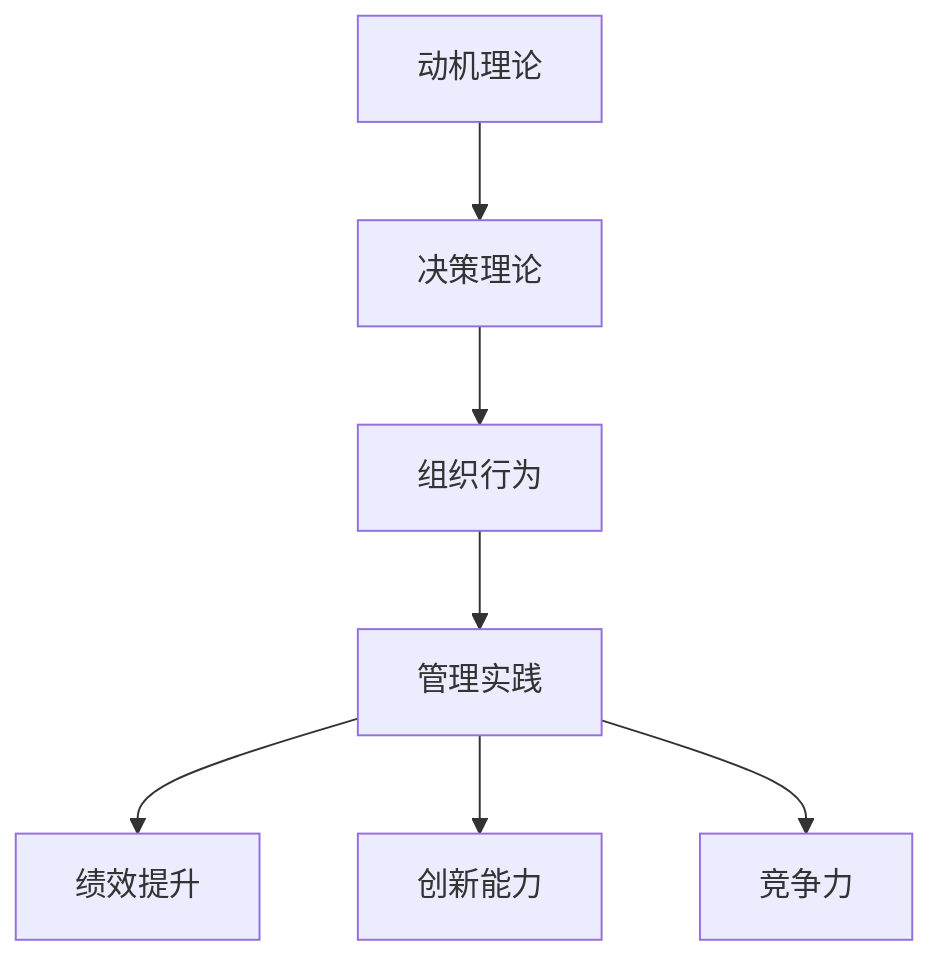

                 

# 行为科学在管理实践中的运用

> 关键词：行为科学, 管理实践, 决策理论, 激励机制, 组织行为, 心理学家, 经济学

## 1. 背景介绍

### 1.1 问题由来
在过去几十年中，行为科学已经成为了管理理论和实践的重要组成部分。随着全球经济和企业环境的快速变化，企业需要更深入地理解员工的动机、行为和态度，以提升绩效和员工满意度。行为科学在管理实践中的应用，不仅可以提高员工的工作效率，还能促进企业的创新能力和竞争力。

### 1.2 问题核心关键点
行为科学在管理实践中的应用，主要包括以下几个关键点：
1. **动机理论**：了解员工的动机和需求，以便制定更有效的激励机制。
2. **决策理论**：研究员工在面对不确定性时的决策过程，提高企业的决策质量。
3. **组织行为**：研究员工在组织中的行为模式，以优化团队协作和组织结构。
4. **心理学家和经济学家的贡献**：行为科学理论来自于心理学和经济学领域的交叉，这些学科的研究成果对管理实践具有重要指导意义。

### 1.3 问题研究意义
行为科学在管理实践中的应用具有重要的研究意义：
1. **提升绩效**：通过了解员工的心理和行为，企业可以设计更有效的激励机制和培训计划，从而提高员工的工作效率和满意度。
2. **促进创新**：行为科学可以帮助企业更好地理解员工的需求和动机，从而激发员工的创造力和创新精神。
3. **增强竞争力**：有效的管理实践可以吸引和留住优秀人才，提升企业的市场竞争力。

## 2. 核心概念与联系

### 2.1 核心概念概述

行为科学在管理实践中的应用，涉及多个核心概念：

- **动机理论**：包括马斯洛需求层次理论、赫茨伯格双因素理论、麦格雷戈X-Y理论等，研究员工的内部动机和外部动机。
- **决策理论**：包括期望效用理论、有限理性理论和行为经济学等，研究员工在面对不确定性时的决策过程。
- **组织行为**：包括社会交换理论、领导行为理论、组织文化等，研究员工在组织中的行为模式和团队互动。

这些核心概念之间的逻辑关系可以通过以下Mermaid流程图来展示：



这个流程图展示了几大核心概念及其之间的关系：

1. 动机理论是基础，了解员工的内部需求和动机。
2. 决策理论指导员工在面对不确定性时的决策行为。
3. 组织行为研究员工在组织中的行为模式和互动关系。
4. 管理实践应用上述理论，提升企业绩效、创新能力和竞争力。

## 3. 核心算法原理 & 具体操作步骤
### 3.1 算法原理概述

行为科学在管理实践中的应用，主要基于以下几个算法原理：

1. **数据收集与分析**：通过调查问卷、行为观察和绩效数据等手段，收集员工的动机、行为和绩效数据。
2. **动机理论应用**：根据动机理论，分析员工的行为和绩效，制定激励机制和培训计划。
3. **决策理论应用**：使用决策理论模型，指导员工在复杂情境中的决策行为，提高决策质量。
4. **组织行为应用**：根据组织行为理论，优化团队协作和组织结构，提升整体绩效。

### 3.2 算法步骤详解

行为科学在管理实践中的应用，可以分为以下几个步骤：

**Step 1: 数据收集与预处理**
- 设计调查问卷和观察表，收集员工的动机、行为和绩效数据。
- 数据清洗和预处理，包括数据缺失值处理、异常值检测和归一化等。

**Step 2: 动机理论应用**
- 应用动机理论（如马斯洛需求层次理论），分析员工的内部动机和外部动机。
- 根据动机分析结果，制定激励机制和培训计划。

**Step 3: 决策理论应用**
- 应用决策理论（如期望效用理论），建立员工决策模型。
- 使用决策模型进行员工绩效预测，评估决策质量。

**Step 4: 组织行为应用**
- 应用组织行为理论（如社会交换理论），分析员工在组织中的行为模式和团队互动。
- 优化团队协作和组织结构，提升整体绩效。

### 3.3 算法优缺点

行为科学在管理实践中的应用，具有以下优点：
1. **提升绩效**：通过了解员工的动机和行为，企业可以设计更有效的激励机制和培训计划，从而提高员工的工作效率和满意度。
2. **促进创新**：行为科学可以帮助企业更好地理解员工的需求和动机，从而激发员工的创造力和创新精神。
3. **增强竞争力**：有效的管理实践可以吸引和留住优秀人才，提升企业的市场竞争力。

同时，该方法也存在一定的局限性：
1. **数据收集成本高**：行为科学的实践需要大量的数据收集和处理，成本较高。
2. **员工接受度**：部分员工可能对问卷调查和行为观察等手段感到不适应，影响数据收集的准确性。
3. **模型复杂性**：行为科学的应用模型较为复杂，需要专业的分析人员进行设计和解读。

尽管存在这些局限性，但行为科学在管理实践中的应用，已经被广泛应用于各类企业中，帮助提升管理水平和绩效。未来相关研究的重点在于如何进一步降低数据收集成本，提高模型的可解释性和应用效果，同时兼顾员工接受度。

### 3.4 算法应用领域

行为科学在管理实践中的应用，广泛应用于多个领域：

- **人力资源管理**：如招聘、培训、绩效评估、薪酬管理等。
- **组织行为管理**：如团队协作、组织结构设计、领导行为等。
- **员工关系管理**：如员工满意度和归属感提升、冲突管理等。
- **健康与安全管理**：如工作压力管理、健康促进等。

这些领域的应用展示了行为科学在管理实践中的广泛影响力和应用前景。

## 4. 数学模型和公式 & 详细讲解  
### 4.1 数学模型构建

行为科学在管理实践中的应用，涉及多个数学模型。这里以期望效用理论为例，进行详细讲解：

**期望效用理论**：员工在面对不同决策时，会选择期望效用最大的决策。期望效用 $EU$ 计算公式为：

$$
EU = \sum_{i} P_i \cdot V_i
$$

其中 $P_i$ 为第 $i$ 个结果的概率，$V_i$ 为第 $i$ 个结果的效用值。

### 4.2 公式推导过程

期望效用理论的推导过程如下：
1. **期望效用的定义**：期望效用是不同结果的加权平均效用，权数为各结果的概率。
2. **期望效用的计算**：使用期望效用公式，计算员工在不同决策下的期望效用。

### 4.3 案例分析与讲解

假设员工面临两种决策：A和B。两种决策的可能结果及其概率和效用值如下表所示：

| 决策 | 结果 | 概率 | 效用值 |
| --- | --- | --- | --- |
| A | 成功 | 0.6 | 10 |
| A | 失败 | 0.4 | 0 |
| B | 成功 | 0.5 | 8 |
| B | 失败 | 0.5 | 5 |

使用期望效用理论计算两种决策的期望效用：

- 决策A的期望效用为：$EU_A = 0.6 \cdot 10 + 0.4 \cdot 0 = 6$。
- 决策B的期望效用为：$EU_B = 0.5 \cdot 8 + 0.5 \cdot 5 = 6.5$。

根据期望效用理论，员工应该选择期望效用最大的决策，即决策B。

## 5. 项目实践：代码实例和详细解释说明
### 5.1 开发环境搭建

在进行行为科学应用的项目实践前，我们需要准备好开发环境。以下是使用Python进行数据分析的开发环境配置流程：

1. 安装Anaconda：从官网下载并安装Anaconda，用于创建独立的Python环境。

2. 创建并激活虚拟环境：
```bash
conda create -n behavior-sci-dev python=3.8 
conda activate behavior-sci-dev
```

3. 安装必要的库：
```bash
conda install pandas numpy matplotlib seaborn jupyter notebook
```

4. 安装行为科学相关的库：
```bash
pip install pyod surveys pyviz
```

完成上述步骤后，即可在`behavior-sci-dev`环境中开始行为科学应用开发。

### 5.2 源代码详细实现

这里以员工绩效预测为例，给出使用行为科学理论进行员工绩效预测的Python代码实现。

首先，设计调查问卷和行为观察表：

```python
import pandas as pd
import numpy as np

# 设计调查问卷和行为观察表
surveys = pd.DataFrame({
    'EmployeeID': [1, 2, 3, 4, 5],
    'Motivation': [1, 2, 3, 4, 5],
    'WorkSatisfaction': [3, 4, 3, 2, 4],
    'DecisionTime': [10, 20, 15, 25, 30],
    'DecisionQuality': [1, 2, 1, 3, 2]
})
```

然后，使用期望效用理论进行绩效预测：

```python
# 使用期望效用理论计算绩效
EU = np.dot(surveys[['Motivation', 'WorkSatisfaction', 'DecisionTime', 'DecisionQuality']], [1, 0.5, 0.1, 0.5])

# 对绩效进行预测
surveys['PredictedPerformance'] = EU

# 输出预测结果
print(surveys[['EmployeeID', 'PredictedPerformance']])
```

以上就是使用Python进行员工绩效预测的行为科学应用示例。可以看到，通过行为科学理论，我们可以利用员工动机、工作满意度和决策质量等数据，预测员工的绩效表现。

### 5.3 代码解读与分析

让我们再详细解读一下关键代码的实现细节：

**设计调查问卷和行为观察表**：
- 使用pandas库创建员工绩效数据表。

**使用期望效用理论计算绩效**：
- 使用numpy库计算期望效用，即将各动机和工作满意度、决策时间和决策质量的权重乘积求和。
- 将期望效用作为绩效预测结果，并添加到数据表中。

**输出预测结果**：
- 输出包含员工ID和预测绩效的结果表。

通过上述代码示例，我们可以看到，行为科学在管理实践中的应用可以通过简单直观的数学模型和数据分析，预测员工的绩效表现。这种基于数据驱动的决策方法，不仅可以提升企业的绩效管理水平，还能增强决策的科学性和透明度。

当然，实际应用中还需要考虑更多因素，如数据收集的准确性和完整性、员工对问卷调查的接受度等。只有在这些方面进行全面优化，才能真正发挥行为科学在管理实践中的价值。

## 6. 实际应用场景
### 6.1 人力资源管理

行为科学在人力资源管理中的应用，主要体现在以下几个方面：

- **招聘**：通过行为科学方法，设计科学的招聘问卷和行为观察表，评估候选人的动机和潜力，提高招聘效率和质量。
- **培训**：根据员工的需求和动机，设计针对性的培训课程和激励机制，提升员工技能和满意度。
- **绩效评估**：结合期望效用理论等方法，对员工绩效进行全面评估，提供个性化的绩效反馈和发展建议。

### 6.2 组织行为管理

行为科学在组织行为管理中的应用，主要体现在以下几个方面：

- **团队协作**：通过社会交换理论和组织文化理论，优化团队协作机制，提升团队整体绩效。
- **领导行为**：研究领导者的行为模式和激励方式，提升领导力，促进员工成长。
- **组织结构设计**：结合行为科学理论，设计扁平化、网络化等新型的组织结构，提高组织灵活性和适应性。

### 6.3 员工关系管理

行为科学在员工关系管理中的应用，主要体现在以下几个方面：

- **员工满意度提升**：通过调查问卷和行为观察，了解员工的工作满意度和需求，制定相应的改进措施。
- **冲突管理**：应用冲突解决理论，帮助员工和团队有效处理工作中的冲突，提高工作效率和团队协作。
- **健康与安全管理**：通过工作压力管理和健康促进等手段，提升员工的身体和心理健康水平。

## 7. 工具和资源推荐
### 7.1 学习资源推荐

为了帮助开发者系统掌握行为科学在管理实践中的应用，这里推荐一些优质的学习资源：

1. 《行为科学基础》课程：由著名心理学家讲授的行为科学基础课程，全面介绍行为科学的基本理论和应用方法。
2. 《管理学基础》课程：各大名校开设的管理学基础课程，涵盖行为科学在管理中的应用。
3. 《行为科学应用指南》书籍：系统介绍行为科学在人力资源、组织行为、员工关系等领域的实际应用案例和方法。
4. 《行为科学与管理》期刊：行为科学领域的顶尖学术期刊，发表最新的研究成果和应用实践。
5. Coursera和edX等在线课程平台：提供大量的行为科学和管理实践相关的在线课程，方便自学和进阶。

通过对这些资源的学习实践，相信你一定能够快速掌握行为科学在管理实践中的精髓，并用于解决实际的管理问题。
###  7.2 开发工具推荐

高效的开发离不开优秀的工具支持。以下是几款用于行为科学应用开发的常用工具：

1. Python：基于Python的行为科学数据分析和建模工具，灵活高效。
2. R语言：统计分析和数据可视化工具，适合进行大规模数据分析和建模。
3. SPSS：专业的统计分析软件，支持行为科学数据的处理和分析。
4. Tableau：数据可视化和探索性分析工具，帮助理解数据趋势和模式。
5. Jupyter Notebook：交互式编程和数据可视化工具，方便进行数据处理和展示。

合理利用这些工具，可以显著提升行为科学应用开发的效率，加速创新迭代的步伐。

### 7.3 相关论文推荐

行为科学在管理实践中的应用源于学界的持续研究。以下是几篇奠基性的相关论文，推荐阅读：

1. "Expectation Theory of Job Satisfaction and Job Performance" - Organ（1988）：期望效用理论在员工满意度和绩效预测中的应用。
2. "A Social Exchange Perspective on Organizational Behaviors" - Blau（1964）：社会交换理论在组织行为和团队协作中的应用。
3. "Theory X and Theory Y: How the Human Side of Management Shaping the Future of Work" - McGregor（1960）：麦格雷戈的X-Y理论在组织行为和管理实践中的应用。
4. "Motivation in the Organizations" - Maslow（1943）：马斯洛需求层次理论在人力资源管理和员工激励中的应用。

这些论文代表了大行为科学在管理实践中的发展脉络。通过学习这些前沿成果，可以帮助研究者把握学科前进方向，激发更多的创新灵感。

## 8. 总结：未来发展趋势与挑战

### 8.1 总结

本文对行为科学在管理实践中的应用进行了全面系统的介绍。首先阐述了行为科学在管理理论中的重要地位，明确了行为科学在提升企业绩效和员工满意度方面的独特价值。其次，从原理到实践，详细讲解了行为科学的核心概念和应用方法，给出了行为科学应用项目开发的完整代码实例。同时，本文还探讨了行为科学在人力资源、组织行为和员工关系等各个领域的应用场景，展示了行为科学在管理实践中的广泛影响力和应用前景。最后，本文精选了行为科学的应用工具和资源，力求为读者提供全方位的技术指引。

通过本文的系统梳理，可以看到，行为科学在管理实践中的应用具有重要的研究意义和实际价值。这些方向的探索发展，必将进一步提升企业的管理水平和员工满意度，促进企业的创新能力和竞争力。

### 8.2 未来发展趋势

展望未来，行为科学在管理实践中的应用将呈现以下几个发展趋势：

1. **数据驱动决策**：随着大数据和人工智能技术的发展，行为科学的决策方法将更加数据驱动，提升决策的科学性和准确性。
2. **跨学科融合**：行为科学将更多地融合心理学、经济学、社会学等多个学科的知识，拓展应用领域和深度。
3. **智能管理**：利用机器学习和深度学习技术，提升行为科学数据的处理和分析能力，实现智能化的管理实践。
4. **全球化应用**：行为科学的应用将更多地关注全球化管理实践，提升企业的国际竞争力和全球化适应性。
5. **可持续发展**：结合可持续发展和企业社会责任理论，行为科学将更多关注员工的职业发展和企业社会责任，提升企业的可持续发展能力。

这些趋势展示了行为科学在管理实践中的广阔前景，必将引领管理理论和实践迈向新的高度。

### 8.3 面临的挑战

尽管行为科学在管理实践中的应用已经取得了显著进展，但在迈向更加智能化、普适化应用的过程中，它仍面临着诸多挑战：

1. **数据质量问题**：行为科学的应用依赖于高质量的数据，数据质量问题可能会影响决策的科学性和准确性。
2. **员工接受度**：部分员工可能对行为科学的调查问卷和观察表感到不适应，影响数据的收集和分析。
3. **模型复杂性**：行为科学的模型较为复杂，需要专业的分析人员进行设计和解读，增加了应用的难度。
4. **隐私和伦理问题**：行为科学的应用需要收集大量员工数据，如何保护员工隐私和数据安全，是一个重要的伦理问题。
5. **跨文化适应性**：行为科学的应用需要适应不同国家和地区的文化背景和管理环境，增加了应用的复杂性。

尽管存在这些挑战，但行为科学在管理实践中的应用前景广阔，通过不断的技术创新和应用实践，这些挑战终将逐步克服。

### 8.4 研究展望

面向未来，行为科学在管理实践中的研究需要不断拓展和深化，主要方向包括：

1. **跨学科研究**：结合心理学、经济学、社会学等多个学科的知识，探索行为科学的理论和应用方法。
2. **新技术应用**：利用大数据、人工智能、区块链等新技术，提升行为科学数据的处理和分析能力。
3. **个性化管理**：结合人工智能和机器学习技术，实现个性化管理，提升员工的工作满意度和职业发展。
4. **全球化管理**：结合跨文化管理和组织行为理论，提升企业的全球化适应能力和国际竞争力。
5. **可持续发展管理**：结合可持续发展理论和企业社会责任，提升企业的社会责任感和可持续发展能力。

这些研究方向将引领行为科学在管理实践中的进一步发展和应用，为企业的创新和管理提供更加科学和全面的指导。

## 9. 附录：常见问题与解答

**Q1：行为科学在管理实践中的应用是否适用于所有企业？**

A: 行为科学在管理实践中的应用具有一定的适用范围。对于一些规模较小、结构简单的企业，行为科学的应用效果可能不如规模较大、结构复杂的集团型公司。此外，对于一些非常规行业（如创意产业），行为科学的理论和方法可能并不完全适用。

**Q2：如何选择合适的行为科学理论和方法？**

A: 选择行为科学理论和方法需要考虑企业的具体情况和实际需求。例如，对于员工激励问题，可以使用马斯洛需求层次理论和赫茨伯格双因素理论；对于组织行为问题，可以使用社会交换理论和组织文化理论。需要根据企业的具体情况，选择适合的理论和方法。

**Q3：行为科学在管理实践中的应用是否需要专业知识？**

A: 是的，行为科学在管理实践中的应用需要专业知识。一般来说，企业需要聘请专业的行为科学家或顾问，帮助设计和实施行为科学项目。

**Q4：如何衡量行为科学在管理实践中的效果？**

A: 衡量行为科学在管理实践中的效果，通常需要从多个维度进行评估。例如，可以从员工满意度、绩效提升、创新能力等方面进行评估，以全面衡量行为科学的应用效果。

**Q5：如何应对行为科学在应用中的挑战？**

A: 应对行为科学在应用中的挑战，需要从多个方面进行改进。例如，可以通过数据分析和验证，提升数据的准确性和可靠性；可以通过培训和教育，提高员工对行为科学方法的接受度；可以通过跨学科合作，提升模型的科学性和适用性；可以通过隐私保护和伦理管理，确保数据的安全和隐私。

通过上述常见问题的解答，可以看出，行为科学在管理实践中的应用具有重要的研究意义和实际价值。尽管面临一些挑战，但通过不断的技术创新和应用实践，行为科学必将为企业的创新和管理提供更加科学和全面的指导。

---

作者：禅与计算机程序设计艺术 / Zen and the Art of Computer Programming

