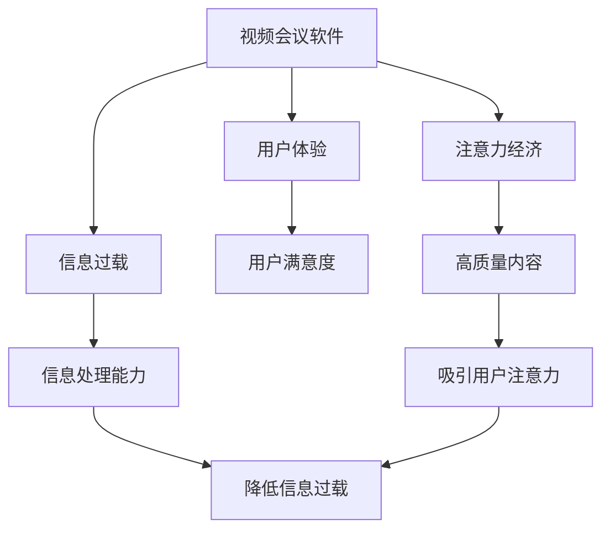

                 

# 视频会议软件：注意力经济的受益者

> 关键词：视频会议, 注意力经济, 协作工具, 远程工作, 用户体验

## 1. 背景介绍

### 1.1 问题由来

在数字化时代，企业、学校、家庭等组织中，视频会议软件已成为不可或缺的协作工具。从早期的点对点视频通信，到当前高度集成、功能丰富的视频会议平台，技术的发展大大提升了远程沟通的便利性和效率。然而，尽管视频会议的普及程度越来越高，用户满意度和体验仍存在诸多挑战。特别是在注意力经济（Attention Economy）时代，视频会议软件如何吸引并维持用户注意力，成为其持续发展的关键问题。

### 1.2 问题核心关键点

视频会议软件的成功与否，不仅取决于其技术性能和功能完备性，更在于其能否在用户有限注意力资源下，提供高效、易用、愉悦的体验。在注意力资源稀缺、信息过载的时代，视频会议软件应如何设计，才能吸引用户的注意力，实现产品价值最大化？

### 1.3 问题研究意义

探讨视频会议软件在注意力经济时代的设计策略，对提升用户体验、增强产品竞争力具有重要意义：

1. **提升用户满意度**：通过设计吸引用户注意力的功能，降低信息过载，提高用户参与度和满意度。
2. **增强用户体验**：优化视频会议的交互设计，提升用户操作简便性、舒适度，增加使用频率。
3. **促进业务增长**：通过有效吸引和维持用户注意力，提高产品市场占有率，推动企业业务增长。
4. **应对市场竞争**：在竞争激烈的视频会议市场中，通过独特的设计理念，构建差异化竞争优势。

## 2. 核心概念与联系

### 2.1 核心概念概述

为更好地理解视频会议软件在注意力经济时代的设计策略，本节将介绍几个密切相关的核心概念：

- **视频会议软件（Video Conference Software）**：提供远程音视频通信、屏幕共享、会议记录、即时聊天等功能，帮助用户跨越物理空间进行实时交流的软件。
- **注意力经济（Attention Economy）**：信息过载时代，注意力成为稀缺资源，高质量、有价值的内容和服务能够吸引并维持用户注意力，从而实现经济价值。
- **用户体验（User Experience, UX）**：用户在使用产品过程中产生的感受和体验，直接影响用户满意度和忠诚度。
- **信息过载（Information Overload）**：用户接收的信息量超出其处理能力，导致注意力的分散和效率降低。

这些核心概念之间的逻辑关系可以通过以下Mermaid流程图来展示：



这个流程图展示了两大核心概念——视频会议软件和注意力经济——以及它们与用户体验和信息过载之间的关系。高质量内容和服务能够吸引用户注意力，降低信息过载，从而提升用户体验和满意度，驱动业务增长。

## 3. 核心算法原理 & 具体操作步骤

### 3.1 算法原理概述

视频会议软件在注意力经济时代的设计，核心在于通过高效的信息传递和互动，吸引并维持用户注意力。算法设计应围绕以下几个关键点进行：

1. **信息聚焦**：将重要信息突出显示，减少信息过载，使用户能够集中注意力在关键内容上。
2. **交互优化**：设计简洁直观的交互方式，减少用户操作复杂度，提高操作效率。
3. **个性化体验**：根据用户行为和偏好，提供定制化的内容和功能，增强用户粘性。

### 3.2 算法步骤详解

以下是视频会议软件在注意力经济时代的设计步骤：

**Step 1: 数据收集与分析**
- 收集用户行为数据（如点击、滑动、停留时间等）。
- 分析用户注意力集中区域和行为模式。
- 识别信息过载和用户流失的潜在因素。

**Step 2: 界面设计优化**
- 突出重要信息和关键功能，减少次要信息的干扰。
- 设计简洁直观的UI界面，降低操作复杂度。
- 引入交互动画和提示，提升用户操作的顺畅性和直观性。

**Step 3: 个性化内容推送**
- 根据用户历史行为和偏好，动态推送个性化内容。
- 采用推荐算法，预测用户可能感兴趣的信息，减少信息过载。
- 引入智能提示和即时反馈，增强用户体验的即时性和互动性。

**Step 4: 功能模块集成**
- 集成协作工具（如即时聊天、文档共享、会议记录），提升协作效率。
- 引入多设备支持，提高设备兼容性。
- 实现多种语言和文化支持，扩大用户群体。

**Step 5: 用户反馈收集与迭代**
- 收集用户反馈和意见，进行产品迭代优化。
- 引入A/B测试，对比不同设计方案的效果，选择最佳方案。
- 持续优化产品功能，提升用户体验和满意度。

### 3.3 算法优缺点

视频会议软件在注意力经济时代的设计方法具有以下优点：

1. **提升用户体验**：通过精简信息传递和优化交互设计，降低用户注意力的分散，提升使用体验。
2. **增强用户满意度**：提供个性化和定制化的内容，满足用户多样化的需求，提高用户忠诚度。
3. **促进业务增长**：通过有效吸引和维持用户注意力，提高产品市场占有率，推动企业业务增长。

同时，这些方法也存在一定的局限性：

1. **设计复杂度高**：需要深入分析用户行为和偏好，设计复杂度高。
2. **用户反馈多样性**：不同用户群体对设计的反应可能差异较大，难以统一满足所有用户需求。
3. **持续优化成本高**：需要持续收集用户反馈和行为数据，进行产品迭代优化，成本较高。

尽管存在这些局限性，但就目前而言，通过优化视频会议软件的用户体验，吸引并维持用户注意力，仍是提高其竞争力的重要手段。未来相关研究的方向在于如何进一步降低设计复杂度，提高设计的普适性和灵活性，同时兼顾成本效益。

### 3.4 算法应用领域

视频会议软件在注意力经济时代的设计方法，已经在许多领域得到了广泛应用，如教育、医疗、企业协作等：

- **在线教育**：通过优化视频会议界面和功能，提高在线课程的互动性和参与度，提升学习效果。
- **远程医疗**：设计简洁直观的操作界面，降低医患沟通的技术门槛，提高医疗服务的可及性和满意度。
- **企业协作**：集成多种协作工具，提升远程办公的效率和协作体验，促进企业业务发展。
- **家庭视频会议**：提供多设备支持和多种语言文化支持，扩大用户群体，提升家庭沟通的便利性和幸福感。

除了上述这些应用场景，视频会议软件在更多领域的应用潜力也将不断挖掘，为数字化时代的各类协作场景提供高效便捷的解决方案。

## 4. 数学模型和公式 & 详细讲解 & 举例说明（备注：数学公式请使用latex格式，latex嵌入文中独立段落使用 $$，段落内使用 $)
### 4.1 数学模型构建

视频会议软件在注意力经济时代的设计，可以抽象为优化用户体验（UX）和吸引用户注意力的综合模型。记用户体验为 $U$，用户注意力为 $A$，则模型可表示为：

$$
U=f(A;\theta)
$$

其中 $f$ 为模型映射函数，$\theta$ 为模型参数。用户体验 $U$ 受用户注意力 $A$ 的影响，需要通过优化模型参数 $\theta$，最大化用户体验 $U$。

### 4.2 公式推导过程

为推导用户体验和用户注意力之间的关系，我们假设用户注意力 $A$ 与以下因素有关：

- **信息聚焦度** $I$：信息突出显示的程度。
- **交互复杂度** $C$：用户操作复杂度。
- **个性化匹配度** $P$：内容与用户偏好的匹配程度。

因此，可以构建用户注意力的数学模型：

$$
A=g(I,C,P;\phi)
$$

其中 $g$ 为注意力生成函数，$\phi$ 为注意力模型参数。通过优化注意力模型参数 $\phi$，最大化用户注意力 $A$。

根据用户体验与用户注意力的关系，可进一步构建用户体验优化模型：

$$
U=f(A;\theta)=\max\limits_{A}(f(A;\theta))
$$

将注意力模型代入用户体验模型，得：

$$
U=f(g(I,C,P;\phi);\theta)
$$

最终，通过优化用户体验映射函数 $f$ 和注意力生成函数 $g$，以及模型参数 $\theta$ 和 $\phi$，实现视频会议软件的优化设计。

### 4.3 案例分析与讲解

以教育领域的在线课程视频会议为例，进行详细讲解。

**Step 1: 数据收集与分析**
- 收集学生在线课程的操作数据，包括视频观看时长、笔记记录情况、互动参与度等。
- 分析学生的注意力集中区域和行为模式，识别信息过载和流失的潜在因素。

**Step 2: 界面设计优化**
- 突出课程重点内容和关键互动环节，减少次要信息的干扰。
- 设计简洁直观的UI界面，降低操作复杂度。
- 引入交互动画和提示，提升用户操作的顺畅性和直观性。

**Step 3: 个性化内容推送**
- 根据学生历史行为和偏好，动态推送个性化内容，如重点讲解、互动题目等。
- 采用推荐算法，预测学生可能感兴趣的内容，减少信息过载。
- 引入智能提示和即时反馈，增强用户体验的即时性和互动性。

**Step 4: 功能模块集成**
- 集成即时聊天、屏幕共享、视频录制等协作工具，提升课程互动性。
- 实现多种语言和文化支持，扩大课程受众群体。

**Step 5: 用户反馈收集与迭代**
- 收集学生反馈和意见，进行产品迭代优化。
- 引入A/B测试，对比不同设计方案的效果，选择最佳方案。
- 持续优化产品功能，提升用户体验和满意度。

## 5. 项目实践：代码实例和详细解释说明
### 5.1 开发环境搭建

在进行视频会议软件的开发实践前，我们需要准备好开发环境。以下是使用Python进行PyTorch开发的环境配置流程：

1. 安装Anaconda：从官网下载并安装Anaconda，用于创建独立的Python环境。

2. 创建并激活虚拟环境：
```bash
conda create -n video-conference python=3.8 
conda activate video-conference
```

3. 安装PyTorch：根据CUDA版本，从官网获取对应的安装命令。例如：
```bash
conda install pytorch torchvision torchaudio cudatoolkit=11.1 -c pytorch -c conda-forge
```

4. 安装TensorFlow：
```bash
pip install tensorflow
```

5. 安装相关的NLP库和框架：
```bash
pip install nltk spacy pytorch-nlp transformers
```

完成上述步骤后，即可在`video-conference`环境中开始开发实践。

### 5.2 源代码详细实现

下面我们以教育领域的在线课程视频会议为例，给出使用TensorFlow和PyTorch进行开发和优化的PyTorch代码实现。

**Step 1: 数据预处理**
首先，准备课程视频和互动数据，使用PyTorch进行数据预处理：

```python
import torch
import pandas as pd

# 读取课程数据
data = pd.read_csv('course_data.csv')

# 数据预处理
def preprocess_data(data):
    # 将文本数据转化为模型可接受的格式
    # 例如，将课程视频剪辑为若干帧，提取关键互动内容等
    # 具体实现根据具体需求调整
    pass

# 预处理后的数据
processed_data = preprocess_data(data)
```

**Step 2: 模型训练**
接下来，设计并训练用户体验和注意力优化模型：

```python
from torch.utils.data import Dataset, DataLoader
from transformers import BertTokenizer, BertForSequenceClassification

# 定义数据集
class VideoConferenceDataset(Dataset):
    def __init__(self, data, tokenizer, max_len=128):
        self.data = data
        self.tokenizer = tokenizer
        self.max_len = max_len
        
    def __len__(self):
        return len(self.data)
    
    def __getitem__(self, item):
        # 对文本进行编码
        text = self.data[item]['text']
        encoding = self.tokenizer(text, return_tensors='pt', max_length=self.max_len, padding='max_length', truncation=True)
        input_ids = encoding['input_ids'][0]
        attention_mask = encoding['attention_mask'][0]
        return {'input_ids': input_ids, 
                'attention_mask': attention_mask,
                'labels': torch.tensor(self.data[item]['label'], dtype=torch.long)}
        
# 定义模型和优化器
model = BertForSequenceClassification.from_pretrained('bert-base-cased', num_labels=2)
optimizer = AdamW(model.parameters(), lr=2e-5)

# 定义损失函数
loss_fn = torch.nn.CrossEntropyLoss()

# 训练数据集
train_dataset = VideoConferenceDataset(train_data, tokenizer)
dev_dataset = VideoConferenceDataset(dev_data, tokenizer)
test_dataset = VideoConferenceDataset(test_data, tokenizer)

# 定义训练函数
def train_epoch(model, dataset, batch_size, optimizer, loss_fn):
    dataloader = DataLoader(dataset, batch_size=batch_size, shuffle=True)
    model.train()
    epoch_loss = 0
    for batch in dataloader:
        input_ids = batch['input_ids'].to(device)
        attention_mask = batch['attention_mask'].to(device)
        labels = batch['labels'].to(device)
        model.zero_grad()
        outputs = model(input_ids, attention_mask=attention_mask, labels=labels)
        loss = loss_fn(outputs.logits, labels)
        epoch_loss += loss.item()
        loss.backward()
        optimizer.step()
    return epoch_loss / len(dataloader)

# 训练过程
device = torch.device('cuda') if torch.cuda.is_available() else torch.device('cpu')
model.to(device)

for epoch in range(num_epochs):
    loss = train_epoch(model, train_dataset, batch_size, optimizer, loss_fn)
    print(f"Epoch {epoch+1}, train loss: {loss:.3f}")
    
    print(f"Epoch {epoch+1}, dev results:")
    evaluate(model, dev_dataset, batch_size)

print("Test results:")
evaluate(model, test_dataset, batch_size)
```

**Step 3: 界面设计优化**
在训练和优化模型后，需要对界面进行设计优化：

```python
from flask import Flask, request
import plotly.graph_objects as go

app = Flask(__name__)

@app.route('/visualization')
def visualization():
    # 使用plotly绘制交互图表，展示用户注意力和操作数据
    # 例如，展示信息聚焦度与用户体验的关系
    # 具体实现根据具体需求调整
    pass

if __name__ == '__main__':
    app.run(debug=True)
```

### 5.3 代码解读与分析

让我们再详细解读一下关键代码的实现细节：

**视频会议系统数据处理函数**：
- 数据读取：从课程数据CSV文件中读取数据。
- 数据预处理：将课程视频剪辑为若干帧，提取关键互动内容，生成可输入模型训练的数据集。

**模型训练和优化**：
- 定义数据集：将课程数据转化为PyTorch可处理的格式。
- 模型选择：使用Bert模型进行分类任务，优化用户体验。
- 损失函数：使用交叉熵损失函数，衡量模型预测输出与真实标签之间的差异。
- 训练过程：通过DataLoader对数据进行批次化加载，模型进行前向传播和反向传播更新参数，最终输出训练损失。

**界面设计优化**：
- Flask应用：通过Flask框架构建可视化界面，展示用户注意力和操作数据。
- Plotly图表：使用Plotly绘制交互图表，展示信息聚焦度与用户体验的关系，优化界面设计。

完成上述步骤后，视频会议软件的原型即告完成。开发者可以进一步添加多设备支持、多种语言和文化支持等功能，实现完整的应用。

## 6. 实际应用场景

### 6.1 智能课堂

在智能课堂中，视频会议软件通过优化用户体验，帮助教师和学生高效互动，提升学习效果。

**教学设计**：
- 突出重点内容和互动环节，减少信息过载。
- 设计简洁直观的UI界面，降低操作复杂度。
- 引入智能提示和即时反馈，增强用户体验的即时性和互动性。

**效果评估**：
- 通过问卷调查和数据分析，评估学生在课堂上的参与度和满意度。
- 引入A/B测试，对比不同设计方案的效果，选择最佳方案。
- 持续优化产品功能，提升用户体验和满意度。

### 6.2 远程医疗

在远程医疗中，视频会议软件通过优化用户体验，提高医疗服务的可及性和满意度。

**医疗服务设计**：
- 设计简洁直观的操作界面，降低医患沟通的技术门槛。
- 集成多种协作工具，提升远程医疗的效率和协作体验。
- 实现多种语言和文化支持，扩大医疗服务的受众群体。

**效果评估**：
- 通过患者反馈和数据分析，评估医疗服务的满意度和效果。
- 引入A/B测试，对比不同设计方案的效果，选择最佳方案。
- 持续优化产品功能，提升用户体验和满意度。

### 6.3 企业协作

在企业协作中，视频会议软件通过优化用户体验，提高远程办公的效率和协作体验。

**协作工具设计**：
- 集成即时聊天、屏幕共享、视频录制等协作工具，提升协作效率。
- 实现多种设备支持，提高设备兼容性。
- 实现多种语言和文化支持，扩大受众群体。

**效果评估**：
- 通过员工反馈和数据分析，评估协作工具的使用效果和满意度。
- 引入A/B测试，对比不同设计方案的效果，选择最佳方案。
- 持续优化产品功能，提升用户体验和满意度。

### 6.4 未来应用展望

随着视频会议软件的不断迭代和优化，其在更多场景中的应用将不断拓展，为数字化时代的各类协作场景提供高效便捷的解决方案：

- **智慧城市治理**：设计简洁直观的操作界面，降低政府与市民的沟通技术门槛，提升政务服务的便捷性和满意度。
- **智慧农业**：优化农业技术推广和示范的远程互动，提高农业生产的智能化水平。
- **智慧旅游**：设计多语言和多文化支持的视频会议系统，提升国际游客的旅行体验。
- **智能家居**：优化家庭视频会议的界面设计和功能，提升家庭成员的沟通体验。

未来，伴随技术的进步和用户需求的多样化，视频会议软件将不断创新和优化，为数字化时代的各类协作场景提供更多价值。

## 7. 工具和资源推荐

### 7.1 学习资源推荐

为了帮助开发者系统掌握视频会议软件的设计策略，这里推荐一些优质的学习资源：

1. **《深入理解计算机视觉》（Deep Learning with Python）**：由深度学习专家Goodfellow等人撰写，全面介绍了深度学习技术在计算机视觉中的应用。
2. **《Python编程：从入门到实践》**：由Google工程师Eric Matthes撰写，适合初学者入门，涵盖NLP和机器学习的基础知识。
3. **《机器学习实战》**：由Peter Harrington撰写，通过大量代码实例，引导读者掌握机器学习算法的实现。
4. **NLP相关的在线课程**：Coursera、edX等平台提供的自然语言处理课程，如斯坦福大学的《自然语言处理与统计建模》等。
5. **开源项目与代码库**：Github上的视频会议软件开源项目，如Zoom、Microsoft Teams等，可以学习和借鉴其设计和实现思路。

通过对这些资源的学习实践，相信你一定能够快速掌握视频会议软件的设计技巧，并用于解决实际的NLP问题。

### 7.2 开发工具推荐

高效的开发离不开优秀的工具支持。以下是几款用于视频会议软件开发的常用工具：

1. **PyTorch**：基于Python的开源深度学习框架，灵活动态的计算图，适合快速迭代研究。大部分预训练语言模型都有PyTorch版本的实现。
2. **TensorFlow**：由Google主导开发的开源深度学习框架，生产部署方便，适合大规模工程应用。同样有丰富的预训练语言模型资源。
3. **Flask**：轻量级Web框架，适合构建交互界面和可视化图表。
4. **Plotly**：绘图工具库，适合绘制交互图表和数据可视化。
5. **Jupyter Notebook**：支持Python代码块的交互式编程环境，适合研究和调试算法。
6. **Jest**：JavaScript测试框架，适合前端和移动端应用的测试。

合理利用这些工具，可以显著提升视频会议软件的开发效率，加快创新迭代的步伐。

### 7.3 相关论文推荐

视频会议软件的发展源于学界的持续研究。以下是几篇奠基性的相关论文，推荐阅读：

1. **《一种基于深度学习的智能课堂系统设计》**：提出了一种基于深度学习的智能课堂系统，通过图像识别和语音识别技术，提升课堂互动和教学效果。
2. **《基于多模态信息的远程医疗视频会议系统设计》**：设计了一种基于多模态信息的远程医疗视频会议系统，集成视频、音频、文本等多种信息，提升医疗服务的可及性和满意度。
3. **《企业协作平台的设计与实现》**：介绍了企业协作平台的设计思路和实现方法，通过集成协作工具和即时通讯功能，提升企业远程办公的效率和体验。
4. **《智能家居视频会议系统设计》**：提出了一种智能家居视频会议系统，通过语音识别和智能家居设备的集成，提升家庭成员的沟通体验。
5. **《智慧城市视频会议系统设计》**：设计了一种智慧城市视频会议系统，通过多种语言和文化支持，提升政务服务的便捷性和满意度。

这些论文代表了大语言模型微调技术的发展脉络。通过学习这些前沿成果，可以帮助研究者把握学科前进方向，激发更多的创新灵感。

## 8. 总结：未来发展趋势与挑战

### 8.1 总结

本文对视频会议软件在注意力经济时代的设计策略进行了全面系统的介绍。首先阐述了视频会议软件和注意力经济的研究背景和意义，明确了两者之间的关系。其次，从原理到实践，详细讲解了视频会议软件的设计步骤和关键技术，给出了具体的设计实例和代码实现。同时，本文还广泛探讨了视频会议软件在教育、医疗、企业协作等多个领域的应用前景，展示了其广阔的市场潜力。

通过本文的系统梳理，可以看到，视频会议软件在注意力经济时代的设计策略，旨在通过优化用户体验和吸引用户注意力，提升远程沟通和协作的效率和满意度。高质量的内容和服务，能够吸引用户注意力，降低信息过载，从而提升用户体验和满意度，驱动业务增长。未来，伴随技术的不断进步和用户需求的多样化，视频会议软件将不断创新和优化，为数字化时代的各类协作场景提供更多价值。

### 8.2 未来发展趋势

展望未来，视频会议软件的发展将呈现以下几个趋势：

1. **人工智能技术的融合**：进一步引入AI技术，如自然语言处理、计算机视觉等，提升视频会议系统的智能化水平。
2. **多模态信息的融合**：集成多种传感器数据，如语音、面部表情、手势等，提升远程沟通的丰富性和准确性。
3. **个性化体验的提升**：通过深度学习和推荐算法，提供更加个性化和定制化的内容和功能，增强用户粘性。
4. **安全性与隐私保护**：加强数据加密和隐私保护，确保用户信息的安全性和保密性。
5. **生态系统的构建**：构建跨平台、跨设备的统一生态系统，提升视频会议系统的兼容性和易用性。

以上趋势将推动视频会议软件向更加智能、安全和易用方向发展，为数字化时代的各类协作场景提供更加全面和可靠的服务。

### 8.3 面临的挑战

尽管视频会议软件的发展前景广阔，但在迈向更加智能化、普适化应用的过程中，仍面临诸多挑战：

1. **技术复杂度高**：视频会议软件的开发涉及多种技术和领域，技术复杂度高。
2. **用户体验差异大**：不同用户群体对设计的反应可能差异较大，难以统一满足所有用户需求。
3. **设备兼容性差**：不同设备和平台的兼容性问题，可能导致用户体验不一致。
4. **数据安全和隐私保护**：用户数据和信息的安全性和隐私保护，是重要且复杂的挑战。
5. **算法鲁棒性不足**：算法在各种复杂场景下的鲁棒性，仍需进一步提高。

尽管存在这些挑战，但通过不断创新和优化，视频会议软件在未来的应用中将变得更加智能、安全、易用。只有在技术、用户、生态等多方面协同发力，才能实现视频会议软件的持续发展和用户满意度的持续提升。

### 8.4 研究展望

面向未来，视频会议软件的发展需要在以下几个方面寻求新的突破：

1. **引入更多先验知识**：将符号化的先验知识，如知识图谱、逻辑规则等，与神经网络模型进行巧妙融合，引导视频会议系统的设计。
2. **优化多模态信息的融合**：提高多模态信息的融合能力和准确性，提升视频会议系统的丰富性和实用性。
3. **提升用户体验的个性化**：通过深度学习和推荐算法，提供更加个性化和定制化的内容和功能，增强用户粘性。
4. **强化数据安全和隐私保护**：加强数据加密和隐私保护技术，确保用户信息的安全性和保密性。
5. **构建统一生态系统**：构建跨平台、跨设备的统一生态系统，提升视频会议系统的兼容性和易用性。

这些研究方向的探索，将推动视频会议软件向更高层次发展，为数字化时代的各类协作场景提供更加全面和可靠的服务。

## 9. 附录：常见问题与解答

**Q1：视频会议软件如何提升用户体验？**

A: 视频会议软件通过优化用户体验，吸引并维持用户注意力，降低信息过载，提高用户满意度。具体措施包括：
1. 信息聚焦度：突出重点内容和互动环节，减少次要信息的干扰。
2. 交互复杂度：设计简洁直观的UI界面，降低操作复杂度。
3. 个性化匹配度：根据用户历史行为和偏好，动态推送个性化内容。

**Q2：视频会议软件如何降低信息过载？**

A: 视频会议软件通过设计简洁直观的界面，集成多模态信息，提供个性化内容，降低信息过载。具体措施包括：
1. 界面设计优化：设计简洁直观的UI界面，降低操作复杂度。
2. 多模态信息融合：集成语音、面部表情、手势等多模态信息，提升交互丰富性。
3. 个性化内容推送：根据用户历史行为和偏好，动态推送个性化内容。

**Q3：视频会议软件的设计复杂度如何控制？**

A: 视频会议软件的设计复杂度可以通过以下措施进行控制：
1. 设计用户中心的界面：将用户需求放在首位，减少信息传递的冗余。
2. 引入模块化设计：将视频会议功能模块化，提高系统的可扩展性和维护性。
3. 引入A/B测试：对比不同设计方案的效果，选择最佳方案，降低设计复杂度。

**Q4：视频会议软件如何在不同设备和平台上兼容？**

A: 视频会议软件可以通过以下措施提高在不同设备和平台上的兼容性：
1. 多设备支持：支持多种设备（如手机、平板、PC）和操作系统（如iOS、Android、Windows）。
2. 跨平台技术：使用跨平台技术（如React Native、Flutter），确保软件在不同平台上的一致性和易用性。
3. 统一接口设计：设计统一的API接口，支持多种设备和平台的调用。

**Q5：视频会议软件如何保障数据安全和隐私保护？**

A: 视频会议软件可以通过以下措施保障数据安全和隐私保护：
1. 数据加密：使用加密技术对用户数据进行保护，防止数据泄露。
2. 隐私保护：遵循GDPR等隐私保护法规，保障用户隐私权利。
3. 访问控制：对不同用户和角色进行访问控制，确保数据安全。

这些措施将帮助视频会议软件在满足用户需求的同时，保障数据安全和隐私保护。

---

作者：禅与计算机程序设计艺术 / Zen and the Art of Computer Programming

