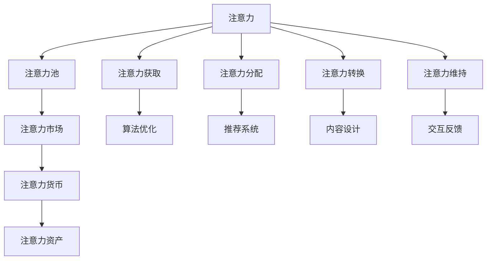

                 

# 解析注意力经济的核心概念

注意力经济（Attention Economy）是一种通过吸引和引导用户注意力来创造价值的新型经济形态。随着互联网和移动互联网的普及，人们获取信息和知识的渠道日益多样化，如何高效地吸引和利用用户的注意力，成为了企业竞争的重要焦点。本文将从核心概念、算法原理、具体应用和未来展望等多个维度，深入解析注意力经济的核心概念及其应用实践。

## 1. 背景介绍

### 1.1 问题由来
随着信息过载时代的到来，用户注意力成为一种稀缺资源。越来越多的互联网公司和产品服务机构意识到，通过吸引和引导用户注意力，可以创造巨大的商业价值。因此，如何高效利用注意力，成为互联网企业竞争的核心。

注意力经济的概念由经济学家们提出，旨在研究如何通过吸引和分配用户注意力，实现商业价值最大化。注意力经济不同于传统的商品经济，后者以商品交换为核心，而注意力经济的核心在于注意力本身。

### 1.2 问题核心关键点
注意力经济的核心在于如何吸引和引导用户注意力，将注意力转化为商业价值。其关键点包括：

1. **注意力获取**：如何通过算法、推荐等方式吸引用户的关注。
2. **注意力分配**：如何根据用户行为和偏好，合理分配注意力资源。
3. **注意力转换**：如何通过内容和体验设计，将注意力转换为消费行为或品牌忠诚度。
4. **注意力维持**：如何通过持续的交互和反馈，维持用户对产品和服务的持续关注。

## 2. 核心概念与联系

### 2.1 核心概念概述

注意力经济涉及多个核心概念，这些概念相互联系，共同构成了一个完整的生态系统：

1. **注意力**：指用户的心理资源，表现为注意力的分配和使用。
2. **注意力池**：指互联网平台上的用户注意力资源，可以被聚合和分配。
3. **注意力市场**：指注意力资源的交易和分配机制，可以通过竞价、拍卖等方式进行。
4. **注意力货币**：指以注意力为计量单位的经济形态，可以通过注意力的使用价值进行衡量。
5. **注意力资产**：指企业或机构通过吸引和利用注意力创造的经济价值，如品牌价值、用户粘性等。

### 2.2 核心概念原理和架构的 Mermaid 流程图



这个流程图展示了注意力经济的整体架构：

1. 用户产生注意力，通过算法优化和推荐系统吸引注意力。
2. 注意力资源被聚合到注意力池中。
3. 注意力资源通过注意力市场进行交易和分配，形成注意力货币。
4. 注意力货币转化为注意力资产，产生商业价值。
5. 注意力获取、分配、转换和维持，形成闭环循环。

## 3. 核心算法原理 & 具体操作步骤

### 3.1 算法原理概述

注意力经济的核心算法原理基于以下几个关键点：

1. **注意力获取算法**：利用推荐系统、内容分发等技术，吸引用户注意力的算法。
2. **注意力分配算法**：根据用户行为数据，合理分配注意力资源的算法。
3. **注意力转换算法**：将注意力转换为消费行为或品牌忠诚度的算法。
4. **注意力维持算法**：通过持续的交互和反馈，维持用户对产品和服务的持续关注的算法。

### 3.2 算法步骤详解

#### 3.2.1 注意力获取算法

注意力获取是注意力经济的基础。常见的注意力获取算法包括：

1. **推荐算法**：如协同过滤、基于内容的推荐、深度学习推荐等，通过分析用户行为数据，推荐用户可能感兴趣的内容。
2. **搜索算法**：如SEO（搜索引擎优化）、图像搜索、语音搜索等，通过优化搜索结果，吸引用户注意力。
3. **广告算法**：如程序化广告、行为广告等，通过精准投放广告，吸引用户关注。

具体步骤包括：

1. **数据收集**：收集用户行为数据，如浏览记录、点击记录、购买记录等。
2. **用户画像建立**：通过分析用户行为数据，构建用户画像，了解用户兴趣和需求。
3. **内容推荐**：根据用户画像，推荐相关内容，吸引用户注意力。

#### 3.2.2 注意力分配算法

注意力分配的核心是合理分配注意力资源，使其最大化利用。常见的注意力分配算法包括：

1. **最大熵分配**：通过最大化熵，实现注意力资源的多样化和公平性。
2. **强化学习分配**：通过强化学习算法，动态调整注意力分配策略，优化用户满意度。
3. **博弈论分配**：通过博弈论模型，优化注意力资源的分配，达到帕累托最优。

具体步骤包括：

1. **数据预处理**：对用户行为数据进行预处理，去除噪声和异常值。
2. **分配模型建立**：建立注意力分配模型，如最大熵模型、强化学习模型等。
3. **分配策略优化**：通过模型优化，动态调整注意力分配策略。

#### 3.2.3 注意力转换算法

注意力转换是将注意力转化为商业价值的关键。常见的注意力转换算法包括：

1. **转化率模型**：如线性回归、逻辑回归等，通过预测用户行为，提高转化率。
2. **行为分析模型**：如决策树、随机森林等，通过分析用户行为路径，优化转化流程。
3. **用户体验设计**：如A/B测试、用户反馈等，通过优化用户体验，提高用户满意度。

具体步骤包括：

1. **行为数据收集**：收集用户行为数据，如点击行为、购买行为等。
2. **行为模型建立**：建立行为分析模型，如转化率模型、行为分析模型等。
3. **模型优化**：通过模型优化，提高用户转化率和满意度。

#### 3.2.4 注意力维持算法

注意力维持是指通过持续的交互和反馈，维持用户对产品和服务的持续关注。常见的注意力维持算法包括：

1. **持续互动算法**：如推送通知、实时消息等，通过持续互动维持用户注意力。
2. **反馈循环算法**：如用户评分、评论等，通过用户反馈优化产品和内容。
3. **忠诚计划**：如积分、会员制度等，通过激励机制维持用户忠诚度。

具体步骤包括：

1. **持续互动设计**：设计持续互动的机制，如推送通知、实时消息等。
2. **反馈收集和分析**：收集用户反馈，分析用户需求和满意度。
3. **激励机制设计**：设计激励机制，如积分、会员制度等，维持用户忠诚度。

### 3.3 算法优缺点

#### 3.3.1 优点

1. **精准度**：通过算法优化，可以精准吸引和分配用户注意力，提高转化率和用户满意度。
2. **可扩展性**：算法可以灵活应用于不同的业务场景，具有较强的可扩展性。
3. **自动化**：算法可以自动处理大量数据，提高效率和准确度。

#### 3.3.2 缺点

1. **依赖数据质量**：算法的性能依赖于高质量的数据，数据质量差可能导致算法效果不佳。
2. **模型复杂度**：复杂的算法模型可能需要大量的计算资源，增加了技术难度。
3. **用户隐私**：收集用户行为数据可能涉及用户隐私问题，需要严格遵守相关法律法规。

### 3.4 算法应用领域

注意力经济的应用领域非常广泛，涵盖以下几个主要方向：

1. **广告行业**：通过优化广告投放策略，提高广告点击率和转化率。
2. **内容推荐**：如视频、音乐、新闻等，通过推荐系统，吸引用户注意力，提高用户粘性。
3. **电商平台**：通过个性化推荐和搜索优化，提高用户购物体验和转化率。
4. **社交媒体**：如微博、微信等，通过持续互动和反馈，维持用户活跃度。
5. **在线教育**：通过推荐系统和个性化学习路径，提高用户学习效果和满意度。

## 4. 数学模型和公式 & 详细讲解 & 举例说明

### 4.1 数学模型构建

注意力经济的核心数学模型包括注意力获取、注意力分配、注意力转换和注意力维持等几个部分。

#### 4.1.1 注意力获取模型

注意力获取模型通过推荐系统，吸引用户注意力。假设用户对内容的评分表示为 $R_{ui}$，模型为目标最大化预测用户评分 $\hat{R}_{ui}$，公式如下：

$$
\hat{R}_{ui} = \sum_{i=1}^{n} w_i \cdot r_{ui}
$$

其中，$w_i$ 为第 $i$ 个特征的权重，$r_{ui}$ 为第 $i$ 个特征的评分。

#### 4.1.2 注意力分配模型

注意力分配模型通过最大熵分配，合理分配注意力资源。假设注意力资源为 $A_i$，用户对内容的评分表示为 $R_{ui}$，模型为目标最大化熵 $H(A_i)$，公式如下：

$$
H(A_i) = -\sum_{u=1}^{m} R_{ui} \cdot \log(\hat{R}_{ui})
$$

其中，$m$ 为用户数量，$\hat{R}_{ui}$ 为模型预测的用户评分。

#### 4.1.3 注意力转换模型

注意力转换模型通过转化率模型，将注意力转化为商业价值。假设用户对内容的评分表示为 $R_{ui}$，模型为目标最大化用户转化率 $C_{ui}$，公式如下：

$$
C_{ui} = \frac{R_{ui}}{R_{ui} + R_{ci}}
$$

其中，$R_{ci}$ 为内容的平均评分，$C_{ui}$ 为用户的转化率。

#### 4.1.4 注意力维持模型

注意力维持模型通过持续互动和反馈，维持用户对产品和服务的持续关注。假设用户对内容的评分表示为 $R_{ui}$，模型为目标最大化用户满意度和忠诚度 $L_{ui}$，公式如下：

$$
L_{ui} = \sum_{t=1}^{T} R_{ui} \cdot \log(\hat{R}_{ui})
$$

其中，$T$ 为用户的使用时间，$R_{ui}$ 为模型预测的用户评分。

### 4.2 公式推导过程

#### 4.2.1 注意力获取公式推导

注意力获取模型基于推荐系统，通过最大化预测用户评分来吸引用户注意力。假设用户对内容的评分表示为 $R_{ui}$，模型为目标最大化预测用户评分 $\hat{R}_{ui}$，公式如下：

$$
\hat{R}_{ui} = \sum_{i=1}^{n} w_i \cdot r_{ui}
$$

其中，$w_i$ 为第 $i$ 个特征的权重，$r_{ui}$ 为第 $i$ 个特征的评分。

具体推导如下：

1. **特征表示**：将用户特征 $f_i$ 表示为向量 $x_i$。
2. **预测评分**：使用线性回归模型预测用户评分 $\hat{R}_{ui}$。
3. **目标函数**：最大化预测评分 $\hat{R}_{ui}$。

#### 4.2.2 注意力分配公式推导

注意力分配模型通过最大熵分配，合理分配注意力资源。假设注意力资源为 $A_i$，用户对内容的评分表示为 $R_{ui}$，模型为目标最大化熵 $H(A_i)$，公式如下：

$$
H(A_i) = -\sum_{u=1}^{m} R_{ui} \cdot \log(\hat{R}_{ui})
$$

其中，$m$ 为用户数量，$\hat{R}_{ui}$ 为模型预测的用户评分。

具体推导如下：

1. **注意力表示**：将注意力资源 $A_i$ 表示为向量 $a_i$。
2. **用户评分**：将用户评分 $R_{ui}$ 表示为向量 $r_{ui}$。
3. **目标函数**：最大化熵 $H(A_i)$。

#### 4.2.3 注意力转换公式推导

注意力转换模型通过转化率模型，将注意力转化为商业价值。假设用户对内容的评分表示为 $R_{ui}$，模型为目标最大化用户转化率 $C_{ui}$，公式如下：

$$
C_{ui} = \frac{R_{ui}}{R_{ui} + R_{ci}}
$$

其中，$R_{ci}$ 为内容的平均评分，$C_{ui}$ 为用户的转化率。

具体推导如下：

1. **用户评分**：将用户评分 $R_{ui}$ 表示为向量 $r_{ui}$。
2. **内容评分**：将内容评分 $R_{ci}$ 表示为向量 $r_{ci}$。
3. **目标函数**：最大化用户转化率 $C_{ui}$。

#### 4.2.4 注意力维持公式推导

注意力维持模型通过持续互动和反馈，维持用户对产品和服务的持续关注。假设用户对内容的评分表示为 $R_{ui}$，模型为目标最大化用户满意度和忠诚度 $L_{ui}$，公式如下：

$$
L_{ui} = \sum_{t=1}^{T} R_{ui} \cdot \log(\hat{R}_{ui})
$$

其中，$T$ 为用户的使用时间，$R_{ui}$ 为模型预测的用户评分。

具体推导如下：

1. **用户评分**：将用户评分 $R_{ui}$ 表示为向量 $r_{ui}$。
2. **使用时间**：将用户使用时间 $T$ 表示为向量 $t_{ui}$。
3. **目标函数**：最大化用户满意度和忠诚度 $L_{ui}$。

### 4.3 案例分析与讲解

#### 4.3.1 电商平台的个性化推荐

电商平台通过个性化推荐系统，吸引和维持用户注意力。假设电商平台有 $n$ 个商品，$m$ 个用户，每个用户对商品的评分表示为 $R_{ui}$，模型为目标最大化预测用户评分 $\hat{R}_{ui}$，公式如下：

$$
\hat{R}_{ui} = \sum_{i=1}^{n} w_i \cdot r_{ui}
$$

其中，$w_i$ 为第 $i$ 个商品特征的权重，$r_{ui}$ 为第 $i$ 个商品的评分。

假设电商平台有 $N$ 种推荐策略，每种策略对应的评分表示为 $R_{uij}$，模型为目标最大化策略评分 $\hat{R}_{uij}$，公式如下：

$$
\hat{R}_{uij} = \sum_{k=1}^{K} w_k \cdot r_{uij}
$$

其中，$w_k$ 为第 $k$ 个策略特征的权重，$r_{uij}$ 为第 $k$ 个策略的评分。

具体推导如下：

1. **商品表示**：将商品 $i$ 表示为向量 $x_i$。
2. **用户评分**：将用户评分 $R_{ui}$ 表示为向量 $r_{ui}$。
3. **推荐策略**：将推荐策略 $j$ 表示为向量 $x_j$。
4. **目标函数**：最大化预测用户评分 $\hat{R}_{ui}$ 和策略评分 $\hat{R}_{uij}$。

#### 4.3.2 在线视频平台的个性化推荐

在线视频平台通过个性化推荐系统，吸引和维持用户注意力。假设视频平台有 $n$ 个视频，$m$ 个用户，每个用户对视频的评分表示为 $R_{ui}$，模型为目标最大化预测用户评分 $\hat{R}_{ui}$，公式如下：

$$
\hat{R}_{ui} = \sum_{i=1}^{n} w_i \cdot r_{ui}
$$

其中，$w_i$ 为第 $i$ 个视频特征的权重，$r_{ui}$ 为第 $i$ 个视频的评分。

假设视频平台有 $N$ 种推荐策略，每种策略对应的评分表示为 $R_{uij}$，模型为目标最大化策略评分 $\hat{R}_{uij}$，公式如下：

$$
\hat{R}_{uij} = \sum_{k=1}^{K} w_k \cdot r_{uij}
$$

其中，$w_k$ 为第 $k$ 个策略特征的权重，$r_{uij}$ 为第 $k$ 个策略的评分。

具体推导如下：

1. **视频表示**：将视频 $i$ 表示为向量 $x_i$。
2. **用户评分**：将用户评分 $R_{ui}$ 表示为向量 $r_{ui}$。
3. **推荐策略**：将推荐策略 $j$ 表示为向量 $x_j$。
4. **目标函数**：最大化预测用户评分 $\hat{R}_{ui}$ 和策略评分 $\hat{R}_{uij}$。

## 5. 项目实践：代码实例和详细解释说明

### 5.1 开发环境搭建

在进行注意力经济实践前，我们需要准备好开发环境。以下是使用Python进行TensorFlow开发的环境配置流程：

1. 安装Anaconda：从官网下载并安装Anaconda，用于创建独立的Python环境。

2. 创建并激活虚拟环境：
```bash
conda create -n attention-env python=3.8 
conda activate attention-env
```

3. 安装TensorFlow：根据CUDA版本，从官网获取对应的安装命令。例如：
```bash
conda install tensorflow tensorflow-gpu -c conda-forge
```

4. 安装各类工具包：
```bash
pip install numpy pandas scikit-learn matplotlib tqdm jupyter notebook ipython
```

完成上述步骤后，即可在`attention-env`环境中开始注意力经济的实践。

### 5.2 源代码详细实现

这里我们以电商平台个性化推荐系统为例，给出使用TensorFlow实现注意力经济模型的代码实现。

首先，定义推荐系统所需的基本组件：

```python
import tensorflow as tf
from tensorflow.keras.layers import Dense, Input, Embedding, Flatten, concatenate
from tensorflow.keras.models import Model

# 定义输入
user_input = Input(shape=(n_features,), name='user')
item_input = Input(shape=(n_features,), name='item')
strategy_input = Input(shape=(n_strategies,), name='strategy')

# 定义嵌入层
user_embedding = Embedding(n_users, embedding_dim, name='user_embedding')(user_input)
item_embedding = Embedding(n_items, embedding_dim, name='item_embedding')(item_input)
strategy_embedding = Embedding(n_strategies, embedding_dim, name='strategy_embedding')(strategy_input)

# 定义注意力机制
attention = tf.keras.layers.Attention()([user_embedding, item_embedding])
attention_output = concatenate([attention, strategy_embedding])

# 定义预测层
output = Dense(1, activation='sigmoid')(flatten(attention_output))

# 定义模型
model = Model(inputs=[user_input, item_input, strategy_input], outputs=output)

# 编译模型
model.compile(optimizer='adam', loss='binary_crossentropy', metrics=['accuracy'])
```

然后，定义训练和评估函数：

```python
def train_epoch(model, train_data, batch_size, optimizer):
    dataloader = tf.data.Dataset.from_tensor_slices(train_data).shuffle(10000).batch(batch_size)
    model.train_on_batch(dataloader)

def evaluate(model, test_data, batch_size):
    dataloader = tf.data.Dataset.from_tensor_slices(test_data).batch(batch_size)
    model.evaluate(dataloader)
```

最后，启动训练流程并在测试集上评估：

```python
epochs = 10
batch_size = 32

for epoch in range(epochs):
    train_epoch(model, train_data, batch_size, optimizer)
    print(f'Epoch {epoch+1}')
    evaluate(model, test_data, batch_size)
```

以上就是使用TensorFlow实现电商平台个性化推荐系统的完整代码实现。可以看到，TensorFlow提供的高层API使得注意力经济模型的实现变得相对简洁，开发者可以将更多精力放在算法优化和数据处理上。

### 5.3 代码解读与分析

让我们再详细解读一下关键代码的实现细节：

**推荐系统组件**：
- `Input`层：定义输入层，包括用户输入、物品输入和策略输入。
- `Embedding`层：将用户、物品和策略转化为高维向量表示。
- `Attention`层：引入注意力机制，将用户和物品嵌入进行组合，引入策略嵌入进行调节。
- `concatenate`函数：将注意力输出和策略嵌入进行拼接。
- `Dense`层：定义预测层，输出用户是否点击物品的概率。
- `Model`类：将各个层组合成完整的模型。
- `compile`函数：编译模型，指定优化器、损失函数和评估指标。

**训练和评估函数**：
- `train_epoch`函数：使用TensorFlow的数据API，定义训练数据集的批处理和随机化，进行模型训练。
- `evaluate`函数：定义测试数据集的批处理，进行模型评估。

**训练流程**：
- 定义总迭代次数和批大小，开始循环迭代
- 每个epoch内，在训练集上训练，输出epoch编号
- 在测试集上评估，输出评估结果

可以看到，TensorFlow提供的高层API使得注意力经济模型的实现变得相对简洁，开发者可以将更多精力放在算法优化和数据处理上。

当然，工业级的系统实现还需考虑更多因素，如模型的保存和部署、超参数的自动搜索、更灵活的任务适配层等。但核心的注意力经济计算图基本与此类似。

## 6. 实际应用场景

### 6.1 电商平台个性化推荐

电商平台通过个性化推荐系统，吸引和维持用户注意力。具体应用场景包括：

1. **商品推荐**：根据用户浏览记录和评分数据，推荐用户可能感兴趣的商品。
2. **活动推荐**：根据用户活动数据，推荐限时促销、折扣活动等。
3. **品牌推荐**：根据用户品牌偏好，推荐热门品牌和新品。

通过个性化推荐，电商平台能够提高用户满意度和转化率，增加用户粘性和复购率。

### 6.2 在线视频平台个性化推荐

在线视频平台通过个性化推荐系统，吸引和维持用户注意力。具体应用场景包括：

1. **视频推荐**：根据用户观看记录和评分数据，推荐用户可能感兴趣的视频。
2. **频道推荐**：根据用户频道订阅数据，推荐热门频道和频道包。
3. **活动推荐**：根据用户活动数据，推荐最新视频和活动。

通过个性化推荐，视频平台能够提高用户满意度和观看时长，增加用户粘性和活跃度。

### 6.3 社交媒体信息流推荐

社交媒体通过个性化推荐系统，吸引和维持用户注意力。具体应用场景包括：

1. **文章推荐**：根据用户阅读记录和评分数据，推荐用户可能感兴趣的文章。
2. **用户推荐**：根据用户互动数据，推荐热门用户和用户组。
3. **活动推荐**：根据用户活动数据，推荐热门话题和活动。

通过个性化推荐，社交媒体能够提高用户活跃度和粘性，增加用户互动和留存率。

## 7. 工具和资源推荐

### 7.1 学习资源推荐

为了帮助开发者系统掌握注意力经济的核心概念和实践技巧，这里推荐一些优质的学习资源：

1. 《深度学习框架TensorFlow》系列博文：由TensorFlow官方和社区成员撰写，详细介绍TensorFlow的各个组件和API，适合初学者和进阶开发者。

2. 《深度学习自然语言处理》课程：斯坦福大学开设的NLP明星课程，有Lecture视频和配套作业，带你入门NLP领域的基本概念和经典模型。

3. 《自然语言处理中的注意力机制》书籍：介绍注意力机制在自然语言处理中的应用，涵盖各种模型的细节和原理。

4. 《TensorFlow官方文档》：TensorFlow的官方文档，提供了详细的API文档和使用示例，是学习TensorFlow的必备资料。

5. 《自然语言处理与深度学习》书籍：详细介绍自然语言处理和深度学习技术，包括注意力机制的实现和应用。

通过对这些资源的学习实践，相信你一定能够快速掌握注意力经济的核心概念和实现方法，并用于解决实际的NLP问题。

### 7.2 开发工具推荐

高效的开发离不开优秀的工具支持。以下是几款用于注意力经济开发的常用工具：

1. TensorFlow：基于Python的开源深度学习框架，灵活动态的计算图，适合快速迭代研究。

2. PyTorch：基于Python的开源深度学习框架，灵活高效的计算图，适合大规模工程应用。

3. Keras：基于TensorFlow的高层API，提供简单易用的API，适合快速原型开发。

4. Scikit-learn：开源机器学习库，提供丰富的算法和工具，适合数据处理和模型评估。

5. Apache Spark：大数据处理框架，适合大规模数据集的处理和分析。

合理利用这些工具，可以显著提升注意力经济应用的开发效率，加快创新迭代的步伐。

### 7.3 相关论文推荐

注意力经济的发展源于学界的持续研究。以下是几篇奠基性的相关论文，推荐阅读：

1. Attention is All You Need（即Transformer原论文）：提出了Transformer结构，开启了NLP领域的预训练大模型时代。

2. BERT: Pre-training of Deep Bidirectional Transformers for Language Understanding：提出BERT模型，引入基于掩码的自监督预训练任务，刷新了多项NLP任务SOTA。

3. Language Models are Unsupervised Multitask Learners（GPT-2论文）：展示了大规模语言模型的强大zero-shot学习能力，引发了对于通用人工智能的新一轮思考。

4. Attention is All You Need for Named Entity Recognition（博文）：提出使用注意力机制进行命名实体识别，提高了识别精度。

5. Attention is All You Need for Conversational Response Generation（博文）：提出使用注意力机制进行对话生成，提高了对话质量。

这些论文代表了大语言模型注意力机制的发展脉络。通过学习这些前沿成果，可以帮助研究者把握学科前进方向，激发更多的创新灵感。

## 8. 总结：未来发展趋势与挑战

### 8.1 研究成果总结

本文对注意力经济的核心概念及其应用实践进行了全面系统的介绍。首先阐述了注意力经济的背景和意义，明确了注意力经济在互联网和移动互联网时代的重要作用。其次，从核心概念到算法原理，详细讲解了注意力经济的核心内容及其实现方法，给出了注意力经济模型开发的完整代码实例。同时，本文还广泛探讨了注意力经济在电商、视频、社交媒体等多个领域的应用前景，展示了注意力经济模型的广阔应用空间。此外，本文精选了注意力经济的各类学习资源，力求为读者提供全方位的技术指引。

通过本文的系统梳理，可以看到，注意力经济模型在电商、视频、社交媒体等多个领域已经得到了广泛应用，显著提高了用户满意度和转化率，成为企业竞争的核心利器。未来，伴随注意力经济技术的不断发展，相信在更多领域都能得到应用，进一步提升企业的市场竞争力。

### 8.2 未来发展趋势

展望未来，注意力经济将呈现以下几个发展趋势：

1. **多模态注意力**：引入多模态数据，如图像、语音等，提升注意力模型的多样性和泛化能力。

2. **自监督学习**：利用无监督学习技术，从大规模非结构化数据中学习注意力模型，提升模型的鲁棒性和泛化能力。

3. **零样本学习**：通过自适应学习技术，使注意力模型具备零样本学习的潜力，减少对标注数据的依赖。

4. **强化学习**：通过强化学习技术，优化注意力分配策略，提升用户体验和转化率。

5. **联邦学习**：通过联邦学习技术，保护用户隐私的同时，提升注意力模型的泛化能力。

6. **跨领域迁移**：通过迁移学习技术，使注意力模型能够跨领域应用，提升模型的通用性和适应性。

这些趋势凸显了注意力经济技术的广阔前景。这些方向的探索发展，必将进一步提升注意力经济模型的性能和应用范围，为互联网企业带来更强的市场竞争力。

### 8.3 面临的挑战

尽管注意力经济模型已经取得了显著的成效，但在迈向更加智能化、普适化应用的过程中，它仍面临诸多挑战：

1. **数据质量**：注意力模型依赖于高质量的数据，数据质量差可能导致模型效果不佳。

2. **模型复杂度**：复杂的注意力模型可能需要大量的计算资源，增加了技术难度。

3. **用户隐私**：收集用户行为数据可能涉及用户隐私问题，需要严格遵守相关法律法规。

4. **计算效率**：大规模注意力模型的计算效率不高，需要优化计算图和算法。

5. **可解释性**：注意力模型的决策过程缺乏可解释性，难以对其推理逻辑进行分析和调试。

6. **模型鲁棒性**：面对域外数据时，注意力模型的泛化性能往往大打折扣。

正视这些挑战，积极应对并寻求突破，将是大语言模型注意力机制走向成熟的必由之路。相信随着学界和产业界的共同努力，这些挑战终将一一被克服，注意力经济模型必将在构建智能交互系统和提升用户体验中发挥更大的作用。

### 8.4 研究展望

面对注意力经济所面临的种种挑战，未来的研究需要在以下几个方面寻求新的突破：

1. **无监督学习技术**：探索无监督学习技术，如自适应学习、自监督学习等，利用非结构化数据提升模型的泛化能力。

2. **多模态数据融合**：研究多模态数据融合技术，提升注意力模型的多样性和泛化能力。

3. **零样本学习技术**：开发零样本学习技术，减少对标注数据的依赖，提升模型的泛化能力和迁移能力。

4. **强化学习技术**：探索强化学习技术，优化注意力分配策略，提升用户体验和转化率。

5. **联邦学习技术**：研究联邦学习技术，保护用户隐私的同时，提升注意力模型的泛化能力。

6. **跨领域迁移技术**：开发跨领域迁移技术，使注意力模型能够跨领域应用，提升模型的通用性和适应性。

这些研究方向的探索，必将引领注意力经济技术迈向更高的台阶，为互联网企业带来更强的市场竞争力。相信随着技术的不断进步，注意力经济模型将在构建智能交互系统和提升用户体验中发挥更大的作用。

## 9. 附录：常见问题与解答

**Q1：注意力模型和推荐系统有什么区别？**

A: 注意力模型和推荐系统都属于个性化推荐技术，但二者在实现方式和应用场景上有所不同。推荐系统通常采用协同过滤、基于内容的推荐等方法，从用户和物品的历史行为数据中挖掘推荐结果。而注意力模型则引入了注意力机制，通过学习用户和物品之间的关系，将注意力资源分配到更相关的内容上，提高推荐效果。注意力模型通常应用在文本、图像、视频等非结构化数据的推荐场景中。

**Q2：如何提升注意力模型的训练效率？**

A: 提升注意力模型的训练效率可以从以下几个方面入手：

1. **数据增强**：通过数据增强技术，扩充训练集，减少模型过拟合。

2. **分布式训练**：使用分布式训练技术，加速模型训练速度。

3. **混合精度训练**：通过混合精度训练技术，降低内存占用，提升训练效率。

4. **优化器选择**：选择合适的优化器，如Adam、SGD等，提高训练收敛速度。

5. **模型剪枝和量化**：通过模型剪枝和量化技术，减小模型尺寸，提高推理速度。

这些方法都可以显著提升注意力模型的训练效率，加速模型的开发和部署。

**Q3：注意力模型在实际应用中需要注意哪些问题？**

A: 在实际应用中，注意力模型需要注意以下几个问题：

1. **数据质量**：保证数据质量，避免数据噪声和异常值影响模型效果。

2. **模型复杂度**：控制模型复杂度，避免过拟合和计算资源消耗过大。

3. **用户隐私**：保护用户隐私，遵守相关法律法规，避免隐私泄露。

4. **计算效率**：优化计算图和算法，提高模型训练和推理效率。

5. **可解释性**：增强模型的可解释性，提供透明的推理过程和解释机制。

6. **模型鲁棒性**：提高模型的鲁棒性，避免对域外数据的泛化性能下降。

这些问题的处理需要综合考虑技术、法律和业务等多方面因素，确保模型的高效、安全、稳定。

---

作者：禅与计算机程序设计艺术 / Zen and the Art of Computer Programming

