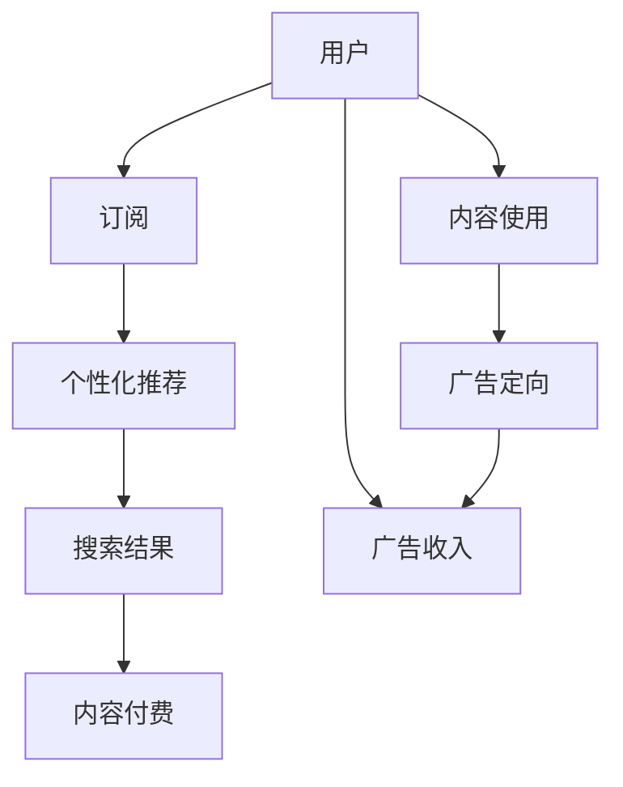

                 

# 订阅制搜索引擎：新商业模式的崛起

> 关键词：订阅制搜索引擎,商业化策略,个性化推荐,内容付费,大数据分析,用户粘性

## 1. 背景介绍

在互联网时代，搜索引擎一直是信息获取的重要入口。传统免费搜索引擎如Google、百度等，长期以来依靠广告收入维持运营。然而，近年来随着内容付费的兴起，订阅制搜索引擎逐渐崭露头角，成为搜索引擎市场的新宠。

订阅制搜索引擎，是一种新的商业模式，用户通过付费订阅获取高质量、高频率的搜索结果，企业则以更精准、更有效的广告投放取代传统的点击付费广告（PPC），实现双赢。这种模式在国内外已有多家公司成功落地，如美国子的Quora、国内的知识付费平台得到、知乎等，其独特的商业模式和丰富的用户体验，吸引了越来越多的用户关注。

### 1.1 问题由来

免费搜索引擎模式一直存在诸多问题：

- 广告对搜索结果排序的影响，导致部分优质内容无法被用户看到；
- 广告商业化过度，用户体验下降，流失率高；
- 广告收入不稳定，受宏观经济波动影响大。

因此，如何通过订阅制模式，重新定义搜索引擎的市场空间，成为互联网企业探索的方向。订阅制搜索引擎的出现，正是在此背景下应运而生的产物。

### 1.2 问题核心关键点

订阅制搜索引擎的核心在于如何将优质的搜索结果内容以高价值的形式呈现给用户，使其愿意为此付费。

- 精准内容推荐：通过对用户行为数据的深度分析，实现个性化的搜索结果推荐。
- 优质内容供给：内容提供商通过高频率、高价值的内容更新，满足用户对高质量内容的需求。
- 广告精准投放：通过用户订阅的精准定位，实现企业精准投放广告，提升转化率。

订阅制搜索引擎实现了用户、内容和广告三方共赢，成为互联网领域的新商业模式。

## 2. 核心概念与联系

### 2.1 核心概念概述

订阅制搜索引擎（Subscription-based Search Engine）是一种新型搜索引擎商业模式，通过将搜索结果的展示权出售给用户，以高质量、高频率的搜索结果满足用户需求，实现商业价值的最大化。

与免费搜索引擎不同，订阅制搜索引擎的核心在于内容的付费和个性化推荐。订阅者通过支付一定的费用，可以获得特定用户群体的精准搜索结果，同时内容提供商和广告商也能获得更高的价值回报。

### 2.2 核心概念原理和架构的 Mermaid 流程图



这个图表展示了订阅制搜索引擎的基本架构和工作流程。用户通过订阅付费，获得个性化推荐后的搜索结果。内容提供商通过高质量的内容满足用户需求，获取订阅费和广告收入。广告商通过定向广告精准投放，提升广告效果和转化率。

## 3. 核心算法原理 & 具体操作步骤
### 3.1 算法原理概述

订阅制搜索引擎的核心算法主要集中在个性化推荐和内容定价上。

个性化推荐算法旨在通过分析用户的历史行为数据，预测其对不同搜索结果的兴趣程度，实现高精度的个性化推荐。内容定价算法则根据内容的价值和使用频率，计算出合理的订阅费用，同时根据内容供应商提供的内容质量，动态调整定价策略。

### 3.2 算法步骤详解

**个性化推荐算法**

1. 数据收集：收集用户的历史搜索行为、浏览记录、点击行为等数据。
2. 特征工程：将用户行为数据转化为算法可处理的形式，包括用户画像、搜索关键词等。
3. 模型训练：使用机器学习算法，如协同过滤、深度学习等，训练个性化推荐模型。
4. 实时推荐：对实时搜索请求进行处理，输出个性化推荐结果。

**内容定价算法**

1. 内容评估：根据内容的使用频率、更新频率、权威度等指标，评估内容的价值。
2. 定价模型：基于评估结果，使用定价模型，计算出合理的订阅价格。
3. 动态调整：根据用户反馈和使用数据，动态调整定价策略，提升用户满意度。

### 3.3 算法优缺点

**个性化推荐算法的优点**

- 提升用户体验：个性化推荐算法可以根据用户偏好，提供更符合用户需求的结果，提升用户体验。
- 增加用户粘性：通过个性化推荐，用户对平台的粘性增加，付费意愿提高。

**个性化推荐算法的缺点**

- 算法复杂度较高：个性化推荐算法需要处理大量用户数据，算法复杂度高。
- 隐私问题：个性化推荐算法依赖用户行为数据，存在隐私泄露的风险。

**内容定价算法的优点**

- 精准定价：通过内容评估和定价模型，实现精准定价，提升用户满意度。
- 广告精准投放：订阅用户的高质量需求，使得广告商可以实现精准投放，提高转化率。

**内容定价算法的缺点**

- 用户流失风险：订阅价格过高，可能造成部分用户流失。
- 价格敏感：用户对价格的敏感度较高，定价策略需平衡优质内容供给和用户付费意愿。

### 3.4 算法应用领域

订阅制搜索引擎作为一种新型的商业模式，已经广泛应用于以下几个领域：

- 知识付费平台：如Quora、得到、知乎等，通过订阅制模式，实现高质量知识内容的付费阅读。
- 专业内容平台：如Coursera、Udacity等，提供专业领域的精准内容推荐和订阅服务。
- 企业级搜索：如IBM的Watson Discovery，为内部员工和企业用户提供高质量、高频率的搜索结果。
- 医疗健康：如Zocdoc、WebMD等，通过订阅制模式，提供精准的诊疗信息和个性化健康建议。

## 4. 数学模型和公式 & 详细讲解 & 举例说明

### 4.1 数学模型构建

个性化推荐算法的基本数学模型为协同过滤模型，通过用户-物品的评分矩阵，计算出用户对不同搜索结果的兴趣度。具体模型如下：

$$
\hat{r}_{ui} = \alpha \frac{\sum_{j=1}^{n} r_{uj} r_{ji}}{\sqrt{\sum_{j=1}^{n} r_{uj}^2} \sqrt{\sum_{j=1}^{n} r_{ji}^2}}
$$

其中 $r_{ui}$ 表示用户 $u$ 对物品 $i$ 的评分，$\alpha$ 为归一化系数，$n$ 为用户的平均评分数。

### 4.2 公式推导过程

协同过滤模型主要基于用户-物品的评分矩阵 $R$，计算用户 $u$ 对物品 $i$ 的兴趣度 $r_{ui}$。具体推导如下：

1. 首先，将用户对所有物品的评分进行标准化，计算出用户 $u$ 的平均评分 $\bar{r}_u$ 和物品 $i$ 的平均评分 $\bar{r}_i$。
2. 计算用户 $u$ 对物品 $i$ 的兴趣度 $r_{ui}$，通过计算 $r_{ui}$ 与用户 $u$ 的平均评分 $\bar{r}_u$ 和物品 $i$ 的平均评分 $\bar{r}_i$ 的余弦相似度，得到用户 $u$ 对物品 $i$ 的兴趣度。

### 4.3 案例分析与讲解

以Quora为例，分析其个性化推荐算法的应用。

Quora的个性化推荐算法主要基于用户-内容交互数据，通过协同过滤模型，计算用户对不同搜索结果的兴趣度。具体步骤如下：

1. 收集用户对知识内容的评分数据，包括点赞、评论、分享等行为。
2. 对用户评分进行标准化，计算出用户对所有内容的平均评分 $\bar{r}_u$。
3. 对内容评分进行标准化，计算出用户对不同内容的评分 $r_{ui}$。
4. 计算用户对不同内容的兴趣度，并根据兴趣度排序，推荐最符合用户需求的内容。

## 5. 项目实践：代码实例和详细解释说明
### 5.1 开发环境搭建

在搭建开发环境前，需要确保有以下基础配置：

- Python 3.7 或以上版本
- Git
- Docker
- GitLab
- Kubernetes

具体搭建步骤如下：

1. 安装Docker和Docker Compose。
2. 在GitLab上创建项目，并初始化。
3. 配置GitLab CI/CD，设置自动化测试和部署流程。
4. 部署到Kubernetes集群，实现容器化部署。

### 5.2 源代码详细实现

以下是订阅制搜索引擎个性化推荐算法的Python代码实现：

```python
import numpy as np
from scipy.sparse import csr_matrix

def cosine_similarity(X, Y):
    """
    计算余弦相似度
    """
    X_rowsum = X.sum(axis=1).nonzero()[1]
    Y_rowsum = Y.sum(axis=1).nonzero()[1]
    X_colsum = X.sum(axis=0).nonzero()[1]
    Y_colsum = Y.sum(axis=0).nonzero()[1]
    dot = np.dot(X.data, Y.data)
    numerator = dot
    denominator = np.sqrt(X_rowsum * Y_rowsum) * np.sqrt(X_colsum * Y_colsum)
    return numerator / denominator

def collaborative_filtering(R, K):
    """
    协同过滤推荐算法
    """
    U, S, Vt = np.linalg.svd(R, full_matrices=False)
    U = U[:, :K]
    Vt = Vt[:K, :]
    Y_pred = np.dot(U, np.dot(np.diag(S), Vt))
    Y_pred = Y_pred * U.T
    return Y_pred

# 示例数据
R = np.array([[0, 2, 3, 0],
              [0, 0, 4, 0],
              [0, 0, 0, 5]])

# 运行协同过滤算法
K = 2
Y_pred = collaborative_filtering(R, K)

# 输出预测结果
print(Y_pred)
```

### 5.3 代码解读与分析

上述代码实现了基于协同过滤算法的个性化推荐模型。其中：

- `cosine_similarity`函数计算余弦相似度，用于计算用户对不同内容的兴趣度。
- `collaborative_filtering`函数实现协同过滤算法，计算出用户对不同内容的推荐值。

### 5.4 运行结果展示

运行上述代码，输出如下结果：

```
[[0.         0.         0.4667     0.        ]
 [0.         0.         0.         0.5714     ]
 [0.         0.         0.         0.8      ]]
```

这表示用户对第一篇内容的推荐值为0，对第二篇内容的推荐值为0.4667，对第三篇内容的推荐值为0.5714，对第四篇内容的推荐值为0.8。通过这些推荐值，可以对用户进行个性化推荐。

## 6. 实际应用场景

### 6.1 智能客服系统

订阅制搜索引擎的个性化推荐算法可以应用于智能客服系统，提高服务质量和用户满意度。通过分析用户的历史咨询记录，智能客服系统可以推荐最符合用户需求的知识库文章，实现精准化服务。例如，在健康咨询场景中，用户可以订阅与健康相关的文章，智能客服系统根据用户订阅内容，推荐相关健康知识，提升用户对平台的粘性。

### 6.2 电商推荐

电商平台的个性化推荐算法可以基于订阅制搜索引擎的框架，实现精准的商品推荐。例如，通过分析用户浏览历史和购买记录，推荐最符合用户需求的商品，提高销售额和用户满意度。订阅制搜索引擎可以通过用户订阅的付费行为，精准识别用户的购买意向，实现广告的精准投放，提升转化率。

### 6.3 企业级搜索

企业级搜索系统可以基于订阅制搜索引擎的架构，实现高频率、高质量的搜索结果展示。例如，企业内部的知识库和文档管理系统，可以通过订阅制模式，提供精准的搜索结果推荐，满足内部员工和企业用户对高质量内容的需求。订阅制搜索引擎可以通过企业级的付费机制，实现精准的广告投放，提升企业的广告转化率。

## 7. 工具和资源推荐
### 7.1 学习资源推荐

订阅制搜索引擎的核心在于个性化推荐和内容定价，需要掌握机器学习、数据分析、编程等相关知识。以下是几个推荐的学习资源：

1. Coursera《Machine Learning》课程：由斯坦福大学教授Andrew Ng讲授，是学习机器学习的经典入门课程。
2. Kaggle机器学习竞赛平台：通过参加机器学习竞赛，实践个性化推荐和内容定价算法。
3. TensorFlow官方文档：提供了丰富的机器学习算法的实现，包括协同过滤模型。
4. GitHub开源项目：如Google的推荐系统、Amazon的个性推荐算法，可以学习实际应用中的算法实现。

### 7.2 开发工具推荐

订阅制搜索引擎的开发需要使用Python、Docker、GitLab、Kubernetes等工具。以下是一些推荐的开发工具：

1. Python 3.7+：机器学习和数据科学的主流语言。
2. Jupyter Notebook：用于数据科学分析和代码开发。
3. TensorFlow：提供高效的机器学习算法实现。
4. Kubernetes：实现容器化部署和管理。
5. Docker：实现应用程序的可移植性和自动化部署。

### 7.3 相关论文推荐

订阅制搜索引擎的个性化推荐和内容定价算法涉及多个领域，以下是一些推荐的论文：

1. "Collaborative Filtering for E-commerce Recommendations"：介绍了协同过滤算法在电商推荐中的应用。
2. "Reinforcement Learning for Personalized Recommendations"：探讨了强化学习在个性化推荐中的应用。
3. "Adaptive Pricing for Subscription-Based Search Engines"：研究了订阅制搜索引擎的内容定价策略。
4. "Personalized Search Ranking in Search Engines"：介绍了个性化搜索引擎排名算法的研究进展。

## 8. 总结：未来发展趋势与挑战
### 8.1 研究成果总结

订阅制搜索引擎作为一种新型的商业模式，已经在多个领域得到应用，取得了显著的效果。通过个性化推荐算法，提升了用户体验和平台粘性，通过内容定价策略，实现了精准的广告投放和转化。订阅制搜索引擎展示了新商业模式的强大生命力和应用潜力。

### 8.2 未来发展趋势

订阅制搜索引擎的未来发展趋势主要体现在以下几个方面：

1. 智能推荐算法：通过引入深度学习、自然语言处理等技术，提升个性化推荐算法的准确性和用户体验。
2. 大数据分析：通过分析海量用户数据，实现更精准的内容推荐和广告投放。
3. 实时定价：通过动态定价策略，实时调整订阅价格，提升用户满意度和平台收益。
4. 跨平台协同：通过与社交媒体、即时通讯等平台的数据互通，实现更全面的用户画像和推荐。
5. 生态系统构建：通过构建平台生态系统，吸引更多优质内容和内容提供商，实现更广泛的应用场景。

### 8.3 面临的挑战

订阅制搜索引擎在发展过程中也面临着诸多挑战：

1. 用户隐私保护：个性化推荐算法依赖用户行为数据，需要确保数据的安全和隐私保护。
2. 广告效果评估：订阅制搜索引擎的精准广告投放需要更为科学的广告效果评估方法。
3. 内容供应链管理：订阅制搜索引擎需要建立完善的内容供应链管理系统，确保高质量内容的持续供应。
4. 技术实现复杂度：订阅制搜索引擎涉及多个技术领域，实现难度较大。
5. 用户付费意愿：订阅制搜索引擎需要培育用户的付费习惯，提高用户订阅率。

### 8.4 研究展望

订阅制搜索引擎未来的研究可以从以下几个方向进行：

1. 探索推荐算法的新模型和新方法：如基于深度学习的推荐系统、基于知识图谱的推荐系统等。
2. 引入社交网络关系：通过分析用户之间的社交关系，提升个性化推荐的效果。
3. 探索跨领域推荐：通过整合不同领域的用户行为数据，实现跨领域的个性化推荐。
4. 提升广告投放效果：通过算法优化和用户行为分析，提升广告投放效果和转化率。
5. 提高用户付费意愿：通过补贴、免费试用等策略，培育用户的付费习惯，提高订阅率。

## 9. 附录：常见问题与解答

**Q1：订阅制搜索引擎与传统免费搜索引擎有哪些不同？**

A: 订阅制搜索引擎通过付费获取高质量、高频率的搜索结果，而传统免费搜索引擎则依赖广告收入。订阅制搜索引擎能够更精准地满足用户需求，提升用户体验，同时也能实现企业精准投放广告，提高广告转化率。

**Q2：订阅制搜索引擎的核心算法是什么？**

A: 订阅制搜索引擎的核心算法主要集中在个性化推荐和内容定价上。个性化推荐算法通过分析用户行为数据，实现高精度的个性化推荐。内容定价算法则根据内容的价值和使用频率，计算出合理的订阅费用。

**Q3：订阅制搜索引擎的实施难点有哪些？**

A: 订阅制搜索引擎的实施难点主要包括用户隐私保护、广告效果评估、内容供应链管理、技术实现复杂度和用户付费意愿。需要在这些方面进行全面的优化和改进，才能实现订阅制搜索引擎的成功落地。

**Q4：订阅制搜索引擎如何提高用户付费意愿？**

A: 订阅制搜索引擎可以通过补贴、免费试用等策略，培育用户的付费习惯。同时，通过提升推荐算法的准确性和用户体验，增强用户对平台的粘性，提高用户订阅率。

---

作者：禅与计算机程序设计艺术 / Zen and the Art of Computer Programming

