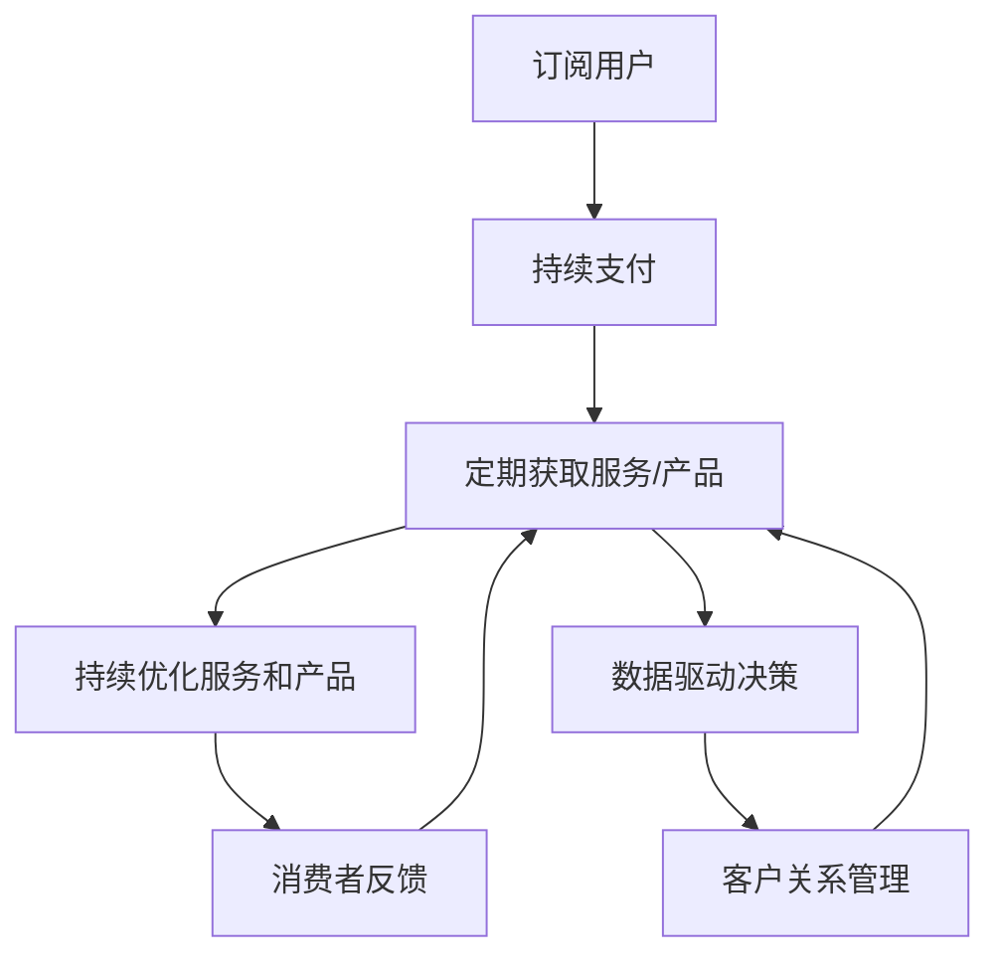

                 

# 订阅制经济的发展趋势:从产品订阅到服务订阅

> 关键词：订阅制经济、产品订阅、服务订阅、平台模式、订阅业务、商业模式创新

## 1. 背景介绍

### 1.1 问题由来
随着互联网技术的快速发展，特别是移动互联网的普及，消费者的消费行为发生了根本性变化。越来越多的消费者倾向于通过订阅方式获取内容和服务，而不再依赖一次性的购买。这种从产品消费到服务消费的转变，不仅改变了消费者与企业的互动方式，也重塑了商业模式的本质。订阅制经济成为新时代商业的主流模式，深刻影响着各行各业的发展。

### 1.2 问题核心关键点
订阅制经济的核心在于通过持续提供有价值的服务，而非单次交易的利润，建立起长期的客户关系。这一模式的核心要素包括：

1. **持续性**：订阅业务强调持续性，消费者定期支付费用以换取服务。
2. **价值绑定**：订阅服务与消费者需求紧密绑定，提升客户粘性。
3. **用户运营**：通过数据分析和用户反馈，持续优化服务和产品。
4. **商业模式**：从一次性买卖转向长期价值创造，增加了收入的稳定性。

订阅制经济不仅仅适用于传统媒体、软件和娱乐等行业，也在逐步向其他领域渗透，如健康、教育、物流等。通过订阅制，企业能够更好地满足消费者需求，提升品牌忠诚度，实现可持续发展。

### 1.3 问题研究意义
研究订阅制经济的发展趋势，对于理解现代消费行为、优化商业模式、推动数字化转型具有重要意义。尤其是在全球疫情背景下，订阅制经济更成为了许多企业实现稳定收入、维持运营的重要手段。

## 2. 核心概念与联系

### 2.1 核心概念概述

订阅制经济是一种基于持续性支付的商业模式，主要分为产品订阅和服务订阅两大类。以下对这两类订阅模式进行详细阐述：

- **产品订阅**：如电影、音乐、软件等，消费者通过定期支付，获取对产品的持续访问权。
- **服务订阅**：如SaaS、健康管理、在线教育等，消费者通过定期支付，获取持续的服务支持。

订阅制经济的成功，依赖于产品或服务的持续创新和优化，以及与消费者建立深度的连接。订阅模式的核心在于通过稳定的收入流，持续投入研发和服务提升，形成良性循环。

### 2.2 核心概念原理和架构的 Mermaid 流程图



这个流程图展示了订阅制经济的运行流程：

1. 用户通过持续支付获得服务或产品。
2. 服务或产品提供商持续优化服务或产品。
3. 通过用户反馈，持续改进服务或产品。
4. 数据驱动的决策，优化客户关系管理。

订阅制经济的架构核心在于建立一个持续优化的闭环系统，通过稳定的收入流，持续提升服务或产品的质量，满足消费者的多样化需求。

## 3. 核心算法原理 & 具体操作步骤

### 3.1 算法原理概述

订阅制经济的算法原理主要围绕消费者行为分析、个性化推荐、续订预测等方面展开。以下是对核心算法原理的概述：

1. **消费者行为分析**：通过数据分析，了解消费者的消费习惯和偏好，为个性化推荐和服务优化提供依据。
2. **个性化推荐**：根据消费者历史行为，推荐符合其兴趣和需求的服务或产品，提升用户满意度。
3. **续订预测**：预测用户是否会续订，通过个性化营销和激励措施提升续订率。

这些算法原理的实现，依赖于机器学习、自然语言处理、图像识别等前沿技术，通过数据驱动的方式，不断优化订阅体验。

### 3.2 算法步骤详解

以下详细阐述订阅制经济的核心算法步骤：

#### 3.2.1 消费者行为分析

**步骤1**：数据采集
- 采集消费者的历史行为数据，包括购买记录、访问日志、反馈信息等。

**步骤2**：数据清洗和预处理
- 清洗异常数据和噪声，确保数据质量。
- 进行特征工程，提取有意义的特征。

**步骤3**：模型训练
- 使用机器学习模型（如决策树、随机森林、神经网络等）进行消费者行为分析。
- 对模型进行调优，提升预测准确度。

**步骤4**：模型部署和应用
- 将训练好的模型部署到实际系统中。
- 实时分析消费者行为，指导个性化推荐和服务优化。

#### 3.2.2 个性化推荐

**步骤1**：特征提取
- 提取用户行为、偏好、历史数据等特征。

**步骤2**：模型训练
- 使用协同过滤、基于内容的推荐、深度学习等算法，训练推荐模型。
- 对模型进行评估，选择性能最优的算法。

**步骤3**：推荐实现
- 根据用户当前行为，实时推荐符合其兴趣的服务或产品。
- 实现推荐引擎，进行个性化推荐。

#### 3.2.3 续订预测

**步骤1**：数据采集
- 收集用户历史支付记录、续订行为、反馈信息等。

**步骤2**：数据处理
- 清洗异常数据和噪声，进行特征工程。
- 构建特征集合，包括历史支付行为、使用频率、反馈评分等。

**步骤3**：模型训练
- 使用分类算法（如逻辑回归、决策树、支持向量机等）进行续订预测。
- 对模型进行调优，提升预测准确度。

**步骤4**：模型应用
- 实时预测用户续订意愿，根据预测结果进行个性化营销和激励。
- 部署续订预测模型，指导用户关系管理。

### 3.3 算法优缺点

订阅制经济的算法优点包括：

1. **持续收入**：通过稳定的订阅收入，企业能够实现收入的稳定性。
2. **用户粘性**：通过个性化推荐和服务优化，提升用户粘性，减少流失率。
3. **数据驱动**：通过数据分析，持续优化产品和服务，提升用户满意度。

算法缺点包括：

1. **用户流失风险**：订阅用户可能因为种种原因流失，影响收入稳定性。
2. **高维护成本**：持续优化和维护推荐系统和服务，需要较高的技术和人力成本。
3. **市场竞争激烈**：订阅市场竞争激烈，需要不断创新和优化，才能保持竞争力。

### 3.4 算法应用领域

订阅制经济广泛应用于多个行业，包括但不限于：

- **媒体与娱乐**：如Netflix、Spotify等，通过内容订阅，提供持续的娱乐体验。
- **软件与SaaS**：如Salesforce、Zoom等，提供持续的软件服务。
- **健康管理**：如Fitbit、MyFitnessPal等，提供持续的健康监测和管理。
- **教育**：如Khan Academy、Coursera等，提供持续的教育资源。
- **物流**：如Amazon Prime、DHL等，提供持续的物流和配送服务。

这些行业通过订阅制经济，实现了收入的稳定性，提升了用户粘性，实现了业务的持续增长。

## 4. 数学模型和公式 & 详细讲解 & 举例说明

### 4.1 数学模型构建

订阅制经济的数学模型构建主要围绕消费者行为分析、个性化推荐、续订预测等方面展开。以下是对这些模型的数学构建：

**消费者行为分析模型**：
- 使用决策树或随机森林模型进行消费者行为分类。
- 使用公式表示为：

$$
P(Y|X) = \frac{P(Y)P(X|Y)}{P(X)}
$$

其中，$X$为消费者行为特征，$Y$为消费者行为类别，$P(X|Y)$为条件概率，$P(X)$为先验概率。

**个性化推荐模型**：
- 使用协同过滤算法进行推荐。
- 使用公式表示为：

$$
r(u,i) = \frac{\sum_{j \in \mathcal{N}(u)}\frac{a_{uj}a_{ji}}{\sqrt{c_u \cdot c_i}}
$$

其中，$r(u,i)$为用户$u$对商品$i$的推荐评分，$c_u$和$c_i$分别为用户$u$和商品$i$的评分总数，$N(u)$为用户$u$的邻居集合。

**续订预测模型**：
- 使用逻辑回归模型进行续订预测。
- 使用公式表示为：

$$
\hat{p} = \sigma(W^T \phi(x) + b)
$$

其中，$p$为续订概率，$W$和$b$为模型参数，$\phi(x)$为输入特征映射，$\sigma$为激活函数（如sigmoid）。

### 4.2 公式推导过程

以下对上述模型进行详细推导：

**消费者行为分析模型**：
- 使用决策树模型进行分类：
- 假设模型训练样本为$(x_i, y_i)$，其中$x_i$为消费者行为特征，$y_i$为消费者行为类别。
- 通过信息增益或基尼不纯度等指标，选择最优特征进行划分。
- 推导过程如下：

$$
\max_{A} \sum_{i} P(y_i | x_i) \log_2 \frac{P(y_i | x_i)}{P(y_i)}
$$

**个性化推荐模型**：
- 使用协同过滤算法进行推荐：
- 假设用户-商品评分矩阵为$A$，用户行为特征为$x_u$，商品特征为$x_i$。
- 通过计算用户邻居评分均值，推导推荐评分公式：
- 推导过程如下：

$$
r(u,i) = \frac{\sum_{j \in \mathcal{N}(u)}a_{uj}a_{ji}}{\sqrt{c_u \cdot c_i}}
$$

**续订预测模型**：
- 使用逻辑回归模型进行续订预测：
- 假设模型训练样本为$(x_i, y_i)$，其中$x_i$为消费者行为特征，$y_i$为续订标记。
- 通过最大化似然函数，推导模型参数公式：
- 推导过程如下：

$$
\max_{W,b} \prod_{i=1}^N p(y_i|x_i)^{y_i} (1-p(y_i|x_i))^{1-y_i}
$$

### 4.3 案例分析与讲解

**Netflix的订阅制经济案例**：
- Netflix通过订阅制模式，提供持续的娱乐内容，实现了用户粘性和收入稳定性。
- Netflix的算法模型包括用户行为分析、个性化推荐和续订预测。
- 用户行为分析模型使用决策树进行用户流失预测。
- 个性化推荐模型使用协同过滤算法，根据用户历史行为推荐电影和电视剧。
- 续订预测模型使用逻辑回归，预测用户是否会续订。

Netflix的案例展示了订阅制经济的算法实现和应用效果。

## 5. 项目实践：代码实例和详细解释说明

### 5.1 开发环境搭建

进行订阅制经济相关的项目实践，需要搭建适合的数据分析和推荐系统的开发环境。以下是一个推荐系统的环境搭建流程：

1. **安装Python和依赖库**：
   - 安装Python 3.x版本，建议选择Anaconda或Miniconda进行安装。
   - 安装推荐系统相关依赖库，如scikit-learn、numpy、pandas等。

2. **搭建推荐引擎框架**：
   - 使用TensorFlow或PyTorch等深度学习框架，搭建推荐引擎模型。
   - 配置合适的GPU或TPU，支持高效模型训练。

3. **数据处理工具**：
   - 安装Spark、Hadoop等大数据处理工具，进行大规模数据处理。
   - 使用Apache Kafka等流处理工具，实时采集和处理数据。

### 5.2 源代码详细实现

以下是一个使用PyTorch搭建个性化推荐系统的代码实现：

**推荐系统代码示例**：

```python
import torch
import torch.nn as nn
import torch.optim as optim

class RecommendationModel(nn.Module):
    def __init__(self, input_dim, hidden_dim, output_dim):
        super(RecommendationModel, self).__init__()
        self.hidden = nn.Linear(input_dim, hidden_dim)
        self.output = nn.Linear(hidden_dim, output_dim)

    def forward(self, x):
        x = self.hidden(x)
        x = torch.sigmoid(self.output(x))
        return x

# 数据加载和预处理
def load_data():
    # 加载用户行为数据和商品评分数据
    # 进行数据清洗和特征工程
    # 构建用户-商品评分矩阵
    # 划分训练集和测试集

# 模型训练和优化
def train_model(model, data_loader, optimizer, num_epochs):
    for epoch in range(num_epochs):
        model.train()
        for data, target in data_loader:
            optimizer.zero_grad()
            output = model(data)
            loss = nn.BCELoss()(output, target)
            loss.backward()
            optimizer.step()
        print(f"Epoch {epoch+1}, Loss: {loss:.4f}")

# 模型评估和推荐
def evaluate_model(model, test_loader):
    model.eval()
    total_correct = 0
    total_samples = 0
    for data, target in test_loader:
        output = model(data)
        total_correct += torch.sum(torch.round(output) == target).item()
        total_samples += target.size(0)
    acc = total_correct / total_samples
    print(f"Test Accuracy: {acc:.4f}")
```

**代码解释**：
- **RecommendationModel**类：定义了一个简单的推荐模型，包含一个线性层和一个Sigmoid激活函数。
- **load_data**函数：加载数据并进行预处理，包括构建用户-商品评分矩阵和划分训练集和测试集。
- **train_model**函数：定义模型训练过程，使用优化器进行梯度下降优化。
- **evaluate_model**函数：定义模型评估过程，计算推荐准确度。

### 5.3 代码解读与分析

**RecommendationModel类**：
- **__init__方法**：初始化模型结构，包含一个隐含层和一个输出层。
- **forward方法**：前向传播计算输出，使用Sigmoid激活函数。

**load_data函数**：
- 数据加载和预处理：包括加载用户行为数据和商品评分数据，进行数据清洗和特征工程，构建用户-商品评分矩阵，并划分训练集和测试集。

**train_model函数**：
- 模型训练过程：在每个epoch中，对数据进行迭代，计算损失并反向传播更新模型参数。

**evaluate_model函数**：
- 模型评估过程：在测试集上评估推荐准确度，计算总正确率并打印输出。

## 6. 实际应用场景

### 6.1 智能媒体平台

智能媒体平台如Netflix、Spotify等，通过订阅制经济实现了持续的收入流和用户粘性。平台通过个性化推荐和内容更新，满足用户多样化需求，提升用户满意度。

**Netflix案例**：
- Netflix通过订阅制经济，提供持续的娱乐内容。
- 用户行为分析模型用于预测用户流失。
- 个性化推荐模型基于用户历史行为推荐电影和电视剧。
- 续订预测模型用于分析用户续订意愿。

**Spotify案例**：
- Spotify通过订阅制模式，提供音乐和播客内容。
- 用户行为分析模型用于用户流失预测。
- 个性化推荐模型基于用户历史听歌记录推荐歌曲和播客。
- 续订预测模型用于分析用户续订意愿。

### 6.2 健康管理平台

健康管理平台如Fitbit、MyFitnessPal等，通过订阅制经济提供持续的健康监测和管理服务。平台通过个性化推荐和数据反馈，提升用户健康水平和粘性。

**Fitbit案例**：
- Fitbit通过订阅制经济，提供持续的健康监测和管理服务。
- 用户行为分析模型用于预测用户流失。
- 个性化推荐模型基于用户健康数据推荐健康建议。
- 续订预测模型用于分析用户续订意愿。

**MyFitnessPal案例**：
- MyFitnessPal通过订阅制模式，提供饮食和运动管理服务。
- 用户行为分析模型用于用户流失预测。
- 个性化推荐模型基于用户饮食记录推荐健康食谱。
- 续订预测模型用于分析用户续订意愿。

### 6.3 在线教育平台

在线教育平台如Khan Academy、Coursera等，通过订阅制经济提供持续的教育资源和支持。平台通过个性化推荐和课程更新，提升用户学习体验和满意度。

**Khan Academy案例**：
- Khan Academy通过订阅制经济，提供持续的教育资源和支持。
- 用户行为分析模型用于预测用户流失。
- 个性化推荐模型基于用户学习记录推荐课程和资源。
- 续订预测模型用于分析用户续订意愿。

**Coursera案例**：
- Coursera通过订阅制模式，提供在线课程和证书。
- 用户行为分析模型用于用户流失预测。
- 个性化推荐模型基于用户学习记录推荐课程和证书。
- 续订预测模型用于分析用户续订意愿。

### 6.4 未来应用展望

**订阅制经济的未来趋势**：
- **个性化服务的提升**：通过更精准的用户行为分析和个性化推荐，提升用户体验和满意度。
- **多模态数据的融合**：将文本、图像、语音等多模态数据融合，提供更全面和丰富的服务。
- **区块链技术的应用**：通过区块链技术，提高数据安全和透明度，增强用户信任。
- **边缘计算的部署**：在边缘设备上部署推荐系统，实现实时推荐和优化。

**订阅制经济的挑战**：
- **用户数据隐私**：用户数据的隐私和安全问题，需要严格的数据保护措施。
- **数据质量和多样性**：高质量和多样性的数据是提升推荐效果的关键，需不断优化数据采集和处理流程。
- **算法公平性**：推荐算法需避免偏见和歧视，确保推荐公平性和透明性。

## 7. 工具和资源推荐

### 7.1 学习资源推荐

为了帮助开发者深入理解订阅制经济，以下是一些优质的学习资源推荐：

1. **《订阅制经济的本质》**：一本系统介绍订阅制经济原理和应用场景的书籍，提供深入的理论和实践指导。
2. **《订阅制经济的商业模型》**：详细分析了不同行业的订阅制经济模型，提供实用的商业策略和案例。
3. **《订阅制经济的数据驱动优化》**：介绍如何通过数据分析和机器学习优化订阅制经济系统，提供丰富的算法实现和案例。
4. **在线课程**：如Coursera、edX等平台上的订阅制经济相关课程，提供系统性的学习路径和实战项目。

### 7.2 开发工具推荐

订阅制经济开发中，需要多种工具的支持，以下是一些常用的开发工具推荐：

1. **Python和依赖库**：Python是目前推荐系统开发的主流语言，依赖库包括scikit-learn、numpy、pandas等。
2. **深度学习框架**：TensorFlow、PyTorch等深度学习框架，支持高效的模型训练和优化。
3. **数据处理工具**：Apache Spark、Hadoop等大数据处理工具，支持大规模数据处理和实时流处理。
4. **云计算平台**：AWS、Azure、Google Cloud等云计算平台，提供强大的计算和存储资源。

### 7.3 相关论文推荐

订阅制经济的研究近年来逐步深入，以下是几篇有影响力的相关论文推荐：

1. **《订阅制经济的理论基础》**：一篇综述性论文，系统总结了订阅制经济的理论基础和发展历程。
2. **《个性化推荐系统的最新进展》**：介绍了最新的个性化推荐算法和技术，包括协同过滤、基于内容的推荐等。
3. **《续订预测模型的新进展》**：讨论了续订预测模型的最新研究方向和实现方法，包括逻辑回归、随机森林等。

## 8. 总结：未来发展趋势与挑战

### 8.1 研究成果总结

订阅制经济作为新时代的商业模式，具有持续收入、用户粘性、数据驱动等优势。通过个性化的推荐和服务，平台能够满足用户多样化需求，提升用户体验和满意度。

### 8.2 未来发展趋势

1. **技术融合**：订阅制经济将进一步融合人工智能、大数据、区块链等前沿技术，提供更智能和透明的服务。
2. **多模态服务**：平台将融合文本、图像、语音等多模态数据，提供更全面和丰富的服务。
3. **个性化服务的提升**：通过更精准的用户行为分析和个性化推荐，提升用户体验和满意度。
4. **区块链技术的应用**：通过区块链技术，提高数据安全和透明度，增强用户信任。
5. **边缘计算的部署**：在边缘设备上部署推荐系统，实现实时推荐和优化。

### 8.3 面临的挑战

1. **用户数据隐私**：用户数据的隐私和安全问题，需要严格的数据保护措施。
2. **数据质量和多样性**：高质量和多样性的数据是提升推荐效果的关键，需不断优化数据采集和处理流程。
3. **算法公平性**：推荐算法需避免偏见和歧视，确保推荐公平性和透明性。

### 8.4 研究展望

订阅制经济的研究需要持续关注以下几个方向：
1. **多模态数据的融合**：将文本、图像、语音等多模态数据融合，提供更全面和丰富的服务。
2. **个性化服务的提升**：通过更精准的用户行为分析和个性化推荐，提升用户体验和满意度。
3. **区块链技术的应用**：通过区块链技术，提高数据安全和透明度，增强用户信任。
4. **边缘计算的部署**：在边缘设备上部署推荐系统，实现实时推荐和优化。

## 9. 附录：常见问题与解答

**Q1: 订阅制经济的主要优势是什么？**

A: 订阅制经济的主要优势包括持续收入、用户粘性、数据驱动等。通过个性化的推荐和服务，平台能够满足用户多样化需求，提升用户体验和满意度。

**Q2: 如何选择合适的推荐算法？**

A: 选择合适的推荐算法需要考虑数据类型、数据量和用户需求等因素。协同过滤适用于大规模数据集，基于内容的推荐适用于小规模数据集。深度学习算法如神经网络适用于数据丰富且用户需求多样化的场景。

**Q3: 如何优化推荐系统的性能？**

A: 优化推荐系统的性能可以从多个方面入手，包括：
1. 数据采集和清洗，确保数据质量。
2. 特征工程，提取有意义的特征。
3. 模型调优，选择适合的算法并进行参数优化。
4. 实时反馈和更新，根据用户反馈优化推荐结果。

**Q4: 订阅制经济的挑战有哪些？**

A: 订阅制经济的挑战包括用户数据隐私、数据质量和多样性、算法公平性等。需要采取严格的数据保护措施，优化数据采集和处理流程，确保推荐算法的公平性和透明性。

**Q5: 未来的推荐系统将如何发展？**

A: 未来的推荐系统将融合更多前沿技术，如人工智能、大数据、区块链等，提供更智能和透明的服务。多模态数据的融合、个性化服务的提升、区块链技术的应用和边缘计算的部署，将是推荐系统发展的主要方向。

**Q6: 如何提升续订预测的准确性？**

A: 提升续订预测的准确性可以从多个方面入手，包括：
1. 数据采集和清洗，确保数据质量。
2. 特征工程，提取有意义的特征。
3. 模型调优，选择适合的算法并进行参数优化。
4. 实时反馈和更新，根据用户行为和反馈优化预测模型。

---

作者：禅与计算机程序设计艺术 / Zen and the Art of Computer Programming

