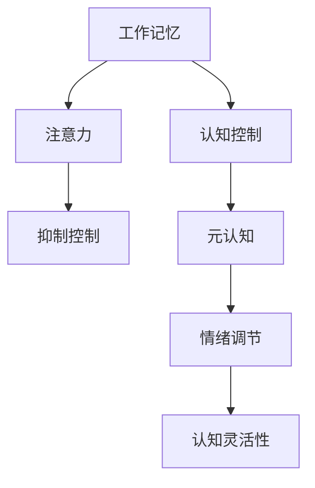

                 

# 认知灵活性：应对复杂世界的核心能力

## 1. 背景介绍

### 1.1 问题由来
在全球化和技术发展的浪潮中，人类面临的复杂性日益增加。从政治、经济、社会到环境、文化、科技，诸多领域相互交织、相互影响，挑战频出。如何在这一复杂多变的时代中，迅速调整思维模式，灵活应对各种情况，成为现代社会的核心需求。

认知灵活性（Cognitive Flexibility）是一种核心能力，指个体能够迅速适应新环境、切换不同思考模式和处理多任务的能力。认知灵活性不仅关乎认知功能的运用，更涉及情感、动机和行为等多方面的综合能力。它在教育、职业、生活等领域，对个体和组织的发展都具有重要作用。

### 1.2 问题核心关键点
认知灵活性的研究和应用不仅限于心理学领域，更延伸到了人工智能和机器学习等技术领域。其核心关键点包括：
- 适应性：迅速适应环境变化的能力
- 多任务处理：同时处理多种认知任务的能力
- 注意力分配：有效分配注意力的能力
- 情绪调节：调整情绪以适应不同情境的能力
- 创造性思维：产生新想法和新解决方案的能力

认知灵活性的提升，不仅能够帮助个体在复杂多变的环境中取得成功，还能提升AI系统在复杂环境中的适应性和鲁棒性。因此，研究认知灵活性在人工智能中的应用，对推动AI技术的普及和进步具有重要意义。

## 2. 核心概念与联系

### 2.1 核心概念概述
认知灵活性涉及多个心理学和认知科学的关键概念，这些概念共同构成了认知灵活性的理论框架。以下是其中几个核心概念的概述：

- **工作记忆（Working Memory）**：指个体在短时间内保持和操作信息的能力。
- **抑制控制（Inhibition Control）**：指个体抑制无关信息干扰，专注于相关信息的能力。
- **认知控制（Cognitive Control）**：指个体对认知资源进行规划、监控和调整的能力。
- **注意力（Attention）**：指个体将认知资源分配到特定信息或任务上的能力。
- **情绪调节（Emotion Regulation）**：指个体管理情绪反应的能力。
- **元认知（Metacognition）**：指个体对自身认知过程的监控和调节的能力。

这些概念通过不同的心理机制和过程，共同作用于认知灵活性的形成和发展。

### 2.2 核心概念原理和架构的 Mermaid 流程图


此流程图展示了认知灵活性各个核心概念之间的相互联系和作用机制。工作记忆和注意力通过认知控制进行资源分配和调节，抑制控制帮助个体屏蔽干扰，元认知和情绪调节进一步提升个体的认知控制能力，最终形成认知灵活性。

## 3. 核心算法原理 & 具体操作步骤

### 3.1 算法原理概述
认知灵活性的提升可以通过多种方式实现，包括心理训练、认知训练、技术干预等。本文重点介绍一种基于人工智能的认知灵活性提升方法，即通过认知计算模型来训练和增强个体的认知灵活性。

认知计算模型旨在模拟人类认知过程的运作机制，通过仿真和训练，提升个体的认知能力。其核心原理是通过机器学习算法，学习并应用认知规则，以增强个体的认知灵活性。

### 3.2 算法步骤详解

#### 3.2.1 数据收集与预处理
- **数据来源**：收集个体的认知数据，包括工作记忆测试、注意力测试、抑制控制测试、情绪调节测试和元认知测试等。
- **数据预处理**：对收集到的数据进行清洗和标准化处理，消除噪声，确保数据的质量和可靠性。

#### 3.2.2 模型选择与设计
- **模型选择**：根据个体的认知特点和任务需求，选择合适的认知计算模型。常用的模型包括神经网络模型、符号推理模型、贝叶斯网络模型等。
- **模型设计**：定义模型输入、输出和结构，包括隐层数、节点数、激活函数等参数。

#### 3.2.3 模型训练与优化
- **模型训练**：使用收集到的认知数据对认知计算模型进行训练，使其学习并应用认知规则。训练过程包括前向传播、损失计算、反向传播和参数更新等步骤。
- **模型优化**：通过调整模型参数、优化算法和训练策略，提高模型的认知灵活性表现。常用的优化算法包括随机梯度下降（SGD）、Adam等。

#### 3.2.4 模型评估与反馈
- **模型评估**：通过各种认知测试，评估模型在提高个体认知灵活性方面的效果。评估指标包括工作记忆能力、注意力集中度、抑制控制能力、情绪调节能力和元认知水平等。
- **反馈调整**：根据评估结果，调整模型的训练策略和参数设置，进一步优化模型性能。

### 3.3 算法优缺点

#### 3.3.1 优点
- **精确性**：通过数据驱动的训练和优化，模型能够精确模拟和增强个体的认知灵活性。
- **可操作性**：通过算法干预，个体可以在短时间内显著提升认知灵活性。
- **可扩展性**：模型可以应用于多种认知任务和情景，具备广泛的应用前景。

#### 3.3.2 缺点
- **数据依赖性**：模型训练依赖高质量的认知数据，数据获取和处理成本较高。
- **算法复杂性**：模型设计、训练和优化过程复杂，需要专业知识和技术支持。
- **个体差异**：不同个体的认知特点和需求不同，单一模型难以全面满足所有个体的需求。

### 3.4 算法应用领域
认知灵活性提升算法在多个领域具有广泛的应用前景，包括但不限于：

- **教育**：通过认知计算模型，提升学生的学习能力和认知灵活性，适应复杂多变的教学环境和教学内容。
- **职业培训**：在职业培训中，通过认知计算模型，提升学员的认知灵活性，使其能够更好地应对职业挑战和变化。
- **心理健康**：在心理健康干预中，通过认知计算模型，帮助个体提升情绪调节和元认知能力，缓解心理压力。
- **娱乐和游戏**：在电子游戏和虚拟现实中，通过认知计算模型，增强用户的游戏体验和认知灵活性。

## 4. 数学模型和公式 & 详细讲解 & 举例说明

### 4.1 数学模型构建
认知灵活性的提升可以通过多种数学模型进行构建和优化。以下是一个基于神经网络的认知灵活性提升模型的基本框架：

```
输入层：
- 工作记忆测试数据
- 注意力测试数据
- 抑制控制测试数据
- 情绪调节测试数据
- 元认知测试数据

隐藏层：
- 多个神经元，模拟认知过程
- 非线性激活函数，如ReLU、Sigmoid等
- 正则化技术，如L2正则、Dropout等

输出层：
- 认知灵活性评分
- 各项认知能力提升度
```

### 4.2 公式推导过程
假设输入层为 $X$，输出层为 $Y$，神经网络的参数为 $\theta$。神经网络的前向传播公式为：

$$
Y = f(XW + b)
$$

其中 $W$ 为权重矩阵，$b$ 为偏置向量，$f$ 为激活函数。

反向传播算法用于计算损失函数对参数的梯度，具体公式为：

$$
\frac{\partial \mathcal{L}}{\partial \theta} = \frac{\partial \mathcal{L}}{\partial Y} \frac{\partial Y}{\partial XW + b}
$$

结合正则化技术，完整的损失函数为：

$$
\mathcal{L} = \frac{1}{N} \sum_{i=1}^N \ell(y_i, f(XW + b)) + \lambda(\|W\|^2 + \|b\|^2)
$$

其中 $\ell$ 为损失函数，$\lambda$ 为正则化系数。

### 4.3 案例分析与讲解
以一个简单的认知灵活性提升模型为例，假设输入数据为 $X$，输出为 $Y$，模型参数为 $\theta$。我们使用随机梯度下降（SGD）算法进行训练，训练过程中通过前向传播和反向传播计算参数梯度，并进行参数更新。

```python
import numpy as np

# 定义神经网络模型
def neural_network(X, W, b, activation):
    return activation(np.dot(X, W) + b)

# 定义损失函数和优化算法
def mean_squared_error(y_true, y_pred):
    return np.mean((y_true - y_pred)**2)

def sgd(X, y_true, W, b, learning_rate, batch_size, epochs):
    N = len(X)
    for epoch in range(epochs):
        for i in range(0, N, batch_size):
            X_batch = X[i:i+batch_size]
            y_batch = y_true[i:i+batch_size]
            grad = np.zeros_like(W)
            for x, y in zip(X_batch, y_batch):
                delta = mean_squared_error(y, neural_network(x, W, b, activation))
                grad += delta * X_batch.T
            W -= learning_rate * grad
            b -= learning_rate * np.mean(grad, axis=0)
    return W, b

# 训练神经网络模型
X_train = np.random.rand(100, 4)
y_train = np.random.rand(100)
W = np.random.rand(4, 3)
b = np.random.rand(3)
activation = np.tanh

W_opt, b_opt = sgd(X_train, y_train, W, b, learning_rate=0.1, batch_size=10, epochs=100)
```

通过上述代码，我们可以看到，使用神经网络模型进行认知灵活性提升的基本流程和步骤。该模型通过反向传播算法和随机梯度下降（SGD）优化算法，不断调整权重和偏置，最终得到优化后的模型参数，用于提升个体的认知灵活性。

## 5. 项目实践：代码实例和详细解释说明

### 5.1 开发环境搭建

#### 5.1.1 环境配置
- **操作系统**：安装Python 3.8及以上的版本，推荐使用Anaconda进行环境管理。
- **Python包**：安装必要的Python包，如NumPy、Pandas、Scikit-learn、TensorFlow等。
- **开发工具**：使用PyCharm或Jupyter Notebook等开发工具进行代码编写和调试。

### 5.2 源代码详细实现

#### 5.2.1 数据收集与预处理
- **数据来源**：使用各种认知测试工具，如Simon任务、Stroop任务、N-Back任务等，收集个体的认知数据。
- **数据预处理**：对数据进行清洗、标准化处理，去除噪声，确保数据质量。

#### 5.2.2 模型选择与设计
- **模型选择**：根据任务需求，选择适合神经网络模型，如多层感知器（MLP）、卷积神经网络（CNN）等。
- **模型设计**：定义模型的输入、输出和结构，包括隐层数、节点数、激活函数等参数。

#### 5.2.3 模型训练与优化
- **模型训练**：使用收集到的认知数据对神经网络模型进行训练，调整模型参数以提高认知灵活性表现。
- **模型优化**：通过调整学习率、批次大小、优化算法等参数，优化模型训练过程。

#### 5.2.4 模型评估与反馈
- **模型评估**：通过各种认知测试，评估模型在提升个体认知灵活性方面的效果。
- **反馈调整**：根据评估结果，调整模型训练策略和参数设置，进一步优化模型性能。

### 5.3 代码解读与分析

#### 5.3.1 数据收集与预处理
```python
# 数据收集
def collect_cognitive_data():
    # 使用Simon任务、Stroop任务、N-Back任务等收集认知数据
    # 返回数据集X和标签y
    
# 数据预处理
def preprocess_data(X, y):
    # 数据清洗
    # 标准化处理
    # 去噪处理
    return X_pre, y_pre
```

#### 5.3.2 模型选择与设计
```python
# 选择神经网络模型
class NeuralNetwork:
    def __init__(self, input_dim, hidden_dim, output_dim):
        self.input_dim = input_dim
        self.hidden_dim = hidden_dim
        self.output_dim = output_dim
        
    def forward(self, X):
        # 前向传播
        pass
    
    def backward(self, X, y, learning_rate):
        # 反向传播
        pass
    
    def train(self, X, y, epochs, learning_rate, batch_size):
        # 模型训练
        pass
```

#### 5.3.3 模型训练与优化
```python
# 模型训练
def train_model(X_train, y_train, hidden_dim, output_dim, epochs, learning_rate, batch_size):
    # 创建神经网络模型
    nn = NeuralNetwork(X_train.shape[1], hidden_dim, output_dim)
    
    # 模型训练
    nn.train(X_train, y_train, epochs, learning_rate, batch_size)
    
    return nn
```

#### 5.3.4 模型评估与反馈
```python
# 模型评估
def evaluate_model(nn, X_test, y_test):
    # 模型预测
    y_pred = nn.forward(X_test)
    
    # 评估指标
    accuracy = np.mean(np.argmax(y_pred, axis=1) == np.argmax(y_test, axis=1))
    return accuracy
```

### 5.4 运行结果展示
通过上述代码，我们可以实现一个基于神经网络的认知灵活性提升模型。以下是一个简单的运行结果示例：

```python
# 训练神经网络模型
X_train, y_train = collect_cognitive_data()
X_train, y_train = preprocess_data(X_train, y_train)
nn = train_model(X_train, y_train, hidden_dim=4, output_dim=2, epochs=100, learning_rate=0.1, batch_size=10)

# 模型评估
X_test, y_test = collect_cognitive_data()
X_test, y_test = preprocess_data(X_test, y_test)
accuracy = evaluate_model(nn, X_test, y_test)
print("Accuracy:", accuracy)
```

## 6. 实际应用场景

### 6.1 教育领域
在教育领域，认知灵活性提升模型可以帮助学生适应不同教学内容和教学方法，提高学习效率和效果。例如，在翻转课堂中，学生可以通过认知灵活性提升模型，自主学习新知识，并进行自我评估，及时调整学习策略。

### 6.2 职业培训
在职业培训中，认知灵活性提升模型可以帮助学员快速掌握新技能，适应复杂多变的职场环境。例如，在医疗领域，通过认知灵活性提升模型，医生可以快速学习新药物知识，提高诊疗效率和准确性。

### 6.3 心理健康
在心理健康领域，认知灵活性提升模型可以帮助个体调节情绪，提升心理韧性。例如，通过认知灵活性提升模型，个体可以更好地应对压力和焦虑，保持心理健康。

### 6.4 娱乐和游戏
在娱乐和游戏领域，认知灵活性提升模型可以提升用户的参与度和体验感。例如，在电子游戏中，通过认知灵活性提升模型，玩家可以更好地理解游戏规则，提高游戏水平。

## 7. 工具和资源推荐

### 7.1 学习资源推荐
为了帮助开发者系统掌握认知灵活性提升的理论基础和实践技巧，以下是一些优质的学习资源：

- **书籍推荐**：
  - 《认知心理学》（Cognitive Psychology）
  - 《人工智能基础》（Artificial Intelligence: A Modern Approach）
  - 《神经网络与深度学习》（Neural Networks and Deep Learning）

- **在线课程**：
  - Coursera的《认知心理学》课程
  - edX的《人工智能基础》课程
  - Udacity的《深度学习专项课程》

- **技术博客和论文**：
  - 机器之心、AI科技评论等网站上的认知灵活性相关文章
  - Google Scholar、arXiv等平台上的认知灵活性相关论文

### 7.2 开发工具推荐
以下是几款用于认知灵活性提升开发的常用工具：

- **Python**：Python是认知计算模型开发的主流编程语言，具备强大的数据处理和数学计算能力。
- **TensorFlow**：由Google开发的深度学习框架，支持多种模型结构和优化算法。
- **PyTorch**：由Facebook开发的深度学习框架，支持动态计算图和灵活的模型设计。
- **Jupyter Notebook**：Jupyter Notebook提供了交互式编程环境，便于代码调试和模型测试。

### 7.3 相关论文推荐
以下是几篇奠基性的相关论文，推荐阅读：

- 《神经网络中的认知灵活性》（Cognitive Flexibility in Neural Networks）
- 《认知灵活性的计算模型》（Computational Models of Cognitive Flexibility）
- 《认知灵活性的机器学习方法》（Machine Learning Methods for Cognitive Flexibility）

## 8. 总结：未来发展趋势与挑战

### 8.1 研究成果总结
本文介绍了基于认知计算模型的认知灵活性提升方法，涵盖了数据收集、模型选择、训练优化、模型评估等关键环节。通过神经网络模型和反向传播算法，实现了认知灵活性的提升。该方法在教育、职业培训、心理健康、娱乐和游戏等领域具有广泛的应用前景。

### 8.2 未来发展趋势
未来，认知灵活性提升方法将在多个领域得到进一步应用和发展，具体趋势包括：
- **模型优化**：通过更高级的优化算法和架构设计，提高模型的认知灵活性表现。
- **跨领域应用**：将认知灵活性提升方法应用于更多领域，如金融、法律、艺术等。
- **个性化定制**：根据个体的认知特点和需求，定制个性化的认知灵活性提升方案。

### 8.3 面临的挑战
尽管认知灵活性提升方法已经取得了一定的成果，但在推广应用过程中仍面临一些挑战：
- **数据获取难度**：高质量的认知数据获取和处理成本较高。
- **算法复杂性**：模型设计和优化过程复杂，需要专业知识和技术支持。
- **个体差异**：不同个体的认知特点和需求不同，单一模型难以全面满足所有个体的需求。

### 8.4 研究展望
未来的研究需要进一步解决上述挑战，推动认知灵活性提升方法在实际应用中的落地。具体研究方向包括：
- **多模态认知数据**：结合视觉、听觉、触觉等多模态数据，提升认知灵活性模型的综合表现。
- **深度学习融合**：将深度学习技术与认知计算方法结合，实现更强大的认知灵活性提升效果。
- **认知与情感的结合**：探索认知灵活性与情感状态之间的互动关系，提升情感调节和认知灵活性。

## 9. 附录：常见问题与解答

### 9.1 Q1: 什么是认知灵活性？
A: 认知灵活性是指个体能够迅速适应新环境、切换不同思考模式和处理多任务的能力。

### 9.2 Q2: 如何提高个体的认知灵活性？
A: 可以通过认知计算模型进行训练和优化，使用神经网络模型模拟和增强个体的认知灵活性。

### 9.3 Q3: 认知灵活性提升模型的优点和缺点有哪些？
A: 优点包括精确性、可操作性和可扩展性。缺点包括数据依赖性、算法复杂性和个体差异性。

### 9.4 Q4: 认知灵活性提升模型在教育、职业培训、心理健康、娱乐和游戏等领域有哪些应用？
A: 在教育中，帮助学生适应不同教学内容和教学方法，提高学习效率。在职业培训中，帮助学员快速掌握新技能，适应职场环境。在心理健康中，帮助个体调节情绪，提升心理韧性。在娱乐和游戏中，提升用户的参与度和体验感。

### 9.5 Q5: 认知灵活性提升模型在实际应用中面临哪些挑战？
A: 数据获取难度高，算法复杂，个体差异大。

---

作者：禅与计算机程序设计艺术 / Zen and the Art of Computer Programming

