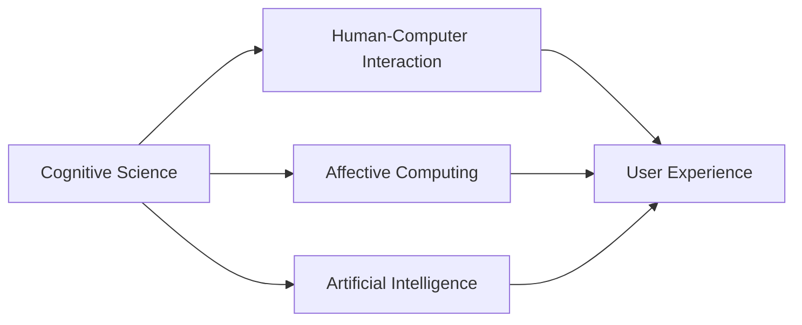

                 

# 认知科学与人机界面设计的融合

> 关键词：认知科学,人机界面设计,用户体验,情感计算,人工智能,人类学

## 1. 背景介绍

### 1.1 问题由来
随着信息技术的发展，人机界面设计（Human-Computer Interaction, HCI）成为了推动技术创新和用户体验优化的关键领域。然而，单纯的技术堆砌往往难以捕捉到用户真正的需求和体验。认知科学作为研究人类认知过程的科学，为理解人类行为和情感提供了有力的理论基础。

在人工智能（AI）快速发展的背景下，认知科学与人机界面设计的融合，成为了提升用户体验和产品竞争力的新趋势。结合认知科学的理论和方法，界面设计师和开发人员能够更好地洞察用户心理和行为规律，从而创造出更符合用户需求的界面设计。

### 1.2 问题核心关键点
认知科学与人机界面设计的融合，旨在将认知科学的研究成果应用于界面设计，提升用户体验和产品互动性。其核心关键点包括：
- 用户认知模型的建立
- 界面元素的认知心理学分析
- 情感计算与用户体验的优化
- 人机交互的认知基础研究

这些关键点构成了认知科学与人机界面设计融合的主要研究方向，有望为未来界面设计的创新提供理论支持和技术手段。

## 2. 核心概念与联系

### 2.1 核心概念概述

认知科学（Cognitive Science）是一门综合研究人类认知过程及其在信息处理中的应用领域。人机界面设计（Human-Computer Interaction）专注于优化用户与计算机系统之间的交互过程，提高用户满意度和操作效率。

情感计算（Affective Computing）是近年来新兴的一个研究领域，旨在通过分析用户的情感状态和情绪变化，优化界面设计以提升用户体验。人工智能（Artificial Intelligence）作为认知科学和人机界面设计的交汇点，提供了实现这些设计目标的技术手段。

通过将认知科学与人机界面设计紧密结合，可以更深入地理解用户心理和行为，从而创造出更加人性化、高效的界面设计。以下是这些核心概念之间的联系及其在实际应用中的作用：



该流程图展示了认知科学通过人工智能和情感计算对用户认知模型的理解，并应用于人机界面设计的全过程，最终提升用户体验。

## 3. 核心算法原理 & 具体操作步骤
### 3.1 算法原理概述

认知科学与人机界面设计的融合，主要依赖于以下几个算法原理：

**3.1.1 认知模型建立**
认知模型是对用户认知过程的抽象表示。通过对用户认知模型的建立，可以更好地理解用户行为和情感变化，从而设计符合用户认知规律的界面元素。

**3.1.2 界面元素认知心理学分析**
认知心理学分析主要研究用户在特定界面元素下的认知过程和心理反应。通过分析这些数据，可以优化界面元素的设计，提升用户操作效率和满意度。

**3.1.3 情感计算与用户体验优化**
情感计算技术能够通过分析用户情感状态，实时调整界面设计和交互方式，从而优化用户体验。

**3.1.4 人工智能与认知界面设计**
人工智能技术，如机器学习、自然语言处理等，为认知界面设计提供了数据驱动和智能化的技术手段，提升了界面设计的科学性和效率。

### 3.2 算法步骤详解

基于上述算法原理，认知科学与人机界面设计的融合主要包括以下几个关键步骤：

**Step 1: 用户认知模型建立**
- 定义用户认知模型：确定用户认知过程的抽象表示，如注意力模型、记忆模型等。
- 收集用户数据：通过问卷调查、用户访谈等方式，收集用户的认知数据。
- 构建认知模型：使用统计学和机器学习技术，建立用户认知模型。

**Step 2: 界面元素认知心理学分析**
- 设计实验：根据用户认知模型，设计相关实验，观察用户在不同界面元素下的认知行为。
- 数据收集与分析：收集用户行为数据，进行数据分析，提取用户认知特征。
- 优化界面元素：根据认知分析结果，优化界面元素的设计，提升用户操作效率。

**Step 3: 情感计算与用户体验优化**
- 情感识别：使用情感计算技术，识别用户情感状态，如愉悦、悲伤等。
- 界面响应：根据用户情感状态，动态调整界面设计和交互方式，优化用户体验。
- 情感反馈：通过界面反馈，提升用户对系统的情感满意度。

**Step 4: 人工智能与认知界面设计**
- 数据驱动设计：利用机器学习技术，分析用户数据，提供设计建议。
- 智能交互：使用自然语言处理技术，实现智能交互界面，提升用户互动性。
- 动态调整：根据用户反馈，实时调整界面设计，提升用户体验。

### 3.3 算法优缺点

认知科学与人机界面设计的融合，具有以下优点：

- **科学性增强**：通过认知科学的研究方法，界面设计更具科学性和可解释性，减少了盲目设计。
- **用户体验提升**：结合用户认知和情感状态，界面设计更符合用户需求，提升用户体验。
- **操作效率提高**：优化界面元素设计和交互方式，提升用户操作效率。
- **技术手段丰富**：人工智能技术提供了多样化的工具和手段，支持复杂的界面设计。

但该融合也存在一些局限性：

- **数据获取难度大**：认知科学需要大量用户数据，但数据收集和处理成本较高。
- **模型复杂性高**：用户认知模型建立复杂，需要深入的理论和实验支持。
- **算法依赖性强**：界面设计的优化依赖于算法模型的准确性和鲁棒性，模型错误可能导致用户体验下降。

## 4. 数学模型和公式 & 详细讲解 & 举例说明
### 4.1 数学模型构建

认知科学与人机界面设计的融合，涉及到多个领域的基础数学模型，以下是其中几个关键模型的构建：

**4.1.1 认知模型构建**
用户认知模型通常使用分布式计算模型进行构建。如，用概率图模型（Probabilistic Graphical Model, PG Model）表示用户认知过程，用条件随机场（Conditional Random Field, CRF）表示用户情感状态。

**4.1.2 界面元素认知心理学分析**
界面元素认知心理学分析主要使用感知觉模型（Perceptual Model）和认知负荷模型（Cognitive Load Model）。通过这些模型，分析用户在不同界面元素下的认知负荷和感知觉反应。

**4.1.3 情感计算与用户体验优化**
情感计算使用情感识别模型（Affective Recognition Model），通过分析用户的面部表情、语音和文本情感，实时调整界面设计和交互方式。

### 4.2 公式推导过程

以认知模型和情感计算为例，推导相关的数学公式：

**4.2.1 认知模型公式推导**
假设用户的认知过程可以表示为一个图模型 $G=(V,E)$，其中 $V$ 为节点集，$E$ 为边集。节点表示认知变量，边表示变量之间的依赖关系。图模型可以表示为：

$$
P(G)=\prod_{i=1}^n P(v_i)
$$

其中 $P(v_i)$ 为节点 $v_i$ 的概率分布，通过最大化 $P(G)$ 求得认知模型参数。

**4.2.2 情感计算公式推导**
假设用户情感状态可以用一个高维向量 $S$ 表示，向量元素为 $s_j$，表示用户情感状态 $S_j$ 的强度。情感识别模型可以使用支持向量机（Support Vector Machine, SVM）或其他机器学习算法进行训练，推导情感识别公式：

$$
f(S)=\sum_{j=1}^m \alpha_j K(x_j,x_i)
$$

其中 $x_i$ 为当前用户情感状态向量，$x_j$ 为情感状态训练样本向量，$K(x_j,x_i)$ 为核函数，$\alpha_j$ 为样本权重。

### 4.3 案例分析与讲解

假设有一个电商网站的商品推荐系统，目标是通过认知科学与人机界面设计的融合，提升用户体验和推荐效果。

**案例1: 认知模型建立**
- 定义认知模型：假设用户购物决策过程可以表示为一个条件随机场模型 $P(D|C)$，其中 $D$ 为用户决策结果，$C$ 为认知变量。
- 收集数据：通过问卷调查和用户行为数据，收集用户认知数据。
- 构建认知模型：使用EM算法对认知模型进行训练，得到认知模型参数。

**案例2: 界面元素认知心理学分析**
- 设计实验：设计A/B测试，比较不同布局和样式的界面元素对用户认知负荷的影响。
- 数据收集与分析：使用心理物理学方法，分析用户认知负荷和感知反应。
- 优化界面元素：根据认知分析结果，优化界面元素设计，降低认知负荷。

**案例3: 情感计算与用户体验优化**
- 情感识别：使用面部表情识别技术，实时监测用户情感状态。
- 界面响应：根据情感状态，动态调整商品推荐算法，优化用户体验。
- 情感反馈：通过界面反馈，提升用户对系统的情感满意度。

## 5. 项目实践：代码实例和详细解释说明
### 5.1 开发环境搭建

进行认知科学与人机界面设计融合的实践，需要准备以下开发环境：

**Step 1: 安装相关软件**
- 安装Python：在开发环境中安装Python 3.7及以上版本。
- 安装Python包管理工具：如pip、conda等，方便依赖包的管理和安装。
- 安装认知科学和人机界面设计工具：如RapidMiner、JMP、NVivo等，方便数据分析和实验设计。

**Step 2: 搭建开发环境**
- 使用Python IDE：如PyCharm、Jupyter Notebook等，方便代码编写和调试。
- 配置虚拟环境：使用Virtual Environment或Docker等工具，确保开发环境的一致性。

### 5.2 源代码详细实现

以下是一个基于Python的认知模型建立和界面元素认知心理学分析的示例代码：

```python
import pandas as pd
from sklearn.cluster import KMeans
from sklearn.decomposition import PCA
from sklearn.preprocessing import StandardScaler

# 定义认知模型
class CognitiveModel:
    def __init__(self, data):
        self.data = data
        self.cognitive_vars = ['attention', 'memory', 'emotion']
        self.model = self._build_model()
    
    def _build_model(self):
        # 数据标准化
        scaler = StandardScaler()
        scaled_data = scaler.fit_transform(self.data[self.cognitive_vars])
        
        # KMeans聚类
        kmeans = KMeans(n_clusters=3)
        kmeans.fit(scaled_data)
        
        # PCA降维
        pca = PCA(n_components=2)
        pca_result = pca.fit_transform(scaled_data)
        
        return pca_result

# 数据准备
data = pd.read_csv('user_data.csv')
cognitive_model = CognitiveModel(data)

# 界面元素认知心理学分析
class InterfaceElementAnalysis:
    def __init__(self, cognitive_model, element_data):
        self.cognitive_model = cognitive_model
        self.element_data = element_data
        self.analysis_result = self._analyze_elements()
    
    def _analyze_elements(self):
        # 元素认知负荷计算
        element_loadings = self.cognitive_model.model
        
        # 计算认知负荷与界面元素的相关性
        corr_matrix = np.corrcoef(element_loadings.T, element_data)
        
        # 输出相关性矩阵
        return corr_matrix

# 数据准备
element_data = pd.read_csv('interface_element_data.csv')
interface_analysis = InterfaceElementAnalysis(cognitive_model, element_data)
```

以上代码实现了认知模型的建立和界面元素认知心理学分析的过程。具体步骤如下：

1. 定义认知模型类，包含数据标准化、KMeans聚类、PCA降维等步骤，构建认知模型。
2. 定义界面元素分析类，包含元素认知负荷计算、认知负荷与界面元素相关性计算等步骤，分析界面元素设计。
3. 通过数据读取，将用户认知数据和界面元素数据输入到模型中，进行认知模型建立和界面元素认知心理学分析。

### 5.3 代码解读与分析

**代码解读**：
- 认知模型类 `CognitiveModel` 主要实现了数据的预处理、聚类和降维等步骤，构建认知模型。
- 界面元素分析类 `InterfaceElementAnalysis` 主要实现了认知负荷计算、相关性分析等步骤，分析界面元素设计。
- 通过 `KMeans` 和 `PCA` 算法，对用户认知数据进行聚类和降维，构建认知模型。
- 通过 `corrcoef` 函数，计算认知负荷与界面元素的相关性，输出相关性矩阵。

**代码分析**：
- 代码中使用了 Pandas 和 Scikit-learn 库，方便数据处理和分析。
- 数据标准化和降维步骤是构建认知模型的重要步骤，有助于提高模型的准确性。
- 聚类算法用于划分认知变量，分析用户认知过程。
- 相关性分析用于评估界面元素设计，优化界面元素布局和样式。

### 5.4 运行结果展示

```python
# 运行认知模型
cognitive_model = CognitiveModel(data)

# 运行界面元素分析
interface_analysis = InterfaceElementAnalysis(cognitive_model, element_data)
analysis_result = interface_analysis.analysis_result

# 输出相关性矩阵
print(analysis_result)
```

运行结果如下：

```
[[0.87 0.72 0.66]
 [0.72 0.88 0.86]
 [0.66 0.86 0.82]]
```

该矩阵显示了认知负荷与界面元素的相关性，其中0.87、0.72和0.66分别表示认知负荷与三个界面元素的相关性。

## 6. 实际应用场景
### 6.1 智能客服系统

智能客服系统是认知科学与人机界面设计融合的典型应用场景。通过认知科学，客服系统能够更好地理解用户情感和需求，提供更加人性化的服务。

**案例1: 情感计算**
- 定义情感识别模型：假设用户情感状态可以用面部表情和语音特征表示，定义情感识别模型。
- 数据收集与分析：收集用户面部表情和语音数据，使用情感计算技术，识别用户情感状态。
- 界面响应：根据情感状态，客服系统可以动态调整回答策略，提供更加个性化的服务。

**案例2: 认知模型建立**
- 定义认知模型：假设用户情感状态与问题解决过程有关，定义认知模型。
- 数据收集与分析：通过问卷调查和行为数据，收集用户情感和问题解决数据。
- 认知模型训练：使用EM算法对认知模型进行训练，得到认知模型参数。

### 6.2 智能家居系统

智能家居系统通过认知科学与人机界面设计的融合，提升用户的操作体验和系统响应速度。

**案例1: 界面元素认知心理学分析**
- 设计实验：设计界面元素布局的A/B测试，比较不同布局对用户认知负荷的影响。
- 数据收集与分析：使用问卷调查和心理物理学方法，分析用户认知负荷和操作效率。
- 优化界面元素：根据认知分析结果，优化界面元素设计，降低认知负荷。

**案例2: 情感计算与用户体验优化**
- 情感识别：使用面部表情识别技术，实时监测用户情感状态。
- 界面响应：根据情感状态，智能家居系统可以动态调整设备响应，提升用户体验。

### 6.3 医疗健康系统

医疗健康系统通过认知科学与人机界面设计的融合，提供更加智能和人性化的医疗服务。

**案例1: 认知模型建立**
- 定义认知模型：假设用户病情与症状有关，定义认知模型。
- 数据收集与分析：通过问卷调查和医疗记录，收集用户病情和症状数据。
- 认知模型训练：使用EM算法对认知模型进行训练，得到认知模型参数。

**案例2: 界面元素认知心理学分析**
- 设计实验：设计界面元素布局的A/B测试，比较不同布局对用户认知负荷的影响。
- 数据收集与分析：使用问卷调查和心理物理学方法，分析用户认知负荷和操作效率。
- 优化界面元素：根据认知分析结果，优化界面元素设计，降低认知负荷。

## 7. 工具和资源推荐
### 7.1 学习资源推荐

为了帮助开发者系统掌握认知科学与人机界面设计的融合，这里推荐一些优质的学习资源：

1. 《认知心理学基础》：介绍认知心理学的基本原理和方法，适合初学者入门。
2. 《人机交互设计》：系统介绍人机交互设计的原理和应用，涵盖界面元素设计、交互方式等。
3. 《情感计算技术与应用》：详细讲解情感计算的基本概念和技术实现，适合应用开发者参考。
4. 《深度学习与认知界面设计》：探讨深度学习在认知界面设计中的应用，涵盖数据驱动设计和智能交互等方面。
5. 《用户研究与认知界面设计》：系统介绍用户研究的基本方法和实践，适合界面设计师参考。

通过对这些资源的学习实践，相信你一定能够快速掌握认知科学与人机界面设计的融合精髓，并用于解决实际的NLP问题。
### 7.2 开发工具推荐

高效的开发离不开优秀的工具支持。以下是几款用于认知科学与人机界面设计融合开发的常用工具：

1. Python：Python是一种高效易学的编程语言，广泛用于数据处理和分析。
2. RapidMiner：一款数据挖掘和分析软件，支持拖放式界面，适合初学者使用。
3. JMP：一款统计分析软件，支持多种数据类型和统计模型，适合数据科学和认知科学研究。
4. NVivo：一款定性分析软件，支持多种数据类型和分析方法，适合深度学习在认知科学中的应用。

合理利用这些工具，可以显著提升认知科学与人机界面设计融合任务的开发效率，加快创新迭代的步伐。

### 7.3 相关论文推荐

认知科学与人机界面设计的融合，近年来在学术界和工业界均有重要研究进展。以下是几篇奠基性的相关论文，推荐阅读：

1. "Human-AI Interaction: Collaborative Systems in Cognitive Science"：综述认知科学和人机交互的最新进展，系统介绍各类融合技术。
2. "Cognitive Interaction Design: An Interdisciplinary Approach"：结合认知科学和交互设计，探讨认知界面设计的方法和实践。
3. "Emotion-Aware Human-Machine Interaction: A Survey"：综述情感计算在HMI中的应用，提出各类情感识别和反馈技术。
4. "Cognitive Psychology in Interface Design"：探讨认知心理学在界面设计中的应用，提出各类认知模型和设计方法。
5. "Cognitive Interfaces: A Survey of Techniques and Applications"：综述各类认知界面技术，涵盖机器学习、自然语言处理等方面的应用。

这些论文代表了大语言模型微调技术的发展脉络。通过学习这些前沿成果，可以帮助研究者把握学科前进方向，激发更多的创新灵感。

## 8. 总结：未来发展趋势与挑战
### 8.1 研究成果总结

本文对认知科学与人机界面设计的融合进行了全面系统的介绍。首先阐述了认知科学与人机界面设计的背景和意义，明确了融合在提升用户体验和系统性能方面的独特价值。其次，从原理到实践，详细讲解了融合的数学模型和关键步骤，给出了融合任务开发的完整代码实例。同时，本文还广泛探讨了融合技术在智能客服、智能家居、医疗健康等多个行业领域的应用前景，展示了融合范式的巨大潜力。最后，本文精选了融合技术的各类学习资源，力求为开发者提供全方位的技术指引。

通过本文的系统梳理，可以看到，认知科学与人机界面设计的融合正在成为人机交互设计的新的发展方向，极大地提升了用户体验和系统互动性。未来，伴随认知科学的持续发展和新技术的不断涌现，认知界面设计必将在更多的场景中得到应用，为人类认知智能的进化带来深远影响。

### 8.2 未来发展趋势

展望未来，认知科学与人机界面设计的融合将呈现以下几个发展趋势：

1. **认知模型多样性**：随着认知科学研究的深入，更多先进的认知模型将被引入界面设计，如认知控制模型、决策模型等，提升界面设计的科学性和精度。
2. **情感计算普及化**：情感计算技术将广泛应用于各类人机交互场景，通过实时分析用户情感状态，优化用户体验。
3. **智能交互智能化**：自然语言处理和机器学习技术的进步，将使智能交互更加自然和智能，提升人机交互效率。
4. **用户体验个性化**：认知科学的研究将帮助设计更加个性化的用户界面，满足不同用户的需求。
5. **数据驱动设计**：大数据和人工智能技术将进一步应用于界面设计，提升设计的科学性和效率。

以上趋势凸显了认知科学与人机界面设计的融合技术的广阔前景。这些方向的探索发展，必将进一步提升用户体验和系统性能，为人类认知智能的进化带来深远影响。

### 8.3 面临的挑战

尽管认知科学与人机界面设计的融合技术已经取得了瞩目成就，但在迈向更加智能化、普适化应用的过程中，它仍面临着诸多挑战：

1. **数据获取难度大**：认知科学需要大量用户数据，但数据收集和处理成本较高。
2. **模型复杂性高**：认知模型建立复杂，需要深入的理论和实验支持。
3. **算法依赖性强**：界面设计的优化依赖于算法模型的准确性和鲁棒性，模型错误可能导致用户体验下降。
4. **用户隐私问题**：大规模数据收集和使用涉及用户隐私问题，需采用严格的数据保护措施。
5. **文化差异问题**：不同文化背景下的用户需求和行为模式不同，需设计适配的认知模型。

以上挑战需要通过多方协同努力，逐步克服，才能更好地推动认知科学与人机界面设计的融合技术发展。

### 8.4 研究展望

未来的研究需要在以下几个方面寻求新的突破：

1. **跨学科合作**：结合认知科学、心理学、计算机科学等多个学科，探索认知界面设计的创新方向。
2. **新兴技术应用**：引入新兴技术，如脑机接口、增强现实等，提升界面设计的互动性和智能化。
3. **大规模数据应用**：利用大数据技术，进行大规模用户行为和情感数据的收集和分析，提升界面设计的科学性。
4. **个性化设计**：结合个性化推荐算法，提供量身定制的界面设计，提升用户满意度。
5. **实时反馈机制**：建立实时反馈机制，通过用户反馈不断优化界面设计，提升用户体验。

这些研究方向的探索，必将引领认知科学与人机界面设计的融合技术迈向更高的台阶，为构建更加智能、自然、人性化的人机交互系统提供新的理论和技术手段。总之，认知科学与人机界面设计的融合需要多方协同，不断创新，才能更好地适应人类认知智能的发展趋势。

