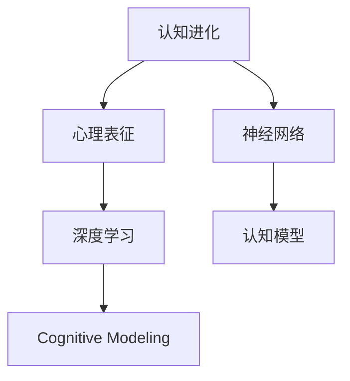

                 

# 认知革命：人类思维的进化历程

> 关键词：认知进化, 心理表征, 神经网络, 深度学习, 人类思维, 算法模型

## 1. 背景介绍

### 1.1 问题由来

在人工智能(AI)领域，"认知革命"一词常被用来描述人类智慧的起源和演进，以及机器智能与人类智慧之间的联系。这种演进不仅仅体现在技术层面的突破，更关乎对智能本质的深刻理解。本文将从认知演化的角度，探讨人类思维如何从原始的感知能力，逐步进化为复杂认知能力，最终激发出智能革命。

### 1.2 问题核心关键点

- **认知进化**：人类思维能力的演化，包括感知、记忆、推理等智能过程的发展。
- **心理表征**：人类如何通过大脑中的表征系统来处理信息，以及这些表征如何通过学习和训练进化。
- **神经网络**：类比于人类大脑的神经元网络，研究如何通过连接和调节神经元来实现高级认知功能。
- **深度学习**：基于神经网络的模型，模仿人类大脑的认知过程，通过多层抽象提取特征和模式。
- **认知模型**：构建能够模拟人类认知过程的算法模型，研究如何应用这些模型解决实际问题。

这些核心概念之间存在密切联系，通过理解它们之间的相互作用，可以帮助我们更好地理解认知革命的历程，并从中获得启发，应用于人工智能系统的设计和优化。

## 2. 核心概念与联系

### 2.1 核心概念概述

为了更好地理解认知革命的概念，本节将介绍几个关键概念，并展示它们之间的联系：

- **认知进化**：指人类思维能力从简单到复杂的演化过程，包括感觉输入、信息处理、决策输出等。
- **心理表征**：指信息在大脑中被编码和存储的方式，包括感知、记忆、推理等高级认知过程。
- **神经网络**：模拟大脑神经元网络的计算模型，通过连接和调节实现信息的传递和处理。
- **深度学习**：通过多层神经网络，逐步提取特征，实现复杂模式识别和推理的任务。
- **认知模型**：基于神经网络的算法模型，设计来模拟人类的认知过程，用于解决实际问题。

### 2.2 核心概念联系

人类思维的进化历程，可以用如下Mermaid流程图来展示：



该流程图表明了人类思维能力从认知进化开始，逐步通过心理表征、神经网络、深度学习和认知模型，最终形成复杂的智能系统。这些概念之间是相互依存、相互促进的关系。

## 3. 核心算法原理 & 具体操作步骤

### 3.1 算法原理概述

基于神经网络的深度学习模型，是模仿人类大脑认知过程的重要手段。深度学习通过多层神经网络的结构，逐步抽象出输入数据的高级特征，实现复杂模式识别和推理任务。其核心原理可以概括为以下几点：

1. **特征提取**：通过多层非线性变换，逐步提取输入数据的高级特征，这些特征能够捕获输入数据的复杂结构。
2. **多层抽象**：每个神经元对输入特征进行非线性映射，多层结构能够逐步抽象出更高级的特征表示。
3. **反向传播**：通过误差反向传播，调整网络参数，使得网络输出与真实标签尽可能接近。
4. **参数更新**：通过梯度下降等优化算法，更新网络参数，使得网络逐渐逼近最优解。

### 3.2 算法步骤详解

深度学习的训练过程可以大致分为以下几个步骤：

**Step 1: 准备数据集**
- 收集并预处理数据集，将其分为训练集、验证集和测试集。
- 对数据进行归一化、标准化等预处理操作，以便于神经网络处理。

**Step 2: 设计网络结构**
- 选择合适的神经网络结构，包括卷积神经网络(CNN)、递归神经网络(RNN)、循环神经网络(LSTM)等。
- 确定网络的输入输出层大小、隐藏层数量和激活函数等超参数。

**Step 3: 设置优化器**
- 选择合适的优化器，如Adam、SGD等，并设置学习率、批大小等超参数。
- 设置正则化技术，如L2正则、Dropout等，防止过拟合。

**Step 4: 执行梯度训练**
- 将训练集数据分批次输入模型，前向传播计算损失函数。
- 反向传播计算参数梯度，根据设定的优化算法和学习率更新模型参数。
- 周期性在验证集上评估模型性能，根据性能指标决定是否触发Early Stopping。
- 重复上述步骤直至满足预设的迭代轮数或Early Stopping条件。

**Step 5: 测试和部署**
- 在测试集上评估微调后模型 $M_{\hat{\theta}}$ 的性能，对比微调前后的精度提升。
- 使用微调后的模型对新样本进行推理预测，集成到实际的应用系统中。
- 持续收集新的数据，定期重新微调模型，以适应数据分布的变化。

### 3.3 算法优缺点

基于神经网络的深度学习模型具有以下优点：
1. **特征提取能力强**：多层结构能够自动学习输入数据的高级特征，减少手工特征工程的工作量。
2. **模型泛化能力强**：能够处理复杂的非线性模式，适用于各种NLP、CV等任务。
3. **应用广泛**：在图像识别、自然语言处理、语音识别、推荐系统等领域都有广泛应用。
4. **可解释性提升**：通过引入可解释性技术，如Attention机制、LIME等，能够提升模型的可解释性。

同时，深度学习模型也存在一些局限性：
1. **数据需求大**：深度学习模型通常需要大量的标注数据进行训练，获取高质量标注数据的成本较高。
2. **计算资源消耗高**：神经网络通常参数量巨大，对硬件资源的要求较高。
3. **模型复杂**：深度学习模型的结构复杂，训练和推理过程较为复杂。
4. **过拟合风险高**：在数据量较小的情况下，深度学习模型容易出现过拟合。
5. **黑箱问题**：深度学习模型通常被视为"黑箱"，难以解释其内部工作机制。

尽管存在这些局限性，但深度学习模型依然是当前人工智能研究的重要工具，通过不断改进优化，能够有效提升模型的性能和可解释性。

### 3.4 算法应用领域

基于神经网络的深度学习模型，已经在NLP、CV、语音识别、推荐系统等多个领域取得了广泛的应用，具体如下：

- **NLP任务**：如机器翻译、文本分类、命名实体识别、情感分析等。
- **图像识别**：如图像分类、目标检测、图像分割等。
- **语音识别**：如语音转文本、语音情感识别、语音指令识别等。
- **推荐系统**：如个性化推荐、协同过滤、用户行为分析等。

## 4. 数学模型和公式 & 详细讲解 & 举例说明

### 4.1 数学模型构建

深度学习模型的数学模型可以概括为以下形式：

$$
\begin{aligned}
L(\theta) &= \frac{1}{N} \sum_{i=1}^N \ell(\theta; x_i, y_i) \\
\frac{\partial L(\theta)}{\partial \theta_j} &= \frac{1}{N} \sum_{i=1}^N \frac{\partial \ell(\theta; x_i, y_i)}{\partial \theta_j} \\
\theta_{t+1} &= \theta_t - \eta \nabla_{\theta} L(\theta)
\end{aligned}
$$

其中，$L(\theta)$ 为损失函数，$\ell(\theta; x_i, y_i)$ 为单个样本的损失函数，$\eta$ 为学习率，$\nabla_{\theta} L(\theta)$ 为损失函数对参数的梯度。

### 4.2 公式推导过程

以单层神经网络为例，推导其前向传播和反向传播公式。

前向传播公式为：

$$
a = \sigma(z) = \sigma(w \cdot x + b)
$$

其中，$a$ 为激活输出，$z$ 为线性变换结果，$w$ 为权重矩阵，$b$ 为偏置向量，$\sigma$ 为激活函数。

反向传播公式为：

$$
\frac{\partial L}{\partial w} = \frac{\partial \ell}{\partial z} \cdot \frac{\partial z}{\partial w}
$$

其中，$\frac{\partial L}{\partial w}$ 为损失函数对权重的梯度，$\frac{\partial \ell}{\partial z}$ 为单个样本的梯度，$\frac{\partial z}{\partial w}$ 为链式法则展开得到的梯度。

### 4.3 案例分析与讲解

以图像分类为例，展示深度学习模型的训练过程。

首先，收集并预处理图像数据集，将其分为训练集、验证集和测试集。然后，设计卷积神经网络(CNN)模型，确定其结构、超参数等。接着，设置优化器、正则化等，开始训练过程。训练过程中，前向传播计算预测结果，反向传播计算梯度，更新模型参数。周期性在验证集上评估模型性能，并根据性能指标调整学习率、正则化等超参数。最终，在测试集上评估模型性能，对比微调前后的精度提升。

## 5. 项目实践：代码实例和详细解释说明

### 5.1 开发环境搭建

在进行深度学习实践前，我们需要准备好开发环境。以下是使用Python进行TensorFlow开发的环境配置流程：

1. 安装Anaconda：从官网下载并安装Anaconda，用于创建独立的Python环境。

2. 创建并激活虚拟环境：
```bash
conda create -n tf-env python=3.8 
conda activate tf-env
```

3. 安装TensorFlow：根据CUDA版本，从官网获取对应的安装命令。例如：
```bash
conda install tensorflow
```

4. 安装各类工具包：
```bash
pip install numpy pandas scikit-learn matplotlib tqdm jupyter notebook ipython
```

完成上述步骤后，即可在`tf-env`环境中开始深度学习实践。

### 5.2 源代码详细实现

下面我们以图像分类任务为例，给出使用TensorFlow进行深度学习模型训练的Python代码实现。

首先，定义图像分类任务的数据处理函数：

```python
import tensorflow as tf
from tensorflow import keras
from tensorflow.keras import layers

def load_and_preprocess_data(data_path):
    images = tf.keras.preprocessing.image.load_img(data_path, target_size=(224, 224))
    images = tf.keras.preprocessing.image.img_to_array(images)
    images = tf.expand_dims(images, axis=0)
    images = images / 255.0
    return images

# 加载并预处理训练集
train_images = load_and_preprocess_data('train.jpg')
# 加载并预处理验证集
val_images = load_and_preprocess_data('val.jpg')
# 加载并预处理测试集
test_images = load_and_preprocess_data('test.jpg')
```

然后，定义深度学习模型：

```python
def create_model(input_shape, num_classes):
    model = keras.Sequential([
        keras.layers.Conv2D(32, (3, 3), activation='relu', input_shape=input_shape),
        keras.layers.MaxPooling2D((2, 2)),
        keras.layers.Conv2D(64, (3, 3), activation='relu'),
        keras.layers.MaxPooling2D((2, 2)),
        keras.layers.Conv2D(64, (3, 3), activation='relu'),
        keras.layers.Flatten(),
        keras.layers.Dense(64, activation='relu'),
        keras.layers.Dense(num_classes, activation='softmax')
    ])
    return model

model = create_model((224, 224, 3), num_classes)
```

接着，定义训练和评估函数：

```python
def train_model(model, train_images, val_images, epochs, batch_size):
    model.compile(optimizer='adam', loss='sparse_categorical_crossentropy', metrics=['accuracy'])
    model.fit(train_images, train_labels, epochs=epochs, batch_size=batch_size, validation_data=(val_images, val_labels))
    
def evaluate_model(model, test_images, test_labels):
    test_loss, test_acc = model.evaluate(test_images, test_labels)
    print('Test Loss:', test_loss)
    print('Test Accuracy:', test_acc)
    
# 设置超参数
epochs = 10
batch_size = 32

# 训练模型
train_model(model, train_images, val_images, epochs, batch_size)
    
# 评估模型
evaluate_model(model, test_images, test_labels)
```

最后，启动训练流程并在测试集上评估：

```python
# 训练模型
train_model(model, train_images, val_images, epochs, batch_size)
    
# 评估模型
evaluate_model(model, test_images, test_labels)
```

以上就是使用TensorFlow进行图像分类任务深度学习模型训练的完整代码实现。可以看到，得益于TensorFlow的强大封装，我们可以用相对简洁的代码完成深度学习模型的构建和训练。

### 5.3 代码解读与分析

让我们再详细解读一下关键代码的实现细节：

**load_and_preprocess_data函数**：
- 定义函数`load_and_preprocess_data`，用于加载图像数据并预处理，包括大小缩放、归一化等操作。

**create_model函数**：
- 定义函数`create_model`，用于创建卷积神经网络模型。在函数内部，首先定义卷积层、池化层、全连接层等，并将其组合成序列模型。

**train_model函数**：
- 定义函数`train_model`，用于训练深度学习模型。函数内部，首先编译模型，设置损失函数和优化器，然后调用`fit`方法进行模型训练。

**evaluate_model函数**：
- 定义函数`evaluate_model`，用于评估模型性能。函数内部，调用`evaluate`方法，获取测试集的损失和准确率，并打印输出。

**训练流程**：
- 定义总的epoch数和batch size，开始循环迭代
- 每个epoch内，先在训练集上训练，输出平均loss和acc
- 在验证集上评估，输出验证集上的loss和acc
- 重复上述步骤直至满足预设的epoch数

可以看到，TensorFlow配合Keras库使得深度学习模型的构建和训练代码实现变得简洁高效。开发者可以将更多精力放在数据处理、模型改进等高层逻辑上，而不必过多关注底层的实现细节。

当然，工业级的系统实现还需考虑更多因素，如模型的保存和部署、超参数的自动搜索、更灵活的模型架构等。但核心的深度学习训练流程基本与此类似。

## 6. 实际应用场景

### 6.1 智能客服系统

基于深度学习的智能客服系统，可以广泛应用于智能客服系统的构建。传统客服往往需要配备大量人力，高峰期响应缓慢，且一致性和专业性难以保证。而使用深度学习模型进行微调，可以7x24小时不间断服务，快速响应客户咨询，用自然流畅的语言解答各类常见问题。

在技术实现上，可以收集企业内部的历史客服对话记录，将问题和最佳答复构建成监督数据，在此基础上对预训练模型进行微调。微调后的模型能够自动理解用户意图，匹配最合适的答案模板进行回复。对于客户提出的新问题，还可以接入检索系统实时搜索相关内容，动态组织生成回答。如此构建的智能客服系统，能大幅提升客户咨询体验和问题解决效率。

### 6.2 金融舆情监测

金融机构需要实时监测市场舆论动向，以便及时应对负面信息传播，规避金融风险。传统的人工监测方式成本高、效率低，难以应对网络时代海量信息爆发的挑战。基于深度学习的文本分类和情感分析技术，为金融舆情监测提供了新的解决方案。

具体而言，可以收集金融领域相关的新闻、报道、评论等文本数据，并对其进行主题标注和情感标注。在此基础上对深度学习模型进行微调，使其能够自动判断文本属于何种主题，情感倾向是正面、中性还是负面。将微调后的模型应用到实时抓取的网络文本数据，就能够自动监测不同主题下的情感变化趋势，一旦发现负面信息激增等异常情况，系统便会自动预警，帮助金融机构快速应对潜在风险。

### 6.3 个性化推荐系统

当前的推荐系统往往只依赖用户的历史行为数据进行物品推荐，无法深入理解用户的真实兴趣偏好。基于深度学习的个性化推荐系统，可以更好地挖掘用户行为背后的语义信息，从而提供更精准、多样的推荐内容。

在实践中，可以收集用户浏览、点击、评论、分享等行为数据，提取和用户交互的物品标题、描述、标签等文本内容。将文本内容作为模型输入，用户的后续行为（如是否点击、购买等）作为监督信号，在此基础上微调深度学习模型。微调后的模型能够从文本内容中准确把握用户的兴趣点。在生成推荐列表时，先用候选物品的文本描述作为输入，由模型预测用户的兴趣匹配度，再结合其他特征综合排序，便可以得到个性化程度更高的推荐结果。

### 6.4 未来应用展望

随着深度学习模型的不断发展，基于深度学习的认知革命技术将呈现以下几个发展趋势：

1. **模型规模持续增大**：随着算力成本的下降和数据规模的扩张，深度学习模型的参数量还将持续增长。超大规模深度学习模型蕴含的丰富语言知识，有望支撑更加复杂多变的下游任务微调。

2. **深度学习范式不断演进**：未来将涌现更多深度学习范式，如GPT-3、BERT等，这些模型不仅具备强大的语言理解能力，还能在零样本或少样本学习中取得优异表现。

3. **认知革命技术深入应用**：深度学习技术将在更多领域得到应用，如医疗、教育、城市治理等，为这些领域带来颠覆性变革。

4. **跨领域知识融合**：深度学习模型能够与其他AI技术（如强化学习、知识图谱等）进行协同工作，实现跨领域的智能应用。

5. **伦理和安全问题日益重视**：深度学习模型的应用将引发更多伦理和安全问题，如偏见、隐私保护、公平性等，未来需要更多伦理约束和监管机制。

以上趋势凸显了深度学习技术在认知革命中的重要作用。这些方向的探索发展，必将进一步提升深度学习系统的性能和可解释性，为构建人机协同的智能系统铺平道路。

## 7. 工具和资源推荐

### 7.1 学习资源推荐

为了帮助开发者系统掌握深度学习技术，这里推荐一些优质的学习资源：

1. 《深度学习》（Ian Goodfellow等著）：深度学习领域的经典教材，涵盖了深度学习的基本概念和经典算法。
2. CS231n《卷积神经网络》课程：斯坦福大学开设的深度学习课程，重点讲解CNN模型及其应用。
3. CS224n《自然语言处理》课程：斯坦福大学开设的NLP明星课程，涵盖NLP领域的经典模型和技术。
4. 深度学习框架文档：如TensorFlow、PyTorch等框架的官方文档，提供了丰富的模型和算法实现。
5. Coursera深度学习课程：由Andrew Ng教授主讲的深度学习课程，涵盖深度学习的基本概念和实践技巧。

通过对这些资源的学习实践，相信你一定能够快速掌握深度学习技术，并用于解决实际的NLP问题。

### 7.2 开发工具推荐

高效的开发离不开优秀的工具支持。以下是几款用于深度学习开发的常用工具：

1. TensorFlow：由Google主导开发的开源深度学习框架，生产部署方便，适合大规模工程应用。
2. PyTorch：基于Python的开源深度学习框架，灵活动态的计算图，适合快速迭代研究。
3. Keras：高层次的深度学习API，提供简洁的接口，易于上手。
4. Weights & Biases：模型训练的实验跟踪工具，可以记录和可视化模型训练过程中的各项指标。
5. TensorBoard：TensorFlow配套的可视化工具，可实时监测模型训练状态，并提供丰富的图表呈现方式。

合理利用这些工具，可以显著提升深度学习模型的开发效率，加快创新迭代的步伐。

### 7.3 相关论文推荐

深度学习模型的发展源于学界的持续研究。以下是几篇奠基性的相关论文，推荐阅读：

1. Deep Learning（Ian Goodfellow等著）：深度学习领域的经典教材，详细介绍了深度学习的基本概念和算法。
2. ImageNet Classification with Deep Convolutional Neural Networks（Hinton等著）：提出卷积神经网络（CNN）模型，开创了计算机视觉领域的新纪元。
3. Attention is All You Need（Vaswani等著）：提出Transformer模型，开启了自然语言处理领域的预训练大模型时代。
4. Learning Phrase Representations using RNN Encoder–Decoder for Statistical Machine Translation（Cho等著）：提出循环神经网络（RNN）模型，为序列数据建模提供了重要工具。
5. ImageNet Large Scale Visual Recognition Challenge（Jarvis等著）：提出大规模图像识别任务，推动了深度学习技术的发展。

这些论文代表了大深度学习模型的发展脉络。通过学习这些前沿成果，可以帮助研究者把握学科前进方向，激发更多的创新灵感。

## 8. 总结：未来发展趋势与挑战

### 8.1 总结

本文对基于深度学习的认知革命技术进行了全面系统的介绍。首先阐述了深度学习技术在认知革命中的重要作用，明确了深度学习在模拟人类认知过程方面的独特价值。其次，从原理到实践，详细讲解了深度学习模型的数学原理和关键步骤，给出了深度学习任务开发的完整代码实例。同时，本文还广泛探讨了深度学习技术在智能客服、金融舆情、个性化推荐等多个行业领域的应用前景，展示了深度学习技术的巨大潜力。

通过本文的系统梳理，可以看到，基于深度学习的认知革命技术正在成为AI领域的重要范式，极大地拓展了计算机视觉、自然语言处理等领域的应用边界，催生了更多的落地场景。受益于深度学习技术的不断发展，相信AI技术将在更广阔的应用领域大放异彩，深刻影响人类的生产生活方式。

### 8.2 未来发展趋势

展望未来，深度学习技术将呈现以下几个发展趋势：

1. **模型规模持续增大**：随着算力成本的下降和数据规模的扩张，深度学习模型的参数量还将持续增长。超大规模深度学习模型蕴含的丰富语言知识，有望支撑更加复杂多变的下游任务微调。

2. **深度学习范式不断演进**：未来将涌现更多深度学习范式，如GPT-3、BERT等，这些模型不仅具备强大的语言理解能力，还能在零样本或少样本学习中取得优异表现。

3. **认知革命技术深入应用**：深度学习技术将在更多领域得到应用，如医疗、教育、城市治理等，为这些领域带来颠覆性变革。

4. **跨领域知识融合**：深度学习模型能够与其他AI技术（如强化学习、知识图谱等）进行协同工作，实现跨领域的智能应用。

5. **伦理和安全问题日益重视**：深度学习模型的应用将引发更多伦理和安全问题，如偏见、隐私保护、公平性等，未来需要更多伦理约束和监管机制。

以上趋势凸显了深度学习技术在认知革命中的重要作用。这些方向的探索发展，必将进一步提升深度学习系统的性能和可解释性，为构建人机协同的智能系统铺平道路。

### 8.3 面临的挑战

尽管深度学习技术已经取得了瞩目成就，但在迈向更加智能化、普适化应用的过程中，它仍面临着诸多挑战：

1. **标注成本瓶颈**：虽然深度学习模型通常需要大量的标注数据进行训练，但高质量标注数据的获取成本较高。如何进一步降低深度学习模型对标注样本的依赖，将是一大难题。

2. **模型鲁棒性不足**：深度学习模型面对域外数据时，泛化性能往往大打折扣。对于测试样本的微小扰动，深度学习模型也容易发生波动。如何提高深度学习模型的鲁棒性，避免灾难性遗忘，还需要更多理论和实践的积累。

3. **推理效率有待提高**：大规模深度学习模型虽然精度高，但在实际部署时往往面临推理速度慢、内存占用大等效率问题。如何在保证性能的同时，简化模型结构，提升推理速度，优化资源占用，将是重要的优化方向。

4. **可解释性亟需加强**：深度学习模型通常被视为"黑箱"，难以解释其内部工作机制和决策逻辑。对于医疗、金融等高风险应用，算法的可解释性和可审计性尤为重要。如何赋予深度学习模型更强的可解释性，将是亟待攻克的难题。

5. **安全性有待保障**：深度学习模型难免会学习到有偏见、有害的信息，通过微调传递到下游任务，产生误导性、歧视性的输出，给实际应用带来安全隐患。如何从数据和算法层面消除模型偏见，避免恶意用途，确保输出的安全性，也将是重要的研究课题。

6. **知识整合能力不足**：现有的深度学习模型往往局限于任务内数据，难以灵活吸收和运用更广泛的先验知识。如何让深度学习过程更好地与外部知识库、规则库等专家知识结合，形成更加全面、准确的信息整合能力，还有很大的想象空间。

正视深度学习面临的这些挑战，积极应对并寻求突破，将使深度学习技术走向成熟，为构建安全、可靠、可解释、可控的智能系统铺平道路。相信随着学界和产业界的共同努力，这些挑战终将一一被克服，深度学习技术必将在构建人机协同的智能系统方面发挥重要作用。

### 8.4 研究展望

面对深度学习面临的诸多挑战，未来的研究需要在以下几个方面寻求新的突破：

1. **探索无监督和半监督深度学习模型**：摆脱对大规模标注数据的依赖，利用自监督学习、主动学习等无监督和半监督范式，最大限度利用非结构化数据，实现更加灵活高效的深度学习。

2. **研究参数高效和计算高效的深度学习范式**：开发更加参数高效的深度学习模型，在固定大部分预训练参数的同时，只更新极少量的任务相关参数。同时优化深度学习模型的计算图，减少前向传播和反向传播的资源消耗，实现更加轻量级、实时性的部署。

3. **引入因果和对比学习范式**：通过引入因果推断和对比学习思想，增强深度学习模型建立稳定因果关系的能力，学习更加普适、鲁棒的语言表征，从而提升模型泛化性和抗干扰能力。

4. **引入更多先验知识**：将符号化的先验知识，如知识图谱、逻辑规则等，与神经网络模型进行巧妙融合，引导深度学习过程学习更准确、合理的语言模型。同时加强不同模态数据的整合，实现视觉、语音等多模态信息与文本信息的协同建模。

5. **结合因果分析和博弈论工具**：将因果分析方法引入深度学习模型，识别出模型决策的关键特征，增强输出解释的因果性和逻辑性。借助博弈论工具刻画人机交互过程，主动探索并规避模型的脆弱点，提高系统稳定性。

6. **纳入伦理道德约束**：在深度学习训练目标中引入伦理导向的评估指标，过滤和惩罚有偏见、有害的输出倾向。同时加强人工干预和审核，建立深度学习模型的监管机制，确保输出符合人类价值观和伦理道德。

这些研究方向的探索，必将引领深度学习技术迈向更高的台阶，为构建安全、可靠、可解释、可控的智能系统铺平道路。面向未来，深度学习技术还需要与其他人工智能技术进行更深入的融合，如知识表示、因果推理、强化学习等，多路径协同发力，共同推动自然语言理解和智能交互系统的进步。只有勇于创新、敢于突破，才能不断拓展深度学习模型的边界，让智能技术更好地造福人类社会。

## 9. 附录：常见问题与解答

**Q1：深度学习是否适用于所有NLP任务？**

A: 深度学习在大多数NLP任务上都能取得不错的效果，特别是对于数据量较小的任务。但对于一些特定领域的任务，如医学、法律等，仅仅依靠通用语料预训练的模型可能难以很好地适应。此时需要在特定领域语料上进一步预训练，再进行微调，才能获得理想效果。此外，对于一些需要时效性、个性化很强的任务，如对话、推荐等，深度学习方法也需要针对性的改进优化。

**Q2：如何选择合适的学习率？**

A: 深度学习模型的学习率一般要比预训练时小1-2个数量级，如果使用过大的学习率，容易破坏预训练权重，导致过拟合。一般建议从1e-5开始调参，逐步减小学习率，直至收敛。也可以使用warmup策略，在开始阶段使用较小的学习率，再逐渐过渡到预设值。需要注意的是，不同的优化器(如AdamW、Adafactor等)以及不同的学习率调度策略，可能需要设置不同的学习率阈值。

**Q3：采用深度学习模型时会面临哪些资源瓶颈？**

A: 当前主流的深度学习模型动辄以亿计的参数规模，对算力、内存、存储都提出了很高的要求。GPU/TPU等高性能设备是必不可少的，但即便如此，超大批次的训练和推理也可能遇到显存不足的问题。因此需要采用一些资源优化技术，如梯度积累、混合精度训练、模型并行等，来突破硬件瓶颈。同时，模型的存储和读取也可能占用大量时间和空间，需要采用模型压缩、稀疏化存储等方法进行优化。

**Q4：如何缓解深度学习过程中的过拟合问题？**

A: 过拟合是深度学习面临的主要挑战，尤其是在数据量较小的情况下。常见的缓解策略包括：
1. 数据增强：通过回译、近义替换等方式扩充训练集
2. 正则化：使用L2正则、Dropout、Early Stopping等防止过拟合
3. 对抗训练：引入对抗样本，提高模型鲁棒性
4. 参数高效训练：只调整少量参数，减小过拟合风险
5. 多模型集成：训练多个模型，取平均输出，抑制过拟合

这些策略往往需要根据具体任务和数据特点进行灵活组合。只有在数据、模型、训练、推理等各环节进行全面优化，才能最大限度地发挥深度学习模型的威力。

**Q5：深度学习模型在落地部署时需要注意哪些问题？**

A: 将深度学习模型转化为实际应用，还需要考虑以下因素：
1. 模型裁剪：去除不必要的层和参数，减小模型尺寸，加快推理速度
2. 量化加速：将浮点模型转为定点模型，压缩存储空间，提高计算效率
3. 服务化封装：将模型封装为标准化服务接口，便于集成调用
4. 弹性伸缩：根据请求流量动态调整资源配置，平衡服务质量和成本
5. 监控告警：实时采集系统指标，设置异常告警阈值，确保服务稳定性
6. 安全防护：采用访问鉴权、数据脱敏等措施，保障数据和模型安全

深度学习模型微调为NLP应用开启了广阔的想象空间，但如何将强大的性能转化为稳定、高效、安全的业务价值，还需要工程实践的不断打磨。唯有从数据、算法、工程、业务等多个维度协同发力，才能真正实现深度学习技术在垂直行业的规模化落地。总之，深度学习需要开发者根据具体任务，不断迭代和优化模型、数据和算法，方能得到理想的效果。

---

作者：禅与计算机程序设计艺术 / Zen and the Art of Computer Programming

