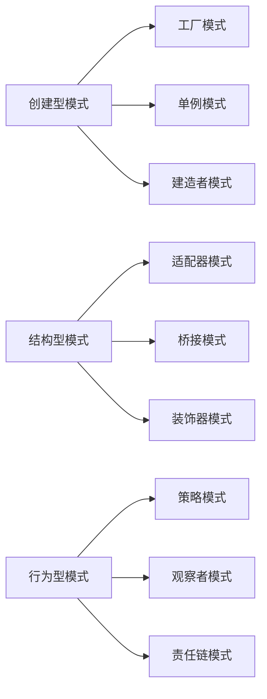

                 

# 设计模式的分类与应用场景

## 1. 背景介绍

设计模式（Design Pattern）是一套被反复使用、多数人知晓的、经过分类编目的、代码设计经验的总结。设计模式能解决一些在软件设计中经常遇到的问题，为软件开发者提供了一组常用的解决方案。设计模式的分类与应用场景是软件设计领域的重要研究内容，本文将从背景、分类、应用场景、优缺点、发展趋势等方面进行全面阐述。

## 2. 核心概念与联系

### 2.1 核心概念概述

设计模式分为三类：创建型、结构型和行为型模式。

- **创建型模式**：主要用于对象的创建方式，解决对象实例化过程中的各种问题。常见的创建型模式包括工厂模式（Factory Pattern）、单例模式（Singleton Pattern）、建造者模式（Builder Pattern）等。

- **结构型模式**：用于类和对象的组合，提供了一种实现客户端与接口分离的结构。常见的结构型模式包括适配器模式（Adapter Pattern）、桥接模式（Bridge Pattern）、装饰器模式（Decorator Pattern）等。

- **行为型模式**：关注类和对象之间的交互方式，描述对象间相互通信的行为。常见的行为型模式包括策略模式（Strategy Pattern）、观察者模式（Observer Pattern）、责任链模式（Chain of Responsibility Pattern）等。

这三个类别的设计模式相互关联，共同构成软件设计中的基本框架。

### 2.2 核心概念原理和架构的 Mermaid 流程图



## 3. 核心算法原理 & 具体操作步骤

### 3.1 算法原理概述

设计模式是面向对象编程中常用的设计思想，其基本原理是将复杂的问题通过一系列抽象的设计原则和方法解决。设计模式的核心在于抽象和封装，通过抽象设计思想，将问题简化并封装成具体的解决方案，方便开发者重复使用。

### 3.2 算法步骤详解

设计模式的应用步骤通常包括以下几个方面：

1. **识别问题**：首先要识别出系统中的问题所在，确定需要解决的具体问题。
2. **分析问题**：分析问题的本质，找到问题的根源。
3. **选择设计模式**：根据问题的特点，选择合适的设计模式。
4. **设计解决方案**：根据选定的设计模式，设计出具体的解决方案。
5. **实现与测试**：将设计好的解决方案转化为代码，并进行测试验证。

### 3.3 算法优缺点

设计模式具有以下优点：

- **复用性高**：设计模式提供了通用的解决方案，可以在多个项目中重复使用。
- **可维护性强**：设计模式具有较高的可读性和可维护性，便于后续的修改和扩展。
- **可扩展性强**：设计模式易于扩展，可以通过修改设计模式实现新的功能。

但设计模式也存在一些缺点：

- **过度设计**：设计模式可能过度设计，导致系统复杂性增加。
- **过度依赖**：设计模式过度依赖于特定的设计模式，可能限制开发者的创造性。
- **理解难度大**：设计模式需要一定的抽象思维能力，初学者可能难以理解。

### 3.4 算法应用领域

设计模式在软件设计中的应用非常广泛，以下是几个典型应用领域：

1. **Web开发**：在Web开发中，设计模式被广泛用于处理动态页面、会话管理、数据持久化等。
2. **移动开发**：在移动应用开发中，设计模式被用于处理UI界面、网络请求、数据缓存等。
3. **企业应用**：在设计大型企业应用时，设计模式被用于处理组件重用、服务调用、事务处理等。
4. **游戏开发**：在游戏开发中，设计模式被用于处理游戏逻辑、用户交互、状态管理等。

## 4. 数学模型和公式 & 详细讲解 & 举例说明

### 4.1 数学模型构建

设计模式通常不涉及复杂的数学模型，其应用更多依赖于抽象的算法和设计思想。但为了更好地理解设计模式，可以将其抽象成数学模型进行分析。

例如，单例模式可以抽象成以下数学模型：

$$
S = \left\{
\begin{aligned}
&instance(), \quad \text{if instance is null} \\
&instance, \quad \text{otherwise}
\end{aligned}
\right.
$$

其中，$S$ 表示单例模式，$instance$ 表示全局唯一的实例。

### 4.2 公式推导过程

设计模式的公式推导主要基于具体的编程实现，通过模拟具体的编程场景来推导设计模式的算法。例如，工厂模式可以推导为以下算法：

```python
class Factory:
    def create(self, arg):
        if arg == 'A':
            return A()
        elif arg == 'B':
            return B()
        else:
            return None
```

其中，$arg$ 表示参数，$A$ 和 $B$ 表示具体的对象。

### 4.3 案例分析与讲解

下面以单例模式为例，分析其应用场景和具体实现。

**应用场景**：单例模式常用于全局唯一的对象，如数据库连接、配置管理等。

**具体实现**：

```python
class Singleton:
    _instance = None
    
    def __new__(cls):
        if cls._instance is None:
            cls._instance = super().__new__(cls)
        return cls._instance

    def get_config(self):
        return config
```

其中，`__new__` 方法用于创建实例，确保只有一个实例被创建。`get_config` 方法用于获取配置信息，确保全局唯一。

## 5. 项目实践：代码实例和详细解释说明

### 5.1 开发环境搭建

在进行设计模式的实践时，需要搭建好Python开发环境，安装必要的库和工具。以下是Python开发环境搭建的基本步骤：

1. 安装Python：下载并安装Python解释器，可以通过Anaconda、Miniconda等工具进行安装。
2. 安装pip：通过命令行安装pip，用于安装和管理Python包。
3. 安装必要的库：使用pip安装常用的Python库，如numpy、pandas、requests等。

### 5.2 源代码详细实现

下面以单例模式为例，给出Python代码实现：

```python
class Singleton:
    _instance = None
    
    def __new__(cls):
        if cls._instance is None:
            cls._instance = super().__new__(cls)
        return cls._instance

    def get_config(self):
        return config
```

### 5.3 代码解读与分析

- `_instance` 变量：用于保存全局唯一的实例。
- `__new__` 方法：重写`__new__`方法，确保只有一个实例被创建。
- `get_config` 方法：获取全局唯一的配置信息。

### 5.4 运行结果展示

```python
s = Singleton()
print(s.get_config())
```

运行上述代码，输出配置信息，证明单例模式的正确性。

## 6. 实际应用场景

### 6.1 Web开发

在Web开发中，设计模式被广泛应用于处理动态页面、会话管理、数据持久化等。例如，在处理用户登录时，可以使用单例模式保存用户登录状态，确保全局唯一。

### 6.2 移动开发

在移动应用开发中，设计模式被用于处理UI界面、网络请求、数据缓存等。例如，在处理网络请求时，可以使用工厂模式创建不同的请求对象，确保代码的可读性和可维护性。

### 6.3 企业应用

在设计大型企业应用时，设计模式被用于处理组件重用、服务调用、事务处理等。例如，在处理事务管理时，可以使用责任链模式处理不同级别的异常处理，确保系统的稳定性。

### 6.4 游戏开发

在游戏开发中，设计模式被用于处理游戏逻辑、用户交互、状态管理等。例如，在处理游戏逻辑时，可以使用策略模式管理不同的游戏规则，确保游戏的公平性和可扩展性。

## 7. 工具和资源推荐

### 7.1 学习资源推荐

为了帮助开发者系统掌握设计模式，以下是一些优质的学习资源：

1. 《Head First Design Patterns》：本书以趣味化的方式介绍设计模式，适合初学者阅读。
2. 《Design Patterns: Elements of Reusable Object-Oriented Software》：Gang of Four的经典著作，详细介绍了23种设计模式。
3. Udemy《Design Patterns in Java》：通过实际项目讲解设计模式，适合实践操作。
4. Coursera《Object-Oriented Design Patterns》：斯坦福大学的在线课程，深入浅出地讲解设计模式。
5. GitHub《Design Patterns in Python》：收集了大量Python设计模式的示例代码，适合参考学习。

### 7.2 开发工具推荐

设计模式的开发通常使用Python、Java、C++等语言，以下是一些常用的开发工具：

1. PyCharm：强大的Python IDE，支持代码调试、重构等特性。
2. Eclipse：Java IDE，支持多平台开发，插件丰富。
3. Visual Studio：C++ IDE，支持代码调试、编译等特性。
4. IntelliJ IDEA：Java IDE，支持代码重构、版本控制等特性。

### 7.3 相关论文推荐

设计模式的研究涉及软件工程、计算机科学等多个领域，以下是一些经典的相关论文：

1. "A Catalogue of Object-Oriented Design Patterns"：Gang of Four的经典论文，详细介绍了23种设计模式。
2. "Design Patterns"：ERichard Gamma等人的著作，系统介绍了设计模式的基本概念和应用场景。
3. "A Unified Architecture for Reusable Software"：Martin Fowler的论文，提出了统一的架构设计思想。
4. "Design Patterns in Agile Software Development"：Martin Fowler的著作，介绍了敏捷开发中常用的设计模式。
5. "Design Patterns and Architectural Styles for Small to Medium-Scale Applications"：Martin Fowler的论文，探讨了小规模应用中的设计模式和架构风格。

## 8. 总结：未来发展趋势与挑战

### 8.1 研究成果总结

设计模式的研究和发展经历了多个阶段，从最初的23种设计模式到如今的数百种设计模式，设计模式的种类和应用场景不断丰富。设计模式的发展离不开软件开发实践的推动和软件工程研究的支持。

### 8.2 未来发展趋势

设计模式未来的发展趋势主要包括以下几个方面：

1. **多样性**：设计模式将向更广泛的技术栈扩展，涵盖更多的编程语言和技术平台。
2. **灵活性**：设计模式将更加灵活，适应不同的业务场景和技术需求。
3. **易用性**：设计模式将更加易用，方便开发者快速理解和应用。
4. **自动化**：设计模式的应用将更多依赖自动化工具和框架，减少人工干预。

### 8.3 面临的挑战

设计模式在应用和发展过程中也面临一些挑战：

1. **复杂性**：设计模式的种类繁多，可能导致开发者混淆和误用。
2. **过时性**：设计模式可能随着技术的发展变得过时，需要不断更新和改进。
3. **重复性**：设计模式可能存在重复和冗余，导致代码冗长和可读性差。
4. **高成本**：设计模式的应用需要一定的学习成本，可能不适合所有开发者。

### 8.4 研究展望

设计模式的研究未来应更加注重以下几个方面：

1. **标准化**：制定设计模式的标准和规范，确保设计模式的统一和一致性。
2. **自动化**：开发更多的自动化工具和框架，减少设计模式的应用成本。
3. **可扩展性**：设计模式应具备更好的可扩展性，适应不同的业务场景和技术需求。
4. **可复用性**：设计模式应具备更好的可复用性，方便开发者在多个项目中重复使用。

## 9. 附录：常见问题与解答

**Q1：设计模式为什么重要？**

A: 设计模式可以提高代码的可读性、可维护性和可扩展性，减少开发成本和维护成本。

**Q2：如何选择合适的设计模式？**

A: 根据具体的问题和场景选择合适的设计模式，考虑模式的适用性、复杂性和可维护性。

**Q3：设计模式的学习成本高吗？**

A: 设计模式的学习成本相对较高，但一旦掌握，可以大幅提升开发效率和代码质量。

**Q4：设计模式是否适用于所有编程语言？**

A: 设计模式适用于多种编程语言，但具体实现方式可能会有所不同。

**Q5：设计模式的未来发展方向是什么？**

A: 设计模式的未来发展方向包括标准化、自动化、可扩展性和可复用性，以满足更广泛的技术需求。

---

作者：禅与计算机程序设计艺术 / Zen and the Art of Computer Programming

