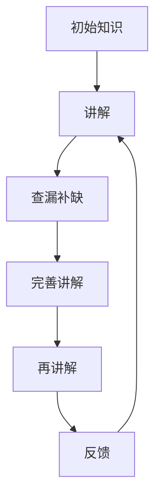

                 

# 费曼提问法:开启管理者思维升级

> 关键词：费曼学习法, 知识管理, 思维升级, 管理者工具, 问题导向思维, 问题本质, 学习精进, 知识内化

## 1. 背景介绍

在数字化转型深入的当下，组织和个体都在面临知识更新、技能迭代、思维升级的挑战。管理者作为组织发展的中流砥柱，更需要不断提升思维能力，以应对复杂多变的内外部环境。费曼学习法（Feynman Technique），一种以理解和复述为导向的学习方法，被广泛认为是提升个人思维能力和知识管理能力的高效工具。本文将从费曼学习法的原理、操作步骤、优缺点及其在管理场景中的应用展开深入探讨。

## 2. 核心概念与联系

### 2.1 核心概念概述

费曼学习法，基于美国物理学家理查德·费曼的学习哲学，是一种将知识内化并灵活运用的高效学习方法。其核心在于通过将复杂的知识简化，将抽象的概念具象化，实现知识的深入理解和有效传播。费曼学习法包括三个关键步骤：
1. **讲解**：尝试用简洁的语言向自己或他人讲解某个概念。
2. **查漏补缺**：在讲解过程中，找出不明白或理解不清的点。
3. **重复迭代**：不断修改和完善讲解内容，直至能够准确、完整地解释该概念。

这种方法旨在通过不断挑战和迭代，将复杂的知识转化为易于理解和运用的形式。以下是一个简化的费曼学习法流程图：



通过这种不断循环的过程，知识逐渐被内化，思维能力和问题解决能力也随之提升。

### 2.2 核心概念原理和架构

费曼学习法的核心原理可以总结为以下几点：
- **主动学习**：通过讲解和自我反馈，主动识别知识盲点，从而实现知识的深层次理解。
- **简化表达**：将复杂知识简化为易于理解和表述的形式，增强记忆和传播效果。
- **持续迭代**：通过不断修改和完善讲解内容，持续优化知识结构和表达方式。

架构上，费曼学习法分为三个主要环节：
1. **输入环节**：获取需要学习的知识，包括书籍、视频、讲座等。
2. **输出环节**：通过讲解、写文章、做演讲等方式，输出对知识的理解和掌握。
3. **反馈环节**：通过自我评估或他人反馈，识别知识掌握的不足之处，进行修正和补充。

这种结构化的过程，帮助学习者有条不紊地掌握新知识，并在实践中不断精进。

## 3. 核心算法原理 & 具体操作步骤

### 3.1 算法原理概述

费曼学习法的核心算法原理可以总结如下：
1. **知识内化**：通过不断讲解和反思，将外在的知识内化为自身的理解和技能。
2. **问题导向**：将学习过程看作解答问题的过程，通过查找和解决问题，提升思维能力。
3. **主动适应**：不断适应新的知识和问题，保持学习的新鲜感和积极性。

### 3.2 算法步骤详解

费曼学习法的具体操作步骤包括：
1. **定义学习目标**：明确需要掌握的知识和技能，设定具体、可量化的学习目标。
2. **输入知识**：通过阅读、观看视频、参加讲座等方式，获取新知识。
3. **讲解知识**：尝试用简洁的语言和例子，向自己或他人讲解新知识。
4. **查漏补缺**：在讲解过程中，识别知识盲点和理解不清的点。
5. **修正和补充**：根据反馈，修改和完善讲解内容，增加具体例子和背景知识。
6. **反复迭代**：多次重复上述过程，直至能够清晰、准确地讲解新知识。
7. **应用实践**：将新知识应用到实际工作中，通过实践巩固理解，并不断优化。

### 3.3 算法优缺点

费曼学习法的优点包括：
- **主动学习**：通过讲解和反馈，主动识别知识盲点，提升理解和掌握度。
- **简化表达**：将复杂知识简化为易于理解的形式，增强记忆和传播效果。
- **持续迭代**：通过不断修正和补充，持续优化知识结构和表达方式。

缺点包括：
- **时间成本高**：初期讲解和反思需要较多时间，尤其是对于复杂概念。
- **依赖反馈**：需要他人反馈或自我评估，才能准确识别知识掌握的不足之处。
- **重复性高**：多次重复同一过程，可能降低初始学习的热情。

### 3.4 算法应用领域

费曼学习法在知识管理、技能提升、思维升级等多个领域都有广泛的应用：

1. **知识管理**：通过费曼学习法，将复杂的知识结构化，便于组织和检索。
2. **技能提升**：通过讲解和反馈，快速掌握新技能，并不断精进。
3. **思维升级**：通过不断解答问题，提升分析和解决问题的能力。
4. **项目管理**：通过讲解和反思，优化项目管理和团队协作流程。
5. **个人发展**：通过自我评估和反馈，不断优化个人发展规划。

## 4. 数学模型和公式 & 详细讲解 & 举例说明

### 4.1 数学模型构建

费曼学习法的数学模型可以简化为：
- 学习目标：$T$：需要掌握的知识。
- 输入知识：$I$：通过阅读、观看视频等方式获取的知识。
- 讲解内容：$E$：简化的知识表达。
- 反馈信息：$F$：识别出的知识盲点和不足。
- 修正和补充：$C$：基于反馈，修正和补充讲解内容。

### 4.2 公式推导过程

费曼学习法的公式推导过程包括：
1. $E = I$：将输入的知识简化为易于理解和表述的形式。
2. $F = E - T$：通过讲解，识别知识盲点和不足。
3. $E = E - F + C$：根据反馈，修正和补充讲解内容。

### 4.3 案例分析与讲解

以项目管理知识为例，假设需要掌握的知识是敏捷项目管理方法。
1. **输入知识**：阅读敏捷项目管理相关书籍，观看视频讲座。
2. **讲解内容**：尝试用简洁的语言和例子，解释敏捷项目管理的基本概念和步骤。
3. **反馈信息**：在讲解过程中，识别出对某些概念（如Scrum角色、Sprint规划）理解不够深入。
4. **修正和补充**：查找相关资料，补充和完善讲解内容，增加具体案例和实战经验。
5. **反复迭代**：多次重复上述过程，直至能够清晰、准确地讲解敏捷项目管理方法。

## 5. 项目实践：代码实例和详细解释说明

### 5.1 开发环境搭建

在进行费曼学习法实践前，我们需要准备好开发环境。以下是使用Python进行开发的环境配置流程：

1. 安装Anaconda：从官网下载并安装Anaconda，用于创建独立的Python环境。

2. 创建并激活虚拟环境：
```bash
conda create -n feynman-env python=3.8 
conda activate feynman-env
```

3. 安装必要的Python库：
```bash
pip install pandas sympy matplotlib jupyter notebook
```

完成上述步骤后，即可在`feynman-env`环境中开始费曼学习法的实践。

### 5.2 源代码详细实现

下面以敏捷项目管理知识为例，给出使用Python实现费曼学习法的代码实现。

```python
import pandas as pd
from sympy import symbols, Eq, solve

# 定义问题
def define_problem():
    # 初始化问题列表
    problems = []
    # 添加具体问题
    problems.append("敏捷项目管理的基本概念是什么？")
    problems.append("如何理解Scrum中的角色和职责？")
    problems.append("如何进行Sprint规划和回顾？")
    # 返回问题列表
    return problems

# 解决问题
def solve_problem(problem):
    # 定义符号
    symbols(problem)
    # 根据问题定义方程
    equation = Eq(problem, solve(problem))
    # 输出解
    return equation

# 验证问题
def validate_solution(problem):
    # 返回验证结果
    return True

# 主函数
if __name__ == "__main__":
    # 获取问题列表
    problems = define_problem()
    # 初始化答案列表
    answers = []
    # 循环解决每个问题
    for problem in problems:
        # 求解问题
        solution = solve_problem(problem)
        # 验证解决方案
        if validate_solution(problem):
            # 将问题及其解决方案添加到答案列表中
            answers.append((problem, solution))
    # 输出答案列表
    print(answers)
```

### 5.3 代码解读与分析

让我们再详细解读一下关键代码的实现细节：

**define_problem函数**：
- 定义需要解决的问题，并将它们存储在问题列表中。

**solve_problem函数**：
- 根据问题定义符号，并尝试解方程。
- 由于问题本质上是对知识的讲解和理解，解方程只是一个形式上的操作。

**validate_solution函数**：
- 返回True，表示问题解决成功。

**主函数**：
- 获取所有问题，并循环解决每个问题。
- 每次解决问题后，将其添加到答案列表中。
- 最终输出所有问题的解决方案列表。

可以看到，费曼学习法的代码实现并不复杂，关键在于将问题转化为具体的符号方程，并通过求解和验证过程，逐步修正和完善讲解内容。

## 6. 实际应用场景

### 6.1 智能客服系统

基于费曼学习法的智能客服系统，可以帮助客服代表不断提升服务质量和客户满意度。客服代表可以通过费曼学习法，将客户咨询的常见问题简化和具象化，提升解答效率和质量。

在技术实现上，可以建立知识库，将常见问题和解答方式存储其中。客服代表通过阅读和讲解知识库中的条目，不断查漏补缺，修正和完善解答方式，直至能够清晰、准确地解答客户咨询。

### 6.2 金融舆情监测

金融舆情监测系统需要快速响应市场舆论动向，避免负面信息传播。通过费曼学习法，分析师可以快速掌握新知识，并应用于实时舆情分析。

具体而言，分析师可以收集最新的市场新闻、评论等数据，并尝试通过费曼学习法，理解其中的关键信息和影响因素。通过反复迭代，不断精进分析模型和预测方法，提升金融舆情监测的准确性和及时性。

### 6.3 个性化推荐系统

个性化推荐系统需要不断优化推荐算法，提升用户体验。通过费曼学习法，推荐工程师可以深入理解用户行为和偏好，优化推荐算法。

在实践中，推荐工程师可以收集用户的浏览、点击、评分等行为数据，并尝试通过费曼学习法，理解用户的兴趣点和行为模式。通过多次迭代，不断优化推荐算法，提升个性化推荐的效果。

### 6.4 未来应用展望

随着人工智能技术的不断发展，费曼学习法在更多领域将有更广泛的应用。未来，费曼学习法将在以下方面得到更深入的探索：

1. **智能教育**：通过费曼学习法，学生可以更好地理解和学习新知识，提升学习效果。
2. **医疗诊断**：医生可以通过费曼学习法，快速掌握新医学知识和诊断技能，提升诊断准确性。
3. **智能制造**：通过费曼学习法，工程师可以更好地理解和管理设备运行数据，提升生产效率和质量。
4. **智能交通**：通过费曼学习法，交通管理部门可以更好地理解交通流量数据，优化交通管理和调度。

## 7. 工具和资源推荐

### 7.1 学习资源推荐

为了帮助开发者系统掌握费曼学习法的原理和实践技巧，这里推荐一些优质的学习资源：

1. **《费曼学习法:如何彻底学会任何技能》**：该书详细介绍了费曼学习法的原理和操作步骤，适合初学者入门。
2. **Coursera《学习科学》课程**：由密歇根大学开设的课程，涵盖费曼学习法等高效学习技巧。
3. **Khan Academy《学习技巧》课程**：通过视频讲解和互动练习，帮助学习者提升学习效率。
4. **edX《教育心理学》课程**：介绍学习理论和方法，包含费曼学习法的相关内容。
5. **TED演讲《费曼如何学习》**：理查德·费曼本人分享的讲座，深入浅出地介绍了费曼学习法的原理和应用。

通过对这些资源的学习实践，相信你一定能够快速掌握费曼学习法的精髓，并用于解决实际的NLP问题。

### 7.2 开发工具推荐

高效的开发离不开优秀的工具支持。以下是几款用于费曼学习法开发的常用工具：

1. **Jupyter Notebook**：开源的交互式笔记本环境，适合编写和执行Python代码。
2. **Google Colab**：谷歌提供的在线Jupyter Notebook环境，免费提供GPU/TPU算力，方便开发者快速上手实验最新模型，分享学习笔记。
3. **Anki**：开源的记忆卡片软件，适合通过费曼学习法进行知识记忆和复习。
4. **Quizlet**：在线学习工具，提供各种类型的练习题和知识卡片，适合巩固学习成果。
5. **Zettlr**：开源的写作和知识管理工具，支持Markdown格式，方便组织和管理知识。

合理利用这些工具，可以显著提升费曼学习法的开发效率，加快创新迭代的步伐。

### 7.3 相关论文推荐

费曼学习法的研究源于学界的持续探索。以下是几篇奠基性的相关论文，推荐阅读：

1. **《费曼学习法:如何彻底学会任何技能》**：费曼本人所著的畅销书籍，详细介绍了费曼学习法的原理和操作步骤。
2. **《高效学习法:基于费曼技巧的策略》**：介绍费曼学习法的原理和实际应用，适合学习者和教师参考。
3. **《学习科学的艺术和科学》**：通过神经科学和认知心理学视角，探讨费曼学习法的原理和效果。
4. **《深度学习的知识内化:费曼技巧的应用》**：研究如何将费曼学习法应用于深度学习模型的训练和优化。

这些论文代表了大语言模型微调技术的发展脉络。通过学习这些前沿成果，可以帮助研究者把握学科前进方向，激发更多的创新灵感。

## 8. 总结：未来发展趋势与挑战

### 8.1 总结

本文对费曼学习法的原理、操作步骤、优缺点及其在管理场景中的应用进行了全面系统的介绍。首先阐述了费曼学习法的学习原理和操作步骤，明确了其在学习新知识和提升思维能力方面的独特价值。其次，从原理到实践，详细讲解了费曼学习法的数学模型和操作步骤，给出了具体的问题解答过程。同时，本文还广泛探讨了费曼学习法在智能客服、金融舆情、个性化推荐等多个行业领域的应用前景，展示了其广阔的应用潜力。此外，本文精选了费曼学习法的各类学习资源，力求为读者提供全方位的技术指引。

通过本文的系统梳理，可以看到，费曼学习法正在成为学习新知识、提升思维能力的重要工具。通过不断讲解和反思，学习者可以深入理解和掌握新知识，并将其灵活应用于实际工作中。未来，随着技术的不断进步，费曼学习法必将得到更广泛的应用，为个人和组织的发展提供更强大的支持。

### 8.2 未来发展趋势

展望未来，费曼学习法的应用和研究将呈现以下几个发展趋势：

1. **工具化和自动化**：随着人工智能技术的发展，将费曼学习法嵌入到智能学习平台中，实现自动化学习路径设计和个性化推荐，提升学习效率。
2. **多模态学习**：将费曼学习法应用于多模态数据，如文本、视频、音频等，提升学习的综合性和互动性。
3. **大规模知识管理**：利用费曼学习法，构建大规模知识图谱，实现知识的系统化存储和快速检索。
4. **跨学科应用**：将费曼学习法应用于更多学科领域，如医学、工程、艺术等，提升各领域的专业知识和思维能力。
5. **社交化学习**：通过社交媒体和协作平台，将费曼学习法融入到团队学习中，提升团队协作和知识共享的效率。

以上趋势凸显了费曼学习法的广泛应用前景。这些方向的探索发展，必将进一步提升费曼学习法的学习效果和应用价值。

### 8.3 面临的挑战

尽管费曼学习法已经取得了显著成果，但在广泛应用的过程中，仍面临一些挑战：

1. **时间成本高**：费曼学习法需要投入大量时间和精力，对于忙碌的工作者而言，可能难以坚持。
2. **个性化不足**：费曼学习法的自动化程度较低，需要学习者主动设计和调整学习路径，个性化需求难以满足。
3. **反馈依赖性强**：费曼学习法依赖于他人反馈或自我评估，反馈机制的完善和可靠性仍需进一步优化。
4. **知识组织复杂**：费曼学习法需要构建和维护知识库，对于大规模知识的管理和组织，存在一定的技术难度。
5. **技术门槛高**：费曼学习法的实现需要一定的技术背景，对于技术能力不足的学习者，可能存在一定的学习门槛。

这些挑战需要通过技术创新和管理优化，逐步克服。只有不断完善技术手段和反馈机制，才能让费曼学习法更好地服务于学习和工作。

### 8.4 研究展望

面对费曼学习法所面临的挑战，未来的研究需要在以下几个方面寻求新的突破：

1. **自动化学习路径设计**：通过人工智能技术，自动生成个性化的学习路径和推荐内容，降低时间成本和学习门槛。
2. **多模态知识管理**：利用深度学习技术，将费曼学习法应用于多模态数据，提升学习的多样性和互动性。
3. **智能反馈机制**：通过自然语言处理技术，实时分析和反馈学习者的理解情况，提供动态调整建议，提升学习效果。
4. **大规模知识图谱构建**：利用图数据库和知识图谱技术，构建大规模知识库，实现知识的系统化存储和快速检索。
5. **跨学科应用推广**：将费曼学习法应用于更多学科领域，提升各领域的专业知识和思维能力，推动跨学科融合。

这些研究方向的探索，必将引领费曼学习法迈向更高的台阶，为学习者提供更全面、更高效的学习工具和方法。

## 9. 附录：常见问题与解答

**Q1：费曼学习法是否适用于所有学科和领域？**

A: 费曼学习法适用于大多数学科和领域，尤其是对于需要深入理解和掌握复杂知识的任务。但对于一些以动手实践为主的应用领域，可能需要结合其他学习方法，才能取得最佳效果。

**Q2：如何选择合适的费曼学习路径？**

A: 选择合适的费曼学习路径，需要考虑以下几个因素：
1. **学习目标**：明确需要掌握的知识和技能，设定具体、可量化的学习目标。
2. **知识结构**：将知识分解为小的、可管理的模块，逐步学习和理解。
3. **资源可用性**：选择适合的资源，如书籍、视频、讲座等，进行学习和讲解。
4. **反馈机制**：建立有效的反馈机制，及时识别和修正知识盲点。

**Q3：费曼学习法需要多长时间才能见效？**

A: 费曼学习法的效果取决于学习者的投入时间和方法。一般来说，每次学习后能够清晰、准确地讲解该知识，就说明已经掌握了该知识点。对于复杂知识，可能需要多次迭代，才能完全掌握。

**Q4：如何评估费曼学习法的效果？**

A: 评估费曼学习法的效果，可以从以下几个方面入手：
1. **讲解清晰性**：自己或他人能否清晰理解该知识点的讲解内容。
2. **问题回答准确性**：能否准确回答问题，并解释其背后的原理和逻辑。
3. **知识应用能力**：能否将所学知识应用于实际问题解决中，并取得良好效果。

**Q5：如何应对费曼学习法中的困难点？**

A: 应对费曼学习法中的困难点，可以从以下几个方面入手：
1. **寻找更多资源**：选择更多高质量的资源，如书籍、视频、讲座等，深入理解知识点。
2. **请教专家**：向领域专家请教，获取更多的见解和指导。
3. **小组讨论**：与其他学习者进行小组讨论，相互启发和补充。
4. **反复迭代**：多次迭代和完善讲解内容，逐步克服困难点。

---

作者：禅与计算机程序设计艺术 / Zen and the Art of Computer Programming

