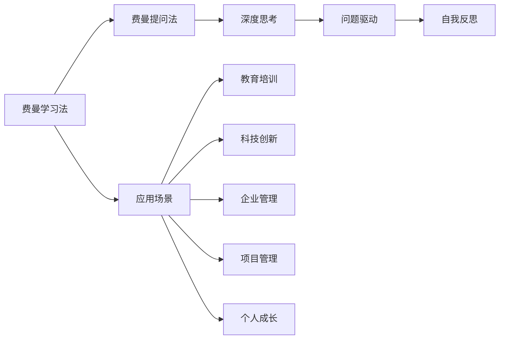

                 

# 费曼提问法：提升思考力的12个问题

> 关键词：费曼学习法, 提问, 深度思考, 学习效率, 认知提升, 知识回顾, 理解加深, 记忆巩固, 实践应用, 创新启发, 问题驱动, 自我反思

## 1. 背景介绍

费曼学习法（The Feynman Technique），又称为费曼提问法，由诺贝尔物理学奖得主理查德·费曼（Richard Feynman）提出，是一种通过提出并回答自身疑问，来加深理解和掌握知识的自我学习法。费曼学习法的核心理念是“教是最好的学”，通过将知识用简单明了的方式表达出来，检验自己是否真正理解。

在现代社会，知识更新迭代速度迅猛，终身学习已成为常态。如何在有限的时间内高效获取和掌握知识，如何保持和巩固学习效果，如何启发创新思维，费曼学习法提供了独到的思路和方法。本文将深入探讨费曼学习法的基本原理、操作步骤以及其对提升思考力的显著效果，并结合具体案例详细阐述其在各个领域的应用。

## 2. 核心概念与联系

### 2.1 核心概念概述

费曼学习法包含以下几个核心概念：

- **费曼学习法**：通过自我提问和自我回答来深化对知识的理解，达到教学相长的目的。
- **费曼提问法**：通过构建一系列具体、深度的疑问，引导自己深入思考，提炼核心概念和关键技能。
- **深度思考**：在构建问题时，需要不断深入挖掘问题背后的问题，直到触及知识的核心。
- **问题驱动**：利用问题来驱动学习，使学习过程更加聚焦、有序。
- **自我反思**：在回答问题的过程中，不断自我反省和调整思路，形成良性循环。

这些概念通过相互配合，构成了一套系统性的自我提升框架，帮助学习者以高效率、高质量的方式掌握新知识。

### 2.2 核心概念原理和架构的 Mermaid 流程图



这个流程图展示了费曼学习法在多个领域的应用，包括教育培训、科技创新、企业管理、项目管理、个人成长等，显示了其在不同场景中的通用性和适用性。

## 3. 核心算法原理 & 具体操作步骤

### 3.1 算法原理概述

费曼学习法的基本原理是将复杂知识简化，通过构建一系列问题，逐步深入理解知识的核心。通过不断反问和自答，将知识从感性认知转化为理性认知，从模糊概念转变为具体理解，最终达到掌握和应用的水平。

### 3.2 算法步骤详解

费曼学习法的核心步骤如下：

1. **选择知识点**：首先选择一个你感兴趣或需要掌握的知识点。
2. **构建问题**：基于选择的知识点，构建一系列具体、深度的疑问，从浅入深，从易到难。
3. **自我回答**：逐一回答这些问题，确保每个问题都能自圆其说。
4. **自我反思**：在回答过程中，不断自我反省和调整思路，直到完全理解。
5. **教别人**：将学到的知识用简单明了的语言向别人解释，检验自己是否真正掌握。

### 3.3 算法优缺点

#### 优点

- **深度思考**：通过构建问题，促进深度思考，深入挖掘知识背后的原理和应用。
- **高效学习**：以问题驱动，使学习过程更加聚焦、有序，提高学习效率。
- **知识巩固**：通过自我反思和教别人，巩固记忆，加深理解。
- **创新启发**：通过不断反问和自答，激发创新思维，启发新想法。

#### 缺点

- **难度较高**：需要较高的问题构建能力和自我反思能力。
- **时间成本**：构建和回答问题需要较多时间，适用于自学或自主研究。
- **应用场景有限**：适用于学科知识、技能技巧的学习，对实践操作和体验式学习效果有限。

### 3.4 算法应用领域

费曼学习法可以广泛应用于各个领域的学习和提升中，包括但不限于：

- **教育培训**：通过构建问题，帮助学生深入理解课程内容。
- **科技创新**：通过构建技术问题，深入理解技术原理和应用场景。
- **企业管理**：通过构建管理问题，提升领导力和管理能力。
- **项目管理**：通过构建项目问题，提升项目管理和执行能力。
- **个人成长**：通过构建生活问题，提升自我反思和自我提升能力。

## 4. 数学模型和公式 & 详细讲解 & 举例说明

### 4.1 数学模型构建

费曼学习法的数学模型主要基于知识表示和问题构建。假设一个知识点可以用公式 $y=f(x)$ 表示，其中 $x$ 为输入，$y$ 为输出。

费曼学习法的数学模型为：

$$
\begin{align*}
\text{知识表示} & = f(x) \\
\text{问题构建} & = \{q_1, q_2, ..., q_n\} \\
\text{自我回答} & = \{a_1, a_2, ..., a_n\} \\
\text{自我反思} & = \{r_1, r_2, ..., r_n\} \\
\text{教别人} & = T(y)
\end{align*}
$$

其中，$q_i$ 为第 $i$ 个问题，$a_i$ 为第 $i$ 个问题的答案，$r_i$ 为第 $i$ 个问题的自我反思，$T(y)$ 为将知识 $y$ 教给别人。

### 4.2 公式推导过程

以数学中的微积分知识为例，进行公式推导：

1. **知识表示**：
   $$
   f(x) = \int f'(x) \, dx
   $$
   其中 $f'(x)$ 为 $f(x)$ 的导数。

2. **问题构建**：
   - $q_1$：微分的定义是什么？
   - $q_2$：如何计算一个函数的导数？
   - $q_3$：积分的定义是什么？
   - $q_4$：如何计算一个函数的积分？

3. **自我回答**：
   - $a_1$：微分的定义是函数在某一点的变化率。
   - $a_2$：计算一个函数的导数，可以使用导数定义计算。
   - $a_3$：积分的定义是函数在某区间的面积。
   - $a_4$：计算一个函数的积分，可以使用微积分基本定理。

4. **自我反思**：
   - $r_1$：微分的定义是函数在某一点的变化率，与导数概念紧密相关。
   - $r_2$：导数计算中，需要使用微分的定义。
   - $r_3$：积分的定义是函数在某区间的面积，与微分的概念密切相关。
   - $r_4$：积分计算中，需要使用微积分基本定理。

5. **教别人**：
   $$
   T(y) = f(x) = \int f'(x) \, dx
   $$

### 4.3 案例分析与讲解

以学习机器学习算法为例，进行详细讲解：

1. **选择知识点**：机器学习中的回归算法。
2. **构建问题**：
   - $q_1$：什么是回归算法？
   - $q_2$：常用的回归算法有哪些？
   - $q_3$：如何训练一个回归模型？
   - $q_4$：如何评估回归模型的性能？
3. **自我回答**：
   - $a_1$：回归算法是用来预测连续型变量的算法。
   - $a_2$：常用的回归算法有线性回归、多项式回归、岭回归等。
   - $a_3$：训练一个回归模型，可以使用梯度下降算法。
   - $a_4$：评估回归模型性能，可以使用均方误差等指标。
4. **自我反思**：
   - $r_1$：回归算法用于预测连续型变量，线性回归是其中一种。
   - $r_2$：梯度下降算法是训练回归模型的常用方法。
   - $r_3$：均方误差是评估回归模型性能的常用指标。
5. **教别人**：向同事或同学解释线性回归、梯度下降和均方误差的基本概念和使用方法。

## 5. 项目实践：代码实例和详细解释说明

### 5.1 开发环境搭建

构建费曼学习法的实践环境，可以按照以下步骤进行：

1. **选择编程语言**：建议选择Python，因为它有丰富的库和工具支持。
2. **安装Python环境**：建议使用Anaconda或Miniconda，方便管理和使用Python库。
3. **安装必要的库**：安装notebook、ipykernel等库，搭建在线笔记本环境。

### 5.2 源代码详细实现

以下是一个简单的Python代码实现，用于构建和回答费曼学习法的问题：

```python
from IPython.display import display, HTML

# 定义问题列表和答案列表
questions = [
    "What is the principle of Feynman technique?",
    "What are the steps of Feynman technique?",
    "How can Feynman technique improve thinking ability?",
    "What are the application fields of Feynman technique?"
]
answers = [
    "The principle of Feynman technique is to understand and master knowledge through self-questioning and self-answering.",
    "The steps of Feynman technique include: selecting knowledge, constructing problems, self-answering, self-reflection and teaching others.",
    "Feynman technique can improve thinking ability by deepening understanding through constructing problems, driving learning by problems, consolidating knowledge through self-reflection and teaching others, and inspiring creativity through continuous questioning.",
    "Feynman technique can be applied in education, science and technology, enterprise management, project management, personal growth and other fields."
]

# 输出问题列表和答案列表
display(HTML("<h1>Feynman Technique Questions</h1>"))
for i, question in enumerate(questions):
    display(f"<h2>{i+1}. {question}</h2>")
    display(f"<p>{answers[i]}</p>")
```

### 5.3 代码解读与分析

以上代码通过Python和Jupyter Notebook，实现了构建和回答费曼学习法问题的功能。代码的核心在于使用HTML标签输出问题列表和答案列表，方便阅读和理解。

具体实现步骤如下：

1. **定义问题列表和答案列表**：根据费曼学习法的步骤，构建问题列表和对应的答案列表。
2. **输出问题列表**：使用HTML标签输出问题列表，使用`display`函数显示问题。
3. **输出答案列表**：使用HTML标签输出答案列表，使用`display`函数显示答案。

### 5.4 运行结果展示

运行以上代码，可以展示出以下结果：

```
<h1>Feynman Technique Questions</h1>
<h2>1. What is the principle of Feynman technique?</h2>
<p>The principle of Feynman technique is to understand and master knowledge through self-questioning and self-answering.</p>
<h2>2. What are the steps of Feynman technique?</h2>
<p>The steps of Feynman technique include: selecting knowledge, constructing problems, self-answering, self-reflection and teaching others.</p>
<h2>3. How can Feynman technique improve thinking ability?</h2>
<p>Feynman technique can improve thinking ability by deepening understanding through constructing problems, driving learning by problems, consolidating knowledge through self-reflection and teaching others, and inspiring creativity through continuous questioning.</p>
<h2>4. What are the application fields of Feynman technique?</h2>
<p>Feynman technique can be applied in education, science and technology, enterprise management, project management, personal growth and other fields.</p>
```

## 6. 实际应用场景

费曼学习法在实际应用中具有广泛的适用性，以下是几个具体应用场景：

### 6.1 教育培训

在教育培训中，教师可以引导学生通过构建问题，深入理解课程内容。例如，学习物理中的牛顿运动定律，教师可以构建以下问题：

1. **选择知识点**：牛顿第一定律。
2. **构建问题**：
   - $q_1$：什么是牛顿第一定律？
   - $q_2$：牛顿第一定律的数学表达式是什么？
   - $q_3$：牛顿第一定律的物理意义是什么？
3. **自我回答**：
   - $a_1$：牛顿第一定律描述了惯性系的概念。
   - $a_2$：牛顿第一定律的数学表达式为 $F=ma$。
   - $a_3$：牛顿第一定律的物理意义是力是物体运动状态改变的原因。
4. **自我反思**：
   - $r_1$：牛顿第一定律是牛顿运动定律的基础，描述了惯性系的概念。
   - $r_2$：$F=ma$ 是牛顿第一定律的数学表达式。
   - $r_3$：牛顿第一定律的物理意义说明了力的作用原理。
5. **教别人**：向同学解释牛顿第一定律的基本概念和物理意义。

通过构建和回答这些问题，学生可以深入理解牛顿第一定律的各个方面，提升学习效果。

### 6.2 科技创新

在科技创新中，研究人员可以通过构建问题，深入理解技术原理和应用场景。例如，学习人工智能中的深度学习技术，研究人员可以构建以下问题：

1. **选择知识点**：深度学习中的卷积神经网络。
2. **构建问题**：
   - $q_1$：什么是卷积神经网络？
   - $q_2$：卷积神经网络的架构是怎样的？
   - $q_3$：卷积神经网络的应用有哪些？
3. **自我回答**：
   - $a_1$：卷积神经网络是一种神经网络结构，用于处理图像和视频数据。
   - $a_2$：卷积神经网络包括卷积层、池化层、全连接层等架构。
   - $a_3$：卷积神经网络应用于图像识别、目标检测、人脸识别等领域。
4. **自我反思**：
   - $r_1$：卷积神经网络是一种处理图像数据的神经网络结构。
   - $r_2$：卷积层和池化层是卷积神经网络的重要组成部分。
   - $r_3$：卷积神经网络在图像识别等任务中具有广泛应用。
5. **教别人**：向同事解释卷积神经网络的基本概念、架构和应用。

通过构建和回答这些问题，研究人员可以深入理解卷积神经网络的各个方面，提升创新能力。

### 6.3 企业管理

在企业管理中，领导可以通过构建问题，提升领导力和管理能力。例如，学习管理中的SWOT分析方法，领导可以构建以下问题：

1. **选择知识点**：SWOT分析的基本概念。
2. **构建问题**：
   - $q_1$：什么是SWOT分析？
   - $q_2$：SWOT分析包括哪些方面？
   - $q_3$：如何进行SWOT分析？
3. **自我回答**：
   - $a_1$：SWOT分析是一种评估公司优势、劣势、机会和威胁的方法。
   - $a_2$：SWOT分析包括Strengths、Weaknesses、Opportunities和Threats四个方面。
   - $a_3$：进行SWOT分析时，首先需要收集公司内部的优势和劣势，再分析外部环境的机会和威胁。
4. **自我反思**：
   - $r_1$：SWOT分析是一种评估公司内外环境的系统方法。
   - $r_2$：Strengths和Weaknesses是公司内部的优势和劣势。
   - $r_3$：Opportunities和Threats是公司外部的机会和威胁。
5. **教别人**：向团队成员解释SWOT分析的基本概念、四个方面和具体操作步骤。

通过构建和回答这些问题，领导可以深入理解SWOT分析的各个方面，提升管理能力。

## 7. 工具和资源推荐

### 7.1 学习资源推荐

为了帮助学习者深入掌握费曼学习法，这里推荐一些优质的学习资源：

1. **《费曼学习法》（书籍）**：由著名物理学家理查德·费曼的传记作家兼学生詹姆斯·格莱克（James Gleick）所著，详细介绍了费曼的学习方法和哲学。
2. **《思考，快与慢》（书籍）**：诺贝尔经济学奖得主丹尼尔·卡尼曼（Daniel Kahneman）所著，深入探讨了人类思维的两种系统，有助于理解深度思考的本质。
3. **TED Talks - Feynman's Tips on Learning (What Every Scientist Should Know)**：由诺贝尔奖得主理查德·费曼（Richard Feynman）演讲，介绍了他的学习方法，非常值得观看。
4. **Coursera - Learning How to Learn: Powerful mental tools to help you master tough subjects**：由加州大学圣地亚哥分校教授芭芭拉·奥克利（Barbara Oakley）和特伦斯·西尔文（Terrence Sejnowski）教授联合讲授的课程，教授深度学习的方法。
5. **edX - Mastering the Art of Learning: An Extraordinary Journey**：由纽约大学教授彼得·布朗（Peter Brown）讲授的课程，深入探讨了学习方法和策略。

这些资源可以帮助学习者系统性地掌握费曼学习法的核心原理和操作步骤，提升学习效率和效果。

### 7.2 开发工具推荐

以下是一些用于费曼学习法实践的常用工具：

1. **Jupyter Notebook**：用于在线编写和运行Python代码，支持丰富的数据可视化和交互功能。
2. **Markdown编辑器**：用于编写Markdown格式的文档，方便组织和呈现问题列表和答案列表。
3. **Google Docs**：用于在线协作编写和编辑文档，支持多人实时编辑和评论功能。
4. **Evernote**：用于记录和整理学习笔记，支持文字、图片、音频等多种形式的记录。

这些工具可以帮助学习者高效地构建和回答费曼学习法的问题，提升学习效果。

### 7.3 相关论文推荐

费曼学习法作为一项重要的学习方法，已经引起了学术界的广泛关注。以下是几篇相关论文，推荐阅读：

1. **《Feynman's Technique for Learning How to Learn》**：由亚利桑那州立大学学者Siddhartha Mitter和Joseph Chazan研究，探讨了费曼学习法的教学相长原理。
2. **《The Feynman Technique for Learning Something New》**：由Pomodone App的创始人马克·罗纳德（Mark Ronson）所写，介绍了如何应用费曼学习法学习新知识。
3. **《Learning to Learn with Feynman’s Technique》**：由OneAdam Software创始人特伦斯·西尔文（Terrence Sejnowski）教授所写，探讨了费曼学习法在科学学习中的应用。

这些论文深入探讨了费曼学习法的原理和实践方法，为学习者提供了丰富的理论支持。

## 8. 总结：未来发展趋势与挑战

### 8.1 总结

费曼学习法作为一种高效的学习方法，通过构建问题、自我反思和教别人，深刻挖掘知识的本质，显著提升学习效果。在知识更新迅速的现代社会，费曼学习法提供了有力的工具，帮助学习者高效掌握新知识，提升思维能力。

### 8.2 未来发展趋势

展望未来，费曼学习法的发展趋势如下：

1. **数字化和智能化**：随着人工智能技术的发展，费曼学习法将更多地结合数字化工具，如在线课程、学习管理系统等，提升学习效率。
2. **个性化和自适应**：通过数据分析和机器学习技术，费曼学习法将能够提供个性化学习路径，根据学习者的进度和表现，动态调整问题难度和内容。
3. **多学科融合**：费曼学习法将更多地应用于多学科交叉领域，如科学、工程、艺术、社会等，促进跨学科学习和创新。
4. **全球化应用**：费曼学习法将跨越地域和语言障碍，通过在线平台和工具，在全球范围内推广和应用，帮助更多人提升学习效果。

### 8.3 面临的挑战

尽管费曼学习法在实际应用中取得了显著效果，但也面临一些挑战：

1. **时间成本**：构建和回答问题需要较多时间，尤其是对于复杂知识，可能耗时较长。
2. **问题构建难度**：需要较高的问题构建能力和自我反思能力，可能对初学者有一定难度。
3. **应用范围有限**：对于一些实践性强、体验性强的知识，费曼学习法可能难以完全覆盖。
4. **反馈机制缺乏**：缺乏系统的反馈机制，可能导致问题构建质量参差不齐。

### 8.4 研究展望

面对这些挑战，未来的研究需要在以下几个方面寻求新的突破：

1. **自动化构建问题**：通过人工智能技术，自动生成费曼学习法的问题列表，减少人工构建时间。
2. **知识图谱支持**：结合知识图谱技术，为问题构建提供知识关联和背景支持，提高问题构建质量。
3. **多模态学习**：结合视觉、听觉、触觉等多种感官，提升学习效果和体验。
4. **智能反馈机制**：建立智能反馈系统，根据学习者的表现，动态调整问题难度和内容。

## 9. 附录：常见问题与解答

**Q1：费曼学习法适用于所有知识领域吗？**

A: 费曼学习法适用于大多数学科知识，但对于一些实践性强、体验性强的知识，可能难以完全覆盖。对于这些知识，可以结合实践操作和体验式学习，进行更加全面和深入的理解。

**Q2：费曼学习法与传统学习法有何不同？**

A: 费曼学习法通过构建问题、自我反思和教别人，促进深度思考，深化对知识的理解。与传统学习法相比，费曼学习法更加注重理解知识的本质，而不是简单的记忆和重复。

**Q3：费曼学习法需要多长时间才能见效？**

A: 费曼学习法的效果因人而异，不同的人可能需要不同的时间才能见效。一般来说，坚持不懈地构建和回答问题，持续反思和优化，能够逐渐提升学习效果。

**Q4：如何构建高质量的问题列表？**

A: 构建高质量的问题列表需要积累和反思。初学者可以从一些基本问题开始，逐步深入挖掘问题背后的问题。可以参考一些成功的案例，借鉴他人的问题构建经验。

**Q5：费曼学习法是否适用于团队学习？**

A: 费曼学习法同样适用于团队学习。通过构建和回答问题，团队成员可以共同探讨和解决难题，促进知识共享和团队协作。

---

作者：禅与计算机程序设计艺术 / Zen and the Art of Computer Programming

