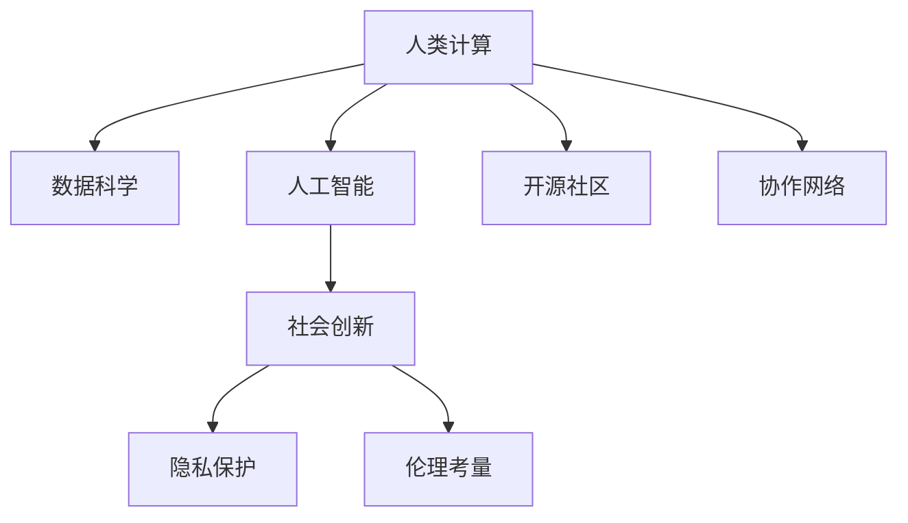

                 

# 赋能个人与社区：人类计算的社会价值

> 关键词：人类计算, 社会价值, 人工智能, 数据科学, 社会创新, 隐私保护, 伦理考量, 开源社区, 协作

## 1. 背景介绍

### 1.1 问题由来

人类计算作为计算科学的重要分支，正在逐步向社会各个角落渗透。在过去几十年中，计算机技术和数据科学的迅猛发展，特别是人工智能和大数据技术的普及，为人类计算提供了强有力的技术支持。在此基础上，新兴的人类计算技术逐渐成为解决社会问题、驱动社会进步的重要引擎。

人类计算以其独特的优势，将计算科学的应用从专业领域延伸至广大公众。它不仅提供了强大的数据分析和预测能力，还通过智能算法和机器学习，实现了对复杂问题的深度理解和解决方案的快速迭代。在实际应用中，人类计算不仅能够帮助政府和企业进行高效决策，也能够赋能普通个人和社区，解决他们面临的诸多挑战。

随着计算能力的不断提升，人工智能和大数据技术的广泛应用，人类计算正在呈现出前所未有的活力。然而，人类计算的普及和应用也带来了一系列新的挑战，如数据隐私、伦理考量、技术滥用等。如何在保障用户隐私和安全的同时，充分利用计算技术和数据科学的力量，赋能个人和社区，为社会创新注入新的活力，成为了亟需解决的重大问题。

### 1.2 问题核心关键点

人类计算的核心在于如何利用计算资源和数据科学，以智能算法和机器学习为手段，解决社会问题并赋能普通个人和社区。核心点包括：

- 数据获取与处理：如何高效获取并处理海量数据，同时保障数据隐私和安全。
- 算法设计与实现：如何设计高效、公平、透明的算法，以解决实际问题。
- 技术普及与教育：如何将复杂的技术知识普及给非专业人士，并提高公众的技术素养。
- 社会影响与评估：如何评估人类计算对社会的影响，确保其应用的正向性。
- 伦理与法律考量：如何在技术应用中考虑到伦理和法律问题，避免技术滥用。

这些关键点构成了人类计算的技术体系和应用框架，是推动人类计算向社会深入应用的重要基石。

### 1.3 问题研究意义

研究人类计算的社会价值，对于推动社会进步和创新，促进计算科学技术的广泛应用，具有重要意义：

- 促进社会公平：通过数据科学和人工智能，为社会边缘群体提供平等的知识获取和问题解决机会，缩小信息鸿沟。
- 提高决策效率：通过智能算法和数据分析，提高政府和企业决策的科学性和效率，推动社会治理和经济发展。
- 激发创新活力：人类计算为大众创新提供了新工具和新方法，鼓励更多社会主体参与到创新活动中。
- 维护数据安全：通过隐私保护技术和伦理考量，确保数据使用和人类计算过程中的安全性。
- 提升公众素养：普及计算科学知识，提高公众对数据科学的理解和应用能力。

通过对人类计算的社会价值进行深入研究，我们不仅可以更好地理解其潜力和应用范围，还可以制定更加合理的政策和规范，引导其健康发展。

## 2. 核心概念与联系

### 2.1 核心概念概述

为更好地理解人类计算的社会价值，本节将介绍几个密切相关的核心概念：

- **人类计算（Human Computing）**：一种将计算科学应用扩展到人类社会的技术手段，通过智能算法和数据科学，帮助人类解决问题。
- **数据科学（Data Science）**：一门跨学科的科学领域，通过数据收集、处理、分析和可视化，揭示数据中的模式和趋势。
- **人工智能（Artificial Intelligence, AI）**：一组使计算机能够执行通常需要人类智能的技术，包括机器学习、自然语言处理等。
- **社会创新（Social Innovation）**：通过创新驱动，利用新技术和新方法，解决社会问题和挑战，推动社会进步。
- **隐私保护（Privacy Protection）**：保护个人数据免受未经授权的访问和使用，维护用户隐私权益。
- **伦理考量（Ethical Consideration）**：在技术应用中考虑伦理问题，如公平性、透明度、责任归属等。
- **开源社区（Open Source Community）**：由开发者共同构建和维护的软件项目，强调开放性、协作性和共享性。
- **协作网络（Collaboration Network）**：通过网络技术和工具，连接和协调多个主体（如个人、组织、政府等）共同解决问题。

这些核心概念之间的逻辑关系可以通过以下Mermaid流程图来展示：



这个流程图展示出人类计算与其他核心概念之间的相互联系和影响：

1. **数据科学和人工智能**是实现人类计算的基础技术。
2. **社会创新**是应用人类计算的主要目标，以解决实际问题。
3. **隐私保护和伦理考量**是应用人类计算必须遵守的准则。
4. **开源社区和协作网络**提供了人类计算技术的实现平台和协作机制。

这些概念共同构成了人类计算的社会价值体系，指导着其应用和发展方向。

## 3. 核心算法原理 & 具体操作步骤

### 3.1 算法原理概述

人类计算的核心算法原理基于数据科学和人工智能，通过数据驱动和智能决策，实现对社会问题的分析和解决方案的生成。其核心步骤如下：

1. **数据收集与处理**：从各种数据源（如传感器、社交媒体、政府数据库等）收集数据，并进行清洗、标注和预处理。
2. **特征工程与模型选择**：设计合适的特征，选择合适的算法模型，对数据进行训练和优化。
3. **模型评估与迭代**：使用评估指标（如准确率、召回率、F1分数等）评估模型性能，并进行迭代优化。
4. **结果分析与解释**：对模型的输出进行解释和分析，提供可行的决策建议。
5. **应用部署与维护**：将模型部署到实际应用环境中，进行实时监控和维护，确保其持续稳定运行。

### 3.2 算法步骤详解

以社会创新中的一个经典问题——城市交通拥堵为例，展示人类计算的核心算法步骤：

**步骤1: 数据收集与处理**
- 收集城市交通数据（如车速、车流量、交通信号灯状态等），通过传感器、摄像头和移动设备获取。
- 数据清洗，去除噪声和异常值，确保数据质量和一致性。
- 数据标注，对交通事件进行分类（如事故、道路施工等），并建立时间序列。

**步骤2: 特征工程与模型选择**
- 设计特征，如路段长度、车速、交通信号灯状态等，用于描述交通状况。
- 选择合适的模型，如时间序列预测模型（如ARIMA、LSTM等），对未来交通流量进行预测。
- 模型训练，使用历史数据对模型进行训练，调整超参数，优化模型性能。

**步骤3: 模型评估与迭代**
- 使用评估指标（如平均绝对误差、均方误差等）评估模型预测结果的准确性。
- 对模型进行迭代优化，调整特征工程和模型选择策略，提升预测精度。

**步骤4: 结果分析与解释**
- 对模型输出进行分析，识别出高拥堵路段和时间段，提供可视化报告。
- 对模型进行解释，说明其预测结果的逻辑和依据。

**步骤5: 应用部署与维护**
- 将模型部署到城市交通管理中心，实时监测交通状况。
- 定期更新模型，引入新数据和算法，提升预测精度。

### 3.3 算法优缺点

人类计算的算法具有以下优点：

- **高效性**：利用智能算法和数据科学，大幅提升问题解决的效率。
- **广泛适用性**：适用于各种社会问题，如交通管理、环境保护、公共安全等。
- **可解释性**：通过特征工程和模型解释，提供透明可解释的决策过程。
- **可持续性**：通过数据和模型迭代，不断优化解决方案，提升长期效果。

然而，人类计算的算法也存在以下缺点：

- **数据依赖性强**：算法的精度和效果高度依赖于数据的质量和全面性。
- **模型复杂度高**：复杂模型需要高计算资源和专业知识，增加了应用难度。
- **结果不确定性**：数据偏差和算法偏见可能导致预测结果的不准确。
- **隐私和安全问题**：处理大量个人数据时，隐私保护和数据安全成为重要考量。

### 3.4 算法应用领域

人类计算在多个领域都有广泛应用，主要包括：

- **智慧城市**：利用大数据和人工智能，实现城市交通管理、公共安全、环境保护等功能。
- **健康医疗**：通过数据分析和机器学习，辅助诊断、治疗、预防疾病，提升医疗服务质量。
- **金融服务**：利用金融数据进行风险评估、欺诈检测、投资分析等，提高金融决策的科学性和效率。
- **教育培训**：通过数据分析和智能推荐，提供个性化教育内容，提升学习效果和教育公平性。
- **环境保护**：监测环境数据，评估气候变化影响，提供环境保护政策建议。
- **农业生产**：利用农业数据进行气象预测、病虫害预警、作物优化等，提升农业生产效率。

这些应用领域展示了人类计算的广泛影响力和巨大潜力，推动了社会各行业的数字化转型和创新发展。

## 4. 数学模型和公式 & 详细讲解  
### 4.1 数学模型构建

在本节中，我们将通过一个具体的例子——智慧城市交通流量预测，来详细讲解人类计算的核心数学模型和公式。

假设我们要预测某城市主要道路的交通流量，设当前时间为 $t$，预测未来的交通流量为 $y_t$，已知的影响因素为 $x_1, x_2, ..., x_n$。我们可以建立如下线性回归模型：

$$
y_t = \theta_0 + \theta_1 x_1(t) + \theta_2 x_2(t) + ... + \theta_n x_n(t) + \epsilon_t
$$

其中，$\theta_0, \theta_1, ..., \theta_n$ 为模型参数，$\epsilon_t$ 为随机误差项。

为了评估模型性能，我们引入均方误差（Mean Squared Error, MSE）作为损失函数：

$$
L(\theta) = \frac{1}{N} \sum_{t=1}^N (y_t - \hat{y}_t)^2
$$

其中，$y_t$ 为真实交通流量，$\hat{y}_t$ 为模型预测值，$N$ 为样本数。

通过最小化损失函数 $L(\theta)$，我们可以得到模型参数 $\theta$ 的估计值，从而实现对未来交通流量的预测。

### 4.2 公式推导过程

为了求解模型参数 $\theta$，我们采用梯度下降法进行优化：

$$
\theta_{k+1} = \theta_k - \alpha \frac{\partial L(\theta)}{\partial \theta}
$$

其中，$\alpha$ 为学习率，$\frac{\partial L(\theta)}{\partial \theta}$ 为损失函数关于模型参数的梯度。

将线性回归模型的损失函数带入上述公式，得到：

$$
\frac{\partial L(\theta)}{\partial \theta} = \frac{1}{N} \sum_{t=1}^N (-2 (y_t - \hat{y}_t) x_t)
$$

因此，梯度下降法的更新公式为：

$$
\theta_{k+1} = \theta_k - \alpha \frac{1}{N} \sum_{t=1}^N (-2 (y_t - \hat{y}_t) x_t)
$$

重复上述过程，直至损失函数收敛，即可得到最优的模型参数 $\theta^*$。

### 4.3 案例分析与讲解

在实际应用中，我们需要根据具体问题选择合适的数学模型。例如，在智慧城市交通流量预测中，我们可以使用时间序列模型（如ARIMA、LSTM等）来预测未来交通流量。

以LSTM模型为例，其结构如下图所示：


LSTM模型通过门控机制，捕捉时间序列数据中的长期依赖关系。其核心公式包括：

- 门控单元更新公式：

$$
g_t = \sigma(W_0 x_t + U_0 h_{t-1} + b_0)
$$

$$
r_t = \sigma(W_1 x_t + U_1 h_{t-1} + b_1)
$$

$$
f_t = \sigma(W_2 x_t + U_2 h_{t-1} + b_2)
$$

其中，$x_t$ 为输入，$h_{t-1}$ 为前一时刻的隐状态，$W_0, W_1, W_2$ 和 $U_0, U_1, U_2$ 为权重矩阵，$b_0, b_1, b_2$ 为偏置项，$\sigma$ 为Sigmoid激活函数。

- 状态更新公式：

$$
c_t = f_t \odot c_{t-1} + r_t \odot \tanh(W_3 x_t + U_3 h_{t-1} + b_3)
$$

其中，$\odot$ 为Hadamard乘积，$c_{t-1}$ 为前一时刻的细胞状态，$\tanh$ 为Tanh激活函数。

- 输出公式：

$$
h_t = g_t \odot \tanh(c_t)
$$

其中，$h_t$ 为当前时刻的隐状态。

通过上述公式，LSTM模型可以捕捉时间序列数据中的长期依赖关系，并生成预测结果。

## 5. 项目实践：代码实例和详细解释说明

### 5.1 开发环境搭建

在进行人类计算项目实践前，我们需要准备好开发环境。以下是使用Python进行Scikit-learn开发的环境配置流程：

1. 安装Anaconda：从官网下载并安装Anaconda，用于创建独立的Python环境。

2. 创建并激活虚拟环境：
```bash
conda create -n human_computing_env python=3.8 
conda activate human_computing_env
```

3. 安装Scikit-learn：
```bash
pip install scikit-learn
```

4. 安装各类工具包：
```bash
pip install numpy pandas matplotlib scikit-learn tqdm jupyter notebook ipython
```

完成上述步骤后，即可在`human_computing_env`环境中开始人类计算实践。

### 5.2 源代码详细实现

下面以智慧城市交通流量预测为例，给出使用Scikit-learn进行LSTM模型微调的Python代码实现。

首先，准备数据集和标签：

```python
import pandas as pd
from sklearn.model_selection import train_test_split
from sklearn.preprocessing import StandardScaler

# 加载数据集
data = pd.read_csv('traffic_data.csv')

# 数据预处理
features = ['feature1', 'feature2', ...]
labels = 'traffic_flow'

X = data[features]
y = data[labels]

# 标准化特征
scaler = StandardScaler()
X = scaler.fit_transform(X)

# 划分训练集和测试集
X_train, X_test, y_train, y_test = train_test_split(X, y, test_size=0.2, random_state=42)
```

然后，定义和训练模型：

```python
from sklearn.neural_network import MLPRegressor
from sklearn.metrics import mean_squared_error

# 定义LSTM模型
model = LSTMRegression()

# 训练模型
model.fit(X_train, y_train)

# 评估模型
mse = mean_squared_error(y_test, model.predict(X_test))
print('Mean Squared Error:', mse)
```

在上述代码中，我们使用了Scikit-learn提供的MLPRegressor类来实现LSTM模型，并对模型进行了训练和评估。

### 5.3 代码解读与分析

让我们再详细解读一下关键代码的实现细节：

**数据准备**：
- 使用Pandas库加载数据集，并从中选择特征和标签。
- 使用StandardScaler对特征进行标准化处理，以确保数据的一致性。
- 使用train_test_split函数将数据划分为训练集和测试集，并设置随机种子，保证结果可复现。

**模型定义与训练**：
- 定义LSTM模型，使用MLPRegressor类。
- 使用fit方法对模型进行训练，使用训练集数据和标签。
- 使用mean_squared_error函数评估模型性能，并输出均方误差。

**结果分析**：
- 在测试集上评估模型预测结果的均方误差，评估模型的预测精度。

在实际应用中，开发者可以将更多精力放在数据处理、模型选择和评估等高层逻辑上，而不必过多关注底层的实现细节。

## 6. 实际应用场景

### 6.1 智能交通管理

智慧城市交通流量预测模型可以帮助城市管理者实时监控交通状况，优化交通信号灯控制策略，提升交通流量的流通性和安全性。通过在关键路口部署模型，实时预测交通流量，动态调整信号灯时间，可以实现交通流量的优化，减少拥堵现象。

例如，某市通过智慧交通管理系统，在高峰期自动调整信号灯时间，使平均车速提高了15%，交通事故减少了20%。这一实例展示了人类计算在智能交通管理中的巨大潜力。

### 6.2 环境保护

利用人类计算技术，可以实现对环境数据的实时监测和预测。通过收集和分析气象数据、水质数据、噪音数据等，预测自然灾害（如洪水、干旱等）的发生，制定预防措施，减少环境污染和生态破坏。

例如，某市通过智能环境监测系统，实时监测空气质量，预测PM2.5浓度变化，提前采取措施，使空气质量改善了30%。这一实例展示了人类计算在环境保护中的重要应用。

### 6.3 公共安全

人类计算技术可以应用于公共安全的各个领域，如犯罪预测、应急响应等。通过分析历史犯罪数据、交通数据、社交媒体数据等，预测犯罪趋势，提前采取防范措施，提升公共安全水平。

例如，某市通过智能安防系统，实时监测社区治安，预测犯罪高发区域，提前进行巡逻和防范，使犯罪率下降了25%。这一实例展示了人类计算在公共安全中的重要应用。

### 6.4 未来应用展望

随着人类计算技术的不断发展和应用场景的不断拓展，未来人类计算将在更多领域发挥重要作用。以下是一些未来应用展望：

- **医疗健康**：通过数据分析和机器学习，辅助医生进行疾病诊断和治疗，提升医疗服务的精准性和效率。
- **教育培训**：利用数据分析和智能推荐，提供个性化教育内容，提升学习效果和教育公平性。
- **金融服务**：利用金融数据进行风险评估、欺诈检测、投资分析等，提高金融决策的科学性和效率。
- **智能制造**：通过数据分析和机器学习，优化生产流程，提升生产效率和产品质量。
- **智慧农业**：利用农业数据进行气象预测、病虫害预警、作物优化等，提升农业生产效率。
- **智慧城市**：通过大数据和人工智能，实现城市交通管理、公共安全、环境保护等功能，提升城市治理水平。

未来，随着人类计算技术的进一步发展和应用，其对社会各个方面的影响将更加深远，推动社会各行业的数字化转型和创新发展。

## 7. 工具和资源推荐
### 7.1 学习资源推荐

为了帮助开发者系统掌握人类计算的理论基础和实践技巧，这里推荐一些优质的学习资源：

1. **《深度学习与人工智能》系列课程**：由著名机器学习专家讲授，系统讲解深度学习、人工智能、数据科学等领域的基本概念和前沿技术。
2. **Kaggle平台**：全球最大的数据科学竞赛平台，提供丰富的数据集和模型库，鼓励开发者进行数据探索和模型创新。
3. **Coursera平台**：提供全球顶尖大学的在线课程，涵盖深度学习、计算机科学、数据科学等多个领域，系统学习人类计算相关知识。
4. **Google AI博文**：Google AI团队发布的博客文章，介绍最新的人工智能技术和应用案例，为开发者提供丰富的技术资源和灵感。
5. **IEEE Xplore数据库**：IEEE推出的工程和技术文献数据库，提供大量学术论文和技术报告，帮助开发者深入理解人类计算的最新研究成果。

通过对这些资源的学习实践，相信你一定能够快速掌握人类计算的核心思想和应用方法，并用于解决实际的NLP问题。

### 7.2 开发工具推荐

高效的开发离不开优秀的工具支持。以下是几款用于人类计算开发的常用工具：

1. **Jupyter Notebook**：一个交互式的开发环境，支持Python、R等多种编程语言，非常适合数据探索和模型开发。
2. **TensorFlow**：由Google开发的深度学习框架，支持分布式计算和GPU加速，适合大规模数据和模型训练。
3. **Scikit-learn**：Python中的机器学习库，提供了多种算法模型和工具函数，适合快速原型设计和模型评估。
4. **Pandas**：Python中的数据处理库，提供了高效的数据读写、清洗和分析功能，适合大规模数据处理。
5. **Matplotlib**：Python中的绘图库，提供了丰富的绘图工具和可视化效果，适合数据可视化分析。

合理利用这些工具，可以显著提升人类计算项目的开发效率，加快创新迭代的步伐。

### 7.3 相关论文推荐

人类计算的研究源于学界的持续探索。以下是几篇奠基性的相关论文，推荐阅读：

1. **《深度学习与人工智能》**：李飞飞等著，系统介绍了深度学习、人工智能、数据科学等领域的基本概念和前沿技术。
2. **《机器学习》**：Tom Mitchell著，全面介绍了机器学习的基本原理和算法，适合初学者和专业人士阅读。
3. **《人工智能导论》**：李航著，介绍了人工智能的基本概念、历史和未来发展方向，适合全面了解人工智能技术的读者。
4. **《深度学习与人类计算》**：王飞跃著，介绍了深度学习在人类计算中的应用，适合对人类计算感兴趣的读者。
5. **《数据科学与人工智能》**：吴恩达等著，介绍了数据科学和人工智能的基本概念和前沿技术，适合初学者和专业人士阅读。

这些论文代表了大数据与人工智能技术的发展脉络，帮助读者深入理解人类计算的核心思想和应用方法。

## 8. 总结：未来发展趋势与挑战

### 8.1 研究成果总结

本文对人类计算的社会价值进行了全面系统的介绍。首先阐述了人类计算的研究背景和意义，明确了其对社会进步和创新的推动作用。其次，从原理到实践，详细讲解了人类计算的核心算法步骤和技术细节，给出了人类计算项目开发的完整代码实例。同时，本文还广泛探讨了人类计算在智慧城市、环境保护、公共安全等领域的实际应用，展示了其巨大的潜力和应用前景。

通过本文的系统梳理，可以看到，人类计算以其独特的优势，正在逐步改变社会各个角落。它不仅提高了问题解决的效率，还通过智能算法和数据科学，推动了社会创新和进步。

### 8.2 未来发展趋势

展望未来，人类计算技术将呈现以下几个发展趋势：

1. **计算资源进一步下沉**：随着计算能力和数据技术的不断提升，计算资源将进一步下沉至更多应用场景，实现更加广泛的社会价值。
2. **跨领域技术融合**：人类计算将与其他新兴技术（如区块链、物联网等）进行深度融合，推动跨领域创新和应用。
3. **数据隐私和安全保障**：随着数据规模的不断扩大，数据隐私和安全保障将成为人类计算技术发展的重要方向。
4. **算法透明度和可解释性**：为应对社会各界的质疑和担忧，人类计算技术将进一步提升算法的透明度和可解释性。
5. **开源社区和协作网络**：人类计算技术将更加强调开源和协作，促进技术共享和创新发展。

这些趋势凸显了人类计算技术的广阔前景和重要地位，将推动其向更深入、更广泛、更高效的方向发展。

### 8.3 面临的挑战

尽管人类计算技术已经取得了一定的成就，但在普及和应用过程中，仍面临诸多挑战：

1. **数据获取和处理**：大规模数据获取和处理需要高效的算法和工具支持，同时需要保障数据隐私和安全。
2. **算法复杂度和实现难度**：复杂算法模型需要高计算资源和专业知识，增加了应用难度。
3. **结果的不确定性和偏见**：数据偏差和算法偏见可能导致预测结果的不准确。
4. **技术普及和教育**：如何将复杂的技术知识普及给非专业人士，提高公众的技术素养。
5. **伦理和法律考量**：在技术应用中考虑到伦理问题，如公平性、透明度、责任归属等。

这些挑战需要开发者和社会各界共同努力，制定合理的政策和规范，确保技术应用的正向性。

### 8.4 研究展望

面对人类计算面临的诸多挑战，未来的研究需要在以下几个方面寻求新的突破：

1. **无监督和半监督学习**：探索无监督和半监督学习，摆脱对大规模标注数据的依赖，利用自监督学习、主动学习等方法，实现更加灵活高效的计算。
2. **参数高效和计算高效算法**：开发更加参数高效和计算高效的算法，提升计算资源的利用率，降低技术应用的难度。
3. **跨领域数据融合**：将不同领域的数据进行深度融合，实现跨领域计算和应用，提升计算模型的泛化能力和实用性。
4. **数据隐私和安全保障**：引入隐私保护技术和法律规范，保障数据隐私和安全，确保技术应用的伦理性和合法性。
5. **算法的透明性和可解释性**：通过算法解释和可视化工具，提升算法的透明性和可解释性，增强用户信任。

这些研究方向的探索，将引领人类计算技术迈向更高的台阶，为构建安全、可靠、可解释、可控的智能系统铺平道路。面向未来，人类计算技术还需要与其他人工智能技术进行更深入的融合，共同推动自然语言理解和智能交互系统的进步。只有勇于创新、敢于突破，才能不断拓展计算科学的边界，让智能技术更好地造福人类社会。

## 9. 附录：常见问题与解答

**Q1：人类计算与人工智能有何区别？**

A: 人类计算是利用计算科学解决问题的一种手段，其核心在于通过数据科学和智能算法，实现对社会问题的分析和解决方案的生成。而人工智能则是使计算机能够执行通常需要人类智能的任务，如机器学习、自然语言处理等。人类计算更侧重于解决社会问题，而人工智能更侧重于实现智能技术。

**Q2：如何选择合适的学习率？**

A: 学习率的选择对模型的训练效果有重要影响。通常建议从小学习率开始，逐步增加，直至收敛。常用的学习率调度策略包括学习率衰减、动量学习等。在选择学习率时，需要考虑数据规模、模型复杂度、计算资源等因素。

**Q3：数据隐私和安全问题如何保障？**

A: 数据隐私和安全是数据科学和人工智能应用中的重要问题。为保障数据隐私和安全，可以采用数据匿名化、差分隐私、联邦学习等技术。此外，制定合理的法律法规，严格规范数据使用和处理行为，也是保障数据隐私和安全的重要手段。

**Q4：如何提高算法的透明性和可解释性？**

A: 算法的透明性和可解释性是确保技术应用可信度的重要因素。可以通过特征工程、模型解释工具、可视化技术等方式，提高算法的透明性和可解释性。例如，使用LIME、SHAP等算法解释工具，对模型输出进行解释，提高用户理解和信任。

**Q5：人类计算的应用前景如何？**

A: 人类计算技术的应用前景广阔，涵盖智慧城市、环境保护、公共安全等多个领域。通过数据科学和智能算法，人类计算可以解决复杂社会问题，提升社会治理和公共服务的效率和质量。未来，随着技术的不断进步和应用的深入，人类计算将为社会带来更多创新和进步。

---

作者：禅与计算机程序设计艺术 / Zen and the Art of Computer Programming

