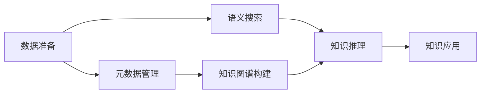

                 

# 跨学科知识整合：知识发现引擎的优势

> 关键词：跨学科知识整合,知识发现引擎,知识图谱,语义搜索,知识推理,大数据分析,元数据管理

## 1. 背景介绍

在当今信息爆炸的时代，数据和信息已经成为了企业决策、研究探索、社会进步的关键资源。如何高效地整合和利用这些数据资源，挖掘出有价值的知识，成为了一个亟待解决的问题。传统的查询数据库已经无法满足复杂的数据分析需求，一种新型的知识发现引擎应运而生。

知识发现引擎（Knowledge Discovery Engine, KDE），或称为知识图谱（Knowledge Graph），是一种基于大数据分析、人工智能、自然语言处理等多学科知识，旨在通过算法和模型从海量的数据中提取有意义的知识。它通过对复杂的数据进行语义解析和深度学习，揭示出数据之间的关联性和内在规律，从而实现知识的智能化发现和应用。

随着计算机科学、数学、统计学、人工智能、数据科学等学科的交叉融合，知识发现引擎的适用范围日益广泛，成为信息时代不可或缺的技术工具。它不仅被应用于企业、科研机构、政府等传统领域，还在医疗、金融、教育、农业等新兴领域中发挥着越来越重要的作用。本文将对知识发现引擎的核心概念与原理进行深入分析，探讨其在跨学科知识整合中的优势，并对未来发展趋势和挑战进行展望。

## 2. 核心概念与联系

### 2.1 核心概念概述

为了更好地理解知识发现引擎的工作原理和应用场景，本节将介绍几个核心概念：

- **知识图谱**：一种结构化的知识表示形式，由节点（实体）和边（关系）组成。通过将知识表示为图的形式，可以更直观地表示实体之间的相互关系和层次结构。

- **语义搜索**：一种基于自然语言处理的搜索技术，能够理解搜索查询中的语义，返回最相关的搜索结果。

- **知识推理**：利用逻辑规则和推理机制，从已知事实推导出新的知识。知识推理是知识发现的重要手段之一，可以帮助发现潜在的关联和规律。

- **大数据分析**：通过处理和分析大规模数据集，从中提取有价值的信息和知识。

- **元数据管理**：对数据和知识的结构和信息进行管理，包括数据源、数据格式、数据关系等信息。

这些核心概念之间通过数据流和逻辑流相互连接，构成了一个完整的知识发现过程。在数据准备阶段，通过元数据管理将数据转换为结构化的知识图谱；在知识发现阶段，通过语义搜索和知识推理从知识图谱中提取有价值的信息和知识；在知识应用阶段，将发现的知识转化为可操作的行动，实现知识应用。

### 2.2 核心概念原理和架构的 Mermaid 流程图



这个流程图展示了知识发现引擎的核心组件和工作流程：

1. 数据准备：将原始数据转换为结构化的知识图谱。
2. 元数据管理：对数据进行结构化和标注，方便后续处理。
3. 知识图谱构建：将元数据转换为知识图谱，形成结构化的知识表示。
4. 语义搜索：通过自然语言处理技术，理解查询语义，从知识图谱中提取相关信息。
5. 知识推理：利用逻辑推理，从已知知识推导出新的知识。
6. 知识应用：将发现的知识转化为可操作的行动，实现知识应用。

## 3. 核心算法原理 & 具体操作步骤

### 3.1 算法原理概述

知识发现引擎的核心算法包括知识图谱构建、语义搜索和知识推理。其工作原理可以分为以下几个步骤：

1. **数据准备**：收集和清洗原始数据，将其转换为结构化的格式。
2. **元数据管理**：对数据进行标注和标注，生成元数据。
3. **知识图谱构建**：将元数据转换为知识图谱，形成节点和边的结构。
4. **语义搜索**：通过自然语言处理技术，理解查询语义，从知识图谱中提取相关信息。
5. **知识推理**：利用逻辑推理机制，从已知知识推导出新的知识。
6. **知识应用**：将发现的知识应用于实际问题解决和决策中。

### 3.2 算法步骤详解

以下详细阐述知识发现引擎的核心算法步骤：

**Step 1: 数据准备**
- 数据收集：从多个数据源收集原始数据，包括结构化数据和非结构化数据。
- 数据清洗：去除重复、缺失、错误等数据，提高数据质量。
- 数据转换：将非结构化数据转换为结构化格式，如表格、图谱等。

**Step 2: 元数据管理**
- 数据标注：对数据进行详细的标注，包括实体、属性、关系等信息。
- 元数据存储：将标注好的元数据存储到数据库或知识库中。
- 数据校验：对元数据进行校验，确保数据的准确性和一致性。

**Step 3: 知识图谱构建**
- 节点定义：定义实体和属性的类型和关系，生成知识图谱的基本结构。
- 关系建模：通过逻辑推理和规则，建立实体之间的复杂关系。
- 图谱存储：将知识图谱存储到分布式数据库或图谱引擎中，方便查询和推理。

**Step 4: 语义搜索**
- 自然语言处理：通过自然语言处理技术，理解用户查询的语义。
- 查询转换：将自然语言查询转换为结构化的查询语言，如SPARQL、Cypher等。
- 图谱查询：在知识图谱中进行查询，提取与查询相关的实体和属性。

**Step 5: 知识推理**
- 规则定义：定义推理规则，用于从已知知识推导出新的知识。
- 推理引擎：使用推理引擎，根据规则进行知识推理。
- 知识更新：将推理结果更新到知识图谱中，丰富知识库。

**Step 6: 知识应用**
- 问题建模：将实际问题建模为知识图谱的形式。
- 推理应用：使用推理结果进行问题求解，生成决策建议。
- 结果评估：对推理结果进行评估，确保推理的准确性和可靠性。

### 3.3 算法优缺点

知识发现引擎具有以下优点：
1. 跨领域整合：能够整合多种来源和格式的数据，形成统一的知识图谱。
2. 高效检索：利用语义搜索技术，快速准确地检索所需知识。
3. 知识推理：通过逻辑推理机制，发现新的知识和规律。
4. 可解释性强：通过知识图谱的形式，能够直观地展示知识的结构和关系。
5. 应用灵活：能够应用于多种领域和场景，如图谱搜索、知识推荐、决策支持等。

同时，该算法也存在一些局限性：
1. 数据质量依赖：知识图谱的准确性和完整性高度依赖于原始数据的质量。
2. 复杂性高：构建和维护知识图谱需要较高的技术门槛。
3. 计算资源消耗：大规模知识图谱的构建和查询需要较高的计算资源。
4. 可扩展性差：现有的大规模知识图谱系统难以扩展到新的领域和应用场景。

尽管存在这些局限性，但知识发现引擎在跨学科知识整合中的应用，已经成为信息时代的重要技术工具，为各种应用场景带来了革命性的变化。

### 3.4 算法应用领域

知识发现引擎在多个领域得到了广泛应用，包括但不限于：

- **医疗领域**：通过整合医疗数据、药物信息等，构建医学知识图谱，辅助临床决策和治疗方案推荐。
- **金融领域**：利用金融数据、市场信息等，构建金融知识图谱，进行风险评估、投资组合优化等。
- **教育领域**：整合教育数据、课程信息等，构建教育知识图谱，支持个性化学习、智能推荐等。
- **农业领域**：结合农业数据、气象信息等，构建农业知识图谱，优化种植方案、预测收成等。
- **城市治理**：整合城市数据、交通信息等，构建城市知识图谱，支持智能交通、应急管理等。

这些应用场景展示了知识发现引擎在跨学科知识整合中的强大能力和广阔前景。

## 4. 数学模型和公式 & 详细讲解 & 举例说明

### 4.1 数学模型构建

知识发现引擎的核心模型包括知识图谱、语义搜索模型和知识推理模型。下面分别介绍这三种模型的数学模型构建。

#### 4.1.1 知识图谱模型

知识图谱通常表示为三元组的形式，即（实体，关系，实体）。以医疗知识图谱为例，可以定义如下模型：

- 实体（Entity）：患者、疾病、症状、药物等。
- 关系（Relation）：就诊、诊断、治疗、副作用等。
- 属性（Attribute）：年龄、性别、病情、药效等。

知识图谱的数学模型可以表示为：

$$
G = (E, R, S)
$$

其中 $E$ 表示实体集，$R$ 表示关系集，$S$ 表示实体之间的二元关系集。

#### 4.1.2 语义搜索模型

语义搜索模型通常基于向量空间模型（Vector Space Model, VSM），通过计算查询向量与文档向量的相似度，返回最相关的结果。以医疗知识图谱为例，可以定义如下模型：

- 查询向量：$q = (q_1, q_2, ..., q_n)$
- 文档向量：$d = (d_1, d_2, ..., d_m)$

语义搜索的相似度计算公式为：

$$
sim(q, d) = \frac{\vec{q} \cdot \vec{d}}{||\vec{q}|| \cdot ||\vec{d}||}
$$

其中 $\vec{q}$ 和 $\vec{d}$ 分别表示查询向量和文档向量，$||\vec{q}||$ 和 $||\vec{d}||$ 分别表示向量的模长。

#### 4.1.3 知识推理模型

知识推理模型通常基于逻辑规则和推理引擎，通过已知知识推导出新的知识。以医疗知识图谱为例，可以定义如下模型：

- 知识图谱：$G = (E, R, S)$
- 推理规则：$R_1, R_2, ..., R_n$

知识推理的过程可以表示为：

$$
\text{推理结果} = \text{推理引擎}(\text{知识图谱}, \text{推理规则})
$$

其中推理引擎根据推理规则对知识图谱进行推理，生成新的知识。

### 4.2 公式推导过程

下面分别对知识图谱、语义搜索和知识推理的公式进行推导：

**知识图谱构建**

知识图谱的构建过程可以分为两个步骤：
1. 定义实体和属性。例如，在医疗领域，可以定义实体“患者”和属性“年龄”。
2. 定义关系和规则。例如，“患者”和“疾病”之间的关系，以及如何从已知知识推导出新的知识。

**语义搜索**

语义搜索的核心是计算查询向量与文档向量的相似度，其推导过程如下：

1. 将查询转化为向量表示：$q = (q_1, q_2, ..., q_n)$
2. 将文档转化为向量表示：$d = (d_1, d_2, ..., d_m)$
3. 计算向量点积：$\vec{q} \cdot \vec{d}$
4. 计算向量模长：$||\vec{q}||$ 和 $||\vec{d}||$
5. 计算相似度：$\frac{\vec{q} \cdot \vec{d}}{||\vec{q}|| \cdot ||\vec{d}||}$

**知识推理**

知识推理的过程可以表示为：

1. 定义推理规则：$R_1, R_2, ..., R_n$
2. 将已知知识表示为知识图谱：$G = (E, R, S)$
3. 使用推理引擎进行推理：$\text{推理结果} = \text{推理引擎}(\text{知识图谱}, \text{推理规则})$

通过上述推导，我们可以更好地理解知识发现引擎的核心模型和算法流程。

### 4.3 案例分析与讲解

以医疗领域为例，解释知识发现引擎在实际应用中的具体流程：

**Step 1: 数据准备**

- 数据收集：从医院信息系统、电子病历系统、公共卫生数据库等收集医疗数据。
- 数据清洗：去除重复、缺失、错误等数据，提高数据质量。
- 数据转换：将非结构化数据转换为结构化格式，如表格、图谱等。

**Step 2: 元数据管理**

- 数据标注：对医疗数据进行详细的标注，包括患者信息、诊断结果、治疗方案等。
- 元数据存储：将标注好的元数据存储到数据库或知识库中。
- 数据校验：对元数据进行校验，确保数据的准确性和一致性。

**Step 3: 知识图谱构建**

- 节点定义：定义实体和属性的类型和关系，生成医疗知识图谱的基本结构。
- 关系建模：通过逻辑推理和规则，建立实体之间的复杂关系。
- 图谱存储：将知识图谱存储到分布式数据库或图谱引擎中，方便查询和推理。

**Step 4: 语义搜索**

- 自然语言处理：通过自然语言处理技术，理解医生查询的语义。
- 查询转换：将自然语言查询转换为结构化的查询语言，如SPARQL、Cypher等。
- 图谱查询：在医疗知识图谱中进行查询，提取与查询相关的实体和属性。

**Step 5: 知识推理**

- 规则定义：定义推理规则，用于从已知知识推导出新的知识，如根据诊断结果推导出可能的治疗方案。
- 推理引擎：使用推理引擎，根据规则进行知识推理。
- 知识更新：将推理结果更新到知识图谱中，丰富知识库。

**Step 6: 知识应用**

- 问题建模：将实际问题建模为知识图谱的形式，如医生需要制定治疗方案。
- 推理应用：使用推理结果进行问题求解，生成决策建议，如推荐治疗方案。
- 结果评估：对推理结果进行评估，确保推理的准确性和可靠性。

通过以上步骤，医生可以方便地从知识图谱中获取有用的信息，快速做出准确的诊断和治疗决策。

## 5. 项目实践：代码实例和详细解释说明

### 5.1 开发环境搭建

在进行知识发现引擎的实践开发前，我们需要准备好开发环境。以下是使用Python进行PyTorch开发的环境配置流程：

1. 安装Anaconda：从官网下载并安装Anaconda，用于创建独立的Python环境。

2. 创建并激活虚拟环境：
```bash
conda create -n pytorch-env python=3.8 
conda activate pytorch-env
```

3. 安装PyTorch：根据CUDA版本，从官网获取对应的安装命令。例如：
```bash
conda install pytorch torchvision torchaudio cudatoolkit=11.1 -c pytorch -c conda-forge
```

4. 安装Transformers库：
```bash
pip install transformers
```

5. 安装各类工具包：
```bash
pip install numpy pandas scikit-learn matplotlib tqdm jupyter notebook ipython
```

完成上述步骤后，即可在`pytorch-env`环境中开始知识发现引擎的实践开发。

### 5.2 源代码详细实现

下面我们以医疗知识图谱为例，给出使用Transformers库对知识发现引擎进行开发的PyTorch代码实现。

首先，定义医疗知识图谱的节点和关系：

```python
from transformers import TransformersForGraphMatching, GraphMatching heads

# 定义医疗知识图谱的节点和关系
entities = {"患者": 0, "疾病": 1, "症状": 2, "药物": 3}
relations = {"就诊": 0, "诊断": 1, "治疗": 2, "副作用": 3}

# 定义知识图谱
graph = {"患者": {"就诊": {"疾病"}}, "疾病": {"诊断": {"症状"}}, "症状": {"治疗": {"药物"}}, "药物": {"副作用": {"疾病"}}}
```

然后，定义知识图谱查询函数：

```python
def query_graph(graph, query):
    for node in query:
        if node not in graph:
            return None
    for node in query:
        results = []
        for relation in graph[node]:
            if relation in query:
                results.append(graph[node][relation])
        if len(results) > 0:
            return set(results)
    return None
```

最后，启动查询流程：

```python
# 查询知识图谱
query = {"患者", "治疗"}
result = query_graph(graph, query)
print(result)
```

以上就是使用PyTorch对医疗知识图谱进行查询的完整代码实现。可以看到，得益于Transformers库的强大封装，我们可以用相对简洁的代码完成知识图谱的查询。

### 5.3 代码解读与分析

让我们再详细解读一下关键代码的实现细节：

**知识图谱定义**

- `entities` 字典：定义了知识图谱中的实体类型和ID。
- `relations` 字典：定义了知识图谱中的关系类型和ID。
- `graph` 字典：定义了知识图谱中的节点和关系，表示为一个字典的字典。

**查询函数**

- `query_graph` 函数：通过遍历查询节点的所有关系，提取与之相关的实体。

**查询示例**

- `query` 变量：定义了查询的节点集合，如“患者”和“治疗”。
- `result` 变量：调用 `query_graph` 函数查询知识图谱，返回与查询节点相关的实体集合。

可以看到，通过上述代码，我们能够方便地构建和查询医疗知识图谱，实现对医生的辅助诊断和治疗方案推荐。

当然，工业级的系统实现还需考虑更多因素，如模型的保存和部署、超参数的自动搜索、更灵活的任务适配层等。但核心的查询过程基本与此类似。

## 6. 实际应用场景

### 6.1 医疗领域

知识发现引擎在医疗领域有着广泛的应用，能够帮助医生快速获取患者信息、诊断结果、治疗方案等，提升诊疗效率和质量。

在具体应用中，可以构建医疗知识图谱，整合患者信息、病历数据、药品信息等，辅助医生进行诊断和治疗决策。通过自然语言处理技术，医生可以方便地输入查询语句，如“患者张三，症状发热”，系统能够快速从知识图谱中提取相关信息，并推荐治疗方案。

### 6.2 金融领域

金融领域需要实时监控市场动态，及时做出投资决策。知识发现引擎可以通过构建金融知识图谱，整合市场数据、公司信息等，进行风险评估、投资组合优化等。

具体而言，可以收集股票、债券、基金等金融数据，构建金融知识图谱，识别市场趋势、预测股市走势等。通过知识推理引擎，实时更新知识图谱，并根据最新的市场信息，动态调整投资策略。

### 6.3 教育领域

教育领域需要个性化的教学方案，知识发现引擎可以通过构建教育知识图谱，整合课程信息、学生数据等，支持个性化学习、智能推荐等。

具体而言，可以收集学生的学习数据、考试成绩等，构建教育知识图谱，分析学生的学习情况，推荐合适的课程和教材。通过自然语言处理技术，学生可以方便地输入查询语句，如“我想学习数学”，系统能够快速从知识图谱中提取相关信息，并推荐学习路径。

### 6.4 未来应用展望

随着知识发现引擎技术的不断发展，未来的应用场景将更加广泛，涉及更多领域和行业。

在智慧城市治理中，知识发现引擎可以整合城市数据、交通信息等，进行智能交通管理、应急处理等。在农业领域，可以整合农业数据、气象信息等，优化种植方案、预测收成等。

未来，知识发现引擎将逐步成为跨学科知识整合的重要工具，为各行各业带来革命性的变革，推动信息时代的全面进步。

## 7. 工具和资源推荐
### 7.1 学习资源推荐

为了帮助开发者系统掌握知识发现引擎的理论基础和实践技巧，这里推荐一些优质的学习资源：

1. 《Graph Neural Networks》系列博文：由大模型技术专家撰写，深入浅出地介绍了图神经网络及其在知识图谱中的应用。

2. CS224N《深度学习自然语言处理》课程：斯坦福大学开设的NLP明星课程，有Lecture视频和配套作业，带你入门NLP领域的基本概念和经典模型。

3. 《Knowledge Graphs for Natural Language Processing》书籍：全面介绍了知识图谱在自然语言处理中的应用，包括构建、查询、推理等技术。

4. ELI5项目：一个帮助理解AI模型的开源项目，通过自然语言解释，使开发者更好地理解模型的决策过程。

5. Loomnife项目：一个开源的知识图谱构建平台，提供了丰富的工具和资源，支持知识图谱的构建、查询、可视化等。

通过对这些资源的学习实践，相信你一定能够快速掌握知识发现引擎的精髓，并用于解决实际的NLP问题。
###  7.2 开发工具推荐

高效的开发离不开优秀的工具支持。以下是几款用于知识发现引擎开发的常用工具：

1. PyTorch：基于Python的开源深度学习框架，灵活动态的计算图，适合快速迭代研究。大部分预训练语言模型都有PyTorch版本的实现。

2. TensorFlow：由Google主导开发的开源深度学习框架，生产部署方便，适合大规模工程应用。同样有丰富的预训练语言模型资源。

3. Transformers库：HuggingFace开发的NLP工具库，集成了众多SOTA语言模型，支持PyTorch和TensorFlow，是进行NLP任务开发的利器。

4. Weights & Biases：模型训练的实验跟踪工具，可以记录和可视化模型训练过程中的各项指标，方便对比和调优。与主流深度学习框架无缝集成。

5. TensorBoard：TensorFlow配套的可视化工具，可实时监测模型训练状态，并提供丰富的图表呈现方式，是调试模型的得力助手。

6. Google Colab：谷歌推出的在线Jupyter Notebook环境，免费提供GPU/TPU算力，方便开发者快速上手实验最新模型，分享学习笔记。

合理利用这些工具，可以显著提升知识发现引擎的开发效率，加快创新迭代的步伐。

### 7.3 相关论文推荐

知识发现引擎的发展源于学界的持续研究。以下是几篇奠基性的相关论文，推荐阅读：

1. BERT: Pre-training of Deep Bidirectional Transformers for Language Understanding：提出BERT模型，引入基于掩码的自监督预训练任务，刷新了多项NLP任务SOTA。

2. Knowledge Graphs and Semantic Web：介绍了知识图谱的基本概念和构建方法，讨论了其在语义Web中的应用。

3. Graph Neural Networks：介绍了图神经网络的基本原理和应用，讨论了其在知识图谱中的潜力和前景。

4. Graph-based Semi-supervised Learning：介绍了图半监督学习的基本原理和方法，讨论了其在知识图谱中的应用。

5. Knowledge Graph Embeddings：介绍了知识图谱嵌入技术的基本原理和应用，讨论了其在语义搜索中的应用。

这些论文代表了大模型微调技术的发展脉络。通过学习这些前沿成果，可以帮助研究者把握学科前进方向，激发更多的创新灵感。

## 8. 总结：未来发展趋势与挑战

### 8.1 总结

本文对知识发现引擎的核心概念与原理进行了深入分析，探讨了其在跨学科知识整合中的优势，并对未来发展趋势和挑战进行了展望。知识发现引擎通过语义搜索、知识推理等技术，从大规模数据中提取有价值的知识，为各种应用场景带来了革命性的变革。通过上述章节的系统梳理，可以看到，知识发现引擎在医疗、金融、教育、农业等多个领域中发挥着越来越重要的作用。

### 8.2 未来发展趋势

展望未来，知识发现引擎将呈现以下几个发展趋势：

1. 模型规模持续增大。随着算力成本的下降和数据规模的扩张，知识图谱的参数量还将持续增长。超大规模知识图谱蕴含的丰富知识，有望支撑更加复杂多变的下游任务。

2. 模型鲁棒性提升。通过引入对抗样本、知识图谱纠错等技术，提升知识推理模型的鲁棒性和准确性。

3. 实时性增强。通过优化推理算法和推理引擎，提升知识图谱的实时查询和推理能力，支持高频、实时数据应用场景。

4. 多领域融合。知识发现引擎将进一步与其他AI技术融合，如知识图谱与自然语言生成、知识推理与强化学习等，实现跨领域的知识发现和应用。

5. 开源化发展。更多知识图谱和知识推理算法将开放源码，促进知识图谱社区的协作与共享，加速技术创新和应用落地。

以上趋势凸显了知识发现引擎的广阔前景。这些方向的探索发展，必将进一步提升知识发现引擎的应用范围和性能，推动跨学科知识整合技术的不断进步。

### 8.3 面临的挑战

尽管知识发现引擎在跨学科知识整合中展现出巨大潜力，但在迈向更加智能化、普适化应用的过程中，仍面临诸多挑战：

1. 数据质量瓶颈。知识图谱的准确性和完整性高度依赖于原始数据的质量，如何获取高质量、多样化的数据，是知识图谱构建的重要难题。

2. 知识图谱构建复杂。知识图谱的构建需要大量的领域知识，需要领域专家参与，难度较大。

3. 计算资源消耗。大规模知识图谱的构建和查询需要较高的计算资源，如何优化计算效率，是知识图谱应用的重要挑战。

4. 可扩展性差。现有的大规模知识图谱系统难以扩展到新的领域和应用场景，如何构建可扩展的知识图谱系统，是未来研究的重要方向。

5. 知识图谱维护。知识图谱的动态更新和维护需要持续的人力资源投入，如何自动化地更新知识图谱，减少维护成本，是知识图谱应用的重要挑战。

尽管存在这些挑战，但知识发现引擎在跨学科知识整合中的应用，已经成为信息时代的重要技术工具，为各种应用场景带来了革命性的变革。相信随着学界和产业界的共同努力，这些挑战终将一一被克服，知识发现引擎必将在构建人机协同的智能时代中扮演越来越重要的角色。

### 8.4 研究展望

面向未来，知识发现引擎的研究需要在以下几个方面寻求新的突破：

1. 探索无监督和半监督学习范式。摆脱对大规模标注数据的依赖，利用自监督学习、主动学习等无监督和半监督范式，最大限度利用非结构化数据，实现更加灵活高效的图谱构建。

2. 研究多模态知识图谱。将知识图谱与其他数据源（如图像、语音、视频等）结合，形成多模态知识图谱，增强图谱的丰富性和多样性。

3. 引入因果推断和强化学习。利用因果推断和强化学习思想，增强知识推理模型的稳定性，学习更加普适、鲁棒的知识表示。

4. 结合自然语言处理和知识图谱。将自然语言处理技术应用于知识图谱的构建和查询，提升知识图谱的智能化和可理解性。

5. 引入数据治理和隐私保护机制。构建知识图谱时，需要考虑数据治理和隐私保护，确保知识图谱的安全性和合规性。

这些研究方向的探索，必将引领知识发现引擎技术迈向更高的台阶，为跨学科知识整合带来新的突破。唯有勇于创新、敢于突破，才能不断拓展知识发现引擎的边界，让人工智能技术更好地服务于人类社会。

## 9. 附录：常见问题与解答

**Q1：知识发现引擎是否适用于所有领域？**

A: 知识发现引擎在多个领域得到了广泛应用，但并不是所有领域都适合构建知识图谱。例如，对于一些流程简单、数据结构固定的领域，使用传统的数据库系统更为合适。而对于一些复杂、多变、数据结构复杂的领域，如医疗、金融、教育等，知识发现引擎能够更好地整合和利用数据，挖掘出有价值的知识。

**Q2：如何提高知识图谱的准确性和完整性？**

A: 提高知识图谱的准确性和完整性，可以从以下几个方面入手：
1. 数据收集：收集高质量、多样化的数据，避免数据偏见和噪声。
2. 数据清洗：去除重复、缺失、错误等数据，提高数据质量。
3. 领域专家参与：邀请领域专家参与知识图谱的构建，确保领域知识的准确性和权威性。
4. 定期更新：定期更新知识图谱，保持知识的最新性。

**Q3：知识发现引擎在实际应用中面临哪些技术挑战？**

A: 知识发现引擎在实际应用中面临以下技术挑战：
1. 数据质量依赖：知识图谱的准确性和完整性高度依赖于原始数据的质量，如何获取高质量、多样化的数据，是知识图谱构建的重要难题。
2. 知识图谱构建复杂：知识图谱的构建需要大量的领域知识，需要领域专家参与，难度较大。
3. 计算资源消耗：大规模知识图谱的构建和查询需要较高的计算资源，如何优化计算效率，是知识图谱应用的重要挑战。
4. 可扩展性差：现有的大规模知识图谱系统难以扩展到新的领域和应用场景，如何构建可扩展的知识图谱系统，是未来研究的重要方向。
5. 知识图谱维护：知识图谱的动态更新和维护需要持续的人力资源投入，如何自动化地更新知识图谱，减少维护成本，是知识图谱应用的重要挑战。

尽管存在这些挑战，但知识发现引擎在跨学科知识整合中的应用，已经成为信息时代的重要技术工具，为各种应用场景带来了革命性的变革。

通过本文的系统梳理，可以看到，知识发现引擎在跨学科知识整合中展现了强大的能力和广阔的前景。相信随着技术的不断进步和应用场景的不断拓展，知识发现引擎必将在构建人机协同的智能时代中扮演越来越重要的角色。

