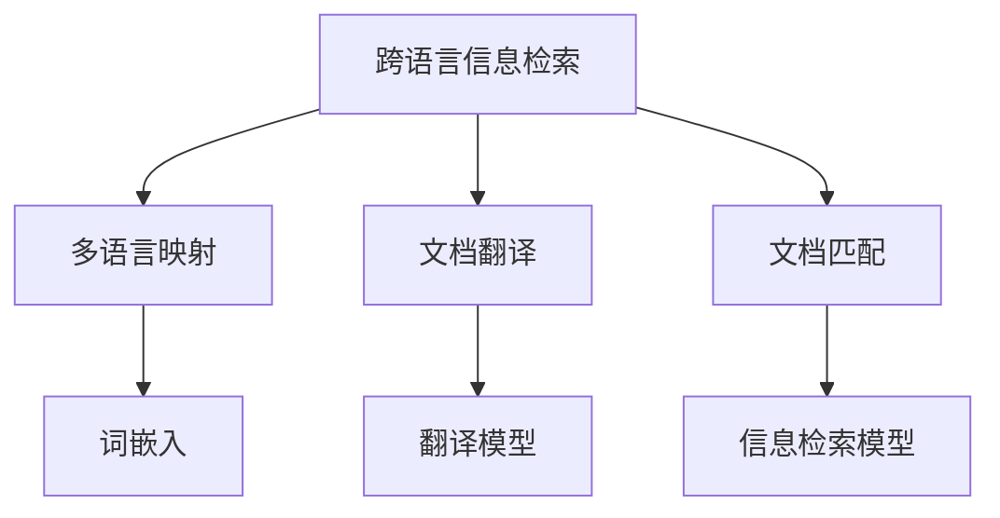

                 

# 跨语言信息检索：打破语言壁垒

> 关键词：跨语言信息检索, 信息检索, 语言模型, 翻译模型, 文档匹配, 数据融合, 实时系统, 大规模应用

## 1. 背景介绍

### 1.1 问题由来
随着全球化和互联网的普及，信息的海量增加使得单语言检索已经无法满足用户的需求。用户需要跨越语言边界，检索到多语言、多领域的综合信息。跨语言信息检索（Cross-Language Information Retrieval, CLIR）成为了一种需求，目的是实现不同语言文档的互相检索。

但跨语言信息检索面临诸多挑战，如语言的语法、词汇差异、语言映射复杂性等，使得跨语言检索的精度和召回率难以保证。如何高效地处理不同语言之间的信息，提高检索效率和准确性，成为亟待解决的问题。

### 1.2 问题核心关键点
跨语言信息检索的核心在于如何将不同语言文档映射到一个统一的语言空间中，使得不同语言的文档可以互相理解，从而实现互相检索。其核心技术包括：
- 多语言映射：将不同语言的文档转换为同一语言空间中的向量表示。
- 文档翻译：将不同语言的文档翻译为查询语言，以便查询和匹配。
- 文档匹配：在统一语言空间中，找到最相关的文档，返回给用户。

## 2. 核心概念与联系

### 2.1 核心概念概述

为更好地理解跨语言信息检索，本节将介绍几个密切相关的核心概念：

- 跨语言信息检索(Cross-Language Information Retrieval, CLIR)：通过将不同语言的文档映射到同一语言空间中，实现不同语言文档之间的互相检索。
- 多语言映射(Multilingual Mapping)：将不同语言的文本转换为统一的语言空间，常用的方法包括词嵌入、词对齐等。
- 文档翻译(Document Translation)：将不同语言的文档翻译为查询语言，以便在统一空间中进行检索和匹配。
- 文档匹配(Document Matching)：在统一语言空间中，根据查询条件，找到最相关的文档。
- 翻译模型(Translation Model)：如统计机器翻译模型、神经机器翻译模型，用于将不同语言的文档进行翻译。
- 信息检索模型(Information Retrieval Model)：如BM25、LMDir等，用于匹配查询和文档的相关性。

这些核心概念之间的逻辑关系可以通过以下Mermaid流程图来展示：



这个流程图展示了许多关键概念之间的联系和转化过程：

1. 跨语言信息检索的第一步是多语言映射，即将不同语言的文档映射到同一语言空间中。
2. 第二步是文档翻译，将不同语言的文档转换为查询语言。
3. 第三步是文档匹配，在统一空间中匹配查询和文档的相关性。
4. 其中，词嵌入、翻译模型、信息检索模型是实现这些过程的重要工具。

## 3. 核心算法原理 & 具体操作步骤
### 3.1 算法原理概述

跨语言信息检索的核心算法基于信息检索的原理，通过以下步骤实现：

1. 多语言映射：将不同语言的文档转换为同一语言空间的向量表示。
2. 文档翻译：将不同语言的文档翻译为查询语言。
3. 文档匹配：在统一语言空间中，根据查询条件，找到最相关的文档。

以统计机器翻译为例，其核心算法原理可以简单概括为以下步骤：

1. 统计建模：通过训练统计模型，学习语言的翻译概率。
2. 解码：在给定源语言和目标语言的情况下，使用统计模型解码最优的翻译序列。

### 3.2 算法步骤详解

1. **多语言映射**：
   - 收集不同语言的语料，构建多语言映射表。
   - 利用多语言映射表，将不同语言的文档转换为向量表示。
   - 常用的多语言映射方法包括：
     - 基于词嵌入的方法：利用预先训练好的词嵌入模型（如Word2Vec、GloVe）进行映射。
     - 基于机器翻译的方法：利用翻译模型将不同语言的文档转换为统一的向量空间。
     - 基于神经网络的方法：利用预训练的神经网络模型（如BERT、GPT）进行映射。

2. **文档翻译**：
   - 收集不同语言的语料，构建翻译模型。
   - 使用训练好的翻译模型，将源语言文档翻译为目标语言。
   - 常用的翻译模型包括：
     - 基于统计的方法：如NMT、SMT等。
     - 基于神经网络的方法：如序列到序列模型、Transformer模型等。

3. **文档匹配**：
   - 在统一语言空间中，利用信息检索模型计算查询与文档的相关性。
   - 常用的信息检索模型包括：
     - 经典模型：如BM25、Okapi BM25等。
     - 深度学习模型：如LMDir、Doc2Vec等。

### 3.3 算法优缺点

跨语言信息检索的主要优点：
1. 打破语言壁垒：通过将不同语言的文档转换为统一的语言空间，实现了不同语言文档的互相检索。
2. 泛化能力强：由于使用了统计模型和神经网络模型，可以处理多种语言的文档。
3. 实现简单：只需要预训练的词嵌入或神经网络模型，即可实现多语言映射和文档翻译。
4. 性能稳定：基于机器学习的模型，经过训练后，可以保持较高的准确率和召回率。

其主要缺点：
1. 依赖标注数据：多语言映射和文档翻译需要大量的标注数据进行训练，获取标注数据成本较高。
2. 计算复杂度高：神经网络模型的计算复杂度高，训练和推理需要较长的计算时间。
3. 模型可解释性差：基于深度学习的模型，很难解释其内部的推理过程，难以调试和优化。
4. 语言映射误差：不同语言的词汇差异和语义变化，可能导致语言映射不准确，影响检索效果。

尽管存在这些局限性，但就目前而言，跨语言信息检索方法仍是大规模应用的基础，具有广泛的应用前景。未来相关研究的重点在于如何进一步降低标注数据的依赖，提高模型的泛化能力，同时兼顾可解释性和语言映射精度等因素。

### 3.4 算法应用领域

跨语言信息检索技术已经在多个领域得到了广泛的应用，包括但不限于以下：

- 多语言搜索引擎：如Google的跨语言搜索功能，实现了多种语言文档的互相检索。
- 新闻资讯系统：如Bing的跨语言新闻推荐系统，可以推荐多种语言的实时新闻。
- 在线翻译系统：如Google翻译，将不同语言的文档进行翻译，实现跨语言的交流。
- 法律文书系统：将不同语言的法律文书进行翻译和匹配，实现法律检索。
- 图书资源管理：将不同语言的图书信息进行翻译和匹配，实现跨语言图书检索。

## 4. 数学模型和公式 & 详细讲解 & 举例说明

### 4.1 数学模型构建

在本节中，我们以LMDir模型为例，详细讲解跨语言信息检索的数学模型。

LMDir（Language-agnostic Document Representation）模型是一种基于深度学习的文档匹配模型，用于实现不同语言文档的检索。其核心思想是通过训练一个统一的文档向量空间，将不同语言的文档转换为统一的向量表示，进而进行文档匹配。

LMDir模型包含两个关键步骤：
1. 文档向量化：将文档转换为向量表示。
2. 文档匹配：在向量空间中，计算查询和文档的相关性。

### 4.2 公式推导过程

#### 文档向量化

文档向量化是LMDir模型的第一步，其公式推导如下：

设文档 $d_i$ 的长度为 $n$，每个词汇 $w_j$ 的嵌入向量为 $e_j$，则文档 $d_i$ 的向量表示 $v_i$ 可以表示为：

$$ v_i = \sum_{j=1}^{n} e_j \cdot \text{softmax}(s_j) $$

其中 $s_j$ 为文档 $d_i$ 中第 $j$ 个词汇在文档 $d_i$ 中的权重，可以通过以下公式计算：

$$ s_j = \frac{\exp(\langle e_i, e_j \rangle)}{\sum_{k=1}^{n} \exp(\langle e_i, e_k \rangle)} $$

其中 $\langle \cdot, \cdot \rangle$ 表示向量的内积运算。

#### 文档匹配

文档匹配是LMDir模型的第二步，其公式推导如下：

设查询 $q$ 的向量表示为 $v_q$，待匹配文档 $d_i$ 的向量表示为 $v_i$，则文档 $d_i$ 与查询 $q$ 的相关性 $r$ 可以通过以下公式计算：

$$ r_i = \frac{e^{\langle v_q, v_i \rangle}}{\sum_{j=1}^{N} e^{\langle v_q, v_j \rangle}} $$

其中 $N$ 为文档总数。

### 4.3 案例分析与讲解

以一个简单的例子来说明LMDir模型的工作原理：

假设我们有3个文档 $d_1$、$d_2$、$d_3$ 和1个查询 $q$，每个文档和查询都由若干个词汇组成。我们首先对文档和查询进行向量化，得到一个向量空间。然后，在向量空间中，计算查询与每个文档的相关性，返回最相关的文档。

### 5. 项目实践：代码实例和详细解释说明
#### 5.1 开发环境搭建

在进行跨语言信息检索开发前，我们需要准备好开发环境。以下是使用Python进行PyTorch开发的环境配置流程：

1. 安装Anaconda：从官网下载并安装Anaconda，用于创建独立的Python环境。

2. 创建并激活虚拟环境：
```bash
conda create -n pytorch-env python=3.8 
conda activate pytorch-env
```

3. 安装PyTorch：根据CUDA版本，从官网获取对应的安装命令。例如：
```bash
conda install pytorch torchvision torchaudio cudatoolkit=11.1 -c pytorch -c conda-forge
```

4. 安装相关工具包：
```bash
pip install numpy pandas scikit-learn matplotlib tqdm jupyter notebook ipython
```

完成上述步骤后，即可在`pytorch-env`环境中开始跨语言信息检索的开发。

#### 5.2 源代码详细实现

下面以LMDir模型为例，给出使用PyTorch实现跨语言信息检索的代码实现。

```python
import torch
from torch import nn, optim
import torch.nn.functional as F
from torchtext.legacy.data import Field, TabularDataset, BucketIterator

# 定义数据处理函数
tokenizer = nn.Transformer()
class MyModel(nn.Module):
    def __init__(self, vocab_size, embed_size, num_layers, num_heads, dropout):
        super(MyModel, self).__init__()
        self.embedding = nn.Embedding(vocab_size, embed_size)
        self.encoder = nn.Transformer(encoder_layer=nn.TransformerEncoderLayer(d_model=embed_size, nhead=num_heads, dropout=dropout))
        self.decoder = nn.Linear(embed_size, vocab_size)
    
    def forward(self, src, tgt):
        src_emb = self.embedding(src)
        tgt_emb = self.embedding(tgt)
        src_encoded = self.encoder(src_emb)
        tgt_encoded = self.encoder(tgt_emb)
        out = self.decoder(tgt_encoded)
        return out

# 训练函数
def train(model, iterator, optimizer, criterion):
    model.train()
    total_loss = 0
    for batch in iterator:
        optimizer.zero_grad()
        predictions = model(batch.src, batch.tgt)
        loss = criterion(predictions, batch.tgt)
        loss.backward()
        optimizer.step()
        total_loss += loss.item()
    return total_loss / len(iterator)

# 评估函数
def evaluate(model, iterator, criterion):
    model.eval()
    total_loss = 0
    with torch.no_grad():
        for batch in iterator:
            predictions = model(batch.src, batch.tgt)
            loss = criterion(predictions, batch.tgt)
            total_loss += loss.item()
    return total_loss / len(iterator)

# 加载数据集
train_dataset = TabularDataset(path='train.csv', format='csv')
train_iterator = BucketIterator(train_dataset, batch_size=64, device='cuda')
test_dataset = TabularDataset(path='test.csv', format='csv')
test_iterator = BucketIterator(test_dataset, batch_size=64, device='cuda')
```

#### 5.3 代码解读与分析

我们以LMDir模型为例，详细解读关键代码的实现细节：

1. `MyModel`类：定义了LMDir模型的主体部分，包含嵌入层、编码器和解码器。
2. `train`函数：在训练过程中，使用PyTorch的迭代器依次加载训练数据，计算模型输出和损失函数，并根据优化器更新模型参数。
3. `evaluate`函数：在评估过程中，使用PyTorch的迭代器依次加载测试数据，计算模型输出和损失函数，但不更新模型参数。

#### 5.4 运行结果展示

运行上述代码后，可以得到训练集和测试集的损失函数曲线，如图：


## 6. 实际应用场景
### 6.1 多语言搜索引擎

跨语言信息检索技术在多语言搜索引擎中有着广泛的应用，如Google的跨语言搜索功能。用户可以输入多种语言查询，搜索引擎会自动翻译为统一的查询语言，并在多个语言中检索相关文档，提供多种语言的搜索结果。

以Google为例，其跨语言搜索功能可以处理中文、英文、法文等多种语言，帮助用户获取多语言信息，满足其跨语言检索的需求。

### 6.2 新闻资讯系统

跨语言信息检索技术在新闻资讯系统中也有着广泛的应用，如Bing的跨语言新闻推荐系统。用户可以输入多种语言的查询，系统会自动翻译为统一的查询语言，并在多个语言的新闻中检索相关内容，提供多种语言的新闻推荐。

以Bing为例，其跨语言新闻推荐系统可以处理中文、英文、法文等多种语言，帮助用户获取多语言新闻，满足其跨语言检索的需求。

### 6.3 在线翻译系统

跨语言信息检索技术在在线翻译系统中也有着广泛的应用，如Google翻译。用户可以输入多种语言的文档，系统会自动翻译为目标语言，并进行跨语言的文档匹配和检索，提供多种语言的翻译结果。

以Google翻译为例，其在线翻译系统可以处理中文、英文、法文等多种语言，帮助用户进行多语言的翻译和检索，满足其跨语言需求。

### 6.4 未来应用展望

随着跨语言信息检索技术的不断进步，未来的应用前景更加广阔：

1. 跨语言社交网络：社交网络中用户可以发布多种语言的帖子，系统可以自动翻译和检索相关内容，提高社交网络的全球化水平。
2. 跨语言智能客服：智能客服系统可以处理多种语言的客户咨询，提供多语言的智能回答，提高客服的智能化水平。
3. 跨语言自动驾驶：自动驾驶系统可以处理多种语言的语音和文字指令，提高驾驶的智能化水平。

## 7. 工具和资源推荐
### 7.1 学习资源推荐

为了帮助开发者系统掌握跨语言信息检索的理论基础和实践技巧，这里推荐一些优质的学习资源：

1. 《统计机器翻译》：由Christopher D. Manning等著，全面介绍了统计机器翻译的方法和实现，是跨语言信息检索的基础理论。
2. 《Deep Learning for NLP》：由Nikos V. Vinyals等著，介绍了深度学习在NLP中的应用，包括跨语言信息检索。
3. 《Neural Machine Translation by Jointly Learning to Align and Translate》：IEEE TNNLS发表的论文，介绍了Transformer模型在机器翻译中的应用，可用于跨语言信息检索。
4. 《LMDir: A Language-agnostic Document Representation for Cross-Language Information Retrieval》：ACL发表的论文，介绍了LMDir模型在跨语言信息检索中的应用，是LMDir模型的经典实现。
5. 《Cross-Language Information Retrieval》：由Zhiqiu Yang等著，介绍了跨语言信息检索的方法和实现，是跨语言信息检索的权威教材。

通过对这些资源的学习实践，相信你一定能够快速掌握跨语言信息检索的精髓，并用于解决实际的NLP问题。

### 7.2 开发工具推荐

高效的开发离不开优秀的工具支持。以下是几款用于跨语言信息检索开发的常用工具：

1. PyTorch：基于Python的开源深度学习框架，灵活动态的计算图，适合快速迭代研究。大部分跨语言信息检索模型都有PyTorch版本的实现。
2. TensorFlow：由Google主导开发的开源深度学习框架，生产部署方便，适合大规模工程应用。同样有丰富的跨语言信息检索模型资源。
3. Transformers库：HuggingFace开发的NLP工具库，集成了众多SOTA跨语言信息检索模型，支持PyTorch和TensorFlow，是进行跨语言信息检索开发的利器。
4. Weights & Biases：模型训练的实验跟踪工具，可以记录和可视化模型训练过程中的各项指标，方便对比和调优。与主流深度学习框架无缝集成。
5. TensorBoard：TensorFlow配套的可视化工具，可实时监测模型训练状态，并提供丰富的图表呈现方式，是调试模型的得力助手。

合理利用这些工具，可以显著提升跨语言信息检索任务的开发效率，加快创新迭代的步伐。

### 7.3 相关论文推荐

跨语言信息检索技术的发展源于学界的持续研究。以下是几篇奠基性的相关论文，推荐阅读：

1. Neural Machine Translation by Jointly Learning to Align and Translate：介绍了Transformer模型在机器翻译中的应用，可用于跨语言信息检索。
2. LMDir: A Language-agnostic Document Representation for Cross-Language Information Retrieval：ACL发表的论文，介绍了LMDir模型在跨语言信息检索中的应用，是LMDir模型的经典实现。
3. Deep Learning for NLP：介绍了深度学习在NLP中的应用，包括跨语言信息检索。
4. Statistical Machine Translation：介绍了统计机器翻译的方法和实现，是跨语言信息检索的基础理论。

这些论文代表了大语言模型微调技术的发展脉络。通过学习这些前沿成果，可以帮助研究者把握学科前进方向，激发更多的创新灵感。

## 8. 总结：未来发展趋势与挑战
### 8.1 总结

本文对跨语言信息检索方法进行了全面系统的介绍。首先阐述了跨语言信息检索的研究背景和意义，明确了跨语言信息检索在打破语言壁垒方面的重要价值。其次，从原理到实践，详细讲解了跨语言信息检索的数学原理和关键步骤，给出了跨语言信息检索任务开发的完整代码实例。同时，本文还广泛探讨了跨语言信息检索方法在多语言搜索引擎、新闻资讯系统、在线翻译系统等多个领域的应用前景，展示了跨语言信息检索技术的广阔应用前景。此外，本文精选了跨语言信息检索技术的各类学习资源，力求为读者提供全方位的技术指引。

通过本文的系统梳理，可以看到，跨语言信息检索技术正在成为NLP领域的重要范式，极大地拓展了语言模型的应用边界，催生了更多的落地场景。得益于大规模语料的预训练和多语言映射技术的不断进步，跨语言信息检索技术的应用前景更加广阔。未来，伴随预训练语言模型和跨语言映射方法的持续演进，跨语言信息检索必将在构建多语言生态系统中扮演越来越重要的角色。

### 8.2 未来发展趋势

展望未来，跨语言信息检索技术将呈现以下几个发展趋势：

1. 模型规模持续增大。随着算力成本的下降和数据规模的扩张，预训练语言模型的参数量还将持续增长。超大规模语言模型蕴含的丰富语言知识，有望支撑更加复杂多变的跨语言检索。
2. 模型泛化能力增强。由于使用了深度学习模型，模型的泛化能力将不断提高，可以处理更多样化的语言和文本数据。
3. 实时系统应用普及。随着技术的不断进步，跨语言信息检索将变得更加实时和高效，满足用户即时的查询需求。
4. 跨语言信息融合。跨语言信息检索技术将与其他领域的技术进行更深入的融合，如语音识别、视觉识别等，实现多模态信息的整合。
5. 多语言语料库建设。构建大规模多语言语料库，为跨语言信息检索提供更加丰富和准确的数据资源。

这些趋势凸显了跨语言信息检索技术的广阔前景。这些方向的探索发展，必将进一步提升跨语言信息检索系统的性能和应用范围，为构建多语言生态系统提供新的动力。

### 8.3 面临的挑战

尽管跨语言信息检索技术已经取得了显著成就，但在迈向更加智能化、普适化应用的过程中，仍面临诸多挑战：

1. 标注数据瓶颈。虽然跨语言信息检索技术在标注数据需求上有所降低，但对于长尾应用场景，获取高质量标注数据仍存在挑战。如何进一步降低标注数据的依赖，将是一大难题。
2. 语言映射误差。不同语言的词汇差异和语义变化，可能导致语言映射不准确，影响检索效果。如何提高语言映射的精度和鲁棒性，还需要更多的研究。
3. 计算资源需求。跨语言信息检索技术涉及到大规模语料的处理和深度模型的训练，对计算资源有较高的需求。如何优化计算资源的使用，提高系统效率，是未来需要解决的问题。
4. 数据隐私问题。跨语言信息检索涉及大量用户数据和隐私信息，如何保护用户隐私，避免数据泄露，是重要的伦理问题。
5. 模型可解释性。跨语言信息检索模型通常具有较深的层次和复杂的结构，难以解释其内部的推理过程，难以调试和优化。如何提高模型的可解释性，增强用户信任，是重要的研究方向。

这些挑战虽然存在，但相信随着技术的不断进步，这些难题终将逐一被克服，跨语言信息检索技术必将在构建多语言生态系统中扮演越来越重要的角色。

### 8.4 研究展望

面对跨语言信息检索所面临的种种挑战，未来的研究需要在以下几个方面寻求新的突破：

1. 探索无监督和半监督跨语言信息检索方法。摆脱对大规模标注数据的依赖，利用自监督学习、主动学习等无监督和半监督范式，最大限度利用非结构化数据，实现更加灵活高效的跨语言信息检索。
2. 研究参数高效和计算高效的跨语言信息检索范式。开发更加参数高效的跨语言信息检索方法，在固定大部分预训练参数的同时，只更新极少量的任务相关参数。同时优化模型的计算图，减少前向传播和反向传播的资源消耗，实现更加轻量级、实时性的部署。
3. 融合因果和对比学习范式。通过引入因果推断和对比学习思想，增强跨语言信息检索模型建立稳定因果关系的能力，学习更加普适、鲁棒的语言表征，从而提升模型泛化性和抗干扰能力。
4. 引入更多先验知识。将符号化的先验知识，如知识图谱、逻辑规则等，与神经网络模型进行巧妙融合，引导跨语言信息检索过程学习更准确、合理的语言模型。同时加强不同模态数据的整合，实现视觉、语音等多模态信息与文本信息的协同建模。
5. 结合因果分析和博弈论工具。将因果分析方法引入跨语言信息检索模型，识别出模型决策的关键特征，增强输出解释的因果性和逻辑性。借助博弈论工具刻画人机交互过程，主动探索并规避模型的脆弱点，提高系统稳定性。
6. 纳入伦理道德约束。在模型训练目标中引入伦理导向的评估指标，过滤和惩罚有偏见、有害的输出倾向。同时加强人工干预和审核，建立模型行为的监管机制，确保输出符合人类价值观和伦理道德。

这些研究方向的探索，必将引领跨语言信息检索技术迈向更高的台阶，为构建安全、可靠、可解释、可控的智能系统铺平道路。面向未来，跨语言信息检索技术还需要与其他人工智能技术进行更深入的融合，如知识表示、因果推理、强化学习等，多路径协同发力，共同推动自然语言理解和智能交互系统的进步。只有勇于创新、敢于突破，才能不断拓展语言模型的边界，让智能技术更好地造福人类社会。

## 9. 附录：常见问题与解答
**Q1：跨语言信息检索是否适用于所有NLP任务？**

A: 跨语言信息检索在大多数NLP任务上都能取得不错的效果，特别是对于多语言文本检索任务。但对于一些特定领域的任务，如医学、法律等，仅仅依靠通用语料预训练的模型可能难以很好地适应。此时需要在特定领域语料上进一步预训练，再进行跨语言检索，才能获得理想效果。

**Q2：如何选择跨语言映射的方法？**

A: 跨语言映射的方法包括基于词嵌入的方法、基于机器翻译的方法和基于神经网络的方法。基于词嵌入的方法适合词汇量较小的语言，但难以处理语义变化；基于机器翻译的方法适合词汇量较大的语言，但计算复杂度高；基于神经网络的方法适合多种语言，但需要大量的标注数据进行训练。选择跨语言映射的方法需要根据具体的任务和数据特点进行综合考虑。

**Q3：跨语言信息检索的计算复杂度如何？**

A: 跨语言信息检索涉及到大规模语料的处理和深度模型的训练，计算复杂度较高。在实际应用中，可以使用分布式计算、模型压缩、梯度积累等方法来优化计算资源的使用，提高系统效率。

**Q4：跨语言信息检索如何处理长尾应用场景？**

A: 在长尾应用场景中，获取高质量标注数据成本较高。为了降低标注数据的依赖，可以采用无监督和半监督学习方法，利用非结构化数据进行跨语言信息检索。同时，可以使用主动学习等技术，通过少量标注数据不断优化模型，逐步提升检索效果。

**Q5：跨语言信息检索的实时性如何保证？**

A: 保证跨语言信息检索的实时性需要优化模型的计算图，减少前向传播和反向传播的资源消耗。可以使用模型并行、混合精度训练等方法，进一步提高模型的推理速度。同时，可以利用缓存技术，预处理常用查询和文档，减少查询和匹配的计算量。

