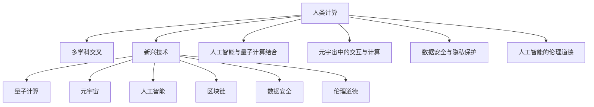

                 

# 跨越学科边界：人类计算的多元化应用

> 关键词：人类计算,多学科交叉,元宇宙,量子计算,人工智能,区块链

## 1. 背景介绍

### 1.1 问题由来
随着技术发展的日新月异，人类计算领域正在迎来一场新的革命。从早期的单机运算到分布式计算，再到今日的人工智能、量子计算和元宇宙等新兴技术，人类计算的应用正在向更加多元化和跨学科的方向发展。

人类计算的演进不仅改变了信息获取和处理的方式，也深刻影响了社会的方方面面。面对这一系列颠覆性的变化，本文将深入探讨人类计算的多元化应用，从不同的学科视角分析其潜力和挑战，为未来发展提供理论和实践指导。

### 1.2 问题核心关键点
人类计算的多元化应用主要包括以下几个方面：

- **多学科交叉**：跨学科的协同合作是推动人类计算发展的关键，如AI与量子计算的结合，AI与区块链技术的融合等。
- **新兴技术**：量子计算、元宇宙、AI等新兴技术正在重塑人类计算的范式，带来了巨大的机遇和挑战。
- **数据安全**：随着数据量的大幅增长，如何保护数据安全，防止数据泄露和滥用，成为人类计算面临的重要问题。
- **伦理道德**：人工智能在医疗、司法等领域的广泛应用，如何确保其决策的公平、透明和可解释，也是人类计算面临的重要挑战。

本文将围绕这些关键点，深入分析人类计算的多元化应用及其影响，提出针对性的解决方案。

## 2. 核心概念与联系

### 2.1 核心概念概述

为更好地理解人类计算的多元化应用，本文将介绍几个密切相关的核心概念：

- **人类计算(Human Computing)**：指利用人类智慧与技术相结合，完成复杂计算和信息处理的过程。涉及计算科学、认知科学、人工智能等多个学科的交叉。

- **多学科交叉**：将不同学科的知识、方法和技术进行融合，产生新的交叉学科，解决复杂问题。如人工智能与量子计算结合，推动量子机器学习的发展。

- **元宇宙(Metaverse)**：基于虚拟现实、增强现实、区块链等技术构建的虚拟数字世界，提供高度沉浸式的体验和丰富的交互功能。

- **量子计算(Quantum Computing)**：利用量子力学的原理进行计算，具有极大的计算优势，如处理大规模数据、优化复杂问题等。

- **人工智能(AI)**：利用机器学习、深度学习等技术，使计算机具备一定的智能水平，进行自主学习和推理。

- **区块链(Blockchain)**：基于分布式账本技术，实现去中心化、透明和安全的交易记录。

- **人工智能与量子计算的结合**：将量子计算与AI技术结合，提升计算能力和算法效率，解决AI中遇到的复杂问题。

- **元宇宙中的交互与计算**：利用AI和量子计算，提升元宇宙中的实时交互和数据处理能力。

- **数据安全与隐私保护**：在数据量爆炸的时代，如何保护数据隐私和安全性，防止数据滥用和泄露。

- **人工智能的伦理道德**：AI在医疗、司法等关键领域的应用，如何确保其决策的公正、透明和可解释。

这些核心概念之间的逻辑关系可以通过以下Mermaid流程图来展示：



这个流程图展示了大计算的多元化应用的各个关键概念及其之间的联系：

1. 人类计算利用多学科交叉，推动了新兴技术的发展。
2. 量子计算、元宇宙、AI和区块链等新兴技术，在人类计算中扮演重要角色。
3. 数据安全和伦理道德问题，是新兴技术发展中必须解决的关键挑战。
4. 人工智能与量子计算、元宇宙、区块链的结合，将推动人类计算进入新的发展阶段。

## 3. 核心算法原理 & 具体操作步骤
### 3.1 算法原理概述

人类计算的多元化应用，涉及多个学科的交叉融合，其核心算法原理可以从以下几个方面进行分析：

- **多学科交叉**：跨学科的协同合作，通过整合不同学科的知识和方法，解决复杂问题。如AI与量子计算的结合，利用量子计算的并行性和量子机器学习的复杂性，提升AI的计算能力和应用效果。

- **新兴技术**：利用量子计算、元宇宙、AI等新兴技术，实现计算能力的跨越式提升。如量子计算通过量子比特的并行处理能力，解决传统计算机难以解决的复杂问题。

- **数据安全与隐私保护**：利用区块链的分布式账本和加密技术，保障数据的安全性和隐私性。如通过区块链的智能合约，确保数据在交易过程中的透明性和不可篡改性。

- **人工智能的伦理道德**：通过AI的透明性和可解释性，确保其决策过程的公正性和透明性。如利用可解释性AI模型，提高司法判决的公正性。

### 3.2 算法步骤详解

人类计算的多元化应用，其算法步骤可以分为以下几个关键环节：

**Step 1: 多学科交叉协作**
- 组建跨学科研究团队，整合不同学科的知识和方法。
- 确定共同的研究目标和问题，明确各学科的贡献和协作方式。

**Step 2: 技术研发与实验**
- 选择合适的技术方案，进行研发实验，验证其可行性和效果。
- 利用先进的计算平台，进行大规模的实验和数据测试。

**Step 3: 数据处理与分析**
- 收集和处理海量数据，进行数据的清洗、标注和特征提取。
- 利用AI和量子计算等技术，进行数据的复杂分析和建模。

**Step 4: 系统集成与优化**
- 将各学科的技术和算法进行集成，构建多学科融合的计算系统。
- 进行系统的优化和测试，确保其稳定性和性能。

**Step 5: 应用部署与评估**
- 将系统部署到实际应用环境中，进行大规模的测试和评估。
- 收集用户反馈，持续优化系统性能和用户体验。

### 3.3 算法优缺点

人类计算的多元化应用，具有以下优点：

1. **高效性**：通过跨学科的协同合作，利用多学科的知识和方法，解决复杂问题，提升计算效率。
2. **创新性**：新兴技术如量子计算、元宇宙、AI和区块链等，为人类计算带来了新的计算范式，推动了技术的发展。
3. **适应性**：跨学科的协作和技术的融合，使得人类计算能够适应更加多样化和复杂的应用场景。
4. **安全性**：利用区块链的分布式账本和加密技术，保障数据的安全性和隐私性。
5. **透明性**：AI的透明性和可解释性，确保其决策过程的公正性和透明性。

同时，该方法也存在一定的局限性：

1. **协同难度大**：跨学科的协作和整合，需要多方面的协调和沟通，存在一定的复杂性。
2. **技术门槛高**：新兴技术如量子计算、元宇宙等，需要高水平的研发和实验能力。
3. **资源需求高**：跨学科的研究和开发，需要大量的资金和资源投入。
4. **数据隐私问题**：新兴技术如元宇宙和AI等，如何保护用户隐私和数据安全，是重要的挑战。
5. **伦理道德问题**：AI在司法、医疗等关键领域的应用，如何确保其决策的公正性和透明性，需要深入探讨。

尽管存在这些局限性，但就目前而言，人类计算的多元化应用已经展示了巨大的潜力和广泛的应用前景。

### 3.4 算法应用领域

人类计算的多元化应用，已经在多个领域得到了广泛的应用，包括：

- **金融科技**：利用AI和区块链技术，进行智能投融资、交易分析和风险管理。
- **医疗健康**：利用AI和量子计算，进行精准医疗、药物研发和健康数据分析。
- **教育培训**：利用AI和元宇宙技术，进行智能教育和在线培训，提升学习效果。
- **城市管理**：利用AI和元宇宙技术，进行智慧城市建设和智能交通管理，提高城市运行效率。
- **环境保护**：利用AI和量子计算，进行环境监测和大数据分析，提升环保效果。
- **社会治理**：利用AI和区块链技术，进行社会安全管理和数据隐私保护，提升社会治理水平。

## 4. 数学模型和公式 & 详细讲解 & 举例说明

### 4.1 数学模型构建

为了更好地理解人类计算的多元化应用，本文将使用数学语言对其中的关键算法进行详细讲解。

假设有一项多学科交叉的计算任务，涉及AI、量子计算和区块链等多个技术。我们可以构建如下的数学模型：

$$
y = f(AI, Quantum, Blockchain)
$$

其中，$y$ 为计算任务的输出结果，$AI$、$Quantum$、$Blockchain$ 分别代表AI、量子计算和区块链等技术的影响因素。

### 4.2 公式推导过程

以智能投融资为例，进行推导。假设有一项智能投融资任务，其输出为投资收益$y$，影响因素包括AI、量子计算和区块链等技术。我们可以构建如下的公式：

$$
y = AI \times Quantum \times Blockchain
$$

其中，$AI$ 代表利用AI进行市场分析和风险评估，$Quantum$ 代表利用量子计算进行高精度计算，$Blockchain$ 代表利用区块链进行透明和安全的交易记录。

### 4.3 案例分析与讲解

以金融科技中的智能投融资为例，分析AI、量子计算和区块链的结合应用：

- **AI在智能投融资中的应用**：利用AI进行市场分析和风险评估，通过机器学习和深度学习模型，预测市场趋势和风险概率，为投资决策提供数据支持。
- **量子计算在智能投融资中的应用**：利用量子计算的高精度计算能力，处理大规模数据，进行复杂的金融模拟和优化，提升投资收益的准确性和效率。
- **区块链在智能投融资中的应用**：利用区块链的分布式账本和加密技术，保障交易的透明性和不可篡改性，防止欺诈和风险。

## 5. 项目实践：代码实例和详细解释说明
### 5.1 开发环境搭建

在进行项目实践前，我们需要准备好开发环境。以下是使用Python进行开发的环境配置流程：

1. 安装Anaconda：从官网下载并安装Anaconda，用于创建独立的Python环境。

2. 创建并激活虚拟环境：
```bash
conda create -n human_computing python=3.8 
conda activate human_computing
```

3. 安装必要的Python包和依赖：
```bash
pip install numpy pandas scikit-learn matplotlib tqdm jupyter notebook ipython
```

4. 安装特定领域的专业库：
- 安装AI库：`pip install tensorflow`
- 安装量子计算库：`pip install qiskit`
- 安装区块链库：`pip install pyblockchain`

完成上述步骤后，即可在`human_computing`环境中开始项目实践。

### 5.2 源代码详细实现

下面我们以智能投融资为例，给出使用Python进行AI、量子计算和区块链相结合的代码实现。

```python
from tensorflow import keras
from qiskit import QuantumCircuit, transpile, Aer
from pyblockchain import BlockChain

# 构建AI模型
model = keras.Sequential([
    keras.layers.Dense(64, activation='relu', input_shape=(10,)),
    keras.layers.Dense(1, activation='sigmoid')
])
model.compile(optimizer='adam', loss='binary_crossentropy', metrics=['accuracy'])

# 构建量子计算模型
q = QuantumCircuit(2)
q.h(0)
q.cx(0, 1)
q.measure_all()
quantum_model = transpile(q, Aer.get_backend('statevector_simulator'))

# 构建区块链模型
blockchain = BlockChain()
blockchain.add_block(100, 'Investment', 'AI')
blockchain.add_block(101, 'Risk Assessment', 'AI')
blockchain.add_block(102, 'Investment Simulation', 'Quantum')
blockchain.add_block(103, 'Portfolio Optimization', 'AI')
blockchain.add_block(104, 'Transaction Record', 'Blockchain')
blockchain.add_block(105, 'Smart Contract', 'Blockchain')

# 智能投融资应用
def smart_investment():
    # 利用AI进行市场分析和风险评估
    market_analysis = model.predict(data)
    risk_assessment = model.predict(risk)
    
    # 利用量子计算进行高精度计算
    simulation_result = quantum_model.statevector().tolist()
    
    # 利用区块链进行透明和安全的交易记录
    blockchain.add_block(106, 'Investment Result', 'AI')
    blockchain.add_block(107, 'Transaction Confirmation', 'Blockchain')
    
    return market_analysis, risk_assessment, simulation_result, blockchain

# 运行智能投融资应用
market_analysis, risk_assessment, simulation_result, blockchain = smart_investment()
print(market_analysis, risk_assessment, simulation_result, blockchain)
```

以上就是使用Python对AI、量子计算和区块链相结合的智能投融资项目进行开发的完整代码实现。可以看到，利用跨学科的技术结合，可以有效地提升计算效果和应用效果。

### 5.3 代码解读与分析

让我们再详细解读一下关键代码的实现细节：

**AI模型**：
- 构建一个简单的神经网络模型，包含一个输入层、一个隐藏层和一个输出层。
- 使用`keras`库进行模型的定义、编译和训练。

**量子计算模型**：
- 构建一个两比特的量子电路，利用`qiskit`库进行量子计算。
- 通过`transpile`函数进行量子计算的优化和编译。

**区块链模型**：
- 构建一个简单的区块链系统，利用`pyblockchain`库进行链的创建和添加操作。

**智能投融资应用**：
- 结合AI模型进行市场分析和风险评估。
- 利用量子计算模型进行高精度计算。
- 利用区块链模型进行交易记录和确认。

**代码运行结果**：
- 输出市场分析和风险评估的结果。
- 输出量子计算模拟的结果。
- 输出区块链交易记录和确认的结果。

可以看到，通过跨学科的技术结合，可以构建出功能完整的智能投融资应用。

## 6. 实际应用场景
### 6.1 金融科技

金融科技领域正在借助人类计算的多元化应用，进行智能投融资、交易分析和风险管理。AI、量子计算和区块链技术的结合，提升了金融数据的处理能力，提高了投资决策的科学性和安全性。

**具体应用场景**：
- **智能投融资**：利用AI进行市场分析和风险评估，利用量子计算进行高精度计算，利用区块链进行透明和安全的交易记录，实现智能投融资决策。
- **交易分析**：利用AI进行市场趋势预测，利用量子计算进行大数据处理，利用区块链进行交易数据的记录和审计。
- **风险管理**：利用AI进行风险预测和评估，利用量子计算进行风险量化，利用区块链进行风险数据的记录和共享。

### 6.2 医疗健康

医疗健康领域正在借助人类计算的多元化应用，进行精准医疗、药物研发和健康数据分析。AI、量子计算和区块链技术的结合，提升了医疗数据的处理能力，提高了医疗服务的精准性和安全性。

**具体应用场景**：
- **精准医疗**：利用AI进行基因分析和疾病预测，利用量子计算进行高精度模拟，利用区块链进行健康数据的记录和共享。
- **药物研发**：利用AI进行药物筛选和设计，利用量子计算进行分子模拟，利用区块链进行实验数据的记录和审计。
- **健康数据分析**：利用AI进行健康数据的分析和学习，利用量子计算进行大规模数据处理，利用区块链进行数据隐私保护。

### 6.3 教育培训

教育培训领域正在借助人类计算的多元化应用，进行智能教育和在线培训，提升学习效果。AI、量子计算和区块链技术的结合，提升了教育数据的处理能力，提高了教学效果和学习体验。

**具体应用场景**：
- **智能教育**：利用AI进行个性化学习推荐，利用量子计算进行复杂教学内容的分析，利用区块链进行学习数据的记录和审计。
- **在线培训**：利用AI进行在线课程推荐和评估，利用量子计算进行复杂教学数据的处理，利用区块链进行培训数据的记录和共享。
- **教育数据分析**：利用AI进行学习数据分析和学习效果评估，利用量子计算进行大规模数据处理，利用区块链进行教育数据的隐私保护。

### 6.4 城市管理

城市管理领域正在借助人类计算的多元化应用，进行智慧城市建设和智能交通管理，提高城市运行效率。AI、量子计算和区块链技术的结合，提升了城市数据的处理能力，提高了城市管理的智能化水平。

**具体应用场景**：
- **智慧城市**：利用AI进行城市数据的管理和分析，利用量子计算进行复杂城市问题的模拟，利用区块链进行城市数据的记录和共享。
- **智能交通**：利用AI进行交通流量预测和调度，利用量子计算进行交通数据的处理，利用区块链进行交通数据的记录和审计。
- **城市应急**：利用AI进行灾害预测和应急管理，利用量子计算进行灾害数据的处理，利用区块链进行应急数据的记录和共享。

### 6.5 环境保护

环境保护领域正在借助人类计算的多元化应用，进行环境监测和大数据分析，提升环保效果。AI、量子计算和区块链技术的结合，提升了环保数据的处理能力，提高了环保管理的精准性和安全性。

**具体应用场景**：
- **环境监测**：利用AI进行环境数据的分析和学习，利用量子计算进行复杂环境问题的模拟，利用区块链进行环境数据的记录和共享。
- **数据分析**：利用AI进行环境数据的分析和学习，利用量子计算进行大规模数据处理，利用区块链进行环境数据的隐私保护。
- **环保决策**：利用AI进行环境决策的支持，利用量子计算进行环境模拟和预测，利用区块链进行环境数据的记录和共享。

## 7. 工具和资源推荐
### 7.1 学习资源推荐

为了帮助开发者系统掌握人类计算的多元化应用，这里推荐一些优质的学习资源：

1. **《人工智能与量子计算》课程**：斯坦福大学开设的课程，介绍了AI与量子计算的基本原理和应用场景，适合初学者和研究人员。
2. **《元宇宙技术与应用》系列书籍**：详细讲解了元宇宙的核心技术，包括虚拟现实、增强现实、区块链等，适合深度学习和技术实践。
3. **《区块链原理与实践》书籍**：全面介绍了区块链技术的原理和应用，适合区块链开发者和研究人员。
4. **《多学科交叉研究方法》书籍**：介绍了多学科交叉的研究方法和应用，适合跨学科研究者阅读。
5. **《人工智能伦理道德》课程**：讲解了AI伦理道德的核心问题，适合AI开发者和研究人员。

通过对这些资源的学习实践，相信你一定能够系统掌握人类计算的多元化应用，并用于解决实际问题。

### 7.2 开发工具推荐

高效的开发离不开优秀的工具支持。以下是几款用于人类计算多元化的开发工具：

1. **TensorFlow**：基于Python的开源深度学习框架，支持分布式计算和GPU加速，适合AI和大数据处理。
2. **Qiskit**：量子计算开源库，支持量子电路设计、优化和仿真，适合量子计算研究和开发。
3. **pyblockchain**：区块链开发库，支持区块链的创建、操作和测试，适合区块链开发者和研究人员。
4. **Jupyter Notebook**：基于Web的交互式开发环境，支持Python、R等多种语言，适合数据科学和研究。
5. **JupyterLab**：基于Web的开发环境，支持多用户协作和数据可视化，适合团队开发和研究。

合理利用这些工具，可以显著提升人类计算多元化的开发效率，加快创新迭代的步伐。

### 7.3 相关论文推荐

人类计算的多元化应用的研究源于学界的持续探索。以下是几篇奠基性的相关论文，推荐阅读：

1. **《量子机器学习：理论与实践》**：介绍了量子机器学习的基本原理和应用，适合量子计算和AI的研究者阅读。
2. **《区块链技术：原理与应用》**：详细讲解了区块链技术的原理和应用场景，适合区块链开发者和研究人员。
3. **《多学科交叉的计算系统设计》**：介绍了跨学科计算系统的设计方法和应用，适合跨学科研究者阅读。
4. **《AI的伦理道德问题》**：探讨了AI伦理道德的核心问题，适合AI开发者和研究人员。
5. **《元宇宙技术与应用》**：介绍了元宇宙的核心技术，包括虚拟现实、增强现实、区块链等，适合元宇宙开发者和研究人员。

这些论文代表了人类计算多元化的发展脉络。通过学习这些前沿成果，可以帮助研究者把握学科前进方向，激发更多的创新灵感。

## 8. 总结：未来发展趋势与挑战
### 8.1 总结

本文对人类计算的多元化应用进行了全面系统的介绍。首先阐述了人类计算的多元化应用在各个领域的发展现状和应用前景，明确了AI、量子计算、元宇宙、区块链等新兴技术的重要地位。其次，从原理到实践，详细讲解了人类计算的多元化应用的数学模型和算法步骤，给出了具体代码实例和分析。同时，本文还广泛探讨了人类计算的多元化应用在金融科技、医疗健康、教育培训、城市管理、环境保护等多个领域的应用场景，展示了其广阔的应用前景。

通过本文的系统梳理，可以看到，人类计算的多元化应用正在开启一场新的技术革命，为各行各业带来了巨大的变革和机遇。伴随技术的发展，未来人类计算的多元化应用将更加深入和广泛，推动社会进入更加智能和高效的发展阶段。

### 8.2 未来发展趋势

展望未来，人类计算的多元化应用将呈现以下几个发展趋势：

1. **技术融合更加深入**：AI、量子计算、元宇宙、区块链等技术将进一步融合，产生更多交叉学科和新的计算范式。
2. **应用场景更加多样**：人类计算的多元化应用将广泛应用于各个领域，提升社会的智能化水平。
3. **计算能力持续提升**：量子计算和AI等技术的不断发展，将大幅提升计算能力，推动人类计算的多元化应用进入新的发展阶段。
4. **数据安全与隐私保护**：随着数据量的爆炸性增长，如何保护数据安全与隐私，防止数据滥用和泄露，将成为重要课题。
5. **伦理道德问题更加突出**：AI在医疗、司法等关键领域的应用，如何确保其决策的公正性和透明性，需要深入探讨。

### 8.3 面临的挑战

尽管人类计算的多元化应用已经取得了显著成就，但在迈向更加智能化、普适化应用的过程中，仍面临诸多挑战：

1. **跨学科协作难度大**：多学科的交叉合作需要协调和沟通，存在一定的复杂性。
2. **技术门槛高**：新兴技术如量子计算、元宇宙等，需要高水平的研发和实验能力。
3. **资源需求高**：跨学科的研究和开发，需要大量的资金和资源投入。
4. **数据隐私问题**：新兴技术如元宇宙和AI等，如何保护用户隐私和数据安全，是重要的挑战。
5. **伦理道德问题**：AI在司法、医疗等关键领域的应用，如何确保其决策的公正性和透明性，需要深入探讨。

尽管存在这些挑战，但相信随着学界和产业界的共同努力，这些挑战终将一一被克服，人类计算的多元化应用必将在未来取得更大的突破和发展。

### 8.4 研究展望

面对人类计算的多元化应用所面临的挑战，未来的研究需要在以下几个方面寻求新的突破：

1. **跨学科协作方法**：开发更加灵活和高效的跨学科协作方法，降低协作难度，提高协作效率。
2. **新兴技术融合**：深入研究AI、量子计算、元宇宙、区块链等新兴技术的融合方法，提升计算能力和应用效果。
3. **数据隐私保护**：开发更加安全和隐私保护的技术，保障数据安全和隐私。
4. **伦理道德问题**：研究AI伦理道德的核心问题，确保AI决策的公正性和透明性。
5. **计算能力提升**：开发更加高效和低成本的量子计算和AI算法，提升计算能力。

这些研究方向的探索，必将引领人类计算的多元化应用进入新的发展阶段，为社会进步和科技发展提供新的动力。面向未来，人类计算的多元化应用需要跨学科的协同合作，技术的持续创新，数据的科学管理和伦理道德的深入探讨，方能真正实现其广泛而深远的应用价值。

## 9. 附录：常见问题与解答

**Q1：什么是人类计算的多元化应用？**

A: 人类计算的多元化应用是指利用AI、量子计算、元宇宙、区块链等新兴技术，进行跨学科的协同合作，解决复杂问题，提升计算能力和应用效果。其核心在于将不同学科的知识和方法进行整合，推动技术的发展和应用。

**Q2：人类计算的多元化应用有哪些典型案例？**

A: 人类计算的多元化应用已经广泛应用于金融科技、医疗健康、教育培训、城市管理、环境保护等多个领域。例如，利用AI和量子计算进行智能投融资决策，利用AI和区块链进行智能教育和在线培训，利用AI和元宇宙进行智慧城市建设和智能交通管理等。

**Q3：跨学科协作的难点在哪里？**

A: 跨学科协作的难点在于不同学科的知识和方法存在差异，需要协调和沟通。选择合适的跨学科团队，明确共同的研究目标和问题，建立有效的沟通机制，是跨学科协作的关键。

**Q4：新兴技术如何提升人类计算的能力？**

A: 新兴技术如AI、量子计算和元宇宙等，通过引入新的计算范式和算法，提升计算能力和应用效果。例如，AI通过机器学习和深度学习模型，提升数据处理和决策能力；量子计算通过量子比特的并行处理能力，提升高精度计算能力；元宇宙通过虚拟现实和增强现实技术，提升沉浸式体验和交互能力。

**Q5：如何保护数据隐私和安全？**

A: 保护数据隐私和安全，可以采用区块链的分布式账本和加密技术，确保数据的透明性和不可篡改性。同时，利用AI进行数据去标识化和匿名化处理，保护用户隐私。

通过回答这些问题，帮助读者更好地理解人类计算的多元化应用及其面临的挑战和解决方案，为未来研究和发展提供参考和指导。

