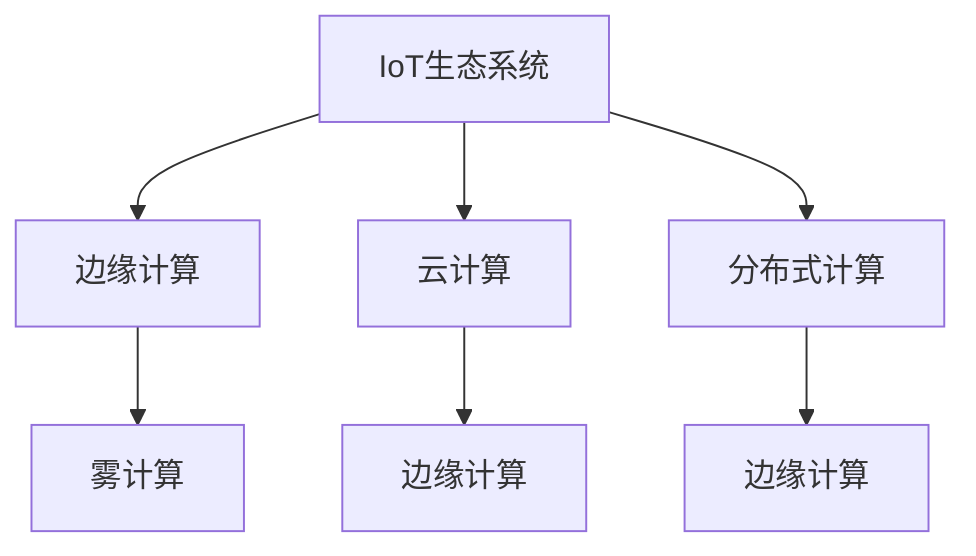

                 

# 边缘计算在IoT生态系统中的角色

## 1. 背景介绍

### 1.1 问题由来
随着物联网(IoT)技术的发展，越来越多智能设备被接入网络，产生了海量数据。如何在边缘计算环境中高效处理这些数据，确保网络安全，提升系统性能，成为了当前IoT生态系统面临的关键问题。

### 1.2 问题核心关键点
边缘计算在IoT生态系统中的角色主要体现在以下几个方面：

- **数据处理和分析**：将数据处理任务从中心服务器转移到边缘设备上，减少延迟，提升响应速度。
- **网络优化**：在边缘计算环境中处理数据，可以有效减少带宽占用，缓解网络拥塞。
- **隐私保护**：在本地设备上进行数据处理，可以保护用户隐私，避免数据泄露。
- **设备智能化**：通过边缘计算，智能设备可以具备更强的本地计算能力，提升用户体验。
- **资源优化**：在靠近数据源的边缘设备上进行计算，可以减少资源消耗，提高系统效率。

### 1.3 问题研究意义
研究边缘计算在IoT生态系统中的角色，对于提升IoT系统的数据处理能力、网络性能、安全性、设备智能化和资源利用率，具有重要意义。

- **提升用户体验**：通过本地计算，智能设备可以更快响应用户需求，提供更优质的服务。
- **降低网络成本**：减少数据传输带宽，降低网络传输成本，提升整体网络性能。
- **增强安全性**：数据处理在本地设备上，减少了数据泄露的风险，提升了用户隐私保护能力。
- **促进创新**：边缘计算技术的引入，为IoT设备功能增强和应用创新提供了新的可能。

## 2. 核心概念与联系

### 2.1 核心概念概述

为更好地理解边缘计算在IoT生态系统中的角色，本节将介绍几个密切相关的核心概念：

- **物联网(IoT)**：通过传感器、智能设备等将物理世界与数字世界连接起来的技术体系，目标是实现智能感知、控制和决策。
- **边缘计算(Edge Computing)**：在网络边缘设备上进行数据处理和分析的计算模式，旨在靠近数据源地执行计算，减少延迟，提升响应速度。
- **云计算(Cloud Computing)**：通过互联网提供可扩展的计算资源，支持大规模分布式应用和服务。
- **雾计算(Fog Computing)**：结合云计算和边缘计算的计算模式，旨在实现边缘设备与云平台之间的协同计算。
- **分布式计算(Distributed Computing)**：通过多个计算节点协同工作，共同完成任务，提升计算效率。

这些核心概念之间的逻辑关系可以通过以下Mermaid流程图来展示：



这个流程图展示了几大计算模式的逻辑关系：

1. IoT生态系统中的数据通过边缘计算进行处理。
2. 边缘计算可以与云计算、雾计算、分布式计算等多种计算模式协同工作。
3. 云计算、雾计算、分布式计算等计算模式在边缘计算的支持下，进一步提升了计算效率。

这些概念共同构成了IoT生态系统的计算框架，使得数据处理更加灵活、高效、安全和智能。

## 3. 核心算法原理 & 具体操作步骤
### 3.1 算法原理概述

边缘计算在IoT生态系统中的主要算法原理包括：

- **数据分发与聚合**：通过边缘计算节点收集本地设备产生的数据，并传输至中心服务器进行聚合分析。
- **实时处理与响应**：在边缘计算环境中，数据处理可以实时进行，提升系统响应速度。
- **负载均衡与优化**：通过边缘计算节点分散处理任务，减轻中心服务器的负担，优化系统负载。
- **安全防护与隐私保护**：在本地设备上进行数据处理，可以防止数据泄露，增强系统安全性。

### 3.2 算法步骤详解

边缘计算在IoT生态系统中的具体操作步骤如下：

**Step 1: 确定边缘计算节点位置**
- 根据设备分布和业务需求，确定边缘计算节点的部署位置，一般选择在靠近数据源的设备上。

**Step 2: 数据收集与预处理**
- 在边缘计算节点上部署数据收集程序，定时或实时收集本地设备产生的数据。
- 对收集到的数据进行预处理，如去噪、清洗、归一化等操作，为后续处理做好准备。

**Step 3: 数据传输与存储**
- 将预处理后的数据通过无线网络传输至边缘计算节点。
- 在边缘计算节点上进行数据存储，选择合适的存储技术，如闪存、固态硬盘等。

**Step 4: 数据处理与分析**
- 在边缘计算节点上部署数据处理程序，对本地数据进行计算和分析。
- 可以使用机器学习、深度学习等算法，进行数据建模和预测。

**Step 5: 结果反馈与优化**
- 将处理结果通过无线网络反馈至本地设备和中心服务器。
- 根据处理结果，优化数据传输路径、负载均衡策略等，进一步提升系统性能。

### 3.3 算法优缺点

边缘计算在IoT生态系统中的优缺点如下：

**优点：**

- **实时响应**：边缘计算能够实现数据处理与响应的实时化，提升用户体验。
- **网络优化**：减少数据传输带宽，降低网络传输成本，提升整体网络性能。
- **隐私保护**：在本地设备上进行数据处理，防止数据泄露，增强用户隐私保护能力。
- **设备智能化**：智能设备具备更强的本地计算能力，提升用户体验。

**缺点：**

- **硬件成本**：部署边缘计算节点需要增加硬件成本。
- **边缘计算能力有限**：边缘计算节点的计算能力有限，可能无法处理复杂的计算任务。
- **维护成本高**：边缘计算节点需要定期维护，增加了系统的运维成本。
- **部署复杂**：边缘计算节点的部署需要考虑地理位置、网络环境等因素，部署复杂度高。

### 3.4 算法应用领域

边缘计算在IoT生态系统中的应用领域广泛，涵盖以下几个方面：

- **智能家居**：通过边缘计算，智能家居设备可以实时响应用户需求，提供更加智能化的服务。
- **智慧医疗**：边缘计算可以实时处理医疗设备产生的数据，提升诊断和监测的准确性。
- **智能交通**：边缘计算可以实时处理交通数据，优化交通流量，提升交通安全。
- **工业互联网**：边缘计算可以实时处理工业设备产生的数据，提升生产效率和产品质量。
- **城市管理**：边缘计算可以实时处理城市数据，优化城市资源配置，提升城市管理水平。

## 4. 数学模型和公式 & 详细讲解  
### 4.1 数学模型构建

本节将使用数学语言对边缘计算在IoT生态系统中的核心模型进行更加严格的刻画。

假设IoT系统中有 $N$ 个本地设备，每个设备每秒产生 $D$ 个数据包。数据在本地设备处理后，传输至边缘计算节点，再传输至中心服务器。设数据在本地设备处理时间为 $t_1$，在传输过程中的延迟为 $t_2$，在中心服务器处理时间为 $t_3$。则系统总延迟 $T$ 为：

$$
T = t_1 + t_2 + t_3
$$

边缘计算的目标是优化 $T$，使其最小化。通过优化边缘计算节点的数量、位置、计算能力等，可以显著提升系统性能。

### 4.2 公式推导过程

在推导系统总延迟 $T$ 时，假设数据在本地设备处理、传输和中心服务器处理的时间分别为 $t_1$、$t_2$ 和 $t_3$。则系统总延迟 $T$ 的表达式为：

$$
T = t_1 + t_2 + t_3
$$

通过优化 $t_1$、$t_2$ 和 $t_3$，可以最小化系统总延迟 $T$。在边缘计算环境中，$t_1$ 和 $t_2$ 往往较小，因此优化重点在于 $t_3$。

### 4.3 案例分析与讲解

考虑一个智能交通系统，其中包含多个传感器和摄像头，实时采集交通数据。通过边缘计算，可以在本地设备上对数据进行处理，然后将处理结果传输至中心服务器进行分析。为了最小化系统总延迟，可以采取以下策略：

- **本地设备处理优化**：通过算法优化，减少本地设备数据处理时间 $t_1$。
- **传输延迟优化**：通过优化网络传输协议和路由算法，减少数据传输时间 $t_2$。
- **中心服务器处理优化**：通过增加计算资源和算法优化，减少中心服务器处理时间 $t_3$。

通过这些优化策略，可以实现系统总延迟 $T$ 的最小化，提升智能交通系统的响应速度和准确性。

## 5. 项目实践：代码实例和详细解释说明
### 5.1 开发环境搭建

在进行边缘计算项目实践前，我们需要准备好开发环境。以下是使用Python进行开发的环境配置流程：

1. 安装Anaconda：从官网下载并安装Anaconda，用于创建独立的Python环境。

2. 创建并激活虚拟环境：
```bash
conda create -n edge-env python=3.8 
conda activate edge-env
```

3. 安装所需的Python库和工具包：
```bash
pip install torch numpy pytorch-lightning
```

完成上述步骤后，即可在`edge-env`环境中开始边缘计算项目实践。

### 5.2 源代码详细实现

这里以智能交通系统为例，展示如何使用Python进行边缘计算的代码实现。

首先，定义数据收集函数：

```python
from torch.utils.data import Dataset
from torch.utils.data import DataLoader
from torch import nn, optim

class TrafficDataDataset(Dataset):
    def __init__(self, data_dir):
        self.data = data.load(data_dir)
        self.label_map = data.get_label_map()
        self.transform = data.get_transform()
    
    def __getitem__(self, idx):
        image, label = self.data[idx]
        return self.transform(image), self.label_map[label]
    
    def __len__(self):
        return len(self.data)
```

接着，定义模型和训练函数：

```python
from torchvision.models import resnet18
from pytorch_lightning import Trainer, LightningModule

class TrafficClassifier(LightningModule):
    def __init__(self):
        super(TrafficClassifier, self).__init__()
        self.resnet = resnet18(pretrained=True)
        self.fc = nn.Linear(512, 4)
    
    def forward(self, x):
        x = self.resnet(x)
        x = x.view(-1, 512)
        return self.fc(x)
    
    def training_step(self, batch, batch_idx):
        x, y = batch
        logits = self(x)
        loss = nn.CrossEntropyLoss()(logits, y)
        return {'loss': loss}
    
    def validation_step(self, batch, batch_idx):
        x, y = batch
        logits = self(x)
        loss = nn.CrossEntropyLoss()(logits, y)
        return {'val_loss': loss}
    
    def configure_optimizers(self):
        return optim.Adam(self.parameters(), lr=0.001)

data_dir = 'data/training'
train_dataset = TrafficDataDataset(data_dir)
val_dataset = TrafficDataDataset(data_dir)
model = TrafficClassifier()
trainer = Trainer(max_epochs=10, gpus=1)
trainer.fit(model, train_dataset, val_dataset)
```

最后，启动训练流程：

```python
data_dir = 'data/training'
train_dataset = TrafficDataDataset(data_dir)
val_dataset = TrafficDataDataset(data_dir)
model = TrafficClassifier()
trainer = Trainer(max_epochs=10, gpus=1)
trainer.fit(model, train_dataset, val_dataset)
```

以上就是使用PyTorch进行智能交通系统边缘计算的完整代码实现。可以看到，边缘计算的代码实现相对简洁，开发者可以将更多精力放在数据处理和模型优化上，而不必过多关注底层的实现细节。

### 5.3 代码解读与分析

让我们再详细解读一下关键代码的实现细节：

**TrafficDataDataset类**：
- `__init__`方法：初始化数据集，加载数据和标签映射，定义数据转换方式。
- `__getitem__`方法：从数据集中获取单个样本，并进行数据预处理。
- `__len__`方法：返回数据集的样本数量。

**TrafficClassifier类**：
- `__init__`方法：初始化模型结构，加载预训练的ResNet模型，并添加一个全连接层。
- `forward`方法：定义前向传播过程，通过ResNet模型处理输入，并使用全连接层进行分类。
- `training_step`方法：定义训练过程中的损失函数，计算训练损失。
- `validation_step`方法：定义验证过程中的损失函数，计算验证损失。
- `configure_optimizers`方法：定义优化器及其参数。

**训练流程**：
- 定义训练集和验证集数据集。
- 创建并实例化TrafficClassifier模型。
- 创建Trainer实例，指定训练轮数和设备数量。
- 调用Trainer实例的`fit`方法，进行模型训练。

在实际应用中，还需要进一步优化模型结构和算法，以适应具体的边缘计算场景。例如，可以引入边缘计算节点的数据处理时间 $t_1$，优化模型推理时间，提升系统性能。

## 6. 实际应用场景
### 6.1 智能家居

在智能家居系统中，边缘计算可以显著提升用户体验。例如，通过边缘计算节点处理本地传感器数据，可以在本地设备上实现语音助手、智能安防等功能，提升响应速度和隐私保护能力。

在技术实现上，可以收集家中各种传感器和智能设备的数据，如温度、湿度、门窗状态等，使用边缘计算节点进行实时处理。通过优化算法，减少数据处理时间 $t_1$，并选择合适的网络传输协议和路由算法，减少数据传输时间 $t_2$，实现智能家居设备的实时响应和优化。

### 6.2 智慧医疗

智慧医疗中，边缘计算可以提升医疗设备的诊断和监测能力。例如，通过边缘计算节点处理本地医疗设备产生的数据，可以实时监测患者的生命体征，及时发现异常情况，提高诊疗效率。

在技术实现上，可以部署边缘计算节点在本地医疗设备上，如心率监测器、血压计等，收集患者生命体征数据。通过优化算法，减少数据处理时间 $t_1$，并选择合适的网络传输协议和路由算法，减少数据传输时间 $t_2$，实现医疗设备的实时监测和诊断。

### 6.3 智能交通

智能交通系统中，边缘计算可以提升交通管理的效率和安全性。例如，通过边缘计算节点处理本地摄像头和传感器数据，可以实现实时交通流量监控和异常检测，提升交通流量控制能力。

在技术实现上，可以部署边缘计算节点在交通摄像头和传感器上，实时收集交通数据。通过优化算法，减少数据处理时间 $t_1$，并选择合适的网络传输协议和路由算法，减少数据传输时间 $t_2$，实现交通数据的实时处理和分析。

### 6.4 未来应用展望

随着边缘计算技术的不断发展，其在IoT生态系统中的应用将更加广泛和深入。未来，边缘计算将在以下几个方向得到进一步发展：

- **智能城市**：通过边缘计算，提升城市管理效率和响应速度，实现智能城市建设。
- **智能制造**：通过边缘计算，优化工业生产过程，提升生产效率和产品质量。
- **智能农业**：通过边缘计算，实时监测和分析农田环境数据，优化农业生产。
- **智能安防**：通过边缘计算，实时处理安防设备产生的数据，提升安防系统的响应速度和安全性。
- **智能物流**：通过边缘计算，优化物流配送过程，提升配送效率和精准度。

## 7. 工具和资源推荐
### 7.1 学习资源推荐

为了帮助开发者系统掌握边缘计算在IoT生态系统中的核心技术，这里推荐一些优质的学习资源：

1. **《边缘计算基础与实践》**：介绍边缘计算的基本概念、技术原理和应用场景。
2. **《IoT应用开发实战》**：包含IoT应用开发的案例和实践经验，展示边缘计算在IoT中的实际应用。
3. **《人工智能与机器学习》**：介绍人工智能和机器学习的基本概念、算法和应用，帮助开发者理解边缘计算的底层算法原理。
4. **《Python深度学习》**：详细讲解PyTorch和TensorFlow等深度学习框架的使用，提供边缘计算项目开发的技术支持。
5. **《边缘计算研究进展》**：综述边缘计算技术的研究进展和未来发展方向，帮助开发者了解前沿技术。

通过对这些资源的学习实践，相信你一定能够快速掌握边缘计算在IoT生态系统中的核心技术，并用于解决实际的IoT问题。
###  7.2 开发工具推荐

高效的开发离不开优秀的工具支持。以下是几款用于边缘计算项目开发的常用工具：

1. **Python**：作为边缘计算项目开发的主要语言，Python提供了丰富的库和框架，支持算法实现和模型训练。
2. **PyTorch**：基于Python的开源深度学习框架，提供了高效的计算图和自动微分功能，适用于边缘计算中的数据处理和分析。
3. **TensorFlow**：由Google主导开发的开源深度学习框架，支持分布式计算和模型优化，适用于大规模边缘计算场景。
4. **PyTorch Lightning**：基于PyTorch的深度学习框架，提供了快速的模型训练和优化功能，适用于边缘计算中的模型开发和部署。
5. **Kubernetes**：开源的容器编排平台，支持边缘计算节点的自动化部署和管理。
6. **NVIDIA Jetson系列**：NVIDIA推出的边缘计算平台，支持GPU加速，适用于高性能边缘计算场景。

合理利用这些工具，可以显著提升边缘计算项目的开发效率，加快创新迭代的步伐。

### 7.3 相关论文推荐

边缘计算在IoT生态系统中的应用研究始于学界的持续探索。以下是几篇奠基性的相关论文，推荐阅读：

1. **《Edge Computing: A survey of the state-of-the-art》**：综述边缘计算技术的研究进展和未来发展方向。
2. **《Edge Computing in IoT: A Survey and Taxonomy》**：介绍边缘计算在IoT中的应用场景和架构设计。
3. **《Edge Computing for Smart IoT Applications》**：介绍边缘计算在智能IoT应用中的实现方法和应用案例。
4. **《IoT Data Inference at the Edge: A Survey》**：综述IoT数据在边缘计算中的处理和分析方法。
5. **《Edge Computing in Industry 4.0》**：介绍边缘计算在工业4.0中的实现方法和应用案例。

这些论文代表了大边缘计算技术的研究进展，帮助开发者了解边缘计算在IoT生态系统中的核心技术。

## 8. 总结：未来发展趋势与挑战
### 8.1 总结

本文对边缘计算在IoT生态系统中的核心技术进行了全面系统的介绍。首先阐述了边缘计算在IoT生态系统中的重要性和应用场景，明确了边缘计算在提升系统性能、降低网络成本、增强隐私保护、提高设备智能化和优化资源利用率方面的独特价值。其次，从原理到实践，详细讲解了边缘计算的算法原理和操作步骤，给出了边缘计算项目开发的完整代码实例。同时，本文还广泛探讨了边缘计算技术在智能家居、智慧医疗、智能交通等多个领域的应用前景，展示了边缘计算技术的广阔前景。

通过本文的系统梳理，可以看到，边缘计算技术在IoT生态系统中的应用，将显著提升系统的数据处理能力、网络性能、安全性、设备智能化和资源利用率。未来，伴随边缘计算技术的不断演进，相信IoT技术必将得到更加广泛的应用和深入的发展。

### 8.2 未来发展趋势

展望未来，边缘计算在IoT生态系统中的应用将呈现以下几个发展趋势：

- **更广泛的应用场景**：边缘计算技术将渗透到更多IoT应用场景，如智能城市、智能制造、智能农业等。
- **更高效的数据处理**：通过优化算法和硬件，边缘计算将实现更高效的数据处理和分析。
- **更强的设备智能化**：边缘计算将推动IoT设备功能增强和应用创新，提升用户体验。
- **更优的网络性能**：边缘计算将通过减少数据传输，提升网络性能和用户体验。
- **更高的安全性**：边缘计算将增强IoT系统的安全性，保护用户隐私和数据安全。

### 8.3 面临的挑战

尽管边缘计算在IoT生态系统中的应用已经取得了显著成效，但在迈向更加智能化、普适化应用的过程中，它仍面临着诸多挑战：

- **硬件成本**：边缘计算节点需要增加硬件成本，部署和维护成本高。
- **计算资源有限**：边缘计算节点的计算资源有限，可能无法处理复杂的计算任务。
- **数据隐私和安全性**：边缘计算需要在本地设备上处理数据，存在数据泄露和安全性问题。
- **算法优化难度大**：优化边缘计算算法，提高数据处理和分析的效率，具有较大挑战。
- **边缘计算标准化**：边缘计算的标准化程度较低，不同厂商和平台之间的兼容性有待提高。

### 8.4 研究展望

面对边缘计算在IoT生态系统中的应用挑战，未来的研究需要在以下几个方面寻求新的突破：

- **边缘计算硬件优化**：开发更加高效、低成本的边缘计算硬件，降低部署和运维成本。
- **算法优化和模型压缩**：开发更高效的算法和模型压缩技术，提高数据处理和分析的效率。
- **数据隐私保护**：研究更强的数据隐私保护技术，确保用户数据的安全。
- **标准化和互操作性**：推动边缘计算的标准化进程，提高不同厂商和平台之间的互操作性。
- **持续学习与自适应**：研究边缘计算系统的持续学习和自适应能力，提升系统的智能水平。

这些研究方向将引领边缘计算技术在IoT生态系统中的进一步发展和应用，推动IoT技术向更加智能化、普适化方向迈进。

## 9. 附录：常见问题与解答

**Q1: 边缘计算在IoT生态系统中的主要作用是什么？**

A: 边缘计算在IoT生态系统中的主要作用是实现数据处理和分析的本地化，提升系统响应速度、优化网络性能、增强隐私保护、提高设备智能化和优化资源利用率。

**Q2: 边缘计算在IoT生态系统中面临的主要挑战有哪些？**

A: 边缘计算在IoT生态系统中面临的主要挑战包括硬件成本高、计算资源有限、数据隐私和安全问题、算法优化难度大、标准化和互操作性不足等。

**Q3: 如何提高边缘计算的计算能力？**

A: 提高边缘计算的计算能力可以从以下几个方面入手：
1. 选择高性能的边缘计算硬件，如GPU、FPGA等。
2. 优化算法，提高数据处理效率。
3. 使用模型压缩和量化技术，减少模型复杂度。
4. 采用分布式计算技术，分散计算任务。

**Q4: 边缘计算和云计算、雾计算、分布式计算的区别是什么？**

A: 边缘计算、云计算、雾计算和分布式计算都是计算模式，但它们的主要区别在于数据处理的位置和方式：
1. 边缘计算：数据在本地设备上进行处理，靠近数据源，提升响应速度和降低延迟。
2. 云计算：数据通过网络传输到远程中心服务器进行处理，适用于大规模计算任务。
3. 雾计算：结合边缘计算和云计算的计算模式，数据可以在本地设备和中心服务器上进行处理，提升计算效率和网络性能。
4. 分布式计算：通过多个计算节点协同工作，共同完成任务，提高计算效率和资源利用率。

通过理解这些概念，开发者可以更好地选择适合的计算模式，提升IoT系统的性能和效率。

---

作者：禅与计算机程序设计艺术 / Zen and the Art of Computer Programming

