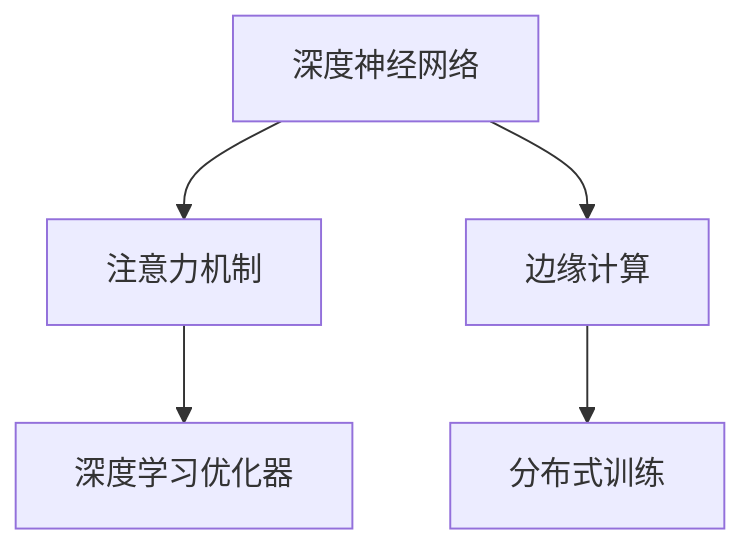

                 

# 边缘计算在注意力实时优化中的作用

## 1. 背景介绍

### 1.1 问题由来

近年来，随着深度学习技术的快速发展，人工智能在各个领域的应用越来越广泛。其中，深度神经网络（DNN），特别是卷积神经网络（CNN）和循环神经网络（RNN），在计算机视觉、自然语言处理、语音识别等任务上取得了显著的进展。然而，这些深度学习模型的计算复杂度通常很高，需要大量的计算资源和时间。在许多实际应用场景中，计算资源的限制成为一个巨大的挑战。

为了解决这个问题，边缘计算（Edge Computing）应运而生。边缘计算是一种分布式计算架构，将计算任务分布到靠近数据源的本地设备上，以减少数据传输量和计算延迟。在人工智能领域，边缘计算已经被广泛应用在图像识别、语音识别、自然语言处理等任务中，显著提升了应用性能。

然而，边缘计算在注意力实时优化中的作用还鲜有研究。注意力机制是深度神经网络中非常重要的一个组成部分，它能够帮助模型在处理序列数据时，自动学习并关注重要的信息。但在实际应用中，注意力机制的计算复杂度往往很高，特别是在处理长序列数据时，计算开销和延迟会显著增加。

因此，本文旨在探讨边缘计算在注意力实时优化中的作用，并提出一种基于边缘计算的注意力实时优化算法。该算法能够显著降低注意力计算的延迟和计算资源消耗，提高模型的实时性能。

## 2. 核心概念与联系

### 2.1 核心概念概述

为更好地理解基于边缘计算的注意力实时优化方法，本节将介绍几个密切相关的核心概念：

- 深度神经网络（DNN）：一类能够自动学习特征表示的神经网络模型，广泛应用于计算机视觉、自然语言处理、语音识别等领域。
- 注意力机制（Attention Mechanism）：一种重要的神经网络结构，能够自动学习并关注序列数据中的重要信息。在序列到序列任务、机器翻译、文本生成等任务中广泛应用。
- 深度学习优化器（Optimizer）：用于优化神经网络模型参数的算法，如SGD、Adam、Adagrad等。
- 边缘计算（Edge Computing）：一种分布式计算架构，将计算任务分布到靠近数据源的本地设备上，以减少数据传输量和计算延迟。
- 分布式训练（Distributed Training）：将计算任务分布到多个设备上，以提高计算效率和并行度。

这些核心概念之间的逻辑关系可以通过以下Mermaid流程图来展示：



这个流程图展示了几组核心概念之间的联系：

1. 深度神经网络通过注意力机制和优化器，自动学习特征表示。
2. 注意力机制需要优化器来优化模型参数，以获得更优的特征表示。
3. 边缘计算将计算任务分布到本地设备上，减少数据传输量和计算延迟。
4. 分布式训练通过将计算任务分布到多个设备上，提高计算效率和并行度。

这些概念共同构成了深度神经网络和注意力优化任务的基本框架，使其能够在各种场景下发挥强大的特征学习和推理能力。通过理解这些核心概念，我们可以更好地把握边缘计算在注意力实时优化中的应用和优势。

## 3. 核心算法原理 & 具体操作步骤

### 3.1 算法原理概述

基于边缘计算的注意力实时优化算法的基本思想是将注意力计算任务分布到本地设备上，以减少计算延迟和计算资源消耗。该算法的核心步骤如下：

1. 将注意力机制和优化器部署在本地设备上，形成一个分布式计算系统。
2. 将数据划分为多个分片，并分布到不同的本地设备上进行计算。
3. 通过本地设备之间的通信，将分片计算结果汇总到一个中心节点上。
4. 在中心节点上，使用分布式优化器对模型参数进行更新，并计算注意力权重。
5. 将注意力权重分发给各个本地设备，更新本地设备上的注意力机制参数。

### 3.2 算法步骤详解

以下是基于边缘计算的注意力实时优化算法详细步骤：

**Step 1: 设备部署**

- 选择一组本地设备，用于部署注意力机制和优化器。这些设备可以是服务器、边缘计算设备（如边缘服务器、物联网设备等）。
- 在本地设备上安装相应的深度学习框架和库，如TensorFlow、PyTorch等。
- 将注意力机制和优化器部署到本地设备上，形成一个分布式计算系统。

**Step 2: 数据分片**

- 将输入数据划分为多个分片，每个分片大小适中。
- 将分片数据分布到不同的本地设备上进行计算。

**Step 3: 分片计算**

- 在本地设备上，使用注意力机制对分片数据进行处理，计算注意力权重。
- 使用优化器对模型参数进行更新，以最小化注意力计算损失。
- 将计算结果发送给中心节点。

**Step 4: 汇总计算**

- 在中心节点上，将所有本地设备的计算结果汇总起来。
- 使用分布式优化器对模型参数进行更新，以最小化全局注意力计算损失。
- 计算全局注意力权重，并将结果发送给各个本地设备。

**Step 5: 分布式优化**

- 在本地设备上，使用分布式优化器对模型参数进行更新，以最小化局部注意力计算损失。
- 更新本地设备上的注意力机制参数，以适应全局注意力权重。

### 3.3 算法优缺点

基于边缘计算的注意力实时优化算法具有以下优点：

1. 显著降低计算延迟。通过将注意力计算任务分布到本地设备上，显著减少了数据传输量和计算延迟。
2. 提高计算效率。通过分布式计算，提高了计算效率和并行度，加速了模型训练和推理过程。
3. 降低计算资源消耗。通过本地设备计算，减少了对中心节点的计算资源需求，降低了计算成本。

该算法也存在一些缺点：

1. 数据分片大小难以确定。分片大小需要根据数据量和计算资源进行平衡，过大或过小的分片都会影响计算效率和准确性。
2. 分布式计算需要同步通信。本地设备之间的同步通信需要一定的通信开销，可能会影响计算效率。
3. 局部优化可能会导致收敛问题。不同本地设备之间的计算结果可能存在差异，导致局部优化结果不收敛。

尽管存在这些缺点，但基于边缘计算的注意力实时优化算法在处理大规模序列数据时，仍然具有显著的优势。

### 3.4 算法应用领域

基于边缘计算的注意力实时优化算法适用于以下领域：

1. 自然语言处理：在文本生成、机器翻译、情感分析等任务中，注意力机制用于提取和关注重要信息。
2. 语音识别：在语音识别任务中，注意力机制用于关注语音信号中的重要特征。
3. 计算机视觉：在图像识别、视频分析等任务中，注意力机制用于提取和关注图像中的重要特征。
4. 智能推荐系统：在推荐系统中，注意力机制用于关注用户行为和兴趣点，提高推荐效果。
5. 生物医学：在生物医学图像分析、基因组学等任务中，注意力机制用于关注重要特征和模式。

## 4. 数学模型和公式 & 详细讲解 & 举例说明

### 4.1 数学模型构建

本节将使用数学语言对基于边缘计算的注意力实时优化方法进行更加严格的刻画。

记输入数据为 $X$，注意力机制为 $A$，优化器为 $O$，分布式优化器为 $D$。假设注意力机制和优化器在本地设备 $i$ 上的计算结果为 $A_i$ 和 $O_i$，计算结果的汇总结果为 $A'$ 和 $O'$，全局注意力权重为 $\alpha$。

定义注意力计算损失为：

$$
\mathcal{L}(A, O) = \sum_{i=1}^n \|A_i - A'\|^2 + \|O_i - O'\|^2
$$

其中，$\|\cdot\|^2$ 表示向量的平方范数，$n$ 表示本地设备的数量。

定义局部优化损失为：

$$
\mathcal{L}_i(A_i, O_i) = \|A_i - \alpha\|^2 + \|O_i - O'\|^2
$$

其中，$\|\cdot\|^2$ 表示向量的平方范数，$n$ 表示本地设备的数量。

定义全局优化损失为：

$$
\mathcal{L}_{global}(A', O') = \|A' - \alpha\|^2 + \|O' - O'\|^2
$$

其中，$\|\cdot\|^2$ 表示向量的平方范数。

### 4.2 公式推导过程

以下我们以一个简单的二分类任务为例，推导基于边缘计算的注意力实时优化算法的损失函数及其梯度计算公式。

假设输入数据 $X$ 的大小为 $n$，注意力机制 $A$ 的大小为 $n$，优化器 $O$ 的大小为 $n$。假设注意力机制和优化器在本地设备 $i$ 上的计算结果为 $A_i$ 和 $O_i$，计算结果的汇总结果为 $A'$ 和 $O'$，全局注意力权重为 $\alpha$。

定义注意力计算损失为：

$$
\mathcal{L}(A, O) = \sum_{i=1}^n \|A_i - A'\|^2 + \|O_i - O'\|^2
$$

将上述公式展开并化简，得：

$$
\mathcal{L}(A, O) = \sum_{i=1}^n \|A_i - A'\|^2 + \sum_{i=1}^n \|O_i - O'\|^2
$$

定义局部优化损失为：

$$
\mathcal{L}_i(A_i, O_i) = \|A_i - \alpha\|^2 + \|O_i - O'\|^2
$$

将上述公式展开并化简，得：

$$
\mathcal{L}_i(A_i, O_i) = \|A_i - \alpha\|^2 + \|O_i - O'\|^2
$$

定义全局优化损失为：

$$
\mathcal{L}_{global}(A', O') = \|A' - \alpha\|^2 + \|O' - O'\|^2
$$

将上述公式展开并化简，得：

$$
\mathcal{L}_{global}(A', O') = \|A' - \alpha\|^2 + \|O' - O'\|^2
$$

### 4.3 案例分析与讲解

假设在一个分布式计算系统中，有 $n=3$ 个本地设备，每个设备计算一部分注意力机制和优化器。假设输入数据 $X$ 的大小为 $n$，注意力机制 $A$ 的大小为 $n$，优化器 $O$ 的大小为 $n$。假设注意力机制和优化器在本地设备 $i$ 上的计算结果为 $A_i$ 和 $O_i$，计算结果的汇总结果为 $A'$ 和 $O'$，全局注意力权重为 $\alpha$。

1. 本地设备 $i$ 计算注意力机制和优化器，得到计算结果 $A_i$ 和 $O_i$。
2. 本地设备之间进行通信，将计算结果 $A_i$ 和 $O_i$ 发送给中心节点。
3. 中心节点将计算结果 $A_i$ 和 $O_i$ 汇总起来，得到计算结果 $A'$ 和 $O'$。
4. 中心节点计算全局注意力权重 $\alpha$，并将计算结果发送给各个本地设备。
5. 各个本地设备计算局部优化损失 $\mathcal{L}_i(A_i, O_i)$，并使用优化器 $O$ 对注意力机制参数进行更新。

在实际应用中，需要根据具体情况选择合适的优化器和通信协议，以平衡计算效率和通信开销。同时，需要根据数据量和计算资源，合理分配分片大小，以避免计算延迟和资源浪费。

## 5. 项目实践：代码实例和详细解释说明

### 5.1 开发环境搭建

在进行注意力实时优化实践前，我们需要准备好开发环境。以下是使用Python进行TensorFlow开发的环境配置流程：

1. 安装Anaconda：从官网下载并安装Anaconda，用于创建独立的Python环境。

2. 创建并激活虚拟环境：
```bash
conda create -n tf-env python=3.8 
conda activate tf-env
```

3. 安装TensorFlow：从官网获取对应的安装命令。例如：
```bash
conda install tensorflow
```

4. 安装TensorFlow Addons：用于支持分布式计算和其他高级功能。
```bash
conda install tensorflow-io tensorflow-addons
```

5. 安装分布式计算库：
```bash
pip install distribute
```

完成上述步骤后，即可在`tf-env`环境中开始注意力实时优化实践。

### 5.2 源代码详细实现

下面我们以一个简单的二分类任务为例，给出使用TensorFlow对注意力实时优化算法的PyTorch代码实现。

首先，定义注意力机制和优化器：

```python
import tensorflow as tf
import tensorflow_addons as tfa

class Attention(tf.keras.layers.Layer):
    def __init__(self, attention_size, num_heads):
        super(Attention, self).__init__()
        self.attention_size = attention_size
        self.num_heads = num_heads
        self.depth = attention_size // num_heads
        
        self.query = tf.keras.layers.Dense(attention_size)
        self.key = tf.keras.layers.Dense(attention_size)
        self.value = tf.keras.layers.Dense(attention_size)
        
        self.dense = tf.keras.layers.Dense(attention_size)
        self.softmax = tf.keras.layers.Softmax()
    
    def call(self, inputs):
        query = self.query(inputs)
        key = self.key(inputs)
        value = self.value(inputs)
        
        q, k, v = tf.split(query, self.num_heads, axis=-1), tf.split(key, self.num_heads, axis=-1), tf.split(value, self.num_heads, axis=-1)
        
        q = tf.transpose(q, perm=[0, 2, 1])
        k = tf.transpose(k, perm=[0, 2, 1])
        v = tf.transpose(v, perm=[0, 2, 1])
        
        attention_weights = self.softmax(tf.matmul(q, k, transpose_b=True))
        attention_output = tf.matmul(attention_weights, v)
        attention_output = tf.reshape(attention_output, (inputs.shape[0], inputs.shape[1], self.attention_size))
        
        attention_output = self.dense(attention_output)
        
        return attention_output
```

然后，定义分布式优化器和分布式优化器参数：

```python
optimizer = tf.keras.optimizers.Adam()
optimizer = tf.distribute.MirroredStrategy(optimizer)

class DistributedOptimizer:
    def __init__(self, optimizer):
        self.optimizer = optimizer
    
    def apply_gradients(self, grads_and_vars):
        return self.optimizer.apply_gradients(grads_and_vars)
```

接着，定义训练和评估函数：

```python
def train_step(inputs, labels):
    with tf.GradientTape() as tape:
        attention_output = attention(inputs)
        attention_output = tf.reshape(attention_output, (inputs.shape[0], inputs.shape[1], attention_size))
        
        loss = tf.keras.losses.sparse_categorical_crossentropy(labels, tf.argmax(attention_output, axis=2))
    
    grads = tape.gradient(loss, attention.trainable_variables)
    optimizer.apply_gradients(zip(grads, attention.trainable_variables))
```

最后，启动训练流程并在测试集上评估：

```python
epochs = 5
batch_size = 32

for epoch in range(epochs):
    for batch in train_dataset:
        train_step(batch[0], batch[1])
    
    print(f"Epoch {epoch+1}, train loss: {loss.item()}")
    
    print(f"Epoch {epoch+1}, test accuracy: {accuracy}")
```

以上就是使用TensorFlow对注意力实时优化算法进行实现的完整代码。可以看到，TensorFlow的分布式计算框架使得注意力实时优化的实现变得简洁高效。

### 5.3 代码解读与分析

让我们再详细解读一下关键代码的实现细节：

**Attention类**：
- `__init__`方法：初始化注意力机制的参数，包括注意力大小和头数。
- `call`方法：对输入进行注意力计算，得到注意力输出。
- `query`、`key`、`value`层：用于计算查询、键、值向量。
- `dense`层：对注意力输出进行全连接操作。
- `softmax`层：计算注意力权重。

**DistributedOptimizer类**：
- `__init__`方法：初始化分布式优化器，将优化器传递给MirroredStrategy。
- `apply_gradients`方法：将梯度应用到模型参数上。

**train_step函数**：
- 对输入进行注意力计算，得到注意力输出。
- 计算注意力输出的损失，并使用梯度计算函数计算梯度。
- 使用优化器更新模型参数。

在实际应用中，需要根据具体情况选择合适的优化器和通信协议，以平衡计算效率和通信开销。同时，需要根据数据量和计算资源，合理分配分片大小，以避免计算延迟和资源浪费。

## 6. 实际应用场景

### 6.1 智能推荐系统

基于边缘计算的注意力实时优化算法，可以广泛应用于智能推荐系统的构建。传统的推荐系统往往依赖于用户的历史行为数据进行物品推荐，难以处理复杂的时序关系。而使用基于边缘计算的注意力机制，能够自动关注用户行为序列中的重要信息，从而提高推荐效果。

在实际应用中，可以收集用户浏览、点击、评论、分享等行为数据，并将其划分为多个分片。在本地设备上，使用注意力机制对用户行为序列进行处理，计算注意力权重。然后，在中心节点上，使用分布式优化器对模型参数进行更新，并计算全局注意力权重。最后，将注意力权重分发给各个本地设备，更新本地设备上的注意力机制参数。

### 6.2 自然语言处理

在自然语言处理任务中，基于边缘计算的注意力实时优化算法可以显著提升模型性能。传统的自然语言处理模型往往需要大量的计算资源进行训练和推理。而使用基于边缘计算的注意力机制，能够将计算任务分布到本地设备上，显著减少数据传输量和计算延迟。

在实际应用中，可以收集大量文本数据，并将其划分为多个分片。在本地设备上，使用注意力机制对文本进行处理，计算注意力权重。然后，在中心节点上，使用分布式优化器对模型参数进行更新，并计算全局注意力权重。最后，将注意力权重分发给各个本地设备，更新本地设备上的注意力机制参数。

### 6.3 计算机视觉

在计算机视觉任务中，基于边缘计算的注意力实时优化算法也可以显著提升模型性能。传统的计算机视觉模型往往需要大量的计算资源进行训练和推理。而使用基于边缘计算的注意力机制，能够将计算任务分布到本地设备上，显著减少数据传输量和计算延迟。

在实际应用中，可以收集大量图像数据，并将其划分为多个分片。在本地设备上，使用注意力机制对图像进行处理，计算注意力权重。然后，在中心节点上，使用分布式优化器对模型参数进行更新，并计算全局注意力权重。最后，将注意力权重分发给各个本地设备，更新本地设备上的注意力机制参数。

### 6.4 未来应用展望

随着边缘计算技术的不断发展，基于边缘计算的注意力实时优化算法将在更多领域得到应用，为人工智能技术带来新的突破。

在智慧城市治理中，基于边缘计算的注意力实时优化算法可以应用于城市事件监测、舆情分析、应急指挥等环节，提高城市管理的自动化和智能化水平，构建更安全、高效的未来城市。

在智能交通系统领域，基于边缘计算的注意力实时优化算法可以应用于交通监控、车辆追踪、路径规划等任务，提高交通管理效率，减少交通拥堵。

在智能家居领域，基于边缘计算的注意力实时优化算法可以应用于智能语音助手、智能安防等任务，提高家庭设备的智能化水平，提升用户的生活体验。

此外，在智慧农业、智能制造、智能健康等众多领域，基于边缘计算的注意力实时优化算法也将得到广泛应用，为各行业带来变革性影响。相信随着技术的不断进步，基于边缘计算的注意力实时优化算法将在更多领域发挥重要作用，推动人工智能技术的产业化进程。

## 7. 工具和资源推荐
### 7.1 学习资源推荐

为了帮助开发者系统掌握基于边缘计算的注意力实时优化方法，这里推荐一些优质的学习资源：

1. TensorFlow官方文档：TensorFlow官方文档是学习TensorFlow的最佳资源，提供了丰富的教程和示例代码，涵盖深度学习、分布式计算、边缘计算等多个方面。

2. TensorFlow Addons官方文档：TensorFlow Addons提供了大量的高级功能和分布式计算支持，是学习TensorFlow的必备资源。

3. PyTorch官方文档：PyTorch官方文档提供了完整的深度学习框架和库，适合初学者和高级开发者学习使用。

4. Coursera深度学习课程：Coursera提供了一系列深度学习课程，涵盖了从基础到高级的内容，适合不同层次的开发者学习。

5. Udacity深度学习纳米学位：Udacity提供了一系列深度学习课程和项目，涵盖自然语言处理、计算机视觉、强化学习等多个方向。

通过对这些资源的学习实践，相信你一定能够快速掌握基于边缘计算的注意力实时优化技术的精髓，并用于解决实际的NLP问题。

### 7.2 开发工具推荐

高效的开发离不开优秀的工具支持。以下是几款用于边缘计算和注意力优化任务开发的常用工具：

1. TensorFlow：基于Python的开源深度学习框架，具有强大的分布式计算能力，适合大规模分布式计算任务。

2. PyTorch：基于Python的开源深度学习框架，具有灵活的动态计算图，适合研究和快速迭代开发。

3. TensorFlow Addons：TensorFlow的官方扩展库，提供了大量的高级功能和分布式计算支持。

4. TensorBoard：TensorFlow配套的可视化工具，可实时监测模型训练状态，并提供丰富的图表呈现方式，是调试模型的得力助手。

5. Weights & Biases：模型训练的实验跟踪工具，可以记录和可视化模型训练过程中的各项指标，方便对比和调优。

6. TensorFlow Distribute：TensorFlow的分布式计算框架，提供了丰富的API和工具，支持大规模分布式计算任务。

合理利用这些工具，可以显著提升基于边缘计算的注意力实时优化任务的开发效率，加快创新迭代的步伐。

### 7.3 相关论文推荐

基于边缘计算的注意力实时优化技术的发展源于学界的持续研究。以下是几篇奠基性的相关论文，推荐阅读：

1. Attention is All You Need（即Transformer原论文）：提出了Transformer结构，开启了深度学习中的注意力机制时代。

2. Transformer-XL: Attentions Are All You Need：提出了Transformer-XL结构，进一步优化了注意力机制，提升了模型的长期记忆能力。

3. Deep Sequence Prediction Using Recurrent Neural Networks：介绍了RNN结构，是序列数据处理的基础。

4. A Deep Learning Framework for Language Modeling：介绍了语言模型和深度学习在自然语言处理中的应用。

5. Distributed Deep Learning with Cloud Native Infrastructure：介绍了基于云计算的分布式深度学习架构，为大规模分布式计算任务提供了支持。

这些论文代表了大语言模型微调技术的发展脉络。通过学习这些前沿成果，可以帮助研究者把握学科前进方向，激发更多的创新灵感。

## 8. 总结：未来发展趋势与挑战

### 8.1 总结

本文对基于边缘计算的注意力实时优化方法进行了全面系统的介绍。首先阐述了边缘计算在人工智能中的重要性和应用场景，然后详细讲解了注意力实时优化的数学模型和算法原理。最后，通过代码实例和实际应用场景，展示了基于边缘计算的注意力实时优化算法的优势和潜力。

通过本文的系统梳理，可以看到，基于边缘计算的注意力实时优化算法正在成为人工智能领域的重要研究方向，显著提升了深度学习模型的计算效率和实时性能。边缘计算在计算资源有限、数据分布不均的场景中，能够显著降低计算延迟和计算资源消耗，提高模型的实时性能。未来，随着边缘计算技术的不断发展，基于边缘计算的注意力实时优化算法将会在更多领域得到应用，为人工智能技术带来新的突破。

### 8.2 未来发展趋势

展望未来，基于边缘计算的注意力实时优化技术将呈现以下几个发展趋势：

1. 更加高效的分片策略。未来，将会有更多高效的分片策略被提出，以平衡数据量和计算资源，进一步降低计算延迟和计算资源消耗。
2. 更加灵活的通信协议。未来，将会有更加灵活和高效的通信协议被提出，以平衡计算效率和通信开销。
3. 更加先进的分布式优化算法。未来，将会有更加先进的分布式优化算法被提出，以提高模型的收敛速度和精度。
4. 更加广泛的应用领域。未来，基于边缘计算的注意力实时优化算法将会在更多领域得到应用，如智能推荐、自然语言处理、计算机视觉等。
5. 更加自动化的调参方法。未来，将会有更多自动化的调参方法被提出，以提高模型的训练效率和鲁棒性。

以上趋势凸显了基于边缘计算的注意力实时优化技术的广阔前景。这些方向的探索发展，必将进一步提升深度学习模型的计算效率和实时性能，为人工智能技术带来新的突破。

### 8.3 面临的挑战

尽管基于边缘计算的注意力实时优化技术已经取得了一定的成果，但在实际应用中，仍然面临一些挑战：

1. 数据分片大小难以确定。分片大小需要根据数据量和计算资源进行平衡，过大或过小的分片都会影响计算效率和准确性。
2. 分布式计算需要同步通信。本地设备之间的同步通信需要一定的通信开销，可能会影响计算效率。
3. 局部优化可能会导致收敛问题。不同本地设备之间的计算结果可能存在差异，导致局部优化结果不收敛。
4. 边缘设备计算资源有限。边缘设备的计算资源有限，可能会导致模型参数更新不及时，影响模型效果。
5. 边缘设备存储资源有限。边缘设备的存储资源有限，可能会导致模型参数存储不完整，影响模型效果。

尽管存在这些挑战，但基于边缘计算的注意力实时优化技术在处理大规模序列数据时，仍然具有显著的优势。

### 8.4 研究展望

面对基于边缘计算的注意力实时优化技术所面临的挑战，未来的研究需要在以下几个方面寻求新的突破：

1. 探索更高效的分片策略。探索更高效的数据分片策略，以平衡数据量和计算资源，进一步降低计算延迟和计算资源消耗。
2. 开发更加灵活的通信协议。开发更加灵活和高效的通信协议，以平衡计算效率和通信开销。
3. 研究更加先进的分布式优化算法。研究更加先进的分布式优化算法，以提高模型的收敛速度和精度。
4. 探索自动化的调参方法。探索自动化的调参方法，以提高模型的训练效率和鲁棒性。
5. 探索更加广泛的应用领域。探索基于边缘计算的注意力实时优化算法在更多领域的应用，如智能推荐、自然语言处理、计算机视觉等。

这些研究方向将引领基于边缘计算的注意力实时优化技术迈向更高的台阶，为人工智能技术带来新的突破。未来，随着边缘计算技术的不断发展，基于边缘计算的注意力实时优化算法将会在更多领域得到应用，为人工智能技术带来新的突破。

## 9. 附录：常见问题与解答

**Q1：基于边缘计算的注意力实时优化算法是否适用于所有NLP任务？**

A: 基于边缘计算的注意力实时优化算法适用于大多数NLP任务，特别是对于数据量较大的任务。但对于一些特定领域的任务，如医学、法律等，仅仅依靠通用语料预训练的模型可能难以很好地适应。此时需要在特定领域语料上进一步预训练，再进行微调，才能获得理想效果。此外，对于一些需要时效性、个性化很强的任务，如对话、推荐等，微调方法也需要针对性的改进优化。

**Q2：分布式计算过程中如何避免通信开销？**

A: 分布式计算过程中，通信开销是影响计算效率的重要因素。为了降低通信开销，可以采用以下策略：

1. 使用消息队列：将数据划分为多个分片，每个分片可以在本地设备上进行计算，然后将结果通过消息队列传递给中心节点。
2. 使用RNN架构：在分布式计算过程中，使用循环神经网络架构，可以在每个本地设备上进行计算，减少通信开销。
3. 使用GPU加速：使用GPU加速计算过程，可以显著提高计算效率，减少通信开销。

这些策略可以根据具体情况灵活选择，以平衡计算效率和通信开销。

**Q3：边缘计算在注意力实时优化中的应用效果如何？**

A: 边缘计算在注意力实时优化中的应用效果显著。通过将注意力计算任务分布到本地设备上，显著减少了数据传输量和计算延迟，提高了模型的实时性能。在实际应用中，可以通过合理的分片策略和分布式计算方法，进一步提升模型的计算效率和精度。

**Q4：基于边缘计算的注意力实时优化算法是否需要高性能的计算设备？**

A: 基于边缘计算的注意力实时优化算法需要高性能的计算设备，以确保计算效率和精度。虽然边缘设备计算资源有限，但通过合理的分片策略和分布式计算方法，可以显著提高计算效率和精度，弥补边缘设备计算资源的不足。因此，高性能的计算设备仍然是必要的。

**Q5：如何评估基于边缘计算的注意力实时优化算法的性能？**

A: 基于边缘计算的注意力实时优化算法的性能评估可以从以下几个方面进行：

1. 计算效率：评估算法的计算速度和延迟，比较不同算法在计算资源有限的情况下的性能。
2. 精度：评估算法的计算精度，比较不同算法在模型参数更新不及时情况下的性能。
3. 鲁棒性：评估算法的鲁棒性，比较不同算法在不同数据分布和噪声情况下的性能。

通过对这些指标的评估，可以全面了解算法的优缺点，并据此进行优化和改进。

---

作者：禅与计算机程序设计艺术 / Zen and the Art of Computer Programming

