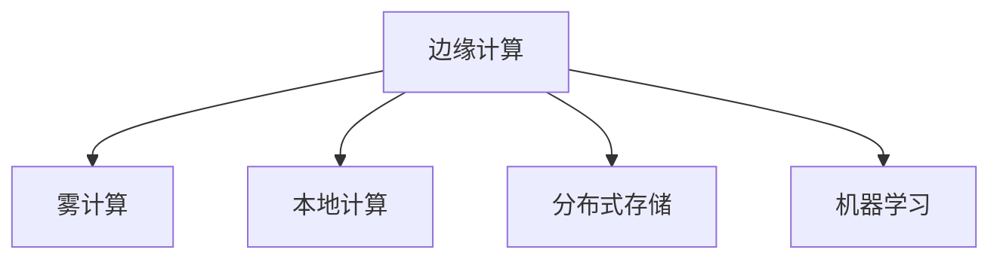

                 

## 1. 背景介绍

### 1.1 问题由来
随着物联网设备的普及和传感器数据的爆炸式增长，海量数据的实时处理和分析成为了一个巨大的挑战。传统集中式云计算架构在处理高实时性、低延迟的数据分析任务时，面临数据传输带宽受限、处理延迟较长等诸多问题。与此同时，边缘计算（Edge Computing）技术应运而生，以其在设备端就近处理数据的特性，成为了应对这些挑战的强大工具。

### 1.2 问题核心关键点
边缘计算的核心在于将数据处理任务分布到靠近数据源的设备端进行，通过在网络边缘节点（如智能手机、路由器、传感器等）上进行计算和存储，从而降低数据传输的延迟和带宽消耗，提升计算效率和实时性。与集中式云计算不同，边缘计算能够更好地支持对实时性和低延迟要求较高的场景，如智能家居、工业物联网、自动驾驶、实时视频监控等。

## 2. 核心概念与联系

### 2.1 核心概念概述

为更好地理解边缘计算在设备端进行数据分析的原理和架构，本节将介绍几个密切相关的核心概念：

- 边缘计算（Edge Computing）：一种分布式计算范式，将计算资源和服务部署到靠近数据源的本地设备上，从而减少数据传输时延，提升计算效率和实时性。
- 雾计算（Fog Computing）：作为边缘计算的扩展，雾计算进一步将边缘节点与云中心连接，以更好地实现数据存储和计算资源的管理。
- 本地计算（On-device Computation）：在设备本地进行计算和数据处理，显著降低对外部网络的依赖。
- 分布式存储（Distributed Storage）：将数据分布在多个节点上进行存储，以提高数据可用性和可靠性。
- 机器学习（Machine Learning）：在边缘计算环境中进行模型训练和推理，提升数据分析和决策的准确性和智能化。

这些核心概念之间的逻辑关系可以通过以下Mermaid流程图来展示：



这个流程图展示了几类边缘计算的关键技术和它们的相互联系：

1. 边缘计算通过将计算资源部署在设备本地，降低数据传输延迟。
2. 雾计算进一步将边缘节点与云中心连接，优化计算资源和数据存储的管理。
3. 本地计算在设备端直接进行计算和数据处理，减少对外部网络的依赖。
4. 分布式存储将数据分散在多个节点上存储，提高数据可用性和冗余性。
5. 机器学习在边缘计算环境中进行模型训练和推理，增强数据分析和决策的智能化。

这些核心概念共同构成了边缘计算的完整技术体系，使其能够更好地支持设备端的数据分析和实时处理。

## 3. 核心算法原理 & 具体操作步骤
### 3.1 算法原理概述

边缘计算中的数据分析任务通常采用分布式计算和本地计算相结合的方式。其核心思想是：在设备本地进行处理和存储，从而降低数据传输的延迟和带宽消耗，提升计算效率和实时性。

形式化地，假设数据集 $D=\{(x_i,y_i)\}_{i=1}^N, x_i \in \mathcal{X}, y_i \in \mathcal{Y}$。在边缘计算环境中，分布式存储将数据分布在 $M$ 个边缘节点上，每个节点 $m$ 上进行局部数据分析 $D_m=\{(x_i^m,y_i^m)\}_{i=1}^N$，然后将每个节点的分析结果汇总到中心节点 $C$ 进行全局聚合。

设局部模型为 $f_m(x_i^m)$，全局模型为 $f_G(x_i^G)$，则全局聚合的优化目标为：

$$
\min_{f_G} \sum_{m=1}^M \frac{1}{M} \sum_{i=1}^N (y_i^m - f_G(x_i^G))^2
$$

其中，$y_i^G = \frac{1}{M} \sum_{m=1}^M y_i^m$。通过求解上述优化问题，即可得到全局最优模型 $f_G^*$。

### 3.2 算法步骤详解

边缘计算中数据分析的算法步骤通常包括以下几个关键步骤：

**Step 1: 数据预处理与分割**
- 对原始数据进行预处理，包括去噪、归一化、特征选择等，提升数据质量。
- 将数据集 $D$ 分割为 $M$ 个子集，每个子集 $D_m$ 分配到不同的边缘节点 $m$ 上进行分析。

**Step 2: 局部数据分析**
- 在每个边缘节点 $m$ 上，使用分布式计算框架（如Apache Spark、Storm等）进行局部数据分析，得到局部模型 $f_m$。
- 可以使用各种机器学习算法（如线性回归、支持向量机、深度学习等）进行模型训练和推理。

**Step 3: 模型聚合与优化**
- 将各边缘节点的局部模型 $f_m$ 汇总到中心节点 $C$，进行全局聚合。
- 可以使用加权平均、平均值、加权加和等方法进行模型合并。
- 根据优化目标函数（如均方误差、交叉熵等），进一步优化全局模型 $f_G$。

**Step 4: 模型部署与应用**
- 将优化后的全局模型 $f_G^*$ 部署到所有边缘节点 $m$ 上，进行实时数据处理。
- 可以采用轻量级模型（如MobileNet、TensorFlow Lite等）以适应设备端的资源限制。

**Step 5: 持续监控与调整**
- 对模型性能进行持续监控，包括准确率、召回率、处理速度等。
- 根据监控结果，动态调整模型参数，或重新训练和部署模型。

以上是边缘计算环境中数据分析的一般流程。在实际应用中，还需要针对具体任务的特点，对算法步骤进行优化设计，如改进数据分割策略，引入更多的正则化技术，搜索最优的模型参数组合等，以进一步提升模型性能。

### 3.3 算法优缺点

边缘计算中的数据分析方法具有以下优点：
1. 降低数据传输延迟。在设备端进行数据处理，显著减少数据传输带宽消耗和时延，提升计算效率。
2. 提高计算实时性。分布式计算和本地计算相结合，能够快速响应用户请求，满足实时性和低延迟要求。
3. 优化资源利用。利用设备端的计算资源和存储资源，提升资源利用率，避免不必要的云中心资源浪费。

同时，该方法也存在一定的局限性：
1. 设备计算能力限制。边缘节点的计算资源和存储资源有限，难以处理大规模数据集和高复杂度的计算任务。
2. 数据隐私和安全问题。数据在设备端进行处理和存储，可能面临隐私泄露和数据篡改的风险。
3. 模型参数更新难度。由于边缘节点之间的通信时延和带宽限制，模型参数更新和同步较为困难。
4. 系统复杂性增加。边缘计算引入了多个设备节点和通信协议，增加了系统设计和管理的复杂性。

尽管存在这些局限性，但就目前而言，边缘计算在设备端进行数据分析的方法仍是最有效的技术手段之一。未来相关研究的重点在于如何进一步优化计算资源利用，提升数据隐私保护，以及降低模型参数更新难度，以实现更高效的边缘计算系统。

### 3.4 算法应用领域

边缘计算中的数据分析方法已经在诸多领域得到了广泛应用，例如：

- 智能家居：通过将数据分析任务分布在智能家居设备上，实时监控家庭环境，提升用户体验。
- 工业物联网：在工业设备上分布式进行数据分析，优化生产过程，提高设备利用率。
- 自动驾驶：在汽车上分布式进行数据处理，实时分析路况信息，提升驾驶安全性。
- 实时视频监控：在监控摄像头上分布式进行数据处理，快速响应用户请求，提升监控效率。
- 医疗诊断：在医疗设备上分布式进行数据分析，实时监测患者健康状况，辅助医生诊断。

除了上述这些经典应用外，边缘计算还将在更多场景中发挥重要作用，如智慧城市、农业监控、物流管理等，为各行各业带来更高的效率和更优质的服务。

## 4. 数学模型和公式 & 详细讲解 & 举例说明

### 4.1 数学模型构建

本节将使用数学语言对边缘计算中数据分析的过程进行更加严格的刻画。

假设数据集 $D=\{(x_i,y_i)\}_{i=1}^N, x_i \in \mathcal{X}, y_i \in \mathcal{Y}$，其中 $x_i$ 表示输入特征向量，$y_i$ 表示目标变量。

设分布式存储将数据集 $D$ 分割为 $M$ 个子集，每个子集 $D_m=\{(x_i^m,y_i^m)\}_{i=1}^N$，其中 $x_i^m$ 表示第 $m$ 个边缘节点的输入特征向量，$y_i^m$ 表示第 $m$ 个边缘节点的目标变量。

在每个边缘节点 $m$ 上，使用机器学习算法得到局部模型 $f_m(x_i^m)=w_m^T x_i^m+b_m$，其中 $w_m$ 表示第 $m$ 个边缘节点的权重向量，$b_m$ 表示偏置项。

设全局模型为 $f_G(x_i^G)=w_G^T x_i^G+b_G$，其中 $w_G$ 表示全局模型的权重向量，$b_G$ 表示全局模型的偏置项。

在全局聚合过程中，可以使用加权平均的方法，得到全局模型参数 $\hat{w}_G$ 和 $\hat{b}_G$：

$$
\hat{w}_G = \frac{1}{M} \sum_{m=1}^M w_m
$$

$$
\hat{b}_G = \frac{1}{M} \sum_{m=1}^M b_m
$$

全局模型 $f_G$ 的损失函数为：

$$
\mathcal{L}(f_G)=\frac{1}{N} \sum_{i=1}^N (y_i^G - f_G(x_i^G))^2
$$

全局模型的优化目标为：

$$
\min_{w_G,b_G} \mathcal{L}(f_G)
$$

### 4.2 公式推导过程

以下我们以线性回归模型为例，推导边缘计算中数据分析的全局优化问题。

假设每个边缘节点 $m$ 上，使用线性回归模型 $f_m(x_i^m)=w_m^T x_i^m+b_m$ 对数据 $D_m$ 进行拟合。全局聚合后的模型为 $f_G(x_i^G)=w_G^T x_i^G+b_G$，其中 $w_G=\frac{1}{M} \sum_{m=1}^M w_m$，$b_G=\frac{1}{M} \sum_{m=1}^M b_m$。

全局模型的损失函数为：

$$
\mathcal{L}(f_G)=\frac{1}{N} \sum_{i=1}^N (y_i^G - f_G(x_i^G))^2
$$

其中 $y_i^G = \frac{1}{M} \sum_{m=1}^M y_i^m$。

对 $w_G$ 和 $b_G$ 求偏导，得到：

$$
\frac{\partial \mathcal{L}(f_G)}{\partial w_G} = \frac{2}{N} \sum_{i=1}^N (y_i^G - \hat{y}_i^G) x_i^G
$$

$$
\frac{\partial \mathcal{L}(f_G)}{\partial b_G} = \frac{2}{N} \sum_{i=1}^N (y_i^G - \hat{y}_i^G)
$$

其中 $\hat{y}_i^G = w_G^T x_i^G+b_G$。

根据局部模型的最优解，可以得到全局最优解：

$$
w_G^* = \frac{1}{M} \sum_{m=1}^M w_m^*
$$

$$
b_G^* = \frac{1}{M} \sum_{m=1}^M b_m^*
$$

其中 $w_m^*$ 和 $b_m^*$ 为局部模型的最优解。

### 4.3 案例分析与讲解

以工业物联网（IIoT）为例，展示边缘计算在设备端进行数据分析的应用场景。

假设一个智能工厂生产线上有 $M=10$ 个传感器节点，每个节点收集的输入数据 $x_i^m$ 包含温度、湿度、压力等特征，输出目标变量 $y_i^m$ 表示是否发生异常。工厂希望在每个传感器节点上分布式进行数据分析，实时监测生产线的健康状况，及时发现并修复异常。

**数据预处理与分割：**
- 对传感器数据进行去噪、归一化等预处理，提升数据质量。
- 将数据集 $D$ 分割为 $M=10$ 个子集，每个子集 $D_m$ 分配到不同的传感器节点 $m$ 上进行分析。

**局部数据分析：**
- 在每个传感器节点 $m$ 上，使用线性回归模型 $f_m(x_i^m)=w_m^T x_i^m+b_m$ 对数据 $D_m$ 进行拟合，得到局部模型 $f_m(x_i^m)$。

**模型聚合与优化：**
- 将各传感器节点的局部模型 $f_m(x_i^m)$ 汇总到中央服务器上，进行全局聚合，得到全局模型 $f_G(x_i^G)$。
- 可以使用均方误差损失函数 $\mathcal{L}(f_G)=\frac{1}{N} \sum_{i=1}^N (y_i^G - f_G(x_i^G))^2$ 进行全局模型的优化。

**模型部署与应用：**
- 将优化后的全局模型 $f_G^*$ 部署到所有传感器节点 $m$ 上，进行实时数据处理。
- 可以采用轻量级模型（如TensorFlow Lite）以适应传感器端的资源限制。

通过边缘计算在设备端进行数据分析，智能工厂能够实时监测生产线状态，及时发现异常并进行处理，从而提高生产效率和产品质量。

## 5. 项目实践：代码实例和详细解释说明

### 5.1 开发环境搭建

在进行边缘计算中数据分析实践前，我们需要准备好开发环境。以下是使用Python进行TensorFlow进行边缘计算开发的环境配置流程：

1. 安装Anaconda：从官网下载并安装Anaconda，用于创建独立的Python环境。

2. 创建并激活虚拟环境：
```bash
conda create -n tf-env python=3.8 
conda activate tf-env
```

3. 安装TensorFlow：根据CUDA版本，从官网获取对应的安装命令。例如：
```bash
conda install tensorflow==2.7
```

4. 安装必要的工具包：
```bash
pip install numpy pandas sklearn scikit-learn matplotlib tensorflow-hub
```

5. 安装TensorFlow Lite：
```bash
pip install tensorflow-lite
```

完成上述步骤后，即可在`tf-env`环境中开始边缘计算中数据分析的实践。

### 5.2 源代码详细实现

下面我们以智能工厂生产线监测为例，给出使用TensorFlow进行边缘计算中数据分析的Python代码实现。

首先，定义数据预处理函数：

```python
import numpy as np
import pandas as pd
from sklearn.preprocessing import StandardScaler
from sklearn.model_selection import train_test_split

def preprocess_data(df, drop_cols=[]):
    # 删除无用的列
    df = df.drop(drop_cols, axis=1)
    # 去噪
    df = df.dropna()
    # 归一化
    scaler = StandardScaler()
    df = pd.DataFrame(scaler.fit_transform(df), columns=df.columns)
    return df
```

然后，定义局部数据分析函数：

```python
import tensorflow as tf
from tensorflow.keras.models import Sequential
from tensorflow.keras.layers import Dense

def local_data_analysis(X, y, model_type='linear_regression'):
    # 数据分割
    X_train, X_test, y_train, y_test = train_test_split(X, y, test_size=0.2, random_state=42)
    
    # 构建局部模型
    if model_type == 'linear_regression':
        model = Sequential()
        model.add(Dense(32, activation='relu', input_shape=(X_train.shape[1],)))
        model.add(Dense(1))
        model.compile(optimizer='adam', loss='mse')
    elif model_type == 'deep_learning':
        model = Sequential()
        model.add(Dense(32, activation='relu', input_shape=(X_train.shape[1],)))
        model.add(Dense(32, activation='relu'))
        model.add(Dense(1))
        model.compile(optimizer='adam', loss='mse')
    
    # 训练模型
    model.fit(X_train, y_train, epochs=10, batch_size=16, validation_data=(X_test, y_test))
    
    # 预测并返回模型参数
    w = model.get_weights()[0][0]
    b = model.get_weights()[0][1]
    return w, b
```

接着，定义模型聚合函数：

```python
def global_data_aggregation(local_models):
    # 计算全局模型参数
    w = np.mean([local_models[i]['w'] for i in range(len(local_models))], axis=0)
    b = np.mean([local_models[i]['b'] for i in range(len(local_models))], axis=0)
    
    return w, b
```

最后，启动训练流程并在测试集上评估：

```python
# 假设原始数据为pandas DataFrame格式
# 设置参数
num_local_nodes = 10
drop_cols = ['id', 'timestamp']
model_type = 'linear_regression'

# 预处理数据
X = preprocess_data(df, drop_cols)
y = df['status']

# 在每个本地节点上进行局部数据分析
local_models = []
for i in range(num_local_nodes):
    w, b = local_data_analysis(X.iloc[:, i], y)
    local_models.append({'w': w, 'b': b})

# 全局模型聚合
w_global, b_global = global_data_aggregation(local_models)

# 在本地节点上部署全局模型
for i in range(num_local_nodes):
    # 加载全局模型参数
    w_global = w_global[i]
    b_global = b_global[i]
    
    # 构建轻量级模型
    model = tf.keras.Sequential([
        tf.keras.layers.Dense(32, activation='relu', input_shape=(X.shape[1],)),
        tf.keras.layers.Dense(1)
    ])
    model.compile(optimizer='adam', loss='mse')
    model.set_weights([w_global, b_global])
    
    # 在本地节点上部署模型
    model.save('model.h5')
```

以上就是使用TensorFlow进行边缘计算中数据分析的完整代码实现。可以看到，得益于TensorFlow的强大封装，我们可以用相对简洁的代码完成边缘计算的分布式数据分析。

### 5.3 代码解读与分析

让我们再详细解读一下关键代码的实现细节：

**preprocess_data函数：**
- 删除无用的列。
- 去噪，删除缺失值。
- 归一化，使用标准化方法对数据进行归一化处理。

**local_data_analysis函数：**
- 对原始数据集进行数据分割。
- 根据指定的模型类型（如线性回归、深度学习等）构建局部模型。
- 训练模型，并返回模型参数。

**global_data_aggregation函数：**
- 计算全局模型参数，使用每个本地节点的模型参数进行加权平均。

**训练流程：**
- 定义全局和局部模型的参数。
- 在每个本地节点上构建局部模型，训练模型，并获取模型参数。
- 全局模型聚合，得到全局模型参数。
- 在每个本地节点上部署全局模型。

可以看到，TensorFlow结合分布式计算框架，使得边缘计算中数据分析的实现变得简洁高效。开发者可以将更多精力放在数据处理、模型改进等高层逻辑上，而不必过多关注底层的实现细节。

当然，工业级的系统实现还需考虑更多因素，如模型的保存和部署、超参数的自动搜索、更灵活的任务适配层等。但核心的边缘计算范式基本与此类似。

## 6. 实际应用场景

### 6.1 智能家居

边缘计算在智能家居中的应用场景多种多样。例如，智能音箱可以通过本地分析用户语音指令，实时响应用户需求，提升用户体验。

在技术实现上，可以收集用户的语音指令数据，将其作为输入，语音识别的输出作为目标变量，在本地音箱上分布式进行数据分析，得到局部模型。通过全局模型聚合，提升语音识别的准确性，并在本地音箱上部署优化后的模型，实现实时响应。

### 6.2 工业物联网

工业物联网（IIoT）领域，边缘计算也发挥着重要作用。在智能工厂中，传感器节点采集的数据可以就地进行分析，实时监测生产线的健康状况，及时发现并修复异常。

具体而言，可以收集传感器节点的输入数据，将其作为输入，是否发生异常作为目标变量，在每个传感器节点上分布式进行数据分析，得到局部模型。通过全局模型聚合，提升异常监测的准确性，并在每个传感器节点上部署优化后的模型，实现实时监测。

### 6.3 自动驾驶

自动驾驶是边缘计算的另一个重要应用场景。在自动驾驶汽车中，摄像头和传感器采集的数据可以就地进行分析，实时处理路况信息，提升驾驶安全性。

具体而言，可以收集摄像头和传感器采集的数据，将其作为输入，是否发生事故作为目标变量，在每个传感器节点上分布式进行数据分析，得到局部模型。通过全局模型聚合，提升事故监测的准确性，并在每个传感器节点上部署优化后的模型，实现实时处理。

### 6.4 未来应用展望

随着边缘计算技术的发展，其在设备端进行数据分析的应用前景广阔。未来，边缘计算将进一步融合物联网、人工智能、大数据等技术，构建更加智能、高效、安全的边缘计算系统。

在智慧城市治理中，边缘计算可以实现实时监控、智能调度、应急指挥等，提升城市管理的自动化和智能化水平。在智慧农业中，边缘计算可以实现智能灌溉、精准施肥、病虫害监测等功能，提升农业生产效率和质量。在智能医疗中，边缘计算可以实现实时监测、健康数据分析、辅助诊断等功能，提升医疗服务的智能化和个性化水平。

此外，边缘计算还将在更多场景中发挥重要作用，如智慧交通、环境保护、智能制造等，为各行各业带来更高的效率和更优质的服务。相信随着边缘计算技术的不断进步，其在设备端进行数据分析的应用将更加广泛和深入。

## 7. 工具和资源推荐

### 7.1 学习资源推荐

为了帮助开发者系统掌握边缘计算的理论基础和实践技巧，这里推荐一些优质的学习资源：

1. TensorFlow官方文档：TensorFlow作为目前最流行的分布式计算框架，提供了丰富的学习资源和实践样例，是学习边缘计算的重要参考资料。

2. Apache Spark教程：Apache Spark是分布式计算框架的代表，在边缘计算中的应用广泛。可以参考Spark的官方文档和教程，学习如何在边缘节点上进行分布式计算。

3. TensorFlow Lite官方文档：TensorFlow Lite是TensorFlow的轻量级版本，适用于设备端的应用场景。官方文档提供了详细的API和实现示例，是边缘计算中数据分析实践的必备工具。

4. Kubernetes官方文档：Kubernetes作为容器编排工具，能够实现边缘节点的自动化管理和资源调度。可以参考Kubernetes的官方文档，学习如何构建高效的边缘计算系统。

5. PyTorch官方文档：PyTorch作为目前最流行的深度学习框架，在边缘计算中的应用也较为广泛。官方文档提供了丰富的学习资源和实践样例，是学习边缘计算的重要参考资料。

通过对这些资源的学习实践，相信你一定能够快速掌握边缘计算的理论基础和实践技巧，并用于解决实际的设备端数据分析问题。

### 7.2 开发工具推荐

高效的开发离不开优秀的工具支持。以下是几款用于边缘计算中数据分析开发的常用工具：

1. TensorFlow：基于Python的开源深度学习框架，灵活动态的计算图，适合快速迭代研究。支持分布式计算和本地计算，是边缘计算中数据分析的主要工具。

2. PyTorch：基于Python的开源深度学习框架，灵活可扩展，支持分布式计算和本地计算，适用于边缘计算中的数据分析任务。

3. Apache Spark：分布式计算框架，支持多种数据处理任务，适用于边缘节点上的分布式计算。

4. Kubernetes：容器编排工具，能够实现边缘节点的自动化管理和资源调度，提升系统稳定性和可扩展性。

5. TensorFlow Lite：TensorFlow的轻量级版本，适用于设备端的应用场景，支持高效的模型部署和推理。

6. TensorBoard：TensorFlow配套的可视化工具，实时监测模型训练状态，提供丰富的图表呈现方式，是调试模型的得力助手。

合理利用这些工具，可以显著提升边缘计算中数据分析的开发效率，加快创新迭代的步伐。

### 7.3 相关论文推荐

边缘计算中数据分析的发展源于学界的持续研究。以下是几篇奠基性的相关论文，推荐阅读：

1. Leveraging the Cloud-Edge Data Co-Processing Paradigm for Wireless Sensor Networks: A Survey and Taxonomy（IEEE 2020）：全面介绍了云-边缘数据共处理范式在无线传感器网络中的应用，包括数据收集、存储、处理和分析等多个方面。

2. Adaptive Federated Learning via Dynamic Statistical Computation Model（ICML 2021）：提出了一种动态统计计算模型，用于在边缘设备上进行联邦学习，提升模型的训练效率和数据隐私保护。

3. A Survey on Edge Computing： comprehensive literature review of edge computing technologies, systems, and applications（IEEE 2021）：对边缘计算进行了全面的综述，涵盖技术、系统和应用等多个方面，为开发者提供了宝贵的参考资料。

4. Towards Highly-Efficient Edge Computation: A Survey and Analysis（TOMACS 2020）：从计算资源、存储资源、通信资源等多个角度，分析了边缘计算的效率问题，提出了多种优化策略。

这些论文代表了大规模数据共处理范式的最新研究成果，通过学习这些前沿成果，可以帮助研究者把握学科前进方向，激发更多的创新灵感。

## 8. 总结：未来发展趋势与挑战

### 8.1 总结

本文对基于边缘计算的设备端数据分析方法进行了全面系统的介绍。首先阐述了边缘计算和分布式计算的核心概念，明确了边缘计算在设备端进行数据分析的优势和挑战。其次，从原理到实践，详细讲解了边缘计算中数据分析的数学原理和关键步骤，给出了边缘计算的代码实例。同时，本文还广泛探讨了边缘计算在智能家居、工业物联网、自动驾驶等多个领域的应用前景，展示了边缘计算范式的巨大潜力。

通过本文的系统梳理，可以看到，边缘计算在设备端进行数据分析技术正在成为数据处理的重要手段，极大地提升了数据实时性和计算效率。伴随边缘计算技术的不断演进，其应用领域将更加广泛和深入，为各行各业带来更高的效率和更优质的服务。

### 8.2 未来发展趋势

展望未来，边缘计算中的数据分析技术将呈现以下几个发展趋势：

1. 计算资源和存储资源的优化。随着边缘计算设备的计算能力和存储能力的提升，能够支持更加复杂的数据处理任务。

2. 边缘计算和云计算的融合。边缘计算能够与云计算无缝集成，实现更加灵活的资源管理和任务调度。

3. 边缘计算和物联网的融合。边缘计算能够与物联网技术深度结合，实现更加智能化的数据采集和处理。

4. 边缘计算和人工智能的融合。边缘计算能够与人工智能技术结合，实现更加智能化的数据分析和决策。

5. 边缘计算和5G通信的融合。5G通信能够提供更高的传输速率和更低的延迟，进一步提升边缘计算的数据处理能力。

以上趋势凸显了边缘计算中数据分析技术的广阔前景。这些方向的探索发展，必将进一步提升边缘计算系统的性能和应用范围，为各行各业带来更高的效率和更优质的服务。

### 8.3 面临的挑战

尽管边缘计算在设备端进行数据分析的方法已经取得了显著进展，但在迈向更加智能化、普适化应用的过程中，它仍面临诸多挑战：

1. 计算资源限制。边缘节点的计算资源和存储资源有限，难以处理大规模数据集和高复杂度的计算任务。

2. 数据隐私和安全问题。数据在设备端进行处理和存储，可能面临隐私泄露和数据篡改的风险。

3. 系统复杂性增加。边缘计算引入了多个设备节点和通信协议，增加了系统设计和管理的复杂性。

4. 模型参数更新难度。由于边缘节点之间的通信时延和带宽限制，模型参数更新和同步较为困难。

尽管存在这些挑战，但边缘计算在设备端进行数据分析的应用前景广阔，随着相关技术的不断进步，相信能够逐步克服这些难题，推动边缘计算系统的更广泛应用。

### 8.4 研究展望

面向未来，边缘计算中数据分析技术的研究方向可以从以下几个方面进行探索：

1. 优化边缘计算架构。研究更加高效的边缘计算架构，提升计算资源和存储资源的利用效率。

2. 增强数据隐私保护。探索更加安全和可靠的数据加密、匿名化技术，保障数据隐私和安全。

3. 提升模型训练效率。研究更加高效的模型训练算法和优化方法，提升模型训练速度和收敛效果。

4. 提升边缘计算系统可靠性。研究边缘计算系统的故障检测、容错和恢复技术，提升系统可靠性和稳定性。

5. 探索边缘计算和人工智能的深度融合。研究如何更好地将边缘计算与人工智能技术结合，提升数据处理和分析的智能化水平。

6. 研究边缘计算在5G通信中的深度应用。探索5G通信技术在边缘计算中的应用，提升边缘计算的数据处理能力。

这些研究方向将推动边缘计算中数据分析技术的进一步发展，为各行各业带来更高的效率和更优质的服务。

## 9. 附录：常见问题与解答

**Q1：边缘计算和传统集中式计算有什么区别？**

A: 边缘计算和传统集中式计算的主要区别在于数据处理的位置。传统集中式计算将数据集中存储和处理，然后通过网络传输到应用端。而边缘计算将数据处理任务分布到靠近数据源的设备端进行，显著降低了数据传输时延和带宽消耗，提升了计算效率和实时性。

**Q2：边缘计算适用于哪些场景？**

A: 边缘计算适用于对实时性和低延迟要求较高的场景，如智能家居、工业物联网、自动驾驶、实时视频监控等。它能够将计算任务分布在设备本地进行，从而减少数据传输时延，提升计算效率和实时性。

**Q3：边缘计算有哪些优势？**

A: 边缘计算的主要优势包括：
1. 降低数据传输延迟：在设备本地进行数据处理，显著减少数据传输带宽消耗和时延，提升计算效率。
2. 提高计算实时性：分布式计算和本地计算相结合，能够快速响应用户请求，满足实时性和低延迟要求。
3. 优化资源利用：利用设备端的计算资源和存储资源，提升资源利用率，避免不必要的云中心资源浪费。

**Q4：边缘计算有哪些挑战？**

A: 边缘计算的主要挑战包括：
1. 计算资源限制：边缘节点的计算资源和存储资源有限，难以处理大规模数据集和高复杂度的计算任务。
2. 数据隐私和安全问题：数据在设备端进行处理和存储，可能面临隐私泄露和数据篡改的风险。
3. 系统复杂性增加：边缘计算引入了多个设备节点和通信协议，增加了系统设计和管理的复杂性。
4. 模型参数更新难度：由于边缘节点之间的通信时延和带宽限制，模型参数更新和同步较为困难。

尽管存在这些挑战，但边缘计算在设备端进行数据分析的应用前景广阔，随着相关技术的不断进步，相信能够逐步克服这些难题，推动边缘计算系统的更广泛应用。

---

作者：禅与计算机程序设计艺术 / Zen and the Art of Computer Programming

