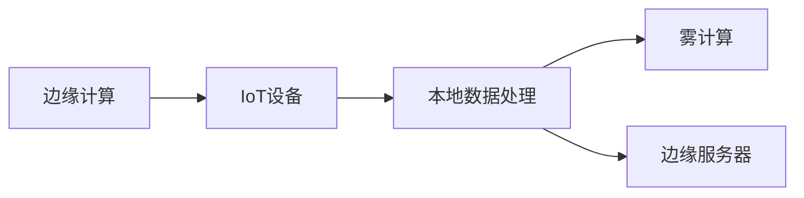

                 

# 边缘计算：IoT设备的本地数据处理技术

## 1. 背景介绍

### 1.1 问题由来
随着物联网(IoT)设备的普及，它们生成的海量数据正在对现有的云计算基础设施形成巨大压力。传统云计算范式下，设备收集到的数据都需要经过云端传输、存储和处理，这不仅导致延迟增加，而且增加了带宽和存储成本。为了改善数据处理的效率和减少延迟，边缘计算应运而生。边缘计算将数据处理放在设备本地进行，允许在本地进行更快速、更私密的处理，同时也减少了对云端的依赖。

### 1.2 问题核心关键点
边缘计算的本质是一种分布式计算架构，旨在将计算和数据处理任务迁移到设备端，减少对云端的依赖。这种架构可以显著降低延迟，提高处理速度，并确保数据处理的私密性和实时性。但同时，它也面临数据安全、网络带宽、计算资源等方面的挑战。

## 2. 核心概念与联系

### 2.1 核心概念概述

为更好地理解边缘计算及其与IoT设备本地数据处理的关系，本节将介绍几个密切相关的核心概念：

- **边缘计算(Edge Computing)**：一种分布式计算架构，通过将计算任务迁移到靠近数据源的设备上，减少数据传输延迟，提高处理速度和效率。边缘计算通常被部署在数据生成源附近，如智能终端、工业设备等。

- **IoT设备(IoT Devices)**：互联网连接的设备，如智能家居设备、工业传感器、车载设备等，它们能够收集并生成大量的实时数据。

- **本地数据处理(Local Data Processing)**：指在数据生成的设备端进行的数据处理和分析，而无需将数据传输到云端。

- **雾计算(Fog Computing)**：边缘计算的一种实现方式，通过在网络边缘层部署计算资源和数据存储，实现更快速、更可靠的数据处理。

- **边缘服务器(Edge Servers)**：部署在网络边缘的设备，通常包含计算、存储、通信等资源，用于处理和分析本地生成数据。

这些概念之间的逻辑关系可以通过以下Mermaid流程图来展示：



这个流程图展示边缘计算在IoT设备数据处理中的关键角色：

1. 边缘计算通过将计算任务迁移到数据源附近，减少数据传输延迟。
2. IoT设备负责数据生成，并将数据发送到边缘服务器。
3. 本地数据处理在边缘服务器上进行，可以实现更快速、更私密的处理。
4. 雾计算和边缘服务器为本地数据处理提供了必要的计算和存储资源。

## 3. 核心算法原理 & 具体操作步骤
### 3.1 算法原理概述

边缘计算的核心原理是通过将数据处理任务迁移到设备端，减少数据传输延迟，提高处理速度和效率。其核心思想是将计算和存储资源下沉到数据源附近，使得数据处理更加快速、灵活和私密。

在边缘计算范式下，IoT设备通常负责数据的收集和初步处理，而边缘服务器则负责更复杂的数据分析和计算任务。通过这种方式，边缘计算可以显著减少数据的传输带宽和延迟，同时保护数据隐私。

### 3.2 算法步骤详解

边缘计算的实现通常包括以下关键步骤：

**Step 1: 设备数据收集与初步处理**
- IoT设备通过传感器等组件收集数据，并进行初步的数据清洗和预处理。
- 数据通常被压缩、加密或打包，以减少传输带宽和提高传输效率。

**Step 2: 数据传输与边缘计算**
- 处理后的数据通过无线网络或有线网络传输到边缘服务器。
- 边缘服务器负责数据的存储、处理和分析，执行更复杂的计算任务。

**Step 3: 数据分析与决策制定**
- 边缘服务器对接收到的数据进行深入分析，提取有用信息。
- 根据分析结果，边缘服务器可以作出即时决策，如自动控制设备、优化性能等。

**Step 4: 数据回传与反馈**
- 边缘服务器将分析结果或必要的数据回传到云端，供更高级别的系统或人类用户使用。
- 系统可以基于云端反馈进一步优化边缘计算策略，实现闭环控制。

### 3.3 算法优缺点

边缘计算相对于传统云计算具有以下优点：

1. **低延迟**：数据处理在本地进行，减少了数据传输的时间和延迟。
2. **高私密性**：数据在本地处理，减少了数据传输过程中的暴露风险。
3. **网络带宽优化**：减少了对云端传输带宽的需求。
4. **可靠性和弹性**：分布式架构提高了系统的可靠性和容错能力。

但同时，边缘计算也面临以下挑战：

1. **计算资源有限**：边缘设备通常具有有限的计算和存储资源，可能无法处理所有任务。
2. **网络带宽限制**：边缘设备与边缘服务器之间的网络带宽有限，可能会影响数据传输效率。
3. **数据安全问题**：边缘设备可能面临数据泄露和攻击的风险。
4. **标准和互操作性**：不同厂商和设备之间可能存在兼容性问题。

## 4. 数学模型和公式 & 详细讲解 & 举例说明

### 4.1 数学模型构建

边缘计算的数学模型通常基于分布式系统的理论框架。假设IoT设备数量为 $N$，每个设备每秒生成 $r_i$ 个数据包，数据包大小为 $s$，设备到边缘服务器的数据传输速率为 $b$，边缘服务器的计算速率为 $c$，存储容量为 $S$。

定义 $C$ 为数据处理所需的时间，$T$ 为数据传输所需的时间，则 $C = \frac{S}{c}$，$T = \frac{N \times r_i \times s}{b}$。

### 4.2 公式推导过程

边缘计算的目标是最小化总处理时间和数据传输时间，即最小化 $C + T$。考虑数据传输和处理相互依赖，可以设置以下优化目标：

$$
\min \left\{ C + T \right\}
$$

根据数据传输和处理的物理约束，可以构建以下优化问题：

$$
\begin{align*}
\min \quad & C + T \\
\text{s.t.} \quad & C = \frac{S}{c} \\
\quad & T = \frac{N \times r_i \times s}{b} \\
\quad & S = \frac{N \times r_i \times s}{b} \times c
\end{align*}
$$

通过上述优化问题，可以推导出边缘计算最优的存储和计算资源分配策略。

### 4.3 案例分析与讲解

假设某智能工厂有10个IoT传感器，每秒生成10个数据包，每个数据包大小为1KB。每个传感器到边缘服务器的数据传输速率为1Mbps，边缘服务器的计算速率为10Mflops，存储容量为1GB。

1. **数据传输时间计算**：

$$
T = \frac{N \times r_i \times s}{b} = \frac{10 \times 10 \times 1000}{1,000,000} = 0.1\text{s}
$$

2. **数据处理时间计算**：

$$
C = \frac{S}{c} = \frac{1,000}{10,000,000} = 0.0001\text{s}
$$

3. **存储时间计算**：

$$
S = \frac{N \times r_i \times s}{b} \times c = 0.1 \times 10,000 = 1\text{GB}
$$

因此，边缘服务器需要分配1GB的存储容量，以支持数据处理和存储需求。

## 5. 项目实践：代码实例和详细解释说明
### 5.1 开发环境搭建

在进行边缘计算项目实践前，我们需要准备好开发环境。以下是使用Python进行PyTorch开发的环境配置流程：

1. 安装Anaconda：从官网下载并安装Anaconda，用于创建独立的Python环境。

2. 创建并激活虚拟环境：
```bash
conda create -n edge-env python=3.8 
conda activate edge-env
```

3. 安装PyTorch：根据CUDA版本，从官网获取对应的安装命令。例如：
```bash
conda install pytorch torchvision torchaudio cudatoolkit=11.1 -c pytorch -c conda-forge
```

4. 安装TensorBoard：
```bash
pip install tensorboard
```

5. 安装Flask：
```bash
pip install flask
```

6. 安装requests：
```bash
pip install requests
```

完成上述步骤后，即可在`edge-env`环境中开始边缘计算实践。

### 5.2 源代码详细实现

下面我们以边缘计算在智能工厂中的应用为例，给出使用PyTorch进行边缘计算的PyTorch代码实现。

首先，定义IoT传感器和边缘服务器：

```python
class Sensor:
    def __init__(self, id, generate_rate, packet_size):
        self.id = id
        self.generate_rate = generate_rate
        self.packet_size = packet_size

class EdgeServer:
    def __init__(self, compute_rate, storage_capacity):
        self.compute_rate = compute_rate
        self.storage_capacity = storage_capacity
```

然后，定义IoT传感器生成数据、计算和存储数据、以及边缘服务器接收和处理数据：

```python
import random

class Sensor:
    def __init__(self, id, generate_rate, packet_size):
        self.id = id
        self.generate_rate = generate_rate
        self.packet_size = packet_size

    def generate_packet(self):
        return bytes(random.randint(0, 255), encoding='utf-8')

class EdgeServer:
    def __init__(self, compute_rate, storage_capacity):
        self.compute_rate = compute_rate
        self.storage_capacity = storage_capacity

    def receive_data(self, sensor, data):
        self.storage_capacity -= len(data)
        self.compute_rate -= len(data) / (sensor.packet_size / 1000)  # 转换为每秒生成数据包数

    def process_data(self, data):
        self.compute_rate -= len(data) / (sensor.packet_size / 1000)  # 转换为每秒生成数据包数
        processed_data = [byte for byte in data]
        return processed_data

    def release_resources(self):
        self.storage_capacity = 1 * 1024 * 1024 * 1024  # 恢复存储容量
        self.compute_rate = 1  # 恢复计算速率
```

接着，定义IoT设备数量和网络传输速率，以及边缘服务器的计算速率和存储容量：

```python
num_sensors = 10
generate_rate = 10  # 每秒生成数据包数
packet_size = 1000  # 每个数据包的大小，以字节为单位

compute_rate = 10 * 1024 * 1024  # 每秒处理的计算量，以字节为单位
storage_capacity = 1 * 1024 * 1024 * 1024  # 边缘服务器的存储容量，以字节为单位
data_transfer_rate = 1 * 1024 * 1024  # 数据传输速率，以字节为单位
```

最后，启动数据生成、传输和处理流程：

```python
sensors = [Sensor(i, generate_rate, packet_size) for i in range(num_sensors)]
server = EdgeServer(compute_rate, storage_capacity)

for sensor in sensors:
    while True:
        data = sensor.generate_packet()
        server.receive_data(sensor, data)
        if server.storage_capacity <= 0:
            break
        processed_data = server.process_data(data)
        server.release_resources()
```

### 5.3 代码解读与分析

让我们再详细解读一下关键代码的实现细节：

**Sensor类**：
- `__init__`方法：初始化传感器编号、每秒生成数据包数和数据包大小。
- `generate_packet`方法：生成随机字节数据包。

**EdgeServer类**：
- `__init__`方法：初始化边缘服务器的计算速率和存储容量。
- `receive_data`方法：接收传感器发送的数据，更新存储容量和计算速率。
- `process_data`方法：处理数据，更新计算速率。
- `release_resources`方法：释放计算和存储资源。

**IoT设备数量和网络传输速率的设定**：
- `num_sensors`表示IoT设备数量。
- `generate_rate`和`packet_size`分别表示每秒生成数据包数和数据包大小。
- `compute_rate`和`storage_capacity`分别表示边缘服务器的计算速率和存储容量。
- `data_transfer_rate`表示数据传输速率。

**数据生成、传输和处理流程**：
- 创建IoT设备对象，并循环生成数据。
- 发送数据到边缘服务器，并更新边缘服务器的存储和计算速率。
- 处理数据，并释放边缘服务器的资源。

可以看到，通过简化模型和算法，我们能够直观地展示边缘计算在IoT设备数据处理中的应用。

## 6. 实际应用场景
### 6.1 智能工厂

在智能工厂中，边缘计算可以用于实时监控和优化生产线的各个环节。例如，传感器可以收集设备的运行状态数据，边缘服务器可以实时分析这些数据，及时发现设备故障或性能异常，并自动调整生产参数，保证生产线的稳定运行。

具体而言，传感器可以部署在机器、自动化生产线、仓库等位置，收集数据并发送到边缘服务器。边缘服务器通过算法处理这些数据，得出生产线的运行状态评估，并根据评估结果进行相应的控制操作。

### 6.2 智能交通

在智能交通领域，边缘计算可以用于实时监测和管理交通流量。例如，传感器可以安装在路面上、车辆内部、交通信号灯等位置，收集交通状态数据，边缘服务器可以实时分析这些数据，并根据分析结果动态调整交通信号灯的时长，优化交通流量，减少拥堵。

具体而言，传感器可以收集车辆速度、车流量、信号灯状态等信息，并将数据发送到边缘服务器。边缘服务器通过算法处理这些数据，得出当前的交通状态评估，并根据评估结果动态调整交通信号灯的时长，优化交通流量。

### 6.3 智慧城市

在智慧城市中，边缘计算可以用于实时监控和管理城市环境。例如，传感器可以安装在城市各个角落，收集环境数据，边缘服务器可以实时分析这些数据，并根据分析结果进行相应的控制操作，如调整照明、控制交通、监测空气质量等。

具体而言，传感器可以收集空气质量、水质、气象信息等数据，并将数据发送到边缘服务器。边缘服务器通过算法处理这些数据，得出城市环境的状态评估，并根据评估结果进行相应的控制操作，如调整照明、控制交通、监测空气质量等。

### 6.4 未来应用展望

随着边缘计算技术的发展和应用场景的不断拓展，其在IoT设备本地数据处理中的应用前景广阔。未来，边缘计算将会在更多领域得到应用，为各行各业带来变革性影响。

在智慧医疗领域，边缘计算可以用于实时监测和管理患者的健康数据，通过分析这些数据，预测病情变化，提供个性化的医疗服务。

在智能家居领域，边缘计算可以用于实时控制和管理家庭设备，通过分析这些数据，提高家居生活的便利性和舒适度。

在智能农业领域，边缘计算可以用于实时监测和管理农作物的生长情况，通过分析这些数据，优化农业生产，提高产量和质量。

此外，在智慧金融、智能物流、智慧教育等众多领域，边缘计算的应用也将不断涌现，为各行业带来新的发展机遇。

## 7. 工具和资源推荐
### 7.1 学习资源推荐

为了帮助开发者系统掌握边缘计算和IoT设备本地数据处理的技术，这里推荐一些优质的学习资源：

1. **《Edge Computing: Principles and Applications》**：这本书深入浅出地介绍了边缘计算的基本概念、架构和应用场景，适合初学者和进阶开发者阅读。

2. **Coursera的《Edge Computing and the Internet of Things》课程**：由伯克利大学开设的课程，介绍了边缘计算和IoT设备的基础知识，通过实际案例展示了边缘计算的应用。

3. **《IoT Data Processing with Edge Computing》书籍**：这本书介绍了IoT设备数据处理在边缘计算环境下的方法和技术，涵盖了数据传输、存储、计算等多个方面。

4. **GitHub的Edge Computing项目**：GitHub上有很多开源的边缘计算项目，包括IoT设备数据处理、实时分析、边缘服务器部署等，可以学习实际的开发案例。

通过对这些资源的学习实践，相信你一定能够快速掌握边缘计算和IoT设备本地数据处理的核心技术，并应用于实际开发中。

### 7.2 开发工具推荐

高效的开发离不开优秀的工具支持。以下是几款用于边缘计算和IoT设备本地数据处理开发的常用工具：

1. **AWS IoT**：Amazon Web Services提供的IoT解决方案，支持边缘计算设备的连接和管理，提供了丰富的API和SDK。

2. **Azure IoT Hub**：Microsoft Azure提供的IoT解决方案，支持边缘计算设备的连接和管理，提供了强大的分析和处理能力。

3. **Raspberry Pi**：一种廉价且功能强大的边缘计算设备，可以方便地部署IoT设备和边缘服务器，支持多种编程语言和操作系统。

4. **TensorBoard**：TensorFlow配套的可视化工具，可以实时监测边缘计算系统的运行状态，提供丰富的图表和指标。

5. **Flask**：一种轻量级的Web框架，适合开发边缘计算设备的数据传输和处理接口，支持RESTful API。

6. **OpenStack**：开源的云计算平台，支持边缘计算环境下的资源管理和部署，提供了强大的计算和存储能力。

合理利用这些工具，可以显著提升边缘计算和IoT设备本地数据处理的开发效率，加快创新迭代的步伐。

### 7.3 相关论文推荐

边缘计算和IoT设备本地数据处理的研究源于学界的持续探索。以下是几篇奠基性的相关论文，推荐阅读：

1. **"Edge Computing: A Survey"**：这篇综述论文系统介绍了边缘计算的基本概念、架构和应用场景，适合深入了解边缘计算的学术背景。

2. **"Real-Time Data Processing in the Edge"**：这篇论文介绍了在边缘计算环境下的实时数据处理技术，包括数据传输、存储和计算等多个方面。

3. **"IoT Data Processing with Edge Computing"**：这篇论文介绍了IoT设备数据处理在边缘计算环境下的方法和技术，涵盖了数据传输、存储、计算等多个方面。

4. **"Edge Computing: Principles and Applications"**：这篇书籍深入浅出地介绍了边缘计算的基本概念、架构和应用场景，适合初学者和进阶开发者阅读。

5. **"Edge Computing: A New Paradigm for IoT Applications"**：这篇论文探讨了边缘计算在IoT应用中的优势和挑战，提出了一种新的IoT数据处理范式。

这些论文代表了大规模边缘计算和IoT设备本地数据处理的研究方向。通过学习这些前沿成果，可以帮助研究者把握学科前进方向，激发更多的创新灵感。

## 8. 总结：未来发展趋势与挑战

### 8.1 总结

本文对边缘计算及其在IoT设备本地数据处理中的应用进行了全面系统的介绍。首先阐述了边缘计算的基本概念、架构和核心原理，明确了其在IoT设备数据处理中的重要角色。其次，从原理到实践，详细讲解了边缘计算的数学模型和算法步骤，给出了具体的代码实现。同时，本文还探讨了边缘计算在多个实际应用场景中的应用前景，展示了其广阔的应用潜力。此外，本文精选了边缘计算的各类学习资源，力求为读者提供全方位的技术指引。

通过本文的系统梳理，可以看到，边缘计算技术正在成为IoT设备数据处理的重要范式，极大地提升了数据处理的效率和隐私性。未来，伴随边缘计算技术的持续演进，IoT设备本地数据处理必将迎来更多创新应用，为各行各业带来新的发展机遇。

### 8.2 未来发展趋势

展望未来，边缘计算技术将呈现以下几个发展趋势：

1. **设备智能化**：越来越多的IoT设备将具备计算和存储能力，能够本地处理部分数据，减轻边缘服务器的负担。
2. **网络优化**：5G和物联网技术的发展将进一步优化数据传输速率和稳定性，提高边缘计算的效率。
3. **边缘计算平台**：边缘计算平台将更加标准化和模块化，支持多种编程语言和应用场景。
4. **多云协同**：边缘计算和云端计算将更加紧密地协同工作，实现数据处理的无缝衔接和优化。
5. **边缘人工智能**：边缘计算与人工智能技术的结合，将提升IoT设备的数据处理和分析能力。

这些趋势凸显了边缘计算技术的广阔前景。这些方向的探索发展，必将进一步提升IoT设备本地数据处理的效率和灵活性，为各行业带来新的发展机遇。

### 8.3 面临的挑战

尽管边缘计算技术已经取得了瞩目成就，但在迈向更加智能化、普适化应用的过程中，它仍面临诸多挑战：

1. **计算资源限制**：边缘设备的计算和存储资源有限，可能无法处理所有任务。
2. **网络带宽限制**：边缘设备与边缘服务器之间的网络带宽有限，可能会影响数据传输效率。
3. **数据安全问题**：边缘设备可能面临数据泄露和攻击的风险。
4. **标准和互操作性**：不同厂商和设备之间可能存在兼容性问题。

## 8.4 研究展望

面对边缘计算面临的种种挑战，未来的研究需要在以下几个方面寻求新的突破：

1. **资源优化**：开发更加资源高效的边缘计算算法，如分布式算法、混合计算等，优化计算和存储资源的分配。
2. **网络优化**：研究边缘计算与5G、物联网等新兴技术结合，进一步提升数据传输速率和稳定性。
3. **安全防护**：开发边缘计算中的数据加密和认证技术，增强数据安全性和隐私保护。
4. **标准制定**：推动边缘计算的标准化和规范化，促进不同厂商和设备之间的互操作性。
5. **边缘人工智能**：结合边缘计算与人工智能技术，提升IoT设备的数据处理和分析能力。

这些研究方向将引领边缘计算技术迈向更高的台阶，为各行业带来新的发展机遇。相信随着学界和产业界的共同努力，边缘计算必将在IoT设备本地数据处理中发挥更大的作用，推动各行各业数字化转型升级。

## 9. 附录：常见问题与解答

**Q1：边缘计算是否适用于所有IoT设备？**

A: 边缘计算技术适用于处理资源有限的IoT设备，尤其是需要实时数据处理的场景。但并不是所有IoT设备都适合边缘计算，例如对于需要高精度数据存储的设备，可能需要更强大的云存储支持。

**Q2：边缘计算如何优化计算资源分配？**

A: 边缘计算通过分布式算法和资源调度策略，将计算任务合理分配到不同设备上。例如，可以采用多级边缘计算架构，将数据处理任务按层级分发到不同级别的边缘节点，优化资源利用率。

**Q3：边缘计算如何提升数据传输效率？**

A: 边缘计算通过在设备本地进行数据处理，减少了数据传输的带宽和时间延迟。同时，可以采用压缩算法和数据缓存技术，进一步优化数据传输效率。

**Q4：边缘计算中的数据安全问题如何解决？**

A: 边缘计算中的数据安全问题可以通过数据加密、访问控制、认证等手段进行保护。同时，可以采用分布式共识算法和区块链技术，确保数据的安全性和完整性。

**Q5：边缘计算如何与云端计算协同工作？**

A: 边缘计算与云端计算可以通过API接口和消息队列等方式进行协同工作。边缘计算负责实时数据处理，云端计算负责大数据分析、机器学习等复杂任务，实现数据处理的无缝衔接和优化。

---

作者：禅与计算机程序设计艺术 / Zen and the Art of Computer Programming

