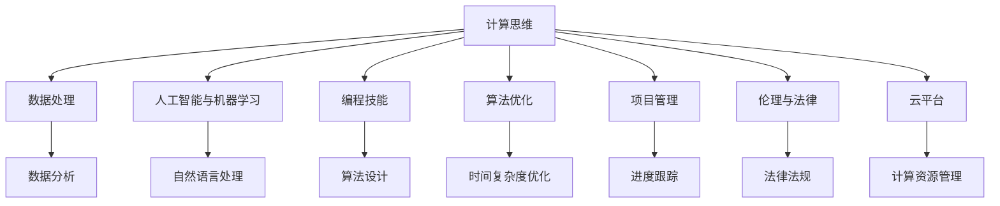

                 

# 迎接未来挑战：人类计算时代的技能需求

> 关键词：计算思维, 数据处理, 人工智能, 编程技能, 算法优化, 项目管理, 伦理与法律, 云平台

## 1. 背景介绍

### 1.1 问题由来

随着计算技术的发展，我们即将步入一个以数据为核心驱动力的“人类计算时代”。在这个时代，计算不仅仅是计算机或数据中心的事情，而是各行各业、各行各业、每个组织、每个人都在进行的日常活动。而随着技术的不断进步，计算机系统、软件工具、人工智能和算法的重要性越来越强，计算能力越来越成为推动社会进步的关键因素。

计算技术已经成为我们日常生活的一部分。无论是智能手机、智能家居、自动驾驶汽车、在线游戏、金融分析、医疗诊断、环境保护，还是社交媒体，几乎所有的行业和领域都在使用计算技术来优化和自动化其业务流程。

### 1.2 问题核心关键点

面对即将到来的“人类计算时代”，计算技能将变得越来越重要。这就意味着计算技能将是未来就业市场中的关键技能之一。因此，理解计算思维的重要性，掌握计算技能，对于未来的职业发展至关重要。

具体来说，以下几个方面是关键点：

- **计算思维**：理解并运用算法、数据结构、复杂性理论等概念。
- **数据处理**：处理和分析大量数据的能力。
- **人工智能与机器学习**：了解和应用人工智能算法，能够解决实际问题。
- **编程技能**：掌握至少一种或多种编程语言。
- **算法优化**：优化算法，提高程序效率。
- **项目管理**：理解项目管理的原则和方法，能够管理复杂的计算项目。
- **伦理与法律**：理解计算技术的伦理和社会影响，遵守相关法律法规。
- **云平台**：能够使用云计算平台，处理大规模数据和分布式计算。

这些技能点综合起来，将形成一个人类计算时代必备的核心竞争力。

### 1.3 问题研究意义

在即将到来的“人类计算时代”，这些技能的掌握将使个体和组织能够更好地利用计算资源，解决实际问题，从而提升生产效率，推动创新，创造更多的社会价值。

- **个体竞争力的提升**：掌握这些技能，可以更好地适应未来的工作环境，提升职业发展潜力。
- **组织创新能力的增强**：通过算法优化和人工智能的运用，可以开发出更有效的产品和服务，提升市场竞争力。
- **社会效益的实现**：通过计算技术，可以解决一些复杂的社会问题，如环境保护、医疗健康等。

## 2. 核心概念与联系

### 2.1 核心概念概述

计算思维是指一种解决计算问题的思维方式，包括抽象、设计、算法、数据结构、复杂性理论等概念。计算思维的掌握能够帮助人们理解计算技术的本质，以及如何利用计算技术解决实际问题。

数据处理是计算中非常重要的一部分，处理和分析大量数据的能力是解决复杂问题的基础。数据处理包括了数据清洗、数据预处理、数据分析、数据可视化和数据挖掘等环节。

人工智能与机器学习是指使用算法和数据来构建智能系统的过程，能够实现自动化的决策和任务执行。AI与ML的应用涵盖了自然语言处理、计算机视觉、语音识别、推荐系统、机器翻译等领域。

编程技能是指理解和应用一种或多种编程语言的能力。编程技能不仅仅是编写代码，更包括算法和数据结构的理解和设计。

算法优化是指通过分析和改进算法，提高程序效率和性能。算法优化包括了时间复杂度、空间复杂度的分析和优化，以及并行计算和分布式计算等技术的应用。

项目管理是指管理和监控计算项目的过程，包括了需求分析、计划制定、资源分配、进度跟踪、风险管理等环节。

伦理与法律是指理解计算技术的伦理和社会影响，以及遵守相关法律法规的能力。

云平台是指使用云计算平台进行计算资源管理和数据处理的能力。云平台提供了强大的计算能力和灵活性，支持分布式计算和大数据处理。

### 2.2 核心概念原理和架构的 Mermaid 流程图



这个流程图展示了各个核心概念之间的关系和相互作用。

## 3. 核心算法原理 & 具体操作步骤

### 3.1 算法原理概述

计算技能的核心是算法，算法是指解决问题的一系列步骤。计算思维中的算法包括了递归算法、贪心算法、动态规划、图算法、回溯算法等。这些算法在不同的问题场景中都有着广泛的应用。

数据处理中的算法包括了排序算法、搜索算法、聚类算法、分类算法等。这些算法可以用于数据的预处理、分析和可视化。

人工智能与机器学习中的算法包括了监督学习、无监督学习、半监督学习、强化学习等。这些算法可以用于构建智能系统，实现自动化决策和任务执行。

编程技能中的算法包括了面向对象编程、函数式编程、并发编程、分布式编程等。这些算法可以用于设计高效的程序和系统。

算法优化中的算法包括了时间复杂度分析和优化、空间复杂度分析和优化、并行计算和分布式计算等。这些算法可以用于提高程序和系统的效率。

项目管理中的算法包括了任务调度算法、资源分配算法、进度跟踪算法、风险管理算法等。这些算法可以用于管理复杂的计算项目。

伦理与法律中的算法包括了伦理评估算法、法律合规算法等。这些算法可以用于确保计算技术的伦理和社会影响。

云平台中的算法包括了负载均衡算法、数据分区算法、容错算法等。这些算法可以用于管理和优化云计算平台。

### 3.2 算法步骤详解

算法步骤详解包括了算法的定义、分析、设计和实现等环节。以下是一些关键步骤：

- **算法定义**：明确算法的功能和输入输出。
- **算法分析**：分析算法的复杂度和效率，确保算法的可行性。
- **算法设计**：根据问题需求，设计出合理的算法。
- **算法实现**：将算法转化为可执行的代码。
- **算法测试**：对算法进行测试和验证，确保算法正确性和性能。

### 3.3 算法优缺点

计算技能的核心是算法，算法的优缺点直接影响了计算能力的应用效果。以下是一些常见算法的优缺点：

#### 优点

- **高效性**：高效的算法可以显著提高计算效率，减少计算时间和资源消耗。
- **可扩展性**：可扩展的算法可以应对大规模数据和复杂问题，具有良好的应用前景。
- **可维护性**：可维护的算法可以方便地修改和优化，确保算法的长期适用性。

#### 缺点

- **复杂性**：复杂的算法可能难以理解和实现，需要较高的专业技能。
- **可读性差**：一些复杂的算法代码难以阅读和理解，维护难度较大。
- **资源消耗大**：一些高效的算法可能需要较多的计算资源和存储空间，不适合所有场景。

### 3.4 算法应用领域

计算技能的应用领域非常广泛，涵盖了各个行业和领域。以下是一些关键应用领域：

- **自然语言处理**：包括文本分析、语言生成、机器翻译、情感分析等。
- **计算机视觉**：包括图像识别、图像处理、目标检测、图像生成等。
- **智能推荐**：包括推荐系统、个性化推荐、广告推荐等。
- **数据挖掘**：包括数据预处理、数据分析、数据可视化等。
- **金融分析**：包括风险评估、投资分析、财务报表分析等。
- **医疗健康**：包括病历分析、诊断辅助、药物研发等。
- **环境保护**：包括环境监测、气候预测、资源管理等。
- **社交媒体**：包括舆情分析、用户行为分析、内容推荐等。

## 4. 数学模型和公式 & 详细讲解 & 举例说明

### 4.1 数学模型构建

数学模型是指用数学语言描述现实问题的模型，是计算技能的重要基础。以下是一个简单的数学模型构建示例：

假设有一组数据集 $D=\{(x_1,y_1),(x_2,y_2),...(x_n,y_n)\}$，其中 $x_i$ 是输入特征，$y_i$ 是输出结果。我们的目标是构建一个函数 $f(x)$，使得 $f(x)$ 能够根据输入特征 $x$ 预测输出结果 $y$。

### 4.2 公式推导过程

假设 $f(x)$ 是一个线性函数，即 $f(x)=w_1x_1+w_2x_2+...+w_nx_n+b$，其中 $w_i$ 是权重，$b$ 是偏置。

为了最小化预测误差，我们定义损失函数 $L(y,f(x))$，例如均方误差损失函数：

$$
L(y,f(x))=\frac{1}{2}\sum_{i=1}^{n}(y_i-f(x_i))^2
$$

我们的目标是找到一组权重 $w$，使得 $L(y,f(x))$ 最小化。为此，我们可以定义目标函数 $J(w)$：

$$
J(w)=\frac{1}{2}\sum_{i=1}^{n}(y_i-f(x_i))^2
$$

然后使用梯度下降法等优化算法求解 $J(w)$，得到最优的权重 $w$。

### 4.3 案例分析与讲解

以下是一个简单的案例分析：

假设我们有一组学生数据集，包括学生的性别、年龄、成绩等特征，以及他们是否通过考试的标签。我们的目标是构建一个预测模型，根据学生的特征预测他们是否会通过考试。

我们可以构建一个线性回归模型，使用学生的性别、年龄、成绩等特征作为输入，使用一个权重向量 $w$ 和一个偏置 $b$ 进行预测。我们的目标是找到最优的权重 $w$ 和偏置 $b$，使得预测结果与真实结果的误差最小化。

使用梯度下降法，我们可以求解目标函数 $J(w)$，得到最优的权重 $w$ 和偏置 $b$。然后将得到的权重向量 $w$ 和偏置 $b$ 应用到新的学生数据上，预测他们是否会通过考试。

## 5. 项目实践：代码实例和详细解释说明

### 5.1 开发环境搭建

在项目实践前，我们需要准备好开发环境。以下是使用Python进行PyTorch开发的环境配置流程：

1. 安装Anaconda：从官网下载并安装Anaconda，用于创建独立的Python环境。

2. 创建并激活虚拟环境：
```bash
conda create -n pytorch-env python=3.8 
conda activate pytorch-env
```

3. 安装PyTorch：根据CUDA版本，从官网获取对应的安装命令。例如：
```bash
conda install pytorch torchvision torchaudio cudatoolkit=11.1 -c pytorch -c conda-forge
```

4. 安装Transformers库：
```bash
pip install transformers
```

5. 安装各类工具包：
```bash
pip install numpy pandas scikit-learn matplotlib tqdm jupyter notebook ipython
```

完成上述步骤后，即可在`pytorch-env`环境中开始项目实践。

### 5.2 源代码详细实现

这里我们以线性回归为例，给出使用PyTorch进行数据处理和模型训练的代码实现。

首先，定义数据集：

```python
import torch
import torch.nn as nn
from torch.utils.data import Dataset
from torch.utils.data import DataLoader

class StudentDataset(Dataset):
    def __init__(self, data, labels):
        self.data = data
        self.labels = labels
    
    def __len__(self):
        return len(self.data)
    
    def __getitem__(self, idx):
        return self.data[idx], self.labels[idx]
```

然后，定义模型和损失函数：

```python
class LinearRegression(nn.Module):
    def __init__(self, input_dim, output_dim):
        super(LinearRegression, self).__init__()
        self.linear = nn.Linear(input_dim, output_dim)
    
    def forward(self, x):
        return self.linear(x)

model = LinearRegression(3, 1)

criterion = nn.MSELoss()
```

接着，定义训练函数：

```python
def train_model(model, data_loader, criterion, optimizer, num_epochs):
    for epoch in range(num_epochs):
        for data, target in data_loader:
            optimizer.zero_grad()
            output = model(data)
            loss = criterion(output, target)
            loss.backward()
            optimizer.step()
```

最后，启动训练流程并在测试集上评估：

```python
# 准备训练数据
train_data = torch.randn(100, 3)
train_labels = train_data * 0.5 + 0.5

# 准备测试数据
test_data = torch.randn(10, 3)
test_labels = test_data * 0.5 + 0.5

# 定义训练参数
num_epochs = 100
learning_rate = 0.01

# 定义优化器
optimizer = torch.optim.SGD(model.parameters(), lr=learning_rate)

# 定义数据集和数据加载器
train_dataset = StudentDataset(train_data, train_labels)
test_dataset = StudentDataset(test_data, test_labels)

train_loader = DataLoader(train_dataset, batch_size=1)
test_loader = DataLoader(test_dataset, batch_size=1)

# 训练模型
train_model(model, train_loader, criterion, optimizer, num_epochs)

# 评估模型
test_data = torch.tensor([[0.5, 1.5, 2.5]])
test_labels = torch.tensor([[0.5]])
output = model(test_data)
print(output.item())
```

以上就是一个使用PyTorch进行线性回归的完整代码实现。可以看到，PyTorch的封装和易用性使得算法实现变得简洁高效。

### 5.3 代码解读与分析

让我们再详细解读一下关键代码的实现细节：

**StudentDataset类**：
- `__init__`方法：初始化数据和标签。
- `__len__`方法：返回数据集的大小。
- `__getitem__`方法：返回数据集的一个样本。

**LinearRegression类**：
- `__init__`方法：定义模型的权重和偏置。
- `forward`方法：前向传播，计算输出结果。

**train_model函数**：
- 循环训练模型，每个epoch循环训练所有样本。
- 使用优化器更新模型参数。

**训练流程**：
- 准备训练数据和测试数据。
- 定义训练参数和优化器。
- 定义数据集和数据加载器。
- 训练模型。
- 评估模型。

可以看到，PyTorch使得模型训练的实现变得简洁高效，开发者可以将更多精力放在算法优化和数据处理等高层逻辑上。

当然，工业级的系统实现还需考虑更多因素，如模型的保存和部署、超参数的自动搜索、更灵活的任务适配层等。但核心的计算思维和算法实现基本与此类似。

## 6. 实际应用场景

### 6.1 智能推荐系统

智能推荐系统是计算技能的重要应用场景之一。推荐系统可以基于用户的历史行为数据，推荐用户可能感兴趣的商品、文章、视频等。

在技术实现上，可以使用协同过滤、内容推荐、混合推荐等算法，通过分析用户和物品的特征，构建用户和物品的相似度矩阵，从而推荐用户可能感兴趣的物品。

### 6.2 数据挖掘

数据挖掘是计算技能的重要应用场景之一。数据挖掘可以从大量数据中提取有价值的信息，帮助决策者做出更好的决策。

在技术实现上，可以使用聚类算法、分类算法、回归算法、关联规则算法等，对数据进行预处理、分析和可视化，从而发现数据中的规律和趋势。

### 6.3 智能客服

智能客服是计算技能的重要应用场景之一。智能客服可以基于自然语言处理和机器学习技术，自动回答用户的问题，提供24小时不间断的服务。

在技术实现上，可以使用意图识别、实体识别、对话系统等技术，构建一个能够理解用户意图并生成自然语言回复的智能客服系统。

### 6.4 未来应用展望

随着计算技能的发展，未来将会有更多的应用场景被开发出来。以下是一些未来应用展望：

- **自动驾驶**：使用计算技能，实现自动驾驶技术，提升交通安全和效率。
- **智能医疗**：使用计算技能，实现疾病诊断、治疗方案推荐等，提升医疗服务质量。
- **金融分析**：使用计算技能，进行风险评估、投资分析等，提升金融服务水平。
- **环境保护**：使用计算技能，进行环境监测、气候预测等，提升环境保护效果。
- **社交媒体**：使用计算技能，进行舆情分析、用户行为分析等，提升社交媒体体验。

## 7. 工具和资源推荐

### 7.1 学习资源推荐

为了帮助开发者系统掌握计算技能，这里推荐一些优质的学习资源：

1. 《计算机科学导论》系列书籍：由计算机科学领域的专家撰写，涵盖计算思维、算法、数据结构、编程语言等内容。

2. Coursera《计算机科学导论》课程：由斯坦福大学开设的入门课程，涵盖计算思维、算法、数据结构、编程语言等内容。

3. GitHub Learning Lab：提供免费的Python编程学习课程，帮助初学者掌握编程技能。

4. Kaggle平台：提供大量数据集和竞赛，帮助开发者实践和提升计算技能。

5. HackerRank：提供编程技能测试和练习，帮助开发者提升编程能力和算法思维。

通过这些学习资源，相信你一定能够系统地掌握计算技能，为未来的职业发展打下坚实的基础。

### 7.2 开发工具推荐

高效的开发离不开优秀的工具支持。以下是几款用于计算技能开发的常用工具：

1. PyTorch：基于Python的开源深度学习框架，灵活动态的计算图，适合快速迭代研究。大部分计算技能都有PyTorch版本的实现。

2. TensorFlow：由Google主导开发的开源深度学习框架，生产部署方便，适合大规模工程应用。同样有丰富的计算技能资源。

3. Jupyter Notebook：一个交互式的编程环境，支持Python、R等多种语言，方便开发者进行实验和交流。

4. Git：版本控制系统，帮助开发者进行代码管理和版本控制。

5. Docker：容器化技术，帮助开发者进行容器化和部署。

合理利用这些工具，可以显著提升计算技能的应用开发效率，加快创新迭代的步伐。

### 7.3 相关论文推荐

计算技能的发展源于学界的持续研究。以下是几篇奠基性的相关论文，推荐阅读：

1. 《计算机科学导论》（Introduction to Computer Science）：讲述了计算思维、算法、数据结构等内容，是计算机科学领域的经典教材。

2. 《算法导论》（Introduction to Algorithms）：讲述了算法设计和分析的原理和应用，是算法领域的经典教材。

3. 《Python数据科学手册》（Python Data Science Handbook）：讲述了Python在数据科学和计算技能中的应用，是Python编程的入门和进阶指南。

4. 《深度学习》（Deep Learning）：讲述了深度学习和机器学习的基本原理和应用，是深度学习的入门和进阶指南。

这些论文代表了大计算技能的发展脉络。通过学习这些前沿成果，可以帮助研究者把握学科前进方向，激发更多的创新灵感。

## 8. 总结：未来发展趋势与挑战

### 8.1 总结

本文对计算技能进行了全面系统的介绍。首先阐述了计算技能的重要性和应用场景，明确了计算技能在未来职业发展中的关键地位。其次，从原理到实践，详细讲解了计算技能的核心概念、算法原理和具体操作步骤，给出了计算技能应用开发的完整代码实例。同时，本文还广泛探讨了计算技能在多个行业领域的应用前景，展示了计算技能技术的巨大潜力。此外，本文精选了计算技能的学习资源、开发工具和相关论文，力求为开发者提供全方位的技术指引。

通过本文的系统梳理，可以看到，计算技能正在成为未来就业市场中的关键技能之一。掌握计算技能，可以更好地适应未来的工作环境，提升职业发展潜力。计算技能的应用领域非常广泛，涵盖了各个行业和领域，是推动社会进步的重要工具。

### 8.2 未来发展趋势

展望未来，计算技能将呈现以下几个发展趋势：

1. 算法的多样化。未来的算法将更加多样化，包括递归算法、贪心算法、动态规划、图算法、回溯算法等。这些算法将更好地应对复杂的计算问题。

2. 数据处理的自动化。未来的数据处理将更加自动化，包括数据清洗、数据预处理、数据分析、数据可视化等。这将大大提高数据处理效率。

3. 人工智能的普及。未来的计算技能将更加普及人工智能技术，实现自动化决策和任务执行。这将带来更高效、更智能的计算应用。

4. 编程语言的多样化。未来的编程语言将更加多样化，包括Python、R、Java、C++等。这些编程语言将更好地适应不同的计算场景。

5. 计算资源的云计算化。未来的计算资源将更加云计算化，包括云平台、云计算服务、云存储等。这将大大降低计算资源的成本和门槛。

6. 计算应用的智能化。未来的计算应用将更加智能化，包括自然语言处理、计算机视觉、机器翻译等。这将带来更高效、更智能的计算应用。

以上趋势凸显了计算技能技术的广泛应用和发展前景。这些方向的探索发展，将进一步提升计算技能技术的性能和应用范围，为社会进步提供更强大的动力。

### 8.3 面临的挑战

尽管计算技能技术已经取得了瞩目成就，但在迈向更加智能化、普适化应用的过程中，它仍面临着诸多挑战：

1. 计算资源的瓶颈。尽管云计算提供了强大的计算资源，但在处理大规模数据和复杂问题时，仍然存在资源瓶颈。如何提高计算资源的利用效率，将是一大难题。

2. 算法的复杂性。一些复杂的算法可能难以理解和实现，需要较高的专业技能。如何简化算法的复杂性，降低算法实现的难度，将是一个重要研究方向。

3. 数据处理的准确性。数据处理中的错误和偏差可能影响计算结果的准确性。如何提高数据处理的准确性，减少数据处理的误差，将是重要的优化方向。

4. 人工智能的安全性。一些人工智能算法可能存在安全隐患，如偏见、歧视、隐私泄露等。如何确保人工智能算法的安全性，将是重要的研究方向。

5. 计算技能的普及度。计算技能的普及度相对较低，一些行业和领域对计算技能的需求尚未得到满足。如何提高计算技能的普及度，提升计算技能的应用水平，将是重要的研究方向。

6. 计算技能的伦理和法律问题。计算技能的伦理和法律问题可能影响计算技能的普及和应用。如何制定合理的伦理和法律规范，确保计算技能的应用合法合规，将是重要的研究方向。

正视计算技能面临的这些挑战，积极应对并寻求突破，将是计算技能技术走向成熟的必由之路。相信随着学界和产业界的共同努力，这些挑战终将一一被克服，计算技能技术必将在构建智能化社会的进程中发挥更重要的作用。

### 8.4 研究展望

面向未来，计算技能技术的研究方向和研究重点将有以下几个方面：

1. 算法和数据结构的创新。研究新算法和数据结构，提高计算效率和处理能力。

2. 人工智能算法的优化。研究新的人工智能算法，提升人工智能的精度和鲁棒性。

3. 云计算平台的研究。研究新的云计算平台，提高云计算资源的利用效率和可扩展性。

4. 编程语言的研究。研究新的编程语言，提高编程语言的性能和易用性。

5. 数据处理的研究。研究新的数据处理技术，提高数据处理的准确性和效率。

6. 计算技能的教育和普及。研究新的计算技能教育方法，提高计算技能的普及度。

7. 计算技能的伦理和法律研究。研究计算技能的伦理和法律问题，制定合理的规范和标准。

这些研究方向和研究重点将推动计算技能技术的发展，为社会进步提供更强大的动力。

## 9. 附录：常见问题与解答

**Q1：计算技能和计算机编程技能有什么区别？**

A: 计算技能是计算机编程技能的基础，计算技能包括了计算思维、算法、数据结构、复杂性理论等内容。计算机编程技能则是应用这些计算技能，实现具体的计算任务。

**Q2：如何学习计算技能？**

A: 学习计算技能需要从基础开始，逐步掌握计算思维、算法、数据结构、编程语言等内容。可以通过自学、线上课程、线下培训等方式进行学习。

**Q3：计算技能在未来的应用场景有哪些？**

A: 计算技能的应用场景非常广泛，包括自然语言处理、计算机视觉、智能推荐、数据挖掘、智能客服等。这些应用场景涵盖了各个行业和领域。

**Q4：学习计算技能需要哪些工具和资源？**

A: 学习计算技能需要Python、R、Java、C++等编程语言，以及PyTorch、TensorFlow等深度学习框架。还需要一些在线课程、教材、学习平台等资源。

**Q5：计算技能在未来职业发展中的重要性如何？**

A: 计算技能在未来职业发展中具有重要的地位，掌握计算技能可以更好地适应未来的工作环境，提升职业发展潜力。计算技能的应用领域非常广泛，是推动社会进步的重要工具。

通过本文的系统梳理，可以看到，计算技能正在成为未来就业市场中的关键技能之一。掌握计算技能，可以更好地适应未来的工作环境，提升职业发展潜力。计算技能的应用领域非常广泛，涵盖了各个行业和领域，是推动社会进步的重要工具。相信随着学界和产业界的共同努力，计算技能技术必将迎来更加广阔的发展前景，为社会进步提供更强大的动力。

