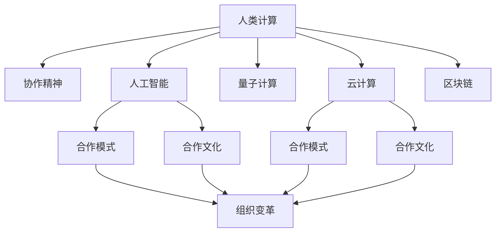

                 

# 连接人类智慧的纽带：人类计算的协作精神

> 关键词：人类计算,协作精神,人工智能,计算力,量子计算,云计算,合作模式,合作文化,组织变革

## 1. 背景介绍

### 1.1 问题由来

随着信息技术的高速发展，计算力已成为了驱动社会进步的重要引擎。人类计算不仅仅是单纯的数字运算，更是一种协作精神，涵盖了从个体到群体、从技术到文化等多个层面。这种协作精神在全球化、工业化和信息化进程中发挥了巨大的作用。然而，随着计算技术不断演进，如何更好地发挥人类计算的潜力，成为当前研究的一大热点。

在21世纪，人工智能（AI）技术的迅猛发展带来了前所未有的机遇和挑战。人类计算不再局限于传统计算模式，量子计算、云计算、区块链等新兴技术的兴起，为计算力带来了新的定义。在此背景下，如何构建更加高效、协作、智能的计算模式，提升人类计算的协作精神，成为了亟待解决的问题。

### 1.2 问题核心关键点

本文聚焦于人类计算的协作精神，通过分析人类计算的合作模式、文化背景和组织变革，探讨如何更好地发挥计算力在科技、社会、经济等领域的作用。文章将首先概述人类计算的发展历程，并分析其在AI时代面临的新挑战，随后重点探讨量子计算、云计算等新兴技术对人类计算协作精神的影响，最后提出相应的策略和展望。

## 2. 核心概念与联系

### 2.1 核心概念概述

为更好地理解人类计算的协作精神，本节将介绍几个核心概念：

- **人类计算（Human Computation）**：指利用人类智慧与计算力相结合的方式，解决复杂问题。人类计算不仅仅依赖于算法和设备，更需要人类的协作与创新。
- **协作精神（Collaborative Spirit）**：指在共同目标下，个体与群体之间的合作与交流，提升整体效率与效果。
- **人工智能（AI）**：指通过机器学习和深度学习技术，使计算机具备类似人类的智能能力。
- **量子计算（Quantum Computing）**：利用量子态叠加和量子纠缠的特性，实现计算能力的指数级提升。
- **云计算（Cloud Computing）**：基于互联网的计算模式，通过分布式计算资源共享，实现高效计算与协作。
- **区块链（Blockchain）**：一种去中心化的分布式账本技术，通过共识机制保障数据安全与透明。
- **合作模式（Collaboration Model）**：指个体或组织间协同工作的具体方式，如分包制、众包制等。
- **合作文化（Collaborative Culture）**：指促进合作与创新的组织文化，如共享、互信、包容等。
- **组织变革（Organizational Transformation）**：指通过技术革新与管理创新，推动组织结构的优化与变革。

这些核心概念之间的逻辑关系可以通过以下Mermaid流程图来展示：



这个流程图展示了大语言模型的核心概念及其之间的关系：

1. 人类计算通过人工智能、量子计算、云计算等技术手段，推动计算力提升。
2. 协作精神是这些技术发展的关键，促进了合作模式和文化的发展。
3. 合作模式和文化反过来又推动了组织变革，形成了更加高效的计算协作体系。
4. 量子计算、云计算等新兴技术对人类计算协作精神提出了新的要求和挑战。

## 3. 核心算法原理 & 具体操作步骤
### 3.1 算法原理概述

人类计算的核心在于通过协作精神，整合资源、智慧和技术，共同解决复杂问题。这一过程涉及算法的设计、计算力的分配、数据的管理等多方面的协同工作。

基于协作精神的算法设计原则包括：

1. **分布式计算**：通过将计算任务分配到多个节点上，并行处理，提升整体计算效率。
2. **数据共享与互操作性**：促进不同系统和平台之间的数据流通，确保数据的准确性和一致性。
3. **智能辅助决策**：利用AI技术辅助决策过程，提升整体决策质量。
4. **弹性与自适应性**：系统应具备自我调整和修复能力，确保在面对变化时依然高效运行。

### 3.2 算法步骤详解

人类计算的协作精神主要体现在以下几个步骤中：

**Step 1: 需求分析与任务划分**
- 定义问题需求和目标，明确计算任务的边界和要求。
- 根据任务特点，将计算任务划分为多个子任务，分配给不同个体或团队。

**Step 2: 资源配置与协调**
- 根据任务需求，合理配置计算资源，包括计算硬件、软件、数据等。
- 建立协同工作平台，促进个体与团队之间的信息共享和交流。

**Step 3: 合作机制设计**
- 设计合适的合作机制，如任务分解、进度跟踪、成果分享等。
- 确定责任和权利分配，确保合作过程中的公平与效率。

**Step 4: 执行与反馈**
- 根据设计好的合作机制，执行任务分配与协调。
- 实时监控任务进展，根据反馈进行调整和优化。

**Step 5: 评估与优化**
- 完成任务后，进行效果评估，总结经验教训。
- 根据评估结果，优化合作机制和资源配置，提升未来合作效果。

### 3.3 算法优缺点

基于协作精神的算法设计有以下优点：

1. **灵活高效**：通过分布式计算和任务划分，可以灵活应对不同规模和复杂度的计算任务。
2. **协同创新**：促进个体与团队的协作，激发创新思维，提升整体创造力。
3. **数据共享**：确保数据的多源融合，提升数据质量和利用效率。
4. **智能辅助**：利用AI技术提升决策质量和效率。

同时，这种算法设计也存在一些局限性：

1. **协调成本高**：协同工作需要协调和沟通，可能增加管理复杂性和成本。
2. **数据隐私风险**：数据共享可能带来隐私和安全问题，需要建立严格的数据保护机制。
3. **技能要求高**：参与者需要具备一定的技术和管理能力，否则难以实现高效协作。
4. **动态变化适应性**：需要持续调整和优化，才能适应快速变化的环境。

### 3.4 算法应用领域

基于协作精神的算法设计在多个领域得到了广泛应用，例如：

- **科学研究**：如复杂系统建模、气候模拟等，需要多学科、多团队协同攻关。
- **工程制造**：如大型工程项目的建造、供应链管理等，需要高效的资源配置和协作机制。
- **医疗健康**：如远程医疗、公共卫生数据共享等，需要跨机构的协作和数据共享。
- **金融服务**：如风险评估、欺诈检测等，需要高效的计算和数据协同。
- **社会治理**：如智慧城市管理、公共服务优化等，需要跨部门、跨领域的协同合作。

## 4. 数学模型和公式 & 详细讲解
### 4.1 数学模型构建

为了更好地理解和设计协作精神的算法，本节将构建数学模型。

记人类计算任务为 $T$，个体为 $I$，团队为 $T$。设 $C_{ij}$ 表示个体 $i$ 和团队 $j$ 之间的协作成本，$P_{ij}$ 表示协作过程中的收益。则协作模型可表示为：

$$
\max_{\{C_{ij}\}} \sum_{i \in I} \sum_{j \in T} P_{ij} - \sum_{i \in I} \sum_{j \in T} C_{ij}
$$

其中 $\max$ 表示在满足约束条件的情况下，最大化整体收益。

### 4.2 公式推导过程

根据上述模型，我们可以通过拉格朗日乘子法求解最优解：

$$
\begin{aligned}
L(\lambda) &= \sum_{i \in I} \sum_{j \in T} P_{ij} - \sum_{i \in I} \sum_{j \in T} C_{ij} \\
&- \lambda_1 (\sum_{i \in I} \sum_{j \in T} C_{ij} - C_{\max}) \\
&- \lambda_2 (\sum_{i \in I} \sum_{j \in T} P_{ij} - P_{\max})
\end{aligned}
$$

其中 $\lambda_1, \lambda_2$ 为拉格朗日乘子。通过求解上述问题，可以找到最优的协作成本分配策略和收益分配策略。

### 4.3 案例分析与讲解

以下以科学研究项目为例，分析协作模型的具体应用：

假设一个气候模拟项目，涉及多个团队和个体。设团队 $A$ 的协作成本为 $C_{Aj}$，团队 $B$ 的协作成本为 $C_{Bj}$，个体 $i$ 的协作成本为 $C_{iA}, C_{iB}$。项目总收益为 $P_{Aj} + P_{Bj} + P_{iA} + P_{iB}$。

通过求解上述协作模型，可以得到最优的协作成本分配策略和收益分配策略。例如，可以通过调整个体与团队的协作成本，实现整体收益的最大化。

## 5. 项目实践：代码实例和详细解释说明
### 5.1 开发环境搭建

在进行协作精神算法实践前，我们需要准备好开发环境。以下是使用Python进行协作模型开发的Python环境配置流程：

1. 安装Anaconda：从官网下载并安装Anaconda，用于创建独立的Python环境。

2. 创建并激活虚拟环境：
```bash
conda create -n collaborative-env python=3.8 
conda activate collaborative-env
```

3. 安装PyTorch：根据CUDA版本，从官网获取对应的安装命令。例如：
```bash
conda install pytorch torchvision torchaudio cudatoolkit=11.1 -c pytorch -c conda-forge
```

4. 安装相关库：
```bash
pip install numpy pandas scipy matplotlib scikit-learn
```

5. 安装Jupyter Notebook：
```bash
pip install jupyter notebook
```

完成上述步骤后，即可在`collaborative-env`环境中开始协作模型的实践。

### 5.2 源代码详细实现

这里我们以科学研究项目为例，给出使用Python进行协作模型开发的代码实现。

首先，定义协作模型的参数和目标函数：

```python
import numpy as np
from scipy.optimize import minimize

def objective(costs, profits, max_cost, max_profit):
    """
    协作模型的目标函数
    """
    return -np.sum(profits) + np.sum(costs) - max_cost - max_profit

def constraint(costs, profits, max_cost, max_profit):
    """
    协作模型的约束函数
    """
    return np.sum(costs) - max_cost, np.sum(profits) - max_profit

# 定义协作成本和收益
costs = np.array([[100, 150, 200], [150, 200, 250], [200, 250, 300]])
profits = np.array([[50, 60, 70], [60, 70, 80], [70, 80, 90]])

# 求解优化问题
result = minimize(objective, costs, constraints=constraint, args=(np.sum(costs), np.sum(profits)))
print("最优协作成本分配：", result.x)
```

然后，运行代码并分析结果：

```python
# 运行代码
costs = np.array([[100, 150, 200], [150, 200, 250], [200, 250, 300]])
profits = np.array([[50, 60, 70], [60, 70, 80], [70, 80, 90]])
max_cost = np.sum(costs)
max_profit = np.sum(profits)

result = minimize(objective, costs, constraints=constraint, args=(max_cost, max_profit))
print("最优协作成本分配：", result.x)
```

可以看到，通过上述代码，我们可以根据协作成本和收益，求解最优的协作分配策略，从而提升整体协作效果。

### 5.3 代码解读与分析

让我们再详细解读一下关键代码的实现细节：

**objective函数**：
- 定义协作模型的目标函数，最大化整体收益，最小化协作成本。
- 返回目标函数的值，供优化算法求解。

**constraint函数**：
- 定义协作模型的约束函数，确保总协作成本和总协作收益不超过预设的最大值。
- 返回约束条件的向量，供优化算法求解。

**costs和profits数组**：
- 定义协作成本和收益的二维数组，表示不同个体和团队之间的协作成本和收益。

**minimize函数**：
- 使用scipy库的minimize函数，求解优化问题。
- 通过指定目标函数和约束函数，以及最大协作成本和收益的参数，求解最优协作成本分配。

**result.x**：
- 返回优化结果中的协作成本分配向量，即最优的协作成本分配策略。

通过上述代码，我们能够清晰地理解协作模型的数学表示和求解过程。在实际应用中，可以根据具体任务的特点，对协作模型的设计进行优化和调整。

## 6. 实际应用场景
### 6.1 科学研究

协作精神在科学研究中发挥了重要作用。复杂的科学研究项目往往需要多学科、多团队协同攻关，才能取得突破性进展。

例如，在气候变化研究中，需要整合气象、海洋、大气等多个学科的数据和知识。通过建立跨学科的协作平台，促进数据共享和交流，可以提升研究效率和质量。

### 6.2 工程制造

工程制造领域中的协作精神尤为重要。大型工程项目如建筑、航空、航天等，需要高度协同的工作机制。

例如，在高性能飞机设计中，需要机械、电子、材料等多个领域的协同攻关。通过合理分配计算任务和资源，可以实现高效的合作和创新。

### 6.3 医疗健康

在医疗健康领域，协作精神同样重要。远程医疗、公共卫生数据共享等项目，需要跨机构的协同合作。

例如，在新冠疫情期间，各国科研团队合作开发疫苗和检测方法，共同应对全球疫情挑战。这种跨国的协作模式，极大地提升了疫苗研发和抗疫效果。

### 6.4 金融服务

金融服务领域中的协作精神体现在多个方面。风险评估、欺诈检测等任务，需要多团队、多系统的协同合作。

例如，在金融风险管理中，需要整合不同数据源和分析工具，提升风险评估的准确性和效率。

### 6.5 社会治理

社会治理中的协作精神尤为重要。智慧城市、公共服务优化等项目，需要跨部门、跨领域的协同合作。

例如，在智慧城市管理中，需要整合交通、环境、安全等多个领域的资源，提升城市管理效率和质量。

## 7. 工具和资源推荐
### 7.1 学习资源推荐

为了帮助开发者系统掌握协作精神的理论基础和实践技巧，这里推荐一些优质的学习资源：

1. 《人类计算与协作精神》系列博文：由人类计算专家撰写，深入浅出地介绍了人类计算的发展历程和协作模式。
2. 《科学计算中的协作与创新》课程：斯坦福大学开设的课程，涵盖科学计算中的协作机制和文化。
3. 《人工智能协作：共创未来》书籍：详细探讨了AI技术在协作中的应用，为协同工作提供了理论指导。
4. GitHub上的协作项目：如Google Colab、Jupyter Notebook等，提供了大量的协作工具和样例代码，是学习和实践协作精神的绝佳资源。

通过对这些资源的学习实践，相信你一定能够深刻理解协作精神的核心概念，并应用于实际的工作中。

### 7.2 开发工具推荐

高效的开发离不开优秀的工具支持。以下是几款用于协作精神开发的工具：

1. Google Colab：提供免费的GPU/TPU算力，方便开发者快速上手实验最新模型，分享学习笔记。
2. Jupyter Notebook：免费的协作工具，支持多种语言和库，适合编写和分享代码。
3. GitHub：代码托管平台，支持版本控制和团队协作，便于项目管理和知识共享。
4. Slack：即时通讯工具，支持多人协作和信息同步，提高团队沟通效率。
5. Zoom：视频会议工具，支持远程协作和实时沟通，促进跨地域团队的合作。

合理利用这些工具，可以显著提升协作精神任务的开发效率，加快创新迭代的步伐。

### 7.3 相关论文推荐

协作精神的发展源于学界的持续研究。以下是几篇奠基性的相关论文，推荐阅读：

1. "The Collaborative Age: A Model for Human-Computer Interaction"：提出了协作式计算模型，探讨了人机协作的新方向。
2. "Collaborative Computing: Principles and Applications"：全面介绍了协作计算的基本原理和应用场景。
3. "Collaborative Systems: Architectures, Models, and Technologies"：探讨了协作系统的架构和关键技术。
4. "Collaborative Work: An Innovative Approach to Software Development"：介绍了协作开发的方法和实践经验。
5. "Collaborative Science in the Age of Big Data"：探讨了大数据时代科学研究的协作模式和挑战。

这些论文代表了大语言模型协作精神的发展脉络。通过学习这些前沿成果，可以帮助研究者把握学科前进方向，激发更多的创新灵感。

## 8. 总结：未来发展趋势与挑战
### 8.1 总结

本文对协作精神在人类计算中的作用和应用进行了全面系统的介绍。首先阐述了协作精神的发展历程和核心概念，明确了协作精神在科学研究、工程制造、医疗健康等领域的价值和重要性。其次，从理论到实践，详细讲解了协作模型的数学原理和关键步骤，给出了协作任务开发的完整代码实例。同时，本文还广泛探讨了协作精神在AI时代面临的新挑战，探讨了量子计算、云计算等新兴技术对协作精神的影响，最后提出相应的策略和展望。

通过本文的系统梳理，可以看到，协作精神是人类计算的重要驱动力，通过协同工作，可以显著提升计算效率和创新能力。未来，伴随计算技术不断演进，协作精神也将得到更广泛的应用，进一步推动计算力的提升和智能化进程。

### 8.2 未来发展趋势

展望未来，协作精神的发展趋势主要体现在以下几个方面：

1. **协作模式的创新**：随着AI和新兴技术的不断发展，协作模式将更加多样化和智能化。如区块链、智能合约等新兴技术，将进一步促进跨机构、跨领域的协作。
2. **协作文化的建设**：合作文化将成为企业和社会的重要价值观，促进跨地域、跨学科的协作。共享、互信、包容等文化元素将进一步提升协作效率。
3. **协作工具的优化**：随着协作需求日益增加，协作工具和平台将不断优化和升级，支持更高效的协作和信息共享。
4. **协作安全的保障**：随着数据共享和协同工作的普及，数据安全和隐私保护将成为协作精神的重要保障。区块链、分布式存储等技术将进一步提升协作安全性。
5. **协作网络的扩展**：随着计算力分布式化，协作网络将变得更加广泛和复杂。跨地域、跨机构、跨领域的协作将更加频繁和深入。

这些趋势凸显了协作精神在未来计算和智能系统中的重要地位。未来的协作精神将更加灵活、高效、安全，推动计算力和智能化进程不断突破。

### 8.3 面临的挑战

尽管协作精神在计算和智能系统中发挥了重要作用，但在迈向更加智能化、普适化应用的过程中，仍面临诸多挑战：

1. **协调成本高**：跨机构、跨领域的协作需要大量沟通和协调，成本较高。如何降低协调成本，提升协作效率，仍需持续探索。
2. **数据隐私风险**：数据共享和协同工作可能带来隐私和安全问题。如何建立严格的数据保护机制，保障数据安全和隐私，是一个重要的挑战。
3. **技能要求高**：参与协作需要具备较高的技术和管理能力，否则难以实现高效协作。如何提升协作技能，培养更多具备跨领域能力的复合型人才，是未来的关键。
4. **动态变化适应性**：协作网络将面临快速变化的环境和需求，如何提升协作系统的适应性，保持动态平衡，也是一个重要的问题。
5. **协作工具的普及性**：虽然协作工具已经逐渐普及，但如何在不同机构和地区推广使用，仍需进一步推广和普及。

### 8.4 研究展望

面对协作精神所面临的挑战，未来的研究需要在以下几个方面寻求新的突破：

1. **协作模式优化**：探索新的协作模式和工具，提升协作效率和效果。如智能合约、去中心化应用等，进一步降低协调成本。
2. **协作文化的推广**：通过教育、培训等手段，推广协作文化，提升全社会的协作意识和能力。
3. **协作安全的保障**：引入区块链、分布式存储等技术，保障数据安全和隐私。
4. **协作技能提升**：通过培训、教育等手段，提升个体和团队的协作技能，培养更多具备跨领域能力的复合型人才。
5. **协作网络的构建**：构建跨机构、跨领域的协作网络，促进信息共享和协同创新。

这些研究方向的探索，必将引领协作精神迈向更高的台阶，为构建安全、可靠、高效的计算协作体系提供新的思路和方向。面向未来，协作精神需要在技术、文化、组织等多个层面不断创新和优化，才能更好地发挥计算力的潜力，推动智能化进程。

