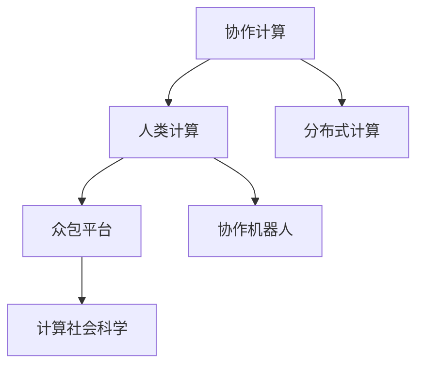

                 

# 连接人类智慧的网络：人类计算的协作精神

> 关键词：协作计算, 人类计算, 分布式计算, 众包平台, 计算社会科学, 协作机器人, 人类与AI协同, 社会科学计算

## 1. 背景介绍

### 1.1 问题由来
在数字化时代，数据量呈指数级增长，如何有效利用这些海量数据，推动人类社会的创新发展，成为了全球科技界共同关注的重大问题。传统的数据处理方式已经难以适应现代需求，尤其对于那些涉及复杂问题解决、决策支持的任务，仅仅依靠自动化算法往往无法取得理想的效果。

为了应对这一挑战，一种新型的计算模式应运而生——人类计算。人类计算是指通过互联网连接大量人类智慧资源，协同完成任务的计算方式。这种方式充分发挥了人类的创造性、灵活性和适应性，弥补了机器算法在面对复杂、模糊问题的短板。

### 1.2 问题核心关键点
人类计算的核心在于利用人类智慧资源，通过协作和分布式计算，共同解决复杂问题。其关键点包括：
- **数据协同**：充分利用人类的认知能力，对数据进行标注、分类、解读等，转化为机器可以理解的形式。
- **任务分解**：将大问题拆分成多个小任务，分配给不同人员或团队，协同解决。
- **知识共享**：通过在线协作工具和平台，促进团队成员之间知识共享，优化解决方案。
- **结果汇总**：汇聚各方的解答和结果，形成最终的综合结论。

### 1.3 问题研究意义
人类计算技术的应用，对于推动数据驱动的决策、解决复杂问题、促进跨学科合作等方面具有重要意义：

1. **提升决策质量**：通过融合人类智慧，提高决策的准确性和全面性，减少偏见和错误。
2. **促进跨学科合作**：打破学科壁垒，促进不同领域专家之间的知识交流和协作。
3. **加速创新进程**：借助大量人类的创意和灵感，推动技术、艺术、科学等领域的创新发展。
4. **构建智能社会**：通过计算社会科学等新型研究方法，分析社会行为模式，优化社会治理和公共服务。
5. **推动产业升级**：通过人机协同，提升企业研发效率，加速产业数字化转型。

## 2. 核心概念与联系

### 2.1 核心概念概述

为了更好地理解人类计算的原理和应用，本节将介绍几个核心概念：

- **协作计算（Collaborative Computing）**：指通过互联网连接大量人类资源，协同完成任务的计算模式。协作计算强调多方协同、数据共享和结果整合，以实现更高效的计算和知识共享。
- **人类计算（Human Computing）**：指利用人类智慧资源，通过协作计算模式解决复杂问题的计算方式。人类计算侧重于利用人类的创新能力和创造性，弥补机器算法的不足。
- **分布式计算（Distributed Computing）**：指将计算任务分布到多台计算机上，并行处理的计算模式。分布式计算强调系统资源的优化配置和任务的高效并行处理。
- **众包平台（Crowdsourcing Platforms）**：指通过在线平台集中发布任务，吸引和协调大量人类资源协同解决问题的平台。众包平台是实现协作计算的重要工具。
- **计算社会科学（Computational Social Science）**：指利用计算方法和工具，分析和研究人类社会行为和关系的学科。计算社会科学利用大数据和人工智能技术，揭示社会现象背后的规律。
- **协作机器人（Collaborative Robots）**：指与人类协同工作的智能机器人，能够在复杂环境中执行多样化任务。协作机器人是实现人机协作计算的重要手段。

这些核心概念之间的逻辑关系可以通过以下Mermaid流程图来展示：



这个流程图展示了一些核心概念之间的关系：

1. 协作计算是实现人类计算的基础，通过互联网连接大量人类智慧资源。
2. 人类计算是协作计算的一种高级形式，强调利用人类的创新能力和创造性。
3. 分布式计算是协作计算的技术手段，通过多台计算机并行处理任务。
4. 众包平台是协作计算的实现工具，提供任务发布和协调的功能。
5. 计算社会科学是应用协作计算解决社会问题的学科方向。
6. 协作机器人是协作计算的具体应用场景，能够执行复杂任务。

这些概念共同构成了人类计算的计算框架，通过协同、分布式和跨学科的方法，共同解决复杂问题，推动社会的创新和发展。

## 3. 核心算法原理 & 具体操作步骤
### 3.1 算法原理概述

人类计算的本质是一种分布式协作计算模式，其核心算法原理包括以下几个关键部分：

- **数据协同**：通过在线协作平台，将任务数据上传并标注，转化为机器可理解的形式。
- **任务分解**：将大问题拆分成多个子任务，分配给不同的志愿者或团队处理。
- **结果汇聚**：将各方处理的结果汇总，通过机器学习算法进行综合分析，得出最终的结论。
- **知识共享**：利用在线协作工具，促进团队成员之间的知识交流和共享，优化解决方案。

### 3.2 算法步骤详解

人类计算的实现过程一般包括以下几个关键步骤：

**Step 1: 问题定义和任务拆分**
- 定义问题，明确任务目标和关键指标。
- 将问题拆分成多个子任务，确定各子任务的完成标准和时间要求。

**Step 2: 数据准备与协同标注**
- 收集相关数据，并通过在线协作平台，邀请志愿者或团队成员进行数据标注。
- 对标注结果进行审核和反馈，确保数据质量和一致性。

**Step 3: 任务分配与协同解决**
- 将数据和子任务分配给不同的志愿者或团队，确保任务均衡。
- 利用在线协作工具，促进团队成员之间的信息交流和知识共享。
- 提供任务进展和问题解决的工具，帮助团队高效协作。

**Step 4: 结果汇总与分析**
- 将各方的解答和结果上传至协作平台，进行汇总和整理。
- 利用机器学习算法，对汇总结果进行分析和综合，得出最终的结论。
- 进行结果验证和修正，确保结论的准确性和可靠性。

**Step 5: 应用与反馈**
- 将最终的结论应用于实际问题解决，如决策支持、产品研发等。
- 收集反馈，进一步优化协作计算的过程和结果。

### 3.3 算法优缺点

人类计算作为一种新兴的计算模式，具有以下优点：
- **灵活性高**：能够适应各种复杂、模糊的问题，充分发挥人类的智慧和创造性。
- **跨学科融合**：促进不同领域专家的知识交流和协作，推动跨学科研究。
- **成本低**：利用志愿者资源，降低任务解决的成本。
- **数据丰富**：大量人类标注数据，丰富数据来源，提高模型训练的准确性。

但同时，人类计算也存在一些缺点：
- **质量参差不齐**：志愿者或团队成员的水平参差不齐，可能导致标注结果不一致。
- **协调成本高**：任务协调和管理需要耗费大量时间和资源。
- **技术门槛低**：缺乏技术手段的指导，可能导致标注过程的效率低下。
- **隐私和安全问题**：大规模数据协同可能涉及隐私和数据安全问题，需要严格控制和管理。

### 3.4 算法应用领域

人类计算技术已经在多个领域得到了广泛应用，例如：

- **自然语言处理（NLP）**：通过众包平台，邀请志愿者对自然语言数据进行标注，如文本分类、命名实体识别等任务。
- **社会科学研究**：利用计算社会科学的方法，分析和研究人类社会行为和关系，如情感分析、社会网络分析等。
- **医学研究**：通过在线协作平台，邀请医学专家对医学数据进行标注，如疾病分类、病理诊断等任务。
- **金融分析**：利用协作计算分析金融市场数据，进行投资分析和风险评估。
- **人工智能研发**：利用人机协作，进行算法优化和模型训练，提升AI系统的性能。
- **产品设计**：通过在线协作平台，邀请设计师和工程师对产品原型进行用户测试和反馈，优化设计方案。

除了上述这些经典应用外，人类计算还被创新性地应用于更多领域，如城市规划、环境保护、艺术创作等，为社会创新提供了新的途径。

## 4. 数学模型和公式 & 详细讲解 & 举例说明
### 4.1 数学模型构建

人类计算涉及的数学模型复杂多样，包括数据协同模型、任务分解模型、结果分析模型等。本节将从几个典型模型进行详细讲解。

以自然语言处理（NLP）为例，构建一个简单的文本分类模型：

**输入**：一组标注后的文本数据 $\{(x_i, y_i)\}_{i=1}^N$，其中 $x_i$ 为文本，$y_i$ 为标签。

**输出**：模型对新文本的分类结果 $f(x)$。

定义模型 $M$，利用机器学习算法 $A$ 进行训练，目标最小化损失函数 $L$：

$$
\min_{M, A} \frac{1}{N} \sum_{i=1}^N L(M(x_i), y_i)
$$

其中 $M(x_i)$ 为模型对文本 $x_i$ 的分类预测，$L$ 为损失函数。

### 4.2 公式推导过程

以二分类任务为例，推导损失函数和梯度计算公式。

假设模型 $M$ 在输入 $x$ 上的输出为 $\hat{y}=M(x) \in [0,1]$，表示样本属于正类的概率。真实标签 $y \in \{0,1\}$。则二分类交叉熵损失函数定义为：

$$
L(M(x),y) = -[y\log \hat{y} + (1-y)\log(1-\hat{y})]
$$

将其代入经验风险公式，得：

$$
\mathcal{L}(M) = -\frac{1}{N}\sum_{i=1}^N [y_i\log M(x_i)+(1-y_i)\log(1-M(x_i))]
$$

根据链式法则，损失函数对模型参数 $\theta$ 的梯度为：

$$
\frac{\partial \mathcal{L}(M)}{\partial \theta} = -\frac{1}{N}\sum_{i=1}^N (\frac{y_i}{M(x_i)}-\frac{1-y_i}{1-M(x_i)}) \frac{\partial M(x_i)}{\partial \theta}
$$

其中 $\frac{\partial M(x_i)}{\partial \theta}$ 可进一步递归展开，利用自动微分技术完成计算。

### 4.3 案例分析与讲解

以医学影像分类为例，分析协作计算在医疗数据标注中的应用。

**数据准备**：收集一批医学影像数据，并通过在线协作平台，邀请医疗专家对这些影像进行分类标注，如肿瘤分类、病变检测等。

**任务分配**：将数据和标注任务分配给不同的医疗专家，确保任务均衡和公平。

**协同标注**：各医疗专家利用在线协作工具，对同一批数据进行独立标注，并对标注结果进行比对和反馈。

**结果汇总**：将各专家的标注结果上传至协作平台，进行汇总和整理。

**模型训练**：利用协同标注的结果，训练机器学习模型，对新的医学影像进行分类预测。

**结果验证**：将模型预测结果返回给医疗专家进行验证，进一步优化模型和标注流程。

## 5. 项目实践：代码实例和详细解释说明
### 5.1 开发环境搭建

在进行人类计算项目实践前，我们需要准备好开发环境。以下是使用Python进行协作计算的开发环境配置流程：

1. 安装Anaconda：从官网下载并安装Anaconda，用于创建独立的Python环境。

2. 创建并激活虚拟环境：
```bash
conda create -n colab-env python=3.8 
conda activate colab-env
```

3. 安装必要的库：
```bash
pip install pandas numpy jupyter notebook ipywidgets pyqt5
```

4. 安装协作平台工具：
```bash
pip install cloudcommons
```

5. 初始化协作平台：
```bash
cloudcommons init
```

完成上述步骤后，即可在`colab-env`环境中开始协作计算实践。

### 5.2 源代码详细实现

下面我们以众包平台数据标注为例，给出使用Python进行协作计算的代码实现。

首先，定义数据处理函数：

```python
import pandas as pd
import numpy as np

def load_data(file_path):
    data = pd.read_csv(file_path)
    return data

def clean_data(data):
    # 去除缺失值和异常值
    data = data.dropna()
    data = data[data['label'].isin(['positive', 'negative'])]
    return data

def save_data(data, file_path):
    data.to_csv(file_path, index=False)
```

然后，定义任务分配函数：

```python
import random
from cloudcommons import Worker, Common, Task

class AnnotationTask(Task):
    def __init__(self, data_path):
        super().__init__()
        self.data_path = data_path
        self.data = load_data(data_path)
        self.data = clean_data(self.data)
        self.worker = Worker(Common.get_worker_path())

    def process(self):
        self.worker.add_data(self.data_path)
        self.worker.add_task(self.data.shape[0])
        self.worker.start()

    def check_result(self):
        result = self.worker.check_result()
        if result == 'ok':
            self.save_result(result)
        else:
            self.worker.stop()

    def save_result(self, result):
        result_df = pd.DataFrame(result)
        result_df.to_csv('result.csv', index=False)
```

接着，定义结果汇总函数：

```python
def merge_results(file_path1, file_path2):
    result1 = pd.read_csv(file_path1)
    result2 = pd.read_csv(file_path2)
    merged_result = pd.concat([result1, result2])
    return merged_result
```

最后，启动协作计算流程并在协作平台上展示结果：

```python
if __name__ == '__main__':
    task = AnnotationTask('data.csv')
    task.process()
    task.check_result()
    merged_result = merge_results('result1.csv', 'result2.csv')
    merged_result.to_csv('final_result.csv', index=False)
```

以上就是使用Python进行协作计算的完整代码实现。可以看到，利用云协作工具和在线平台，我们可以方便地进行任务分配、数据协同和结果汇总。

### 5.3 代码解读与分析

让我们再详细解读一下关键代码的实现细节：

**AnnotationTask类**：
- `__init__`方法：初始化数据路径和数据对象。
- `process`方法：将数据上传到协作平台，并启动任务处理。
- `check_result`方法：检查任务处理结果，如果结果正确，保存结果；否则停止任务。

**merge_results函数**：
- 将多个结果文件合并，生成最终的汇总结果。

**协作计算流程**：
- 定义任务对象，将数据上传并启动任务。
- 检查任务处理结果，保存结果。
- 合并各个结果，生成最终的汇总结果。

协作计算的代码实现相对简洁，但需要依赖云协作工具和在线平台，以保证任务的高效协同和数据的安全性。

## 6. 实际应用场景
### 6.1 智能医疗诊断

人类计算技术在医疗诊断领域具有重要应用价值。通过众包平台，邀请大量医生对医学影像、病历记录等数据进行标注和分析，可以快速提升疾病诊断的准确性和效率。

具体而言，可以收集一批医学影像数据，通过在线协作平台邀请医生对影像进行标注，如肿瘤位置、病变类型等。利用协同标注的结果，训练机器学习模型，对新的医学影像进行分类预测，辅助医生进行诊断决策。

### 6.2 社会科学研究

人类计算在社会科学研究中也有广泛应用。通过众包平台，邀请社会学家、经济学家等专家对社会数据进行标注和分析，揭示社会行为和关系的规律。

例如，可以收集一批社交网络数据，邀请专家对节点之间的关系进行标注，如朋友关系、同事关系等。利用协同标注的结果，训练机器学习模型，对新的社交网络数据进行分析和预测，揭示社会行为模式和关系网络。

### 6.3 金融市场分析

人类计算在金融分析中也有重要作用。通过众包平台，邀请金融分析师对市场数据进行标注和分析，快速获取市场趋势和投资建议。

例如，可以收集一批金融市场数据，邀请分析师对这些数据进行标注，如股票价格、交易量等。利用协同标注的结果，训练机器学习模型，对市场数据进行分析和预测，辅助分析师制定投资策略。

### 6.4 未来应用展望

随着人类计算技术的不断发展，未来将在更多领域得到应用，为社会创新提供新的动力。

在智慧城市治理中，人类计算技术可以用于城市事件监测、舆情分析、应急指挥等环节，提高城市管理的自动化和智能化水平，构建更安全、高效的未来城市。

在智慧农业中，人类计算技术可以用于农业数据标注、土壤分析、作物预测等任务，提升农业生产效率和环境可持续性。

在环境监测中，人类计算技术可以用于环境保护数据标注、生态系统分析、污染预测等任务，促进环境保护和可持续发展。

此外，在教育、艺术、工业制造等众多领域，人类计算技术也将不断涌现，为社会创新提供新的途径。相信随着技术的不断进步，人类计算将在更广阔的应用领域大放异彩。

## 7. 工具和资源推荐
### 7.1 学习资源推荐

为了帮助开发者系统掌握人类计算的理论基础和实践技巧，这里推荐一些优质的学习资源：

1. 《人类计算：一种新的计算模式》系列博文：由人类计算领域专家撰写，深入浅出地介绍了人类计算的原理、应用和未来趋势。

2. 《协作计算与社会科学计算》课程：斯坦福大学开设的计算社会科学课程，系统讲解了协作计算的理论基础和实际应用。

3. 《协作计算与人类计算》书籍：系统介绍协作计算和人类计算的概念、方法和应用，适合广大从业者和学术研究人员。

4. HuggingFace官方文档：提供了丰富的预训练语言模型和协作计算样例代码，是学习和实践协作计算的重要参考。

5. Commons云计算平台：提供了协同计算和数据标注工具，方便开发者进行协作计算实践。

通过对这些资源的学习实践，相信你一定能够快速掌握协作计算的理论基础和实践技巧，并用于解决实际的计算问题。

### 7.2 开发工具推荐

高效的开发离不开优秀的工具支持。以下是几款用于协作计算开发的常用工具：

1. Jupyter Notebook：基于Python的开源笔记本工具，支持代码块、Markdown和丰富的可视化组件，适合协作计算的实践和展示。

2. IPyWidgets：基于Python的可视化工具库，支持图表、进度条等可视化组件，方便开发者进行数据展示和分析。

3. Cloud Commons：一个基于云的协作计算平台，提供数据标注、任务分配和结果汇总的功能，方便开发者进行协作计算实践。

4. TensorBoard：TensorFlow配套的可视化工具，可实时监测计算过程和结果，提供丰富的图表呈现方式，是调试协作计算的重要助手。

5. Weights & Biases：模型训练的实验跟踪工具，可以记录和可视化计算过程中的各项指标，方便对比和调优。

合理利用这些工具，可以显著提升协作计算任务的开发效率，加快创新迭代的步伐。

### 7.3 相关论文推荐

人类计算技术的发展源于学界的持续研究。以下是几篇奠基性的相关论文，推荐阅读：

1. 《Human Computing: A Survey》：综述了人类计算的历史、现状和未来发展方向，系统介绍了各种人类计算应用。

2. 《Collaborative Annotation for Named Entity Recognition》：探讨了协作计算在命名实体识别中的应用，分析了协同标注的优点和挑战。

3. 《Collaborative Crowdsourcing for Social Network Analysis》：研究了协作计算在社交网络分析中的应用，揭示了社会行为模式和关系网络。

4. 《Collaborative Tagging in Online Environments》：分析了协作计算在在线环境中标注数据的应用，提出了多种协同标注策略。

5. 《Human Computation in Medicine》：探讨了协作计算在医疗诊断中的应用，展示了其提高诊断准确性和效率的潜力。

这些论文代表了大计算技术的发展脉络。通过学习这些前沿成果，可以帮助研究者把握学科前进方向，激发更多的创新灵感。

## 8. 总结：未来发展趋势与挑战
### 8.1 总结

本文对人类计算的概念、原理和应用进行了全面系统的介绍。首先阐述了人类计算在解决复杂问题、推动社会创新方面的重要意义，明确了协作计算和分布式计算的基本思想。其次，从原理到实践，详细讲解了协作计算的数学模型和算法步骤，给出了协作计算任务开发的完整代码实例。同时，本文还广泛探讨了协作计算在智能医疗、社会科学、金融分析等多个领域的应用前景，展示了协作计算技术的广阔前景。此外，本文精选了协作计算技术的各类学习资源，力求为读者提供全方位的技术指引。

通过本文的系统梳理，可以看到，协作计算技术正在成为计算科学的新范式，极大地拓展了人类智慧的应用边界，推动了社会的创新和发展。未来，伴随协作计算技术的持续演进，相信将在更多领域得到应用，为人类智慧的协作和协同带来新的突破。

### 8.2 未来发展趋势

展望未来，协作计算技术将呈现以下几个发展趋势：

1. **跨领域融合**：协作计算将进一步与其他计算技术（如分布式计算、人工智能）进行融合，形成更加强大、灵活的计算系统。
2. **人工智能增强**：借助人工智能技术，协作计算系统将具备更强的智能决策能力和自适应能力。
3. **社区化发展**：协作计算平台将进一步社区化，吸引更多用户参与，形成良性互动和协作。
4. **多元化应用**：协作计算技术将在更多领域得到应用，如智能城市、智慧农业、环境保护等，促进社会的创新和可持续发展。
5. **标准化发展**：协作计算技术将逐步标准化，形成统一的技术规范和接口，便于推广和应用。

这些趋势凸显了协作计算技术的广阔前景。这些方向的探索发展，必将进一步提升协作计算的性能和应用范围，为社会创新提供新的途径。

### 8.3 面临的挑战

尽管协作计算技术已经取得了显著进展，但在迈向更加智能化、普适化应用的过程中，它仍面临诸多挑战：

1. **数据质量问题**：协作计算的结果依赖于大量标注数据的准确性和一致性，数据质量问题仍是挑战之一。
2. **任务协调困难**：协作计算任务协调和管理需要耗费大量时间和资源，任务分配和结果汇总的效率有待提升。
3. **隐私和安全问题**：大规模数据协同可能涉及隐私和数据安全问题，需要严格控制和管理。
4. **技术门槛高**：协作计算需要多方面的技术支持，缺乏技术手段的指导，可能导致协作过程的效率低下。
5. **公平性和可靠性**：协作计算结果的公平性和可靠性问题尚未完全解决，需要进一步优化和验证。

面对协作计算面临的这些挑战，未来的研究需要在以下几个方面寻求新的突破：

1. **数据协同优化**：通过改进数据协同方法和工具，提高数据标注的准确性和一致性。
2. **任务分配优化**：开发更高效的任务分配算法，提高任务协调和管理的效率。
3. **隐私和安全保护**：研究隐私保护和数据安全技术，确保协作计算平台的安全性。
4. **技术手段优化**：引入更多的技术手段，提高协作计算的效率和效果。
5. **公平性和可靠性验证**：建立公平性和可靠性的验证机制，确保协作计算结果的准确性和可信度。

这些研究方向的探索，必将引领协作计算技术迈向更高的台阶，为社会的创新和发展提供新的动力。

### 8.4 研究展望

面向未来，协作计算技术需要在以下几个方向进行深入研究：

1. **大规模数据协同**：研究如何在大规模数据上高效协同，提升数据标注的效率和质量。
2. **人工智能辅助**：利用人工智能技术，提高协作计算的智能决策能力和自适应能力。
3. **社区化协作**：研究社区化协作模式，吸引更多用户参与，形成良性互动和协作。
4. **跨领域应用**：拓展协作计算在更多领域的应用，如智慧城市、智慧农业、环境保护等，推动社会的创新和可持续发展。
5. **标准化和规范化**：研究协作计算的标准化和规范化，形成统一的技术规范和接口，便于推广和应用。

这些研究方向的探索，必将引领协作计算技术迈向更高的台阶，为社会的创新和发展提供新的动力。面向未来，协作计算技术还需要与其他计算技术进行更深入的融合，共同推动计算科学的发展，构建更加智能、普适、可靠的社会。

## 9. 附录：常见问题与解答

**Q1：人类计算和协作计算有什么区别？**

A: 人类计算是一种通过互联网连接大量人类智慧资源，协同完成任务的计算模式。协作计算是人类计算的一种实现方式，强调多方协同、数据共享和结果整合，通过在线协作平台进行任务分配和结果汇总。人类计算更侧重于利用人类的智慧和创造性，弥补机器算法的不足，而协作计算则提供了实现人类计算的协同工具和方法。

**Q2：协作计算技术适用于哪些应用场景？**

A: 协作计算技术适用于各种复杂、模糊的问题解决，尤其是需要跨学科协作的场景。例如，自然语言处理、社会科学研究、金融分析、智能医疗等。在这些问题中，人类计算的优势能够充分发挥，通过在线协作平台和协同标注技术，快速获取高质量的标注数据，提升机器学习模型的性能。

**Q3：如何提高协作计算的任务效率？**

A: 提高协作计算任务效率的关键在于优化数据协同和任务分配的过程。可以采用以下方法：
1. **数据预处理**：对数据进行清洗、去重和标准化，提高数据标注的质量和一致性。
2. **任务拆分**：将大问题拆分成多个小任务，确保任务均衡和公平。
3. **协同工具优化**：使用高效的协作平台和工具，提高任务协调和管理的效率。
4. **任务反馈机制**：建立任务反馈机制，及时处理标注结果中的错误和偏差，确保标注结果的准确性。

**Q4：协作计算技术的未来发展方向是什么？**

A: 协作计算技术的未来发展方向主要包括以下几个方面：
1. **跨领域融合**：协作计算将与其他计算技术（如分布式计算、人工智能）进行深度融合，形成更加强大、灵活的计算系统。
2. **人工智能增强**：借助人工智能技术，协作计算系统将具备更强的智能决策能力和自适应能力。
3. **社区化发展**：协作计算平台将进一步社区化，吸引更多用户参与，形成良性互动和协作。
4. **多元化应用**：协作计算技术将在更多领域得到应用，如智慧城市、智慧农业、环境保护等，促进社会的创新和可持续发展。
5. **标准化和规范化**：协作计算的标准化和规范化，形成统一的技术规范和接口，便于推广和应用。

**Q5：协作计算技术在隐私保护方面有哪些挑战？**

A: 协作计算技术在隐私保护方面面临以下挑战：
1. **数据泄露**：大规模数据协同可能涉及敏感数据，泄露风险较高。
2. **用户隐私**：协作平台需要记录和存储用户行为数据，隐私保护问题不容忽视。
3. **平台安全**：协作平台需要防止恶意攻击和数据篡改，确保数据安全。

为应对这些挑战，需要研究隐私保护和数据安全技术，如数据匿名化、差分隐私、加密技术等，确保协作计算平台的安全性。

---

作者：禅与计算机程序设计艺术 / Zen and the Art of Computer Programming

