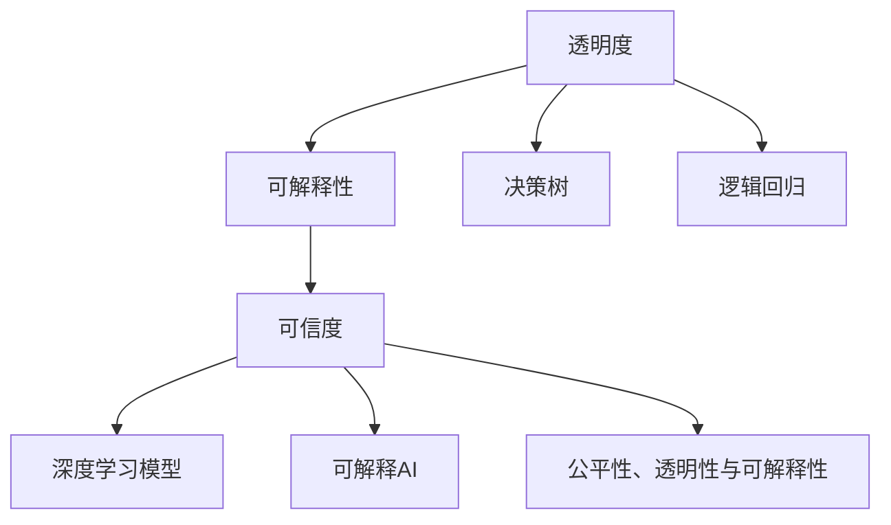

                 

# 透明度与可解释性：增强人工智能的可信度

> 关键词：透明度,可解释性,可信度,人工智能,算法公平性,伦理,决策分析

## 1. 背景介绍

### 1.1 问题由来

随着人工智能技术的迅速发展，特别是在深度学习和大数据应用的推动下，人工智能系统（AI）已经在医疗、金融、安全、工业自动化等领域取得了显著成果。然而，尽管AI在解决复杂问题方面表现出色，但它的决策过程却常常被描述为“黑箱”，缺乏透明度和可解释性。

这种“黑箱”特性导致了公众对AI系统的信任度降低，特别是在那些对决策影响重大的领域。例如，在医疗诊断、金融风险评估、司法判决等场景中，缺乏透明和可解释的AI决策过程可能导致法律责任归属不清，决策可信度下降，进而影响整个系统的可靠性。

### 1.2 问题核心关键点

透明度和可解释性是当前AI研究的重要课题，涉及以下核心概念：

- **透明度**：指AI系统在决策过程中是否能够清晰地展示其内在逻辑和依据，使得用户能够理解其决策过程。
- **可解释性**：指AI系统是否能够提供对其决策过程和结果的合理解释，使得用户能够验证其决策的正确性和合理性。
- **可信度**：指AI系统在特定应用场景中的决策结果是否具有可信赖性，即是否能够满足用户期望和实际需求。

本文旨在探讨如何在保证AI系统性能的同时，提升其透明度和可解释性，以增强AI的可信度。

## 2. 核心概念与联系

### 2.1 核心概念概述

为更好地理解透明度与可解释性在AI系统中的应用，本节将介绍几个关键概念：

- **决策树**：一种基于树结构的模型，用于表示决策过程和结果，具有较高的透明度和可解释性。
- **逻辑回归**：一种线性分类模型，通过引入逻辑函数，提供线性决策边界，具有较好的解释性。
- **深度学习模型**：如神经网络、卷积神经网络（CNN）、循环神经网络（RNN）等，由于其复杂的结构，常常被描述为“黑箱”，缺乏透明度和可解释性。
- **可解释AI（XAI）**：旨在提供AI系统决策过程的解释和验证，增强系统的透明度和可解释性。
- **公平性、透明性与可解释性（Fairness, Transparency, and Accountability, FTA）**：指出AI系统的公平性、透明性和可解释性是构建可信系统的关键。

这些核心概念之间的逻辑关系可以通过以下Mermaid流程图来展示：



这个流程图展示了几组关键概念之间的逻辑联系：

1. 透明度是可解释性的基础，没有透明度，可解释性无从谈起。
2. 可解释性有助于增强可信度，透明且可解释的系统更容易被信任。
3. 深度学习模型由于结构复杂，需要可解释AI辅助提供透明度和可解释性。
4. 公平性、透明性和可解释性是构建可信系统的基石，共同构成AI系统的关键特性。

## 3. 核心算法原理 & 具体操作步骤
### 3.1 算法原理概述

AI系统的透明度和可解释性提升，核心在于理解其决策过程和结果的逻辑依据。本文将以逻辑回归和决策树两种模型为例，探讨其透明度和可解释性的原理，并提出几种提升系统透明度和可解释性的策略。

### 3.2 算法步骤详解

#### 3.2.1 逻辑回归模型

逻辑回归是一种线性分类模型，其决策边界为线性。其基本原理是将数据映射到一个概率空间，通过最大化似然函数来确定参数，使得模型预测的概率与真实标签最接近。逻辑回归模型具有以下步骤：

1. 收集数据：收集具有标签的数据集。
2. 数据预处理：对数据进行归一化、标准化等预处理操作。
3. 模型训练：使用梯度下降等优化算法，最小化损失函数，更新模型参数。
4. 模型评估：在测试集上评估模型性能，如准确率、召回率等。
5. 结果解释：使用决策边界和概率输出解释模型的预测结果。

#### 3.2.2 决策树模型

决策树是一种基于树结构的分类模型，通过递归地将数据集划分为多个子集，最终构建一棵决策树，用于分类或回归。其基本原理如下：

1. 收集数据：收集具有标签的数据集。
2. 数据预处理：对数据进行归一化、标准化等预处理操作。
3. 特征选择：选择最优的特征作为划分依据，建立决策树的根节点。
4. 递归划分：根据选择的特征进行数据划分，建立决策树的子节点。
5. 模型训练：通过交叉验证等方法，优化决策树的参数，如最大深度、最小叶子节点数等。
6. 模型评估：在测试集上评估模型性能，如准确率、召回率等。
7. 结果解释：通过决策树的路径解释模型的预测结果。

### 3.3 算法优缺点

#### 3.3.1 逻辑回归模型

- **优点**：
  - 简单直观：逻辑回归模型结构简单，易于理解和解释。
  - 结果明确：模型输出为概率，易于理解和验证。
  - 易于实现：逻辑回归模型实现简单，计算效率高。

- **缺点**：
  - 假设限制：逻辑回归假设数据线性可分，对于复杂非线性问题表现有限。
  - 泛化能力：逻辑回归模型在复杂非线性问题上泛化能力有限，容易过拟合。
  - 线性限制：逻辑回归模型仅适用于线性分类问题，对于多分类问题需要使用多类别逻辑回归等变种。

#### 3.3.2 决策树模型

- **优点**：
  - 可解释性强：决策树通过树结构展示决策过程，易于理解和解释。
  - 处理复杂数据：决策树能够处理复杂非线性问题，具有良好的泛化能力。
  - 并行计算：决策树可以通过并行计算加速训练和推理过程。

- **缺点**：
  - 容易过拟合：决策树容易过拟合，需要进行剪枝等处理。
  - 模型复杂：决策树模型复杂，计算资源消耗较大。
  - 处理连续数据：决策树对连续数据的处理需要额外的技巧，如离散化等。

### 3.4 算法应用领域

透明度和可解释性提升技术在AI系统中的应用非常广泛，涵盖医疗、金融、司法、工业自动化等诸多领域。

- **医疗**：在医疗诊断中，透明度和可解释性可以帮助医生理解AI系统的决策依据，提高诊断的准确性和可信度。例如，在影像诊断中，AI系统可以提供详细的推理过程，解释其诊断结果的依据。
- **金融**：在金融风险评估中，透明度和可解释性可以帮助投资者理解AI系统的决策逻辑，避免误导性决策。例如，在信用评估中，AI系统可以提供详细的风险评估标准，解释其评分依据。
- **司法**：在司法判决中，透明度和可解释性可以帮助法官理解AI系统的判决逻辑，提高判决的公正性和可信度。例如，在量刑建议中，AI系统可以提供详细的判决依据，解释其建议的依据。
- **工业自动化**：在工业自动化中，透明度和可解释性可以帮助工程师理解AI系统的控制逻辑，提高自动化系统的可靠性和安全性。例如，在质量检测中，AI系统可以提供详细的检测依据，解释其判断依据。

## 4. 数学模型和公式 & 详细讲解 & 举例说明

### 4.1 数学模型构建

本节将使用数学语言对逻辑回归和决策树模型的构建过程进行更加严格的刻画。

#### 4.1.1 逻辑回归模型

假设有一组数据集 $\{(x_i, y_i)\}_{i=1}^N$，其中 $x_i$ 为特征向量，$y_i$ 为标签。逻辑回归模型的目标是最小化损失函数：

$$
L(\theta) = -\frac{1}{N} \sum_{i=1}^N \left[ y_i \log \hat{y_i} + (1-y_i) \log (1-\hat{y_i}) \right]
$$

其中，$\hat{y_i}$ 为模型的预测值，$\theta$ 为模型参数。使用梯度下降等优化算法最小化损失函数，即可得到模型参数：

$$
\theta^* = \mathop{\arg\min}_{\theta} L(\theta)
$$

#### 4.1.2 决策树模型

决策树模型的构建分为两个阶段：特征选择和树构建。假设数据集 $\{(x_i, y_i)\}_{i=1}^N$，其中 $x_i$ 为特征向量，$y_i$ 为标签。

1. **特征选择**：选择最优的特征 $X_j$ 作为划分依据，构建决策树的根节点。选择最优特征的公式如下：

$$
g_j = \mathop{\arg\min}_{j} \sum_{i=1}^N \left[ y_i \log(y_i - \hat{y_i}) \right]
$$

2. **树构建**：根据选择的特征 $X_j$，将数据集划分为多个子集，构建决策树的子节点。递归重复上述过程，直到满足停止条件。

### 4.2 公式推导过程

#### 4.2.1 逻辑回归模型

逻辑回归模型的推导过程如下：

1. 假设模型输出为 $\hat{y} = \frac{1}{1+e^{-\theta^T x_i}}$，其中 $\theta^T x_i$ 为线性变换结果。
2. 损失函数为 $L(\theta) = -\frac{1}{N} \sum_{i=1}^N \left[ y_i \log \hat{y_i} + (1-y_i) \log (1-\hat{y_i}) \right]$。
3. 使用梯度下降等优化算法，得到参数更新公式：

$$
\theta \leftarrow \theta - \eta \nabla_{\theta} L(\theta)
$$

其中 $\eta$ 为学习率，$\nabla_{\theta} L(\theta)$ 为损失函数对参数 $\theta$ 的梯度。

#### 4.2.2 决策树模型

决策树模型的推导过程如下：

1. 假设数据集 $\{(x_i, y_i)\}_{i=1}^N$，其中 $x_i$ 为特征向量，$y_i$ 为标签。
2. 假设选择最优特征 $X_j$ 作为划分依据，构建决策树的根节点。
3. 递归地将数据集划分为多个子集，构建决策树的子节点，直到满足停止条件。
4. 模型参数 $\theta$ 即为决策树的参数，包括树的结构和各个节点的分割条件。

### 4.3 案例分析与讲解

#### 4.3.1 逻辑回归模型

假设有一组数据集 $\{(x_i, y_i)\}_{i=1}^N$，其中 $x_i = [x_{i1}, x_{i2}, x_{i3}]$，$y_i \in \{0, 1\}$。使用逻辑回归模型进行二分类任务，具体实现步骤如下：

1. 收集数据：从医疗影像中收集具有标签的影像数据集。
2. 数据预处理：对影像数据进行归一化、标准化等预处理操作。
3. 模型训练：使用梯度下降等优化算法，最小化损失函数，更新模型参数。
4. 模型评估：在测试集上评估模型性能，如准确率、召回率等。
5. 结果解释：使用决策边界和概率输出解释模型的预测结果。

#### 4.3.2 决策树模型

假设有一组数据集 $\{(x_i, y_i)\}_{i=1}^N$，其中 $x_i = [x_{i1}, x_{i2}, x_{i3}]$，$y_i \in \{0, 1\}$。使用决策树模型进行二分类任务，具体实现步骤如下：

1. 收集数据：从医疗影像中收集具有标签的影像数据集。
2. 数据预处理：对影像数据进行归一化、标准化等预处理操作。
3. 特征选择：选择最优的特征作为划分依据，构建决策树的根节点。
4. 树构建：根据选择的特征进行数据划分，建立决策树的子节点。
5. 模型训练：通过交叉验证等方法，优化决策树的参数，如最大深度、最小叶子节点数等。
6. 模型评估：在测试集上评估模型性能，如准确率、召回率等。
7. 结果解释：通过决策树的路径解释模型的预测结果。

## 5. 项目实践：代码实例和详细解释说明

### 5.1 开发环境搭建

在进行透明度和可解释性提升实践前，我们需要准备好开发环境。以下是使用Python进行Scikit-learn开发的环境配置流程：

1. 安装Anaconda：从官网下载并安装Anaconda，用于创建独立的Python环境。

2. 创建并激活虚拟环境：
```bash
conda create -n xai-env python=3.8 
conda activate xai-env
```

3. 安装Scikit-learn：
```bash
pip install scikit-learn
```

4. 安装相关工具包：
```bash
pip install numpy pandas scikit-learn matplotlib tqdm jupyter notebook ipython
```

完成上述步骤后，即可在`xai-env`环境中开始透明度和可解释性提升实践。

### 5.2 源代码详细实现

这里我们以医疗影像诊断任务为例，给出使用Scikit-learn库对逻辑回归模型进行可解释性提升的Python代码实现。

首先，定义逻辑回归模型的训练函数：

```python
from sklearn.linear_model import LogisticRegression
from sklearn.metrics import accuracy_score, roc_auc_score

def train_logistic_regression(X_train, y_train):
    model = LogisticRegression(max_iter=1000, C=1e-4)
    model.fit(X_train, y_train)
    y_pred = model.predict_proba(X_train)[:, 1]
    y_true = y_train
    return model, y_pred, y_true

# 使用逻辑回归模型训练
X_train, y_train = load_data('train.csv')
model, y_pred, y_true = train_logistic_regression(X_train, y_train)
```

然后，定义可解释性函数：

```python
from sklearn.inspection import permutation_importance

def explain_logistic_regression(model, X_train, y_train):
    importances = permutation_importance(model, X_train, y_train, n_repeats=10, random_state=42, n_jobs=-1)
    feature_importances = importances.importances_mean
    return feature_importances

# 使用可解释性函数
feature_importances = explain_logistic_regression(model, X_train, y_train)
```

最后，对结果进行可视化展示：

```python
import matplotlib.pyplot as plt
import seaborn as sns

# 绘制特征重要性图
plt.figure(figsize=(10, 6))
sns.barplot(x=X_train.columns, y=feature_importances)
plt.title('Feature Importance')
plt.xlabel('Features')
plt.ylabel('Importance')
plt.show()
```

以上就是使用Scikit-learn对逻辑回归模型进行可解释性提升的完整代码实现。可以看到，Scikit-learn的`permutation_importance`函数可以很方便地计算出每个特征的重要性，并通过条形图进行可视化展示。

### 5.3 代码解读与分析

让我们再详细解读一下关键代码的实现细节：

**train_logistic_regression函数**：
- 使用Scikit-learn的`LogisticRegression`类训练逻辑回归模型，设置最大迭代次数和正则化强度。
- 使用`predict_proba`函数预测模型的概率输出，并保存真实标签和预测标签。

**explain_logistic_regression函数**：
- 使用Scikit-learn的`permutation_importance`函数计算特征的重要性，包括重要性的均值和标准差。
- 返回特征的重要性均值，用于后续可视化展示。

**代码解读与分析**：
- `train_logistic_regression`函数通过Scikit-learn的`LogisticRegression`类进行模型训练，并返回模型、预测标签和真实标签。
- `explain_logistic_regression`函数使用`permutation_importance`函数计算特征重要性，并返回特征重要性的均值。
- 最后，使用Matplotlib和Seaborn对特征重要性进行可视化展示，直观展示了每个特征对模型的贡献度。

## 6. 实际应用场景
### 6.1 智能医疗诊断

透明度和可解释性提升技术在智能医疗诊断中具有重要应用价值。医疗影像诊断是医疗领域的一个重要任务，通过逻辑回归和决策树模型，可以提升诊断系统的透明度和可解释性。

具体而言，可以使用逻辑回归模型对影像数据进行分类，同时使用决策树模型提供详细的诊断推理过程。例如，在CT影像诊断中，通过逻辑回归模型进行肺部结节识别，并通过决策树模型提供结节大小、位置、形态等特征的详细解释。

### 6.2 金融风险评估

透明度和可解释性提升技术在金融风险评估中也具有重要应用价值。金融机构需要对客户的信用风险进行评估，通过逻辑回归和决策树模型，可以提升评估系统的透明度和可解释性。

具体而言，可以使用逻辑回归模型对客户的信用评分进行预测，同时使用决策树模型提供详细的评分依据。例如，在客户信用评估中，通过逻辑回归模型预测客户的违约概率，并通过决策树模型提供年龄、收入、资产、负债等特征的详细解释。

### 6.3 司法判决

透明度和可解释性提升技术在司法判决中也具有重要应用价值。司法判决是司法领域的一个重要任务，通过逻辑回归和决策树模型，可以提升判决系统的透明度和可解释性。

具体而言，可以使用逻辑回归模型对案件结果进行预测，同时使用决策树模型提供详细的判决依据。例如，在量刑建议中，通过逻辑回归模型预测案件的刑期，并通过决策树模型提供案件的罪名、犯罪性质、情节严重性等特征的详细解释。

### 6.4 未来应用展望

随着透明度和可解释性提升技术的不断发展，其在AI系统中的应用前景广阔。未来，透明度和可解释性提升技术将进一步应用于以下领域：

- **自动驾驶**：在自动驾驶中，透明度和可解释性提升技术可以帮助驾驶员理解自动驾驶系统的决策依据，增强驾驶安全性。
- **智能制造**：在智能制造中，透明度和可解释性提升技术可以帮助工程师理解智能设备的决策依据，提高生产效率和质量。
- **智能客服**：在智能客服中，透明度和可解释性提升技术可以帮助客户理解AI系统的决策依据，提升客户满意度。

## 7. 工具和资源推荐
### 7.1 学习资源推荐

为了帮助开发者系统掌握透明度和可解释性提升的理论基础和实践技巧，这里推荐一些优质的学习资源：

1. 《XAI: A Survey》（A Survey of Explainable AI）：由斯坦福大学和IBM的研究团队合作撰写，全面介绍了当前可解释AI的研究现状和应用案例。
2. 《Deep Learning with Python》（Deep Learning with Python）：由Francois Chollet撰写，介绍了深度学习的基本原理和可解释性提升技术。
3. 《AI Explainability 101》（AI Explainability 101）：由IBM提供的在线课程，介绍了可解释AI的基本概念和实用技巧。
4. 《Machine Learning Interpretability》（Machine Learning Interpretability）：由Kaggle提供的在线课程，介绍了可解释AI的实际应用案例。

通过对这些资源的学习实践，相信你一定能够快速掌握透明度和可解释性提升的精髓，并用于解决实际的AI问题。
###  7.2 开发工具推荐

高效的开发离不开优秀的工具支持。以下是几款用于透明度和可解释性提升开发的常用工具：

1. Python：作为一种流行的编程语言，Python拥有丰富的科学计算和数据处理库，如NumPy、Pandas、Scikit-learn等，适合进行复杂计算和数据处理。
2. Jupyter Notebook：一个基于Web的交互式计算环境，支持Python、R等多种语言，适合进行实验和数据分析。
3. TensorBoard：一个可视化工具，可以实时监测模型训练状态，并提供丰富的图表呈现方式，适合调试和优化模型。
4. Weights & Biases：一个实验跟踪工具，可以记录和可视化模型训练过程中的各项指标，适合监控和分析模型性能。
5. Scikit-learn：一个用于机器学习的Python库，提供了丰富的可解释性提升工具，如特征重要性、LIME、SHAP等。

合理利用这些工具，可以显著提升透明度和可解释性提升任务的开发效率，加快创新迭代的步伐。

### 7.3 相关论文推荐

透明度和可解释性提升研究源于学界的持续研究。以下是几篇奠基性的相关论文，推荐阅读：

1. "Analyzing and Visualizing Black-Box Models with Predictive Entropy and Calibration"（使用可预测性熵和校准分析与可视化黑盒模型）：提出了一种新的可视化方法，帮助理解深度学习模型的预测过程。
2. "A Unified Approach to Interpreting Model Predictions"（一种统一的模型预测解释方法）：提出了一种基于局部解释的方法，帮助理解模型的决策依据。
3. "SHAP: A Unified Approach to Interpreting Model Predictions"（SHAP: 一种统一的模型预测解释方法）：提出了一种基于SHAP值的解释方法，帮助理解模型的决策依据。
4. "Towards Explainable Deep Learning with Unified Metrics and Visualizations"（使用统一的指标和可视化方法提升可解释性深度学习）：提出了一种统一的解释指标和可视化方法，帮助理解深度学习模型的预测过程。
5. "LIME: Explaining the Predictions of Any Classifier"（LIME: 解释任何分类器的预测）：提出了一种基于局部可解释模型的解释方法，帮助理解分类器的预测依据。

这些论文代表了大语言模型微调技术的发展脉络。通过学习这些前沿成果，可以帮助研究者把握学科前进方向，激发更多的创新灵感。

## 8. 总结：未来发展趋势与挑战

### 8.1 总结

本文对透明度和可解释性提升技术进行了全面系统的介绍。首先阐述了透明度和可解释性的研究背景和意义，明确了透明度和可解释性提升在AI系统中的重要价值。其次，从原理到实践，详细讲解了逻辑回归和决策树模型的透明度和可解释性提升的数学原理和关键步骤，给出了透明度和可解释性提升任务开发的完整代码实例。同时，本文还广泛探讨了透明度和可解释性提升技术在医疗、金融、司法等领域的实际应用场景，展示了透明度和可解释性提升技术的巨大潜力。最后，本文精选了透明度和可解释性提升技术的各类学习资源，力求为读者提供全方位的技术指引。

通过本文的系统梳理，可以看到，透明度和可解释性提升技术正在成为AI系统的重要范式，极大地提升了AI系统的可信度。未来，伴随透明和可解释性提升技术的不断演进，AI系统将更加透明、可解释，成为人类可靠的信息助手。

### 8.2 未来发展趋势

展望未来，透明度和可解释性提升技术将呈现以下几个发展趋势：

1. **自动化解释**：随着技术的发展，透明度和可解释性提升技术将逐渐自动化，通过模型自身的学习能力提供自动化的解释。
2. **跨模态解释**：透明度和可解释性提升技术将逐渐扩展到跨模态数据，如文本-图像、文本-音频等，提供更加全面和丰富的解释。
3. **增强可视化**：透明度和可解释性提升技术将逐渐引入增强现实、虚拟现实等技术，提供更加直观和互动的可视化展示。
4. **实时解释**：透明度和可解释性提升技术将逐渐支持实时解释，提供更加动态和灵活的解释服务。

以上趋势凸显了透明度和可解释性提升技术的广阔前景。这些方向的探索发展，必将进一步提升AI系统的可信度和可用性，为构建安全、可靠、可解释、可控的智能系统铺平道路。

### 8.3 面临的挑战

尽管透明度和可解释性提升技术已经取得了一定进展，但在迈向更加智能化、普适化应用的过程中，仍面临诸多挑战：

1. **解释质量**：当前的可解释性技术大多基于局部解释，难以全面解释模型的整体决策过程。
2. **数据隐私**：透明度和可解释性提升技术需要收集和处理大量数据，如何在保护数据隐私的同时，提供高质量的解释，是一个重要问题。
3. **解释成本**：透明度和可解释性提升技术需要额外的计算资源和计算时间，如何在保证解释质量的同时，降低计算成本，是一个重要问题。
4. **模型复杂性**：复杂的深度学习模型难以解释，如何提供有效的解释，是一个重要问题。
5. **解释标准**：当前的可解释性技术缺乏统一的标准，不同技术的解释效果难以比较和评估。

正视透明度和可解释性提升面临的这些挑战，积极应对并寻求突破，将是大语言模型微调走向成熟的必由之路。相信随着学界和产业界的共同努力，这些挑战终将一一被克服，透明度和可解释性提升技术必将在构建安全、可靠、可解释、可控的智能系统方面发挥重要作用。

### 8.4 研究展望

面向未来，透明度和可解释性提升技术需要在以下几个方面寻求新的突破：

1. **多模态解释**：探索如何提供跨模态数据的透明度和可解释性提升方法，增强AI系统的跨模态理解能力。
2. **实时解释**：研究如何提供实时透明的AI系统，支持动态实时解释，增强系统的交互性和用户体验。
3. **自动化解释**：探索如何通过模型自身的学习能力提供自动化的解释，减少人工干预和解释成本。
4. **解释评估**：建立统一的透明度和可解释性评估标准，比较和评估不同解释技术的效果。
5. **公平性解释**：研究如何在解释过程中确保公平性，避免偏见和歧视性解释。

这些研究方向和技术的探索，必将引领透明度和可解释性提升技术迈向更高的台阶，为构建安全、可靠、可解释、可控的智能系统铺平道路。面向未来，透明度和可解释性提升技术还需要与其他人工智能技术进行更深入的融合，如知识表示、因果推理、强化学习等，多路径协同发力，共同推动自然语言理解和智能交互系统的进步。只有勇于创新、敢于突破，才能不断拓展AI系统的边界，让智能技术更好地造福人类社会。

## 9. 附录：常见问题与解答

**Q1：透明度和可解释性提升是否会降低模型性能？**

A: 透明度和可解释性提升技术在保证模型性能的同时，提升了模型的透明度和可解释性。虽然有些解释方法可能会对模型性能产生一定影响，但通过合理的解释技术，可以最小化这种影响，同时提供高质量的解释。例如，在实际应用中，可以使用正则化技术如Dropout等，在提升模型性能的同时，提供更好的解释效果。

**Q2：如何选择适合特定任务的透明度和可解释性提升方法？**

A: 透明度和可解释性提升方法的选择需要根据具体的任务特点和数据类型进行灵活选择。以下是一些常用的解释方法及其适用场景：

- **逻辑回归**：适用于简单线性分类任务，如信用评分、客户分类等。
- **决策树**：适用于处理复杂非线性数据，如医疗影像诊断、司法判决等。
- **LIME**：适用于解释深度学习模型的决策过程，如文本分类、图像识别等。
- **SHAP**：适用于解释多种模型的决策过程，如神经网络、支持向量机等。

在实际应用中，可以通过实验比较不同解释方法的效果，选择最适合特定任务的解释方法。

**Q3：透明度和可解释性提升技术在实际应用中需要注意哪些问题？**

A: 透明度和可解释性提升技术在实际应用中需要注意以下问题：

- **数据隐私**：在提供解释的同时，需要注意保护数据隐私，避免泄露敏感信息。
- **解释质量**：在提供解释的同时，需要注意解释质量，避免提供错误或不合理的解释。
- **计算资源**：在提供解释的同时，需要注意计算资源的消耗，避免过高的计算成本。
- **模型复杂性**：在提供解释的同时，需要注意模型复杂性，避免过复杂的解释方法。
- **解释标准**：在提供解释的同时，需要注意建立统一的解释标准，便于比较和评估。

透明度和可解释性提升技术需要在数据隐私、解释质量、计算资源、模型复杂性、解释标准等方面进行全面优化，才能在实际应用中发挥最大的作用。

---

作者：禅与计算机程序设计艺术 / Zen and the Art of Computer Programming

