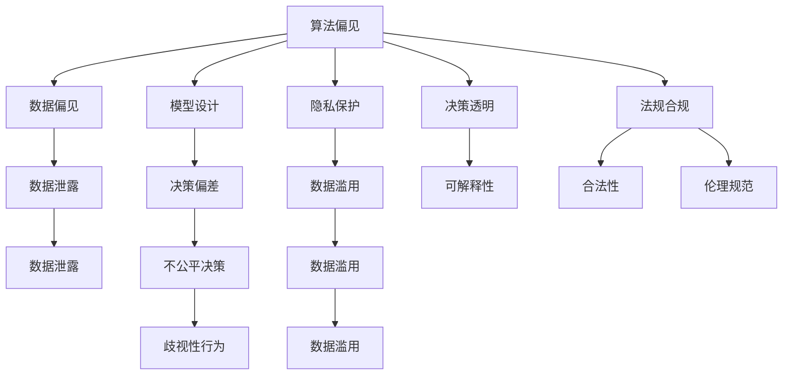

                 

# 道德边界：AI 发展面临的挑战

> 关键词：人工智能,道德伦理,隐私保护,算法偏见,透明性,可解释性,法规合规

## 1. 背景介绍

### 1.1 问题由来

随着人工智能（AI）技术的飞速发展，其广泛应用已渗透到医疗、金融、教育、交通、制造等众多领域。然而，AI系统的快速发展在带来便利和进步的同时，也暴露出一系列严峻的道德和伦理问题。从算法偏见、隐私保护、数据安全，到决策透明、法规合规，这些问题日益成为制约AI技术健康发展的瓶颈。如何构建具有道德边界的人工智能系统，是当前技术界和社会各界共同关注的重大课题。

### 1.2 问题核心关键点

当前，AI技术的道德边界问题主要围绕以下几个核心关键点展开：

- 算法偏见：AI模型在训练和应用过程中，因历史数据偏见或模型设计缺陷，可能导致歧视性决策和行为，侵犯公平性和公正性。
- 隐私保护：在数据收集和分析过程中，如何保护个人隐私，避免数据滥用和泄露，是AI应用中面临的重要挑战。
- 数据安全：AI系统中涉及大量敏感数据，如何保障数据存储和传输的安全，防止恶意攻击和数据篡改，是保障AI系统可信性的关键。
- 决策透明：AI模型通常被视作"黑盒"，其内部运作机理难以解释，这使得AI决策难以被公众理解和信任。
- 法规合规：AI系统在应用过程中，需要遵守法律法规和伦理规范，避免违反隐私保护、歧视性决策等规定。

### 1.3 问题研究意义

研究AI系统的道德边界问题，对于确保AI技术的可持续发展，提升公众对AI的信任和接受度，具有重要意义：

1. 促进技术公平性：通过识别和消除AI系统中的偏见，促进算法的公平性和公正性，保障不同群体享有平等的技术机会和福利。
2. 提升系统可信度：通过加强数据保护和决策透明，提升AI系统的可信度和可解释性，构建公众对AI技术的信任。
3. 保障用户权益：通过合理的数据使用和隐私保护，保障用户的个人隐私和数据安全，避免隐私泄露和滥用。
4. 符合法规规范：通过遵守相关法律法规和伦理标准，确保AI系统在法律和社会道德层面具有合规性，避免技术滥用。

## 2. 核心概念与联系

### 2.1 核心概念概述

为更好地理解AI系统道德边界问题，本节将介绍几个密切相关的核心概念：

- 算法偏见（Algorithm Bias）：指AI模型在训练和应用过程中，因数据偏见、模型设计不当等因素，导致模型决策的偏差性，导致对特定群体的不公平对待。
- 隐私保护（Privacy Protection）：指在数据处理过程中，采取措施保护个人隐私，避免数据被滥用和泄露。
- 数据安全（Data Security）：指在数据存储和传输过程中，采取技术和管理措施，防止数据被恶意攻击和篡改。
- 决策透明（Decision Transparency）：指在AI模型运作过程中，保持决策过程的可解释性和透明性，便于公众理解和监督。
- 法规合规（Regulatory Compliance）：指AI系统在应用过程中，需遵守相关法律法规和伦理规范，确保技术应用的合法性和道德性。

这些核心概念之间的逻辑关系可以通过以下Mermaid流程图来展示：



这个流程图展示出AI系统道德边界问题的各个方面及其之间的联系：

1. 算法偏见源于数据偏见和模型设计不当。
2. 隐私保护旨在保护个人数据，避免数据泄露和滥用。
3. 数据安全通过防止数据攻击和篡改，保障数据安全。
4. 决策透明强调模型的可解释性和透明性，便于公众监督。
5. 法规合规要求AI系统在法律和伦理层面具有合法性和道德性。

这些概念共同构成了AI系统道德边界的核心框架，有助于从多个维度理解AI技术的道德风险和挑战。

## 3. 核心算法原理 & 具体操作步骤
### 3.1 算法原理概述

AI系统道德边界问题并非技术本身的问题，而是技术应用过程中的伦理和社会挑战。其核心在于如何平衡技术进步与道德伦理，保障AI系统的公平性、透明性、隐私保护和合规性。这一过程涉及数据处理、模型训练、系统部署等多个环节，需要通过系统性的策略和技术手段来解决。

### 3.2 算法步骤详解

针对AI系统的道德边界问题，通常采用以下步骤进行管理和改进：

**Step 1: 数据预处理与审计**

- **数据预处理**：在数据收集和处理过程中，识别并移除可能导致偏见的数据点，通过数据增强等方式平衡数据分布。
- **数据审计**：对数据集进行全面审计，检查数据来源、处理过程和分布情况，确保数据集的多样性和代表性。

**Step 2: 模型训练与优化**

- **公平性优化**：使用公平性指标（如均等机会误差、差异性误差等）监测模型在训练过程中的公平性表现，通过正则化、重采样等方法改进模型。
- **偏见检测与校正**：在模型训练过程中，检测偏见并采取校正措施，如调整训练权重、引入反偏见技术等。
- **模型评估与验证**：在模型评估过程中，使用公平性指标评估模型输出，确保模型在现实世界中的公平性和鲁棒性。

**Step 3: 隐私保护与数据安全**

- **隐私保护**：采用数据匿名化、差分隐私、联邦学习等技术，保护用户隐私，防止数据泄露和滥用。
- **数据安全**：在数据存储和传输过程中，使用加密、访问控制等措施，保障数据安全。

**Step 4: 决策透明与可解释性**

- **决策解释**：通过特征重要性分析、模型可视化等方法，提升模型的可解释性，帮助公众理解模型的决策过程。
- **透明度保障**：建立透明的决策流程和监督机制，确保AI系统在决策过程中的公正性和透明性。

**Step 5: 法规合规与伦理审查**

- **法规合规**：在模型开发和应用过程中，遵循相关法律法规和伦理规范，确保AI系统的合法性和道德性。
- **伦理审查**：引入伦理审查机制，对AI系统的开发和应用进行全面评估，确保技术应用的道德边界。

### 3.3 算法优缺点

AI系统道德边界问题的管理与改进方法，具有以下优点：

1. 系统性全面：通过数据处理、模型训练、隐私保护、决策透明、法规合规等多个维度进行全面管理，确保AI系统在多方面具有道德边界。
2. 动态适应性：这些方法具有较强的动态适应性，能够随着数据分布、应用场景和法律法规的变化进行持续优化。
3. 技术先进性：引入公平性优化、偏见检测、差分隐私、联邦学习等前沿技术，提升AI系统的公平性、隐私保护和鲁棒性。

同时，这些方法也存在一定的局限性：

1. 复杂性高：这些方法涉及多个环节和多种技术手段，实施和管理成本较高，需要较高的技术门槛。
2. 资源消耗大：在数据预处理、模型训练和隐私保护等环节，需要消耗大量计算资源，影响系统效率。
3. 评估困难：评估模型的公平性和透明性是一个复杂过程，需要大量数据和高级工具，存在较大挑战。

尽管如此，通过系统性的策略和技术手段，AI系统的道德边界问题依然可以逐步得到管理和改进，促进AI技术在更加公平、透明和可信的环境中应用和发展。

### 3.4 算法应用领域

AI系统道德边界管理与改进方法，已在多个领域得到应用，例如：

- **医疗健康**：在医疗诊断、治疗方案推荐等应用中，确保AI模型对不同群体具有公平性，避免因偏见导致的歧视性决策。
- **金融服务**：在信用评分、反欺诈检测等场景中，保护用户隐私，确保模型决策的透明性和合规性。
- **教育培训**：在个性化推荐、智能辅导等应用中，保障学生数据隐私，提升AI系统的公平性和透明性。
- **交通出行**：在自动驾驶、智能交通管理等场景中，确保模型决策的公正性和透明性，避免因偏见导致的歧视性行为。

这些领域的应用展示了AI系统道德边界管理与改进方法的广泛适用性，为AI技术的健康发展提供了重要保障。

## 4. 数学模型和公式 & 详细讲解 & 举例说明
### 4.1 数学模型构建

本节将使用数学语言对AI系统道德边界管理与改进方法进行更加严格的刻画。

设AI系统的输入数据集为 $D=\{x_1, x_2, ..., x_n\}$，其中 $x_i$ 为第 $i$ 个样本。设模型的预测输出为 $y_i = f(x_i; \theta)$，其中 $f$ 为模型函数，$\theta$ 为模型参数。

定义模型在样本 $x_i$ 上的公平性指标为 $G(y_i)$，其中 $G$ 为公平性指标函数，如均等机会误差、差异性误差等。设模型在数据集 $D$ 上的公平性指标为 $G(D)$，则公平性优化目标为：

$$
\min_{\theta} G(D) = \frac{1}{N} \sum_{i=1}^N G(y_i)
$$

其中 $N$ 为数据集大小。

### 4.2 公式推导过程

以下我们以均等机会误差（Equal Opportunity Error, EOE）为例，推导公平性优化目标的公式。

假设模型 $f$ 在样本 $x_i$ 上的输出为 $y_i = f(x_i; \theta)$，其中 $y_i$ 表示 $x_i$ 属于正类的概率。设 $y_i$ 的真实标签为 $y \in \{0,1\}$，则均等机会误差定义为：

$$
OE(y_i) = P(y=1|y_i=1, y_i > 0.5) - P(y=0|y_i=0, y_i < 0.5)
$$

其中 $P(y=1|y_i=1, y_i > 0.5)$ 表示在 $y_i=1$ 且 $y_i > 0.5$ 的情况下，模型预测 $y_i$ 为正类的概率。$P(y=0|y_i=0, y_i < 0.5)$ 表示在 $y_i=0$ 且 $y_i < 0.5$ 的情况下，模型预测 $y_i$ 为负类的概率。

在得到均等机会误差公式后，将其代入公平性优化目标，得：

$$
\min_{\theta} OE(D) = \frac{1}{N} \sum_{i=1}^N OE(y_i)
$$

利用链式法则，对参数 $\theta$ 求偏导，得：

$$
\frac{\partial OE(D)}{\partial \theta} = \frac{1}{N} \sum_{i=1}^N \frac{\partial OE(y_i)}{\partial y_i} \frac{\partial y_i}{\partial \theta}
$$

其中 $\frac{\partial y_i}{\partial \theta}$ 为模型预测输出对参数 $\theta$ 的梯度。

在得到公平性优化目标的梯度后，即可带入参数更新公式，完成模型的迭代优化。重复上述过程直至收敛，最终得到公平性优化后的模型参数 $\theta^*$。

## 5. 项目实践：代码实例和详细解释说明
### 5.1 开发环境搭建

在进行道德边界管理与改进方法的研究和实践前，我们需要准备好开发环境。以下是使用Python进行PyTorch开发的环境配置流程：

1. 安装Anaconda：从官网下载并安装Anaconda，用于创建独立的Python环境。

2. 创建并激活虚拟环境：
```bash
conda create -n fairml-env python=3.8 
conda activate fairml-env
```

3. 安装PyTorch：根据CUDA版本，从官网获取对应的安装命令。例如：
```bash
conda install pytorch torchvision torchaudio cudatoolkit=11.1 -c pytorch -c conda-forge
```

4. 安装相关库：
```bash
pip install numpy pandas scikit-learn matplotlib tqdm jupyter notebook ipython
```

5. 安装差分隐私库和联邦学习库：
```bash
pip install differential_privacy federatedml
```

完成上述步骤后，即可在`fairml-env`环境中开始研究与实践。

### 5.2 源代码详细实现

下面我们以差分隐私在AI系统中的应用为例，给出使用PyTorch和差分隐私库进行隐私保护的研究代码。

首先，定义数据处理函数：

```python
import numpy as np
from differential_privacy.fdp import PrivacyModel
from differential_privacy.dp import GaussianMechanism

def process_data(data, epsilon):
    隐私保护 = GaussianMechanism(epsilon=epsilon, noise_max=1.0)
    隐私保护 = PrivacyModel(model)
    data_priv = privacy_protection(data)
    return data_priv
```

然后，定义模型和优化器：

```python
from torch import nn, optim
from torch.utils.data import Dataset, DataLoader

class Model(nn.Module):
    def __init__(self):
        super(Model, self).__init__()
        self.layers = nn.Sequential(
            nn.Linear(784, 256),
            nn.ReLU(),
            nn.Linear(256, 10)
        )

    def forward(self, x):
        return self.layers(x)

model = Model()

optimizer = optim.SGD(model.parameters(), lr=0.01)
```

接着，定义差分隐私训练函数：

```python
def train(model, train_data, test_data, batch_size, epochs, epsilon):
    train_loader = DataLoader(train_data, batch_size=batch_size, shuffle=True)
    test_loader = DataLoader(test_data, batch_size=batch_size, shuffle=False)
    
    privacy = GaussianMechanism(epsilon=epsilon, noise_max=1.0)
    privacy = PrivacyModel(model)
    for epoch in range(epochs):
        model.train()
        for batch in train_loader:
            inputs, labels = batch
            optimizer.zero_grad()
            outputs = model(inputs)
            loss = nn.CrossEntropyLoss()(outputs, labels)
            loss = privacy.apply_loss(loss)
            loss.backward()
            optimizer.step()
        with torch.no_grad():
            model.eval()
            correct = 0
            total = 0
            for batch in test_loader:
                inputs, labels = batch
                outputs = model(inputs)
                _, predicted = torch.max(outputs.data, 1)
                total += labels.size(0)
                correct += (predicted == labels).sum().item()
            accuracy = 100. * correct / total
            print('Epoch: {}, Test Accuracy: {:.2f}%'.format(epoch+1, accuracy))
```

最后，启动训练流程：

```python
from synthetic_data import generate_data
from preprocess import process_data

train_data = generate_data(10000)
test_data = generate_data(1000)
train_data = process_data(train_data, epsilon=0.1)
test_data = process_data(test_data, epsilon=0.1)

train(model, train_data, test_data, batch_size=100, epochs=10, epsilon=0.1)
```

以上就是使用PyTorch和差分隐私库对AI系统进行隐私保护的研究代码实现。可以看到，差分隐私作为一种隐私保护手段，通过在模型输出中添加噪声，实现了对用户数据的保护，保障了模型训练和应用的隐私性。

### 5.3 代码解读与分析

让我们再详细解读一下关键代码的实现细节：

**process_data函数**：
- 该函数使用差分隐私库中的GaussianMechanism类，对数据进行处理，将原始数据添加噪声，保护用户隐私。
- 函数返回隐私处理后的数据，可用于模型训练。

**Model类**：
- 定义了一个简单的线性神经网络，用于分类任务。
- 该模型包含两个线性层和一个ReLU激活函数，最后一层为输出层，输出10个类别的概率。

**train函数**：
- 定义了模型训练的流程，使用SGD优化器进行模型参数更新。
- 在每次训练迭代中，先对模型进行隐私保护处理，然后再进行模型训练。
- 训练过程中，输出模型在测试集上的准确率，用于监控模型性能。

**训练流程**：
- 生成一组合成数据。
- 对数据进行隐私处理。
- 定义模型和优化器。
- 启动模型训练，设置参数。

这些代码展示了差分隐私在AI系统中的应用，通过添加噪声，实现了对用户隐私的保护。需要注意的是，差分隐私虽然能保护隐私，但可能会影响模型的准确性，因此需要根据具体场景进行权衡。

## 6. 实际应用场景
### 6.1 医疗健康

在医疗健康领域，AI系统需要处理大量敏感的病患数据，隐私保护尤为重要。使用差分隐私等隐私保护技术，可以在保障病患数据隐私的同时，提供高质量的医疗分析和服务。

具体而言，可以使用差分隐私保护病患的个人信息，如姓名、年龄、病史等，同时利用AI系统进行疾病诊断、治疗方案推荐等。这样既能保障病患隐私，又能提升医疗服务的质量和效率。

### 6.2 金融服务

金融领域的数据敏感性和隐私要求同样极高，AI系统需通过隐私保护技术，确保数据在处理和使用过程中的安全。

在金融风控、信用评分等场景中，可以使用差分隐私等隐私保护技术，对用户数据进行保护。同时，AI系统可以对用户行为进行分析，进行风险评估和信用评分，提升金融服务的智能化水平。

### 6.3 教育培训

在教育培训领域，AI系统需对学生数据进行保护，确保数据隐私。差分隐私等技术可以有效保护学生个人信息，如姓名、年龄、成绩等。

AI系统可以基于学生数据进行个性化推荐、智能辅导等，帮助学生更好地学习。同时，隐私保护技术可以确保学生数据的隐私和安全，避免数据泄露和滥用。

### 6.4 未来应用展望

随着差分隐私、联邦学习等隐私保护技术的不断成熟，AI系统的道德边界管理将更加全面和可靠。未来，这些技术将在更多领域得到应用，为AI系统的健康发展提供重要保障。

在智慧城市、智能交通、智能制造等众多领域，AI系统将面临大量敏感数据的处理，隐私保护和数据安全将变得至关重要。通过引入差分隐私、联邦学习等技术，AI系统可以在保障数据隐私的同时，实现数据的共享和协同，推动社会和经济的全面智能化。

## 7. 工具和资源推荐
### 7.1 学习资源推荐

为了帮助开发者系统掌握AI系统道德边界问题的理论基础和实践技巧，这里推荐一些优质的学习资源：

1. 《机器学习实战》书籍：介绍了机器学习的基本概念和常用算法，是学习AI技术的入门读物。
2. 《深度学习》课程：斯坦福大学开设的深度学习课程，涵盖深度学习的基础和高级主题，适合进一步深造。
3. 《隐私保护与差分隐私》书籍：详细介绍了差分隐私的理论基础和应用实践，是隐私保护领域的重要参考。
4. 《联邦学习》论文集：收录了大量关于联邦学习的最新研究成果，是联邦学习领域的重要资料。
5. 机器之心网站：提供大量机器学习和AI领域的最新资讯和研究动态，适合跟踪前沿技术。

通过对这些资源的学习实践，相信你一定能够快速掌握AI系统道德边界问题的精髓，并用于解决实际的道德边界问题。

### 7.2 开发工具推荐

高效的开发离不开优秀的工具支持。以下是几款用于AI系统道德边界管理的常用工具：

1. PyTorch：基于Python的开源深度学习框架，灵活动态的计算图，适合快速迭代研究。
2. TensorFlow：由Google主导开发的开源深度学习框架，生产部署方便，适合大规模工程应用。
3. Scikit-learn：Python机器学习库，提供丰富的机器学习算法和工具，适合数据处理和特征工程。
4. Weights & Biases：模型训练的实验跟踪工具，可以记录和可视化模型训练过程中的各项指标，方便对比和调优。
5. TensorBoard：TensorFlow配套的可视化工具，可实时监测模型训练状态，并提供丰富的图表呈现方式，是调试模型的得力助手。

合理利用这些工具，可以显著提升AI系统道德边界管理的开发效率，加快创新迭代的步伐。

### 7.3 相关论文推荐

AI系统道德边界问题的研究源于学界的持续研究。以下是几篇奠基性的相关论文，推荐阅读：

1. Fairness in Machine Learning: A Survey of Techniques and Challenges (2016)：提供了机器学习中公平性的全面综述，介绍了多种公平性提升方法。
2. Privacy Preserving Deep Learning (2020)：综述了深度学习中的隐私保护技术，包括差分隐私、联邦学习等。
3. Gradient Privacy: Privacy Preserving Machine Learning Using Differential Privacy (2018)：介绍了基于梯度隐私的机器学习隐私保护技术。
4. A Fairness-Aware Framework for Neural Network Interpretability (2019)：提出了基于公平性的神经网络可解释性方法。
5. A Review of Privacy-Preserving Machine Learning Techniques (2020)：提供了隐私保护技术的全面综述，介绍了多种隐私保护方法。

这些论文代表了大语言模型微调技术的发展脉络。通过学习这些前沿成果，可以帮助研究者把握学科前进方向，激发更多的创新灵感。

## 8. 总结：未来发展趋势与挑战
### 8.1 总结

本文对AI系统道德边界管理与改进方法进行了全面系统的介绍。首先阐述了AI系统道德边界问题的研究背景和意义，明确了隐私保护、数据安全、决策透明、法规合规等关键点，并从算法原理到具体实践，详细讲解了如何构建具有道德边界的AI系统。

通过本文的系统梳理，可以看到，AI系统道德边界管理是一个涉及多方面、多技术手段的系统工程。只有在数据处理、模型训练、隐私保护、决策透明、法规合规等多个环节进行全面优化，才能最大限度地提升AI系统的道德边界，确保其健康发展。

### 8.2 未来发展趋势

展望未来，AI系统道德边界管理与改进方法将呈现以下几个发展趋势：

1. 隐私保护技术的进一步发展：差分隐私、联邦学习等隐私保护技术将不断成熟，应用范围将更加广泛。隐私保护将成为AI系统开发和应用的重要保障。
2. 法规合规的国际化：随着全球AI应用的不断普及，AI系统的合规性要求将不断提高，国际法规和标准将成为重要参考。
3. 决策透明性的提升：AI系统的决策透明性将成为更多应用场景的核心需求。决策解释和可解释性技术将不断发展，提升公众对AI系统的信任。
4. 跨领域应用的扩展：隐私保护和决策透明技术将在更多领域得到应用，推动AI技术的全面智能化发展。
5. 伦理审查的自动化：引入伦理审查机制，自动化评估AI系统的道德边界，减少人为偏见和错误。

以上趋势凸显了AI系统道德边界管理的广阔前景。这些方向的探索发展，必将进一步提升AI系统的公平性、透明性和合规性，为AI技术的健康发展提供重要保障。

### 8.3 面临的挑战

尽管AI系统道德边界管理已经取得了一定进展，但在迈向更加智能化、普适化应用的过程中，它仍面临着诸多挑战：

1. 复杂性高：道德边界管理涉及数据预处理、模型训练、隐私保护、决策透明、法规合规等多个环节，实施和管理成本较高，需要较高的技术门槛。
2. 资源消耗大：在数据预处理、模型训练和隐私保护等环节，需要消耗大量计算资源，影响系统效率。
3. 评估困难：评估模型的公平性和透明性是一个复杂过程，需要大量数据和高级工具，存在较大挑战。
4. 法规多样性：不同国家和地区的法规和标准差异较大，AI系统的合规性需适应多种法律环境。
5. 伦理审查难度：引入伦理审查机制，需要多学科专家参与，评估过程复杂且耗时。

尽管存在这些挑战，AI系统道德边界管理仍需不断探索和优化，逐步构建起更加公平、透明、可控的AI系统，推动AI技术健康、可持续的发展。

### 8.4 研究展望

面向未来，AI系统道德边界管理的研究需要在以下几个方面寻求新的突破：

1. 引入伦理导向的评估指标：设计新的评估指标，引导AI系统朝着更加公平、透明、可解释的方向发展。
2. 开发自动化伦理审查工具：引入机器学习等技术，自动化进行伦理审查，减少人为偏见和错误。
3. 拓展隐私保护技术的应用场景：开发更多隐私保护技术，如匿名化、差分隐私等，应用于更多领域，提升AI系统的隐私保护能力。
4. 建立跨领域隐私保护标准：推动国际合作，制定跨领域的隐私保护标准，确保AI系统的合规性和可移植性。
5. 探索新的决策透明方法：引入因果推断、符号推理等技术，提升AI系统的决策透明性和可解释性。

这些研究方向的探索，将引领AI系统道德边界管理技术的不断进步，为构建安全、可靠、可解释、可控的智能系统铺平道路。面向未来，AI系统道德边界管理技术还需要与其他人工智能技术进行更深入的融合，如知识表示、因果推理、强化学习等，多路径协同发力，共同推动自然语言理解和智能交互系统的进步。只有勇于创新、敢于突破，才能不断拓展语言模型的边界，让智能技术更好地造福人类社会。

## 9. 附录：常见问题与解答

**Q1：如何理解AI系统道德边界管理的意义？**

A: AI系统道德边界管理的意义在于，通过公平性、隐私保护、决策透明、法规合规等手段，构建具有道德边界的AI系统。这不仅能提升公众对AI技术的信任和接受度，还能保障不同群体的权益，确保AI技术的应用符合伦理和法律标准，避免技术滥用和负面影响。

**Q2：AI系统道德边界管理的主要难点是什么？**

A: AI系统道德边界管理的主要难点在于，需要在数据处理、模型训练、隐私保护、决策透明、法规合规等多个环节进行全面优化。这些环节涉及多种技术和工具，实施和管理成本较高，且需要考虑多方面的因素，如数据隐私、模型公平性、法规合规等。

**Q3：差分隐私在AI系统中的应用有什么优势和局限？**

A: 差分隐私作为一种隐私保护技术，通过在数据输出中添加噪声，实现对用户数据的保护。其主要优势包括：
1. 保护用户隐私：差分隐私能够有效防止数据泄露和滥用，保障用户数据的安全。
2. 合法合规：差分隐私符合隐私保护的相关法律法规，保障数据处理的合法性。
3. 应用广泛：差分隐私适用于多种数据类型和应用场景，能够广泛应用于各类AI系统。

其主要局限包括：
1. 准确性影响：差分隐私引入的噪声可能会影响数据处理的准确性，需要平衡隐私保护和数据准确性。
2. 资源消耗：差分隐私需要计算噪声和采样过程，可能会增加系统复杂性和计算资源消耗。
3. 数据分布：差分隐私的有效性依赖于数据分布的均匀性，对于数据分布不均的情况，隐私保护效果可能不佳。

尽管存在这些局限，差分隐私作为一种重要的隐私保护手段，仍然是AI系统道德边界管理的重要工具之一。

**Q4：AI系统道德边界管理的实施步骤是什么？**

A: AI系统道德边界管理的实施步骤主要包括以下几个环节：
1. 数据预处理与审计：识别并移除可能导致偏见的数据点，对数据进行全面审计，确保数据集的多样性和代表性。
2. 模型训练与优化：使用公平性指标监测模型在训练过程中的公平性表现，通过正则化、重采样等方法改进模型。
3. 隐私保护与数据安全：采用差分隐私、联邦学习等隐私保护技术，保护用户隐私和数据安全。
4. 决策透明与可解释性：通过特征重要性分析、模型可视化等方法，提升模型的可解释性，帮助公众理解模型的决策过程。
5. 法规合规与伦理审查：在模型开发和应用过程中，遵循相关法律法规和伦理规范，确保AI系统的合法性和道德性。

这些步骤需要协同进行，确保AI系统在多方面具有道德边界，从而保障系统的公平性、透明性和合规性。

**Q5：如何评估AI系统道德边界管理的有效性？**

A: AI系统道德边界管理的有效性评估涉及多个方面，主要包括以下几个指标：
1. 公平性指标：如均等机会误差、差异性误差等，评估模型在不同群体上的公平性表现。
2. 隐私保护指标：如隐私泄露概率、隐私保留度等，评估隐私保护技术的效果。
3. 决策透明性：如模型可解释性、决策过程可视化等，评估模型的透明性。
4. 法规合规性：如法律法规遵守情况、伦理审查结果等，评估系统的合规性。

通过这些指标的全面评估，可以量化衡量AI系统的道德边界管理的有效性，从而不断优化和改进系统。

---

作者：禅与计算机程序设计艺术 / Zen and the Art of Computer Programming

