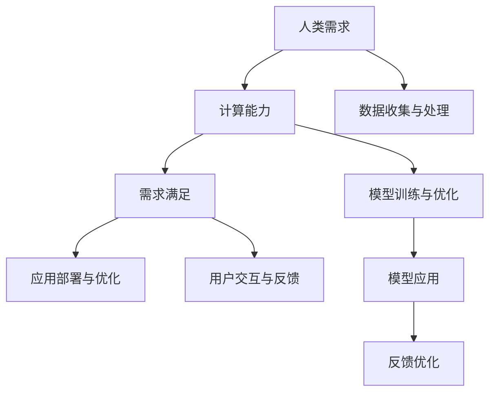

                 

# 释放人类潜力的无限可能：人类计算的最终目标

人类计算，这四个字听上去或许有些科幻，但若将这四个字拆分开来看，便能发现它所蕴藏的巨大潜能。“人类”意味着全面解决人类在各种场景下的需求，而“计算”则是对人类需求的理性分析与处理。因此，“人类计算”意味着通过对人类需求的深入理解与满足，来最大化人类自身的潜力。本文将深入探讨人类计算的核心概念、实现原理、操作步骤，以及其在各个领域的应用场景，并为未来发展趋势和面临的挑战提供深刻的思考和见解。

## 1. 背景介绍

### 1.1 问题由来

人类计算的概念最早可以追溯到古希腊时期，那时人们就已开始探索如何通过计算来解决实际问题。随着科学技术的发展，计算机的出现极大地扩展了人类计算的能力，使得计算能够处理更为复杂和庞大的数据。而随着人工智能的兴起，计算力开始超越人类的能力，能在短时间内完成人类需要数年甚至数十年才能完成的任务。

当前，计算能力正在以指数级增长的速度提升，但人类计算的终极目标并不仅仅在于提高计算效率，更在于利用计算解决人类在各个领域面临的实际问题，提升人类的生活质量，释放人类的潜力。

### 1.2 问题核心关键点

人类计算的核心在于对人类需求的全面理解和满足。要实现这一目标，需要从以下几个关键点出发：

1. **数据收集与处理**：收集全面的数据，并对其进行处理，以便于后续分析。
2. **模型训练与优化**：建立模型并进行训练，以提高模型的预测和推理能力。
3. **应用部署与优化**：将模型应用于实际场景，并根据反馈进行优化。
4. **用户交互与反馈**：通过用户反馈，持续改进计算模型，以满足用户不断变化的需求。

### 1.3 问题研究意义

人类计算的研究意义在于，它能够帮助人类更全面地理解和解决自身的各种需求，从而最大化人类潜力。具体而言：

1. **提高生产效率**：通过计算优化生产流程，减少人力成本，提高生产效率。
2. **改善医疗健康**：通过计算辅助医疗诊断和治疗，提升医疗服务质量。
3. **提升教育水平**：通过计算个性化教育，提升教育效果。
4. **改善社会治理**：通过计算优化社会治理流程，提升社会管理效率。
5. **促进经济发展**：通过计算优化资源配置，促进经济发展。

## 2. 核心概念与联系

### 2.1 核心概念概述

在探讨人类计算的核心概念时，我们需要关注以下几个关键点：

- **人类需求**：指人类在各种场景下提出的需求，包括生产、医疗、教育、社会治理等各个方面。
- **计算能力**：指通过计算机实现的计算能力，包括数据处理、模型训练、推理预测等。
- **需求满足**：指通过计算能力对人类需求的满足，包括生产效率提升、医疗健康改善、教育水平提升、社会治理优化、经济发展促进等。

### 2.2 核心概念联系

人类计算涉及的核心概念之间存在紧密的联系。如图：



这个流程图展示了人类计算的基本逻辑流程：首先收集和处理数据，然后通过训练和优化模型，再将模型应用于实际场景中，并根据用户反馈进行优化。

## 3. 核心算法原理 & 具体操作步骤

### 3.1 算法原理概述

人类计算的实现原理基于人工智能和机器学习的核心算法，主要包括数据预处理、模型训练、模型评估和模型应用等步骤。

- **数据预处理**：对原始数据进行清洗、去重、归一化等处理，以便于后续模型训练。
- **模型训练**：利用训练数据训练模型，以提高模型的预测和推理能力。
- **模型评估**：对训练好的模型进行评估，以确保其预测准确性和鲁棒性。
- **模型应用**：将模型应用于实际场景中，以满足人类需求。

### 3.2 算法步骤详解

以下是一个完整的算法步骤：

1. **数据收集**：从各个渠道收集数据，包括文本、图像、视频、音频等多种形式。
2. **数据清洗**：对收集到的数据进行清洗，去除噪声和不相关数据。
3. **数据标注**：对清洗后的数据进行标注，以便于后续模型训练。
4. **模型选择**：选择适合的模型，包括深度学习模型、传统机器学习模型等。
5. **模型训练**：利用标注数据训练模型，并根据需要进行超参数调整。
6. **模型评估**：在验证集上评估模型性能，确保模型具有较好的泛化能力。
7. **模型优化**：根据评估结果进行模型优化，提高模型性能。
8. **模型应用**：将优化后的模型应用于实际场景中，以满足人类需求。
9. **用户反馈**：收集用户反馈，持续改进模型。

### 3.3 算法优缺点

人类计算的优点在于其强大的数据处理和模型训练能力，能够快速高效地解决人类面临的各类需求。缺点则在于对数据质量和标注的依赖，以及模型应用的复杂性。

### 3.4 算法应用领域

人类计算的应用领域广泛，涉及生产、医疗、教育、社会治理等多个方面。

1. **生产领域**：通过计算优化生产流程，提高生产效率，降低成本。
2. **医疗领域**：通过计算辅助医疗诊断和治疗，提升医疗服务质量。
3. **教育领域**：通过计算个性化教育，提升教育效果。
4. **社会治理领域**：通过计算优化社会治理流程，提升社会管理效率。
5. **经济发展领域**：通过计算优化资源配置，促进经济发展。

## 4. 数学模型和公式 & 详细讲解

### 4.1 数学模型构建

人类计算的数学模型主要基于深度学习和机器学习。以下是一个典型的回归模型：

$$ y = \theta_0 + \theta_1 x_1 + \theta_2 x_2 + ... + \theta_n x_n $$

其中，$y$ 为预测结果，$\theta$ 为模型参数，$x$ 为输入特征。

### 4.2 公式推导过程

以线性回归为例，其最小二乘法的推导过程如下：

$$ \theta = (X^T X)^{-1} X^T y $$

其中，$X$ 为输入特征矩阵，$y$ 为预测结果向量。

### 4.3 案例分析与讲解

以预测房价为例，我们可以使用线性回归模型。首先，收集历史房屋销售数据，包括房屋面积、房间数量、地理位置等特征，以及对应售价。然后，利用数据进行模型训练，得到模型参数 $\theta$。最后，将新房屋的特征输入模型，即可预测其售价。

## 5. 项目实践：代码实例和详细解释说明

### 5.1 开发环境搭建

要实现人类计算，首先需要搭建一个高效的开发环境。以下是一个Python环境的搭建步骤：

1. 安装Anaconda：从官网下载并安装Anaconda。
2. 创建并激活虚拟环境：
```bash
conda create -n pyenv python=3.8
conda activate pyenv
```
3. 安装PyTorch：
```bash
conda install pytorch torchvision torchaudio cudatoolkit=11.1 -c pytorch -c conda-forge
```
4. 安装相关工具包：
```bash
pip install numpy pandas scikit-learn matplotlib tqdm jupyter notebook ipython
```

### 5.2 源代码详细实现

以下是一个简单的线性回归模型实现代码：

```python
import numpy as np
import matplotlib.pyplot as plt

# 数据生成
x = np.linspace(-1, 1, 100)
y = 2 * x + np.random.randn(*x.shape) * 0.1 + 0.5

# 训练数据
train_x = x[:80]
train_y = y[:80]
test_x = x[80:]

# 模型参数初始化
theta = np.random.randn()

# 梯度下降
for i in range(1000):
    grad = 2 * train_x * train_y - 2 * train_x * theta
    theta -= 0.01 * grad

# 预测
pred_y = theta * train_x + 0.5

# 可视化
plt.scatter(train_x, train_y, color='black')
plt.plot(train_x, pred_y, color='red')
plt.show()
```

### 5.3 代码解读与分析

该代码实现了一个简单的线性回归模型，其基本流程如下：

1. 数据生成：使用Numpy生成一个简单的线性数据集。
2. 训练数据划分：将数据划分为训练集和测试集。
3. 模型参数初始化：随机初始化模型参数。
4. 梯度下降：通过梯度下降算法更新模型参数。
5. 预测：使用训练好的模型进行预测。
6. 可视化：将训练集和预测结果可视化。

## 6. 实际应用场景

### 6.1 智能制造

智能制造是人类计算在生产领域的重要应用之一。通过计算，可以实现对生产流程的优化，提高生产效率和产品质量。

### 6.2 智慧医疗

智慧医疗是另一个重要应用领域。通过计算，可以实现对医疗数据的深度分析，辅助医生诊断和治疗，提升医疗服务质量。

### 6.3 个性化教育

个性化教育也是人类计算的重要应用场景。通过计算，可以个性化设计教学方案，提升教育效果。

### 6.4 社会治理

社会治理是人类计算的重要应用方向之一。通过计算，可以实现对社会数据的深度分析，优化社会治理流程，提升社会管理效率。

### 6.5 智慧交通

智慧交通也是人类计算的重要应用场景之一。通过计算，可以实现对交通数据的深度分析，优化交通管理，提升出行效率。

## 7. 工具和资源推荐

### 7.1 学习资源推荐

以下是一些学习人类计算的推荐资源：

1. 《深度学习》（Deep Learning）：Ian Goodfellow 等人合著的经典教材，详细介绍了深度学习的各个方面。
2. 《机器学习实战》（Machine Learning in Action）：Peter Harrington 著的实践性很强的机器学习入门书籍。
3. 《Python 数据科学手册》（Python Data Science Handbook）：Jake VanderPlas 著的介绍Python数据科学工具的书籍。
4. Kaggle：一个数据科学竞赛平台，可以实践和分享数据科学项目。
5. Coursera：一个在线学习平台，提供大量数据科学和机器学习课程。

### 7.2 开发工具推荐

以下是一些推荐的开发工具：

1. Jupyter Notebook：一个交互式的Python开发环境，可以方便地进行数据探索和代码测试。
2. PyTorch：一个强大的深度学习框架，提供了丰富的神经网络库和工具。
3. TensorFlow：另一个流行的深度学习框架，支持分布式计算和GPU加速。
4. Anaconda：一个科学计算环境，提供了大量的科学计算库和工具。
5. Scikit-learn：一个常用的机器学习库，提供了各种常用的机器学习算法和工具。

### 7.3 相关论文推荐

以下是一些推荐的人类计算相关论文：

1. "Deep Learning" by Ian Goodfellow, Yoshua Bengio, and Aaron Courville.
2. "Human-Computer Interaction" by Bina Cremin, Jon Warnell, and Peter Sharp.
3. "Data Science for Business: What You Need to Know about Data Mining and Statistical Learning" by Foster Provost and Tom Fawcett.
4. "AI Superpowers: China, Silicon Valley, and the New World Order" by Kai-Fu Lee.
5. "Artificial Intelligence: A Modern Approach" by Stuart Russell and Peter Norvig.

## 8. 总结：未来发展趋势与挑战

### 8.1 研究成果总结

人类计算的研究成果主要集中在以下几个方面：

1. **数据处理能力**：通过深度学习等技术，处理大规模数据的能力得到了极大的提升。
2. **模型训练效率**：通过GPU、TPU等硬件加速，模型训练效率得到了极大的提升。
3. **应用场景广泛**：人类计算的应用场景非常广泛，涉及生产、医疗、教育等多个领域。

### 8.2 未来发展趋势

未来人类计算的发展趋势主要包括以下几个方面：

1. **深度学习模型**：深度学习模型将成为未来计算的核心。
2. **云计算**：云计算将为计算提供更强大的计算能力和存储能力。
3. **大数据**：大数据将为计算提供更丰富的数据来源。
4. **边缘计算**：边缘计算将使得计算更加贴近实际应用场景，提升计算效率。
5. **人机协同**：人机协同将使得计算更加智能化，更好地满足人类需求。

### 8.3 面临的挑战

人类计算面临的挑战主要包括以下几个方面：

1. **数据隐私**：数据隐私问题是一个重要挑战，需要采取措施保护用户数据。
2. **计算资源**：大规模计算需要强大的计算资源，成本较高。
3. **模型复杂性**：模型越复杂，训练和推理的计算量越大，需要优化计算资源。
4. **用户体验**：用户界面设计需要考虑用户体验，提升用户满意度。

### 8.4 研究展望

未来的研究展望主要包括以下几个方面：

1. **高效算法**：开发更高效的算法，提升计算效率。
2. **智能算法**：开发更智能的算法，提升计算效果。
3. **跨领域应用**：拓展人类计算在更多领域的应用。
4. **隐私保护**：开发更完善的隐私保护技术，保障用户数据安全。

## 9. 附录：常见问题与解答

**Q1: 人类计算的核心是什么？**

A: 人类计算的核心在于全面理解人类需求，并利用计算能力进行深度分析和处理，以最大程度满足人类需求。

**Q2: 如何提高人类计算的计算效率？**

A: 可以通过优化算法、使用高效硬件、减少数据冗余等方法提高计算效率。

**Q3: 人类计算面临的主要挑战有哪些？**

A: 主要挑战包括数据隐私、计算资源、模型复杂性和用户体验等。

**Q4: 人类计算的未来发展趋势是什么？**

A: 未来的发展趋势包括深度学习模型、云计算、大数据、边缘计算和人机协同等。

**Q5: 人类计算的实际应用场景有哪些？**

A: 实际应用场景包括智能制造、智慧医疗、个性化教育、社会治理和智慧交通等。

---

作者：禅与计算机程序设计艺术 / Zen and the Art of Computer Programming

