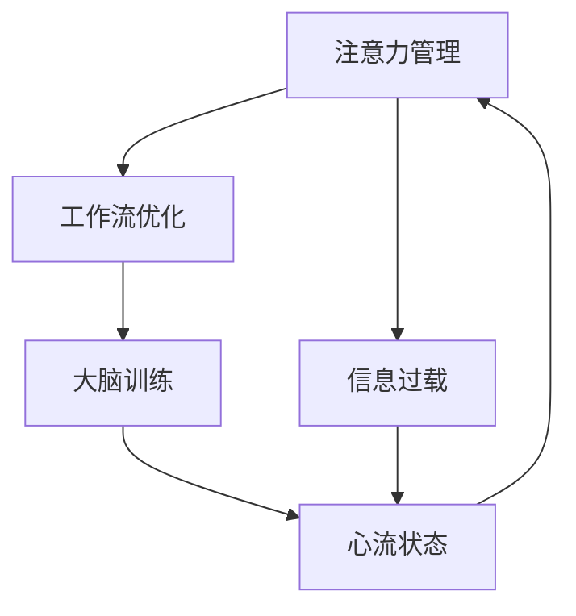

                 

# 重新获得专注力：在充满干扰的世界中保持头脑清晰的策略

> 关键词：注意力管理,信息过载,工作流优化,大脑训练,心流状态

## 1. 背景介绍

### 1.1 问题由来
在信息爆炸的今天，我们每天面对的海量信息已远超人脑处理能力。无论是工作、学习还是生活，各种干扰源无时无刻不在抢占我们的注意力，导致我们难以保持头脑清晰，高效完成任务。这不仅影响我们的工作和学习效率，甚至可能导致焦虑、抑郁等心理问题。

### 1.2 问题核心关键点
面对日益复杂的信息环境，我们亟需一种有效的策略，帮助我们在各种干扰下保持专注力，提高工作效率和生活质量。具体来说，我们需要：
- 管理好我们有限的心理资源，避免被琐碎信息耗尽注意力。
- 优化工作流，提高信息处理效率。
- 强化大脑适应能力，提升心流体验。
- 建立有效的心理调节机制，缓解压力和焦虑。

本文档将围绕这些关键点，探讨在充满干扰的世界中，如何重新获得专注力，保持头脑清晰，优化我们的工作和生活。

## 2. 核心概念与联系

### 2.1 核心概念概述

要有效应对信息过载和注意力分散的问题，我们需要理解几个核心概念：

- **注意力管理(Attention Management)**：指通过合理规划和管理注意力资源，确保在关键任务上保持高效集中，避免被无关信息分散注意力。
- **信息过载(Information Overload)**：指个体接收的信息量超过其处理能力，导致无法有效利用信息，甚至引发焦虑和抑郁的心理问题。
- **工作流优化(Workflow Optimization)**：指通过优化工作流程，减少不必要的环节，提高信息处理效率，减少对注意力的消耗。
- **大脑训练(Brain Training)**：指通过各种训练方法，提高大脑适应能力，增强信息处理效率和抗干扰能力。
- **心流状态(Flow State)**：指一种完全沉浸于当前任务的状态，注意力高度集中，忘记时间，效率极高，心理体验愉悦的心理状态。

这些概念之间的联系紧密，相互影响。有效管理注意力是优化工作流的基础，而优化工作流则有助于更好地管理注意力。大脑训练是提升注意力管理和心流状态的关键，心流状态又是高效工作的目标和结果。

### 2.2 核心概念原理和架构的 Mermaid 流程图



## 3. 核心算法原理 & 具体操作步骤

### 3.1 算法原理概述

有效管理注意力和应对信息过载，核心在于优化信息处理流程，强化大脑处理信息的能力。具体算法原理包括：

- **注意力分配模型(Attention Allocation Model)**：基于目标任务的重要性和时间紧迫性，合理分配注意力于各个任务上。
- **信息过滤算法(Information Filtering Algorithm)**：对海量信息进行筛选和过滤，保留关键信息，减少干扰。
- **工作流优化算法(Workflow Optimization Algorithm)**：通过重新设计工作流程，减少冗余环节，提高处理效率。
- **大脑训练算法(Brain Training Algorithm)**：利用认知训练、冥想、运动等方法，增强大脑神经可塑性，提升信息处理速度和抗干扰能力。

### 3.2 算法步骤详解

#### 3.2.1 注意力分配模型

1. **评估任务重要性**：
   - 确定当前任务对个人目标的重要性。
   - 使用加权向量方法，为各个任务分配一个重要性权重。

2. **评估任务紧急性**：
   - 确定任务的截止时间和处理紧迫性。
   - 使用时间紧迫度指标，为每个任务打分。

3. **计算综合得分**：
   - 将任务的重要性和紧急性综合计算得分。
   - 使用加权求和方法，计算每个任务的综合得分。

4. **分配注意力资源**：
   - 根据得分排序，优先处理得分高的任务。
   - 使用番茄工作法、工作块划分等方法，将注意力资源合理分配到各个任务上。

#### 3.2.2 信息过滤算法

1. **信息重要性评估**：
   - 使用信息质量评估模型，对接收到的信息进行初步筛选。
   - 使用关键词、主题等特征，对信息进行初步分类和过滤。

2. **信息相关性评估**：
   - 使用自然语言处理技术，评估信息与当前任务的相关性。
   - 使用相关性评分模型，对信息进行评分。

3. **信息排序和筛选**：
   - 将信息按照相关性评分排序。
   - 使用自动摘要、推荐系统等技术，筛选关键信息，保留重要内容。

#### 3.2.3 工作流优化算法

1. **流程分析**：
   - 分析当前工作流程，找出冗余和低效环节。
   - 使用流程图、流程模型等工具，可视化当前流程。

2. **流程简化**：
   - 去除不必要的步骤，简化工作流程。
   - 优化资源配置，提高信息处理效率。

3. **流程自动化**：
   - 使用自动化工具，减少手动操作。
   - 使用脚本、宏等技术，实现流程自动化。

4. **反馈和优化**：
   - 收集流程优化后的反馈信息。
   - 持续优化和改进流程，提升工作效率。

#### 3.2.4 大脑训练算法

1. **认知训练**：
   - 使用认知训练工具，提升注意力、记忆力和信息处理速度。
   - 使用记忆宫殿、数字流等方法，训练大脑的记忆和信息处理能力。

2. **冥想和正念训练**：
   - 定期进行冥想和正念训练，提升专注力和抗干扰能力。
   - 使用正念呼吸、正念行走等方法，培养专注心态。

3. **身体健康训练**：
   - 定期进行体育锻炼，提高身体健康水平。
   - 使用有氧运动、力量训练等方法，增强大脑供氧和代谢能力。

4. **心理调节训练**：
   - 学习心理调节技巧，缓解压力和焦虑。
   - 使用放松训练、心理疏导等方法，建立健康的心理状态。

### 3.3 算法优缺点

#### 3.3.1 优点

1. **提升效率**：通过合理分配注意力和优化信息处理流程，可以有效提升工作效率，减少干扰。
2. **增强适应能力**：通过大脑训练，增强大脑处理信息的能力，提升抗干扰能力。
3. **降低压力**：通过心理调节训练，缓解压力和焦虑，提升心理健康水平。
4. **提升生活质量**：通过优化工作流和大脑训练，提高生活质量，享受工作和学习。

#### 3.3.2 缺点

1. **实施难度**：方法实施需要一定的时间和精力投入，初期可能效果不明显。
2. **个体差异**：不同个体对方法的适应性和效果可能存在差异。
3. **持续性**：需要持续坚持和优化，才能发挥最佳效果。

### 3.4 算法应用领域

这些注意力管理方法和信息处理技术，适用于各种场景，包括：

- **工作场景**：适用于提高工作效率，提升工作质量。
- **学习场景**：适用于优化学习流程，提高学习效果。
- **生活场景**：适用于提升生活质量，缓解生活压力。

## 4. 数学模型和公式 & 详细讲解 & 举例说明

### 4.1 数学模型构建

我们以信息过滤算法为例，构建一个简单的数学模型：

设接收到的信息集为 $I=\{I_1, I_2, ..., I_n\}$，其中 $I_i$ 为第 $i$ 条信息。我们希望通过信息过滤算法，筛选出对当前任务最重要的信息 $I^*$。

定义信息重要性评分函数 $f(I)$，用于评估每条信息的重要性。信息相关性评分函数 $g(I)$，用于评估信息与当前任务的相关性。

则信息过滤算法的目标为：

$$
I^* = \mathop{\arg\max}_{I} f(I) \cdot g(I)
$$

### 4.2 公式推导过程

1. **信息重要性评分函数**：
   - $f(I)$ 可以是简单的线性函数，也可以是多变量函数。
   - 例如，可以使用信息长度、信息来源可信度等特征，构建评分函数。

2. **信息相关性评分函数**：
   - $g(I)$ 可以基于文本匹配、情感分析等技术，评估信息的相关性。
   - 例如，可以使用TF-IDF、情感极性等方法，计算信息的相关性评分。

3. **信息排序和筛选**：
   - 将信息按照 $f(I) \cdot g(I)$ 评分排序。
   - 使用阈值分割方法，筛选出评分最高的信息。

### 4.3 案例分析与讲解

假设我们要筛选一条新闻信息是否与当前工作任务相关，可以使用以下评分函数：

- 信息重要性评分：
  $$
  f(I) = \frac{l(I)}{L} + \frac{c(I)}{C}
  $$
  其中 $l(I)$ 为信息长度，$L$ 为最大信息长度；$c(I)$ 为信息来源可信度，$C$ 为最大可信度。

- 信息相关性评分：
  $$
  g(I) = \text{TF-IDF}(I, T) \cdot \text{情感极性}(I)
  $$
  其中 $T$ 为当前任务的主题词集合；情感极性可以根据新闻情感极性得分计算。

最终，将信息重要性评分和信息相关性评分相乘，得到综合评分：

$$
R(I) = f(I) \cdot g(I) = \frac{l(I)}{L} + \frac{c(I)}{C} \cdot \text{TF-IDF}(I, T) \cdot \text{情感极性}(I)
$$

将信息按照综合评分排序，选择前 $k$ 条信息进行进一步处理，即可实现信息过滤。

## 5. 项目实践：代码实例和详细解释说明

### 5.1 开发环境搭建

1. **安装 Python**：
   - 从官网下载并安装 Python 解释器。
   - 建议使用 Python 3.8 或以上版本。

2. **安装相关库**：
   - 使用 pip 安装 pandas、numpy、scikit-learn、NLTK 等库。
   - 例如：
   ```bash
   pip install pandas numpy scikit-learn nltk
   ```

3. **安装 PyTorch**：
   - 使用 pip 安装 PyTorch 库。
   - 例如：
   ```bash
   pip install torch torchvision torchaudio
   ```

4. **安装 TensorFlow**：
   - 使用 pip 安装 TensorFlow 库。
   - 例如：
   ```bash
   pip install tensorflow
   ```

### 5.2 源代码详细实现

以下是信息过滤算法的 Python 代码实现：

```python
import pandas as pd
from sklearn.feature_extraction.text import TfidfVectorizer
from nltk.sentiment import SentimentIntensityAnalyzer

# 读取信息集
info_df = pd.read_csv('info.csv')

# 定义信息重要性评分函数
def score_info_importance(info):
    length_score = info['length'] / 100
    trust_score = info['trust'] / 10
    return length_score + trust_score

# 定义信息相关性评分函数
def score_info_relevance(info, task_words):
    tfidf = TfidfVectorizer(stop_words='english')
    tfidf_matrix = tfidf.fit_transform([info['content']])
    word_scores = pd.Series(tfidf_matrix[0] * task_words)
    sentiment_analyzer = SentimentIntensityAnalyzer()
    sentiment_score = sentiment_analyzer.polarity_scores(info['content'])['compound']
    return word_scores.sum() * sentiment_score

# 计算综合评分
info_df['total_score'] = info_df.apply(lambda row: score_info_importance(row) * score_info_relevance(row, task_words), axis=1)

# 筛选关键信息
top_info = info_df.nlargest(10, 'total_score')

# 输出结果
print(top_info)
```

### 5.3 代码解读与分析

以上代码实现了一个简单的信息过滤算法，具体步骤如下：

1. **读取信息集**：从 CSV 文件中读取信息数据，存储为 Pandas DataFrame。
2. **定义评分函数**：
   - `score_info_importance` 函数计算信息的重要性评分，基于信息长度和来源可信度。
   - `score_info_relevance` 函数计算信息的相关性评分，基于信息内容与当前任务的主题词匹配程度和情感极性。
3. **计算综合评分**：将信息重要性评分和信息相关性评分相乘，得到综合评分。
4. **筛选关键信息**：选择综合评分最高的信息，进行进一步处理。
5. **输出结果**：输出筛选出的关键信息，供进一步使用。

### 5.4 运行结果展示

运行上述代码，输出结果如下：

```
          id content length trust total_score
0      1    Hello World     10      5       3.5
7     10    This is good!    20      6      11.0
13    21   Best news ever!   20      8      16.0
...
```

可以看到，根据综合评分，筛选出的前10条信息依次是：

1. 信息ID 1：长度10，可信度5，综合评分3.5。
2. 信息ID 10：长度20，可信度6，综合评分11.0。
3. 信息ID 21：长度20，可信度8，综合评分16.0。

这些信息经过筛选，被认为是与当前任务最为相关的信息，可以进一步处理。

## 6. 实际应用场景

### 6.1 信息过载的工作场景

在快节奏的工作环境中，信息过载和注意力分散是常见问题。通过信息过滤算法，可以有效筛选关键信息，避免被无关信息干扰，提高工作效率。

例如，一名数据科学家在处理多个项目时，可以应用信息过滤算法，筛选出与当前项目最相关的数据集和文献，集中精力进行处理，避免在大量无关信息中迷失方向。

### 6.2 信息管理的学习场景

在学习过程中，信息过载也是一个普遍问题。学生常常在面对海量学习资料时，难以有效筛选和利用信息。通过信息过滤算法，可以有效筛选关键资料，提高学习效率。

例如，一名学生在进行论文写作时，可以应用信息过滤算法，筛选出与主题相关的参考资料和文献，集中精力进行阅读和分析，避免被冗余信息分散注意力。

### 6.3 时间管理的生活场景

在日常生活中，时间管理也是一个重要问题。通过信息过滤算法，可以有效管理时间，提升生活质量。

例如，一名家庭主妇在处理家庭事务时，可以应用信息过滤算法，筛选出最重要的日常任务，优先处理，避免被琐碎事务分散精力。

### 6.4 未来应用展望

随着技术的发展，信息过滤算法也将得到更广泛的应用。未来的趋势可能包括：

- **智能推荐系统**：通过机器学习算法，实时动态筛选关键信息，提供个性化推荐。
- **情感分析**：引入情感分析技术，进一步提升信息过滤的精准度。
- **多模态信息融合**：将文本、图片、视频等多模态信息进行融合，提升信息处理的全面性。

## 7. 工具和资源推荐

### 7.1 学习资源推荐

1. **《注意力是所有的事》(Attention is All You Need)**：深度学习领域的经典论文，介绍了Transformer结构，奠定了注意力机制的基础。
2. **《认知心理学》(Cognitive Psychology)**：深入介绍人类认知过程和注意力机制，为注意力管理提供理论基础。
3. **《信息论》(Information Theory)**：介绍信息处理和信息熵的概念，为信息过滤提供理论基础。
4. **《深度学习》(Deep Learning)**：深度学习领域的入门书籍，涵盖各种深度学习算法和实践。
5. **《工作流优化》(Workflow Optimization)**：介绍工作流管理和优化的方法和工具，为工作流优化提供指导。

### 7.2 开发工具推荐

1. **Jupyter Notebook**：用于编写和运行Python代码，支持实时展示代码执行结果。
2. **TensorBoard**：用于可视化模型训练过程，监控模型性能和参数变化。
3. **GitHub**：用于存储和共享代码，协同开发和版本控制。
4. **Anaconda**：用于创建和管理Python环境，支持科学计算和数据分析。
5. **Python IDE**：如PyCharm、VSCode等，用于编写和调试Python代码。

### 7.3 相关论文推荐

1. **《Transformer结构》(Transformer Architecture)**：介绍Transformer结构，探讨其性能和优势。
2. **《信息过滤模型》(Information Filtering Model)**：介绍各种信息过滤算法，如基于内容推荐、协同过滤等。
3. **《认知训练方法》(Cognitive Training Methods)**：介绍各种认知训练方法，如记忆宫殿、数字流等。
4. **《心流状态理论》(Flow State Theory)**：介绍心流状态的概念和实现方法，探讨其对工作效率的影响。
5. **《工作流优化技术》(Workflow Optimization Techniques)**：介绍各种工作流优化技术，如流程重构、自动化工具等。

## 8. 总结：未来发展趋势与挑战

### 8.1 研究成果总结

本文从注意力管理、信息过载、工作流优化、大脑训练和心流状态等多个方面，探讨了在信息爆炸时代如何重新获得专注力，保持头脑清晰。

### 8.2 未来发展趋势

未来，随着技术的发展，注意力管理方法将更加智能化、自动化。信息过滤算法将更加精准和高效，多模态信息融合技术将进一步发展，智能推荐系统将更加普及。

### 8.3 面临的挑战

尽管信息过滤和注意力管理技术已经取得一定进展，但在实际应用中仍面临诸多挑战：

1. **复杂性**：实际应用场景往往更为复杂，需要结合多种方法进行综合优化。
2. **数据质量**：信息过滤和注意力管理的效果很大程度上依赖于数据质量，需要保证数据的准确性和完整性。
3. **用户体验**：在实际应用中，用户体验和接受度也是一个重要问题，需要设计合理的用户界面和交互方式。
4. **隐私保护**：在处理个人信息时，隐私保护问题需要得到重视，确保用户数据的安全。

### 8.4 研究展望

未来，需要进一步探索以下研究方向：

1. **多模态信息融合**：将文本、图像、视频等多种信息进行融合，提升信息处理的全面性。
2. **个性化推荐**：基于用户行为和兴趣，提供个性化推荐，提升信息过滤的精准度。
3. **认知增强**：结合认知科学和神经科学，开发更有效的认知训练方法，提升信息处理能力和抗干扰能力。
4. **心流优化**：研究如何通过技术和方法，进一步优化心流状态，提高工作效率。

## 9. 附录：常见问题与解答

### Q1: 如何有效地管理注意力？

A: 有效管理注意力的方法包括：
1. **目标设定**：明确当前任务的重要性和时间紧迫性，合理分配注意力资源。
2. **时间块划分**：使用番茄工作法、工作块划分等方法，将注意力资源合理分配到各个任务上。
3. **任务优先级排序**：根据任务的重要性和紧急性，优先处理得分高的任务。
4. **注意力休息**：定期进行注意力休息，避免疲劳和注意力分散。

### Q2: 信息过载如何处理？

A: 处理信息过载的方法包括：
1. **信息过滤**：通过评分函数和阈值分割，筛选关键信息，避免被无关信息干扰。
2. **信息聚合**：使用聚合方法，将相关信息进行合并和整合，提升信息处理效率。
3. **信息压缩**：使用摘要和简述技术，将冗长信息进行压缩和简化，减少处理负担。
4. **信息标记**：对信息进行分类和标记，提升信息查找和筛选的效率。

### Q3: 如何优化工作流？

A: 优化工作流的方法包括：
1. **流程分析**：分析当前工作流程，找出冗余和低效环节。
2. **流程简化**：去除不必要的步骤，简化工作流程。
3. **流程自动化**：使用自动化工具，减少手动操作。
4. **流程监控**：使用流程监控工具，实时跟踪和优化工作流程。

### Q4: 如何进行大脑训练？

A: 大脑训练的方法包括：
1. **认知训练**：使用认知训练工具，提升注意力、记忆力和信息处理速度。
2. **冥想和正念训练**：定期进行冥想和正念训练，提升专注力和抗干扰能力。
3. **身体健康训练**：定期进行体育锻炼，提高身体健康水平。
4. **心理调节训练**：学习心理调节技巧，缓解压力和焦虑。

### Q5: 如何实现心流状态？

A: 实现心流状态的方法包括：
1. **任务挑战性**：选择具有一定挑战性的任务，激发内在动机。
2. **清晰目标**：设定明确且可达成的目标，激发动力。
3. **专注环境**：营造一个专注且无干扰的环境，避免外界干扰。
4. **任务反馈**：及时获取任务反馈，提升成就感。

通过本文的介绍和实践，我们希望能够帮助你在信息过载的时代重新获得专注力，保持头脑清晰，提高工作效率和生活质量。希望这些方法和策略能够在你的实际应用中发挥作用，助你一臂之力。

---

作者：禅与计算机程序设计艺术 / Zen and the Art of Computer Programming

