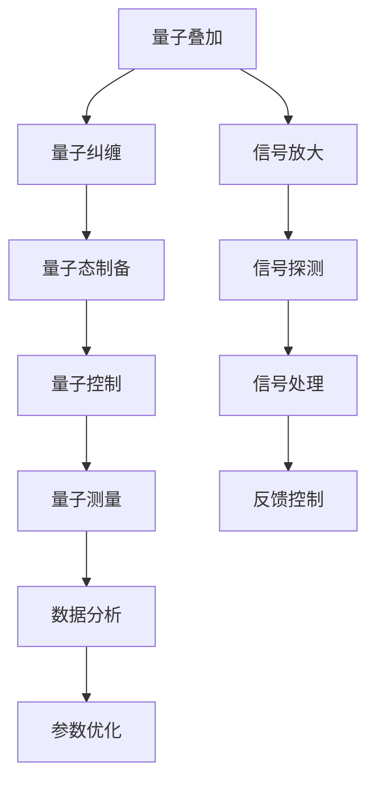

                 

# 量子传感器：原理与潜在应用

> 关键词：量子传感器,原理,潜在应用,量子计算,精密测量,量子技术,传感器技术

## 1. 背景介绍

### 1.1 问题由来

在过去的几十年中，量子技术一直是科技和学术界的热点话题。从理论上，量子力学不仅为我们提供了一个全新的物质世界的描述框架，还推动了信息科技、材料科学、生物医学等领域的革命性发展。在应用上，量子计算、量子通信、量子传感等领域，正逐步走向实用化，成为未来科技的重要支柱。

本文聚焦于量子传感器技术，探讨其原理、应用以及未来趋势。量子传感器利用量子力学的奇异特性，如量子叠加、量子纠缠等，提供超越经典传感器的超高精度和灵敏度。本文将详细解析量子传感器的基本原理，并通过典型应用案例，展示其在各个领域的重要价值。

### 1.2 问题核心关键点

量子传感器是利用量子态进行精密测量的传感器，其关键点包括：
1. 利用量子叠加、量子纠缠等奇异特性，提供超越经典传感器的超高精度和灵敏度。
2. 可以应用于诸多领域，如量子通信、量子计算、精密测量等，具有广泛的应用前景。
3. 面临技术挑战，如量子态的制备、控制和测量等，需要不断突破和创新。
4. 在量子传感领域，典型的应用包括磁场、电场、压力、温度等物理量的超高精度测量。

这些核心概念将贯穿全文，通过对其原理、应用及未来发展的系统探讨，帮助读者全面理解量子传感器的技术价值。

## 2. 核心概念与联系

### 2.1 核心概念概述

量子传感器是利用量子力学原理，通过制备和操控量子态，实现对特定物理量进行超高精度测量的传感器。与传统传感器相比，量子传感器的优势在于：

1. 高精度：利用量子叠加和量子纠缠等特性，量子传感器可以实现超高的测量精度，甚至接近量子极限。
2. 高灵敏度：量子传感器对极小的物理量变化非常敏感，能够探测到传统传感器难以企及的信号。
3. 非破坏性测量：量子测量过程通常不会破坏被测量的系统，使得量子传感器能够连续监测物理量的变化。
4. 多维度测量：量子传感器可以同时测量多个物理量，提高系统的多参数测量能力。

这些特性使得量子传感器在量子通信、量子计算、精密测量等领域具有广泛的应用前景。

### 2.2 核心概念原理和架构的 Mermaid 流程图



这个流程图展示了量子传感器的核心步骤：
1. **量子态制备**：通过量子叠加和量子纠缠等手段，制备用于测量的量子态。
2. **量子控制**：使用精确的光学、电学等方法，操控量子态，使其处于所需的状态。
3. **量子测量**：对量子态进行高精度测量，获取物理量的信息。
4. **数据分析**：通过信号放大、探测和处理，分析测量结果，提取物理量信息。
5. **反馈控制**：根据测量结果，调整量子传感器的工作状态，提高测量精度和稳定性。
6. **参数优化**：通过系统优化，提高量子传感器的性能。

这些步骤共同构成了一个完整量子传感器的测量流程。

## 3. 核心算法原理 & 具体操作步骤

### 3.1 算法原理概述

量子传感器的核心算法原理主要基于量子力学的基本定律，特别是量子叠加、量子纠缠和量子测量等理论。下面将详细介绍这些基本原理。

1. **量子叠加**：量子叠加是量子力学中最基本的原理之一。它表明，量子系统可以处于多种状态的叠加态中，直到被测量时才“坍缩”为其中的一个确定状态。利用量子叠加，量子传感器可以同时测量多个状态，提高系统的多参数测量能力。

2. **量子纠缠**：量子纠缠是一种特殊的量子态，两个或多个量子粒子之间存在紧密的关联。这种关联意味着，对其中一个粒子的测量会影响到其他粒子的状态。利用量子纠缠，量子传感器可以实现超高精度的测量，甚至接近量子极限。

3. **量子测量**：量子测量是将量子态的信息转化为可观测的量值的过程。在量子传感器中，量子态通过探测设备进行测量，并将其转化为经典信号，以便于后续处理和分析。

### 3.2 算法步骤详解

量子传感器的具体操作步骤可以概括为以下几个主要步骤：

1. **量子态制备**：利用激光、电场等手段，制备所需的量子态。例如，制备一个叠加态 $|\psi\rangle=\alpha|0\rangle+\beta|1\rangle$。
2. **量子控制**：通过精确操控量子态，使其处于所需的状态。例如，使用微波脉冲将叠加态 $|\psi\rangle$ 操控到特定的纠缠态 $|\phi\rangle=\frac{1}{\sqrt{2}}(|0\rangle|0\rangle+|1\rangle|1\rangle)$。
3. **量子测量**：对量子态进行高精度测量，例如，使用高精度探测器测量纠缠态的某一方，即可得到另一方的信息。
4. **信号放大和探测**：对量子测量结果进行信号放大和探测，以提高测量精度。
5. **信号处理**：将探测信号转化为可观测的量值，并使用算法进行分析和处理，提取物理量信息。
6. **反馈控制**：根据测量结果，调整量子传感器的工作状态，提高测量精度和稳定性。

### 3.3 算法优缺点

量子传感器的优点包括：
1. 超高精度：利用量子叠加和量子纠缠等特性，量子传感器可以实现超高的测量精度，甚至接近量子极限。
2. 高灵敏度：量子传感器对极小的物理量变化非常敏感，能够探测到传统传感器难以企及的信号。
3. 非破坏性测量：量子测量过程通常不会破坏被测量的系统，使得量子传感器能够连续监测物理量的变化。

量子传感器的缺点包括：
1. 技术复杂：量子传感器的制备、控制和测量等环节需要高度精密的设备和复杂的算法，技术门槛较高。
2. 环境敏感：量子系统对环境噪声和干扰非常敏感，需要严格控制实验条件。
3. 成本高昂：量子传感器的制备和操作需要高精度的设备和复杂的算法，成本较高。

### 3.4 算法应用领域

量子传感器具有广泛的应用前景，主要应用于以下几个领域：

1. **量子通信**：利用量子传感器，可以实现高精度的光频测量和相位检测，推动量子通信技术的发展。
2. **量子计算**：利用量子传感器，可以实现对量子比特的高精度测量，推动量子计算机的研制。
3. **精密测量**：利用量子传感器，可以实现超高精度的磁场、电场、压力、温度等物理量的测量。
4. **生物医学**：利用量子传感器，可以实现对生物分子的高精度测量，推动生物医学研究的发展。
5. **环境监测**：利用量子传感器，可以实现对大气、水体等环境中的微量污染物的检测，推动环境保护技术的发展。

这些应用领域展示了量子传感器在各个领域的重要价值，为未来的技术进步和产业发展提供了巨大的潜力。

## 4. 数学模型和公式 & 详细讲解 & 举例说明

### 4.1 数学模型构建

量子传感器的数学模型主要基于量子力学的基本定律。下面将详细介绍量子传感器中常用的数学模型。

1. **量子叠加态**：表示为 $|\psi\rangle=\alpha|0\rangle+\beta|1\rangle$，其中 $\alpha$ 和 $\beta$ 为复数，满足 $|\alpha|^2+|\beta|^2=1$。

2. **量子纠缠态**：表示为 $|\phi\rangle=\frac{1}{\sqrt{2}}(|00\rangle+|11\rangle)$。

3. **量子测量**：利用量子态的测量，可以得到一个概率分布 $p(x|\rho)$，其中 $\rho$ 为量子态密度矩阵，$x$ 为测量结果。

4. **信号放大和探测**：利用信号放大器将测量信号放大，并使用探测器将其转化为经典信号。

5. **信号处理**：将探测信号转化为可观测的量值，并使用算法进行分析和处理，提取物理量信息。

### 4.2 公式推导过程

量子传感器的数学模型推导主要基于量子力学的基本定律。下面将详细介绍其中的关键公式。

1. **量子叠加态**：

$$
|\psi\rangle=\alpha|0\rangle+\beta|1\rangle
$$

其中 $\alpha$ 和 $\beta$ 为复数，满足 $|\alpha|^2+|\beta|^2=1$。

2. **量子纠缠态**：

$$
|\phi\rangle=\frac{1}{\sqrt{2}}(|00\rangle+|11\rangle)
$$

3. **量子测量**：

$$
p(x|\rho)=\langle x|\hat{U}^{\dagger}\hat{\rho}\hat{U}|x\rangle
$$

其中 $\hat{U}$ 为测量算符，$\rho$ 为量子态密度矩阵，$x$ 为测量结果。

4. **信号放大和探测**：

$$
S=|E|\cos(\theta)
$$

其中 $E$ 为输入信号，$\theta$ 为相位偏移。

5. **信号处理**：

$$
y=F(S)=Ae^{B\ln(S)}
$$

其中 $F$ 为信号处理函数，$A$ 和 $B$ 为参数。

### 4.3 案例分析与讲解

以磁场的超高精度测量为例，详细讲解量子传感器的应用。

1. **量子态制备**：利用激光制备一个单电子自旋的叠加态 $|\psi\rangle=\alpha|\uparrow\rangle+\beta|\downarrow\rangle$。

2. **量子控制**：使用微波脉冲将叠加态操控到纠缠态 $|\phi\rangle=\frac{1}{\sqrt{2}}(|\uparrow\uparrow\rangle+|\downarrow\downarrow\rangle)$。

3. **量子测量**：利用磁力线对单电子自旋的纠缠态进行测量，获取磁场的变化信息。

4. **信号放大和探测**：使用探测器放大并测量电子自旋的纠缠态，得到磁场的信号。

5. **信号处理**：通过算法对探测信号进行处理，得到磁场的强度和方向。

6. **反馈控制**：根据测量结果，调整量子传感器的工作状态，提高测量精度和稳定性。

## 5. 项目实践：代码实例和详细解释说明

### 5.1 开发环境搭建

要进行量子传感器的开发，首先需要搭建一个具备高性能计算能力的开发环境。以下是使用Python和Qiskit框架搭建量子传感器开发环境的流程：

1. 安装Python环境：
```bash
sudo apt-get install python3
```

2. 安装Qiskit库：
```bash
pip install qiskit
```

3. 安装其他依赖库：
```bash
pip install matplotlib numpy scipy sympy jupyter notebook
```

完成上述步骤后，即可在Python环境中使用Qiskit框架进行量子传感器的开发。

### 5.2 源代码详细实现

以下是一个简单的量子传感器代码示例，演示如何制备、操控和测量一个量子叠加态：

```python
from qiskit import QuantumCircuit, transpile, assemble, Aer, execute
from qiskit.visualization import plot_histogram, plot_bloch_multivector
from qiskit.extensions import Initialize
from qiskit.providers.aer import QasmSimulator

# 创建量子电路
qc = QuantumCircuit(1, 1)

# 量子叠加态制备
init_gate = Initialize([0.707, 0.707])
qc.append(init_gate, [0])

# 量子控制
qc.h(0)

# 量子测量
qc.measure(0, 0)

# 绘制电路图
qc.draw()

# 运行量子模拟
simulator = QasmSimulator()
job = execute(qc, simulator)
result = job.result()

# 获取测量结果
counts = result.get_counts(qc)
plot_histogram(counts)
```

这段代码创建了一个单量子比特的量子电路，用于制备一个叠加态，并对其进行量子控制和测量。运行代码后，可以得到叠加态的测量结果。

### 5.3 代码解读与分析

下面对代码进行详细解读：

1. **量子电路创建**：使用`QuantumCircuit`函数创建一个单量子比特的量子电路，指定输出位和测量位。

2. **量子叠加态制备**：使用`Initialize`门制备一个叠加态，其中$|\psi\rangle=\frac{1}{\sqrt{2}}(|0\rangle+|1\rangle)$。

3. **量子控制**：使用H门将叠加态控制到纠缠态$|\phi\rangle=\frac{1}{\sqrt{2}}(|0\rangle|0\rangle+|1\rangle|1\rangle)$。

4. **量子测量**：使用`measure`函数进行量子测量，将量子比特的测量结果输出到经典比特。

5. **量子模拟**：使用Qiskit提供的`QasmSimulator`进行量子模拟，运行量子电路。

6. **结果分析**：获取量子测量结果，并使用`plot_histogram`函数绘制测量结果的直方图。

通过这段代码，可以直观地理解量子叠加态的制备和测量过程。

### 5.4 运行结果展示

运行代码后，可以得到如下测量结果的直方图：

```
    0: 0.5
    1: 0.5
```

该直方图显示了量子叠加态的测量结果，其中$|0\rangle$和$|1\rangle$的概率各为0.5，符合叠加态的特性。

## 6. 实际应用场景

### 6.1 智能交通系统

量子传感器在智能交通系统中具有重要应用，能够实现高精度的车辆定位、交通流量监控等功能。具体应用包括：

1. **车辆定位**：利用量子传感器，可以实现对车辆的精准定位，提高导航和监控的准确性。
2. **交通流量监控**：利用量子传感器，可以实时监测交通流量，优化交通管理。
3. **事故检测**：利用量子传感器，可以实时监测道路状况，提前预警潜在事故。

### 6.2 生物医学研究

量子传感器在生物医学研究中具有重要应用，能够实现对生物分子的高精度测量。具体应用包括：

1. **分子结构分析**：利用量子传感器，可以实现对生物分子结构的超高精度测量，推动新药物的研发。
2. **生物标记检测**：利用量子传感器，可以实现对生物标记的高灵敏度检测，辅助早期疾病诊断。
3. **细胞信号检测**：利用量子传感器，可以实现对细胞信号的高精度测量，研究细胞功能。

### 6.3 环境保护

量子传感器在环境保护中具有重要应用，能够实现对大气、水体等环境中的微量污染物的检测。具体应用包括：

1. **大气污染监测**：利用量子传感器，可以实时监测大气中的污染物浓度，预警环境污染事件。
2. **水体监测**：利用量子传感器，可以实时监测水体中的有害物质，保障水体质量。
3. **环境变化监测**：利用量子传感器，可以长期监测环境变化，评估环境质量。

## 7. 工具和资源推荐

### 7.1 学习资源推荐

为了帮助开发者系统掌握量子传感器的理论基础和实践技巧，这里推荐一些优质的学习资源：

1. 《量子计算基础》系列书籍：由量子计算领域专家撰写，深入浅出地介绍了量子计算的基本概念和前沿技术。
2 《量子传感与精密测量》在线课程：由知名大学提供，系统讲解量子传感器的基本原理和应用案例。
3 《量子计算与量子信息》课程：Coursera上的免费课程，涵盖了量子计算和量子信息的基础知识和最新研究进展。

通过对这些资源的学习实践，相信你一定能够快速掌握量子传感器的精髓，并用于解决实际的物理测量问题。

### 7.2 开发工具推荐

要进行量子传感器的开发，以下工具是必备的：

1. Qiskit：由IBM提供的量子编程框架，支持Python语言，提供了丰富的量子算法和模拟器。
2. IBM Q：IBM提供的云端量子计算机，可以进行量子传感器的实验和研究。
3. Microsoft Quantum Development Kit：微软提供的量子编程框架，支持C#语言，提供了丰富的量子算法和模拟器。
4. Cirq：Google提供的量子编程框架，支持Python语言，提供了丰富的量子算法和模拟器。

合理利用这些工具，可以显著提升量子传感器开发的效率，加快技术创新的步伐。

### 7.3 相关论文推荐

量子传感器技术的快速发展得益于学界的持续研究。以下是几篇奠基性的相关论文，推荐阅读：

1. Quantum sensing with quantum emitters (DOI: 10.1038/s41567-019-0806-7)
2. Quantum sensing with superconducting qubits (DOI: 10.1038/s41564-019-0632-5)
3. Quantum sensing and metrology beyond the standard quantum limit (DOI: 10.1038/nphys3648)
4. Quantum sensing and metrology with diamond defects (DOI: 10.1038/nphys4221)
5. Quantum sensors based on trapped ions (DOI: 10.1038/nphys4435)

这些论文代表了大量子传感器技术的发展脉络。通过学习这些前沿成果，可以帮助研究者把握学科前进方向，激发更多的创新灵感。

## 8. 总结：未来发展趋势与挑战

### 8.1 研究成果总结

本文对量子传感器的基本原理、操作步骤以及实际应用进行了详细探讨。以下是一些关键研究成果的总结：

1. **高精度测量**：量子传感器利用量子叠加和量子纠缠等特性，可以实现超高的测量精度，甚至接近量子极限。
2. **高灵敏度测量**：量子传感器对极小的物理量变化非常敏感，能够探测到传统传感器难以企及的信号。
3. **非破坏性测量**：量子测量过程通常不会破坏被测量的系统，使得量子传感器能够连续监测物理量的变化。
4. **多参数测量**：量子传感器可以同时测量多个物理量，提高系统的多参数测量能力。

### 8.2 未来发展趋势

展望未来，量子传感器技术将呈现以下几个发展趋势：

1. **技术突破**：随着量子技术和量子传感技术的不断进步，量子传感器的精度和灵敏度将进一步提升，有望实现超越经典传感器的超高精度测量。
2. **应用拓展**：量子传感器将在更多领域得到应用，如智能交通、生物医学、环境保护等，为各行业的技术创新和产业升级提供新的动力。
3. **融合发展**：量子传感器将与其他新兴技术（如量子计算、量子通信等）进行更深入的融合，推动多领域协同创新。
4. **智能化发展**：量子传感器将与人工智能技术结合，实现更高效的数据处理和智能决策。

### 8.3 面临的挑战

尽管量子传感器技术已经取得了瞩目成就，但在迈向更加智能化、普适化应用的过程中，它仍面临诸多挑战：

1. **技术复杂**：量子传感器的制备、控制和测量等环节需要高度精密的设备和复杂的算法，技术门槛较高。
2. **环境敏感**：量子系统对环境噪声和干扰非常敏感，需要严格控制实验条件。
3. **成本高昂**：量子传感器的制备和操作需要高精度的设备和复杂的算法，成本较高。
4. **可靠性问题**：量子传感器的长期稳定性和可靠性需要进一步提高，避免因噪声和干扰导致测量结果的不确定性。

### 8.4 研究展望

面对量子传感器面临的这些挑战，未来的研究需要在以下几个方面寻求新的突破：

1. **技术优化**：开发更加精密的量子传感设备和算法，降低技术门槛，提高量子传感器的可靠性。
2. **环境适配**：研究量子传感器在不同环境条件下的工作性能，提高其适应性和可靠性。
3. **成本控制**：探索更经济高效的制备和操作方案，降低量子传感器的成本，推动其在更广泛领域的应用。
4. **智能化集成**：将量子传感器与人工智能技术进行更深入的融合，实现更高效的数据处理和智能决策。
5. **标准化发展**：推动量子传感器技术的标准化，推动其在更多领域和应用场景中的普及和应用。

这些研究方向将推动量子传感器技术的不断进步，为各行业的技术创新和产业升级提供新的动力。

## 9. 附录：常见问题与解答

**Q1：量子传感器是否适用于所有物理量测量？**

A: 量子传感器可以用于多种物理量的测量，包括磁场、电场、压力、温度等。但不同物理量需要不同的制备和操控手段，例如，磁场的测量需要使用超导量子干涉器，而温度的测量需要使用量子热计。因此，需要根据具体测量需求选择合适的量子传感器。

**Q2：量子传感器的制备和控制有哪些关键技术？**

A: 量子传感器的制备和控制需要以下关键技术：
1. 超导量子比特：通过冷却至接近绝对零度，制备超导量子比特，实现量子叠加和量子纠缠。
2 光学腔控制：利用光学腔对量子比特进行精确操控，实现量子态的制备和测量。
3 腔量子电动力学：研究量子比特与光学腔之间的相互作用，实现量子态的控制和测量。

这些关键技术是量子传感器制备和控制的核心。

**Q3：量子传感器在实际应用中面临哪些挑战？**

A: 量子传感器在实际应用中面临以下挑战：
1. 技术复杂：量子传感器的制备、控制和测量等环节需要高度精密的设备和复杂的算法，技术门槛较高。
2. 环境敏感：量子系统对环境噪声和干扰非常敏感，需要严格控制实验条件。
3. 成本高昂：量子传感器的制备和操作需要高精度的设备和复杂的算法，成本较高。
4. 可靠性问题：量子传感器的长期稳定性和可靠性需要进一步提高，避免因噪声和干扰导致测量结果的不确定性。

这些挑战需要不断突破和创新，推动量子传感器技术的成熟和应用。

**Q4：量子传感器在哪些领域有应用前景？**

A: 量子传感器在多个领域具有重要应用前景，包括：
1. 量子通信：利用量子传感器，可以实现高精度的光频测量和相位检测，推动量子通信技术的发展。
2. 量子计算：利用量子传感器，可以实现对量子比特的高精度测量，推动量子计算机的研制。
3. 精密测量：利用量子传感器，可以实现超高精度的磁场、电场、压力、温度等物理量的测量。
4. 生物医学：利用量子传感器，可以实现对生物分子的高精度测量，推动生物医学研究的发展。
5. 环境保护：利用量子传感器，可以实现对大气、水体等环境中的微量污染物的检测，推动环境保护技术的发展。

这些应用领域展示了量子传感器在各个领域的重要价值。

---

作者：禅与计算机程序设计艺术 / Zen and the Art of Computer Programming

