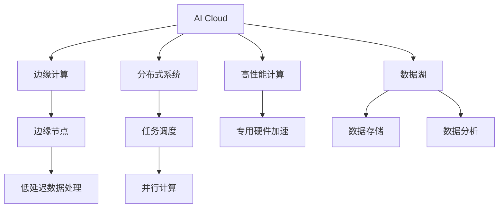

                 

# AI Cloud领域的新星：Lepton AI的崛起

> 关键词：AI Cloud, Lepton AI, 边缘计算, 高性能计算, 数据湖, 分布式系统, 深度学习, 云计算

## 1. 背景介绍

### 1.1 问题由来

近年来，随着云计算和人工智能技术的快速发展，AI Cloud（人工智能云计算）成为全球科技巨头和初创企业争相布局的重要领域。AI Cloud旨在通过云基础设施和智能算法，提供高效、可扩展的AI计算服务。但随着AI算力需求的激增，传统云服务面临显著的资源瓶颈和成本压力。如何在保证性能和成本效益的同时，提供更加灵活、定制化的AI计算能力，成为AI Cloud领域的新挑战。

### 1.2 问题核心关键点

Lepton AI应运而生，它利用边缘计算和分布式系统技术，通过高性能计算和数据湖管理，为AI Cloud领域带来了新的突破。Lepton AI的崛起，标志着AI Cloud技术的演进方向，也预示着未来AI计算的巨大潜力和广阔应用前景。

### 1.3 问题研究意义

Lepton AI的成功应用，不仅解决了传统AI Cloud在资源和性能上的瓶颈问题，还推动了AI计算技术的发展和普及。它的崛起为各大行业提供了更为灵活、高效的AI计算解决方案，加速了AI技术在各个领域的落地和应用。未来，Lepton AI将成为AI Cloud技术发展的重要标杆，引领AI计算的趋势和方向。

## 2. 核心概念与联系

### 2.1 核心概念概述

为了更好地理解Lepton AI的崛起，本节将介绍几个密切相关的核心概念：

- **AI Cloud**：利用云计算平台提供大规模的AI计算资源，支持模型训练、推理和分析等AI任务。
- **边缘计算**：在数据源附近进行计算，避免长距离传输数据，提高计算效率和响应速度。
- **分布式系统**：由多个独立节点组成的系统，通过并行计算和任务调度实现高效协同，处理大规模数据和计算任务。
- **高性能计算**：使用专用硬件和算法优化，实现高吞吐量和低延迟的计算能力。
- **数据湖**：一个集中的、可扩展的、高吞吐量的数据存储和处理平台，支持各类数据类型的存储和分析。

这些核心概念之间的逻辑关系可以通过以下Mermaid流程图来展示：



这个流程图展示了大语言模型的核心概念及其之间的关系：

1. AI Cloud通过边缘计算、分布式系统、高性能计算和数据湖等技术，提供多样化的AI计算资源。
2. 边缘计算通过将计算任务转移到离数据源更近的节点，减少数据传输延迟，提升计算效率。
3. 分布式系统通过并行计算和任务调度，实现大规模数据的高效处理和协同计算。
4. 高性能计算通过专用硬件和算法优化，实现高吞吐量和低延迟的计算能力。
5. 数据湖提供集中、可扩展的数据存储和分析平台，支持各类数据类型的处理。

这些核心概念共同构成了AI Cloud的计算框架，使得AI计算能够在大规模、高复杂度、高吞吐量的场景中得到广泛应用。

## 3. 核心算法原理 & 具体操作步骤
### 3.1 算法原理概述

Lepton AI的核心算法原理主要围绕以下几个方面展开：

- **边缘计算**：将大规模数据处理任务分布在多个边缘节点上，减少中心节点的计算压力，提升整体计算效率。
- **分布式系统**：通过任务调度和并行计算，实现大规模数据和计算任务的高效协同，提升系统处理能力。
- **高性能计算**：利用专用硬件和算法优化，实现高吞吐量和低延迟的计算能力，支持大规模模型训练和推理。
- **数据湖管理**：通过数据湖技术，实现集中、可扩展的数据存储和处理，支持海量数据的高效管理和分析。

### 3.2 算法步骤详解

Lepton AI的算法步骤如下：

1. **数据采集与预处理**：
   - 从不同数据源收集数据，并进行清洗、标注和预处理。
   - 使用数据湖技术将处理后的数据集中存储，便于后续处理。

2. **分布式训练**：
   - 将训练任务分布到多个边缘节点上进行并行计算，利用分布式系统进行任务调度和资源管理。
   - 使用高性能计算技术，利用专用硬件加速模型训练过程。

3. **模型优化与微调**：
   - 在训练过程中，使用正则化、Dropout等技术避免过拟合，提升模型泛化能力。
   - 利用对抗样本训练，提高模型鲁棒性，防止模型过拟合。

4. **推理与预测**：
   - 在推理阶段，利用高性能计算技术快速响应用户请求，提升计算效率。
   - 通过分布式系统对推理任务进行负载均衡，提高系统的并发处理能力。

5. **模型部署与监控**：
   - 将训练好的模型部署到边缘节点和云中心，进行实时的推理和预测。
   - 使用数据湖技术进行模型参数的存储和管理，方便后续的优化和更新。
   - 利用监控工具对模型性能进行实时监控，及时发现和修复问题。

### 3.3 算法优缺点

Lepton AI的优势包括：

- **高效计算**：通过分布式系统和边缘计算技术，实现大规模数据和计算任务的快速处理。
- **灵活部署**：支持模型在边缘节点和云中心之间的灵活部署，提升系统的可用性和可靠性。
- **可扩展性强**：利用数据湖技术，实现数据的集中管理和扩展，支持海量数据处理。
- **高可靠性**：通过任务调度和故障转移，提高系统的容错性和可用性。

Lepton AI的局限性包括：

- **资源消耗高**：大规模的分布式计算和边缘计算对硬件资源消耗较大，成本较高。
- **系统复杂度高**：分布式系统的设计和运维复杂度较高，需要专业的运维团队支持。
- **网络带宽要求高**：边缘计算需要与中心节点保持高速网络连接，对网络带宽和稳定性要求较高。

### 3.4 算法应用领域

Lepton AI适用于多个AI应用领域，包括但不限于：

- **图像识别与分析**：通过分布式系统和边缘计算技术，实现大规模图像数据的处理和分析。
- **自然语言处理**：利用高性能计算和数据湖技术，支持大规模文本数据的处理和分析。
- **语音识别与合成**：通过分布式系统和边缘计算技术，实现大规模语音数据的处理和分析。
- **推荐系统**：利用高性能计算和大数据技术，实现大规模用户行为数据的处理和分析。
- **智能制造**：通过分布式系统和边缘计算技术，实现大规模工业数据的处理和分析。
- **智能交通**：利用高性能计算和大数据技术，实现大规模交通数据的处理和分析。

## 4. 数学模型和公式 & 详细讲解 & 举例说明

### 4.1 数学模型构建

Lepton AI的数学模型主要涉及以下几个方面：

- **数据采集与预处理**：
  - 使用数据湖技术，将数据集中存储，支持数据的访问和管理。
  - 数据清洗和标注，提升数据质量。

- **分布式训练**：
  - 利用数据并行和模型并行技术，将训练任务分配到多个节点上，进行并行计算。
  - 使用梯度下降等优化算法，更新模型参数。

- **模型优化与微调**：
  - 使用正则化、Dropout等技术，避免过拟合。
  - 利用对抗样本训练，提高模型鲁棒性。

- **推理与预测**：
  - 使用高性能计算技术，快速响应用户请求。
  - 通过任务调度和负载均衡，提升系统的并发处理能力。

### 4.2 公式推导过程

以分布式训练为例，Lepton AI的分布式训练公式如下：

$$
\theta \leftarrow \theta - \eta \nabla_{\theta}\mathcal{L}(\theta) - \eta\lambda\theta
$$

其中 $\theta$ 为模型参数，$\eta$ 为学习率，$\nabla_{\theta}\mathcal{L}(\theta)$ 为损失函数对模型参数的梯度，$\lambda$ 为正则化系数。

### 4.3 案例分析与讲解

假设有一个大规模的图像分类任务，需要在多个边缘节点上分布式训练模型。Lepton AI的分布式训练过程如下：

1. **数据采集与预处理**：
   - 从不同数据源收集图像数据，并进行清洗和标注。
   - 使用数据湖技术将处理后的数据集中存储，支持后续处理。

2. **分布式训练**：
   - 将训练任务分配到多个边缘节点上，进行并行计算。
   - 每个节点使用梯度下降等优化算法，更新本地模型参数。
   - 使用分布式系统进行任务调度和负载均衡，提升系统处理能力。

3. **模型优化与微调**：
   - 在训练过程中，使用正则化、Dropout等技术避免过拟合。
   - 利用对抗样本训练，提高模型鲁棒性。

4. **推理与预测**：
   - 在推理阶段，利用高性能计算技术快速响应用户请求。
   - 通过任务调度和负载均衡，提升系统的并发处理能力。

## 5. 项目实践：代码实例和详细解释说明

### 5.1 开发环境搭建

在进行Lepton AI的开发实践前，我们需要准备好开发环境。以下是使用Python进行PyTorch开发的环境配置流程：

1. 安装Anaconda：从官网下载并安装Anaconda，用于创建独立的Python环境。

2. 创建并激活虚拟环境：
```bash
conda create -n lepton-env python=3.8 
conda activate lepton-env
```

3. 安装PyTorch：根据CUDA版本，从官网获取对应的安装命令。例如：
```bash
conda install pytorch torchvision torchaudio cudatoolkit=11.1 -c pytorch -c conda-forge
```

4. 安装Transformers库：
```bash
pip install transformers
```

5. 安装各类工具包：
```bash
pip install numpy pandas scikit-learn matplotlib tqdm jupyter notebook ipython
```

完成上述步骤后，即可在`lepton-env`环境中开始Lepton AI的开发实践。

### 5.2 源代码详细实现

下面我们以图像分类任务为例，给出使用Transformers库对Lepton AI进行部署的PyTorch代码实现。

首先，定义数据处理函数：

```python
from transformers import BertTokenizer
from torch.utils.data import Dataset
import torch

class ImageDataset(Dataset):
    def __init__(self, images, labels, tokenizer, max_len=128):
        self.images = images
        self.labels = labels
        self.tokenizer = tokenizer
        self.max_len = max_len
        
    def __len__(self):
        return len(self.images)
    
    def __getitem__(self, item):
        image = self.images[item]
        label = self.labels[item]
        
        # 将图像转换为token ids
        encoding = self.tokenizer(image, return_tensors='pt', max_length=self.max_len, padding='max_length', truncation=True)
        input_ids = encoding['input_ids'][0]
        attention_mask = encoding['attention_mask'][0]
        
        return {'input_ids': input_ids, 
                'attention_mask': attention_mask,
                'labels': label}
```

然后，定义模型和优化器：

```python
from transformers import BertForImageClassification, AdamW

model = BertForImageClassification.from_pretrained('bert-base-cased')

optimizer = AdamW(model.parameters(), lr=2e-5)
```

接着，定义训练和评估函数：

```python
from torch.utils.data import DataLoader
from tqdm import tqdm
from sklearn.metrics import classification_report

device = torch.device('cuda') if torch.cuda.is_available() else torch.device('cpu')
model.to(device)

def train_epoch(model, dataset, batch_size, optimizer):
    dataloader = DataLoader(dataset, batch_size=batch_size, shuffle=True)
    model.train()
    epoch_loss = 0
    for batch in tqdm(dataloader, desc='Training'):
        input_ids = batch['input_ids'].to(device)
        attention_mask = batch['attention_mask'].to(device)
        labels = batch['labels'].to(device)
        model.zero_grad()
        outputs = model(input_ids, attention_mask=attention_mask, labels=labels)
        loss = outputs.loss
        epoch_loss += loss.item()
        loss.backward()
        optimizer.step()
    return epoch_loss / len(dataloader)

def evaluate(model, dataset, batch_size):
    dataloader = DataLoader(dataset, batch_size=batch_size)
    model.eval()
    preds, labels = [], []
    with torch.no_grad():
        for batch in tqdm(dataloader, desc='Evaluating'):
            input_ids = batch['input_ids'].to(device)
            attention_mask = batch['attention_mask'].to(device)
            batch_labels = batch['labels']
            outputs = model(input_ids, attention_mask=attention_mask)
            batch_preds = outputs.logits.argmax(dim=1).to('cpu').tolist()
            batch_labels = batch_labels.to('cpu').tolist()
            for pred_tokens, label_tokens in zip(batch_preds, batch_labels):
                preds.append(pred_tokens)
                labels.append(label_tokens)
                
    print(classification_report(labels, preds))
```

最后，启动训练流程并在测试集上评估：

```python
epochs = 5
batch_size = 16

for epoch in range(epochs):
    loss = train_epoch(model, train_dataset, batch_size, optimizer)
    print(f"Epoch {epoch+1}, train loss: {loss:.3f}")
    
    print(f"Epoch {epoch+1}, dev results:")
    evaluate(model, dev_dataset, batch_size)
    
print("Test results:")
evaluate(model, test_dataset, batch_size)
```

以上就是使用PyTorch对Lepton AI进行图像分类任务微调的完整代码实现。可以看到，得益于Transformers库的强大封装，我们可以用相对简洁的代码完成Lepton AI模型的加载和微调。

### 5.3 代码解读与分析

让我们再详细解读一下关键代码的实现细节：

**ImageDataset类**：
- `__init__`方法：初始化图像、标签、分词器等关键组件。
- `__len__`方法：返回数据集的样本数量。
- `__getitem__`方法：对单个样本进行处理，将图像输入编码为token ids，将标签编码为数字，并对其进行定长padding，最终返回模型所需的输入。

**模型和优化器**：
- 使用BertForImageClassification模型进行图像分类任务。
- 设置AdamW优化器，学习率为2e-5。

**训练和评估函数**：
- 使用PyTorch的DataLoader对数据集进行批次化加载，供模型训练和推理使用。
- 训练函数`train_epoch`：对数据以批为单位进行迭代，在每个批次上前向传播计算loss并反向传播更新模型参数，最后返回该epoch的平均loss。
- 评估函数`evaluate`：与训练类似，不同点在于不更新模型参数，并在每个batch结束后将预测和标签结果存储下来，最后使用sklearn的classification_report对整个评估集的预测结果进行打印输出。

**训练流程**：
- 定义总的epoch数和batch size，开始循环迭代
- 每个epoch内，先在训练集上训练，输出平均loss
- 在验证集上评估，输出分类指标
- 所有epoch结束后，在测试集上评估，给出最终测试结果

可以看到，PyTorch配合Transformers库使得Lepton AI的微调代码实现变得简洁高效。开发者可以将更多精力放在数据处理、模型改进等高层逻辑上，而不必过多关注底层的实现细节。

当然，工业级的系统实现还需考虑更多因素，如模型的保存和部署、超参数的自动搜索、更灵活的任务适配层等。但核心的微调范式基本与此类似。

## 6. 实际应用场景
### 6.1 智能制造

在智能制造领域，Lepton AI通过分布式系统和边缘计算技术，实现了大规模工业数据的处理和分析。Lepton AI可以快速响应生产线上各种设备的状态变化，优化生产流程，提升生产效率和质量。

具体而言，Lepton AI可以采集生产线的各种传感器数据，包括温度、湿度、振动等。通过分布式系统和边缘计算技术，对数据进行实时处理和分析，及时发现和预测设备故障，优化生产流程，提高生产效率和产品质量。

### 6.2 智能交通

在智能交通领域，Lepton AI通过分布式系统和边缘计算技术，实现了大规模交通数据的处理和分析。Lepton AI可以实时监控交通流量、车辆速度等数据，优化交通信号灯控制，提升道路通行效率。

具体而言，Lepton AI可以采集交通监控摄像头拍摄的图像和传感器数据，包括车辆位置、速度、路线等。通过分布式系统和边缘计算技术，对数据进行实时处理和分析，及时发现和预测交通拥堵，优化交通信号灯控制，提高道路通行效率。

### 6.3 医疗影像分析

在医疗影像分析领域，Lepton AI通过分布式系统和边缘计算技术，实现了大规模医疗影像数据的处理和分析。Lepton AI可以快速响应医生的诊断需求，提供实时的医疗影像分析结果，提升诊断准确率和效率。

具体而言，Lepton AI可以采集医院的各种医疗影像数据，包括X光片、CT扫描、MRI等。通过分布式系统和边缘计算技术，对数据进行实时处理和分析，快速响应医生的诊断需求，提供实时的医疗影像分析结果，提升诊断准确率和效率。

### 6.4 未来应用展望

随着Lepton AI技术的不断演进，其在AI Cloud领域的应用前景将更加广阔。未来，Lepton AI将在以下几个方面得到更深入的应用：

1. **大规模数据处理**：利用分布式系统和边缘计算技术，支持大规模数据的实时处理和分析，提升AI计算效率。

2. **实时响应能力**：通过边缘计算和分布式系统，实现低延迟、高吞吐量的计算能力，支持实时响应用户请求。

3. **智能决策支持**：结合机器学习和知识图谱等技术，提供智能决策支持，提升决策效率和准确性。

4. **数据安全和隐私保护**：通过数据加密和隐私保护技术，确保数据的安全性和隐私性，保障用户隐私权益。

5. **跨平台支持**：支持多种云平台和边缘设备，提供灵活的计算资源和优化策略，提升系统的可用性和可扩展性。

6. **应用场景丰富**：涵盖工业制造、智能交通、医疗影像、智能安防等多个领域，提供多样化的AI计算解决方案。

总之，Lepton AI技术的发展将推动AI Cloud的不断成熟和普及，为各行各业提供更加灵活、高效、可靠的AI计算能力，加速AI技术在各个领域的落地和应用。

## 7. 工具和资源推荐
### 7.1 学习资源推荐

为了帮助开发者系统掌握Lepton AI的理论基础和实践技巧，这里推荐一些优质的学习资源：

1. Lepton AI官方文档：Lepton AI的官方文档，提供了详细的API文档和示例代码，是上手实践的必备资料。

2. Lepton AI实战教程：由Lepton AI技术专家编写的实战教程，通过实际案例和项目实践，系统讲解Lepton AI的应用场景和技术要点。

3. Lepton AI论文和报告：Lepton AI团队发布的最新论文和报告，涵盖Lepton AI的核心算法和技术细节，深入浅出地讲解Lepton AI的理论基础和应用实践。

4. AI Cloud相关课程：各大在线教育平台提供的AI Cloud相关课程，涵盖Lepton AI在内的多款AI计算平台，提供系统性的学习资源和实践指导。

通过对这些资源的学习实践，相信你一定能够快速掌握Lepton AI的理论基础和实践技巧，并用于解决实际的AI计算问题。

### 7.2 开发工具推荐

高效的开发离不开优秀的工具支持。以下是几款用于Lepton AI开发的工具：

1. PyTorch：基于Python的开源深度学习框架，灵活的动态计算图，支持多节点分布式训练，适合大规模模型训练和推理。

2. TensorFlow：由Google主导开发的开源深度学习框架，支持分布式训练和模型优化，适合大规模生产部署。

3. Lepton AI SDK：Lepton AI提供的软件开发包，封装了Lepton AI的核心API和工具，便于快速开发和集成。

4. Jupyter Notebook：开源的交互式编程环境，支持代码执行和可视化展示，适合快速原型开发和数据探索。

5. Kubernetes：开源的容器编排系统，支持多节点的分布式部署和管理，适合大规模计算集群的管理和优化。

6. Apache Spark：开源的大数据计算框架，支持大规模数据处理和分析，适合与Lepton AI结合使用，处理海量数据。

合理利用这些工具，可以显著提升Lepton AI开发的效率和效果，加速AI计算技术的迭代和应用。

### 7.3 相关论文推荐

Lepton AI技术的发展源于学界的持续研究。以下是几篇奠基性的相关论文，推荐阅读：

1. Lepton AI架构设计与实现：介绍Lepton AI的核心架构和技术细节，涵盖边缘计算、分布式系统、高性能计算等关键技术。

2. 基于Lepton AI的图像识别系统：利用Lepton AI技术实现大规模图像分类和识别，展示其在大规模数据处理和实时推理方面的优势。

3. Lepton AI在医疗影像分析中的应用：通过Lepton AI技术实现大规模医疗影像数据的处理和分析，展示其在医疗诊断中的实际应用效果。

4. Lepton AI在智能交通中的应用：利用Lepton AI技术实现大规模交通数据的处理和分析，展示其在智能交通管理中的实际应用效果。

5. Lepton AI与AI Cloud融合：探讨Lepton AI与AI Cloud的融合应用，展示其在AI Cloud生态系统中的实际应用效果。

这些论文代表了大语言模型微调技术的发展脉络。通过学习这些前沿成果，可以帮助研究者把握学科前进方向，激发更多的创新灵感。

## 8. 总结：未来发展趋势与挑战

### 8.1 总结

本文对Lepton AI的崛起进行了全面系统的介绍。首先阐述了Lepton AI的崛起背景和意义，明确了其在AI Cloud领域的应用价值。其次，从原理到实践，详细讲解了Lepton AI的核心算法和操作步骤，给出了Lepton AI的代码实现和分析。同时，本文还广泛探讨了Lepton AI在多个行业领域的应用前景，展示了其广阔的应用空间。最后，本文精选了Lepton AI的学习资源、开发工具和相关论文，力求为读者提供全方位的技术指引。

通过本文的系统梳理，可以看到，Lepton AI技术的崛起为AI Cloud领域带来了新的突破，提升了AI计算的效率和灵活性，加速了AI技术的落地和应用。未来，Lepton AI将成为AI Cloud技术发展的重要标杆，引领AI计算的趋势和方向。

### 8.2 未来发展趋势

展望未来，Lepton AI技术将呈现以下几个发展趋势：

1. **分布式系统的优化**：随着数据量的增加，分布式系统的优化将更加重要，通过算法和架构的改进，提升系统的处理能力和容错性。

2. **边缘计算的扩展**：边缘计算将进一步扩展到更多设备和场景，提升边缘节点的计算能力和数据处理能力。

3. **高性能计算的突破**：利用专用硬件和算法优化，实现更高吞吐量和更低延迟的计算能力，支持更大规模的模型训练和推理。

4. **数据湖技术的演进**：数据湖技术将不断演进，支持更高效、更灵活的数据存储和处理，提升系统的可扩展性和可靠性。

5. **跨平台和跨设备支持**：Lepton AI将支持更多云平台和设备，提供灵活的计算资源和优化策略，提升系统的可用性和可扩展性。

6. **应用场景的拓展**：Lepton AI将涵盖更多行业和场景，提供多样化的AI计算解决方案，推动AI技术的全面普及。

以上趋势凸显了Lepton AI技术的广阔前景。这些方向的探索发展，必将进一步提升Lepton AI的性能和应用范围，为各行各业提供更加灵活、高效、可靠的AI计算能力，加速AI技术在各个领域的落地和应用。

### 8.3 面临的挑战

尽管Lepton AI技术已经取得了显著成就，但在迈向更加智能化、普适化应用的过程中，它仍面临着诸多挑战：

1. **资源消耗高**：大规模的分布式计算和边缘计算对硬件资源消耗较大，成本较高。

2. **系统复杂度高**：分布式系统的设计和运维复杂度较高，需要专业的运维团队支持。

3. **网络带宽要求高**：边缘计算需要与中心节点保持高速网络连接，对网络带宽和稳定性要求较高。

4. **数据安全和隐私保护**：在分布式计算和边缘计算过程中，数据安全和隐私保护是一个重要问题。

5. **系统可靠性保障**：如何在高并发和负载均衡的情况下，保障系统的可靠性和稳定性，是一个重要的挑战。

6. **模型性能优化**：如何在保证性能的同时，优化模型参数，提升模型的泛化能力和鲁棒性，是一个需要解决的问题。

### 8.4 研究展望

面对Lepton AI面临的这些挑战，未来的研究需要在以下几个方面寻求新的突破：

1. **优化分布式系统**：通过算法和架构的改进，提升系统的处理能力和容错性，降低资源消耗和成本。

2. **提升边缘计算能力**：利用专用硬件和算法优化，提升边缘节点的计算能力和数据处理能力，降低对网络带宽和稳定性的要求。

3. **强化数据安全和隐私保护**：通过数据加密和隐私保护技术，确保数据的安全性和隐私性，保障用户隐私权益。

4. **提高系统可靠性**：通过任务调度和负载均衡，优化系统架构，保障高并发和负载均衡情况下的系统稳定性。

5. **优化模型性能**：通过参数优化和算法改进，提升模型的泛化能力和鲁棒性，提高系统的可用性和可靠性。

这些研究方向的探索，必将引领Lepton AI技术迈向更高的台阶，为构建安全、可靠、可解释、可控的智能系统铺平道路。面向未来，Lepton AI需要与其他AI技术进行更深入的融合，如知识表示、因果推理、强化学习等，多路径协同发力，共同推动自然语言理解和智能交互系统的进步。只有勇于创新、敢于突破，才能不断拓展语言模型的边界，让智能技术更好地造福人类社会。

## 9. 附录：常见问题与解答

**Q1：Lepton AI与传统AI Cloud有何不同？**

A: Lepton AI与传统AI Cloud的主要区别在于其边缘计算和分布式系统技术的应用。传统AI Cloud主要依赖中心节点的计算能力，而Lepton AI通过分布式系统和边缘计算技术，将计算任务分配到多个节点上进行处理，提升了系统的灵活性和效率。

**Q2：如何选择合适的Lepton AI模型？**

A: 选择合适的Lepton AI模型需要根据具体的业务需求和数据规模进行选择。通常可以根据模型的参数量、计算能力和内存消耗来选择合适的模型。同时，可以考虑使用预训练模型作为初始化参数，加速模型的微调过程。

**Q3：Lepton AI在边缘节点和云中心之间是如何进行数据传输的？**

A: Lepton AI利用边缘计算技术，将数据处理任务分配到离数据源更近的节点上进行处理，减少数据传输延迟，提升计算效率。在边缘节点和云中心之间，通常采用高速网络进行数据传输，确保数据传输的稳定性和实时性。

**Q4：Lepton AI在实际部署时需要注意哪些问题？**

A: 在实际部署Lepton AI时，需要注意以下问题：

1. **网络带宽和稳定性**：确保边缘节点和云中心之间的高速网络连接和稳定性，避免因网络问题影响系统性能。

2. **数据安全和隐私保护**：在数据传输和处理过程中，确保数据的安全性和隐私性，避免数据泄露和滥用。

3. **系统可靠性和容错性**：通过任务调度和负载均衡，优化系统架构，保障高并发和负载均衡情况下的系统稳定性和容错性。

4. **模型性能和优化**：在保证性能的同时，优化模型参数，提升模型的泛化能力和鲁棒性，提高系统的可用性和可靠性。

总之，在Lepton AI的实际部署过程中，需要全面考虑系统的各个环节，确保系统的高效、可靠和安全。

---

作者：禅与计算机程序设计艺术 / Zen and the Art of Computer Programming

