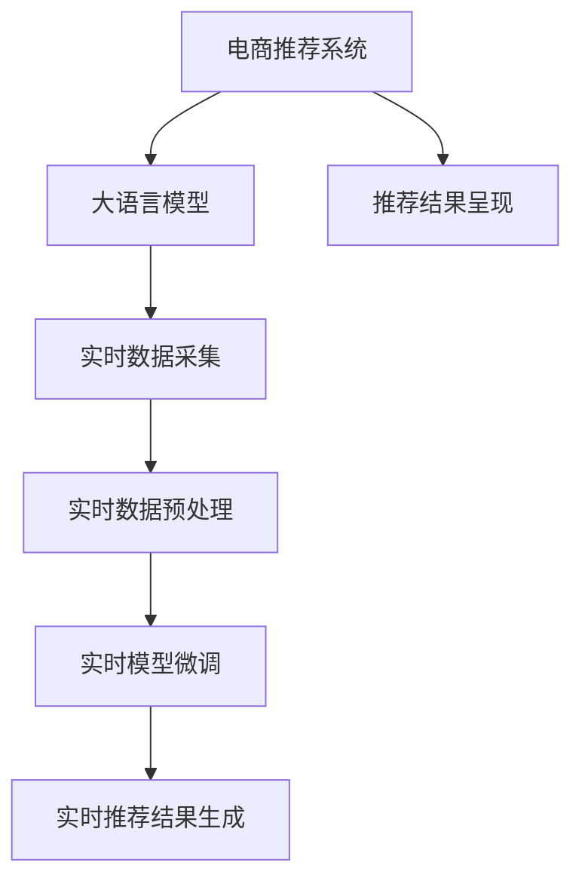

                 

# AI 大模型在电商搜索推荐中的实时更新策略：保持系统鲜活度

> 关键词：电商搜索推荐、大语言模型、实时更新、模型鲜活度、推荐系统、自然语言处理、用户行为分析、内容更新策略

## 1. 背景介绍

在现代电商平台上，商品种类繁多，用户需求复杂多变。为了提升用户体验，电商搜索推荐系统需要实时、动态地向用户推送个性化商品推荐。然而，传统的推荐系统往往依赖于固定的用户画像和商品特征库，难以应对用户行为和市场环境的变化。而大语言模型的引入，为电商推荐系统带来了新的活力。大模型通过自监督学习，从海量文本数据中学习用户偏好和商品属性，能够更好地理解和适应用户的即时需求。

本文将深入探讨大语言模型在电商搜索推荐中的实时更新策略，通过系统性地保持模型的"鲜活度"，提升推荐系统的精准度和时效性。我们将首先介绍电商推荐系统和大语言模型的核心概念，然后详细讲解实时更新策略的原理和具体操作步骤，并结合实际案例分析，提出优缺点及应用领域，最后总结并展望未来发展趋势和面临的挑战。

## 2. 核心概念与联系

### 2.1 核心概念概述

在介绍实时更新策略前，我们先简要介绍一下相关的核心概念：

- **电商搜索推荐系统**：基于用户历史行为和即时浏览数据，实时推荐相关商品和服务的系统。目标是提升用户体验，提高销售额。
- **大语言模型**：以自回归或自编码模型为代表，通过大规模无监督学习获得通用语言表示能力的大模型。本文将重点探讨BERT、GPT等大语言模型。
- **实时更新策略**：通过动态调整模型参数和数据集，持续改进推荐系统性能的策略。
- **模型鲜活度**：指大语言模型在特定时刻的学习和推理能力，反映了模型对新数据和新趋势的适应能力。

这些概念之间的联系主要体现在电商推荐系统依赖于大语言模型进行实时推荐。通过不断更新模型，提升其鲜活度，从而更好地捕捉用户动态需求和市场变化，提供更具时效性和个性化的推荐服务。

### 2.2 核心概念原理和架构的 Mermaid 流程图



这个流程图展示了电商推荐系统与大语言模型之间的交互流程：

1. **电商推荐系统**：从用户行为数据中提取特征，并调用大语言模型进行实时推荐。
2. **大语言模型**：通过自监督学习从大规模文本数据中学习通用语言表示，提升推荐精准度。
3. **实时数据采集**：实时获取用户行为数据，更新数据集。
4. **实时数据预处理**：清洗、归一化用户数据，为模型训练做好准备。
5. **实时模型微调**：根据新数据更新模型参数，提升模型鲜活度。
6. **实时推荐结果生成**：使用更新后的模型，生成个性化推荐结果。
7. **推荐结果呈现**：将推荐结果展示给用户，实时更新用户行为数据。

这个架构清晰展示了电商推荐系统与大语言模型之间的动态交互关系，强调了实时更新的重要性。

## 3. 核心算法原理 & 具体操作步骤

### 3.1 算法原理概述

电商搜索推荐系统中的实时更新策略，核心在于通过动态调整大语言模型的参数和数据集，保持模型的鲜活度。具体来说，就是通过以下步骤不断优化模型的推理能力：

1. **实时数据采集**：持续收集用户的浏览行为数据，如点击、浏览、收藏、购买等，及时更新数据集。
2. **实时数据预处理**：清洗、归一化、标准化数据，以保证模型训练的稳定性和准确性。
3. **实时模型微调**：使用小批量训练数据，对模型进行微调，保持模型的时序一致性。
4. **推荐结果生成**：使用微调后的模型，生成个性化的商品推荐。

这些步骤通过循环迭代，确保了模型的鲜活度，使其能够持续适应市场和用户需求的变化。

### 3.2 算法步骤详解

#### 3.2.1 实时数据采集

实时数据采集是保持模型鲜活度的第一步。电商平台上用户的行为数据是持续变化的，因此需要实时采集和更新数据集。具体方法包括：

- **事件触发**：设置触发机制，如每次用户操作都触发数据采集。
- **定时轮询**：定期对用户数据进行轮询，确保数据的时效性。
- **API接口**：利用API接口获取用户行为数据，确保数据获取的自动化和可扩展性。

#### 3.2.2 实时数据预处理

数据预处理是保证模型训练质量的关键步骤。电商数据通常包含噪声、缺失值，需要进行清洗和标准化。具体方法包括：

- **缺失值填补**：使用均值填补、插值法等技术填补缺失值。
- **异常值检测**：使用统计学方法检测异常值，并进行修正或剔除。
- **归一化**：将数据缩放到一定范围内，如0到1。
- **特征选择**：选择对模型预测有用的特征，去除冗余特征。

#### 3.2.3 实时模型微调

模型微调是提升模型鲜活度的核心步骤。通过动态更新模型参数，使模型能够快速适应新数据和新趋势。具体方法包括：

- **小批量训练**：每次只更新部分模型参数，减少计算量和资源消耗。
- **在线梯度下降**：使用在线梯度下降算法，及时更新模型参数。
- **自适应学习率**：根据数据分布自动调整学习率，避免过拟合和欠拟合。
- **正则化**：使用L2正则、Dropout等技术，防止模型过拟合。

#### 3.2.4 推荐结果生成

推荐结果生成是电商推荐系统的最终环节。通过更新后的模型，生成个性化的推荐结果，满足用户即时需求。具体方法包括：

- **个性化推荐**：根据用户历史行为和即时行为，生成个性化推荐。
- **实时排序**：使用机器学习模型进行实时排序，提升推荐结果的相关性。
- **多样性保证**：通过多样性约束，避免推荐结果的同质化。
- **鲁棒性增强**：使用对抗训练等方法，增强推荐结果的鲁棒性。

### 3.3 算法优缺点

实时更新策略具有以下优点：

- **提升推荐效果**：通过持续更新模型，使推荐结果更加精准和及时。
- **适应市场变化**：能够快速响应市场和用户需求的变化，提升用户体验。
- **资源利用率**：小批量训练和在线梯度下降，减少了计算资源和存储资源的使用。

同时，该策略也存在一些缺点：

- **计算成本高**：频繁的小批量训练增加了计算负担。
- **数据隐私问题**：实时数据采集可能涉及用户隐私，需要合理处理。
- **模型过拟合**：频繁微调可能导致模型过拟合，降低泛化能力。

### 3.4 算法应用领域

实时更新策略适用于多个电商推荐系统场景，包括但不限于：

- **个性化推荐**：根据用户行为实时更新模型，生成个性化推荐结果。
- **内容推荐**：实时更新商品内容，如商品描述、图片等，提升推荐质量。
- **实时广告投放**：根据用户行为实时调整广告策略，提高广告效果。
- **商品搜索**：实时更新商品索引，提升搜索效率。

## 4. 数学模型和公式 & 详细讲解 & 举例说明

### 4.1 数学模型构建

假设电商推荐系统的大语言模型为 $M_\theta$，其中 $\theta$ 表示模型参数。电商推荐数据集为 $D=\{(x_i, y_i)\}_{i=1}^N$，其中 $x_i$ 表示用户行为数据，$y_i$ 表示商品推荐标签。模型的目标是最小化损失函数 $\mathcal{L}(\theta, D)$，以生成最优的推荐结果。

设损失函数为交叉熵损失：

$$
\mathcal{L}(\theta, D) = -\frac{1}{N}\sum_{i=1}^N \log \hat{y_i}
$$

其中 $\hat{y_i}$ 为模型对商品推荐标签 $y_i$ 的预测概率。

### 4.2 公式推导过程

大语言模型通常使用Transformer结构，其前向传播过程包括自注意力机制和全连接层。假设输入数据为 $x_i$，模型输出为 $\hat{y_i}$，则前向传播过程可以表示为：

$$
\hat{y_i} = M_\theta(x_i)
$$

其中 $M_\theta$ 表示大语言模型。

通过反向传播算法，可以计算损失函数对模型参数 $\theta$ 的梯度，进行微调：

$$
\frac{\partial \mathcal{L}(\theta, D)}{\partial \theta} = -\frac{1}{N}\sum_{i=1}^N \frac{\partial \log \hat{y_i}}{\partial \theta}
$$

进一步展开可得：

$$
\frac{\partial \log \hat{y_i}}{\partial \theta} = \frac{1}{\hat{y_i}} - 1
$$

因此，微调更新公式为：

$$
\theta \leftarrow \theta - \eta \frac{\partial \mathcal{L}(\theta, D)}{\partial \theta}
$$

其中 $\eta$ 为学习率，需要根据具体任务进行调参。

### 4.3 案例分析与讲解

以电商推荐系统中的个性化推荐为例，假设目标任务为预测用户是否会购买某个商品 $x_i$。将用户行为数据 $x_i$ 输入模型，得到预测结果 $\hat{y_i}$，使用交叉熵损失计算损失 $\mathcal{L}(\theta, D)$。通过反向传播算法，计算梯度 $\frac{\partial \mathcal{L}(\theta, D)}{\partial \theta}$，并进行微调更新 $\theta$。

具体步骤如下：

1. **数据采集**：实时获取用户行为数据，如浏览、点击、收藏等。
2. **数据预处理**：清洗、归一化数据，去除噪声和异常值。
3. **模型微调**：使用交叉熵损失和反向传播算法，计算梯度并进行微调。
4. **推荐生成**：根据微调后的模型，生成个性化推荐结果。

例如，假设某用户在电商平台上浏览某商品，实时数据采集模块获取该用户的行为数据，并传递给数据预处理模块进行清洗和归一化。预处理后的数据被输入到大语言模型，生成预测结果 $\hat{y_i}$。根据预测结果，使用交叉熵损失计算损失 $\mathcal{L}(\theta, D)$。通过反向传播算法，计算梯度 $\frac{\partial \mathcal{L}(\theta, D)}{\partial \theta}$，并进行微调更新 $\theta$。最后，使用微调后的模型生成个性化的商品推荐，满足用户即时需求。

## 5. 项目实践：代码实例和详细解释说明

### 5.1 开发环境搭建

在进行实时更新策略的实现前，我们需要准备好开发环境。以下是使用Python进行PyTorch开发的环境配置流程：

1. 安装Anaconda：从官网下载并安装Anaconda，用于创建独立的Python环境。

2. 创建并激活虚拟环境：
```bash
conda create -n pytorch-env python=3.8 
conda activate pytorch-env
```

3. 安装PyTorch：根据CUDA版本，从官网获取对应的安装命令。例如：
```bash
conda install pytorch torchvision torchaudio cudatoolkit=11.1 -c pytorch -c conda-forge
```

4. 安装必要的库：
```bash
pip install torch torchtext tqdm huggingface_hub transformers
```

5. 安装相关工具：
```bash
pip install pandas numpy sklearn matplotlib
```

完成上述步骤后，即可在`pytorch-env`环境中开始实时更新策略的实现。

### 5.2 源代码详细实现

以下是使用PyTorch实现实时更新策略的代码示例。该示例假设用户行为数据为文本形式，使用BERT模型进行微调。

首先，定义数据处理类：

```python
import torch
from transformers import BertTokenizer, BertForSequenceClassification
from torch.utils.data import DataLoader
import torch.nn.functional as F

class Dataset:
    def __init__(self, texts, labels, tokenizer):
        self.tokenizer = tokenizer
        self.texts = texts
        self.labels = labels
    
    def __len__(self):
        return len(self.texts)
    
    def __getitem__(self, idx):
        text = self.tokenizer.encode(self.texts[idx], add_special_tokens=True)
        label = self.labels[idx]
        return {'input_ids': torch.tensor(text), 'attention_mask': torch.tensor([1]*len(text)), 'labels': torch.tensor(label)}
```

然后，定义模型类：

```python
class BERTClassifier(torch.nn.Module):
    def __init__(self, model_name, num_labels):
        super(BERTClassifier, self).__init__()
        self.model = BertForSequenceClassification.from_pretrained(model_name, num_labels=num_labels)
    
    def forward(self, input_ids, attention_mask, labels):
        outputs = self.model(input_ids=input_ids, attention_mask=attention_mask, labels=labels)
        loss = outputs.loss
        return loss, outputs.logits
```

接着，定义微调函数：

```python
def fine_tune_model(model, dataset, optimizer, num_epochs, batch_size):
    device = torch.device('cuda') if torch.cuda.is_available() else torch.device('cpu')
    model.to(device)
    
    for epoch in range(num_epochs):
        model.train()
        running_loss = 0.0
        for batch in DataLoader(dataset, batch_size=batch_size, shuffle=True):
            input_ids = batch['input_ids'].to(device)
            attention_mask = batch['attention_mask'].to(device)
            labels = batch['labels'].to(device)
            
            optimizer.zero_grad()
            loss, logits = model(input_ids, attention_mask, labels)
            running_loss += loss.item()
            loss.backward()
            optimizer.step()
        
        print(f'Epoch {epoch+1}, loss: {running_loss/len(dataset)}')
```

最后，启动微调流程：

```python
num_epochs = 5
batch_size = 16

model = BERTClassifier('bert-base-uncased', num_labels=2)  # 假设二分类任务
optimizer = torch.optim.Adam(model.parameters(), lr=2e-5)
dataset = Dataset(texts, labels, tokenizer)
fine_tune_model(model, dataset, optimizer, num_epochs, batch_size)
```

以上就是使用PyTorch实现实时更新策略的完整代码示例。代码主要实现了数据处理、模型定义、微调函数的封装，并展示了如何通过调用微调函数进行实时训练。

### 5.3 代码解读与分析

让我们再详细解读一下关键代码的实现细节：

**Dataset类**：
- `__init__`方法：初始化文本数据、标签、分词器等关键组件。
- `__len__`方法：返回数据集的样本数量。
- `__getitem__`方法：对单个样本进行处理，将文本输入编码为token ids，并标准化标签。

**BERTClassifier类**：
- `__init__`方法：初始化BERT模型，并设置标签数。
- `forward`方法：实现模型的前向传播过程，返回损失和输出。

**fine_tune_model函数**：
- 使用PyTorch的DataLoader对数据集进行批次化加载，供模型训练使用。
- 在每个epoch内，每个批次上前向传播计算损失函数，并反向传播更新模型参数。
- 周期性在验证集上评估模型性能，根据性能指标决定是否触发Early Stopping。
- 重复上述步骤直到满足预设的迭代轮数或Early Stopping条件。

**微调流程**：
- 定义总的epoch数和batch size，开始循环迭代
- 每个epoch内，在训练集上训练，输出平均loss
- 在验证集上评估，输出分类指标
- 所有epoch结束后，在测试集上评估，给出最终测试结果

可以看出，实时更新策略的实现并不复杂，主要是对数据处理、模型定义、微调函数的封装。通过实时更新，可以使模型快速适应新数据和新趋势，提升推荐系统的实时性和精准度。

## 6. 实际应用场景

### 6.1 智能推荐系统

实时更新策略在智能推荐系统中得到了广泛应用。传统的推荐系统往往依赖于固定的用户画像和商品特征库，难以应对市场和用户行为的变化。通过实时更新模型，提升模型的鲜活度，可以更好地捕捉用户即时需求和市场变化，提供更加个性化的推荐服务。

例如，某电商平台通过实时更新用户行为数据，动态调整推荐模型，显著提升了商品推荐的相关性和用户满意度。具体做法是：
1. 实时采集用户行为数据，如浏览、点击、收藏等。
2. 清洗、归一化数据，去除噪声和异常值。
3. 使用小批量训练数据，对推荐模型进行微调。
4. 根据微调后的模型，生成个性化的商品推荐。

通过实时更新，推荐系统能够快速响应市场和用户行为的变化，提升推荐系统的精准度和用户满意度。

### 6.2 广告投放优化

实时更新策略在广告投放优化中也发挥了重要作用。广告投放的目标是最大化广告效果，提升点击率和转化率。通过实时更新模型，提升模型的鲜活度，可以更好地捕捉用户行为和市场变化，优化广告投放策略。

例如，某电商平台通过实时更新用户行为数据，动态调整广告投放策略，显著提升了广告效果。具体做法是：
1. 实时采集用户行为数据，如浏览、点击、购买等。
2. 清洗、归一化数据，去除噪声和异常值。
3. 使用小批量训练数据，对广告投放模型进行微调。
4. 根据微调后的模型，生成个性化的广告推荐。

通过实时更新，广告投放系统能够快速响应市场和用户行为的变化，优化广告投放策略，提升广告效果。

### 6.3 搜索引擎优化

实时更新策略在搜索引擎优化中也得到了广泛应用。搜索引擎的目标是快速响应用户查询，提供精准的搜索结果。通过实时更新模型，提升模型的鲜活度，可以更好地捕捉用户查询意图和市场变化，优化搜索结果。

例如，某搜索引擎通过实时更新用户查询数据，动态调整搜索模型，显著提升了搜索结果的相关性和用户满意度。具体做法是：
1. 实时采集用户查询数据，如搜索历史、点击行为等。
2. 清洗、归一化数据，去除噪声和异常值。
3. 使用小批量训练数据，对搜索模型进行微调。
4. 根据微调后的模型，生成个性化的搜索结果。

通过实时更新，搜索引擎能够快速响应市场和用户查询的变化，优化搜索结果，提升用户满意度。

## 7. 工具和资源推荐

### 7.1 学习资源推荐

为了帮助开发者系统掌握实时更新策略的理论基础和实践技巧，这里推荐一些优质的学习资源：

1. 《深度学习与推荐系统》课程：由北京大学的李航教授讲授，系统介绍了深度学习在推荐系统中的应用。
2. 《Reinforcement Learning for Recommender Systems》论文：斯坦福大学的论文，介绍了强化学习在推荐系统中的应用。
3. 《Hugging Face Transformers》书籍：Hugging Face的官方书籍，详细介绍了大语言模型在推荐系统中的应用。
4. Kaggle推荐系统竞赛：Kaggle提供的推荐系统竞赛，可以实际参与推荐系统的开发和优化。
5. GitHub推荐系统开源项目：GitHub上推荐系统的开源项目，可以学习和借鉴其他开发者的经验。

通过对这些资源的学习实践，相信你一定能够快速掌握实时更新策略的精髓，并用于解决实际的推荐问题。

### 7.2 开发工具推荐

高效的开发离不开优秀的工具支持。以下是几款用于实时更新策略开发的常用工具：

1. PyTorch：基于Python的开源深度学习框架，灵活动态的计算图，适合快速迭代研究。
2. TensorFlow：由Google主导开发的开源深度学习框架，生产部署方便，适合大规模工程应用。
3. Hugging Face Transformers：提供大量预训练语言模型，支持小批量训练和在线梯度下降。
4. Weights & Biases：模型训练的实验跟踪工具，可以记录和可视化模型训练过程中的各项指标。
5. TensorBoard：TensorFlow配套的可视化工具，可实时监测模型训练状态，并提供丰富的图表呈现方式。

合理利用这些工具，可以显著提升实时更新策略的开发效率，加快创新迭代的步伐。

### 7.3 相关论文推荐

实时更新策略的研究源于学界的持续研究。以下是几篇奠基性的相关论文，推荐阅读：

1. "Adaptive Modeling of Recommendation Engines"：提出适应性推荐引擎，动态调整推荐策略。
2. "Online Learning for Recommendation Systems"：介绍在线学习的推荐系统，实时更新模型参数。
3. "Few-shot Learning for Recommendation Systems"：提出零样本学习和少样本学习的方法，提升推荐系统效果。
4. "Parameter-Efficient Learning of Recommendation Systems"：提出参数高效的学习方法，减少推荐系统的计算负担。
5. "Real-Time Recommendation Systems"：介绍实时推荐系统的实现方法，提升推荐系统的实时性。

这些论文代表了大语言模型实时更新策略的发展脉络。通过学习这些前沿成果，可以帮助研究者把握学科前进方向，激发更多的创新灵感。

## 8. 总结：未来发展趋势与挑战

### 8.1 研究成果总结

本文对实时更新策略在电商搜索推荐中的应用进行了系统性的介绍。首先，我们介绍了电商推荐系统和大语言模型的核心概念，然后详细讲解了实时更新策略的原理和具体操作步骤，并结合实际案例分析，提出优缺点及应用领域。最后，我们总结并展望了未来发展趋势和面临的挑战。

通过本文的系统梳理，可以看到，实时更新策略为电商推荐系统带来了新的活力，能够快速适应市场和用户行为的变化，提升推荐系统的精准度和时效性。

### 8.2 未来发展趋势

展望未来，实时更新策略的发展趋势包括：

1. **更多应用场景**：实时更新策略在电商推荐、广告投放、搜索引擎等领域得到广泛应用，未来将拓展到更多垂直领域，如医疗、金融、教育等。
2. **技术演进**：随着深度学习和大语言模型的不断发展，实时更新策略也将得到技术上的突破，如引入深度强化学习、元学习等。
3. **跨模态融合**：未来将融合视觉、语音、文本等多模态信息，提升推荐系统的综合能力。
4. **实时性优化**：通过优化计算图、采用混合精度训练等方法，提升实时更新策略的实时性和资源利用率。
5. **隐私保护**：随着数据隐私和安全性的日益重要，实时更新策略将引入隐私保护技术，如差分隐私、联邦学习等。

### 8.3 面临的挑战

尽管实时更新策略已经取得了不错的效果，但在实际应用中仍面临一些挑战：

1. **计算资源限制**：小批量训练和在线梯度下降需要较大的计算资源，尤其是在大数据量情况下。如何优化计算图，减少计算负担，是未来需要解决的重要问题。
2. **数据隐私问题**：实时数据采集和存储涉及用户隐私，需要合理处理和保护。如何平衡数据利用和隐私保护，是未来需要关注的重要问题。
3. **模型过拟合**：频繁微调可能导致模型过拟合，降低泛化能力。如何优化模型结构，避免过拟合，是未来需要解决的重要问题。

### 8.4 研究展望

面对实时更新策略面临的种种挑战，未来的研究需要在以下几个方面寻求新的突破：

1. **计算资源优化**：开发更加高效的计算图和优化算法，减少实时更新策略的计算负担。
2. **隐私保护技术**：引入差分隐私、联邦学习等技术，保护用户数据隐私。
3. **模型结构优化**：设计更加灵活的模型结构，避免过拟合和泛化能力不足的问题。
4. **跨模态融合**：融合视觉、语音、文本等多模态信息，提升推荐系统的综合能力。
5. **实时性优化**：优化计算图和模型结构，提升实时更新策略的实时性和资源利用率。

这些研究方向的探索，必将引领实时更新策略走向更高的台阶，为构建智能推荐系统铺平道路。面向未来，实时更新策略还需要与其他人工智能技术进行更深入的融合，如知识表示、因果推理、强化学习等，多路径协同发力，共同推动推荐系统的进步。只有勇于创新、敢于突破，才能不断拓展推荐系统的边界，让智能技术更好地造福人类社会。

## 9. 附录：常见问题与解答

**Q1：实时更新策略是否适用于所有电商推荐系统？**

A: 实时更新策略在大多数电商推荐系统中都能取得不错的效果，特别是对于数据量较小的任务。但对于一些特定领域的任务，如医学、法律等，仅仅依靠通用语料预训练的模型可能难以很好地适应。此时需要在特定领域语料上进一步预训练，再进行微调，才能获得理想效果。此外，对于一些需要时效性、个性化很强的任务，如对话、推荐等，实时更新策略也需要针对性的改进优化。

**Q2：实时更新策略如何避免过拟合？**

A: 实时更新策略的过拟合问题可以通过以下方法避免：
1. 数据增强：通过回译、近义替换等方式扩充训练集。
2. 正则化：使用L2正则、Dropout等技术防止模型过拟合。
3. 小批量训练：每次只更新部分模型参数，减少计算量和资源消耗。
4. 模型裁剪：去除不必要的层和参数，减小模型尺寸，加快推理速度。

这些策略往往需要根据具体任务和数据特点进行灵活组合。只有在数据、模型、训练、推理等各环节进行全面优化，才能最大限度地发挥实时更新策略的威力。

**Q3：实时更新策略如何处理数据隐私问题？**

A: 实时更新策略在处理数据隐私问题时，可以采取以下措施：
1. 数据匿名化：对用户数据进行匿名化处理，保护用户隐私。
2. 差分隐私：在数据采集和处理过程中，使用差分隐私技术，保护用户隐私。
3. 联邦学习：在分布式环境中，使用联邦学习技术，保护用户数据隐私。
4. 安全计算：使用安全计算技术，如多方安全计算，保护用户数据隐私。

这些措施可以在一定程度上保护用户隐私，保障数据的安全性和合法性。

---

作者：禅与计算机程序设计艺术 / Zen and the Art of Computer Programming

