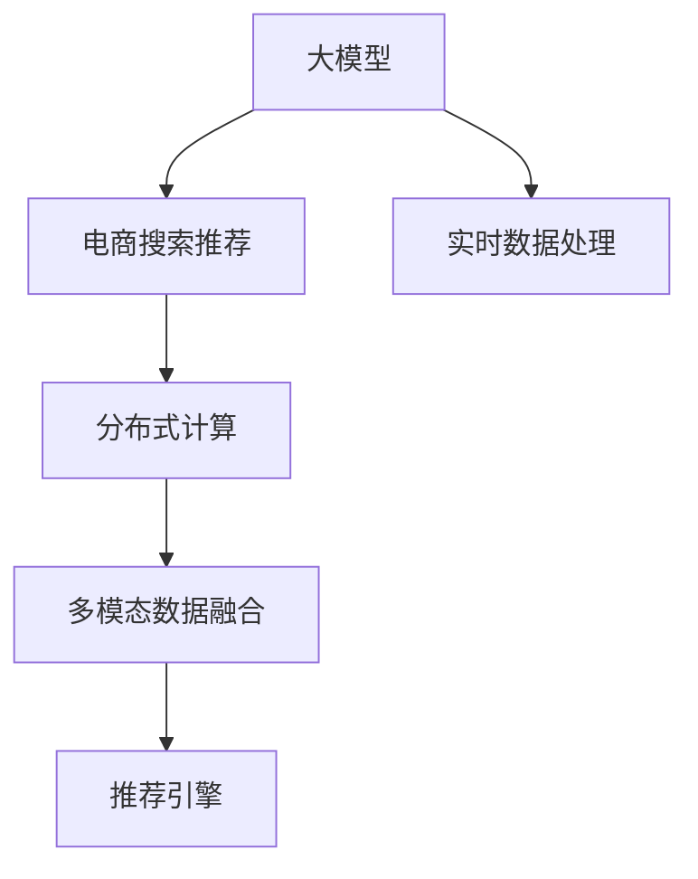

                 

# AI 大模型在电商搜索推荐中的数据处理能力要求：应对大规模实时数据

> 关键词：大模型,电商搜索,推荐系统,数据处理,实时数据,多模态数据,分布式计算

## 1. 背景介绍

在当前数字经济时代，电商平台如淘宝、京东、拼多多等日益成为人们日常生活的一部分。这些平台通过精准的搜索推荐系统，为消费者提供个性化、高效的服务。其中，大模型（如BERT、GPT等）作为现代推荐系统的重要组成部分，利用其强大的语言理解和生成能力，驱动搜索推荐引擎实现更高的精准度和个性化推荐效果。

然而，随着电商平台的流量和用户数的不断增长，搜索推荐系统每天需要处理的数据量也急剧增加。如何在短时间内处理大规模实时数据，并提取有效信息以提升推荐效果，成为电商搜索推荐系统面临的重大挑战。

## 2. 核心概念与联系

### 2.1 核心概念概述

为更好地理解大模型在电商搜索推荐中的应用，本节将介绍几个密切相关的核心概念：

- 大模型（Large Model）：指具有大规模参数量、强大表征能力的深度学习模型，如BERT、GPT等。这些模型通过自监督学习任务进行预训练，具备良好的语言理解和生成能力。
- 电商搜索推荐系统（E-commerce Search and Recommendation System）：利用大模型进行文本匹配、相关性排序等，为用户推荐商品、提升搜索体验的综合性系统。
- 实时数据处理（Real-time Data Processing）：指在数据产生后即时进行处理，以确保数据的时效性和准确性，是大模型在电商搜索推荐中必须解决的问题。
- 分布式计算（Distributed Computing）：通过多台计算机协同处理，分担大模型的计算负荷，提高数据处理效率。
- 多模态数据（Multimodal Data）：指文本、图像、视频等多种数据类型的融合，提升搜索推荐系统的综合性和准确性。

这些核心概念之间的逻辑关系可以通过以下Mermaid流程图来展示：



这个流程图展示了从大模型到电商搜索推荐系统的数据流向：大模型通过实时数据处理和分布式计算，结合多模态数据融合，最终输出推荐结果。

## 3. 核心算法原理 & 具体操作步骤

### 3.1 算法原理概述

在电商搜索推荐系统中，大模型主要通过以下步骤处理大规模实时数据：

1. **数据采集**：从用户行为数据、商品信息数据等多个来源收集数据。
2. **数据预处理**：清洗、标准化、归一化等步骤，确保数据质量。
3. **特征提取**：利用大模型将原始数据转化为高维特征向量。
4. **相似度计算**：计算商品、用户、时间等多个维度的相似度，用于匹配和排序。
5. **推荐排序**：根据相似度结果，进行多轮排序，输出最终推荐结果。

### 3.2 算法步骤详解

以用户搜索推荐为例，具体算法步骤如下：

1. **数据采集**：
   - 收集用户的历史搜索行为数据，如点击、浏览、购买等。
   - 获取商品的相关属性数据，如名称、描述、价格等。
   - 利用多种来源的数据，如社交媒体、评价、评论等，获取用户的多维度信息。

2. **数据预处理**：
   - 清洗用户行为数据，去除无效记录、异常值等。
   - 标准化数据格式，如统一日期时间格式、统一商品编码等。
   - 归一化数据范围，如将商品价格转换为标准尺度。

3. **特征提取**：
   - 利用大模型（如BERT）对用户搜索词进行编码，提取高维特征向量。
   - 使用多模态数据融合技术，如深度融合、权重加和等，综合各类数据特征。

4. **相似度计算**：
   - 采用余弦相似度、欧式距离等方法计算用户与商品之间的相似度。
   - 引入时间因素，考虑用户的即时搜索行为和历史行为，综合计算相似度。

5. **推荐排序**：
   - 结合多轮排序算法（如Top-K排序、召回排序等），对商品进行排序。
   - 引入在线学习（Online Learning）技术，实时更新模型参数，适应数据变化。

### 3.3 算法优缺点

大模型在电商搜索推荐系统中具有以下优点：

1. **高准确性**：利用大模型强大的语言理解和生成能力，提升推荐系统的精准度。
2. **个性化推荐**：通过多维度数据融合，实现更个性化的推荐，满足用户多样化的需求。
3. **快速响应**：利用分布式计算和在线学习技术，实现实时数据处理和模型更新。

但同时，该算法也存在一定的局限性：

1. **高计算成本**：大模型的参数量巨大，需要大量的计算资源。
2. **数据隐私**：多模态数据的融合可能涉及用户隐私信息，需要严格的保护措施。
3. **模型复杂性**：大模型结构复杂，模型解释和调试难度较大。

### 3.4 算法应用领域

大模型的电商搜索推荐系统已经在各大电商平台中得到广泛应用，包括：

1. **商品推荐**：根据用户的浏览和购买历史，推荐相似商品。
2. **个性化搜索**：根据用户的输入搜索词，实时推荐相关商品。
3. **内容推荐**：根据用户的评价和评论，推荐相关商品或文章。
4. **活动促销**：根据用户的消费行为，推荐特定促销活动。
5. **个性化广告**：根据用户的兴趣和行为，推荐个性化广告。

除了这些经典应用外，大模型还广泛应用于个性化内容推荐、智能客服、商品评价分析等场景，为电商平台带来全新的用户体验和服务模式。

## 4. 数学模型和公式 & 详细讲解 & 举例说明

### 4.1 数学模型构建

设电商搜索推荐系统中的数据集为 $D=\{(x_i,y_i)\}_{i=1}^N$，其中 $x_i$ 表示用户行为数据，$y_i$ 表示商品信息数据。大模型 $M$ 通过自监督学习任务进行预训练，得到预训练参数 $\theta$。在微调阶段，模型 $M$ 的输出为 $\hat{y}$，用于预测商品推荐结果。

模型 $M$ 的输入为 $x$，输出为 $\hat{y}$，损失函数为 $\mathcal{L}(M(x),y)$。模型在训练集 $D$ 上的损失函数为：

$$
\mathcal{L}(\theta) = \frac{1}{N} \sum_{i=1}^N \ell(M(x_i),y_i)
$$

其中 $\ell$ 为损失函数，常见的有交叉熵损失、均方误差损失等。

### 4.2 公式推导过程

以交叉熵损失为例，假设模型 $M$ 在用户输入 $x$ 上的输出为 $\hat{y}$，真实标签为 $y$。交叉熵损失函数为：

$$
\ell(M(x),y) = -y\log \hat{y} - (1-y)\log (1-\hat{y})
$$

通过链式法则，计算损失函数对参数 $\theta$ 的梯度：

$$
\frac{\partial \mathcal{L}(\theta)}{\partial \theta} = \frac{\partial}{\partial \theta} \frac{1}{N} \sum_{i=1}^N \ell(M(x_i),y_i) = \frac{1}{N} \sum_{i=1}^N \nabla_{\theta} \ell(M(x_i),y_i)
$$

其中 $\nabla_{\theta} \ell(M(x_i),y_i)$ 为损失函数对模型参数 $\theta$ 的梯度。

### 4.3 案例分析与讲解

假设电商平台收集到如下数据集 $D=\{(x_i,y_i)\}_{i=1}^N$，其中 $x_i$ 为用户的搜索词，$y_i$ 为商品 ID：

$$
\begin{array}{|c|c|}
\hline
x_i & y_i \\
\hline
"运动鞋" & 1 \\
"户外装备" & 2 \\
"旅行箱" & 3 \\
"智能手表" & 4 \\
"智能手机" & 5 \\
"运动服装" & 6 \\
\hline
\end{array}
$$

使用大模型进行特征提取，假设模型在搜索词 "运动鞋" 上的特征编码为 $f_1$，在商品 ID 1 上的特征编码为 $f_2$。则特征向量可以表示为：

$$
f = \begin{bmatrix} f_1 \\ f_2 \end{bmatrix}
$$

采用余弦相似度计算用户与商品的相似度，假设相似度为 $s$：

$$
s = \cos \theta \cdot \frac{f_1 \cdot f_2^T}{\|f_1\|_2 \cdot \|f_2\|_2}
$$

根据相似度计算结果，进行多轮排序，输出推荐结果。

## 5. 项目实践：代码实例和详细解释说明

### 5.1 开发环境搭建

在进行电商搜索推荐系统的开发前，我们需要准备好开发环境。以下是使用Python进行PyTorch开发的环境配置流程：

1. 安装Anaconda：从官网下载并安装Anaconda，用于创建独立的Python环境。

2. 创建并激活虚拟环境：
```bash
conda create -n pytorch-env python=3.8 
conda activate pytorch-env
```

3. 安装PyTorch：根据CUDA版本，从官网获取对应的安装命令。例如：
```bash
conda install pytorch torchvision torchaudio cudatoolkit=11.1 -c pytorch -c conda-forge
```

4. 安装Transformers库：
```bash
pip install transformers
```

5. 安装各类工具包：
```bash
pip install numpy pandas scikit-learn matplotlib tqdm jupyter notebook ipython
```

完成上述步骤后，即可在`pytorch-env`环境中开始电商搜索推荐系统的开发。

### 5.2 源代码详细实现

这里我们以商品推荐为例，给出使用Transformers库对BERT模型进行电商搜索推荐系统的PyTorch代码实现。

首先，定义商品推荐的数据处理函数：

```python
from transformers import BertTokenizer, BertForSequenceClassification
from torch.utils.data import Dataset, DataLoader
import torch

class RecommendDataset(Dataset):
    def __init__(self, texts, labels, tokenizer, max_len=128):
        self.texts = texts
        self.labels = labels
        self.tokenizer = tokenizer
        self.max_len = max_len
        
    def __len__(self):
        return len(self.texts)
    
    def __getitem__(self, item):
        text = self.texts[item]
        label = self.labels[item]
        
        encoding = self.tokenizer(text, return_tensors='pt', max_length=self.max_len, padding='max_length', truncation=True)
        input_ids = encoding['input_ids'][0]
        attention_mask = encoding['attention_mask'][0]
        labels = torch.tensor(label, dtype=torch.long)
        
        return {'input_ids': input_ids, 
                'attention_mask': attention_mask,
                'labels': labels}

# 标签与id的映射
label2id = {'1': 0, '2': 1, '3': 2, '4': 3, '5': 4, '6': 5}
id2label = {v: k for k, v in label2id.items()}

# 创建dataset
tokenizer = BertTokenizer.from_pretrained('bert-base-cased')

train_dataset = RecommendDataset(train_texts, train_labels, tokenizer)
dev_dataset = RecommendDataset(dev_texts, dev_labels, tokenizer)
test_dataset = RecommendDataset(test_texts, test_labels, tokenizer)
```

然后，定义模型和优化器：

```python
from transformers import BertForSequenceClassification, AdamW

model = BertForSequenceClassification.from_pretrained('bert-base-cased', num_labels=len(label2id))

optimizer = AdamW(model.parameters(), lr=2e-5)
```

接着，定义训练和评估函数：

```python
from tqdm import tqdm
from sklearn.metrics import accuracy_score

device = torch.device('cuda') if torch.cuda.is_available() else torch.device('cpu')
model.to(device)

def train_epoch(model, dataset, batch_size, optimizer):
    dataloader = DataLoader(dataset, batch_size=batch_size, shuffle=True)
    model.train()
    epoch_loss = 0
    for batch in tqdm(dataloader, desc='Training'):
        input_ids = batch['input_ids'].to(device)
        attention_mask = batch['attention_mask'].to(device)
        labels = batch['labels'].to(device)
        model.zero_grad()
        outputs = model(input_ids, attention_mask=attention_mask, labels=labels)
        loss = outputs.loss
        epoch_loss += loss.item()
        loss.backward()
        optimizer.step()
    return epoch_loss / len(dataloader)

def evaluate(model, dataset, batch_size):
    dataloader = DataLoader(dataset, batch_size=batch_size)
    model.eval()
    preds, labels = [], []
    with torch.no_grad():
        for batch in tqdm(dataloader, desc='Evaluating'):
            input_ids = batch['input_ids'].to(device)
            attention_mask = batch['attention_mask'].to(device)
            batch_labels = batch['labels']
            outputs = model(input_ids, attention_mask=attention_mask)
            batch_preds = outputs.logits.argmax(dim=1).to('cpu').tolist()
            batch_labels = batch_labels.to('cpu').tolist()
            for pred, label in zip(batch_preds, batch_labels):
                preds.append(pred)
                labels.append(label)
                
    accuracy = accuracy_score(labels, preds)
    print(f"Accuracy: {accuracy:.4f}")
```

最后，启动训练流程并在测试集上评估：

```python
epochs = 5
batch_size = 16

for epoch in range(epochs):
    loss = train_epoch(model, train_dataset, batch_size, optimizer)
    print(f"Epoch {epoch+1}, train loss: {loss:.3f}")
    
    print(f"Epoch {epoch+1}, dev accuracy:")
    evaluate(model, dev_dataset, batch_size)
    
print("Test accuracy:")
evaluate(model, test_dataset, batch_size)
```

以上就是使用PyTorch对BERT进行商品推荐任务的电商搜索推荐系统的完整代码实现。可以看到，得益于Transformers库的强大封装，我们可以用相对简洁的代码完成BERT模型的加载和电商搜索推荐任务的微调。

### 5.3 代码解读与分析

让我们再详细解读一下关键代码的实现细节：

**RecommendDataset类**：
- `__init__`方法：初始化文本、标签、分词器等关键组件。
- `__len__`方法：返回数据集的样本数量。
- `__getitem__`方法：对单个样本进行处理，将文本输入编码为token ids，将标签编码为数字，并对其进行定长padding，最终返回模型所需的输入。

**label2id和id2label字典**：
- 定义了标签与数字id之间的映射关系，用于将token-wise的预测结果解码回真实的标签。

**训练和评估函数**：
- 使用PyTorch的DataLoader对数据集进行批次化加载，供模型训练和推理使用。
- 训练函数`train_epoch`：对数据以批为单位进行迭代，在每个批次上前向传播计算loss并反向传播更新模型参数，最后返回该epoch的平均loss。
- 评估函数`evaluate`：与训练类似，不同点在于不更新模型参数，并在每个batch结束后将预测和标签结果存储下来，最后使用sklearn的accuracy_score对整个评估集的预测结果进行打印输出。

**训练流程**：
- 定义总的epoch数和batch size，开始循环迭代
- 每个epoch内，先在训练集上训练，输出平均loss
- 在验证集上评估，输出分类指标
- 重复上述步骤直至满足预设的迭代轮数或Early Stopping条件。

可以看到，PyTorch配合Transformers库使得电商搜索推荐系统的开发变得简洁高效。开发者可以将更多精力放在数据处理、模型改进等高层逻辑上，而不必过多关注底层的实现细节。

当然，工业级的系统实现还需考虑更多因素，如模型的保存和部署、超参数的自动搜索、更灵活的任务适配层等。但核心的电商搜索推荐范式基本与此类似。

## 6. 实际应用场景

### 6.1 智能客服系统

基于大模型的电商搜索推荐系统，可以广泛应用于智能客服系统的构建。传统客服往往需要配备大量人力，高峰期响应缓慢，且一致性和专业性难以保证。而使用电商搜索推荐系统构建的智能客服，可以7x24小时不间断服务，快速响应客户咨询，用自然流畅的语言解答各类常见问题。

在技术实现上，可以收集企业内部的历史客服对话记录，将问题和最佳答复构建成监督数据，在此基础上对预训练模型进行微调。微调后的模型能够自动理解用户意图，匹配最合适的答复模板进行回复。对于客户提出的新问题，还可以接入检索系统实时搜索相关内容，动态组织生成回答。如此构建的智能客服系统，能大幅提升客户咨询体验和问题解决效率。

### 6.2 个性化推荐系统

当前的推荐系统往往只依赖用户的历史行为数据进行物品推荐，无法深入理解用户的真实兴趣偏好。基于大模型的电商搜索推荐系统可以更好地挖掘用户行为背后的语义信息，从而提供更精准、多样的推荐内容。

在实践中，可以收集用户浏览、点击、评论、分享等行为数据，提取和商品交互的物品标题、描述、标签等文本内容。将文本内容作为模型输入，用户的后续行为（如是否点击、购买等）作为监督信号，在此基础上微调预训练语言模型。微调后的模型能够从文本内容中准确把握用户的兴趣点。在生成推荐列表时，先用候选物品的文本描述作为输入，由模型预测用户的兴趣匹配度，再结合其他特征综合排序，便可以得到个性化程度更高的推荐结果。

### 6.3 金融舆情监测

金融机构需要实时监测市场舆论动向，以便及时应对负面信息传播，规避金融风险。传统的人工监测方式成本高、效率低，难以应对网络时代海量信息爆发的挑战。基于大模型的电商搜索推荐系统，也可以应用于金融舆情监测。

具体而言，可以收集金融领域相关的新闻、报道、评论等文本数据，并对其进行主题标注和情感标注。在此基础上对预训练语言模型进行微调，使其能够自动判断文本属于何种主题，情感倾向是正面、中性还是负面。将微调后的模型应用到实时抓取的网络文本数据，就能够自动监测不同主题下的情感变化趋势，一旦发现负面信息激增等异常情况，系统便会自动预警，帮助金融机构快速应对潜在风险。

### 6.4 未来应用展望

随着电商平台的流量和用户数的不断增长，搜索推荐系统每天需要处理的数据量也急剧增加。如何在短时间内处理大规模实时数据，并提取有效信息以提升推荐效果，成为电商搜索推荐系统面临的重大挑战。

未来，大模型在电商搜索推荐中的应用将更加广泛，涉及更多模态的数据处理。除了文本数据，还将融合图像、视频、语音等多种数据类型，提升推荐系统的综合性和准确性。同时，分布式计算和在线学习技术也将得到进一步发展，支持大规模实时数据的处理和模型更新，进一步提高推荐效果。

## 7. 工具和资源推荐

### 7.1 学习资源推荐

为了帮助开发者系统掌握大模型在电商搜索推荐中的应用，这里推荐一些优质的学习资源：

1. 《Transformer从原理到实践》系列博文：由大模型技术专家撰写，深入浅出地介绍了Transformer原理、BERT模型、电商搜索推荐系统等前沿话题。

2. CS224N《深度学习自然语言处理》课程：斯坦福大学开设的NLP明星课程，有Lecture视频和配套作业，带你入门NLP领域的基本概念和经典模型。

3. 《Natural Language Processing with Transformers》书籍：Transformers库的作者所著，全面介绍了如何使用Transformers库进行NLP任务开发，包括电商搜索推荐系统在内的诸多应用。

4. HuggingFace官方文档：Transformers库的官方文档，提供了海量预训练模型和完整的电商搜索推荐系统微调样例代码，是上手实践的必备资料。

5. CLUE开源项目：中文语言理解测评基准，涵盖大量不同类型的中文NLP数据集，并提供了基于大模型的电商搜索推荐系统baseline模型，助力中文NLP技术发展。

通过对这些资源的学习实践，相信你一定能够快速掌握大模型在电商搜索推荐中的应用，并用于解决实际的NLP问题。

### 7.2 开发工具推荐

高效的开发离不开优秀的工具支持。以下是几款用于电商搜索推荐系统开发的常用工具：

1. PyTorch：基于Python的开源深度学习框架，灵活动态的计算图，适合快速迭代研究。大部分预训练语言模型都有PyTorch版本的实现。

2. TensorFlow：由Google主导开发的开源深度学习框架，生产部署方便，适合大规模工程应用。同样有丰富的预训练语言模型资源。

3. Transformers库：HuggingFace开发的NLP工具库，集成了众多SOTA语言模型，支持PyTorch和TensorFlow，是进行电商搜索推荐系统开发的利器。

4. Weights & Biases：模型训练的实验跟踪工具，可以记录和可视化模型训练过程中的各项指标，方便对比和调优。与主流深度学习框架无缝集成。

5. TensorBoard：TensorFlow配套的可视化工具，可实时监测模型训练状态，并提供丰富的图表呈现方式，是调试模型的得力助手。

6. Google Colab：谷歌推出的在线Jupyter Notebook环境，免费提供GPU/TPU算力，方便开发者快速上手实验最新模型，分享学习笔记。

合理利用这些工具，可以显著提升电商搜索推荐系统的开发效率，加快创新迭代的步伐。

### 7.3 相关论文推荐

大模型在电商搜索推荐系统中的应用源于学界的持续研究。以下是几篇奠基性的相关论文，推荐阅读：

1. Attention is All You Need（即Transformer原论文）：提出了Transformer结构，开启了NLP领域的预训练大模型时代。

2. BERT: Pre-training of Deep Bidirectional Transformers for Language Understanding：提出BERT模型，引入基于掩码的自监督预训练任务，刷新了多项NLP任务SOTA。

3. Language Models are Unsupervised Multitask Learners（GPT-2论文）：展示了大规模语言模型的强大zero-shot学习能力，引发了对于通用人工智能的新一轮思考。

4. Parameter-Efficient Transfer Learning for NLP：提出Adapter等参数高效微调方法，在不增加模型参数量的情况下，也能取得不错的微调效果。

5. Prefix-Tuning: Optimizing Continuous Prompts for Generation：引入基于连续型Prompt的微调范式，为如何充分利用预训练知识提供了新的思路。

6. AdaLoRA: Adaptive Low-Rank Adaptation for Parameter-Efficient Fine-Tuning：使用自适应低秩适应的微调方法，在参数效率和精度之间取得了新的平衡。

这些论文代表了大模型在电商搜索推荐系统中的应用和发展脉络。通过学习这些前沿成果，可以帮助研究者把握学科前进方向，激发更多的创新灵感。

## 8. 总结：未来发展趋势与挑战

### 8.1 总结

本文对基于大模型的电商搜索推荐系统进行了全面系统的介绍。首先阐述了电商搜索推荐系统和大模型在电商平台中的应用背景，明确了大模型在电商搜索推荐系统中的关键作用。其次，从原理到实践，详细讲解了电商搜索推荐系统的数据处理能力要求，介绍了大模型在电商搜索推荐系统中的核心算法原理和具体操作步骤，给出了电商搜索推荐系统的完整代码实例。同时，本文还广泛探讨了电商搜索推荐系统在大模型应用中的实际应用场景，展示了电商搜索推荐系统在大模型驱动下实现的高精准度和个性化推荐效果。此外，本文精选了电商搜索推荐系统的各类学习资源，力求为读者提供全方位的技术指引。

通过本文的系统梳理，可以看到，基于大模型的电商搜索推荐系统正在成为电商平台的重要技术支柱，极大地提升了用户搜索体验和推荐效果。未来，随着电商平台的流量和用户数的不断增长，搜索推荐系统每天需要处理的数据量也急剧增加，如何在短时间内处理大规模实时数据，并提取有效信息以提升推荐效果，成为电商搜索推荐系统面临的重大挑战。相信随着学界和产业界的共同努力，这些挑战终将一一被克服，大模型在电商搜索推荐系统中的应用必将在未来的电商市场中发挥更大的作用。

### 8.2 未来发展趋势

展望未来，大模型在电商搜索推荐系统中的应用将呈现以下几个发展趋势：

1. **多模态数据融合**：除了文本数据，电商搜索推荐系统还将融合图像、视频、语音等多种数据类型，提升推荐系统的综合性和准确性。

2. **分布式计算与在线学习**：为了处理大规模实时数据，电商搜索推荐系统将采用分布式计算和在线学习技术，支持大规模数据处理和模型更新，进一步提高推荐效果。

3. **实时推荐算法**：实时推荐算法将成为电商搜索推荐系统的重要组成部分，实现快速响应用户需求，提升用户体验。

4. **个性化推荐优化**：基于大模型的电商搜索推荐系统将通过用户行为数据、商品数据等多维度信息，实现更精准、个性化的推荐，提升用户满意度。

5. **自动化调优**：电商搜索推荐系统将引入自动化调优技术，通过超参数优化、模型压缩等手段，提升系统的运行效率和资源利用率。

6. **知识图谱与跨领域迁移**：结合知识图谱和跨领域迁移技术，电商搜索推荐系统将具备更强的泛化能力，适应更多复杂场景的应用。

以上趋势凸显了大模型在电商搜索推荐系统中的广泛应用前景。这些方向的探索发展，必将进一步提升电商搜索推荐系统的性能和应用范围，为电商平台带来更高的价值。

### 8.3 面临的挑战

尽管大模型在电商搜索推荐系统中的应用已经取得了显著成效，但在迈向更加智能化、普适化应用的过程中，它仍面临着诸多挑战：

1. **数据隐私**：多模态数据的融合可能涉及用户隐私信息，需要严格的保护措施。

2. **计算成本**：大模型的参数量巨大，需要大量的计算资源，对硬件设施提出了高要求。

3. **模型复杂性**：大模型结构复杂，模型解释和调试难度较大，难以直接解释其内部工作机制。

4. **分布式协同**：多节点分布式计算需要高效的网络通信和数据同步，技术复杂性较高。

5. **实时处理**：电商搜索推荐系统需要在实时数据产生后即时进行处理，对系统性能提出了高要求。

6. **个性化推荐**：如何在大规模数据中提取有效的个性化特征，实现更精准的推荐，仍是一个挑战。

7. **在线学习**：在线学习技术需要高效的模型更新算法和策略，避免模型遗忘旧知识，同时吸收新知识。

8. **知识图谱**：结合知识图谱和跨领域迁移技术，需要解决复杂的关系推理和知识融合问题。

这些挑战展示了电商搜索推荐系统在大模型应用中的复杂性和技术难度。但随着技术进步和产业实践的不断推进，这些挑战必将逐步被克服，大模型在电商搜索推荐系统中的应用也将更加广泛和深入。

### 8.4 研究展望

面对电商搜索推荐系统在大模型应用中所面临的挑战，未来的研究需要在以下几个方面寻求新的突破：

1. **知识图谱与跨领域迁移**：结合知识图谱和跨领域迁移技术，实现更强的泛化能力和应用范围。

2. **实时推荐算法**：探索更高效的实时推荐算法，提升推荐系统的响应速度和准确性。

3. **自动化调优**：引入自动化调优技术，通过超参数优化、模型压缩等手段，提升系统的运行效率和资源利用率。

4. **分布式协同**：开发更高效的分布式计算框架，支持多节点协同处理，优化网络通信和数据同步。

5. **多模态融合**：深入研究多模态数据的融合技术，提升推荐系统的综合性和准确性。

6. **实时处理**：探索更高效的实时处理技术，支持大规模实时数据的处理和模型更新。

7. **隐私保护**：研究更有效的数据隐私保护技术，确保用户数据的安全性和合规性。

8. **模型压缩**：开发更高效的模型压缩技术，降低计算成本，提升系统的可扩展性。

9. **可解释性**：研究更强的模型可解释性技术，增强系统透明性和可信任度。

这些研究方向将推动电商搜索推荐系统在大模型驱动下实现更高的精准度和个性化推荐效果，为电商平台带来更多的商业价值。

## 9. 附录：常见问题与解答

**Q1：大模型在电商搜索推荐系统中面临哪些挑战？**

A: 大模型在电商搜索推荐系统中面临的主要挑战包括：
1. **数据隐私**：多模态数据的融合可能涉及用户隐私信息，需要严格的保护措施。
2. **计算成本**：大模型的参数量巨大，需要大量的计算资源，对硬件设施提出了高要求。
3. **模型复杂性**：大模型结构复杂，模型解释和调试难度较大，难以直接解释其内部工作机制。
4. **分布式协同**：多节点分布式计算需要高效的网络通信和数据同步，技术复杂性较高。
5. **实时处理**：电商搜索推荐系统需要在实时数据产生后即时进行处理，对系统性能提出了高要求。
6. **个性化推荐**：如何在大规模数据中提取有效的个性化特征，实现更精准的推荐，仍是一个挑战。
7. **在线学习**：在线学习技术需要高效的模型更新算法和策略，避免模型遗忘旧知识，同时吸收新知识。
8. **知识图谱**：结合知识图谱和跨领域迁移技术，需要解决复杂的关系推理和知识融合问题。

**Q2：如何提升电商搜索推荐系统的推荐效果？**

A: 提升电商搜索推荐系统的推荐效果主要从以下几个方面入手：
1. **数据采集与预处理**：全面采集用户行为数据、商品信息数据等多维度信息，进行清洗、标准化、归一化等预处理步骤，确保数据质量。
2. **特征提取**：利用大模型对文本数据进行特征提取，结合多模态数据融合技术，综合各类数据特征。
3. **相似度计算**：采用余弦相似度、欧式距离等方法计算用户与商品的相似度，考虑时间因素进行多轮排序。
4. **推荐算法优化**：引入Top-K排序、召回排序等推荐算法，结合在线学习技术，实时更新模型参数，提升推荐效果。
5. **实时数据处理**：利用分布式计算和在线学习技术，实现大规模实时数据的处理和模型更新，支持快速响应用户需求。
6. **知识图谱**：结合知识图谱和跨领域迁移技术，提升模型的泛化能力和应用范围。

**Q3：如何确保电商搜索推荐系统的数据隐私和安全？**

A: 确保电商搜索推荐系统的数据隐私和安全主要从以下几个方面入手：
1. **数据匿名化**：在数据处理过程中，对涉及用户隐私的信息进行匿名化处理，确保数据不可逆识别。
2. **访问控制**：限制对用户数据的访问权限，确保数据仅在必要情况下使用，避免数据泄露。
3. **加密传输**：采用加密传输技术，确保数据在网络传输过程中不被窃取或篡改。
4. **安全存储**：采用安全存储技术，确保数据在存储过程中不被未授权访问或泄露。
5. **合规性**：遵循相关法律法规，确保数据处理过程符合数据保护要求。

**Q4：如何评估电商搜索推荐系统的推荐效果？**

A: 评估电商搜索推荐系统的推荐效果主要通过以下指标：
1. **准确率（Accuracy）**：衡量推荐结果与真实标签的一致性，准确率越高，推荐效果越好。
2. **召回率（Recall）**：衡量推荐系统对真实标签的覆盖率，召回率越高，系统覆盖的推荐范围越广。
3. **F1 Score**：综合考虑准确率和召回率，用于综合评估推荐效果。
4. **NDCG（Normalized Discounted Cumulative Gain）**：衡量推荐结果的相关性，NDCG值越高，推荐结果的相关性越好。
5. **MRR（Mean Reciprocal Rank）**：衡量推荐结果的平均排名，MRR值越高，推荐结果的排名越靠前。
6. **HR（Hit Rate）**：衡量推荐结果的命中率，HR值越高，推荐结果的覆盖面越广。

通过这些指标的评估，可以全面了解电商搜索推荐系统的推荐效果，并进一步优化模型和算法，提升推荐系统的性能和用户体验。

**Q5：电商搜索推荐系统在大模型应用中需要注意哪些问题？**

A: 电商搜索推荐系统在大模型应用中需要注意以下几个问题：
1. **数据采集与预处理**：全面采集用户行为数据、商品信息数据等多维度信息，进行清洗、标准化、归一化等预处理步骤，确保数据质量。
2. **特征提取**：利用大模型对文本数据进行特征提取，结合多模态数据融合技术，综合各类数据特征。
3. **相似度计算**：采用余弦相似度、欧式距离等方法计算用户与商品的相似度，考虑时间因素进行多轮排序。
4. **推荐算法优化**：引入Top-K排序、召回排序等推荐算法，结合在线学习技术，实时更新模型参数，提升推荐效果。
5. **实时数据处理**：利用分布式计算和在线学习技术，实现大规模实时数据的处理和模型更新，支持快速响应用户需求。
6. **知识图谱**：结合知识图谱和跨领域迁移技术，提升模型的泛化能力和应用范围。

这些关键问题需要综合考虑，才能在大模型驱动下实现更高的精准度和个性化推荐效果，为电商平台带来更多的商业价值。

---

作者：禅与计算机程序设计艺术 / Zen and the Art of Computer Programming

