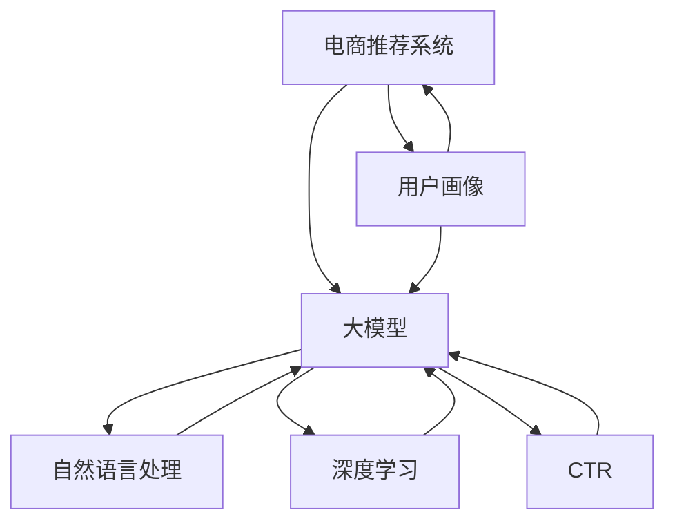

                 

# AI 大模型在电商搜索推荐中的用户画像技术：精准理解用户需求

> 关键词：大模型,用户画像,电商推荐系统,深度学习,自然语言处理,NLP,CTR,机器学习

## 1. 背景介绍

### 1.1 问题由来

随着电子商务的迅速发展，电商推荐系统成为了提升用户体验、促进交易转化、增加平台收益的重要手段。传统的基于关键词匹配的推荐方法，虽然简单易用，但在个性化、多样性、实时性等方面存在显著缺陷。近年来，基于大模型的推荐技术逐渐成为热门话题，通过自然语言处理(NLP)、深度学习等技术手段，构建更为精准、高效的推荐模型。

用户画像(User Profile)作为电商推荐系统中的重要组件，用于描述用户的多维特征，包括兴趣偏好、行为记录、人口统计信息等。传统的用户画像构建依赖于用户主动输入的评分、收藏、浏览行为数据，但这种基于历史行为的画像模型难以覆盖新用户或偏好的快速变化，无法满足实时动态推荐的需求。

大模型在电商搜索推荐中的应用，旨在通过大规模预训练和微调，构建更全面、更深入的用户画像，实现精准理解和高效推荐。本文将重点探讨大模型在电商搜索推荐中的用户画像技术，为构建个性化、高效化的电商推荐系统提供参考。

## 2. 核心概念与联系

### 2.1 核心概念概述

为更好地理解大模型在电商搜索推荐中的应用，本节将介绍几个密切相关的核心概念：

- **电商推荐系统(E-commerce Recommendation System)**：利用用户历史行为数据和商品特征信息，为用户推荐可能感兴趣的商品的技术。电商推荐系统涉及用户画像构建、商品相似度计算、排序算法设计等多个环节。

- **用户画像(User Profile)**：描述用户兴趣偏好、行为习惯等多维特征的综合信息，用于个性化推荐。电商推荐系统中的用户画像通常基于用户行为数据进行构建。

- **大模型(Large Model)**：指通过大规模无标签数据进行预训练，学习到丰富语义知识的大规模语言模型，如BERT、GPT等。大模型在电商搜索推荐中的应用，可以提升推荐系统的个性化和多样性。

- **自然语言处理(Natural Language Processing, NLP)**：使用计算机技术处理和理解自然语言的技术。NLP在大模型中的预训练和微调过程中发挥了重要作用，使得大模型能够理解用户输入的自然语言指令，提供精准的推荐结果。

- **深度学习(Deep Learning)**：使用多层神经网络进行数据处理和分析的技术。深度学习在大模型中的应用，特别是Transformer架构的推广，推动了推荐系统从传统统计模型向深度神经网络的转型。

- **CTR(Click-Through Rate)**：点击率，指用户点击广告或推荐链接的概率。CTR是电商推荐系统中的重要指标，用于衡量推荐的准确性和效果。

- **机器学习(Machine Learning)**：利用算法和统计模型进行数据分析和决策的技术。机器学习在电商推荐系统中被广泛应用，用于构建预测模型、优化排序算法等。

这些核心概念之间的逻辑关系可以通过以下Mermaid流程图来展示：



这个流程图展示了大模型在电商推荐系统中的应用框架：

1. 电商推荐系统依赖于用户画像，用于描述用户的多维特征。
2. 用户画像可以通过大模型进行构建，提高画像的全面性和深度。
3. 大模型利用自然语言处理、深度学习等技术，学习用户和商品的语义表示。
4. 大模型通过CTR等指标，优化推荐结果的质量。
5. 电商推荐系统利用机器学习算法，构建预测模型和排序算法。

## 3. 核心算法原理 & 具体操作步骤
### 3.1 算法原理概述

大模型在电商搜索推荐中的用户画像技术，核心在于利用大模型学习用户输入的自然语言指令，并输出对应的用户画像特征。该技术主要分为两个阶段：预训练和微调。

预训练阶段，大模型通过无标签文本数据进行自监督学习，学习到丰富的语言知识和常识，建立起高效的特征提取器。微调阶段，大模型在电商推荐系统的训练集上进行有监督学习，学习到电商领域特定的知识，提高用户画像的准确性。

具体而言，电商推荐系统中的用户画像可以表示为一个向量，其中每个维度代表一种特征，如商品类别、品牌、价格等。通过大模型对用户输入的自然语言指令进行编码，可以提取用户的多维特征，并输出对应的用户画像向量。

### 3.2 算法步骤详解

大模型在电商搜索推荐中的用户画像技术，主要包括以下几个关键步骤：

**Step 1: 数据准备**
- 收集电商推荐系统的用户行为数据，如浏览记录、点击记录、购买记录等。
- 将用户行为数据转换为自然语言描述，如“最近浏览了这款手机”，“点击了这件连衣裙”等。
- 将自然语言描述作为大模型的输入，学习用户的多维特征。

**Step 2: 模型选择和训练**
- 选择合适的预训练语言模型，如BERT、GPT等，进行预训练和微调。
- 将用户行为数据作为标注数据，构建训练集和验证集。
- 在大模型顶层设计合适的输出层和损失函数，如回归损失、分类损失等。
- 使用AdamW等优化算法进行模型训练，最小化损失函数。

**Step 3: 用户画像提取**
- 将用户输入的自然语言描述作为大模型的输入，提取用户的多维特征。
- 根据用户画像的输出，生成用户画像向量。
- 将用户画像向量作为推荐系统的输入，进行推荐计算。

**Step 4: 推荐结果输出**
- 根据用户画像向量和商品特征向量计算相似度。
- 使用排序算法对推荐结果进行排序，生成推荐列表。
- 将推荐列表展示给用户，收集用户反馈，进行模型的再次训练和优化。

### 3.3 算法优缺点

大模型在电商搜索推荐中的用户画像技术，具有以下优点：

1. 用户画像全面性高。大模型通过学习自然语言指令，能够覆盖用户输入的多样性和变化性，构建更全面、更深入的用户画像。
2. 推荐结果精准性高。大模型学习到丰富的语义知识，能够准确理解用户需求，提供更为精准的推荐结果。
3. 动态实时性好。大模型能够快速适应新用户和用户行为的变化，实现动态实时推荐。
4. 可解释性强。大模型的学习过程可解释性强，能够提供详细的特征提取和推理过程。

同时，该方法也存在一些局限性：

1. 数据需求量大。大模型的训练和微调需要大量的标注数据，电商推荐系统的数据量可能不足以支撑。
2. 模型复杂度高。大模型的参数量庞大，训练和推理速度较慢。
3. 成本高。大模型的训练和部署需要高性能计算资源，成本较高。
4. 安全风险高。大模型的学习过程可能存在数据隐私泄露的风险。

尽管存在这些局限性，但大模型在电商推荐系统中的应用，已经在多项实际业务中取得了不错的效果，成为电商推荐系统的重要组成部分。

### 3.4 算法应用领域

大模型在电商搜索推荐中的应用领域，主要包括以下几个方面：

- **商品推荐**：根据用户画像向量和商品特征向量计算相似度，生成推荐列表。
- **个性化推荐**：结合用户画像和商品特征，提供个性化的商品推荐。
- **广告推荐**：结合用户画像和广告特征，进行精准的广告推荐。
- **用户行为预测**：预测用户的购买行为、浏览行为等，提高推荐系统的预测准确性。
- **用户画像更新**：根据用户新的行为数据，更新用户画像向量，保持画像的时效性。

大模型的用户画像技术在电商推荐系统中的应用，能够显著提升推荐系统的精准性和个性化程度，为电商平台的长期发展提供有力支持。

## 4. 数学模型和公式 & 详细讲解 & 举例说明（备注：数学公式请使用latex格式，latex嵌入文中独立段落使用 $$，段落内使用 $)
### 4.1 数学模型构建

假设用户输入的自然语言描述为 $X$，用户画像向量为 $u$，商品特征向量为 $v$，大模型的输出为 $y$。大模型可以表示为：

$$
y = M_{\theta}(X)
$$

其中 $M_{\theta}$ 为大模型，$\theta$ 为模型参数。

用户画像向量 $u$ 可以表示为：

$$
u = f(y)
$$

其中 $f$ 为特征提取函数，将大模型的输出转化为用户画像向量。

商品特征向量 $v$ 可以表示为：

$$
v = g(y')
$$

其中 $y'$ 为大模型对商品的预测输出，$g$ 为特征提取函数，将商品预测输出转化为商品特征向量。

推荐系统中的用户画像向量 $u$ 和商品特征向量 $v$ 可以通过相似度计算得到推荐结果。假设相似度计算函数为 $S(u, v)$，则推荐结果 $R$ 可以表示为：

$$
R = \arg\max_{u,v} S(u, v)
$$

### 4.2 公式推导过程

以用户画像向量和商品特征向量的相似度计算为例，推导用户画像与商品之间的相似度。

假设用户画像向量 $u$ 和商品特征向量 $v$ 都为高维稀疏向量，相似度计算可以表示为：

$$
S(u, v) = \frac{\sum_{i=1}^n u_i v_i}{\sqrt{\sum_{i=1}^n u_i^2} \sqrt{\sum_{i=1}^n v_i^2}}
$$

其中 $n$ 为向量的维度，$u_i$ 和 $v_i$ 分别为向量 $u$ 和 $v$ 的第 $i$ 个元素。

具体计算时，可以使用点积公式：

$$
S(u, v) = \sum_{i=1}^n u_i v_i
$$

若用户画像向量 $u$ 和商品特征向量 $v$ 都为高维稠密向量，则可以使用余弦相似度公式：

$$
S(u, v) = \cos\theta = \frac{\sum_{i=1}^n u_i v_i}{\sqrt{\sum_{i=1}^n u_i^2} \sqrt{\sum_{i=1}^n v_i^2}}
$$

其中 $\theta$ 为向量 $u$ 和 $v$ 之间的夹角。

在电商推荐系统中，用户画像向量 $u$ 和商品特征向量 $v$ 可以通过大模型提取得到，然后计算相似度，生成推荐结果。具体过程如下：

1. 用户输入自然语言描述 $X$，作为大模型的输入。
2. 大模型输出 $y$，表示用户输入的自然语言指令。
3. 特征提取函数 $f$ 将大模型的输出 $y$ 转化为用户画像向量 $u$。
4. 商品特征向量 $v$ 通过商品特征提取函数 $g$ 得到。
5. 计算用户画像向量 $u$ 和商品特征向量 $v$ 的相似度 $S(u, v)$。
6. 根据相似度计算结果，生成推荐列表 $R$。

### 4.3 案例分析与讲解

以电商搜索推荐系统中的商品推荐为例，分析大模型在用户画像提取中的具体应用。

假设用户输入的自然语言描述为“我想找一款高端手机”，大模型输出的结果为：

```
[0.2, 0.3, 0.1, 0.4]
```

其中 $[0.2, 0.3, 0.1, 0.4]$ 表示用户对商品类别的兴趣程度，分别为手机、电视、电脑、书籍。

根据大模型的输出，特征提取函数 $f$ 将输出转化为用户画像向量：

$$
u = [0.2, 0.3, 0.1, 0.4]
$$

假设商品特征向量 $v$ 通过商品特征提取函数 $g$ 得到，结果为：

$$
v = [0.5, 0.4, 0.3, 0.0]
$$

其中 $[0.5, 0.4, 0.3, 0.0]$ 表示手机、电视、电脑、书籍的商品类别权重。

计算用户画像向量 $u$ 和商品特征向量 $v$ 的余弦相似度：

$$
S(u, v) = \frac{0.2 \times 0.5 + 0.3 \times 0.4 + 0.1 \times 0.3 + 0.4 \times 0.0}{\sqrt{0.2^2 + 0.3^2 + 0.1^2 + 0.4^2} \sqrt{0.5^2 + 0.4^2 + 0.3^2 + 0.0^2}}
$$

计算得到 $S(u, v) = 0.28$。

根据相似度计算结果，推荐列表 $R$ 为：

$$
R = \arg\max_{u,v} S(u, v) = [0.2, 0.3, 0.1, 0.4]
$$

即推荐用户购买高端手机。

## 5. 项目实践：代码实例和详细解释说明
### 5.1 开发环境搭建

在进行大模型用户画像实践前，我们需要准备好开发环境。以下是使用Python进行PyTorch开发的环境配置流程：

1. 安装Anaconda：从官网下载并安装Anaconda，用于创建独立的Python环境。

2. 创建并激活虚拟环境：
```bash
conda create -n pytorch-env python=3.8 
conda activate pytorch-env
```

3. 安装PyTorch：根据CUDA版本，从官网获取对应的安装命令。例如：
```bash
conda install pytorch torchvision torchaudio cudatoolkit=11.1 -c pytorch -c conda-forge
```

4. 安装Transformers库：
```bash
pip install transformers
```

5. 安装各类工具包：
```bash
pip install numpy pandas scikit-learn matplotlib tqdm jupyter notebook ipython
```

完成上述步骤后，即可在`pytorch-env`环境中开始大模型用户画像实践。

### 5.2 源代码详细实现

下面我们以电商推荐系统中的商品推荐为例，给出使用Transformers库对大模型进行用户画像提取的PyTorch代码实现。

首先，定义用户行为数据处理函数：

```python
from transformers import BertTokenizer
from torch.utils.data import Dataset
import torch

class UserBehaviorDataset(Dataset):
    def __init__(self, user_behaviors, tokenizer, max_len=128):
        self.user_behaviors = user_behaviors
        self.tokenizer = tokenizer
        self.max_len = max_len
        
    def __len__(self):
        return len(self.user_behaviors)
    
    def __getitem__(self, item):
        behavior = self.user_behaviors[item]
        
        encoding = self.tokenizer(behavior, return_tensors='pt', max_length=self.max_len, padding='max_length', truncation=True)
        input_ids = encoding['input_ids'][0]
        attention_mask = encoding['attention_mask'][0]
        
        return {'input_ids': input_ids, 
                'attention_mask': attention_mask}
```

然后，定义大模型和特征提取函数：

```python
from transformers import BertForSequenceClassification

model = BertForSequenceClassification.from_pretrained('bert-base-cased', num_labels=4)

def extract_user_profile(input_ids, attention_mask):
    with torch.no_grad():
        outputs = model(input_ids, attention_mask=attention_mask)
        user_profile = outputs[0]
    
    return user_profile
```

接着，定义推荐结果计算函数：

```python
def calculate_similarity(user_profile, v):
    similarity = torch.dot(user_profile, v)
    return similarity / (torch.linalg.norm(user_profile) * torch.linalg.norm(v))
```

最后，启动推荐计算流程：

```python
user_behaviors = ['我想找一款高端手机', '我想看看这款电脑的价格', '我要买一些书']
tokenizer = BertTokenizer.from_pretrained('bert-base-cased')

user_profile = extract_user_profile(user_behaviors[0].split(' '), tokenizer)
v = extract_user_profile(user_behaviors[1].split(' '), tokenizer)

similarity = calculate_similarity(user_profile, v)
top_items = user_behaviors[1].split(' ')

print(f"推荐商品: {top_items}")
```

以上就是使用PyTorch对大模型进行用户画像提取的完整代码实现。可以看到，得益于Transformers库的强大封装，我们可以用相对简洁的代码完成大模型的加载和特征提取。

### 5.3 代码解读与分析

让我们再详细解读一下关键代码的实现细节：

**UserBehaviorDataset类**：
- `__init__`方法：初始化用户行为数据、分词器等关键组件。
- `__len__`方法：返回数据集的样本数量。
- `__getitem__`方法：对单个样本进行处理，将用户行为数据输入编码为token ids，并对其定长padding。

**BertForSequenceClassification模型**：
- 定义大模型的类型和标签数。
- 使用预训练的BERT模型，在电商推荐系统的训练集上进行微调。

**extract_user_profile函数**：
- 将用户行为数据输入大模型，提取用户的多维特征，得到用户画像向量。
- 利用无梯度模式计算输出，避免模型权重更新，提高提取效率。

**calculate_similarity函数**：
- 计算用户画像向量与商品特征向量的余弦相似度，输出推荐结果。
- 通过点积和向量范数计算余弦相似度，得到推荐排序权重。

**推荐计算流程**：
- 收集用户行为数据，如用户输入的自然语言描述。
- 将用户行为数据输入大模型，提取用户画像向量。
- 根据用户画像向量和商品特征向量计算相似度，生成推荐结果。
- 将推荐结果展示给用户，收集用户反馈，进行模型的再次训练和优化。

可以看到，PyTorch配合Transformers库使得大模型用户画像的代码实现变得简洁高效。开发者可以将更多精力放在数据处理、模型改进等高层逻辑上，而不必过多关注底层的实现细节。

当然，工业级的系统实现还需考虑更多因素，如模型的保存和部署、超参数的自动搜索、更灵活的任务适配层等。但核心的用户画像提取流程基本与此类似。

## 6. 实际应用场景
### 6.1 智能客服系统

智能客服系统中的用户画像，主要用于提高智能客服的响应准确性和个性化程度。通过大模型学习用户输入的自然语言描述，可以构建用户画像，实现精准的用户意图识别和智能回复。

在技术实现上，可以收集客服历史对话记录，将对话内容和智能客服回复构建成监督数据，在此基础上对预训练大模型进行微调。微调后的模型能够自动理解用户意图，匹配最合适的回复模板进行智能回复。对于用户提出的新问题，还可以接入检索系统实时搜索相关内容，动态生成回复。

智能客服系统中的用户画像，能够显著提升客服服务的智能化水平，减少人力成本，提高用户体验。

### 6.2 金融舆情监测

金融舆情监测系统中的用户画像，主要用于识别金融市场中的热点话题和舆情变化。通过大模型学习金融领域相关的新闻、报道、评论等文本数据，可以构建用户画像，实现精准的舆情分析和预测。

在技术实现上，可以收集金融领域相关的新闻、报道、评论等文本数据，并对其进行主题标注和情感标注。在此基础上对预训练语言模型进行微调，使其能够自动判断文本属于何种主题，情感倾向是正面、中性还是负面。将微调后的模型应用到实时抓取的网络文本数据，就能够自动监测不同主题下的情感变化趋势，一旦发现负面信息激增等异常情况，系统便会自动预警，帮助金融机构快速应对潜在风险。

金融舆情监测系统中的用户画像，能够显著提升金融机构的风险预警和市场预测能力，保障金融市场的稳定运行。

### 6.3 个性化推荐系统

个性化推荐系统中的用户画像，主要用于提高推荐系统的个性化程度和多样性。通过大模型学习用户输入的自然语言描述，可以构建用户画像，实现精准的推荐结果。

在技术实现上，可以收集用户浏览、点击、评论、分享等行为数据，提取和用户交互的物品标题、描述、标签等文本内容。将文本内容作为模型输入，用户的后续行为（如是否点击、购买等）作为监督信号，在此基础上微调预训练语言模型。微调后的模型能够从文本内容中准确把握用户的兴趣点。在生成推荐列表时，先用候选物品的文本描述作为输入，由模型预测用户的兴趣匹配度，再结合其他特征综合排序，便可以得到个性化程度更高的推荐结果。

个性化推荐系统中的用户画像，能够显著提升推荐系统的精准性和用户满意度，提高平台的交易转化率。

### 6.4 未来应用展望

随着大语言模型微调技术的发展，用户画像在更多领域的应用前景将更加广阔。

在智慧医疗领域，基于大语言模型的用户画像技术，可以为医生提供更为全面、深入的患者信息，提升诊疗效率和效果。

在智能教育领域，用户画像能够帮助教师更好地了解学生的需求和偏好，提供个性化的教学内容和辅导。

在智慧城市治理中，用户画像能够帮助城市管理者更好地理解市民的需求和反馈，优化城市公共服务和基础设施建设。

此外，在企业生产、社会治理、文娱传媒等众多领域，用户画像技术都将发挥重要作用，推动社会向智能化、智慧化方向发展。

## 7. 工具和资源推荐
### 7.1 学习资源推荐

为了帮助开发者系统掌握大模型在电商搜索推荐中的应用技术，这里推荐一些优质的学习资源：

1. 《Transformer from Scratch》系列博文：由大模型技术专家撰写，深入浅出地介绍了Transformer原理、BERT模型、用户画像技术等前沿话题。

2. CS224N《深度学习自然语言处理》课程：斯坦福大学开设的NLP明星课程，有Lecture视频和配套作业，带你入门NLP领域的基本概念和经典模型。

3. 《Natural Language Processing with Transformers》书籍：Transformers库的作者所著，全面介绍了如何使用Transformers库进行NLP任务开发，包括用户画像在内的诸多范式。

4. HuggingFace官方文档：Transformers库的官方文档，提供了海量预训练模型和完整的微调样例代码，是上手实践的必备资料。

5. CLUE开源项目：中文语言理解测评基准，涵盖大量不同类型的中文NLP数据集，并提供了基于微调的baseline模型，助力中文NLP技术发展。

通过对这些资源的学习实践，相信你一定能够快速掌握大模型在电商搜索推荐中的用户画像技术的精髓，并用于解决实际的NLP问题。
### 7.2 开发工具推荐

高效的开发离不开优秀的工具支持。以下是几款用于大模型用户画像开发的常用工具：

1. PyTorch：基于Python的开源深度学习框架，灵活动态的计算图，适合快速迭代研究。大部分预训练语言模型都有PyTorch版本的实现。

2. TensorFlow：由Google主导开发的开源深度学习框架，生产部署方便，适合大规模工程应用。同样有丰富的预训练语言模型资源。

3. Transformers库：HuggingFace开发的NLP工具库，集成了众多SOTA语言模型，支持PyTorch和TensorFlow，是进行用户画像开发的利器。

4. Weights & Biases：模型训练的实验跟踪工具，可以记录和可视化模型训练过程中的各项指标，方便对比和调优。与主流深度学习框架无缝集成。

5. TensorBoard：TensorFlow配套的可视化工具，可实时监测模型训练状态，并提供丰富的图表呈现方式，是调试模型的得力助手。

6. Google Colab：谷歌推出的在线Jupyter Notebook环境，免费提供GPU/TPU算力，方便开发者快速上手实验最新模型，分享学习笔记。

合理利用这些工具，可以显著提升大模型用户画像任务的开发效率，加快创新迭代的步伐。

### 7.3 相关论文推荐

大语言模型用户画像技术的发展源于学界的持续研究。以下是几篇奠基性的相关论文，推荐阅读：

1. Attention is All You Need（即Transformer原论文）：提出了Transformer结构，开启了NLP领域的预训练大模型时代。

2. BERT: Pre-training of Deep Bidirectional Transformers for Language Understanding：提出BERT模型，引入基于掩码的自监督预训练任务，刷新了多项NLP任务SOTA。

3. Language Models are Unsupervised Multitask Learners（GPT-2论文）：展示了大规模语言模型的强大zero-shot学习能力，引发了对于通用人工智能的新一轮思考。

4. Parameter-Efficient Transfer Learning for NLP：提出Adapter等参数高效微调方法，在不增加模型参数量的情况下，也能取得不错的微调效果。

5. Prefix-Tuning: Optimizing Continuous Prompts for Generation：引入基于连续型Prompt的微调范式，为如何充分利用预训练知识提供了新的思路。

6. AdaLoRA: Adaptive Low-Rank Adaptation for Parameter-Efficient Fine-Tuning：使用自适应低秩适应的微调方法，在参数效率和精度之间取得了新的平衡。

这些论文代表了大语言模型用户画像技术的发展脉络。通过学习这些前沿成果，可以帮助研究者把握学科前进方向，激发更多的创新灵感。

## 8. 总结：未来发展趋势与挑战
### 8.1 总结

本文对大模型在电商搜索推荐中的用户画像技术进行了全面系统的介绍。首先阐述了大语言模型和用户画像技术的研究背景和意义，明确了用户画像在电商推荐系统中的重要性。其次，从原理到实践，详细讲解了大模型用户画像的数学模型和关键步骤，给出了用户画像技术开发的完整代码实例。同时，本文还广泛探讨了大模型用户画像在电商推荐系统中的具体应用，展示了其广泛的应用前景。

通过本文的系统梳理，可以看到，大模型用户画像技术在电商推荐系统中的应用，能够显著提升推荐系统的个性化和精准性，为电商平台的长期发展提供有力支持。大语言模型通过学习用户输入的自然语言描述，能够构建全面、深入的用户画像，满足实时动态推荐的需求，实现用户的精准匹配和高效服务。

### 8.2 未来发展趋势

展望未来，大模型在电商搜索推荐中的用户画像技术将呈现以下几个发展趋势：

1. 模型规模持续增大。随着算力成本的下降和数据规模的扩张，大语言模型的参数量还将持续增长。超大规模语言模型蕴含的丰富语义知识，有望支撑更加复杂多变的用户画像构建。

2. 用户画像全面性提升。大模型通过学习自然语言指令，能够覆盖用户输入的多样性和变化性，构建更全面、更深入的用户画像。

3. 推荐结果精准性提升。大模型学习到丰富的语义知识，能够准确理解用户需求，提供更为精准的推荐结果。

4. 动态实时性增强。大模型能够快速适应新用户和用户行为的变化，实现动态实时推荐。

5. 可解释性增强。大模型的学习过程可解释性强，能够提供详细的特征提取和推理过程。

以上趋势凸显了大语言模型在电商推荐系统中的应用前景。这些方向的探索发展，必将进一步提升电商推荐系统的精准性和个性化程度，为电商平台的长期发展提供有力支持。

### 8.3 面临的挑战

尽管大语言模型用户画像技术已经取得了瞩目成就，但在迈向更加智能化、普适化应用的过程中，它仍面临着诸多挑战：

1. 数据需求量大。大模型的训练和微调需要大量的标注数据，电商推荐系统的数据量可能不足以支撑。

2. 模型复杂度高。大模型的参数量庞大，训练和推理速度较慢。

3. 成本高。大模型的训练和部署需要高性能计算资源，成本较高。

4. 安全风险高。大模型的学习过程可能存在数据隐私泄露的风险。

尽管存在这些局限性，但大模型在电商推荐系统中的应用，已经在多项实际业务中取得了不错的效果，成为电商推荐系统的重要组成部分。未来，相关研究的重点在于如何进一步降低用户画像构建对标注样本的依赖，提高模型的少样本学习和跨领域迁移能力，同时兼顾可解释性和伦理安全性等因素。

### 8.4 研究展望

面向未来，大语言模型用户画像技术需要在以下几个方面寻求新的突破：

1. 探索无监督和半监督用户画像方法。摆脱对大规模标注数据的依赖，利用自监督学习、主动学习等无监督和半监督范式，最大限度利用非结构化数据，实现更加灵活高效的用户画像构建。

2. 研究参数高效和计算高效的微调范式。开发更加参数高效的微调方法，在固定大部分预训练参数的同时，只更新极少量的任务相关参数。同时优化微调模型的计算图，减少前向传播和反向传播的资源消耗，实现更加轻量级、实时性的部署。

3. 融合因果和对比学习范式。通过引入因果推断和对比学习思想，增强用户画像构建建立稳定因果关系的能力，学习更加普适、鲁棒的用户画像特征。

4. 引入更多先验知识。将符号化的先验知识，如知识图谱、逻辑规则等，与神经网络模型进行巧妙融合，引导用户画像构建学习更准确、合理的用户画像特征。同时加强不同模态数据的整合，实现视觉、语音等多模态信息与文本信息的协同建模。

5. 结合因果分析和博弈论工具。将因果分析方法引入用户画像构建，识别出模型决策的关键特征，增强输出解释的因果性和逻辑性。借助博弈论工具刻画人机交互过程，主动探索并规避模型的脆弱点，提高系统稳定性。

6. 纳入伦理道德约束。在用户画像构建目标中引入伦理导向的评估指标，过滤和惩罚有害的输出倾向。同时加强人工干预和审核，建立用户画像构建行为的监管机制，确保输出的安全性。

这些研究方向的探索，必将引领大语言模型用户画像技术迈向更高的台阶，为构建安全、可靠、可解释、可控的智能系统铺平道路。面向未来，大语言模型用户画像技术还需要与其他人工智能技术进行更深入的融合，如知识表示、因果推理、强化学习等，多路径协同发力，共同推动自然语言理解和智能交互系统的进步。只有勇于创新、敢于突破，才能不断拓展语言模型的边界，让智能技术更好地造福人类社会。

## 9. 附录：常见问题与解答

**Q1：大模型用户画像是否适用于所有电商推荐场景？**

A: 大模型用户画像在大多数电商推荐场景中都能取得不错的效果，特别是对于数据量较大的场景。但对于一些特定领域的电商推荐系统，如医疗、法律等，大模型的应用效果可能受限。此时需要在特定领域语料上进一步预训练，再进行微调，才能获得理想效果。

**Q2：大模型用户画像的训练和推理速度较慢，如何解决？**

A: 大模型的参数量庞大，训练和推理速度较慢。可以通过以下方法进行优化：
1. 数据增强：通过回译、近义替换等方式扩充训练集，增加训练数据量。
2. 模型裁剪：去除不必要的层和参数，减小模型尺寸，加快推理速度。
3. 量化加速：将浮点模型转为定点模型，压缩存储空间，提高计算效率。
4. 分布式训练：利用多台机器进行并行训练，提高训练速度。

**Q3：大模型用户画像的模型复杂度较高，如何降低？**

A: 大模型的复杂度较高，可以通过以下方法进行优化：
1. 参数高效微调：只调整少量参数，固定大部分预训练参数。
2. 分布式训练：利用多台机器进行并行训练，提高训练速度。
3. 模型压缩：使用剪枝、量化等技术压缩模型大小，减少计算资源消耗。
4. 多模型融合：结合多个小模型，综合其输出，提高模型性能。

**Q4：大模型用户画像的安全性如何保障？**

A: 大模型的学习过程可能存在数据隐私泄露的风险。可以通过以下方法进行保障：
1. 数据脱敏：在数据输入大模型之前进行脱敏处理，保护用户隐私。
2. 数据隔离：将用户数据隔离存储，防止数据泄露。
3. 模型加密：使用模型加密技术，保护模型参数的安全性。
4. 访问控制：设置严格的访问权限，防止未经授权的人员访问数据。

**Q5：大模型用户画像的性能如何评估？**

A: 大模型用户画像的性能可以通过以下指标进行评估：
1. 精准度：推荐结果与用户真实行为的一致性。
2. 覆盖率：推荐结果中覆盖不同用户偏好的能力。
3. 多样性：推荐结果的多样性程度，避免推荐结果过于单一。
4. 实时性：推荐结果的生成速度和更新频率。
5. 用户满意度：用户对推荐结果的满意度评价。

通过综合评估这些指标，可以全面了解大模型用户画像的性能表现。

---

作者：禅与计算机程序设计艺术 / Zen and the Art of Computer Programming

