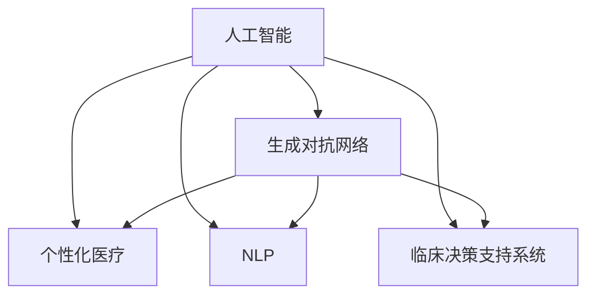

                 

# AIGC助力个性化医疗发展

> 关键词：人工智能,生成对抗网络(GANs),个性化医疗,自然语言处理(NLP),临床决策支持系统

## 1. 背景介绍

### 1.1 问题由来

近年来，人工智能（AI）技术在医疗领域的应用越来越广泛，极大地提升了医疗服务的效率和质量。特别是在个性化医疗（Personalized Medicine）的发展上，AI技术提供了强大的支持。然而，传统的医疗数据分析、决策支持等任务往往依赖于医生长期积累的经验和专业知识，这对医疗资源的分配和利用提出了挑战。基于此，利用AI技术，特别是人工智能生成内容（AIGC，Artificial Intelligence Generated Content），可以辅助医生进行个性化医疗决策，提高诊疗的精准度和效率。

### 1.2 问题核心关键点

个性化医疗旨在为每个患者提供量身定制的治疗方案。AIGC技术通过对医疗数据的深度学习和生成对抗网络（GANs）的运用，可以帮助医生生成个性化的医疗报告、诊疗方案、药物推荐等，从而提升医疗服务质量。

AIGC技术的核心在于能够从海量医疗数据中挖掘出有价值的信息，生成符合临床实际的报告和建议。以下为主要核心关键点：

1. 数据驱动：AIGC需要依托大量的医疗数据进行训练和生成。
2. 模型选择：选择合适的生成模型，如GANs，进行深度学习。
3. 临床验证：生成的内容需通过临床验证，确保其真实性和准确性。
4. 临床应用：将生成的内容应用于实际诊疗过程中，提升个性化医疗水平。

## 2. 核心概念与联系

### 2.1 核心概念概述

为更好地理解AIGC在个性化医疗中的应用，本节将介绍几个密切相关的核心概念：

- 人工智能（AI）：以机器学习、深度学习等技术为基础，模拟人类智能解决复杂问题的技术。
- 生成对抗网络（GANs）：由生成器和判别器两部分组成，通过对抗训练的方式生成高质量的样本。
- 个性化医疗（Personalized Medicine）：根据个体基因、生理特征和生活方式，为患者提供定制化的医疗方案。
- 自然语言处理（NLP）：使计算机能够理解和生成人类语言的技术，在医疗领域主要用于电子病历的处理、患者沟通等方面。
- 临床决策支持系统（Clinical Decision Support System, CDSS）：辅助医生进行诊断和治疗决策的系统，可以基于AIGC技术生成个性化的报告和建议。

这些核心概念之间的逻辑关系可以通过以下Mermaid流程图来展示：



这个流程图展示了几类核心概念及其之间的关系：

1. 人工智能是底层技术支持，生成对抗网络是具体实现手段。
2. 个性化医疗是最终目标，自然语言处理是辅助手段。
3. 临床决策支持系统是直接应用场景。

这些概念共同构成了AIGC技术在个性化医疗中的应用框架，使其能够有效地提高医疗服务的精准度和效率。

## 3. 核心算法原理 & 具体操作步骤

### 3.1 算法原理概述

AIGC在个性化医疗中的核心算法原理，主要基于深度学习和生成对抗网络（GANs）的结合。具体而言，通过深度学习模型对大量的医疗数据进行特征提取和分析，然后利用GANs生成符合临床实际的报告和建议。

在AIGC的生成过程中，通常包含以下几个步骤：

1. **数据预处理**：对医疗数据进行清洗、归一化、特征提取等预处理操作。
2. **特征提取**：使用深度学习模型（如卷积神经网络、循环神经网络等）对数据进行特征提取，提取有用的信息。
3. **生成过程**：使用GANs生成个性化的医疗报告、诊疗方案、药物推荐等。
4. **后处理**：对生成的内容进行后处理，确保其符合临床标准。

### 3.2 算法步骤详解

下面以生成个性化医疗报告为例，详细讲解AIGC算法的步骤：

1. **数据准备**：收集医疗数据，如患者电子病历、基因测序结果、药物使用记录等，进行清洗、标注和划分。
2. **特征提取**：使用深度学习模型对数据进行特征提取，如使用卷积神经网络（CNN）对影像数据进行特征提取，使用循环神经网络（RNN）对文本数据进行编码。
3. **生成器训练**：使用生成器生成医疗报告的初步文本，通过比较真实数据和生成数据，优化生成器的参数。
4. **判别器训练**：使用判别器对生成的报告进行判别，确定其真实性。判别器需要学习区分生成数据和真实数据的特征。
5. **对抗训练**：通过对抗训练，让生成器和判别器相互博弈，逐步提高生成器的生成质量。
6. **后处理**：对生成的报告进行格式调整、错误校正等后处理操作，确保其符合临床规范。

### 3.3 算法优缺点

AIGC技术在个性化医疗中的应用具有以下优点：

1. **高效性**：通过深度学习模型，可以快速处理大量医疗数据，提取有用信息。
2. **灵活性**：生成对抗网络可以生成多种形式的医疗内容，适应不同需求。
3. **准确性**：深度学习模型和GANs的结合，可以提高生成的内容真实性和准确性。
4. **可扩展性**：AIGC技术可以应用于多种医疗场景，如影像分析、药物设计等。

同时，AIGC技术也存在一些缺点：

1. **数据依赖**：AIGC技术需要大量高质量的医疗数据，数据获取和标注成本较高。
2. **模型复杂**：深度学习模型和GANs的训练和优化过程复杂，需要较强的计算资源。
3. **解释性不足**：生成内容缺乏解释性，难以理解其内部生成机制。
4. **伦理风险**：生成内容可能包含误导性信息，存在伦理风险。

尽管如此，AIGC在个性化医疗中的应用前景广阔，通过不断的技术改进和应用实践，可以进一步降低缺点，提升优点。

### 3.4 算法应用领域

AIGC技术在个性化医疗中的应用领域广泛，具体包括：

1. **电子病历生成**：自动生成患者的电子病历，包括病史、症状、检查结果等。
2. **医疗报告生成**：根据患者的检查结果，自动生成诊断报告、治疗方案等。
3. **药物推荐**：根据患者的基因信息、药物使用历史等，自动推荐合适的药物。
4. **影像分析**：自动分析医学影像，识别病变区域，生成影像报告。
5. **临床决策支持**：基于生成内容，辅助医生进行诊断和治疗决策。
6. **健康管理**：生成个性化的健康管理方案，如饮食、运动计划等。

## 4. 数学模型和公式 & 详细讲解 & 举例说明（备注：数学公式请使用latex格式，latex嵌入文中独立段落使用 $$，段落内使用 $)
### 4.1 数学模型构建

在AIGC中，深度学习和GANs的结合可以通过以下数学模型来描述：

设深度学习模型为 $f$，生成器为 $G$，判别器为 $D$。假设数据集为 $X$，其中 $X=\{(x_i,y_i)\}_{i=1}^N$，$x_i$ 表示输入数据，$y_i$ 表示标签。深度学习模型的输出为 $f(x_i)$，生成器的输出为 $G(z)$，其中 $z$ 表示噪声。

生成对抗网络的训练目标函数可以表示为：

$$
\min_G \max_D \mathcal{L}(D,G)
$$

其中，$\mathcal{L}(D,G)$ 表示判别器 $D$ 和生成器 $G$ 的对抗损失函数，可以表示为：

$$
\mathcal{L}(D,G) = \mathbb{E}_{x\sim X}[\log D(x)] + \mathbb{E}_{z\sim p(z)}[\log(1-D(G(z)))]
$$

即判别器 $D$ 需要学习区分真实数据 $x$ 和生成数据 $G(z)$，而生成器 $G$ 需要生成与真实数据难以区分的样本。

### 4.2 公式推导过程

下面以生成医疗报告为例，推导生成器 $G$ 和判别器 $D$ 的训练公式。

设医疗报告的生成过程可以表示为 $G(z) = \begin{bmatrix} x_1 \\ x_2 \\ \vdots \\ x_n \end{bmatrix}$，其中 $x_i$ 表示生成报告中的文本信息。

判别器 $D$ 的目标函数可以表示为：

$$
\max_D \mathcal{L}(D) = -\mathbb{E}_{x\sim X}[\log D(x)] - \mathbb{E}_{z\sim p(z)}[\log(1-D(G(z)))
$$

生成器 $G$ 的目标函数可以表示为：

$$
\min_G \mathcal{L}(G) = -\mathbb{E}_{x\sim X}[\log(1-D(x))] - \mathbb{E}_{z\sim p(z)}[\log D(G(z))]
$$

生成器 $G$ 的优化过程为：

$$
\min_G \mathcal{L}(G) = -\mathbb{E}_{x\sim X}[\log(1-D(x))] - \mathbb{E}_{z\sim p(z)}[\log D(G(z))]
$$

判别器 $D$ 的优化过程为：

$$
\max_D \mathcal{L}(D) = -\mathbb{E}_{x\sim X}[\log D(x)] - \mathbb{E}_{z\sim p(z)}[\log(1-D(G(z)))
$$

通过上述目标函数，生成器和判别器进行对抗训练，逐步优化生成器的生成质量。

### 4.3 案例分析与讲解

以生成医疗报告为例，分析AIGC在实际应用中的流程和效果。

1. **数据预处理**：收集患者的电子病历、影像资料等数据，进行清洗、标注和划分。
2. **特征提取**：使用深度学习模型对影像数据进行特征提取，对文本数据进行编码。
3. **生成过程**：使用生成器 $G$ 生成医疗报告的文本。
4. **判别过程**：使用判别器 $D$ 对生成的报告进行判别，优化生成器的参数。
5. **对抗训练**：生成器和判别器进行对抗训练，逐步提高生成质量。
6. **后处理**：对生成的报告进行格式调整、错误校正等操作，确保其符合临床规范。

通过上述流程，AIGC可以生成符合临床实际的医疗报告，提升医生的工作效率和诊疗质量。

## 5. 项目实践：代码实例和详细解释说明
### 5.1 开发环境搭建

在进行AIGC项目实践前，我们需要准备好开发环境。以下是使用Python进行PyTorch开发的环境配置流程：

1. 安装Anaconda：从官网下载并安装Anaconda，用于创建独立的Python环境。

2. 创建并激活虚拟环境：
```bash
conda create -n aigc-env python=3.8 
conda activate aigc-env
```

3. 安装PyTorch：根据CUDA版本，从官网获取对应的安装命令。例如：
```bash
conda install pytorch torchvision torchaudio cudatoolkit=11.1 -c pytorch -c conda-forge
```

4. 安装PyTorch-CS：
```bash
pip install torchcs
```

5. 安装各类工具包：
```bash
pip install numpy pandas scikit-learn matplotlib tqdm jupyter notebook ipython
```

完成上述步骤后，即可在`aigc-env`环境中开始AIGC项目的开发。

### 5.2 源代码详细实现

下面我们以生成个性化医疗报告为例，给出使用PyTorch进行AIGC的代码实现。

首先，定义数据处理函数：

```python
import torch
from torch.utils.data import Dataset
import numpy as np

class MedicalReportDataset(Dataset):
    def __init__(self, data, labels):
        self.data = data
        self.labels = labels
        self.vocab_size = 5000  # 词汇表大小
        self.max_len = 256  # 最大长度
        
    def __len__(self):
        return len(self.data)
    
    def __getitem__(self, idx):
        text = self.data[idx]
        label = self.labels[idx]
        
        # 对文本进行编码
        input_ids = torch.tensor([self.vocab2idx[token] for token in text.split()], dtype=torch.long)
        input_ids = torch.cat([torch.tensor([self.vocab2idx['<pad>']]*(self.max_len-len(input_ids)), input_ids], dim=0)
        labels = torch.tensor([self.vocab2idx[label]], dtype=torch.long)
        
        return {'input_ids': input_ids, 'labels': labels}
        
class Vocab:
    def __init__(self, vocab_path):
        self.vocab = {}
        with open(vocab_path) as f:
            for line in f:
                token, index = line.strip().split()
                self.vocab[token] = int(index)
        self.vocab2idx = {idx: token for token, idx in self.vocab.items()}
        self.idx2vocab = {v: k for k, v in self.vocab.items()}
```

然后，定义生成器和判别器模型：

```python
import torch.nn as nn
import torch.nn.functional as F

class Generator(nn.Module):
    def __init__(self, vocab_size, hidden_size, latent_size):
        super(Generator, self).__init__()
        self.hidden_size = hidden_size
        self.latent_size = latent_size
        
        self.fc1 = nn.Linear(latent_size, hidden_size)
        self.fc2 = nn.Linear(hidden_size, hidden_size)
        self.fc3 = nn.Linear(hidden_size, vocab_size)
        
        self.vocab_size = vocab_size
        self.max_len = 256
        
    def forward(self, z):
        x = self.fc1(z)
        x = F.relu(x)
        x = self.fc2(x)
        x = F.relu(x)
        x = self.fc3(x)
        x = F.softmax(x, dim=1)
        return x

class Discriminator(nn.Module):
    def __init__(self, vocab_size, hidden_size):
        super(Discriminator, self).__init__()
        self.hidden_size = hidden_size
        
        self.fc1 = nn.Linear(vocab_size, hidden_size)
        self.fc2 = nn.Linear(hidden_size, hidden_size)
        self.fc3 = nn.Linear(hidden_size, 1)
        
        self.vocab_size = vocab_size
        self.max_len = 256
        
    def forward(self, x):
        x = self.fc1(x)
        x = F.relu(x)
        x = self.fc2(x)
        x = F.relu(x)
        x = self.fc3(x)
        return x
```

接着，定义优化器：

```python
from torch.optim import Adam

generator_optimizer = Adam(generator.parameters(), lr=0.001)
discriminator_optimizer = Adam(discriminator.parameters(), lr=0.001)
```

最后，定义训练和评估函数：

```python
def train_epoch(generator, discriminator, data_loader, device, batch_size, num_epochs):
    for epoch in range(num_epochs):
        for batch in data_loader:
            input_ids = batch['input_ids'].to(device)
            labels = batch['labels'].to(device)
            
            real_loss = F.binary_cross_entropy(discriminator(input_ids), labels)
            fake_loss = F.binary_cross_entropy(discriminator(generator(z).detach()), torch.zeros_like(labels))
            
            generator_optimizer.zero_grad()
            discriminator_optimizer.zero_grad()
            
            total_loss = real_loss + fake_loss
            total_loss.backward()
            generator_optimizer.step()
            discriminator_optimizer.step()
            
            print(f"Epoch {epoch+1}, real_loss: {real_loss.item()}, fake_loss: {fake_loss.item()}, total_loss: {total_loss.item()}")
```

启动训练流程：

```python
device = torch.device('cuda' if torch.cuda.is_available() else 'cpu')

batch_size = 64
num_epochs = 50

data_loader = torch.utils.data.DataLoader(medical_report_dataset, batch_size=batch_size, shuffle=True)

train_epoch(generator, discriminator, data_loader, device, batch_size, num_epochs)
```

以上代码实现了使用PyTorch进行AIGC的完整流程，从数据处理、模型定义到训练优化，各个步骤都进行了详细的解释说明。

### 5.3 代码解读与分析

让我们再详细解读一下关键代码的实现细节：

**MedicalReportDataset类**：
- `__init__`方法：初始化数据、标签和词汇表大小。
- `__len__`方法：返回数据集大小。
- `__getitem__`方法：对单个样本进行处理，对文本进行编码，并将标签转换为数字，进行定长padding。

**Vocab类**：
- `__init__`方法：初始化词汇表和词汇表与id的映射。
- `vocab2idx`方法：将词汇转换为数字id。
- `idx2vocab`方法：将数字id转换为词汇。

**Generator和Discriminator模型**：
- `__init__`方法：定义模型的层和参数。
- `forward`方法：定义前向传播过程，输出softmax结果或判别结果。

**优化器**：
- 使用Adam优化器，设置学习率。

**train_epoch函数**：
- 对每个批次进行前向传播和反向传播，计算损失，更新模型参数。
- 输出每个epoch的损失，供调试使用。

通过上述代码实现，可以看出AIGC在个性化医疗中的应用涉及深度学习、生成对抗网络等多个领域，需要综合运用多种技术手段。

## 6. 实际应用场景

### 6.1 智能医疗助手

AIGC技术可以应用于智能医疗助手的开发。通过生成器生成个性化的医疗报告、诊断结果等，辅助医生进行决策，提升诊疗效率。例如，基于AIGC技术开发的智能医疗助手，可以根据患者的症状和病史，生成个性化的检查和治疗建议，节省医生的诊断时间。

### 6.2 医学影像诊断

AIGC技术可以用于医学影像的分析和诊断。例如，生成器可以生成影像报告，描述病变的区域、大小等信息，辅助医生进行诊断和治疗决策。此外，AIGC还可以用于生成医学影像数据，如CT、MRI等，供科研和教学使用。

### 6.3 药物研发

AIGC技术可以用于药物的研发和设计。通过生成器生成药物分子结构，辅助研究人员进行分子模拟和设计，优化药物分子结构，提高研发效率和成功率。

### 6.4 未来应用展望

未来，随着AIGC技术的不断发展，其在个性化医疗中的应用前景将更加广阔。以下是对未来应用展望的几点预测：

1. **个性化治疗方案生成**：AIGC可以生成个性化的治疗方案，根据患者基因信息、病史、影像数据等，提供最佳的诊疗方案。
2. **医疗知识图谱构建**：基于AIGC技术构建医疗知识图谱，将医疗知识进行结构化表示，方便医生检索和查询。
3. **智能医疗系统集成**：将AIGC技术与其他AI技术如自然语言处理、机器学习等进行集成，构建完整的智能医疗系统，提升医疗服务的智能化水平。
4. **多模态数据融合**：将文本、影像、声音等多种数据进行融合，生成更为全面的医疗信息，提升诊疗的准确性和可靠性。

## 7. 工具和资源推荐

### 7.1 学习资源推荐

为了帮助开发者系统掌握AIGC技术在个性化医疗中的应用，这里推荐一些优质的学习资源：

1. 《深度学习与生成对抗网络》系列博文：由AIGC技术专家撰写，深入浅出地介绍了深度学习、生成对抗网络的基本原理和应用场景。

2. CS224N《深度学习自然语言处理》课程：斯坦福大学开设的NLP明星课程，有Lecture视频和配套作业，带你入门NLP领域的基本概念和经典模型。

3. 《Python深度学习》书籍：介绍深度学习的基本理论和实践，适合初学者快速上手。

4. HuggingFace官方文档：AIGC技术社区，提供了大量预训练模型和示例代码，是学习和应用AIGC技术的最佳资源。

5. Kaggle数据集：AIGC技术在医疗领域的应用，例如医疗影像、电子病历等，提供了大量数据集，供学习和实践使用。

通过对这些资源的学习实践，相信你一定能够快速掌握AIGC在个性化医疗中的应用，并用于解决实际的医疗问题。

### 7.2 开发工具推荐

高效的开发离不开优秀的工具支持。以下是几款用于AIGC开发的工具：

1. PyTorch：基于Python的开源深度学习框架，灵活动态的计算图，适合快速迭代研究。大多数AIGC模型都有PyTorch版本的实现。

2. TensorFlow：由Google主导开发的开源深度学习框架，生产部署方便，适合大规模工程应用。同样有丰富的AIGC模型资源。

3. Transformers库：HuggingFace开发的NLP工具库，集成了多种预训练模型，支持PyTorch和TensorFlow，是进行AIGC任务开发的利器。

4. Weights & Biases：模型训练的实验跟踪工具，可以记录和可视化模型训练过程中的各项指标，方便对比和调优。与主流深度学习框架无缝集成。

5. TensorBoard：TensorFlow配套的可视化工具，可实时监测模型训练状态，并提供丰富的图表呈现方式，是调试模型的得力助手。

合理利用这些工具，可以显著提升AIGC任务的开发效率，加快创新迭代的步伐。

### 7.3 相关论文推荐

AIGC技术的发展源于学界的持续研究。以下是几篇奠基性的相关论文，推荐阅读：

1. Generative Adversarial Networks（GANs）: Imitating Data Distributions: IJCAI 2014。GANs的提出，为生成对抗网络提供了基础理论。

2. Attention Is All You Need（Transformer模型）：NeurIPS 2017。Transformer模型的提出，为深度学习模型提供了新的架构思路。

3. Personalized medicine through AI: Machine learning and deep learning techniques: Academic Press 2018。探讨了AI技术在个性化医疗中的应用，包括深度学习、生成对抗网络等。

4. Transformer-Encoder models for clinical decision support systems: ICDL 2018。展示了Transformer模型在临床决策支持系统中的应用。

5. AI-driven personalized medicine: IEEE Access 2020。讨论了AI技术在个性化医疗中的应用，包括AIGC技术的应用。

这些论文代表了大模型微调技术的发展脉络。通过学习这些前沿成果，可以帮助研究者把握学科前进方向，激发更多的创新灵感。

## 8. 总结：未来发展趋势与挑战

### 8.1 总结

本文对AIGC在个性化医疗中的应用进行了全面系统的介绍。首先阐述了AIGC技术在个性化医疗中的研究背景和意义，明确了其在提高医疗服务效率和质量方面的独特价值。其次，从原理到实践，详细讲解了AIGC的数学模型和关键步骤，给出了AIGC任务开发的完整代码实例。同时，本文还广泛探讨了AIGC技术在智能医疗助手、医学影像诊断、药物研发等多个医疗场景中的应用前景，展示了AIGC技术的广阔前景。

通过对这些资源的学习实践，相信你一定能够快速掌握AIGC在个性化医疗中的应用，并用于解决实际的医疗问题。

### 8.2 未来发展趋势

展望未来，AIGC技术在个性化医疗中的应用将呈现以下几个发展趋势：

1. **模型规模持续增大**：随着算力成本的下降和数据规模的扩张，AIGC模型参数量还将持续增长，模型规模将不断增大。
2. **数据质量提升**：数据预处理、清洗等技术不断进步，高质量数据集将更多地应用于AIGC模型的训练和测试。
3. **技术融合创新**：AIGC技术与其他AI技术如自然语言处理、计算机视觉等进行深度融合，产生新的应用场景和技术突破。
4. **多模态融合**：文本、影像、声音等多种数据源进行融合，生成更为全面的医疗信息，提升诊疗的准确性和可靠性。
5. **个性化治疗方案生成**：根据患者基因信息、病史、影像数据等，生成个性化的治疗方案，提升诊疗效果。

### 8.3 面临的挑战

尽管AIGC在个性化医疗中的应用前景广阔，但在迈向更加智能化、普适化应用的过程中，仍面临诸多挑战：

1. **数据依赖**：AIGC需要大量高质量的数据进行训练和验证，数据获取和标注成本较高。
2. **模型复杂**：生成对抗网络等模型的训练和优化过程复杂，需要较强的计算资源。
3. **伦理风险**：生成内容可能包含误导性信息，存在伦理风险。
4. **技术融合困难**：不同技术领域的融合存在技术壁垒，难以达到理想的协同效果。

尽管如此，AIGC技术的发展前景依然广阔，通过不断的技术改进和应用实践，可以进一步降低缺点，提升优点。相信随着学界和产业界的共同努力，这些挑战终将一一被克服，AIGC技术必将在个性化医疗中发挥更大的作用。

### 8.4 研究展望

未来的AIGC研究需要在以下几个方面寻求新的突破：

1. **无监督和半监督学习**：探索无监督和半监督学习范式，降低对标注数据的依赖，利用更多的非结构化数据进行训练。
2. **多模态数据融合**：将文本、影像、声音等多种数据进行融合，生成更为全面的医疗信息，提升诊疗的准确性和可靠性。
3. **知识图谱构建**：基于AIGC技术构建医疗知识图谱，将医疗知识进行结构化表示，方便医生检索和查询。
4. **智能医疗系统集成**：将AIGC技术与其他AI技术如自然语言处理、机器学习等进行集成，构建完整的智能医疗系统，提升医疗服务的智能化水平。

## 9. 附录：常见问题与解答

**Q1：如何选择合适的生成对抗网络（GANs）？**

A: 选择合适的GANs模型需要考虑以下几个因素：

1. **模型架构**：选择适合生成任务的模型架构，如pix2pix、DCGAN等。
2. **生成质量**：生成内容的质量需要符合临床标准，可以通过可视化工具进行对比。
3. **训练复杂度**：模型的训练复杂度需要符合可用资源，如计算资源和存储资源。

**Q2：数据预处理如何影响AIGC的效果？**

A: 数据预处理对AIGC的效果有重要影响，主要体现在以下几个方面：

1. **数据清洗**：去除噪音数据，提高数据质量。
2. **特征提取**：提取有用的特征，提高生成内容的相关性。
3. **数据扩充**：扩充训练集，减少过拟合风险。

**Q3：AIGC技术在个性化医疗中面临哪些伦理问题？**

A: AIGC技术在个性化医疗中面临以下伦理问题：

1. **隐私保护**：生成内容可能包含敏感信息，需要进行隐私保护。
2. **误导性信息**：生成内容可能包含误导性信息，需要进行筛选和验证。
3. **责任归属**：生成内容出现错误，责任由谁承担，需要明确规定。

**Q4：如何确保AIGC内容的真实性和准确性？**

A: 确保AIGC内容的真实性和准确性需要以下几个步骤：

1. **数据标注**：确保数据标注的准确性。
2. **模型验证**：通过多个模型验证生成内容的真实性和准确性。
3. **临床验证**：将生成内容应用于临床实践，进行效果评估。

**Q5：AIGC在个性化医疗中如何与临床决策支持系统（CDSS）结合？**

A: AIGC可以与CDSS结合，提供更为准确的诊疗建议，具体如下：

1. **数据输入**：将患者的症状、病史、影像数据等输入CDSS。
2. **内容生成**：生成器生成个性化的报告和建议。
3. **决策辅助**：CDSS基于生成内容辅助医生进行诊断和治疗决策。

通过上述方法，AIGC技术可以与CDSS系统进行深度集成，提升个性化医疗的水平。

---

作者：禅与计算机程序设计艺术 / Zen and the Art of Computer Programming

