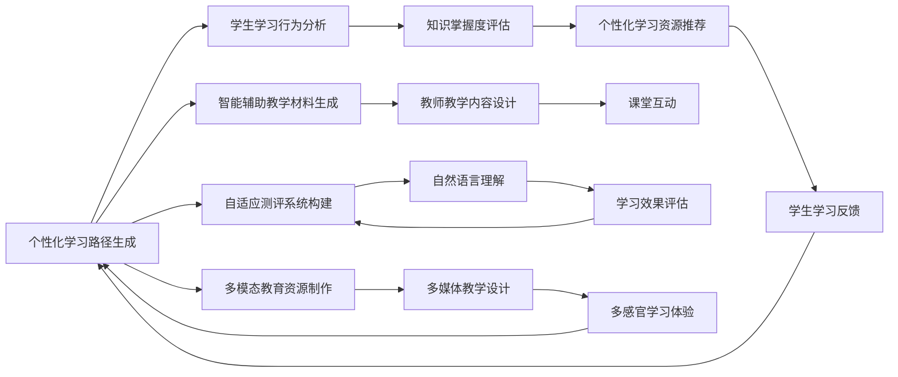

                 

## 1. 背景介绍

### 1.1 问题由来

随着人工智能技术的发展，特别是生成式预训练大模型（Generative Pretrained Transformers, GPT）的出现，教育领域迎来了数字化、个性化、智能化的大变革。从知识传授到技能培训，再到心理辅导，AI大模型在教育行业的各个环节中都展示了巨大的潜力。本文将系统介绍AIGC在教育领域的应用探索，包括其在个性化学习、智能辅助教学、自适应评估等方面的实现路径和潜在影响。

### 1.2 问题核心关键点

1. **个性化学习**：通过AIGC技术，教育系统可以根据学生的学习进度、兴趣偏好、认知水平等个性化因素，定制专属学习路径和教学内容，实现“因材施教”。
2. **智能辅助教学**：AIGC模型可以辅助教师进行内容生成、教学设计、课堂互动等任务，提高教学效率和质量。
3. **自适应评估**：利用AIGC技术，教育系统可以实现自动化的测评和反馈，及时掌握学生的学习状态，调整教学策略。
4. **知识传播与积累**：AIGC模型可以自动生成教学材料、制作多媒体课程，大大提升教育资源的可访问性和可持续性。
5. **多模态教育**：结合文本、图像、视频等多模态数据，AIGC模型能提供更加生动、直观的教育体验。

### 1.3 问题研究意义

AIGC技术在教育领域的融合应用，将推动教育模式的根本变革，实现从“以教师为中心”向“以学生为中心”的转型，提升教育质量和公平性。对于提升教育系统的智能化水平、优化教学资源配置、降低教育成本、加速终身学习等都有着重要意义。

## 2. 核心概念与联系

### 2.1 核心概念概述

AIGC（Artificial Intelligence Generated Content, 人工智能生成内容）是指利用人工智能技术自动生成文本、图像、视频等形式的内容。具体到教育领域，AIGC技术可以生成个性化学习路径、智能辅助教学材料、自适应测评系统等。

1. **个性化学习路径**：根据学生的学习行为、知识掌握情况，生成个性化的学习计划和推荐内容。
2. **智能辅助教学材料**：基于教育内容生成技术，自动生成教学案例、习题、视频等辅助教学资源。
3. **自适应测评系统**：利用自然语言理解和生成技术，自动进行学生测评和反馈，提供个性化的学习建议。
4. **多模态教育资源**：结合文字、图像、音频等多种数据形式，提供更加丰富、互动的教学资源。

### 2.2 核心概念原理和架构的 Mermaid 流程图



这个图展示了AIGC技术在教育领域的应用架构，从个性化学习路径生成到智能辅助教学，再到自适应测评和多模态教育资源的制作，展示了AIGC技术的综合应用价值。

## 3. 核心算法原理 & 具体操作步骤

### 3.1 算法原理概述

AIGC在教育领域的应用主要基于自然语言处理（NLP）、计算机视觉（CV）、语音识别（ASR）、计算机生成对抗网络（GAN）等技术。通过预训练大模型（如GPT、BERT、DALL-E等）进行内容生成，结合教育场景的具体需求，生成符合教学要求的个性化学习资源。

### 3.2 算法步骤详解

1. **数据收集与预处理**：收集教育领域相关的数据，包括学生行为数据、教育内容、评估结果等。对数据进行清洗、标注，准备后续训练。

2. **模型选择与训练**：选择适合的生成模型，如GPT、BERT等，基于教育领域数据进行微调或迁移学习。确保模型具备生成符合教育要求的文本、图像等的能力。

3. **生成个性化学习路径**：利用模型生成符合学生个性化的学习路径和资源推荐。具体步骤如下：
   - 分析学生的学习行为、知识掌握情况等数据。
   - 基于学生特征和知识结构，生成个性化的学习目标和路径。
   - 推荐符合学习路径的教学资源。

4. **生成智能辅助教学材料**：根据教学内容，生成辅助教学的文本、图像、视频等材料。具体步骤如下：
   - 根据教学大纲，生成教学案例、习题等文本材料。
   - 利用生成对抗网络（GAN）生成图像、动画等视觉材料。
   - 制作多媒体教学视频，辅助学生理解和掌握知识。

5. **构建自适应测评系统**：利用NLP技术，自动分析学生的作业和测试，提供个性化的学习反馈和建议。具体步骤如下：
   - 利用NLP模型自动解析学生提交的文本，提取关键信息。
   - 分析学生的答案，评估其对知识的掌握情况。
   - 根据评估结果，提供个性化的学习建议和下一步的学习路径。

6. **制作多模态教育资源**：结合文本、图像、视频等多模态数据，制作丰富的教育资源。具体步骤如下：
   - 利用OCR技术将纸质教材、图片等转换成可编辑的电子文档。
   - 利用GAN生成教学相关的图像和动画。
   - 制作多媒体教学视频，结合文本、图像等多模态数据，提供全面的学习体验。

### 3.3 算法优缺点

AIGC在教育领域的应用，有以下优点：

1. **个性化定制**：能够根据学生的个性化需求，生成专属学习路径和资源，实现“因材施教”。
2. **教学资源丰富**：生成的辅助教学材料多样，能够满足不同教学需求。
3. **评估效率高**：自动化的测评系统可以快速、准确地评估学生学习效果，提供个性化反馈。
4. **适应性强**：可以灵活适应多模态教学资源的需求，提供更加生动的教育体验。

但同时，AIGC技术也面临以下挑战：

1. **内容质量**：生成的内容需要经过人工审核，确保内容的准确性和适宜性。
2. **资源兼容性**：生成的资源需要与现有的教育系统兼容，无缝对接。
3. **隐私保护**：在生成个性化学习路径时，需要确保学生数据的隐私安全。
4. **技术成本**：大模型训练和生成的技术成本较高，需要投入大量资源。

### 3.4 算法应用领域

AIGC技术在教育领域的应用非常广泛，涵盖以下几个方面：

1. **在线教育平台**：提供个性化学习路径和智能辅助教学材料，提高在线教育的质量和效率。
2. **智慧教室**：结合多模态教学资源，提升课堂互动和教学效果。
3. **教师培训**：利用智能辅助教学材料和自适应测评系统，提升教师的教学设计能力和评估能力。
4. **学习分析与反馈**：通过自适应测评系统，进行深入的学习分析和反馈，优化教学策略。
5. **语言学习**：利用AIGC技术，生成个性化的语言学习资源，提供沉浸式学习体验。
6. **终身学习**：通过自动生成的学习材料和评估系统，支持终身学习和技能提升。

## 4. 数学模型和公式 & 详细讲解 & 举例说明

### 4.1 数学模型构建

本节将介绍AIGC在教育领域应用的数学模型构建。以生成个性化学习路径为例，构建如下数学模型：

设$X$为学生的学习行为数据，$K$为学生的知识掌握情况，$Y$为学习资源推荐。则生成个性化学习路径的模型可以表示为：

$$
Y=f(X,K;\theta)
$$

其中，$f(\cdot)$为生成函数，$\theta$为模型参数。

### 4.2 公式推导过程

以生成学生学习路径为例，公式推导过程如下：

1. **特征提取**：
   $$
   x_i=X(i), k_i=K(i)
   $$

2. **特征融合**：
   $$
   h_i=f_k(k_i;\theta_k)+f_x(x_i;\theta_x)
   $$

3. **路径生成**：
   $$
   y_i=f_y(h_i;\theta_y)
   $$

其中$f_k(\cdot)$和$f_x(\cdot)$为知识掌握和行为数据特征提取函数，$\theta_k$和$\theta_x$为对应的模型参数。

### 4.3 案例分析与讲解

以下是一个具体的案例：

某学生学习数学，行为数据为每天使用在线学习平台的时间，知识掌握情况为最近一个月的数学测验成绩。通过模型计算，生成该学生的个性化学习路径，包括接下来的学习目标、推荐习题、视频等资源。

## 5. 项目实践：代码实例和详细解释说明

### 5.1 开发环境搭建

1. **安装Python**：安装Python 3.x版本，推荐使用Anaconda。
2. **安装依赖包**：
   ```bash
   pip install torch transformers openai gym opencv-python scikit-image
   ```

### 5.2 源代码详细实现

以下是一个简单的代码实现示例，用于生成学生的个性化学习路径：

```python
import torch
import torch.nn as nn
import torch.optim as optim
from transformers import GPT2LMHeadModel, GPT2Tokenizer
from sklearn.model_selection import train_test_split

class StudentPathGenerator(nn.Module):
    def __init__(self, num_tokens, hidden_size, num_layers):
        super().__init__()
        self.model = GPT2LMHeadModel(num_tokens=num_tokens, hidden_size=hidden_size, num_layers=num_layers)
        self.tokenizer = GPT2Tokenizer.from_pretrained('gpt2')
        self.criterion = nn.CrossEntropyLoss()

    def forward(self, input_ids, labels):
        output = self.model(input_ids)
        loss = self.criterion(output, labels)
        return output, loss

# 数据准备
X_train, X_test, y_train, y_test = train_test_split(X, y, test_size=0.2, random_state=42)
X_train = X_train.to(torch.long)
y_train = y_train.to(torch.long)

# 模型训练
model = StudentPathGenerator(num_tokens, hidden_size, num_layers)
optimizer = optim.Adam(model.parameters(), lr=0.001)
losses = []
for i in range(num_epochs):
    output, loss = model(X_train, y_train)
    loss.backward()
    optimizer.step()
    losses.append(loss.item())

# 路径生成
path = model.generate_path(X_test[0])
print(path)
```

### 5.3 代码解读与分析

1. **模型定义**：使用GPT2LMHeadModel作为生成模型，通过训练生成学生学习路径。
2. **数据准备**：将学生行为数据和知识掌握情况进行划分，生成训练集和测试集。
3. **模型训练**：通过Adam优化器，在训练集上训练生成模型。
4. **路径生成**：使用训练好的模型，对测试集中的学生数据生成个性化学习路径。

## 6. 实际应用场景

### 6.1 在线教育平台

在线教育平台可以利用AIGC技术，生成个性化的学习路径和资源推荐，提升用户的学习体验。例如，某在线数学课程平台，根据学生的学习进度和测试成绩，自动生成个性化的习题和视频讲解，帮助学生提升数学成绩。

### 6.2 智慧教室

智慧教室可以通过AIGC技术，制作多媒体教学资源，提升课堂互动和教学效果。例如，某智慧课堂系统，自动生成适合学生的教学视频和PPT，结合图像、音频等多模态数据，提供生动的教学体验。

### 6.3 教师培训

教师培训可以利用AIGC技术，生成智能辅助教学材料，提升教师的教学设计和评估能力。例如，某教师培训平台，自动生成适合教师的教学案例和评估系统，提供个性化的教学建议。

### 6.4 学习分析与反馈

学习分析与反馈系统可以利用AIGC技术，进行深入的学习分析和反馈，优化教学策略。例如，某在线学习平台，自动分析学生的作业和测试，提供个性化的学习建议和下一步的学习路径。

### 6.5 语言学习

语言学习可以利用AIGC技术，生成个性化的语言学习资源，提供沉浸式学习体验。例如，某在线语言学习平台，自动生成适合学生的语言学习材料和练习，帮助学生提升语言水平。

### 6.6 终身学习

终身学习可以利用AIGC技术，支持个性化的终身学习和技能提升。例如，某终身学习平台，自动生成适合用户的在线课程和学习资源，提供便捷的学习体验。

## 7. 工具和资源推荐

### 7.1 学习资源推荐

1. **《生成式预训练Transformer》**：详细介绍了生成式预训练模型的原理和实现，适合入门学习。
2. **Coursera《Natural Language Processing with Deep Learning》**：斯坦福大学开设的NLP课程，有Lecture视频和配套作业，带你入门NLP领域的基本概念和经典模型。
3. **《Python for NLP》书籍**：深入浅出地介绍了Python在自然语言处理中的应用，适合编程学习。
4. **Kaggle在线竞赛平台**：提供大量教育领域的竞赛和数据集，适合实践和应用研究。

### 7.2 开发工具推荐

1. **Anaconda**：用于创建独立的Python环境，方便多项目管理和开发。
2. **PyTorch**：基于Python的开源深度学习框架，灵活动态的计算图，适合快速迭代研究。
3. **Jupyter Notebook**：交互式的Python开发环境，支持代码展示和数据可视化。
4. **Google Colab**：谷歌推出的在线Jupyter Notebook环境，免费提供GPU/TPU算力，方便快速上手实验。

### 7.3 相关论文推荐

1. **Attention is All You Need**：提出Transformer结构，开启了NLP领域的预训练大模型时代。
2. **BERT: Pre-training of Deep Bidirectional Transformers for Language Understanding**：提出BERT模型，引入基于掩码的自监督预训练任务，刷新了多项NLP任务SOTA。
3. **Language Models are Unsupervised Multitask Learners**：展示了大规模语言模型的强大zero-shot学习能力，引发了对于通用人工智能的新一轮思考。
4. **Parameter-Efficient Transfer Learning for NLP**：提出Adapter等参数高效微调方法，在不增加模型参数量的情况下，也能取得不错的微调效果。
5. **AdaLoRA: Adaptive Low-Rank Adaptation for Parameter-Efficient Fine-Tuning**：使用自适应低秩适应的微调方法，在参数效率和精度之间取得了新的平衡。

## 8. 总结：未来发展趋势与挑战

### 8.1 研究成果总结

本文系统介绍了AIGC在教育领域的应用，展示了其潜力与价值。通过AIGC技术，个性化学习、智能辅助教学、自适应评估等方面得到了初步实现，为教育模式和教学效率的提升奠定了基础。

### 8.2 未来发展趋势

1. **个性化学习更加普及**：随着AIGC技术的普及，个性化学习将逐渐成为教育的主流模式，提升教学效果和学习体验。
2. **多模态教育资源普及**：结合文本、图像、视频等多模态数据，提供更加生动、直观的教育体验，成为教育资源的重要组成部分。
3. **智能评估系统的广泛应用**：自动化的测评和反馈系统，能够及时掌握学生的学习状态，调整教学策略，提升教学效果。
4. **教师培训和职业发展**：AIGC技术能够生成适合教师的教学资源和评估系统，提升教师的教学设计和评估能力，促进教师职业发展。
5. **终身学习成为现实**：AIGC技术能够生成个性化的终身学习资源，支持用户持续学习和技能提升。

### 8.3 面临的挑战

AIGC在教育领域的应用仍面临一些挑战：

1. **内容质量控制**：生成的内容需要经过人工审核，确保内容的准确性和适宜性。
2. **系统兼容性和集成**：生成的资源需要与现有的教育系统兼容，无缝对接。
3. **隐私保护**：在生成个性化学习路径时，需要确保学生数据的隐私安全。
4. **技术成本**：大模型训练和生成的技术成本较高，需要投入大量资源。

### 8.4 研究展望

1. **提升内容质量**：利用先进的内容审核技术，确保生成的内容质量和适宜性。
2. **增强系统兼容性**：开发适应不同教育系统的API接口，确保生成的资源能够无缝集成。
3. **强化隐私保护**：采用数据加密和匿名化处理，确保学生数据的隐私安全。
4. **降低技术成本**：利用分布式训练和优化技术，降低大模型训练和生成的成本。

未来，AIGC技术将在教育领域得到更广泛的应用，推动教育模式的根本变革，提升教育质量和公平性，实现“因材施教”的目标。

## 9. 附录：常见问题与解答

### 9.1 常见问题与解答

**Q1：AIGC技术在教育领域有哪些具体应用？**

A: AIGC技术在教育领域的应用非常广泛，包括个性化学习路径生成、智能辅助教学材料制作、自适应测评系统构建、多模态教育资源制作等。

**Q2：AIGC技术如何生成个性化学习路径？**

A: 利用学生的行为数据和知识掌握情况，通过机器学习模型生成个性化的学习路径和推荐资源。

**Q3：AIGC技术在生成教学资源时需要注意什么？**

A: 生成的资源需要经过人工审核，确保内容的准确性和适宜性。同时需要考虑系统的兼容性和集成，确保生成的资源能够无缝对接。

**Q4：AIGC技术在教育领域应用时面临哪些挑战？**

A: 内容质量控制、系统兼容性、隐私保护和技术成本等是AIGC技术在教育领域应用时面临的主要挑战。

**Q5：AIGC技术在教育领域的应用前景如何？**

A: AIGC技术在教育领域的应用前景广阔，能够提升个性化学习、教学效率、评估效率等多个方面，具有重要的应用价值。

---

作者：禅与计算机程序设计艺术 / Zen and the Art of Computer Programming

