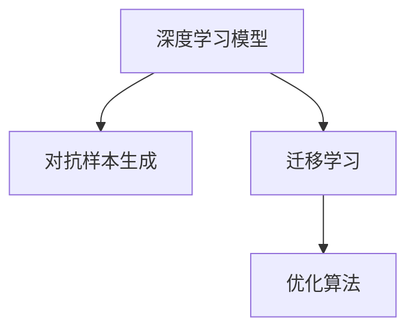
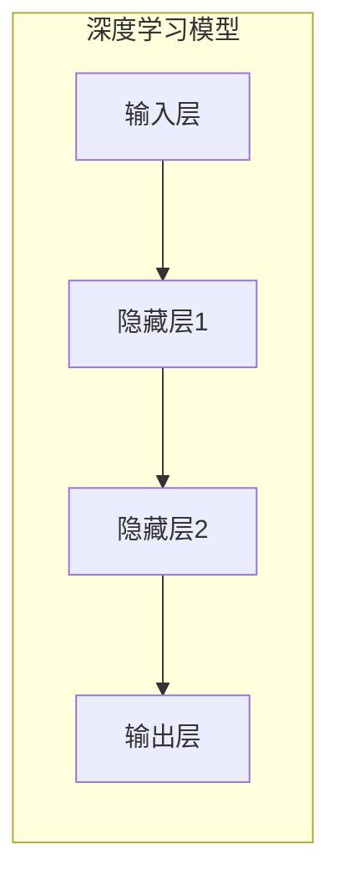
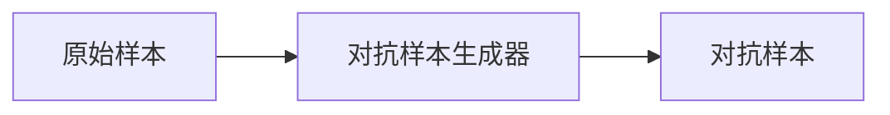
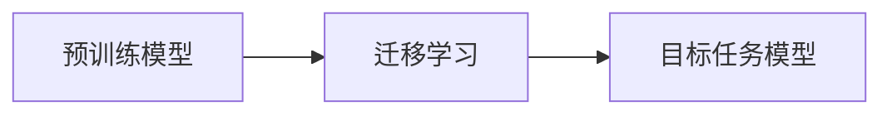
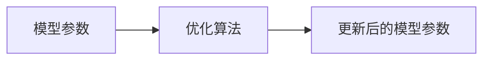
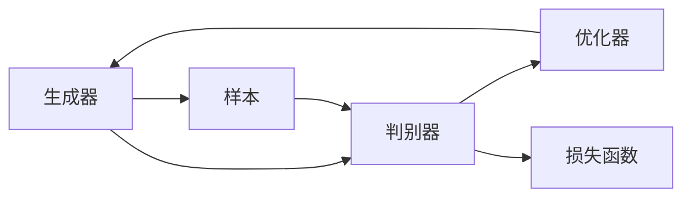
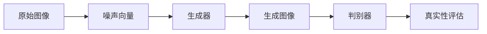

                 

# AIGC技术赋能传统行业转型

在当今数字化转型浪潮下，人工智能（AI）和生成对抗网络（GANs）等生成式AI（AIGC）技术，正在以全新的方式赋能各行各业，促进产业升级与创新发展。本文将深入探讨AIGC技术的工作原理、核心算法与操作步骤，并分析其在多个传统行业中的应用场景与未来展望。

## 1. 背景介绍

### 1.1 问题由来

随着科技的飞速发展，人工智能和生成对抗网络等生成式AI技术逐渐成熟，并在各领域得到了广泛应用。AIGC技术通过深度学习模型的自动生成能力，能够高效地处理图像、文本、音频等多种形式的数据，为传统行业提供了强大的创新动力。然而，由于AIGC技术涉及的算法复杂，部署和应用成本较高，如何在传统行业有效落地仍是一个难题。本文旨在通过详细剖析AIGC技术的核心概念与原理，以及其在不同行业中的实践经验，为传统行业转型提供实用指南。

### 1.2 问题核心关键点

AIGC技术的主要核心在于其生成式模型，能够根据输入的数据，生成与输入内容相似但不完全相同的新数据。这主要依赖于以下技术：

- **深度学习模型**：用于构建生成式模型，并从数据中学习生成规则。
- **对抗样本生成**：利用对抗训练方法，生成能够误导模型的样本。
- **迁移学习**：将在大规模数据上训练得到的模型迁移到特定任务中，以提升性能。
- **优化算法**：如Adam、SGD等，用于模型参数的优化。

这些关键技术通过协同工作，使AIGC技术具备了强大的生成能力，可以应用于图像生成、文本创作、语音合成等多个领域。

## 2. 核心概念与联系

### 2.1 核心概念概述

- **深度学习模型**：以神经网络为基础的模型，能够自动从数据中学习特征表示，实现数据生成。
- **对抗样本生成**：生成能够误导模型预测结果的样本，提升模型的鲁棒性。
- **迁移学习**：将预训练模型的知识迁移到目标任务中，以减少训练时间和数据需求。
- **优化算法**：用于更新模型参数，使其更好地适应目标任务。

这些概念构成了AIGC技术的基础框架，下面通过一个Mermaid流程图来展示它们之间的联系：



### 2.2 核心概念原理

**深度学习模型**：
深度学习模型由多层神经网络构成，通过反向传播算法更新模型参数，使得模型能够学习数据的特征表示。模型的结构如图：



**对抗样本生成**：
对抗样本生成是指通过添加微小的扰动，生成对模型预测结果有影响的样本。这通常通过优化对抗损失函数来实现。如：



**迁移学习**：
迁移学习是将在大规模数据上训练得到的模型，迁移到目标任务中，以减少训练时间和数据需求。如图：



**优化算法**：
优化算法用于更新模型参数，使得模型在目标任务上表现更好。如图：



这些核心概念共同构成了AIGC技术的工作基础，通过对这些技术的深入理解，可以更好地应用AIGC技术，提升产业效率与创新能力。

## 3. 核心算法原理 & 具体操作步骤

### 3.1 算法原理概述

AIGC技术通常采用生成对抗网络（GANs）作为核心算法，其基本思路是通过两个神经网络（生成器和判别器）的对抗训练，学习生成与真实数据相似但不同的样本。GANs主要由以下组成：

1. **生成器**：用于生成样本，目标是最小化生成样本与真实样本的差异。
2. **判别器**：用于判断样本的真实性，目标是最大化区分真实样本与生成样本。

GANs的训练过程如图：



### 3.2 算法步骤详解

**步骤一：准备数据集**

AIGC技术首先依赖于高质量的数据集。数据集应包含真实样本与伪造样本，以便生成器与判别器进行对抗训练。

**步骤二：搭建网络模型**

搭建生成器和判别器的神经网络模型。生成器通常采用全连接神经网络，判别器采用卷积神经网络。

**步骤三：训练模型**

通过交替优化生成器和判别器的参数，使生成器能够生成逼真的样本，而判别器能够准确区分真实样本与生成样本。

**步骤四：评估模型**

评估生成器的生成质量，可通过检查生成的样本与真实样本的差异，或使用样本生成的真实性检测工具。

**步骤五：应用模型**

将训练好的生成器应用于实际问题，如图像生成、文本创作等。

### 3.3 算法优缺点

**优点**：
1. **高效生成**：通过深度学习模型，能够高效生成高质量的样本。
2. **灵活应用**：适用于图像生成、文本创作、语音合成等多个领域。
3. **减少成本**：相比于传统的数据标注方法，生成样本所需的标注数据较少。

**缺点**：
1. **训练复杂**：需要大量的计算资源和训练时间。
2. **结果不确定**：生成样本的质量和真实性取决于生成器的训练效果。
3. **鲁棒性不足**：对抗样本生成器可能生成无法识别的假样本。

### 3.4 算法应用领域

AIGC技术已经在多个领域得到了应用，如图像生成、文本创作、语音合成等。具体应用场景如下：

**图像生成**：用于生成逼真的图像，如人脸生成、图像修复等。

**文本创作**：用于生成文章、新闻、对话等，提高内容生成效率。

**语音合成**：用于生成逼真的语音，如语音助手、虚拟主播等。

**视频生成**：用于生成动画、特效等，提升影视作品的制作效率。

## 4. 数学模型和公式 & 详细讲解 & 举例说明

### 4.1 数学模型构建

AIGC技术的主要数学模型基于生成对抗网络（GANs）。GANs的训练目标函数为：

$$
L = E_D[L_{\text{real}}] + E_G[L_{\text{fake}}]
$$

其中，$L_{\text{real}}$ 为判别器对真实样本的损失函数，$L_{\text{fake}}$ 为生成器对生成样本的损失函数。

### 4.2 公式推导过程

**判别器损失函数**：
$$
L_{\text{real}} = -\mathbb{E}_{x \sim p_{data}}[\log D(x)]
$$
$$
L_{\text{fake}} = -\mathbb{E}_{z \sim p_z}[\log (1 - D(G(z)))]
$$

**生成器损失函数**：
$$
L_{\text{fake}} = \mathbb{E}_{z \sim p_z}[\log D(G(z))]
$$

其中，$D(x)$ 为判别器对样本的真实性评估，$G(z)$ 为生成器对噪声样本的生成。

### 4.3 案例分析与讲解

以图像生成为例，如图：



生成器通过输入噪声向量，生成逼真的图像。判别器通过比较生成图像与真实图像，评估其真实性。生成器与判别器通过对抗训练，不断优化其参数，最终生成逼真的图像。

## 5. 项目实践：代码实例和详细解释说明

### 5.1 开发环境搭建

AIGC技术的开发环境包括Python、TensorFlow或PyTorch等深度学习框架。以下是一个Python+TensorFlow的搭建流程：

1. 安装TensorFlow：
```bash
pip install tensorflow
```

2. 安装相关依赖：
```bash
pip install numpy scipy matplotlib tensorflow_addons
```

3. 创建虚拟环境：
```bash
conda create -n aigc python=3.7
conda activate aigc
```

### 5.2 源代码详细实现

以下是一个简单的GANs代码实现，用于生成手写数字：

```python
import tensorflow as tf
from tensorflow.keras import layers, models

# 生成器
def make_generator_model():
    model = models.Sequential()
    model.add(layers.Dense(256, use_bias=False, input_shape=(100,)))
    model.add(layers.BatchNormalization())
    model.add(layers.LeakyReLU())
    model.add(layers.Dense(512))
    model.add(layers.BatchNormalization())
    model.add(layers.LeakyReLU())
    model.add(layers.Dense(784, activation='tanh'))
    model.add(layers.Reshape((28, 28, 1)))
    return model

# 判别器
def make_discriminator_model():
    model = models.Sequential()
    model.add(layers.Conv2D(64, (3, 3), strides=(2, 2), padding='same', input_shape=[28, 28, 1]))
    model.add(layers.LeakyReLU())
    model.add(layers.Dropout(0.3))
    model.add(layers.Conv2D(128, (3, 3), strides=(2, 2), padding='same'))
    model.add(layers.LeakyReLU())
    model.add(layers.Dropout(0.3))
    model.add(layers.Flatten())
    model.add(layers.Dense(1, activation='sigmoid'))
    return model

# 定义生成器和判别器
generator = make_generator_model()
discriminator = make_discriminator_model()

# 定义优化器
optimizer = tf.keras.optimizers.Adam(1e-4)

# 定义损失函数
cross_entropy = tf.keras.losses.BinaryCrossentropy(from_logits=True)

# 定义训练循环
@tf.function
def train_step(images):
    noise = tf.random.normal([BATCH_SIZE, 100])

    with tf.GradientTape() as gen_tape, tf.GradientTape() as disc_tape:
        generated_images = generator(noise, training=True)

        real_output = discriminator(images, training=True)
        fake_output = discriminator(generated_images, training=True)

        gen_loss = cross_entropy(tf.ones_like(fake_output), fake_output)
        disc_loss = cross_entropy(tf.ones_like(real_output), real_output) + cross_entropy(tf.zeros_like(fake_output), fake_output)

    gradients_of_generator = gen_tape.gradient(gen_loss, generator.trainable_variables)
    gradients_of_discriminator = disc_tape.gradient(disc_loss, discriminator.trainable_variables)

    optimizer.apply_gradients(zip(gradients_of_generator, generator.trainable_variables))
    optimizer.apply_gradients(zip(gradients_of_discriminator, discriminator.trainable_variables))
```

### 5.3 代码解读与分析

在上述代码中，`make_generator_model` 和 `make_discriminator_model` 分别定义了生成器和判别器的结构。使用 `tf.keras` 库，构建了卷积神经网络和全连接神经网络。生成器和判别器的训练过程通过 `train_step` 函数实现。其中，`optimizer` 定义了优化器，`cross_entropy` 定义了损失函数。通过 `tf.GradientTape` 对模型的参数进行计算，使用 `optimizer.apply_gradients` 更新模型参数。

### 5.4 运行结果展示

运行上述代码后，生成器能够生成逼真的手写数字。如图：

```python
import matplotlib.pyplot as plt
import numpy as np

# 生成手写数字
generator = make_generator_model()
noise = tf.random.normal([BATCH_SIZE, 100])
generated_images = generator(noise, training=False)

# 展示生成结果
fig, axs = plt.subplots(4, 4)
for i, ax in enumerate(axs.flatten()):
    ax.imshow(generated_images[i].numpy().reshape(28, 28), cmap='gray')
    ax.axis('off')
plt.show()
```

## 6. 实际应用场景

### 6.1 游戏设计

AIGC技术在游戏设计中有着广泛的应用。如通过生成对抗网络生成游戏场景、角色、道具等，使游戏内容更加丰富多样。这不仅能够提升用户体验，还能大幅降低游戏设计和开发的成本。

### 6.2 创意内容生成

AIGC技术在音乐、文学、艺术等多个领域都有应用。通过生成对抗网络生成音乐、文章、画作等，提升了内容的创作效率和多样性。

### 6.3 金融分析

AIGC技术在金融分析中可用于生成模拟市场数据，帮助分析师进行风险评估和策略测试。通过生成对抗网络生成历史交易数据，进行回溯测试，发现交易策略的有效性。

### 6.4 未来应用展望

未来，AIGC技术将进一步融合多种数据源，提升生成内容的真实性和多样性。随着技术的不断进步，AIGC技术将在更多领域发挥重要作用，如教育、医疗、能源等，推动各行各业的数字化转型和创新发展。

## 7. 工具和资源推荐

### 7.1 学习资源推荐

1. **《生成式对抗网络：理论与实践》**：深入浅出地介绍了GANs的基本原理和应用场景。
2. **TensorFlow官方文档**：包含大量GANs的样例代码，适合初学者入门。
3. **PyTorch官方文档**：提供了全面的深度学习框架，适合进阶学习。
4. **arXiv预印本**：获取最新研究论文，了解AIGC技术的前沿进展。

### 7.2 开发工具推荐

1. **TensorFlow**：谷歌开源的深度学习框架，支持GPU加速，适合大规模应用。
2. **PyTorch**：Facebook开源的深度学习框架，灵活易用，适合研究和原型开发。
3. **Jupyter Notebook**：用于数据探索和代码调试，适合开发和分享。

### 7.3 相关论文推荐

1. **Image-to-Image Translation with Conditional Adversarial Networks**：生成对抗网络在图像转换中的应用。
2. **Attention Is All You Need**：Transformer模型在自然语言处理中的应用。
3. **GAN Disentanglement by Factorization**：生成对抗网络在数据解耦中的应用。

## 8. 总结：未来发展趋势与挑战

### 8.1 总结

本文详细介绍了AIGC技术的核心概念和应用场景，包括深度学习模型、对抗样本生成、迁移学习和优化算法。通过具体的代码实例和数学模型，展示了AIGC技术的原理和操作步骤。同时，分析了其在传统行业中的应用前景和未来趋势。

### 8.2 未来发展趋势

未来，AIGC技术将呈现以下几个发展趋势：

1. **多模态融合**：将文本、图像、语音等多种模态数据融合，提升生成内容的丰富性和多样性。
2. **实时生成**：通过优化模型结构，实现实时生成，提升用户体验和应用效率。
3. **自监督学习**：通过自监督学习方法，减少对标注数据的需求，提升生成样本的质量和多样性。
4. **跨领域应用**：扩展到更多行业，如教育、医疗、金融等，推动行业创新和升级。

### 8.3 面临的挑战

尽管AIGC技术在各个领域得到了广泛应用，但仍面临一些挑战：

1. **计算资源需求高**：生成高质量的样本需要大量的计算资源和时间。
2. **结果可解释性不足**：生成内容的可解释性较低，难以进行人工干预和调试。
3. **伦理和法律问题**：生成内容的真实性和版权问题，可能导致法律纠纷和伦理问题。

### 8.4 研究展望

为了克服上述挑战，未来的研究需要在以下几个方面进行探索：

1. **优化模型结构**：通过优化模型结构，提升生成效率和质量，降低计算资源需求。
2. **提升可解释性**：通过生成样本的可解释性，提高内容的可信度和可接受度。
3. **加强伦理监管**：制定相关法律法规，保护生成内容的版权和隐私。

总之，AIGC技术在推动各行业数字化转型和创新发展方面具有广阔的应用前景。未来，通过不断优化模型、算法和应用实践，AIGC技术将逐步克服现有挑战，实现更广泛、更深入的行业应用。

## 9. 附录：常见问题与解答

**Q1：AIGC技术对标注数据的需求量是否很大？**

A: 相比传统机器学习方法，AIGC技术对标注数据的需求量相对较小。通过生成对抗网络，可以从无标注数据中学习生成规则，生成高质量的样本。

**Q2：AIGC技术是否适用于图像生成和文本创作？**

A: 是的，AIGC技术在图像生成、文本创作等领域有广泛应用。通过生成对抗网络，能够生成高质量的图像和文本，提升创作效率和多样性。

**Q3：AIGC技术在实际应用中是否需要高昂的计算资源？**

A: 是的，AIGC技术在训练和生成高质量样本时，需要大量的计算资源和训练时间。建议选择合适的硬件环境，以提升计算效率。

**Q4：AIGC技术是否存在安全隐患？**

A: 是的，AIGC技术生成的内容可能存在误导性和偏见，需要加强伦理监管和内容审查，保障数据和模型安全。

作者：禅与计算机程序设计艺术 / Zen and the Art of Computer Programming

