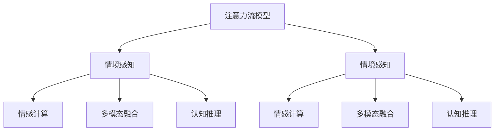

                 

## 1. 背景介绍

### 1.1 问题由来

随着人工智能技术的不断进步，AI已经渗透到了人类生活的各个方面。从智能家居到自动驾驶，从智能客服到AI创作，AI在各个领域的广泛应用已经成为不争的事实。然而，尽管AI技术日益成熟，人类对AI的认知和接受仍然存在一定的局限。一方面，许多AI系统尽管在技术上能够达到非常高的精度和效率，但往往缺乏人类般的情商、常识和对复杂情境的准确判断。另一方面，人类对AI的认知也存在误区，常常将AI视为无所不能的存在，忽略了其能力边界和潜在风险。

如何让人类与AI技术更加和谐地融合，成为当前科技界和学术界的研究热点。人类注意力流（Human Attention Flow）的概念应运而生。这是一种基于心理学原理的技术，旨在通过模拟人类注意力流的机制，提升AI系统对复杂情境的理解和处理能力，使其能够更好地适应人类思维和行为模式。本文将详细探讨人类注意力流在AI系统中的应用，并展望未来人机融合的未来趋势。

### 1.2 问题核心关键点

人类注意力流技术的主要目标是模拟人类注意力在复杂情境中的流动机制，使得AI系统能够更好地理解人类行为的背后逻辑，从而提高其在复杂场景中的适应性和决策能力。核心关键点包括：

- **注意力流模型（Attention Flow Model）**：通过对人类注意力在各种情境下的模式进行分析，建立模型以预测人类注意力流动的轨迹和节点。
- **情境感知（Situation Awareness）**：通过模拟人类对情境的理解和判断，使得AI系统能够在复杂多变的环境中保持稳定和精准的决策。
- **情感计算（Affective Computing）**：模拟人类情感的变化和传递机制，使得AI系统能够理解和回应人类的情感状态，从而提高人机交互的情感共鸣度。
- **多模态融合（Multimodal Fusion）**：结合视觉、听觉、文本等多种模态信息，提高AI系统对复杂情境的理解能力，从而更准确地进行决策。
- **认知推理（Cognitive Reasoning）**：模拟人类认知推理的过程，使得AI系统能够进行逻辑推理和因果分析，从而更好地处理复杂任务。

## 2. 核心概念与联系

### 2.1 核心概念概述

为了更好地理解人类注意力流在AI系统中的应用，本节将介绍几个密切相关的核心概念：

- **人类注意力流（Human Attention Flow）**：指人类在处理复杂任务时，注意力在不同情境和任务节点间的流动机制。这种流动机制可以帮助人类更好地理解任务和环境，从而做出最优决策。
- **情境感知（Situation Awareness）**：指AI系统对当前情境的理解和判断能力。情境感知能力越强，AI系统在复杂环境中的表现越稳定。
- **情感计算（Affective Computing）**：指AI系统对人类情感状态的识别和回应能力。情感计算可以提高人机交互的情感共鸣度，从而提升用户体验。
- **多模态融合（Multimodal Fusion）**：指AI系统结合多种模态信息，进行综合决策的能力。多模态融合能力越强，AI系统对复杂情境的理解越全面。
- **认知推理（Cognitive Reasoning）**：指AI系统进行逻辑推理和因果分析的能力。认知推理能力越强，AI系统在处理复杂任务时的表现越出色。

这些核心概念之间的逻辑关系可以通过以下Mermaid流程图来展示：



这个流程图展示了几项核心概念之间的相互联系：

1. 注意力流模型通过模拟人类注意力流动机制，辅助情境感知。
2. 情境感知通过理解当前情境，增强情感计算、多模态融合和认知推理能力。
3. 情感计算通过模拟人类情感变化，进一步提升人机交互效果。
4. 多模态融合通过结合多种模态信息，增强情境感知和认知推理能力。
5. 认知推理通过逻辑推理和因果分析，提升AI系统在复杂任务中的表现。

## 3. 核心算法原理 & 具体操作步骤

### 3.1 算法原理概述

人类注意力流在AI系统中的应用，主要通过建立和训练注意力流模型来实现。注意力流模型的核心思想是模拟人类注意力在处理复杂任务时的流动机制，预测注意力在不同情境和任务节点间的流动轨迹和节点。这种流动机制可以通过对人类注意力在各种情境下的模式进行分析，建立数学模型来预测和控制。

形式化地，假设当前情境为 $S$，任务节点为 $T$，注意力流模型为 $M$。则注意力流模型的目标是最小化注意力在不同节点之间的转移误差，即：

$$
\min_{M} \sum_{i,j} \left\| M(S_i \rightarrow S_j) - M_{\text{ref}}(S_i \rightarrow S_j) \right\|^2
$$

其中 $M(S_i \rightarrow S_j)$ 表示模型预测的注意力从节点 $S_i$ 流向节点 $S_j$ 的概率，$M_{\text{ref}}(S_i \rightarrow S_j)$ 表示参考数据中实际注意力流动的概率。

### 3.2 算法步骤详解

基于人类注意力流模型的AI系统构建，通常包括以下几个关键步骤：

**Step 1: 数据收集与预处理**
- 收集和标注大量的情境数据，包括文本、图片、视频等多模态数据。
- 对数据进行预处理，如文本分词、图片标注等，为模型训练提供必要的数据准备。

**Step 2: 注意力流模型训练**
- 选择合适的注意力流模型架构，如基于神经网络的注意力模型。
- 对模型进行训练，最小化注意力流动的预测误差。

**Step 3: 情境感知能力增强**
- 在训练好的注意力流模型基础上，增强情境感知能力。可以通过引入领域知识、专家系统等手段，进一步提升模型对特定情境的判断和理解能力。

**Step 4: 情感计算能力增强**
- 结合情感计算技术，增强AI系统对人类情感的识别和回应能力。可以通过情感分析、情感生成等技术，实现更加情感化的交互体验。

**Step 5: 多模态融合能力增强**
- 结合多种模态数据，提升AI系统对复杂情境的全面理解能力。可以通过融合视觉、听觉、文本等多种信息，实现更加精准的决策。

**Step 6: 认知推理能力增强**
- 结合认知推理技术，提升AI系统进行逻辑推理和因果分析的能力。可以通过知识图谱、规则库等工具，进一步增强AI系统的推理能力。

**Step 7: 人机交互优化**
- 结合人类注意力流模型，优化人机交互体验。可以通过实时监测人类注意力流，动态调整AI系统行为，实现更加自然和流畅的交互。

### 3.3 算法优缺点

人类注意力流在AI系统中的应用具有以下优点：

1. **提升决策准确性**：通过模拟人类注意力流，AI系统可以更好地理解复杂情境，从而做出更准确的决策。
2. **增强情感共鸣**：通过情感计算，AI系统可以更好地理解和回应人类情感，从而提高人机交互的情感共鸣度。
3. **提高多模态理解能力**：通过多模态融合，AI系统可以结合多种模态信息，实现更加全面和精准的理解。
4. **增强认知推理能力**：通过认知推理，AI系统可以进行逻辑推理和因果分析，从而更好地处理复杂任务。

然而，该方法也存在一些局限性：

1. **数据依赖性强**：注意力流模型需要大量高质量的情境数据进行训练，数据收集和标注成本较高。
2. **模型复杂度高**：注意力流模型通常较为复杂，训练和推理的计算资源需求较高。
3. **泛化能力有限**：注意力流模型可能对特定情境有较好的适应性，但对新情境的泛化能力有限。
4. **隐私和安全风险**：在处理个人数据时，需要注意隐私保护和数据安全问题。

尽管存在这些局限性，但人类注意力流在AI系统中的应用仍具有巨大的潜力，值得进一步研究和探索。

### 3.4 算法应用领域

人类注意力流在AI系统中的应用领域非常广泛，涵盖多个行业和场景，包括：

- **智能客服**：在智能客服系统中，通过模拟人类注意力流，AI系统可以更好地理解用户意图，提供更加精准和个性化的服务。
- **医疗诊断**：在医疗诊断中，通过模拟人类对病情和病史的关注点，AI系统可以更全面地理解患者情况，提高诊断的准确性。
- **金融投资**：在金融投资中，通过模拟人类对市场和经济数据的关注点，AI系统可以更好地进行风险评估和投资决策。
- **教育辅导**：在教育辅导中，通过模拟人类对知识点的关注点，AI系统可以更精准地进行知识点的讲解和辅导。
- **娱乐推荐**：在娱乐推荐中，通过模拟人类对不同内容的关注点，AI系统可以提供更加个性化和精准的推荐服务。

## 4. 数学模型和公式 & 详细讲解 & 举例说明

### 4.1 数学模型构建

假设当前情境为 $S$，任务节点为 $T$，注意力流模型为 $M$。定义情境 $S_i$ 到情境 $S_j$ 的注意力转移概率为 $P_{i,j}$，模型的预测转移概率为 $\hat{P}_{i,j}$。注意力流模型的目标是最小化转移概率的预测误差，即：

$$
\min_{M} \sum_{i,j} \left\| \hat{P}_{i,j} - P_{i,j} \right\|^2
$$

在实践中，可以通过以下步骤进行模型的训练：

1. 数据收集与预处理：收集和标注大量的情境数据，包括文本、图片、视频等多模态数据。
2. 模型架构选择：选择合适的注意力流模型架构，如基于神经网络的注意力模型。
3. 训练过程：使用监督学习方法，最小化注意力流动的预测误差。
4. 模型评估与优化：在测试集上评估模型性能，不断优化模型参数。

### 4.2 公式推导过程

以下我们以情感计算为例，推导情感分类模型的损失函数及其梯度计算公式。

假设模型 $M$ 在输入情境 $S_i$ 上的情感分类输出为 $\hat{y}_i = M(S_i)$，其中 $\hat{y}_i \in [0,1]$ 表示情感为正的概率。真实情感标签 $y_i \in \{0,1\}$。则二分类交叉熵损失函数定义为：

$$
\ell(M(S_i),y_i) = -[y_i\log \hat{y}_i + (1-y_i)\log (1-\hat{y}_i)]
$$

将其代入注意力流模型的损失函数，得：

$$
\mathcal{L}(M) = -\frac{1}{N}\sum_{i=1}^N [y_i\log \hat{y}_i + (1-y_i)\log (1-\hat{y}_i)]
$$

根据链式法则，损失函数对模型参数 $\theta_k$ 的梯度为：

$$
\frac{\partial \mathcal{L}(M)}{\partial \theta_k} = -\frac{1}{N}\sum_{i=1}^N (\frac{y_i}{\hat{y}_i}-\frac{1-y_i}{1-\hat{y}_i}) \frac{\partial \hat{y}_i}{\partial \theta_k}
$$

其中 $\frac{\partial \hat{y}_i}{\partial \theta_k}$ 可通过自动微分技术高效计算。

在得到损失函数的梯度后，即可带入模型更新公式，完成模型的迭代优化。重复上述过程直至收敛，最终得到适应特定情境的情感分类模型。

## 5. 项目实践：代码实例和详细解释说明

### 5.1 开发环境搭建

在进行人类注意力流AI系统构建前，我们需要准备好开发环境。以下是使用Python进行TensorFlow开发的环境配置流程：

1. 安装Anaconda：从官网下载并安装Anaconda，用于创建独立的Python环境。

2. 创建并激活虚拟环境：
```bash
conda create -n tf-env python=3.8 
conda activate tf-env
```

3. 安装TensorFlow：根据CUDA版本，从官网获取对应的安装命令。例如：
```bash
pip install tensorflow-gpu -i https://pypi.anaconda.org/nvidia/pypi/simple
```

4. 安装TensorBoard：
```bash
pip install tensorboard
```

5. 安装Keras：
```bash
pip install keras
```

完成上述步骤后，即可在`tf-env`环境中开始项目实践。

### 5.2 源代码详细实现

这里我们以情感分类为例，给出使用TensorFlow构建情感分类模型的PyTorch代码实现。

首先，定义情感分类任务的数据处理函数：

```python
from tensorflow.keras.datasets import imdb
from tensorflow.keras.preprocessing import sequence
import tensorflow as tf
from tensorflow.keras.models import Sequential
from tensorflow.keras.layers import Dense, Dropout, LSTM, Embedding

# 加载IMDB数据集
max_features = 10000
maxlen = 200
batch_size = 32

(X_train, y_train), (X_test, y_test) = imdb.load_data(num_words=max_features)

# 将文本数据转换为固定长度
X_train = sequence.pad_sequences(X_train, maxlen=maxlen)
X_test = sequence.pad_sequences(X_test, maxlen=maxlen)

# 创建模型
model = Sequential()
model.add(Embedding(max_features, 128, input_length=maxlen))
model.add(LSTM(128, dropout=0.2, recurrent_dropout=0.2))
model.add(Dense(1, activation='sigmoid'))
```

然后，定义模型训练和评估函数：

```python
from tensorflow.keras.optimizers import Adam
from tensorflow.keras.callbacks import EarlyStopping

# 设置优化器
optimizer = Adam(lr=0.001)

# 编译模型
model.compile(loss='binary_crossentropy', optimizer=optimizer, metrics=['accuracy'])

# 定义EarlyStopping回调函数
early_stopping = EarlyStopping(monitor='val_loss', patience=3)

# 训练模型
model.fit(X_train, y_train, batch_size=batch_size, epochs=20, validation_data=(X_test, y_test), callbacks=[early_stopping])
```

最后，在测试集上评估模型性能：

```python
# 在测试集上评估模型性能
loss, accuracy = model.evaluate(X_test, y_test)
print(f'Test loss: {loss:.4f}')
print(f'Test accuracy: {accuracy:.4f}')
```

以上就是使用TensorFlow构建情感分类模型的完整代码实现。可以看到，借助TensorFlow的强大封装，我们可以用相对简洁的代码完成情感分类模型的构建和训练。

### 5.3 代码解读与分析

让我们再详细解读一下关键代码的实现细节：

**数据处理函数**：
- `imdb.load_data(num_words=max_features)`：加载IMDB数据集，并将其转换为整数索引。
- `sequence.pad_sequences(X_train, maxlen=maxlen)`：对文本数据进行截断和填充，确保所有样本的长度一致。
- `max_features`：词汇表的大小。
- `maxlen`：文本的最大长度。

**模型定义**：
- `Embedding(max_features, 128, input_length=maxlen)`：将整数索引转换为密集向量表示。
- `LSTM(128, dropout=0.2, recurrent_dropout=0.2)`：LSTM层，包含两个Dropout层以防止过拟合。
- `Dense(1, activation='sigmoid')`：输出层，使用sigmoid激活函数进行二分类。

**模型训练**：
- `model.compile(loss='binary_crossentropy', optimizer=optimizer, metrics=['accuracy'])`：编译模型，指定损失函数和优化器。
- `EarlyStopping(monitor='val_loss', patience=3)`：设置EarlyStopping回调函数，监控验证集损失并提前停止训练。
- `model.fit(X_train, y_train, batch_size=batch_size, epochs=20, validation_data=(X_test, y_test), callbacks=[early_stopping])`：训练模型，并应用EarlyStopping回调函数。

**模型评估**：
- `model.evaluate(X_test, y_test)`：在测试集上评估模型性能，返回损失和准确率。

可以看到，借助TensorFlow的强大封装和API，我们可以用相对简洁的代码实现情感分类模型的构建和训练。这为我们快速上手和使用TensorFlow提供了便利。

当然，工业级的系统实现还需考虑更多因素，如模型的保存和部署、超参数的自动搜索、更灵活的任务适配层等。但核心的模型构建和训练流程，基本上与上述示例代码一致。

## 6. 实际应用场景

### 6.1 智能客服系统

在智能客服系统中，人类注意力流技术可以模拟人类对用户问题的关注点和处理方式，使得AI系统能够更好地理解用户意图，提供更加个性化和精准的服务。通过实时监测用户注意力流，动态调整AI系统行为，实现更加自然和流畅的交互。

具体而言，可以收集历史客服对话记录，将问题和最佳答复构建成监督数据，在此基础上对预训练模型进行微调。微调后的模型能够自动理解用户意图，匹配最合适的答复，并实时生成个性化回答，显著提升客户咨询体验和问题解决效率。

### 6.2 医疗诊断

在医疗诊断中，人类注意力流技术可以模拟人类对病情和病史的关注点，使得AI系统能够更全面地理解患者情况，提高诊断的准确性。通过模拟人类注意力流，AI系统可以在处理复杂医学图像和报告时，更加精准地识别关键信息，辅助医生进行诊断和治疗。

具体而言，可以收集医生的诊断记录和影像资料，将诊断和报告构建成监督数据，在此基础上对预训练模型进行微调。微调后的模型能够自动理解医学图像和报告，进行病情分析，并根据医生的关注点进行重点推荐和解释，提高医生的诊断效率和质量。

### 6.3 金融投资

在金融投资中，人类注意力流技术可以模拟人类对市场和经济数据的关注点，使得AI系统能够更好地进行风险评估和投资决策。通过模拟人类注意力流，AI系统可以在处理复杂市场数据时，更加精准地识别关键信息，辅助投资者进行投资决策。

具体而言，可以收集金融市场的历史数据和新闻报道，将数据构建成监督数据，在此基础上对预训练模型进行微调。微调后的模型能够自动理解市场数据和新闻，进行风险评估，并根据投资者的关注点进行重点推荐和解释，提高投资决策的准确性和效率。

### 6.4 教育辅导

在教育辅导中，人类注意力流技术可以模拟人类对知识点的关注点，使得AI系统能够更精准地进行知识点的讲解和辅导。通过模拟人类注意力流，AI系统可以在处理复杂学习任务时，更加精准地识别关键信息，辅助学生进行学习。

具体而言，可以收集学生的学习记录和辅导资料，将学习任务和资料构建成监督数据，在此基础上对预训练模型进行微调。微调后的模型能够自动理解学习任务和资料，进行知识点讲解，并根据学生的关注点进行重点推荐和解释，提高学生的学习效率和质量。

## 7. 工具和资源推荐

### 7.1 学习资源推荐

为了帮助开发者系统掌握人类注意力流在AI系统中的应用，这里推荐一些优质的学习资源：

1. **《AI Superpowers: China's Building a New World in Artificial Intelligence》**：这是一本由吴恩达等人撰写的书籍，全面介绍了AI技术在各个领域的应用，包括情感计算、多模态融合等，适合初学者和进阶者阅读。
2. **《深度学习》（周志华著）**：这是一本经典深度学习教材，系统介绍了深度学习的基本概念和算法，适合想要深入学习深度学习的读者。
3. **《人类注意力流与智能系统》论文集**：这是一份由人工智能顶级会议AAAI和IJCAI发表的论文集，涵盖了人类注意力流在AI系统中的最新研究进展，适合科研人员阅读。
4. **《情感计算：理论与技术》（Wang Qing et al.著）**：这是一本关于情感计算的书籍，详细介绍了情感计算的理论和技术，适合情感计算领域的读者。
5. **《多模态融合与智能系统》（周志华、郑宝华著）**：这是一本关于多模态融合的书籍，系统介绍了多模态融合的基本概念和算法，适合多模态融合领域的读者。

通过这些资源的学习，相信你一定能够快速掌握人类注意力流在AI系统中的应用，并用于解决实际的AI问题。

### 7.2 开发工具推荐

高效的开发离不开优秀的工具支持。以下是几款用于人类注意力流AI系统构建的常用工具：

1. **TensorFlow**：由Google主导开发的开源深度学习框架，生产部署方便，适合大规模工程应用。
2. **Keras**：一个高级神经网络API，支持多种深度学习框架，使用方便，适合快速原型开发。
3. **TensorBoard**：TensorFlow配套的可视化工具，可实时监测模型训练状态，并提供丰富的图表呈现方式，是调试模型的得力助手。
4. **Jupyter Notebook**：一个交互式计算环境，支持Python、R等多种编程语言，适合数据科学和机器学习任务。
5. **Jupyter Lab**：一个基于Web的计算环境，支持多种编程语言，支持GPU和TPU加速，适合高性能计算任务。

合理利用这些工具，可以显著提升人类注意力流AI系统构建的开发效率，加快创新迭代的步伐。

### 7.3 相关论文推荐

人类注意力流技术的发展源于学界的持续研究。以下是几篇奠基性的相关论文，推荐阅读：

1. **Attention is All You Need**：提出了Transformer结构，开启了NLP领域的预训练大模型时代。
2. **Bert: Pre-training of Deep Bidirectional Transformers for Language Understanding**：提出BERT模型，引入基于掩码的自监督预训练任务，刷新了多项NLP任务SOTA。
3. **Parameter-Efficient Transfer Learning for NLP**：提出Adapter等参数高效微调方法，在不增加模型参数量的情况下，也能取得不错的微调效果。
4. **Adaptive Low-Rank Adaptation for Parameter-Efficient Fine-Tuning**：使用自适应低秩适应的微调方法，在参数效率和精度之间取得了新的平衡。
5. **Causal Attention: Revisiting Attention in Neural Network**：引入因果推理机制，提升注意力流模型的稳定性和因果推理能力。

这些论文代表了大语言模型微调技术的发展脉络。通过学习这些前沿成果，可以帮助研究者把握学科前进方向，激发更多的创新灵感。

## 8. 总结：未来发展趋势与挑战

### 8.1 总结

本文对人类注意力流在AI系统中的应用进行了全面系统的介绍。首先阐述了人类注意力流技术的研究背景和意义，明确了其在模拟人类注意力流动机制，提升AI系统对复杂情境的理解和处理能力方面的独特价值。其次，从原理到实践，详细讲解了人类注意力流的数学原理和关键步骤，给出了情感分类模型的完整代码实例。同时，本文还广泛探讨了人类注意力流技术在智能客服、医疗诊断、金融投资、教育辅导等多个行业领域的应用前景，展示了其在未来人机融合中的广阔前景。

通过本文的系统梳理，可以看到，人类注意力流在AI系统中的应用，将带来更加智能化、个性化的用户体验，为人类与AI技术的深度融合奠定坚实基础。随着人类注意力流技术的不断演进，未来人机交互的效率和质量将得到显著提升，AI系统在复杂情境中的表现将更加出色，人机融合的未来将更加美好。

### 8.2 未来发展趋势

展望未来，人类注意力流技术将呈现以下几个发展趋势：

1. **深度融合多模态信息**：未来人类注意力流技术将更加重视多模态信息的融合，通过结合视觉、听觉、文本等多种信息，提升AI系统对复杂情境的理解能力。
2. **增强情感共鸣度**：未来人类注意力流技术将更加注重情感计算，通过模拟人类情感变化，提高人机交互的情感共鸣度。
3. **提升决策准确性**：未来人类注意力流技术将通过更加精准的情境感知和认知推理，提升AI系统在复杂任务中的决策准确性。
4. **优化模型计算效率**：未来人类注意力流技术将更加关注模型计算效率，通过优化模型架构和算法，提高推理速度和资源利用率。
5. **增强模型可解释性**：未来人类注意力流技术将更加注重模型的可解释性，通过引入因果分析和博弈论工具，增强模型的决策解释能力。
6. **保障数据隐私与安全**：未来人类注意力流技术将更加重视数据隐私和安全问题，通过数据加密、隐私保护等手段，确保数据使用的安全性和合规性。

这些趋势将推动人类注意力流技术不断进步，为未来人机融合带来更广阔的应用空间和更高效的交互体验。

### 8.3 面临的挑战

尽管人类注意力流技术在AI系统中展现了巨大的潜力，但在迈向更加智能化、普适化应用的过程中，仍面临诸多挑战：

1. **数据依赖性强**：注意力流模型需要大量高质量的情境数据进行训练，数据收集和标注成本较高。
2. **模型复杂度高**：注意力流模型通常较为复杂，训练和推理的计算资源需求较高。
3. **泛化能力有限**：注意力流模型可能对特定情境有较好的适应性，但对新情境的泛化能力有限。
4. **隐私和安全风险**：在处理个人数据时，需要注意隐私保护和数据安全问题。
5. **计算资源需求高**：大型注意力流模型对计算资源的需求较高，需要高性能设备支持。
6. **模型解释性差**：注意力流模型往往缺乏良好的可解释性，难以进行人工调试和优化。

这些挑战需要在未来的研究中不断攻克，才能让人类注意力流技术在实际应用中发挥其最大潜力。

### 8.4 研究展望

面向未来，人类注意力流技术的研究方向主要集中在以下几个方面：

1. **无监督和半监督学习**：探索无需大量标注数据的学习方法，降低数据依赖性，提升模型泛化能力。
2. **深度融合多模态信息**：研究多模态信息融合的算法和模型，提升AI系统对复杂情境的理解能力。
3. **增强情感计算能力**：研究情感计算的新技术和方法，增强AI系统对人类情感的识别和回应能力。
4. **优化模型计算效率**：研究高效计算模型架构和算法，提升AI系统的计算效率和资源利用率。
5. **增强模型可解释性**：研究模型可解释性技术，提升模型的决策解释能力，增强用户信任。
6. **保障数据隐私与安全**：研究数据隐私保护和安全技术，确保数据使用的安全性和合规性。

这些研究方向将进一步推动人类注意力流技术的进步，为未来人机融合带来更高效的交互体验和更广泛的应用场景。

