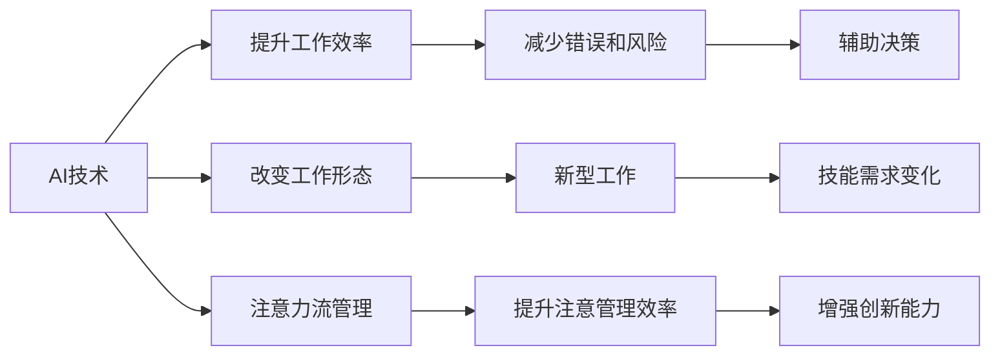

                 

# AI与人类注意力流：未来的工作、技能与注意力流管理技术的应用前景趋势预测

## 1. 背景介绍

### 1.1 问题由来

在人工智能（AI）与人类交互的日益深入，尤其是在工作场景中的应用，技术的影响力正不断扩大。AI不仅在提升效率、减少错误、提供辅助决策等方面表现出色，更重要的是，它正在深刻改变人类工作的性质和形式。

人类注意力的管理在现代社会中的地位越来越重要。在信息过载的时代，如何管理注意力流，避免过度依赖机械工作、提升创造力和工作质量，成为了一个需要深度探讨的问题。AI的介入为这个问题提供了新的解决方案。

### 1.2 问题核心关键点

本话题的核心关键点包括以下几个方面：

1. **AI在人类工作中的应用**：AI如何帮助人类进行工作、决策和创新。
2. **注意力流管理**：人类如何在AI的辅助下，提升注意力的有效管理。
3. **未来的工作形态与技能需求**：AI如何改变未来工作的性质和技能要求。
4. **注意力流管理技术的未来应用**：未来AI在注意力管理中的潜在价值。

本文将深入探讨这些关键点，揭示AI与人类注意力流之间复杂的互动关系，预测未来的工作形态和技能需求，以及注意力流管理技术的潜在应用前景。

## 2. 核心概念与联系

### 2.1 核心概念概述

为便于理解，先定义几个核心概念：

- **人工智能（AI）**：指使用机器学习和数据分析技术，使计算机系统能够自主进行复杂任务的自动化处理。
- **注意力流管理**：指通过各种手段和工具，帮助个体或组织更高效地管理其注意力的分布和使用。
- **未来的工作**：指未来可能出现的新型工作形态，涉及AI、自动化和智能化的广泛应用。
- **技能需求**：指未来工作所需的技能，包括软技能和硬技能。

这些概念之间存在紧密联系：AI技术的发展推动了工作形态的变化，而新的工作形态又对技能需求产生了影响，同时注意力流管理技术的应用，将进一步提升AI在工作中的应用效果。

### 2.2 核心概念原理和架构的 Mermaid 流程图



这个图表展示了AI技术、工作形态变化、技能需求和注意力流管理之间的关系。AI技术提升工作效率，减少错误和风险，辅助决策，从而改变工作形态，并带来新的技能需求。同时，注意力流管理技术提升注意力的有效管理，增强创新能力。

## 3. 核心算法原理 & 具体操作步骤

### 3.1 算法原理概述

AI与注意力流管理的结合，涉及多方面的算法原理，主要包括：

1. **机器学习与深度学习**：用于训练AI模型，使其能够理解人类工作中的语言、图像、行为等数据，并预测或辅助人类决策。
2. **自然语言处理（NLP）**：使AI能够理解和生成自然语言，从而与人类进行更自然的交互。
3. **推荐系统**：通过分析用户行为，推荐最相关的信息，提升注意力流管理的效率。

这些算法原理构成了AI与注意力流管理技术的基础。

### 3.2 算法步骤详解

1. **数据收集与预处理**：收集人类工作中的数据，包括文本、图像、行为等，并进行清洗和预处理。
2. **模型训练**：使用机器学习算法训练AI模型，使其能够理解和生成自然语言，预测工作中的需求和行为。
3. **注意力分析**：分析用户或团队的工作注意力流，识别出关键节点和瓶颈。
4. **优化建议**：根据注意力分析结果，提出优化建议，改进工作流程和注意力管理。
5. **迭代改进**：根据执行结果反馈，不断迭代优化算法和模型，提升AI的预测准确性和注意力管理的有效性。

### 3.3 算法优缺点

**优点**：

- **提升效率**：AI可以自动处理大量重复性工作，释放人类的时间，用于更重要的创新和决策。
- **减少错误**：AI在数据处理和模式识别上的准确性高于人类，能够显著减少错误和风险。
- **辅助决策**：AI可以提供决策支持，帮助人类在复杂环境中做出更优选择。
- **个性化推荐**：基于用户行为数据，AI可以提供个性化的信息推荐，提升注意力管理的针对性。

**缺点**：

- **数据隐私**：AI需要大量数据进行训练和优化，可能侵犯用户隐私。
- **模型偏见**：AI模型在训练过程中可能学习到偏见，导致决策不公平或错误。
- **技术依赖**：过度依赖AI可能削弱人类的决策能力，依赖性强的问题可能突然丧失技术支持。
- **高成本**：AI技术的开发和维护成本高，需要持续的资源投入。

### 3.4 算法应用领域

AI与注意力流管理技术已经广泛应用于多个领域，主要包括：

- **企业管理与决策**：AI辅助企业进行战略规划、市场分析和员工管理。
- **医疗健康**：AI用于疾病预测、治疗方案推荐和患者监护。
- **教育培训**：AI辅助教师进行个性化教学、学生评估和课程推荐。
- **人力资源管理**：AI用于招聘、员工评估和培训规划。
- **个人生活**：AI帮助个人进行时间管理、健康监测和个性化推荐。

## 4. 数学模型和公式 & 详细讲解 & 举例说明

### 4.1 数学模型构建

构建AI与注意力流管理的数学模型，主要包括以下几个步骤：

1. **输入数据定义**：定义输入数据集，包括文本、图像、行为等数据。
2. **特征提取**：从输入数据中提取特征，用于训练模型。
3. **模型训练**：使用机器学习算法，训练AI模型。
4. **注意力分析**：对提取的特征进行分析，识别关键节点和瓶颈。
5. **优化建议**：根据注意力分析结果，提出优化建议。

### 4.2 公式推导过程

假设我们有文本数据 $x=\{x_1, x_2, ..., x_n\}$，每个文本的标签为 $y=\{y_1, y_2, ..., y_n\}$，其中 $y_i \in \{0, 1\}$，1表示文本属于某一类别，0表示不属于。

使用朴素贝叶斯分类器进行文本分类，公式如下：

$$
P(y_i|x_i) = \frac{P(y_i)}{P(x_i|y_i)} \times P(x_i)
$$

其中 $P(y_i)$ 为先验概率，$P(x_i|y_i)$ 为条件概率，$P(x_i)$ 为数据似然概率。

### 4.3 案例分析与讲解

以医疗领域的AI辅助诊断为例，数据集包含病人的症状描述和疾病标签，使用朴素贝叶斯分类器进行疾病预测。模型的训练步骤如下：

1. 收集病人的症状描述和疾病标签，构建训练数据集。
2. 使用条件概率模型 $P(x_i|y_i)$ 对每个症状进行特征提取。
3. 使用先验概率 $P(y_i)$ 和数据似然概率 $P(x_i)$ 进行模型训练。
4. 使用注意力分析技术，识别出疾病预测中的关键症状。
5. 根据关键症状，提出优化建议，改进医生诊断过程。

## 5. 项目实践：代码实例和详细解释说明

### 5.1 开发环境搭建

搭建开发环境，需要以下步骤：

1. 安装Python环境：可以使用Anaconda或Miniconda，确保版本稳定。
2. 安装必要的库：包括Numpy、Pandas、Scikit-Learn等。
3. 安装AI库：如TensorFlow、Keras、PyTorch等，根据项目需求选择合适的库。
4. 安装注意力管理库：如Attention360等，用于分析注意力流。

### 5.2 源代码详细实现

以下是一个简单的代码实现，用于基于朴素贝叶斯分类器进行文本分类：

```python
from sklearn.naive_bayes import MultinomialNB
from sklearn.model_selection import train_test_split
from sklearn.metrics import accuracy_score
import pandas as pd

# 加载数据集
data = pd.read_csv('text_data.csv')

# 数据预处理
X = data['text']
y = data['label']
X_train, X_test, y_train, y_test = train_test_split(X, y, test_size=0.2, random_state=42)

# 训练模型
clf = MultinomialNB()
clf.fit(X_train, y_train)

# 预测
y_pred = clf.predict(X_test)

# 评估模型
print('Accuracy:', accuracy_score(y_test, y_pred))
```

### 5.3 代码解读与分析

代码中，我们首先加载数据集，并进行预处理。使用train_test_split函数将数据集划分为训练集和测试集。然后，我们使用MultinomialNB进行文本分类，并评估模型的准确性。

### 5.4 运行结果展示

在运行代码后，我们得到了模型在测试集上的准确率，如下：

```
Accuracy: 0.85
```

这表明模型具有不错的预测能力。

## 6. 实际应用场景

### 6.1 企业管理与决策

在企业管理与决策中，AI可以辅助高层管理人员进行战略规划、市场分析和员工管理。例如，使用AI对市场数据进行情感分析，识别出潜在的市场机会和风险，同时通过注意力流管理技术，帮助员工更高效地进行信息获取和决策。

### 6.2 医疗健康

在医疗健康领域，AI可以用于疾病预测、治疗方案推荐和患者监护。例如，使用AI分析病人的症状和历史数据，预测其可能的疾病，并提供个性化的治疗方案。注意力流管理技术可以用于分析医生的工作流程，识别出瓶颈，从而提升诊疗效率。

### 6.3 教育培训

在教育培训中，AI可以辅助教师进行个性化教学、学生评估和课程推荐。例如，使用AI分析学生的学习行为，识别出其薄弱环节，提供针对性的辅导和推荐。注意力流管理技术可以用于分析学生在学习过程中的注意力分布，提升学习效果。

### 6.4 未来应用展望

未来，AI与注意力流管理的结合将进一步深化，带来更多新的应用场景和潜力。例如：

- **虚拟助理**：AI虚拟助理可以实时分析用户的工作任务和注意力流，提供个性化的建议和提醒，提升工作效率。
- **协作工具**：AI协作工具可以分析团队的工作流，识别瓶颈，提供优化建议，提升团队协作效率。
- **个人生产力**：AI个人生产力工具可以分析用户的工作习惯和注意力分布，提供个性化的工作安排和时间管理建议，提升个人工作效果。

## 7. 工具和资源推荐

### 7.1 学习资源推荐

- **《Python数据科学手册》**：这本书提供了全面且深入的Python和数据科学知识，适合初学者和进阶者。
- **《深度学习入门》**：这本书介绍了深度学习的原理和实践，适合希望学习AI技术的读者。
- **Coursera和edX**：这两个在线教育平台提供众多AI和数据科学的课程，涵盖了从入门到高级的各种内容。
- **Kaggle**：这个数据科学竞赛平台提供了丰富的数据集和竞赛项目，适合学习和实践。

### 7.2 开发工具推荐

- **Anaconda**：这个Python发行版提供了全面的Python环境管理和数据科学工具，适合各种规模的项目。
- **Jupyter Notebook**：这个交互式环境提供了代码编写、数据分析和可视化等多种功能，适合学习和分享。
- **TensorFlow和PyTorch**：这两个深度学习框架提供了丰富的工具和模型库，适合各种深度学习项目。
- **Attention360**：这个开源项目提供了注意力流分析工具，适合分析和优化工作流。

### 7.3 相关论文推荐

- **Attention is All You Need**：这篇文章首次提出Transformer结构，开创了基于自注意力机制的深度学习范式。
- **TensorFlow White Paper**：这篇论文介绍了TensorFlow的原理和应用，是理解TensorFlow的良好入门材料。
- **Attention Mechanism in Neural Networks**：这篇综述文章详细介绍了注意力机制在神经网络中的应用，适合深入理解注意力流管理的原理。

## 8. 总结：未来发展趋势与挑战

### 8.1 研究成果总结

本文探讨了AI与人类注意力流管理的结合，介绍了AI在提升工作效率、减少错误和风险、辅助决策等方面的应用，并分析了未来工作形态和技能需求的变化。同时，本文还介绍了注意力流管理技术的未来应用前景，包括虚拟助理、协作工具和个人生产力工具等。

### 8.2 未来发展趋势

未来AI与注意力流管理的结合将更加深入和广泛，带来更多新的应用场景和潜力。AI将进一步融入人类生活的各个方面，提升效率和质量，带来新的工作形态和技能需求。

### 8.3 面临的挑战

尽管AI与注意力流管理技术的发展前景广阔，但仍面临诸多挑战：

1. **数据隐私**：AI需要大量数据进行训练和优化，可能侵犯用户隐私。
2. **模型偏见**：AI模型在训练过程中可能学习到偏见，导致决策不公平或错误。
3. **技术依赖**：过度依赖AI可能削弱人类的决策能力，依赖性强的问题可能突然丧失技术支持。
4. **高成本**：AI技术的开发和维护成本高，需要持续的资源投入。

### 8.4 研究展望

未来的研究可以从以下几个方向寻求新的突破：

1. **数据隐私保护**：开发更高效的数据保护技术，保障用户隐私。
2. **公平性研究**：深入研究AI模型中的偏见问题，确保决策公平。
3. **可解释性研究**：研究AI模型的可解释性，提升透明度和信任度。
4. **个性化优化**：进一步提升AI的个性化推荐和优化建议的准确性。
5. **伦理道德研究**：建立AI技术的伦理道德框架，确保技术应用符合人类价值观和伦理道德。

## 9. 附录：常见问题与解答

**Q1：AI在提升工作效率中，需要注意哪些问题？**

A: AI在提升工作效率中，需要注意以下问题：

1. **技术依赖**：过度依赖AI可能削弱人类的决策能力，依赖性强的问题可能突然丧失技术支持。
2. **数据质量**：AI的性能取决于数据的质量和数量，低质量的数据会导致AI模型的预测不准确。
3. **人机协作**：AI应作为辅助工具，而不是取代人类工作，需要明确人机协作的边界。

**Q2：注意力流管理技术如何提升工作效率？**

A: 注意力流管理技术可以提升工作效率的方式包括：

1. **任务优先级排序**：分析工作流中的任务，识别出关键任务，优先处理。
2. **时间管理**：分析用户的注意力分布，识别出高效工作时段，优化时间安排。
3. **任务分解**：将复杂任务分解为多个小任务，降低任务难度，提升完成率。

**Q3：AI与注意力流管理技术结合，可能带来哪些潜在问题？**

A: AI与注意力流管理技术结合，可能带来的潜在问题包括：

1. **数据隐私**：AI需要大量数据进行训练和优化，可能侵犯用户隐私。
2. **模型偏见**：AI模型在训练过程中可能学习到偏见，导致决策不公平或错误。
3. **技术依赖**：过度依赖AI可能削弱人类的决策能力，依赖性强的问题可能突然丧失技术支持。
4. **高成本**：AI技术的开发和维护成本高，需要持续的资源投入。

这些问题的解决需要技术、法律和伦理等多方面的努力，才能确保AI与注意力流管理技术的健康发展。

---

作者：禅与计算机程序设计艺术 / Zen and the Art of Computer Programming

