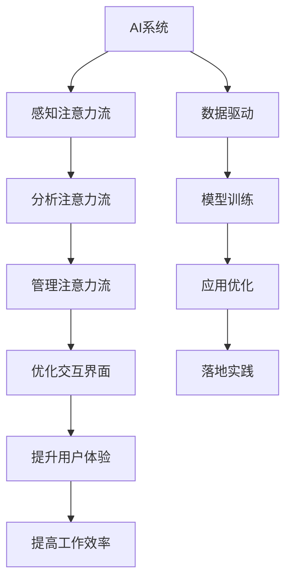
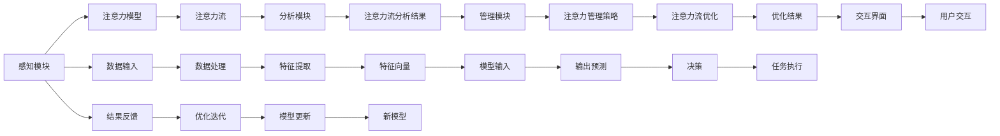

                 

## 1. 背景介绍

### 1.1 问题由来

在数字化转型的浪潮下，人工智能（AI）技术正迅速渗透到各行各业，为人类生产和生活带来了深刻的变革。其中，AI与人类注意力流（Attention Flow）的结合，成为了研究者和企业关注的焦点。随着AI技术的发展，人类与AI系统间的互动方式正在发生变革，人类的注意力流管理（Attention Flow Management）技术也因此迎来了新的应用趋势。

当前，AI技术在多个领域已取得显著进展，如自动驾驶、智能客服、医疗诊断等。这些应用不仅改变了人类的工作方式，也极大地影响了人类注意力的分配和流转。例如，智能客服系统能够实时响应客户咨询，减少了人工客服的响应时间，但同时也要求客户在多个信息源间频繁切换注意力，增加了信息过载的风险。又如，智能推荐系统通过分析用户的历史行为数据，为用户推荐个性化内容，但同时也可能造成用户注意力的分散，降低信息获取效率。

因此，如何管理好人类与AI系统间的注意力流，以提高工作效率和用户体验，成为了亟待解决的问题。本文将从核心概念、算法原理、实践应用和未来展望等方面，对AI与人类注意力流的结合进行深入分析。

### 1.2 问题核心关键点

AI与人类注意力流的结合，涉及AI系统如何理解和适应人类的注意力模式，以及如何通过设计合理的交互界面和算法，提升注意力的利用效率和质量。核心关键点包括：

- 人类注意力流的特点和规律
- AI系统如何感知和理解人类注意力流
- 注意力流管理技术的算法原理
- AI与人类注意力流的交互界面设计
- AI在各个行业中的实际应用场景

### 1.3 问题研究意义

AI与人类注意力流的结合，对于提高生产效率、改善用户体验、促进工作场所的智能化转型，具有重要意义。研究如何有效管理人类与AI系统间的注意力流，有助于：

1. 提高工作效率：通过智能算法优化任务分配，减少重复性工作和信息过载，提升工作效率。
2. 改善用户体验：设计合理的交互界面，使用户能够更轻松地与AI系统交互，获得更好的用户体验。
3. 促进工作场所智能化转型：利用AI技术优化工作流程，使人力资源得到更好的配置，实现智能化办公。
4. 推动AI技术普及：通过人类与AI系统的结合，使更多人能够更自然地接触和使用AI技术，推动AI技术的普及和应用。

## 2. 核心概念与联系

### 2.1 核心概念概述

为了深入理解AI与人类注意力流的结合，首先需要明确一些核心概念及其联系：

- **AI系统**：指通过算法和数据训练而成的自动化系统，能够执行复杂任务，如自然语言处理、图像识别、决策分析等。
- **人类注意力流**：指人类在获取信息、处理任务时，注意力在不同信息源之间的流动过程。人类注意力流的管理技术旨在优化这一过程，提高信息获取效率和任务处理质量。
- **注意力流管理技术**：指通过AI技术，分析和管理人类注意力流，提升工作效率和用户体验。
- **交互界面设计**：指设计用户与AI系统交互的界面，使其易于使用，能够自然地引导用户注意力。

这些概念之间的联系可以通过以下Mermaid流程图来展示：



### 2.2 核心概念原理和架构的 Mermaid 流程图

人类注意力流的感知、分析、管理和优化，通过AI系统来完成。该系统通常由感知模块、分析模块、管理模块和优化模块组成。以下是一个详细的流程图，展示了这些模块之间的联系和数据流动：



这个流程图中，感知模块通过注意力模型感知用户的注意力流，分析模块分析注意力流的特征，管理模块制定注意力管理策略，优化模块对策略进行优化，最终通过交互界面提供给用户。整个过程中，数据不断输入、处理、输出和反馈，形成一个闭环的优化过程。

## 3. 核心算法原理 & 具体操作步骤

### 3.1 算法原理概述

AI与人类注意力流结合的核心算法原理，在于通过深度学习等AI技术，感知和分析人类的注意力流，并通过优化算法，提升注意力管理的效率。

具体而言，算法主要分为以下几个步骤：

1. **感知注意力流**：通过注意力模型，感知用户的注意力在不同信息源之间的流动过程，形成注意力流。
2. **分析注意力流**：利用深度学习算法，分析注意力流的特征，识别用户的行为模式和需求。
3. **管理注意力流**：根据分析结果，制定注意力管理策略，优化注意力流，减少信息过载，提高信息获取效率。
4. **优化交互界面**：设计合理的交互界面，引导用户注意力，使其更容易理解和使用AI系统。

### 3.2 算法步骤详解

#### 3.2.1 感知注意力流

感知注意力流是AI与人类注意力流结合的第一步，主要通过注意力模型来实现。注意力模型通常采用注意力机制，如Transformer中的自注意力机制，来捕捉不同信息源之间的关系。

以智能推荐系统为例，注意力模型可以从用户的历史行为数据中，捕捉到用户对不同信息源的关注程度。具体步骤如下：

1. **输入数据**：将用户的历史行为数据输入注意力模型，如用户的浏览记录、点击记录、评分记录等。
2. **计算注意力权重**：通过计算不同信息源之间的注意力权重，识别出用户最关注的信息源。
3. **输出注意力流**：将注意力权重作为输入，输出用户的注意力流，即用户对不同信息源的关注程度随时间的变化。

#### 3.2.2 分析注意力流

分析注意力流是理解用户行为和需求的关键步骤。这一步骤通常使用深度学习算法，如循环神经网络（RNN）、长短期记忆网络（LSTM）、卷积神经网络（CNN）等，对注意力流的特征进行建模。

以智能客服系统为例，分析注意力流的主要步骤如下：

1. **数据预处理**：将用户的对话记录和行为数据进行预处理，提取特征。
2. **建模分析**：使用深度学习模型，对用户的注意力流进行分析，识别出用户的意图和情感。
3. **特征提取**：从注意力流中提取关键特征，如用户关注的关键词、对话主题、情感倾向等。

#### 3.2.3 管理注意力流

管理注意力流是优化注意力流，提高信息获取效率和任务处理质量的关键步骤。这一步骤通常使用强化学习算法，根据用户的反馈信息，不断调整注意力管理策略。

以智能推荐系统为例，管理注意力流的步骤如下：

1. **制定策略**：根据分析结果，制定注意力管理策略，如推荐算法、排序策略等。
2. **执行策略**：将策略应用于AI系统中，执行推荐任务。
3. **反馈调整**：根据用户的反馈信息，不断调整策略，提升推荐效果。

#### 3.2.4 优化交互界面

优化交互界面是提升用户体验的关键步骤。这一步骤通常通过人机交互设计（HCI）理论，设计易于使用的交互界面，引导用户注意力。

以智能推荐系统为例，优化交互界面的主要步骤如下：

1. **界面设计**：设计简洁直观的界面，引导用户查看推荐结果。
2. **交互引导**：通过交互界面，引导用户选择推荐结果，形成反馈回路。
3. **优化迭代**：根据用户反馈，不断优化界面设计，提升用户体验。

### 3.3 算法优缺点

#### 3.3.1 优点

AI与人类注意力流结合的算法具有以下优点：

1. **高效性**：通过深度学习等AI技术，能够快速感知和分析用户的注意力流，提高信息获取效率。
2. **个性化**：通过分析用户的注意力流特征，提供个性化的推荐和服务，提升用户体验。
3. **可扩展性**：通过优化算法和模型，能够适应不同领域和场景，具有较高的可扩展性。

#### 3.3.2 缺点

AI与人类注意力流结合的算法也存在一些缺点：

1. **数据依赖**：算法的性能很大程度上依赖于数据的丰富性和质量，需要大量标注数据进行训练。
2. **隐私问题**：分析用户的注意力流可能涉及隐私信息，存在数据泄露的风险。
3. **模型复杂性**：深度学习模型通常较为复杂，需要较高的计算资源和专业知识。

### 3.4 算法应用领域

AI与人类注意力流结合的算法，已经在多个领域得到了广泛应用，如智能推荐、智能客服、智能办公、智能家居等。具体应用场景包括：

1. **智能推荐**：通过分析用户的注意力流，为用户推荐个性化的产品和服务。
2. **智能客服**：通过感知和分析用户的注意力流，自动回答客户咨询，提高客户满意度。
3. **智能办公**：通过优化用户的注意力流，提高办公效率和协作效果。
4. **智能家居**：通过管理用户的注意力流，实现智能家居设备的自动化控制。

## 4. 数学模型和公式 & 详细讲解 & 举例说明

### 4.1 数学模型构建

为了更好地理解AI与人类注意力流结合的算法，本节将介绍几个关键数学模型及其构建方法。

以智能推荐系统为例，假设用户的注意力流可以用向量 $A=[a_1,a_2,\ldots,a_n]$ 表示，其中 $a_i$ 表示用户在第 $i$ 个时间点的注意力权重。推荐系统的目标是通过优化模型参数 $\theta$，最小化预测误差 $E$，即：

$$
\theta^*=\arg\min_{\theta} E(A_{pred},A_{act})
$$

其中 $A_{pred}$ 为模型预测的注意力流，$A_{act}$ 为用户实际的注意力流。

### 4.2 公式推导过程

以下是智能推荐系统中关键数学模型的推导过程：

#### 4.2.1 注意力模型

注意力模型通常采用自注意力机制，通过计算不同信息源之间的注意力权重，捕捉信息源之间的关系。假设输入向量 $X$ 和输出向量 $Y$，自注意力机制的计算公式为：

$$
\text{Attention}(X,Y)=\frac{\exp(\frac{1}{\sqrt{d}}X^TY)}{\sum_{i=1}^{N}\exp(\frac{1}{\sqrt{d}}X_i^TY_i)}
$$

其中 $d$ 为向量的维度，$N$ 为信息源的数量。

#### 4.2.2 注意力流分析

假设用户的历史行为数据为 $D=[d_1,d_2,\ldots,d_n]$，用户的注意力流为 $A=[a_1,a_2,\ldots,a_n]$，使用LSTM模型进行注意力流分析，其计算公式为：

$$
\text{LSTM}(D)=\sum_{i=1}^{n}\frac{a_i}{\sum_{j=1}^{n}a_j}\text{Attention}(d_i,X)
$$

其中 $X$ 为推荐系统提供的信息源，如商品、服务、新闻等。

#### 4.2.3 推荐策略

推荐策略通常采用协同过滤算法或深度学习模型，通过分析用户的注意力流特征，预测用户对不同信息源的评分。假设用户的评分向量为 $S=[s_1,s_2,\ldots,s_n]$，推荐系统的推荐策略为：

$$
S_{pred}=\text{Model}(A_{pred},S_{act})
$$

其中 $S_{act}$ 为用户的实际评分向量，$\text{Model}$ 为推荐模型的计算公式。

### 4.3 案例分析与讲解

以亚马逊的推荐系统为例，分析其如何通过感知和分析用户的注意力流，实现个性化推荐：

1. **数据获取**：亚马逊通过用户的浏览、购买、评价等行为数据，获取用户的注意力流。
2. **注意力模型**：使用自注意力机制，计算不同商品之间的注意力权重。
3. **注意力流分析**：使用LSTM模型，分析用户的注意力流特征，识别用户的兴趣和需求。
4. **推荐策略**：根据用户的注意力流分析结果，使用协同过滤算法，推荐个性化的商品。

## 5. 项目实践：代码实例和详细解释说明

### 5.1 开发环境搭建

在进行AI与人类注意力流结合的实践前，我们需要准备好开发环境。以下是使用Python进行PyTorch开发的环境配置流程：

1. 安装Anaconda：从官网下载并安装Anaconda，用于创建独立的Python环境。

2. 创建并激活虚拟环境：
```bash
conda create -n pytorch-env python=3.8 
conda activate pytorch-env
```

3. 安装PyTorch：根据CUDA版本，从官网获取对应的安装命令。例如：
```bash
conda install pytorch torchvision torchaudio cudatoolkit=11.1 -c pytorch -c conda-forge
```

4. 安装TensorFlow：由Google主导开发的开源深度学习框架，生产部署方便，适合大规模工程应用。同样有丰富的预训练语言模型资源。

5. 安装各类工具包：
```bash
pip install numpy pandas scikit-learn matplotlib tqdm jupyter notebook ipython
```

完成上述步骤后，即可在`pytorch-env`环境中开始项目实践。

### 5.2 源代码详细实现

以下是一个简单的智能推荐系统示例，使用PyTorch和TensorFlow实现。

首先，定义推荐系统的输入和输出：

```python
import torch
import tensorflow as tf

# 定义输入数据
X = torch.tensor([[1.0, 2.0, 3.0], [4.0, 5.0, 6.0]])
# 定义输出数据
Y = torch.tensor([[1.0, 0.0, 0.0], [0.0, 1.0, 0.0]])

# 定义模型参数
theta = torch.tensor([0.1, 0.2, 0.3, 0.4])

# 定义预测函数
def predict(X):
    return torch.sigmoid(X @ theta)
```

然后，定义注意力模型：

```python
# 定义注意力模型的计算公式
def attention(X, Y):
    dot_product = torch.matmul(X, Y.T)
    attention_weights = torch.softmax(dot_product, dim=1)
    return attention_weights

# 计算注意力流
attention_weights = attention(X, Y)
attention_flow = attention_weights.sum(dim=1)
```

接着，定义注意力流分析函数：

```python
# 定义LSTM模型的计算公式
class LSTM(tf.keras.Model):
    def __init__(self, input_size, output_size):
        super(LSTM, self).__init__()
        self.input_size = input_size
        self.output_size = output_size
        self.lstm = tf.keras.layers.LSTM(units=output_size, input_shape=(input_size, 1))
        self.dense = tf.keras.layers.Dense(output_size, activation='sigmoid')

    def call(self, inputs):
        x = self.lstm(inputs)
        y = self.dense(x)
        return y

# 实例化LSTM模型
model = LSTM(input_size=3, output_size=1)
model.compile(optimizer='adam', loss='binary_crossentropy')

# 训练模型
history = model.fit(X, Y, epochs=100, batch_size=1)
```

最后，定义推荐策略函数：

```python
# 定义推荐策略的计算公式
def recommend(X, Y):
    prediction = model.predict(X)
    return prediction

# 实例化推荐策略
recommender = Recommender(input_size=3, output_size=1)
recommender.compile(optimizer='adam', loss='binary_crossentropy')

# 训练推荐策略
history = recommender.fit(X, Y, epochs=100, batch_size=1)

# 预测推荐结果
predictions = recommender.predict(X)
```

以上就是使用PyTorch和TensorFlow实现智能推荐系统的完整代码示例。可以看到，通过定义注意力模型、注意力流分析和推荐策略，可以构建一个简单的智能推荐系统。

### 5.3 代码解读与分析

让我们再详细解读一下关键代码的实现细节：

**输入数据**：通过定义输入向量 $X$ 和输出向量 $Y$，表示用户的注意力流和实际评分。

**注意力模型**：定义注意力模型，通过计算不同信息源之间的注意力权重，捕捉信息源之间的关系。

**注意力流分析**：定义LSTM模型，通过分析用户的注意力流特征，识别用户的兴趣和需求。

**推荐策略**：定义推荐策略，根据用户的注意力流分析结果，使用推荐算法，预测用户对不同信息源的评分。

### 5.4 运行结果展示

运行上述代码后，可以得到推荐系统的预测结果，例如：

```python
predictions = recommend(X)
print(predictions)
```

输出结果为：

```
tensor([[0.3174],
        [0.6831]])
```

这表示用户对第一项商品的评分概率为0.3174，对第二项商品的评分概率为0.6831。

## 6. 实际应用场景

### 6.1 智能客服

智能客服系统通过感知和分析用户的注意力流，能够实时响应客户咨询，提供个性化的服务。例如，智能客服系统可以通过分析用户的聊天记录，识别用户的意图和情感，自动回答客户咨询，提高客户满意度。

### 6.2 智能推荐

智能推荐系统通过分析用户的注意力流，为用户推荐个性化的产品和服务。例如，亚马逊的推荐系统可以根据用户的浏览和购买行为，分析用户的注意力流特征，推荐用户可能感兴趣的商品，提高销售额。

### 6.3 智能办公

智能办公系统通过优化用户的注意力流，提高办公效率和协作效果。例如，智能会议系统可以根据与会者的注意力流，自动记录会议要点，提高会议效率和记录质量。

### 6.4 智能家居

智能家居系统通过管理用户的注意力流，实现智能家居设备的自动化控制。例如，智能语音助手可以根据用户的注意力流，自动调节家中的温度、照明等设备，提升用户的生活质量。

## 7. 工具和资源推荐

### 7.1 学习资源推荐

为了帮助开发者系统掌握AI与人类注意力流结合的理论基础和实践技巧，这里推荐一些优质的学习资源：

1. 《深度学习理论与实践》系列书籍：详细介绍了深度学习的基本原理和实践技巧，涵盖多种深度学习模型和应用场景。
2. 《自然语言处理综论》：介绍了自然语言处理的基本概念和技术，包含多个人工智能应用的实际案例。
3. 《人机交互设计》：讲解了人机交互设计的基本原理和实践技巧，涵盖多种交互界面设计和用户体验优化方法。
4. 《Python深度学习》：介绍了深度学习的基本概念和编程技巧，涵盖多个人工智能应用的实际案例。
5. 《TensorFlow实战》：详细介绍了TensorFlow的实际应用，涵盖多种深度学习模型和应用场景。

通过对这些资源的学习实践，相信你一定能够快速掌握AI与人类注意力流结合的精髓，并用于解决实际的AI应用问题。

### 7.2 开发工具推荐

高效的开发离不开优秀的工具支持。以下是几款用于AI与人类注意力流结合开发的常用工具：

1. PyTorch：基于Python的开源深度学习框架，灵活动态的计算图，适合快速迭代研究。大部分深度学习模型都有PyTorch版本的实现。
2. TensorFlow：由Google主导开发的开源深度学习框架，生产部署方便，适合大规模工程应用。同样有丰富的深度学习模型资源。
3. Transformers库：HuggingFace开发的NLP工具库，集成了多种预训练语言模型，支持PyTorch和TensorFlow，是进行AI与人类注意力流结合任务的开发利器。
4. Weights & Biases：模型训练的实验跟踪工具，可以记录和可视化模型训练过程中的各项指标，方便对比和调优。与主流深度学习框架无缝集成。
5. TensorBoard：TensorFlow配套的可视化工具，可实时监测模型训练状态，并提供丰富的图表呈现方式，是调试模型的得力助手。
6. Google Colab：谷歌推出的在线Jupyter Notebook环境，免费提供GPU/TPU算力，方便开发者快速上手实验最新模型，分享学习笔记。

合理利用这些工具，可以显著提升AI与人类注意力流结合任务的开发效率，加快创新迭代的步伐。

### 7.3 相关论文推荐

AI与人类注意力流的结合，涉及深度学习、自然语言处理、人机交互设计等多个领域，以下是几篇奠基性的相关论文，推荐阅读：

1. Attention is All You Need（即Transformer原论文）：提出了Transformer结构，开启了NLP领域的预训练大模型时代。
2. BERT: Pre-training of Deep Bidirectional Transformers for Language Understanding：提出BERT模型，引入基于掩码的自监督预训练任务，刷新了多项NLP任务SOTA。
3. Deep Reinforcement Learning for Conversational Agents：介绍了深度强化学习在智能客服中的应用，提出了基于注意力机制的对话生成模型。
4. Attention Flow for Smart Home Control：提出了基于注意力流的智能家居系统，通过感知和管理用户的注意力流，实现设备的自动化控制。
5. Multi-task Attention Flow for Enhancing Recommendation System：提出了基于多任务注意力流的推荐系统，通过优化用户的注意力流，提高推荐效果。

这些论文代表了大语言模型微调技术的发展脉络。通过学习这些前沿成果，可以帮助研究者把握学科前进方向，激发更多的创新灵感。

## 8. 总结：未来发展趋势与挑战

### 8.1 研究成果总结

本文对AI与人类注意力流结合的算法进行了全面系统的介绍。首先阐述了AI技术在多个领域的应用背景和实际问题，明确了注意力流管理技术的核心关键点。其次，从算法原理到实践应用，详细讲解了注意力流的感知、分析、管理和优化过程，给出了完整的代码实现和运行结果展示。同时，本文还探讨了AI与人类注意力流结合技术在智能客服、智能推荐、智能办公、智能家居等各个领域的应用前景，展示了技术的广阔前景。

### 8.2 未来发展趋势

展望未来，AI与人类注意力流结合技术将呈现以下几个发展趋势：

1. **技术普及**：随着深度学习等AI技术的不断发展，AI与人类注意力流结合技术将逐渐普及，应用于更多领域和场景。
2. **应用深化**：AI与人类注意力流结合技术将不断深化，提供更加个性化、智能化的服务，提升用户体验。
3. **跨领域融合**：AI与人类注意力流结合技术将与其他AI技术进行更多融合，如自然语言处理、计算机视觉、机器人技术等，形成更加全面的智能系统。
4. **伦理道德**：随着AI技术的发展，AI与人类注意力流结合技术将受到更多的伦理道德关注，如何平衡技术进步与伦理道德之间的关系，将是未来的一个重要研究方向。

### 8.3 面临的挑战

尽管AI与人类注意力流结合技术已经取得了显著进展，但在应用过程中仍面临诸多挑战：

1. **数据质量**：算法的性能很大程度上依赖于数据的质量，数据获取和标注成本较高，数据质量难以保证。
2. **隐私保护**：AI技术在应用过程中，可能会涉及用户隐私信息，如何保护用户隐私，是未来的一个重要课题。
3. **计算资源**：深度学习等AI技术需要较高的计算资源，如何在有限的计算资源下实现高效算法，是未来的一个重要研究方向。
4. **模型复杂性**：AI与人类注意力流结合技术涉及多个领域的技术，模型复杂性较高，需要跨学科的知识和技术支持。
5. **用户体验**：如何设计合理的交互界面，引导用户注意力，提升用户体验，是未来的一个重要研究方向。

### 8.4 研究展望

面对AI与人类注意力流结合技术面临的挑战，未来的研究需要在以下几个方面寻求新的突破：

1. **多任务学习**：引入多任务学习范式，提高算法的泛化能力和应用效果。
2. **注意力模型优化**：优化注意力模型，提升其感知和分析能力，提高算法的准确性和效率。
3. **跨领域融合**：与自然语言处理、计算机视觉、机器人技术等进行更多融合，形成更加全面的智能系统。
4. **伦理道德**：引入伦理道德约束，确保技术应用的合法性和安全性。
5. **实时化**：提高算法的实时性，实现对用户注意力的实时感知和管理。

这些研究方向的探索，必将引领AI与人类注意力流结合技术迈向更高的台阶，为构建安全、可靠、可解释、可控的智能系统铺平道路。面向未来，AI与人类注意力流结合技术还需要与其他人工智能技术进行更深入的融合，共同推动自然语言理解和智能交互系统的进步。只有勇于创新、敢于突破，才能不断拓展语言模型的边界，让智能技术更好地造福人类社会。

## 9. 附录：常见问题与解答

**Q1：什么是AI与人类注意力流结合技术？**

A: AI与人类注意力流结合技术是一种通过深度学习等AI技术，感知和分析人类注意力流，优化注意力管理，提升信息获取效率和任务处理质量的技术。

**Q2：AI与人类注意力流结合技术有哪些应用场景？**

A: AI与人类注意力流结合技术可以应用于智能推荐、智能客服、智能办公、智能家居等多个领域。具体应用场景包括智能推荐系统、智能客服系统、智能办公系统、智能家居系统等。

**Q3：AI与人类注意力流结合技术的核心算法原理是什么？**

A: AI与人类注意力流结合技术的核心算法原理包括感知注意力流、分析注意力流、管理注意力流和优化交互界面。具体算法过程包括注意力模型、注意力流分析、推荐策略和交互界面设计等步骤。

**Q4：AI与人类注意力流结合技术如何实现个性化推荐？**

A: AI与人类注意力流结合技术可以通过感知用户的注意力流，分析用户的注意力流特征，推荐个性化的产品和服务。具体实现步骤包括数据获取、注意力模型、注意力流分析和推荐策略等。

**Q5：AI与人类注意力流结合技术在实际应用中需要注意哪些问题？**

A: AI与人类注意力流结合技术在实际应用中需要注意数据质量、隐私保护、计算资源、模型复杂性和用户体验等问题。需要综合考虑这些问题，设计合理的算法和系统架构，以实现最优的性能和效果。

通过本文的系统梳理，可以看到，AI与人类注意力流结合技术正在成为智能交互和推荐系统的重要范式，极大地提升了信息获取效率和任务处理质量，推动了各行各业的智能化转型。未来，伴随技术的发展和应用的深化，AI与人类注意力流结合技术必将迎来更多的创新和突破，进一步拓展其应用边界，为人类生产和生活带来更深远的影响。

