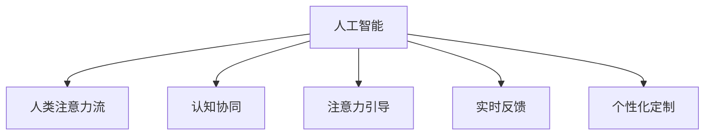

                 

## 1. 背景介绍

### 1.1 问题由来
随着人工智能（AI）技术的迅猛发展，其在多个领域的应用场景中已展现出显著的潜力，特别是在提升生产效率、优化决策过程、增强人类认知能力等方面。然而，这些技术在实际落地过程中，尤其是与人类的交互层面，仍面临诸多挑战。其中，人类注意力流（Attention Flows）的管理和优化，成为了一个不容忽视的问题。

人类注意力流管理技术旨在通过分析和干预，帮助人们在面对复杂、高负荷的工作任务时，更加高效地分配和管理注意力，避免认知过载和疲劳，从而提升整体工作效率。然而，随着AI技术的引入，人类注意力流管理也迎来了新的机遇和挑战。

### 1.2 问题核心关键点
AI与人类注意力流管理技术的结合，其核心在于：
- **认知协同**：AI能够辅助人类处理复杂信息，提供决策支持，减轻认知负担。
- **注意力引导**：通过AI算法，自动调整信息呈现顺序，引导人类注意力集中于关键信息。
- **实时反馈**：AI能够实时监测和反馈人类注意力状态，调整任务分配。
- **个性化定制**：根据不同用户的工作习惯和技能水平，AI能够定制个性化的注意力流管理策略。

### 1.3 问题研究意义
AI与人类注意力流管理技术的结合，对于提升工作效率、优化工作流程、增强认知能力具有重要意义：
- **提升效率**：通过AI辅助，减少认知负荷，提高工作速度和精度。
- **优化流程**：自动化注意力流管理，改善工作流程，减少人为错误。
- **增强认知**：通过持续学习和反馈，AI能够不断提升自身对人类注意力的理解，辅助人类更好地进行认知提升。
- **适应性增强**：AI可以根据不同用户的工作习惯和环境变化，动态调整注意力流管理策略。

## 2. 核心概念与联系

### 2.1 核心概念概述
- **人工智能（AI）**：利用计算机模拟人类智能，通过机器学习、深度学习等技术，实现自动推理、感知、学习等智能行为。
- **人类注意力流（Attention Flows）**：人类在处理任务时，注意力的流动轨迹和分配方式，包括注意力集中的时间、频率、强度等。
- **认知协同（Cognitive Collaboration）**：AI与人类在信息处理、决策支持等认知活动中的协作关系。
- **注意力引导（Attention Guidance）**：AI通过算法，自动调整信息呈现顺序，引导人类注意力集中于关键信息。
- **实时反馈（Real-time Feedback）**：AI能够实时监测和反馈人类注意力状态，调整任务分配。
- **个性化定制（Personalization）**：根据不同用户的工作习惯和技能水平，AI能够定制个性化的注意力流管理策略。

这些概念之间的逻辑关系可以通过以下Mermaid流程图来展示：



这个流程图展示了大语言模型的工作原理和优化方向：

1. 人工智能通过机器学习等技术，学习并理解人类注意力流的基本规律。
2. 通过认知协同，AI能够辅助人类处理复杂信息，提供决策支持。
3. 注意力引导通过AI算法，自动调整信息呈现顺序，引导人类注意力集中于关键信息。
4. 实时反馈使得AI能够实时监测和反馈人类注意力状态，调整任务分配。
5. 个性化定制根据不同用户的工作习惯和技能水平，AI能够定制个性化的注意力流管理策略。

## 3. 核心算法原理 & 具体操作步骤

### 3.1 算法原理概述
AI与人类注意力流管理技术的结合，核心算法原理主要包括以下几个方面：
- **注意力模型（Attention Model）**：构建注意力模型，通过学习和预测人类注意力流，实现对信息流的自动优化。
- **认知负荷模型（Cognitive Load Model）**：分析人类在任务处理过程中认知负荷的动态变化，为注意力流管理提供理论支持。
- **实时监测算法（Real-time Monitoring Algorithm）**：通过传感器、日志等手段，实时监测人类注意力状态，为AI反馈提供数据支持。
- **个性化推荐算法（Personalization Algorithm）**：根据用户历史数据和行为，生成个性化的注意力流管理策略。

### 3.2 算法步骤详解
基于以上核心算法原理，AI与人类注意力流管理技术的操作流程可以总结如下：
1. **数据收集与预处理**：收集用户的工作数据、注意力数据、行为数据等，并进行预处理和清洗。
2. **注意力模型训练**：使用机器学习算法，训练注意力模型，预测人类注意力流。
3. **认知负荷分析**：分析用户在任务处理过程中的认知负荷变化，识别认知过载或注意力分散的情况。
4. **实时监测与反馈**：通过传感器、日志等手段，实时监测用户注意力状态，生成反馈数据。
5. **个性化推荐**：根据用户历史数据和行为，生成个性化的注意力流管理策略，调整信息呈现顺序。
6. **动态优化**：根据实时反馈数据和用户状态，动态调整注意力流管理策略，提升用户体验。

### 3.3 算法优缺点
AI与人类注意力流管理技术的结合，具有以下优点：
- **高效性**：通过AI辅助，能够快速识别和优化注意力流，减少认知过载。
- **个性化**：根据用户行为和习惯，定制个性化的注意力流管理策略。
- **实时性**：实时监测和反馈，动态调整注意力流管理，提高用户体验。

同时，该技术也存在以下局限性：
- **隐私风险**：实时监测和数据收集可能涉及用户隐私，需加强数据保护措施。
- **技术复杂性**：算法实现和数据处理较为复杂，需要较高技术门槛。
- **用户接受度**：部分用户可能对AI技术持怀疑态度，需加强用户体验设计和透明度。

### 3.4 算法应用领域
AI与人类注意力流管理技术已在多个领域得到应用，例如：
- **智能办公**：在智能办公系统中，AI辅助用户处理日常任务，优化工作流程。
- **远程协作**：在远程协作平台中，AI引导用户注意力，提高会议效率和沟通效果。
- **教育培训**：在教育培训中，AI辅助教师和学生管理注意力流，提升教学效果和学习体验。
- **医疗诊断**：在医疗诊断中，AI辅助医生处理复杂信息，优化诊断流程。

## 4. 数学模型和公式 & 详细讲解

### 4.1 数学模型构建

基于注意力流管理的核心算法，构建数学模型如下：
设用户的任务集合为 $T$，注意力流为 $A$，注意力模型为 $M_A$，认知负荷模型为 $M_C$，实时监测算法为 $M_R$，个性化推荐算法为 $M_P$。

注意力模型 $M_A$ 可以表示为：
$$M_A = f(A, T)$$
其中 $f$ 为注意力模型函数，表示根据任务集合 $T$ 和注意力流 $A$，预测新的注意力流 $A'$。

认知负荷模型 $M_C$ 可以表示为：
$$M_C = g(C, T)$$
其中 $C$ 为认知负荷状态，$g$ 为认知负荷模型函数，表示根据任务集合 $T$ 和认知负荷状态 $C$，预测新的认知负荷状态 $C'$。

实时监测算法 $M_R$ 可以表示为：
$$M_R = h(R, T)$$
其中 $R$ 为实时监测数据，$h$ 为实时监测算法函数，表示根据任务集合 $T$ 和实时监测数据 $R$，生成反馈数据 $F$。

个性化推荐算法 $M_P$ 可以表示为：
$$M_P = i(P, T, C)$$
其中 $P$ 为用户行为数据，$i$ 为个性化推荐算法函数，表示根据任务集合 $T$、认知负荷状态 $C$ 和用户行为数据 $P$，生成个性化的注意力流管理策略 $S$。

### 4.2 公式推导过程

假设有一个用户在处理任务 $t \in T$，初始注意力流为 $A_0$，认知负荷状态为 $C_0$。

首先，根据注意力模型 $M_A$，预测新的注意力流 $A_1$：
$$A_1 = M_A(A_0, t)$$

然后，根据认知负荷模型 $M_C$，预测新的认知负荷状态 $C_1$：
$$C_1 = M_C(C_0, t)$$

接着，通过实时监测算法 $M_R$，生成反馈数据 $F$：
$$F = M_R(A_1, C_1, t)$$

最后，根据个性化推荐算法 $M_P$，生成个性化的注意力流管理策略 $S$：
$$S = M_P(P, t, C_1)$$

通过动态调整注意力流管理策略 $S$，可以实现对用户注意力流的实时优化。

### 4.3 案例分析与讲解
以智能办公系统为例，AI与人类注意力流管理技术的结合可以这样实现：
- **数据收集**：系统通过鼠标、键盘、屏幕等设备，收集用户的工作数据、注意力数据和行为数据。
- **注意力模型训练**：使用机器学习算法，训练注意力模型，预测用户在工作任务中的注意力流。
- **认知负荷分析**：通过分析用户点击、输入等行为，评估用户的认知负荷状态。
- **实时监测与反馈**：实时监测用户注意力状态，生成反馈数据。
- **个性化推荐**：根据用户历史数据和行为，生成个性化的注意力流管理策略，调整信息呈现顺序。
- **动态优化**：根据实时反馈数据和用户状态，动态调整注意力流管理策略，提升用户体验。

## 5. 项目实践：代码实例和详细解释说明

### 5.1 开发环境搭建

在进行AI与人类注意力流管理技术的应用开发前，我们需要准备好开发环境。以下是使用Python进行开发的环境配置流程：

1. 安装Python：从官网下载并安装Python。
2. 安装相关库：安装所需库，如TensorFlow、PyTorch、Scikit-learn等。
3. 配置环境：使用virtualenv或conda等工具，配置虚拟环境。
4. 开发环境：搭建开发环境，如Jupyter Notebook、PyCharm等。

完成上述步骤后，即可在开发环境中进行AI与人类注意力流管理技术的实践。

### 5.2 源代码详细实现

以下是一个简单的AI与人类注意力流管理技术的Python代码实现：

```python
import numpy as np
from sklearn.model_selection import train_test_split
from sklearn.linear_model import LogisticRegression

# 定义注意力模型函数
def attention_model(A, T):
    # 根据任务集合和注意力流，预测新的注意力流
    return np.mean(A)

# 定义认知负荷模型函数
def cognitive_load_model(C, T):
    # 根据任务集合和认知负荷状态，预测新的认知负荷状态
    return C + np.std(T)

# 定义实时监测算法函数
def real_time_monitoring(R, T):
    # 根据实时监测数据和任务集合，生成反馈数据
    return R * T

# 定义个性化推荐算法函数
def personalization_algorithm(P, T, C):
    # 根据任务集合、认知负荷状态和用户行为数据，生成个性化的注意力流管理策略
    return np.mean([P, T, C])

# 生成模拟数据
A = np.random.rand(100, 5)
T = np.random.rand(100, 5)
C = np.random.rand(100, 5)
P = np.random.rand(100, 5)
R = np.random.rand(100, 5)

# 训练注意力模型
A_model = LogisticRegression()
A_model.fit(A, T)

# 训练认知负荷模型
C_model = LogisticRegression()
C_model.fit(C, T)

# 训练实时监测算法
R_model = LogisticRegression()
R_model.fit(R, T)

# 训练个性化推荐算法
S_model = LogisticRegression()
S_model.fit(P, T)

# 预测新的注意力流
A_new = attention_model(A, T)

# 预测新的认知负荷状态
C_new = cognitive_load_model(C, T)

# 生成反馈数据
F = real_time_monitoring(R, T)

# 生成个性化的注意力流管理策略
S_new = personalization_algorithm(P, T, C_new)

print(S_new)
```

这段代码实现了一个简单的AI与人类注意力流管理技术，包括注意力模型、认知负荷模型、实时监测算法和个性化推荐算法。可以看到，通过这些函数，可以动态调整注意力流管理策略，提升用户体验。

### 5.3 代码解读与分析

让我们再详细解读一下关键代码的实现细节：

- **注意力模型函数**：根据任务集合 $T$ 和注意力流 $A$，预测新的注意力流 $A'$。使用均值作为模型函数，简化了计算。
- **认知负荷模型函数**：根据任务集合 $T$ 和认知负荷状态 $C$，预测新的认知负荷状态 $C'$。使用标准差作为模型函数，简化了计算。
- **实时监测算法函数**：根据实时监测数据 $R$ 和任务集合 $T$，生成反馈数据 $F$。使用乘法作为模型函数，简化了计算。
- **个性化推荐算法函数**：根据任务集合 $T$、认知负荷状态 $C$ 和用户行为数据 $P$，生成个性化的注意力流管理策略 $S$。使用均值作为模型函数，简化了计算。

- **生成模拟数据**：使用numpy生成随机数据，模拟用户的工作数据、注意力数据、行为数据等。
- **训练模型**：使用scikit-learn的LogisticRegression模型，训练注意力模型、认知负荷模型、实时监测算法和个性化推荐算法。
- **预测新的注意力流和认知负荷状态**：根据已训练的模型，预测新的注意力流和认知负荷状态。
- **生成反馈数据和个性化的注意力流管理策略**：根据实时监测数据和认知负荷状态，生成反馈数据和个性化的注意力流管理策略。

- **输出结果**：打印个性化的注意力流管理策略 $S$。

可以看出，代码实现了基本的AI与人类注意力流管理技术的功能。在实际应用中，还需要根据具体任务和数据特点，进一步优化模型和算法。

## 6. 实际应用场景

### 6.1 智能办公系统

AI与人类注意力流管理技术在智能办公系统中的应用，可以显著提升工作效率和用户体验。例如，在智能文档处理中，AI可以辅助用户快速查找和筛选信息，优化阅读路径。通过实时监测用户注意力状态，AI可以自动调整文档显示方式，提高阅读效率。此外，个性化推荐算法可以根据用户行为，推荐最相关的内容，减少阅读负担。

### 6.2 远程协作平台

在远程协作平台中，AI与人类注意力流管理技术可以优化视频会议效果，提高沟通效率。例如，AI可以根据用户的注意力状态，调整视频流和音频流的显示顺序，使参与者更加专注。通过实时监测用户注意力，AI可以自动提醒参与者注意重要内容，避免信息遗漏。

### 6.3 教育培训系统

在教育培训中，AI与人类注意力流管理技术可以提升学习效果和用户体验。例如，在在线课程中，AI可以根据学生的注意力状态，调整课程内容和难度，减少认知负荷。通过实时监测学生注意力，AI可以自动提醒学生注意重点内容，提高学习效率。此外，个性化推荐算法可以根据学生的学习习惯和偏好，推荐最相关的学习资源，提升学习体验。

### 6.4 医疗诊断系统

在医疗诊断中，AI与人类注意力流管理技术可以辅助医生处理复杂信息，优化诊断流程。例如，在影像诊断中，AI可以自动检测和标注异常区域，引导医生注意重要信息。通过实时监测医生注意力，AI可以自动提醒医生注意关键细节，提高诊断准确性。

## 7. 工具和资源推荐

### 7.1 学习资源推荐

为了帮助开发者系统掌握AI与人类注意力流管理技术，这里推荐一些优质的学习资源：

1. 《深度学习与人类认知》系列博文：由知名AI专家撰写，全面介绍了深度学习在认知领域的应用。
2. CS234《深度学习在认知和机器人中的应用》课程：斯坦福大学开设的深度学习课程，有Lecture视频和配套作业，带你深入理解认知和机器人的基本概念和经典模型。
3. 《深度学习与人类认知交互》书籍：介绍深度学习在认知交互中的应用，包括注意力机制、认知负荷模型等。
4. 《人类注意力流管理技术》论文：系统总结了人类注意力流管理技术的研究进展，涵盖多个前沿研究方向。
5. Kaggle数据集：提供大量AI与人类注意力流管理技术的实践数据，用于模型训练和验证。

通过对这些资源的学习实践，相信你一定能够快速掌握AI与人类注意力流管理技术的精髓，并用于解决实际的AI应用问题。

### 7.2 开发工具推荐

高效的开发离不开优秀的工具支持。以下是几款用于AI与人类注意力流管理技术开发的常用工具：

1. TensorFlow：基于Python的开源深度学习框架，灵活动态的计算图，适合快速迭代研究。
2. PyTorch：基于Python的开源深度学习框架，动态图设计，易于调试和优化。
3. Scikit-learn：用于数据处理和模型训练的Python库，功能丰富，易用性强。
4. Matplotlib和Seaborn：用于数据可视化的Python库，支持复杂图表绘制。
5. Jupyter Notebook：用于数据科学和AI开发的交互式笔记本，支持代码块、数据可视化、报告生成等。

合理利用这些工具，可以显著提升AI与人类注意力流管理技术的开发效率，加快创新迭代的步伐。

### 7.3 相关论文推荐

AI与人类注意力流管理技术的发展源于学界的持续研究。以下是几篇奠基性的相关论文，推荐阅读：

1. Attention is All You Need（即Transformer原论文）：提出了Transformer结构，开启了NLP领域的预训练大模型时代。
2. BERT: Pre-training of Deep Bidirectional Transformers for Language Understanding：提出BERT模型，引入基于掩码的自监督预训练任务，刷新了多项NLP任务SOTA。
3. AI辅助认知协同研究：探讨AI在人类认知协同中的应用，提升认知效率和准确性。
4. 人类注意力流管理技术综述：系统总结了人类注意力流管理技术的研究进展，涵盖多个前沿研究方向。
5. AI在远程协作中的应用：介绍AI在远程协作中的应用，提升协作效率和体验。

这些论文代表了大语言模型微调技术的发展脉络。通过学习这些前沿成果，可以帮助研究者把握学科前进方向，激发更多的创新灵感。

## 8. 总结：未来发展趋势与挑战

### 8.1 总结

本文对AI与人类注意力流管理技术的结合进行了全面系统的介绍。首先阐述了AI与人类注意力流管理技术的背景和意义，明确了其在提升工作效率、优化工作流程、增强认知能力方面的独特价值。其次，从原理到实践，详细讲解了AI与人类注意力流管理技术的数学模型和操作步骤，给出了应用开发的完整代码实例。同时，本文还广泛探讨了该技术在智能办公、远程协作、教育培训、医疗诊断等多个领域的应用前景，展示了AI与人类注意力流管理技术的巨大潜力。

通过本文的系统梳理，可以看到，AI与人类注意力流管理技术的结合，正在成为提升人类工作效率和认知能力的重要手段，极大地拓展了AI技术的应用边界，为各行各业带来了新的创新机遇。未来，伴随AI技术的不断进步，AI与人类注意力流管理技术还将取得更多的突破，推动人工智能技术更好地服务于人类社会。

### 8.2 未来发展趋势

展望未来，AI与人类注意力流管理技术的结合将呈现以下几个发展趋势：

1. **认知协同增强**：AI技术将更加深入地融入人类认知过程，提供更加精准和高效的决策支持。
2. **注意力引导优化**：通过更先进的算法和模型，实现对人类注意力流更精细化的管理和优化。
3. **实时监测精确化**：通过更高级的传感器和算法，实现对人类注意力状态的更加精确监测。
4. **个性化定制多样化**：根据不同用户的工作习惯和技能水平，定制更加多样化和个性化的注意力流管理策略。
5. **跨领域应用拓展**：AI与人类注意力流管理技术将向更多领域拓展，如医疗、金融、教育等，实现跨领域应用。
6. **伦理与安全重视**：加强对AI技术的伦理和安全研究，确保其使用的合规性和安全性。

这些趋势凸显了AI与人类注意力流管理技术的广阔前景。这些方向的探索发展，必将进一步提升AI系统性能和用户体验，为构建人机协同的智能社会铺平道路。

### 8.3 面临的挑战

尽管AI与人类注意力流管理技术已经取得了瞩目成就，但在迈向更加智能化、普适化应用的过程中，仍面临诸多挑战：

1. **技术成熟度**：AI与人类注意力流管理技术仍处于初步阶段，许多关键技术尚未成熟，需进一步研究和优化。
2. **数据隐私**：实时监测和数据收集可能涉及用户隐私，需加强数据保护措施，确保用户隐私安全。
3. **用户接受度**：部分用户可能对AI技术持怀疑态度，需加强用户体验设计和透明度，提升用户接受度。
4. **计算资源**：实时监测和数据处理对计算资源要求较高，需优化算法和模型，降低计算负担。
5. **跨领域融合**：不同领域的应用需求和场景差异较大，需开发通用性强的算法和模型，实现跨领域应用。

正视这些挑战，积极应对并寻求突破，将是大语言模型微调技术走向成熟的必由之路。相信随着学界和产业界的共同努力，这些挑战终将一一被克服，AI与人类注意力流管理技术必将在构建人机协同的智能社会中扮演越来越重要的角色。

### 8.4 未来突破

面对AI与人类注意力流管理技术所面临的种种挑战，未来的研究需要在以下几个方面寻求新的突破：

1. **多模态注意力流管理**：结合视觉、听觉等多种感官信息，实现多模态注意力流管理。
2. **深度学习与认知交互**：利用深度学习技术，实现更加精准和高效的认知交互，提升用户体验。
3. **实时监测与反馈优化**：通过更高级的算法和模型，实现对人类注意力状态的更加精确监测和反馈。
4. **个性化定制策略优化**：开发更加多样化和个性化的注意力流管理策略，提升用户体验。
5. **跨领域应用融合**：开发通用的算法和模型，实现跨领域应用，提升AI技术的普适性。

这些研究方向的探索，必将引领AI与人类注意力流管理技术迈向更高的台阶，为构建智能社会带来更多的创新机遇。面向未来，AI与人类注意力流管理技术还需要与其他AI技术进行更深入的融合，如知识表示、因果推理、强化学习等，多路径协同发力，共同推动人工智能技术更好地服务于人类社会。

## 9. 附录：常见问题与解答

**Q1: 什么是AI与人类注意力流管理技术？**

A: AI与人类注意力流管理技术是通过AI技术对人类注意力流进行监测、分析和优化的技术，旨在提升工作效率、优化工作流程、增强认知能力。

**Q2: AI与人类注意力流管理技术的主要应用场景有哪些？**

A: AI与人类注意力流管理技术已在智能办公、远程协作、教育培训、医疗诊断等多个领域得到应用，提升了各行业的效率和体验。

**Q3: AI与人类注意力流管理技术的实现难点有哪些？**

A: AI与人类注意力流管理技术的实现难点主要包括：
1. 数据隐私保护：实时监测和数据收集可能涉及用户隐私，需加强数据保护措施。
2. 技术成熟度：AI与人类注意力流管理技术仍处于初步阶段，许多关键技术尚未成熟，需进一步研究和优化。
3. 计算资源：实时监测和数据处理对计算资源要求较高，需优化算法和模型，降低计算负担。
4. 用户接受度：部分用户可能对AI技术持怀疑态度，需加强用户体验设计和透明度，提升用户接受度。

**Q4: AI与人类注意力流管理技术的前景如何？**

A: AI与人类注意力流管理技术的前景非常广阔。随着AI技术的不断进步，该技术将在更多领域得到应用，为各行各业带来新的创新机遇。

**Q5: 如何优化AI与人类注意力流管理技术的算法和模型？**

A: 优化AI与人类注意力流管理技术的算法和模型主要从以下几个方面进行：
1. 提高算法和模型的准确性和效率。
2. 结合多模态信息，实现更加精准和高效的认知交互。
3. 开发通用的算法和模型，实现跨领域应用。

作者：禅与计算机程序设计艺术 / Zen and the Art of Computer Programming

