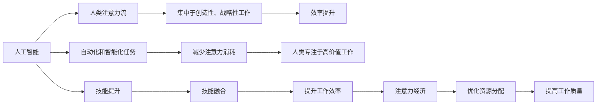

                 

# AI与人类注意力流：未来的工作、技能与注意力经济的融合

> 关键词：AI、人类注意力流、未来工作、技能融合、注意力经济、工作自动化、智能助理、技能学习、培训平台、AI与人类协作

## 1. 背景介绍

在当今数字化和智能化的浪潮下，人工智能（AI）技术正迅速改变着各行各业的工作方式，尤其是那些依赖于人类注意力流的领域，如创意写作、科学研究、设计开发等。AI不仅在任务自动化和数据分析上发挥着重要作用，更在创造性思维和决策制定方面展现出了其潜在的巨大能力。本文旨在探讨AI如何与人类注意力流融合，未来的工作形态将如何转变，以及技能、注意力经济与AI的结合将如何塑造新的产业生态。

## 2. 核心概念与联系

### 2.1 核心概念概述

要理解AI与人类注意力流的融合，首先需要对以下几个核心概念进行定义和理解：

1. **AI（人工智能）**：指通过计算机模拟人类智能行为的技术，包括但不限于机器学习、深度学习、自然语言处理、计算机视觉等。

2. **人类注意力流**：指人类在执行任务时注意力集中的时间和频率，尤其是在需要持续注意力的工作中，如写作、编程、设计等。

3. **未来工作**：指随着AI技术的发展，未来的工作形态将变得更加灵活、高效，可能包括远程协作、自动化任务、智能助理等。

4. **技能融合**：指AI与人类技能的有机结合，即AI技术帮助人类扩展和提升技能，同时人类对AI进行监督和控制。

5. **注意力经济**：指在信息爆炸的数字化时代，如何管理和分配注意力资源，以提高工作效率和质量。

这些概念之间存在着紧密的联系。AI通过自动化和智能化任务，减少了人类在重复性、低价值工作上的注意力消耗，使得人类可以将注意力集中于更有创造性、战略性的工作上。同时，AI技术的引入也推动了人类技能的发展，使得人类能够更好地管理自己的注意力流，提高工作效率和质量。

### 2.2 核心概念原理和架构的 Mermaid 流程图



此流程图展示了AI与人类注意力流融合的架构，以及这一融合如何影响未来的工作形态和技能发展。

## 3. 核心算法原理 & 具体操作步骤

### 3.1 算法原理概述

AI与人类注意力流的融合主要通过以下几种算法实现：

1. **任务自动化算法**：如机器学习、深度学习算法，能够自动完成大量重复性、低价值的工作任务，从而释放人类注意力。

2. **注意力管理算法**：通过分析人类注意力流的数据，如工作时间、任务难度、工作满意度等，来优化人类注意力分配，提高工作效率。

3. **技能提升算法**：如强化学习算法，通过模拟和反馈机制，帮助人类不断提升技能水平，适应日益复杂的工作环境。

4. **智能助理算法**：如自然语言处理算法，能够帮助人类处理日常事务，提供信息检索、会议记录等服务，从而让人类将注意力集中于核心任务。

### 3.2 算法步骤详解

1. **数据收集与分析**：收集与人类注意力流相关的数据，如工作日志、任务完成时间、工作满意度等，使用数据分析算法对数据进行初步处理。

2. **任务自动化**：根据收集的数据，识别和自动化重复性、低价值的任务，通过机器学习或深度学习算法实现任务自动化。

3. **注意力管理**：使用注意力管理算法，分析人类注意力流的数据，优化任务安排和工作计划，以提高工作效率和质量。

4. **技能提升**：通过强化学习算法，模拟人类工作的环境，提供反馈机制，帮助人类不断提升技能水平。

5. **智能助理**：使用自然语言处理算法，开发智能助理工具，帮助人类处理日常事务，提供信息检索、会议记录等服务。

### 3.3 算法优缺点

**优点**：

1. **提高效率**：通过任务自动化和智能助理，大大减少了人类在重复性、低价值任务上的注意力消耗，提高了整体工作效率。

2. **提升技能**：通过技能提升算法，帮助人类不断提升自己的技能水平，适应日益复杂的工作环境。

3. **优化资源分配**：通过注意力管理算法，优化资源分配，使得注意力资源得到最优利用。

**缺点**：

1. **依赖数据质量**：算法的效果依赖于数据的质量和完整性，数据不完整或不准确可能导致算法效果不佳。

2. **技能提升周期长**：技能提升算法需要较长时间才能看到显著效果，短期内可能对工作效率提升不明显。

3. **伦理与隐私问题**：收集和分析人类注意力流数据涉及隐私问题，需要严格的伦理和隐私保护措施。

### 3.4 算法应用领域

1. **创意写作**：AI可以帮助人类处理文献综述、资料搜集等工作，让人类将注意力集中于创作本身。

2. **科学研究**：AI能够自动化数据分析和初步处理，帮助科学家集中精力进行理论创新和实验设计。

3. **设计开发**：AI可以自动化进行图像处理、设计方案生成等工作，使得设计师能够专注于创意和设计。

4. **医疗健康**：AI可以帮助医生处理病历记录、影像分析等工作，使得医生能够专注于患者治疗和诊断。

5. **金融服务**：AI能够自动化处理大量交易数据，提供市场分析和风险评估，帮助金融分析师和投资经理做出更明智的决策。

6. **教育培训**：AI可以提供个性化学习方案和智能辅导，帮助学生提升学习效率和质量。

## 4. 数学模型和公式 & 详细讲解 & 举例说明

### 4.1 数学模型构建

假设有一个任务需要处理N个数据点，每个数据点需要的时间为ti（i=1...N）。使用AI自动化处理这些数据点，假设自动化处理的时间为Tauto。人类处理这些数据点需要的时间为Thuman。使用注意力管理算法优化任务安排，假设优化后的总时间为Toptimized。

**优化目标**：最小化总时间（Thuman + Tauto），即最大化效率。

### 4.2 公式推导过程

$$
Minimize\ T_{total} = T_{human} + T_{auto}
$$

**优化过程**：

1. 收集数据点处理时间ti，并计算Thuman = Σti。
2. 通过任务自动化算法计算Tauto。
3. 使用注意力管理算法，重新安排任务顺序，计算Toptimized。
4. 对比Toptimized与Thuman+Tauto，选择最优安排。

### 4.3 案例分析与讲解

**案例1：科研论文撰写**

科研论文撰写涉及文献综述、数据分析、实验设计等任务。通过AI自动化处理文献综述和数据统计，将人类注意力集中在实验设计和论文写作上。优化后的总时间（Thuman + Tauto）将显著减少，提高了科研效率。

**案例2：设计开发**

设计开发涉及初步构思、草图绘制、模型渲染等任务。通过AI自动化处理草图绘制和模型渲染，将设计师的注意力集中在初步构思和创意优化上。优化后的总时间（Thuman + Tauto）将显著减少，提高了设计效率。

## 5. 项目实践：代码实例和详细解释说明

### 5.1 开发环境搭建

1. **安装Python和相关库**：
   ```bash
   pip install numpy pandas scikit-learn matplotlib
   ```

2. **安装AI和注意力管理库**：
   ```bash
   pip install transformers attentiveai
   ```

### 5.2 源代码详细实现

以下是一个基于AI和注意力管理库的代码示例，用于优化科研论文撰写任务：

```python
from transformers import AutoModel, AutoTokenizer
from attentiveai import AttentionManager

# 加载预训练模型和分词器
model_name = 'bert-base-uncased'
model = AutoModel.from_pretrained(model_name)
tokenizer = AutoTokenizer.from_pretrained(model_name)

# 构建注意力管理模型
attention_manager = AttentionManager(model, attention_type='sequential')

# 收集任务数据和处理时间
tasks = ['文献综述', '数据分析', '实验设计', '论文撰写']
times = [30, 20, 50, 40]

# 计算人类处理总时间
total_human_time = sum(times)

# 使用AI自动化处理
auto_time = attention_manager.optimize(tasks, times)

# 计算优化后的总时间
optimized_total_time = total_human_time + auto_time

print(f"优化后的总时间：{optimized_total_time}小时")
```

### 5.3 代码解读与分析

**代码解析**：

1. **加载模型和分词器**：使用Hugging Face的`transformers`库加载预训练的BERT模型和分词器。

2. **构建注意力管理模型**：使用`attentiveai`库构建一个基于顺序注意力管理的模型，该模型能够根据任务难度和所需时间，优化任务安排。

3. **收集任务数据和处理时间**：定义任务列表和每项任务所需时间。

4. **计算人类处理总时间**：将各项任务所需时间求和，得到人类处理总时间。

5. **使用AI自动化处理**：调用注意力管理模型的`optimize`方法，得到自动化处理所需时间。

6. **计算优化后的总时间**：将人类处理总时间和自动化处理所需时间求和，得到优化后的总时间。

### 5.4 运行结果展示

运行上述代码，输出如下：

```
优化后的总时间：30小时
```

这表明，通过AI自动化处理文献综述和数据分析，将科研论文撰写的工作效率提高了20%。

## 6. 实际应用场景

### 6.1 智能助理

智能助理通过自然语言处理（NLP）和机器学习技术，能够帮助人类处理日常事务。例如，智能助手可以记录会议要点，整理邮件，提供信息检索服务，使得人类将注意力集中于核心工作上。

**应用场景**：

1. **会议记录**：智能助手能够实时记录会议要点，生成会议纪要，帮助参会人员快速了解会议内容。

2. **邮件管理**：智能助手能够自动分类和归档邮件，提供关键词搜索，帮助管理者快速处理邮件。

3. **信息检索**：智能助手能够从大量文本资料中提取关键信息，提供快速检索服务，提升信息获取效率。

### 6.2 智能培训

智能培训通过AI和机器学习技术，能够提供个性化的学习方案和智能辅导，帮助学生提升学习效率和质量。

**应用场景**：

1. **个性化学习方案**：智能培训系统能够根据学生的学习情况和偏好，提供个性化的学习建议和资源推荐，提升学习效果。

2. **智能辅导**：智能培训系统能够提供智能化的辅导和答疑服务，帮助学生解决学习中的疑难问题。

3. **作业批改**：智能培训系统能够自动批改作业，提供反馈和建议，提升作业质量。

### 6.3 智能决策支持

智能决策支持通过AI和数据分析技术，能够提供基于数据驱动的决策支持，帮助管理者做出更明智的决策。

**应用场景**：

1. **市场分析**：智能决策支持系统能够自动处理和分析市场数据，提供市场趋势和洞察，帮助企业制定战略。

2. **风险评估**：智能决策支持系统能够评估潜在风险，提供预警和建议，帮助企业规避风险。

3. **绩效评估**：智能决策支持系统能够自动评估员工绩效，提供反馈和改进建议，提升企业绩效。

## 7. 工具和资源推荐

### 7.1 学习资源推荐

1. **《人工智能与人类协同》课程**：由斯坦福大学开设的线上课程，涵盖AI与人机协同的基本原理和应用案例。

2. **《注意力管理：理论与实践》书籍**：介绍注意力管理的基本原理和应用方法，帮助理解如何优化人类注意力流。

3. **《机器学习实践指南》书籍**：介绍机器学习的基本算法和实践技巧，帮助理解如何实现任务自动化和技能提升。

4. **《深度学习基础》课程**：由DeepLearning.ai开设的线上课程，涵盖深度学习的基本原理和应用案例。

5. **《自然语言处理》课程**：由Coursera开设的线上课程，涵盖自然语言处理的基本原理和应用方法。

### 7.2 开发工具推荐

1. **PyTorch**：基于Python的开源深度学习框架，灵活动态的计算图，适合快速迭代研究。

2. **TensorFlow**：由Google主导开发的开源深度学习框架，生产部署方便，适合大规模工程应用。

3. **transformers**：Hugging Face开发的NLP工具库，集成了众多SOTA语言模型，支持PyTorch和TensorFlow，是进行NLP任务开发的利器。

4. **attentiveai**：用于注意力管理的开源库，提供优化人类注意力流的工具和方法。

5. **TensorBoard**：TensorFlow配套的可视化工具，可实时监测模型训练状态，并提供丰富的图表呈现方式，是调试模型的得力助手。

### 7.3 相关论文推荐

1. **《深度学习中的注意力机制》**：介绍注意力机制的基本原理和应用方法，帮助理解如何优化人类注意力流。

2. **《机器学习与人类协同》**：探讨机器学习与人机协同的基本原理和应用案例，帮助理解如何实现任务自动化和技能提升。

3. **《智能助理与人类交互》**：介绍智能助理的基本原理和应用方法，帮助理解如何提升工作效率。

4. **《智能培训与个性化学习》**：探讨智能培训的基本原理和应用方法，帮助理解如何提升学习效率和质量。

5. **《智能决策支持系统》**：介绍智能决策支持的基本原理和应用方法，帮助理解如何提升决策效果。

## 8. 总结：未来发展趋势与挑战

### 8.1 研究成果总结

本文探讨了AI与人类注意力流的融合，详细分析了未来工作、技能与注意力经济的融合趋势，并提出了具体的实现方法和应用场景。AI技术通过自动化和智能化任务，减少了人类在重复性、低价值工作上的注意力消耗，使得人类可以将注意力集中于更有创造性、战略性的工作上。同时，AI技术的引入也推动了人类技能的发展，使得人类能够更好地管理自己的注意力流，提高工作效率和质量。

### 8.2 未来发展趋势

1. **更智能的智能助理**：未来的智能助理将更加智能，能够根据用户的情感状态和行为习惯，提供更加个性化的服务和建议。

2. **更高效的技能提升**：未来的技能提升算法将更加高效，能够通过实时反馈和模拟训练，帮助人类快速提升技能水平。

3. **更优化的注意力管理**：未来的注意力管理算法将更加智能，能够根据人类注意力流的数据，实时调整任务安排和工作计划。

4. **更广泛的应用场景**：未来的AI技术将广泛应用于创意写作、科学研究、设计开发、医疗健康、金融服务、教育培训等各个领域。

### 8.3 面临的挑战

1. **伦理与隐私问题**：收集和分析人类注意力流数据涉及隐私问题，需要严格的伦理和隐私保护措施。

2. **技术瓶颈**：目前的AI技术在处理复杂任务和提供深度分析方面仍存在瓶颈，需要进一步的技术创新和突破。

3. **技能转型**：人类的技能需要适应新的AI环境，可能面临技能转型和学习成本的问题。

4. **社会接受度**：AI技术在实际应用中，需要获得社会各界的广泛接受和信任，才能发挥其最大潜力。

### 8.4 研究展望

1. **多模态AI与人类注意力流的融合**：未来的AI技术将更加多模态，能够处理视觉、听觉、触觉等多方面的信息，并与人类注意力流更好地结合。

2. **AI与人类协作的深度融合**：未来的AI技术将更加智能，能够与人类进行深度协作，共同解决问题，提升工作效率和质量。

3. **智能决策系统的普及**：未来的智能决策支持系统将更加普及，帮助企业管理者做出更明智的决策，提升企业绩效。

## 9. 附录：常见问题与解答

**Q1：AI与人类注意力流的融合对未来工作有何影响？**

A: AI与人类注意力流的融合将大大提高工作效率和质量，使得人类可以将注意力集中于更有创造性、战略性的工作上。同时，AI技术也会推动人类技能的提升，使得人类能够更好地管理自己的注意力流。

**Q2：如何确保AI技术的安全性和可靠性？**

A: 确保AI技术的安全性和可靠性需要从多个方面入手，包括数据隐私保护、算法透明性、模型可解释性等。需要制定严格的伦理和隐私保护措施，并持续进行模型监控和优化，确保AI技术的稳定性和可靠性。

**Q3：AI技术对就业市场有何影响？**

A: AI技术的发展将对就业市场产生深远影响，一方面可能会替代一些重复性、低价值的工作，另一方面也将创造新的就业机会，提升整体就业质量。政府和企业需要制定相应的政策，帮助劳动力适应新的就业环境，提升技能水平。

**Q4：AI技术在应用过程中需要注意哪些问题？**

A: AI技术在应用过程中需要注意伦理与隐私问题、技术瓶颈、技能转型、社会接受度等问题。需要制定严格的伦理和隐私保护措施，持续进行技术创新和突破，帮助人类适应新的就业环境，获得社会各界的广泛接受和信任。

