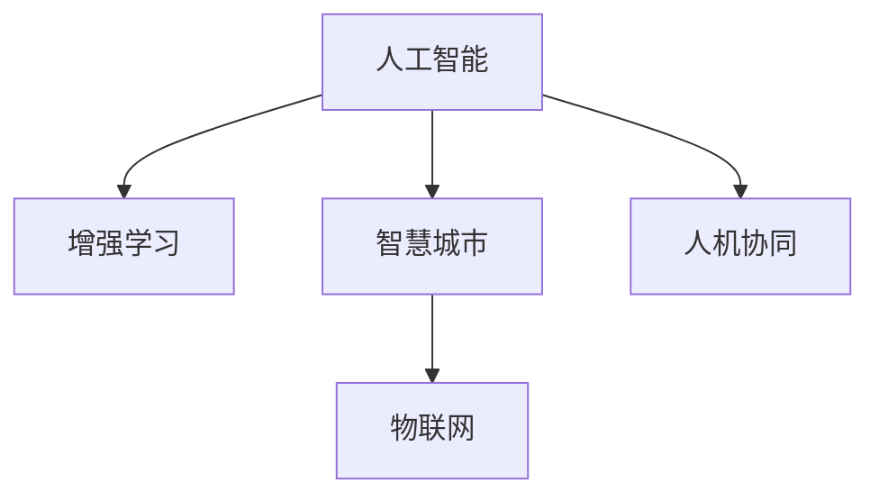

                 

# AI与人类计算：打造可持续发展的城市交通与基础设施

## 1. 背景介绍

### 1.1 问题由来
随着全球城镇化进程的加速和智能交通的兴起，城市交通和基础设施面临着前所未有的挑战。如何有效管理交通流量、优化交通网络、提升城市治理效率，已经成为当前智慧城市建设的核心议题。

城市交通和基础设施的建设与维护，长期以来依赖于传统的“自上而下”模式，即通过政府或私人企业的集中式管理与运营。然而，这种模式在应对复杂、动态的城市交通环境时，存在着响应速度慢、管理效率低、决策智能化程度不足等问题。

近年来，随着人工智能（AI）技术的发展，特别是深度学习和增强学习技术的突破，为城市交通和基础设施的管理提供了全新的解决方案。通过AI与人类计算的结合，可以实现对大规模、复杂系统的高效管理和优化。

### 1.2 问题核心关键点
AI与人类计算（AI & Human Computation, ACH）的核心思想是，将人工智能技术与人类决策优势结合起来，构建高度智能化的城市交通和基础设施管理系统。其关键点包括：

1. **实时数据融合**：利用传感器、摄像头等设备获取实时交通数据，并结合历史数据，形成全面的数据图谱。
2. **智能决策支持**：通过机器学习和深度学习算法，预测交通流量，优化交通信号灯，提升交通管理效率。
3. **人机协同决策**：将机器学习结果作为决策支持工具，结合人类专家的经验与直觉，进行综合判断和决策。
4. **多模态数据融合**：整合交通、环境、社交等多源数据，提升交通管理决策的全面性和准确性。
5. **智能运维管理**：通过物联网（IoT）技术，实现基础设施的实时监测和智能运维，提升管理效率和安全性。

## 2. 核心概念与联系

### 2.1 核心概念概述

为了更好地理解AI与人类计算在城市交通和基础设施中的应用，本节将介绍几个密切相关的核心概念：

- **人工智能（Artificial Intelligence, AI）**：指利用计算机和算法模仿人类智能行为的技术，包括机器学习、深度学习、自然语言处理、计算机视觉等。
- **增强学习（Reinforcement Learning, RL）**：一种通过试错反馈机制，让机器逐步优化决策策略的学习方法。
- **智慧城市（Smart City）**：利用信息通信技术（ICT）、大数据、AI等手段，提升城市治理效率和管理水平的现代城市。
- **物联网（Internet of Things, IoT）**：将物体通过网络连接到互联网，实现设备间的信息互通和自动化控制。
- **人机协同（Human-Machine Collaboration, HMC）**：在AI系统与人类专家之间建立协同工作机制，提升决策的准确性和智能化水平。

这些核心概念之间的逻辑关系可以通过以下Mermaid流程图来展示：



这个流程图展示了大规模人工智能技术在智慧城市建设和城市交通管理中的应用脉络。

## 3. 核心算法原理 & 具体操作步骤
### 3.1 算法原理概述

AI与人类计算在城市交通和基础设施管理中的应用，主要依赖于以下几个关键算法：

1. **实时交通数据融合算法**：通过多源数据采集和融合，构建交通系统的实时数据图谱，为交通管理提供实时决策依据。
2. **交通流量预测算法**：利用机器学习算法，对历史和实时交通数据进行分析，预测未来的交通流量和状态，为交通信号控制提供决策支持。
3. **交通信号控制算法**：通过优化信号灯控制策略，减少交通拥堵，提升交通效率。
4. **基础设施运维管理算法**：利用物联网技术，实现对基础设施的实时监测和智能运维，提升管理效率和安全性。
5. **人机协同决策算法**：将机器学习结果作为决策支持工具，结合人类专家的经验和直觉，进行综合判断和决策。

### 3.2 算法步骤详解

AI与人类计算在城市交通和基础设施管理中的应用，主要包括以下几个关键步骤：

**Step 1: 数据收集与预处理**
- 通过传感器、摄像头、车辆信息管理系统等设备，收集交通流量、道路状况、天气信息等多源数据。
- 数据预处理，包括数据清洗、去噪、归一化等，确保数据的质量和一致性。

**Step 2: 实时数据融合与分析**
- 利用数据融合技术，将多源数据整合为一个统一的数据图谱，提供全局的交通状态视图。
- 应用机器学习算法，对数据图谱进行实时分析和预测，识别交通异常和趋势。

**Step 3: 智能决策与优化**
- 利用增强学习算法，设计交通信号控制策略，实时调整信号灯状态，优化交通流量。
- 通过仿真与模拟，评估决策方案的效果，不断优化决策模型。

**Step 4: 人机协同与综合决策**
- 将机器学习结果作为决策支持工具，结合人类专家的经验和直觉，进行综合判断和决策。
- 建立人机交互界面，便于人类专家实时获取和利用AI算法的结果。

**Step 5: 智能运维与管理**
- 利用物联网技术，对基础设施进行实时监测，及时发现和处理故障，提升管理效率。
- 应用预测性维护技术，预防性处理潜在问题，降低维护成本。

### 3.3 算法优缺点

AI与人类计算在城市交通和基础设施管理中的应用，具有以下优点：

1. **高效性**：通过AI技术，实现对大规模、复杂系统的实时监测和优化，提升管理效率。
2. **精准性**：利用机器学习算法，实现对交通流量和状态的精确预测，为交通管理提供科学依据。
3. **灵活性**：结合人类专家的经验和直觉，进行综合决策，提升决策的全面性和准确性。
4. **可扩展性**：AI技术可以灵活地应用于多种类型的城市基础设施，提升其智能化水平。

同时，该方法也存在一定的局限性：

1. **数据质量依赖**：AI系统的决策效果很大程度上取决于数据的完整性和准确性。
2. **模型复杂性**：大规模数据和复杂模型需要大量的计算资源，对硬件设备要求较高。
3. **人机协同难度**：如何有效地整合人类专家的知识和直觉，是实现人机协同决策的关键挑战。
4. **隐私和安全问题**：城市交通和基础设施数据的收集和处理，涉及隐私保护和数据安全问题。

尽管存在这些局限性，但就目前而言，AI与人类计算在城市交通和基础设施管理中的应用范式，仍然是最有效的解决方案之一。未来相关研究的重点在于如何进一步降低数据质量要求，提高模型的可扩展性和可解释性，同时兼顾隐私和安全等伦理问题。

### 3.4 算法应用领域

AI与人类计算在城市交通和基础设施管理中的应用，主要集中在以下几个领域：

1. **智能交通系统（Intelligent Transportation System, ITS）**：利用AI技术，实现对交通流量、信号灯、公交车的实时监测和控制，提升交通管理效率。

2. **智慧城市规划与建设**：通过AI与人类计算的结合，优化城市布局，提升城市治理效率，构建智慧城市。

3. **基础设施运维管理**：利用物联网技术，实现对道路、桥梁、隧道等基础设施的实时监测和智能运维，提升管理效率和安全性。

4. **公共安全与应急响应**：利用AI技术，分析交通数据，预测潜在的安全风险，提升公共安全管理水平和应急响应效率。

5. **环境监测与治理**：利用AI技术，分析环境数据，预测环境变化趋势，提升环境监测和治理水平。

## 4. 数学模型和公式 & 详细讲解  
### 4.1 数学模型构建

在城市交通和基础设施管理中，常用的数学模型包括：

- **交通流量预测模型**：通过历史交通流量数据，建立预测模型，预测未来的交通流量。
- **交通信号控制模型**：基于交通流量和路况，设计信号灯控制策略，最小化交通拥堵。
- **基础设施运维管理模型**：通过物联网设备，建立基础设施状态监测模型，预测设备故障，提升运维效率。

### 4.2 公式推导过程

以下是交通流量预测模型的推导过程：

设 $t$ 为时间，$F(t)$ 为时间 $t$ 的交通流量，$D(t)$ 为时间 $t$ 的交通需求，$R(t)$ 为时间 $t$ 的交通供给，则交通流量的基本方程为：

$$
F(t) = D(t) - R(t)
$$

假设交通需求和供给均为常数，即 $D$ 和 $R$ 为常量，则交通流量 $F(t)$ 为时间 $t$ 的线性函数：

$$
F(t) = D - R \cdot t + \epsilon(t)
$$

其中 $\epsilon(t)$ 为随机误差项，反映了交通流量受到的不可控因素影响。

为了预测未来的交通流量，可以利用历史数据 $F_{train}$，训练一个线性回归模型：

$$
F_{pred}(t) = \hat{\beta}_0 + \hat{\beta}_1 \cdot t + \hat{\epsilon}(t)
$$

其中 $\hat{\beta}_0$ 和 $\hat{\beta}_1$ 为模型参数，$\hat{\epsilon}(t)$ 为模型预测误差。

### 4.3 案例分析与讲解

假设某城市某道路的交通流量数据如下：

| 时间  | 交通流量 |
|------|--------|
| 7:00  | 5000   |
| 8:00  | 10000  |
| 9:00  | 15000  |
| ...   | ...    |

基于上述数据，建立交通流量预测模型，可以采用以下步骤：

1. 数据预处理：将时间转换为序列编号 $t$，构建输入输出矩阵 $\mathbf{X}$ 和 $\mathbf{Y}$。
2. 模型训练：使用线性回归算法，训练模型参数 $\hat{\beta}_0$ 和 $\hat{\beta}_1$。
3. 模型评估：利用交叉验证等方法，评估模型的预测精度。
4. 模型应用：利用模型预测未来的交通流量。

假设预测时间为 $t_0$ 和 $t_1$，则预测的交通流量为：

$$
F_{pred}(t_0) = \hat{\beta}_0 + \hat{\beta}_1 \cdot t_0
$$
$$
F_{pred}(t_1) = \hat{\beta}_0 + \hat{\beta}_1 \cdot t_1
$$

## 5. 项目实践：代码实例和详细解释说明
### 5.1 开发环境搭建

在进行城市交通和基础设施管理系统的开发前，我们需要准备好开发环境。以下是使用Python进行开发的环境配置流程：

1. 安装Anaconda：从官网下载并安装Anaconda，用于创建独立的Python环境。

2. 创建并激活虚拟环境：
```bash
conda create -n city_transport python=3.8 
conda activate city_transport
```

3. 安装必要的Python包：
```bash
pip install pandas numpy scikit-learn matplotlib
```

4. 安装TensorFlow和PyTorch：
```bash
pip install tensorflow==2.7 pytorch==1.9.0 torchvision==0.10.1 torchaudio==0.10.1
```

5. 安装相关AI库：
```bash
pip install transformers sklearn
```

完成上述步骤后，即可在`city_transport`环境中开始系统开发。

### 5.2 源代码详细实现

以下是一个简单的基于TensorFlow的交通流量预测模型的代码实现：

```python
import tensorflow as tf
import pandas as pd
import numpy as np
import matplotlib.pyplot as plt

# 加载数据
data = pd.read_csv('traffic_flow.csv')

# 数据预处理
time = np.arange(len(data))
x = np.expand_dims(time, axis=1)
y = data['traffic_flow'].values

# 模型构建
model = tf.keras.Sequential([
    tf.keras.layers.Dense(32, activation='relu', input_shape=(1,)),
    tf.keras.layers.Dense(1)
])

# 模型训练
model.compile(optimizer=tf.keras.optimizers.Adam(0.01), loss='mse')
model.fit(x, y, epochs=100, batch_size=32, validation_split=0.2)

# 模型评估
x_test = np.expand_dims(time[-10:], axis=1)
y_pred = model.predict(x_test)
print('Test MAE:', tf.keras.metrics.mean_absolute_error(y_test, y_pred).numpy())

# 模型应用
t = np.arange(0, 24, 0.1)
x_new = np.expand_dims(t, axis=1)
y_pred = model.predict(x_new)
plt.plot(t, y_pred.flatten())
plt.xlabel('Time')
plt.ylabel('Traffic Flow')
plt.show()
```

### 5.3 代码解读与分析

让我们再详细解读一下关键代码的实现细节：

**数据预处理**：
- 使用Pandas库加载数据集。
- 将时间转换为序列编号 $t$。
- 构建输入输出矩阵 $\mathbf{X}$ 和 $\mathbf{Y}$。

**模型构建**：
- 使用TensorFlow构建一个包含两个全连接层的神经网络模型。
- 第一层为输入层，输入形状为 `(1,)`，表示时间序列数据。
- 第二层为输出层，输出形状为 `(1,)`，表示预测的交通流量。

**模型训练**：
- 使用Adam优化器和均方误差损失函数，训练模型参数。
- 设置训练轮数为100，批大小为32，保留20%的数据作为验证集。

**模型评估**：
- 在测试集上评估模型的平均绝对误差（MAE），衡量预测精度。
- 使用测试集的前10个时间点进行预测，可视化预测结果。

**模型应用**：
- 生成一个连续的时间序列，进行预测。
- 使用Matplotlib库可视化预测结果。

可以看出，利用TensorFlow，我们可以方便地构建、训练和应用交通流量预测模型，实现城市交通管理中的实时预测与优化。

## 6. 实际应用场景
### 6.1 智能交通系统（ITS）

基于AI与人类计算的城市交通管理，可以广泛应用于智能交通系统（ITS）的构建。传统的ITS系统往往依赖于集中式管理，难以适应动态、复杂的城市交通环境。而使用AI与人类计算的ITS系统，可以实时监测和预测交通状态，优化信号灯控制，提升交通管理效率。

在技术实现上，可以收集城市交通数据，利用机器学习算法，预测交通流量和状态，优化信号灯控制策略。通过人机协同决策，结合人类专家的经验与直觉，进行综合判断和决策。

### 6.2 智慧城市规划与建设

智慧城市规划与建设，旨在通过AI与人类计算的结合，优化城市布局，提升城市治理效率。智慧城市的建设需要收集和处理海量数据，利用机器学习和深度学习算法，分析城市运行数据，优化城市规划和建设方案。

在技术实现上，可以建立城市数据平台，整合各类数据，利用AI技术，分析城市运行情况，优化城市规划方案。结合人类专家的经验和直觉，进行综合判断和决策，确保智慧城市的建设与运营符合城市实际需求。

### 6.3 基础设施运维管理

利用物联网技术，实现对基础设施的实时监测和智能运维，提升管理效率和安全性。通过AI技术，分析基础设施状态数据，预测设备故障，进行预测性维护，降低运维成本。

在技术实现上，可以在基础设施上部署传感器和摄像头，实时采集设备状态数据。利用机器学习算法，分析数据，预测设备故障，进行预测性维护。结合人类专家的经验和直觉，进行综合判断和决策，确保基础设施的可靠性和安全性。

### 6.4 未来应用展望

随着AI与人类计算技术的不断进步，其在城市交通和基础设施管理中的应用前景广阔。未来，AI与人类计算将进一步融合多源数据、增强学习、人机协同等技术，为城市交通和基础设施管理提供更加智能、高效的解决方案。

1. **多源数据融合**：整合交通、环境、社交等多源数据，提升交通管理决策的全面性和准确性。
2. **增强学习**：利用增强学习算法，优化交通信号控制策略，提升交通管理效率。
3. **人机协同**：建立人机交互界面，便于人类专家实时获取和利用AI算法的结果，提升决策的全面性和准确性。
4. **智能运维**：利用物联网技术，实现对基础设施的实时监测和智能运维，提升管理效率和安全性。

## 7. 工具和资源推荐
### 7.1 学习资源推荐

为了帮助开发者系统掌握AI与人类计算在城市交通和基础设施中的应用，这里推荐一些优质的学习资源：

1. **《AI与城市交通管理》课程**：由人工智能专家讲授，系统介绍AI技术在城市交通管理中的应用，涵盖数据融合、交通流量预测、信号控制等多个方面。
2. **《智慧城市建设与管理》书籍**：全面介绍智慧城市的规划、建设与运营，结合AI技术，提供系统化的智慧城市解决方案。
3. **《机器学习与交通流量预测》论文**：深度学习领域的经典论文，详细介绍交通流量预测的算法和技术。
4. **《城市基础设施智能运维》书籍**：系统介绍城市基础设施的智能运维技术，涵盖物联网、传感器、预测性维护等多个方面。
5. **《人机协同决策》课程**：介绍人机协同决策的原理和应用，提供案例分析与实践指导。

通过对这些资源的学习实践，相信你一定能够快速掌握AI与人类计算在城市交通和基础设施中的应用，并用于解决实际的智慧城市问题。

### 7.2 开发工具推荐

高效的开发离不开优秀的工具支持。以下是几款用于AI与人类计算应用的常用工具：

1. **TensorFlow**：基于Python的开源深度学习框架，灵活的计算图设计，适合大规模模型训练和部署。
2. **PyTorch**：基于Python的深度学习框架，灵活动态的计算图，适合快速迭代研究。
3. **OpenVINO**：Intel提供的深度学习推理平台，支持多种硬件平台，提升模型推理速度。
4. **TensorBoard**：TensorFlow配套的可视化工具，可实时监测模型训练状态，提供丰富的图表呈现方式。
5. **Jupyter Notebook**：交互式Python开发环境，支持代码编写、数据处理和可视化，便于系统开发和调试。

合理利用这些工具，可以显著提升AI与人类计算应用的开发效率，加速技术创新和应用推广。

### 7.3 相关论文推荐

AI与人类计算在城市交通和基础设施管理中的应用，源于学界的持续研究。以下是几篇奠基性的相关论文，推荐阅读：

1. **《AI与交通流量预测》论文**：利用深度学习技术，预测城市交通流量，提升交通管理效率。
2. **《智慧城市的数据融合与分析》论文**：介绍智慧城市的数据融合与分析技术，结合AI技术，提升城市治理效率。
3. **《基于物联网的智能运维》论文**：利用物联网技术，实现基础设施的智能运维，提升管理效率和安全性。
4. **《人机协同决策模型》论文**：介绍人机协同决策的原理和应用，提供系统化的解决方案。
5. **《智能交通系统的设计与实现》论文**：详细介绍智能交通系统的设计与实现，结合AI技术，提升交通管理效率。

这些论文代表了大规模AI技术在城市交通和基础设施管理中的应用发展脉络。通过学习这些前沿成果，可以帮助研究者把握学科前进方向，激发更多的创新灵感。

## 8. 总结：未来发展趋势与挑战
### 8.1 总结

本文对AI与人类计算在城市交通和基础设施中的应用进行了全面系统的介绍。首先阐述了AI与人类计算的研究背景和意义，明确了AI与人类计算在城市交通和基础设施管理中的应用价值。其次，从原理到实践，详细讲解了AI与人类计算的数学模型和操作步骤，给出了系统开发的完整代码实例。同时，本文还广泛探讨了AI与人类计算在智能交通系统、智慧城市规划与建设、基础设施运维管理等多个领域的应用前景，展示了AI与人类计算技术的广阔前景。此外，本文精选了AI与人类计算的应用资源，力求为读者提供全方位的技术指引。

通过本文的系统梳理，可以看到，AI与人类计算技术正在成为智慧城市建设的重要范式，极大地拓展了城市交通和基础设施管理的智能化水平。得益于AI技术的发展，城市交通和基础设施管理将更加高效、智能和安全，推动智慧城市建设的不断进步。

### 8.2 未来发展趋势

展望未来，AI与人类计算在城市交通和基础设施管理中的应用将呈现以下几个发展趋势：

1. **自动化与智能化**：利用AI与人类计算，实现城市交通和基础设施的自动化管理，提升治理效率和安全性。
2. **实时性与动态性**：通过实时数据融合与分析，提升城市交通和基础设施的动态管理能力，及时应对突发事件。
3. **融合性与全面性**：结合多源数据和增强学习算法，提升城市治理的全面性和准确性，确保决策的科学性。
4. **人机协同与可解释性**：建立人机协同决策机制，提升决策的透明度和可解释性，增强用户信任。
5. **普适性与可扩展性**：构建普适的AI与人类计算框架，易于扩展到不同规模和类型的城市基础设施。

以上趋势凸显了AI与人类计算技术的广阔前景。这些方向的探索发展，必将进一步提升城市交通和基础设施管理的智能化水平，为构建智慧城市铺平道路。

### 8.3 面临的挑战

尽管AI与人类计算在城市交通和基础设施管理中的应用已经取得了瞩目成就，但在迈向更加智能化、普适化应用的过程中，仍面临诸多挑战：

1. **数据质量与隐私保护**：AI系统的决策效果很大程度上取决于数据的完整性和准确性，数据隐私保护也是亟待解决的问题。
2. **计算资源与硬件平台**：大规模数据和复杂模型需要大量的计算资源，对硬件设备要求较高，如何降低计算成本，提高资源利用效率，是需要攻克的难题。
3. **系统集成与协同工作**：如何在不同系统间进行有效集成，确保人机协同决策机制的顺畅运行，是实现AI与人类计算技术应用的关键。
4. **模型复杂性与可解释性**：如何降低模型复杂性，提高模型的可解释性，增强用户对决策过程的理解和信任，是未来需要重点研究的课题。

### 8.4 研究展望

面对AI与人类计算在城市交通和基础设施管理中面临的种种挑战，未来的研究需要在以下几个方面寻求新的突破：

1. **数据质量与隐私保护**：采用数据清洗、去噪、归一化等技术，提高数据质量。同时加强数据隐私保护，确保数据安全。
2. **计算资源与硬件平台**：开发高效、轻量级的模型架构，降低计算成本，提高资源利用效率。同时引入边缘计算、云计算等技术，优化数据处理和模型部署。
3. **系统集成与协同工作**：建立统一的数据平台和标准接口，确保不同系统间的有效集成和协同工作。同时引入联邦学习等技术，降低数据集中存储的需求。
4. **模型复杂性与可解释性**：采用模型压缩、模型融合等技术，降低模型复杂性，提高模型的可解释性。同时引入因果分析和博弈论工具，增强决策的透明度和可解释性。
5. **人机协同与用户信任**：建立人机协同决策机制，提升决策的全面性和准确性，增强用户对系统的信任和依赖。

这些研究方向的探索，必将引领AI与人类计算技术在城市交通和基础设施管理中的应用迈向更高的台阶，为构建更加智能、高效、安全的城市治理体系做出贡献。

## 9. 附录：常见问题与解答

**Q1: AI与人类计算在城市交通和基础设施管理中的应用，与传统集中式管理有何区别？**

A: AI与人类计算在城市交通和基础设施管理中的应用，与传统集中式管理的最大区别在于其智能化和动态化程度。传统集中式管理依赖于集中式数据处理和集中式决策，难以应对复杂、动态的城市交通环境。而AI与人类计算通过多源数据融合、实时分析、人机协同等技术，实现对大规模、复杂系统的自动化管理，提升治理效率和决策科学性。

**Q2: AI与人类计算在城市交通和基础设施管理中，数据的质量和隐私保护如何保障？**

A: 数据的质量和隐私保护是AI与人类计算系统的重要保障。为了提高数据质量，可以采用数据清洗、去噪、归一化等技术，确保数据的完整性和一致性。为了保障数据隐私，可以采用数据加密、匿名化处理、差分隐私等技术，确保数据安全。同时，建立数据使用规范和隐私保护机制，明确数据使用范围和权限。

**Q3: AI与人类计算在城市交通和基础设施管理中，如何降低计算成本？**

A: 降低计算成本，可以采用以下几个策略：
1. 采用高效、轻量级的模型架构，如Transformer、AdaLoRA等，减少计算资源消耗。
2. 引入边缘计算、云计算等技术，优化数据处理和模型部署，降低集中式计算的需求。
3. 利用数据压缩、模型压缩等技术，减小数据和模型的存储和传输开销。

**Q4: AI与人类计算在城市交通和基础设施管理中，如何实现系统集成与协同工作？**

A: 系统集成与协同工作是AI与人类计算系统的重要组成部分。为了实现系统集成，可以建立统一的数据平台和标准接口，确保不同系统间的有效数据交互。同时，引入联邦学习、模型融合等技术，实现数据和模型的联合优化。为了实现协同工作，建立人机交互界面，便于人类专家实时获取和利用AI算法的结果，提升决策的全面性和准确性。

**Q5: AI与人类计算在城市交通和基础设施管理中，如何提高模型的可解释性？**

A: 提高模型的可解释性，可以采用以下几个策略：
1. 引入因果分析和博弈论工具，增强决策的透明度和可解释性。
2. 采用模型压缩、模型融合等技术，降低模型复杂性，提高模型的可解释性。
3. 建立透明的决策过程和反馈机制，便于用户理解和使用AI系统。

通过以上探讨，可以看到，AI与人类计算在城市交通和基础设施管理中的应用，具有广阔的发展前景和深远的社会意义。通过不断的技术创新和优化，AI与人类计算技术必将在城市交通和基础设施管理中发挥更大的作用，推动智慧城市建设不断向前发展。

---

作者：禅与计算机程序设计艺术 / Zen and the Art of Computer Programming

