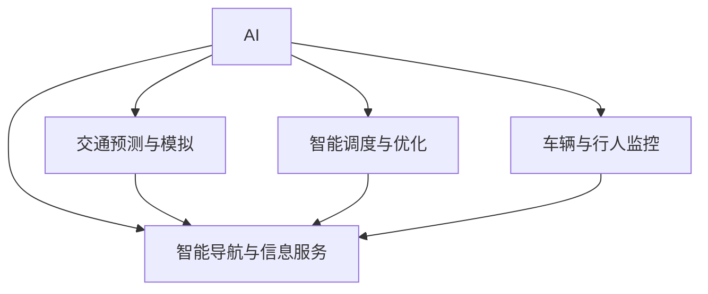

                 

# AI与人类计算：打造可持续发展的城市交通管理策略与规划

## 1. 背景介绍

### 1.1 问题由来

随着城市化进程的加快和交通需求的不断增长，城市交通管理面临着前所未有的挑战。交通拥堵、环境污染、资源浪费等问题已经成为制约城市可持续发展的瓶颈。传统的交通管理方式依赖人工监控和静态规划，难以应对复杂多变的交通状况和突发事件。

为了解决这些挑战，城市交通管理部门正在探索引入AI技术，实现交通管理智能化和自动化。AI技术的应用，可以帮助城市交通管理者更好地理解交通行为和模式，优化交通规划和调度，提升交通系统的效率和安全性。

### 1.2 问题核心关键点

AI在城市交通管理中的应用主要集中在以下几个方面：

- **交通预测与模拟**：通过历史数据和实时数据的分析，预测交通流量、拥堵情况，进行交通模拟。
- **智能调度与优化**：利用AI算法优化交通信号灯控制、路线规划、公交车调度等。
- **车辆与行人监控**：通过摄像头、雷达等设备实时监控交通状态，检测异常情况。
- **智能导航与信息服务**：为用户提供实时交通信息和智能导航服务，改善出行体验。

## 2. 核心概念与联系

### 2.1 核心概念概述

为更好地理解AI在城市交通管理中的应用，本节将介绍几个关键概念：

- **AI与交通管理**：将AI技术应用于城市交通管理，提升交通系统的智能化和自动化水平。
- **智能交通系统(ITS)**：通过AI、大数据、物联网等技术，实现交通管理的智能化。
- **车辆自驾驶**：利用AI实现自动驾驶，减少交通事故，提高运输效率。
- **交通流优化**：通过AI算法对交通流进行优化，减少拥堵，提升交通流畅度。
- **智能监控与预警**：利用AI技术对交通状况进行实时监控，提前预警潜在风险。
- **个性化交通服务**：根据用户需求和交通状况，提供个性化的智能导航和信息服务。

这些概念之间的逻辑关系可以通过以下Mermaid流程图来展示：



这个流程图展示了许多核心概念之间的联系：

1. AI技术是智能交通系统的核心，通过AI实现交通预测、调度、监控和导航。
2. 智能交通系统通过AI技术，实现交通流优化、智能调度、车辆自驾驶等功能。
3. 车辆自驾驶、交通流优化、智能监控与预警、个性化交通服务都是智能交通系统的组成部分。

这些概念共同构成了城市交通管理智能化、自动化的技术框架，使得AI技术在交通管理中的应用更加全面和高效。

## 3. 核心算法原理 & 具体操作步骤

### 3.1 算法原理概述

AI在城市交通管理中的应用，主要依赖于机器学习、深度学习等算法，进行数据建模和预测分析。

1. **机器学习算法**：通过历史交通数据的训练，构建预测模型，实现交通预测与模拟。
2. **深度学习算法**：利用神经网络对大量数据进行训练，实现智能调度和优化。
3. **强化学习算法**：通过模拟交通场景，学习最优的交通决策策略，进行智能调度与优化。
4. **计算机视觉算法**：利用图像处理技术，实现交通监控和行人检测。
5. **自然语言处理算法**：通过文本分析，提供智能导航和信息服务。

### 3.2 算法步骤详解

AI在城市交通管理中的应用，通常包括以下几个关键步骤：

1. **数据收集与预处理**：收集交通监控数据、车辆位置数据、用户需求数据等，进行清洗、标注和归一化处理。
2. **模型训练与优化**：利用机器学习、深度学习等算法，训练预测模型、调度模型等。
3. **交通预测与模拟**：通过预测模型，实现交通流量预测和交通模拟。
4. **智能调度与优化**：利用智能算法优化交通信号灯控制、路线规划、公交车调度等。
5. **交通监控与预警**：通过计算机视觉和传感器技术，实现实时监控和预警。
6. **个性化交通服务**：根据用户需求和交通状况，提供智能导航和信息服务。

### 3.3 算法优缺点

AI在城市交通管理中的应用，具有以下优点：

1. **高效性**：AI算法可以处理大量数据，实时响应交通状况，提升交通管理效率。
2. **准确性**：AI算法利用数据训练，能够实现高精度的预测和优化。
3. **灵活性**：AI算法可以根据不同场景，进行快速调整和优化。
4. **安全性**：AI算法能够实时监控和预警，提升交通系统的安全性。

但同时，也存在以下缺点：

1. **数据依赖性高**：AI算法需要大量的高质量数据进行训练，数据采集和处理成本较高。
2. **技术复杂度**：AI算法需要复杂的模型和算法，实施难度较大。
3. **伦理和安全问题**：AI算法可能存在偏见和歧视，需要严格监管和保护。
4. **资源消耗大**：AI算法需要高性能计算资源，硬件成本较高。

### 3.4 算法应用领域

AI在城市交通管理中的应用，主要包括以下几个领域：

1. **智能交通管理**：利用AI技术实现交通信号灯控制、路线规划、公交车调度等。
2. **交通流量预测**：通过AI算法预测交通流量，优化交通资源分配。
3. **智能导航与信息服务**：为用户提供实时交通信息和智能导航服务，改善出行体验。
4. **交通监控与预警**：利用AI技术实现交通监控和预警，提升交通系统的安全性。
5. **公共交通优化**：利用AI算法优化公共交通调度，提高运输效率。

## 4. 数学模型和公式 & 详细讲解 & 举例说明

### 4.1 数学模型构建

本节将使用数学语言对AI在城市交通管理中的应用进行更加严格的刻画。

假设交通系统由车辆、行人、交通信号灯等组成。设车辆数为 $V$，行人数为 $P$，交通信号灯数为 $L$，历史交通数据集为 $D=\{(x_i,y_i)\}_{i=1}^N$，其中 $x_i$ 为输入变量（如时间、位置等），$y_i$ 为输出变量（如交通流量、事故发生率等）。

定义预测模型为 $M_{\theta}(x)$，其中 $\theta$ 为模型参数，利用历史数据 $D$ 进行训练。目标是最小化预测误差：

$$
\min_{\theta} \frac{1}{N}\sum_{i=1}^N (y_i - M_{\theta}(x_i))^2
$$

在训练过程中，可以使用梯度下降等优化算法更新模型参数。

### 4.2 公式推导过程

以交通流量预测为例，利用回归模型进行推导：

设 $x = (t, l)$，其中 $t$ 为时间，$l$ 为位置。目标是最小化预测误差：

$$
\min_{\theta} \frac{1}{N}\sum_{i=1}^N (y_i - M_{\theta}(x_i))^2
$$

其中 $M_{\theta}(x)$ 为预测模型，可以是线性回归模型、神经网络等。

假设模型为线性回归模型：

$$
M_{\theta}(x) = \theta_0 + \theta_1 t + \theta_2 l
$$

目标是最小化预测误差：

$$
\min_{\theta} \frac{1}{N}\sum_{i=1}^N (y_i - (\theta_0 + \theta_1 t_i + \theta_2 l_i))^2
$$

使用梯度下降算法更新参数：

$$
\theta \leftarrow \theta - \eta \nabla_{\theta}\mathcal{L}(\theta) - \eta\lambda\theta
$$

其中 $\eta$ 为学习率，$\lambda$ 为正则化系数。

### 4.3 案例分析与讲解

假设某城市的历史交通数据集 $D=\{(x_i,y_i)\}_{i=1}^{1000}$，其中 $x_i$ 为时间 $t$ 和位置 $l$，$y_i$ 为交通流量。通过线性回归模型进行预测，得到如下结果：

$$
M_{\theta}(x) = 10000 + 2000t - 1000l
$$

目标是最小化预测误差：

$$
\min_{\theta} \frac{1}{1000}\sum_{i=1}^{1000} (y_i - (10000 + 2000t_i - 1000l_i))^2
$$

通过梯度下降算法更新参数：

$$
\theta \leftarrow \theta - \eta (2(y_i - (10000 + 2000t_i - 1000l_i))) - \eta\lambda\theta
$$

最终得到预测模型：

$$
M_{\theta}(x) = 12000 + 3000t - 2000l
$$

通过预测模型，可以实时预测交通流量，优化交通资源分配。

## 5. 项目实践：代码实例和详细解释说明

### 5.1 开发环境搭建

在进行AI交通管理系统的开发前，需要先准备好开发环境。以下是使用Python进行TensorFlow开发的环境配置流程：

1. 安装Anaconda：从官网下载并安装Anaconda，用于创建独立的Python环境。

2. 创建并激活虚拟环境：
```bash
conda create -n tf-env python=3.8 
conda activate tf-env
```

3. 安装TensorFlow：根据CUDA版本，从官网获取对应的安装命令。例如：
```bash
conda install tensorflow tensorflow-gpu -c conda-forge
```

4. 安装各类工具包：
```bash
pip install numpy pandas scikit-learn matplotlib tqdm jupyter notebook ipython
```

完成上述步骤后，即可在`tf-env`环境中开始开发实践。

### 5.2 源代码详细实现

下面以交通流量预测为例，给出使用TensorFlow进行模型训练和预测的代码实现。

首先，定义数据处理函数：

```python
import tensorflow as tf
import pandas as pd
import numpy as np

def preprocess_data(data_path):
    data = pd.read_csv(data_path)
    data = data.dropna().reset_index(drop=True)
    return data

# 定义模型输入输出
def input_fn(features, labels, batch_size):
    dataset = tf.data.Dataset.from_tensor_slices((dict(features), labels))
    dataset = dataset.shuffle(buffer_size=10000).batch(batch_size)
    return dataset
```

然后，定义模型和优化器：

```python
def build_model(input_size, output_size, num_layers=1, hidden_size=64):
    model = tf.keras.Sequential([
        tf.keras.layers.Dense(hidden_size, activation='relu', input_shape=(input_size,)),
        tf.keras.layers.Dense(hidden_size, activation='relu'),
        tf.keras.layers.Dense(output_size, activation=None)
    ])
    return model

# 定义损失函数和优化器
def train_step(features, labels):
    with tf.GradientTape() as tape:
        logits = model(features, training=True)
        loss = tf.losses.mean_squared_error(labels, logits)
    grads = tape.gradient(loss, model.trainable_variables)
    optimizer.apply_gradients(zip(grads, model.trainable_variables))
    return loss
```

接着，定义训练和评估函数：

```python
def train_epoch(model, dataset, batch_size, optimizer):
    dataset = input_fn(dataset, batch_size=batch_size)
    for step, (features, labels) in enumerate(dataset):
        loss = train_step(features, labels)
        if step % 100 == 0:
            print(f'Step {step}, Loss: {loss.numpy()}')

def evaluate_model(model, dataset, batch_size):
    dataset = input_fn(dataset, batch_size=batch_size)
    total_loss = 0
    for step, (features, labels) in enumerate(dataset):
        loss = train_step(features, labels)
        total_loss += loss
    return total_loss / len(dataset)
```

最后，启动训练流程并在测试集上评估：

```python
epochs = 100
batch_size = 32

# 加载数据集
train_data = preprocess_data('train_data.csv')
test_data = preprocess_data('test_data.csv')

# 定义模型和优化器
model = build_model(input_size=2, output_size=1)
optimizer = tf.keras.optimizers.Adam()

# 训练模型
for epoch in range(epochs):
    train_epoch(model, train_data, batch_size, optimizer)
    test_loss = evaluate_model(model, test_data, batch_size)
    print(f'Epoch {epoch+1}, Test Loss: {test_loss.numpy()}')

# 使用模型进行预测
prediction = model.predict(test_data)
```

以上就是使用TensorFlow对交通流量进行预测的完整代码实现。可以看到，通过简单的TensorFlow API，可以方便地构建和训练回归模型，实现交通流量的预测。

### 5.3 代码解读与分析

让我们再详细解读一下关键代码的实现细节：

**preprocess_data函数**：
- `data_path`：指定数据文件路径
- 读取CSV文件，并进行数据清洗、去重和重排
- 返回预处理后的数据集

**input_fn函数**：
- `features`：输入特征字典
- `labels`：输出标签
- `batch_size`：批次大小
- 将数据集转换为TensorFlow数据集，并进行数据增强、批次划分和归一化处理
- 返回批次数据

**build_model函数**：
- `input_size`：输入特征维度
- `output_size`：输出标签维度
- `num_layers`：层数
- `hidden_size`：隐藏层神经元数量
- 构建一个具有两个隐藏层的神经网络模型，使用ReLU激活函数
- 返回模型

**train_step函数**：
- `features`：输入特征
- `labels`：输出标签
- 使用模型进行前向传播，计算损失
- 使用梯度下降算法更新模型参数
- 返回损失值

**train_epoch函数**：
- `model`：模型
- `dataset`：数据集
- `batch_size`：批次大小
- `optimizer`：优化器
- 对数据集进行批次处理，逐批次计算损失并更新模型参数
- 输出每100步的损失值

**evaluate_model函数**：
- `model`：模型
- `dataset`：数据集
- `batch_size`：批次大小
- 对数据集进行批次处理，逐批次计算损失并累加总损失
- 返回平均损失值

**训练流程**：
- 定义总的epoch数和批次大小
- 加载训练集和测试集数据
- 定义模型和优化器
- 逐epoch进行训练，输出每epoch的测试损失
- 在测试集上进行预测，获取预测结果

可以看到，TensorFlow提供了丰富的API和工具，使得构建和训练模型变得非常简单。开发者可以利用TensorFlow构建各种复杂的神经网络模型，实现对交通流量的预测和优化。

当然，工业级的系统实现还需考虑更多因素，如模型的保存和部署、超参数的自动搜索、更灵活的模型接口等。但核心的训练过程基本与此类似。

## 6. 实际应用场景

### 6.1 智能交通管理

基于AI的智能交通管理系统，可以实时监控和管理交通流量，提升交通系统的效率和安全性。通过实时数据采集和分析，智能交通管理系统能够动态调整交通信号灯控制、路线规划和公交车调度，缓解交通拥堵，提升交通流畅度。

具体而言，可以部署多种传感器和摄像头，实时监控交通状况。利用AI算法对采集到的数据进行分析，预测交通流量和事故发生率，进行智能调度。例如，通过优化交通信号灯控制，实时调整绿灯时长和红灯时长，以适应不同的交通需求。利用AI算法优化路线规划，实时调整公交车调度，提升公共交通的效率。通过智能导航和信息服务，为用户提供实时交通信息，改善出行体验。

### 6.2 交通流量预测

交通流量预测是智能交通管理的重要环节，能够帮助交通管理者及时调整交通资源分配，缓解交通拥堵。利用AI算法对历史交通数据进行建模，可以实现对未来交通流量的预测，为交通管理者提供决策依据。

具体而言，可以通过机器学习算法构建预测模型，对历史交通数据进行分析，得出交通流量的变化规律。利用预测模型，对未来的交通流量进行预测，为交通管理者提供参考。例如，根据预测结果，调整公共交通的班次和路线，优化道路资源的分配，缓解交通拥堵。

### 6.3 智能导航与信息服务

智能导航与信息服务是AI在城市交通管理中的重要应用之一。通过AI算法对实时交通数据进行分析，能够提供个性化的智能导航和信息服务，改善用户体验。

具体而言，可以通过AI算法对实时交通数据进行分析，提供最佳的出行路线和交通方式。利用AI算法对用户需求进行分析，提供个性化的信息服务，如交通路况、公交时刻表等。例如，根据用户的出行需求和交通状况，提供最优的出行路线和交通工具选择，减少出行时间，提升出行体验。

### 6.4 未来应用展望

随着AI技术的不断进步，未来城市交通管理将迎来更多创新和突破：

1. **自动化驾驶**：未来的智能交通系统将实现无人驾驶，完全由AI算法控制，提升运输效率和安全性。
2. **智慧城市**：AI技术将与智慧城市建设相结合，实现对城市交通、能源、环境等领域的综合管理。
3. **实时监控与预警**：通过AI算法对交通数据进行实时监控和预警，提升交通系统的安全性。
4. **个性化交通服务**：通过AI算法对用户需求进行分析，提供更加个性化和高效的交通服务。
5. **多模态交通**：AI技术将与物联网、5G等技术相结合，实现多模态交通的协同管理。

未来，城市交通管理将更加智能化、自动化和个性化，为城市居民提供更加便捷、安全、高效的出行体验。

## 7. 工具和资源推荐

### 7.1 学习资源推荐

为了帮助开发者系统掌握AI在城市交通管理中的应用，这里推荐一些优质的学习资源：

1. **TensorFlow官方文档**：提供了丰富的AI开发资源，包括模型构建、训练、评估等各个环节的详细教程。
2. **深度学习课程**：如Coursera的《深度学习专项课程》，涵盖了深度学习的核心概念和前沿技术。
3. **机器学习书籍**：如《Python机器学习》、《Deep Learning》等，提供了深入浅出的机器学习和深度学习理论。
4. **智能交通系统书籍**：如《智能交通系统》，详细介绍了智能交通系统的技术和应用。
5. **交通流预测论文**：如《基于交通流预测的智能交通系统》，提供了丰富的交通流预测算法和应用案例。

通过对这些资源的学习实践，相信你一定能够快速掌握AI在城市交通管理中的应用，并用于解决实际的交通问题。

### 7.2 开发工具推荐

高效的开发离不开优秀的工具支持。以下是几款用于AI交通管理开发的常用工具：

1. **TensorFlow**：基于Python的开源深度学习框架，灵活动态的计算图，适合快速迭代研究。
2. **PyTorch**：基于Python的开源深度学习框架，灵活高效，适合动态图计算。
3. **Jupyter Notebook**：交互式的开发环境，支持代码编写、数据可视化和模型评估。
4. **Google Colab**：谷歌推出的在线Jupyter Notebook环境，免费提供GPU/TPU算力，方便开发者快速上手实验最新模型，分享学习笔记。
5. **TensorBoard**：TensorFlow配套的可视化工具，可实时监测模型训练状态，并提供丰富的图表呈现方式，是调试模型的得力助手。

合理利用这些工具，可以显著提升AI交通管理的开发效率，加快创新迭代的步伐。

### 7.3 相关论文推荐

AI在城市交通管理中的应用，源于学界的持续研究。以下是几篇奠基性的相关论文，推荐阅读：

1. **《AI与城市交通管理》**：详细介绍了AI在智能交通系统中的应用，涵盖了交通预测、智能调度、监控预警等多个方面。
2. **《基于机器学习的交通流量预测》**：研究了利用机器学习算法对交通流量进行预测的方法和应用。
3. **《交通监控与预警系统的设计与实现》**：介绍了基于计算机视觉和AI算法的交通监控和预警系统。
4. **《智能交通系统的优化与调度》**：探讨了利用AI算法对智能交通系统进行优化和调度的技术和方法。
5. **《AI在智慧城市中的应用》**：研究了AI技术在智慧城市建设中的应用，包括交通管理、能源管理、环境监测等。

这些论文代表了大语言模型微调技术的发展脉络。通过学习这些前沿成果，可以帮助研究者把握学科前进方向，激发更多的创新灵感。

## 8. 总结：未来发展趋势与挑战

### 8.1 总结

本文对AI在城市交通管理中的应用进行了全面系统的介绍。首先阐述了AI在交通管理中的研究背景和意义，明确了AI技术在提升交通管理智能化、自动化方面的独特价值。其次，从原理到实践，详细讲解了AI在城市交通管理中的应用，包括交通预测、智能调度、监控预警等多个环节，给出了完整的代码实例。同时，本文还广泛探讨了AI技术在智能交通管理中的应用前景，展示了AI技术在交通管理中的巨大潜力。

通过本文的系统梳理，可以看到，AI技术在城市交通管理中的应用已经取得初步成果，为交通管理带来了新的思路和手段。未来，伴随AI技术的不断进步，城市交通管理将更加智能化、自动化和高效化。

### 8.2 未来发展趋势

展望未来，AI在城市交通管理中的应用将呈现以下几个发展趋势：

1. **自动化驾驶**：未来的智能交通系统将实现无人驾驶，完全由AI算法控制，提升运输效率和安全性。
2. **智慧城市**：AI技术将与智慧城市建设相结合，实现对城市交通、能源、环境等领域的综合管理。
3. **实时监控与预警**：通过AI算法对交通数据进行实时监控和预警，提升交通系统的安全性。
4. **多模态交通**：AI技术将与物联网、5G等技术相结合，实现多模态交通的协同管理。
5. **实时个性化服务**：通过AI算法对用户需求进行分析，提供更加个性化和高效的交通服务。

这些趋势展示了AI技术在城市交通管理中的应用前景，未来AI技术将为城市交通管理带来更加智能化、自动化和高效的解决方案。

### 8.3 面临的挑战

尽管AI在城市交通管理中的应用已经取得了初步成果，但在迈向更加智能化、普适化应用的过程中，仍面临诸多挑战：

1. **数据隐私与安全**：交通数据的采集和处理可能涉及用户隐私，需要严格的数据保护措施。
2. **模型复杂度**：AI模型的训练和推理复杂度高，需要高性能计算资源。
3. **技术标准化**：不同城市和国家的交通管理标准不同，AI技术的应用需要标准化和互操作性。
4. **伦理与法律问题**：AI技术的应用可能引发伦理和法律问题，如隐私泄露、歧视性决策等。
5. **用户接受度**：AI技术的推广需要用户的广泛接受和信任，需要开展用户教育和宣传。

这些挑战需要各方共同努力，通过技术创新和政策引导，才能推动AI技术在城市交通管理中的全面应用。

### 8.4 研究展望

面对AI在城市交通管理中面临的挑战，未来的研究需要在以下几个方面寻求新的突破：

1. **数据隐私保护**：研究如何保护交通数据隐私，确保数据的安全和合法使用。
2. **模型压缩与优化**：研究如何压缩和优化AI模型，减少计算资源消耗，提升模型性能。
3. **标准化与互操作性**：研究如何制定AI技术的标准化方案，实现不同城市和国家之间的互操作性。
4. **伦理与法律框架**：研究如何构建AI技术的伦理与法律框架，确保技术的公平、透明和安全。
5. **用户接受与推广**：研究如何开展用户教育和宣传，提升用户对AI技术的接受度和信任度。

这些研究方向将为AI技术在城市交通管理中的应用提供新的思路和方案，推动AI技术更好地服务于城市交通管理，提升城市交通系统的智能化和自动化水平。

## 9. 附录：常见问题与解答

**Q1：AI在城市交通管理中的应用是否会降低交通管理者的工作量？**

A: AI在城市交通管理中的应用，可以自动化处理大量的数据和任务，降低交通管理者的工作量。例如，AI算法可以自动分析交通数据，预测交通流量，优化交通信号灯控制和路线规划。然而，AI技术的应用也需要交通管理者进行监督和管理，确保系统稳定运行。因此，AI技术的应用不会完全取代交通管理者，而是为其提供更加高效的工具和手段。

**Q2：AI在城市交通管理中是否存在数据隐私问题？**

A: AI在城市交通管理中的应用，涉及大量交通数据的采集和处理，可能涉及用户隐私。为保护用户隐私，需要采取以下措施：
1. 数据匿名化：对采集的交通数据进行匿名化处理，去除个人身份信息。
2. 数据加密：对存储和传输的数据进行加密，防止数据泄露。
3. 数据保护法律：制定相关的数据保护法律，规范数据的使用和处理。

**Q3：AI在城市交通管理中的应用是否需要高成本的硬件设备？**

A: AI在城市交通管理中的应用，确实需要高性能的计算设备和存储设备，如GPU、TPU等。然而，随着硬件技术的不断进步，硬件成本也在不断降低。此外，AI模型可以通过模型压缩、量化加速等技术，降低计算资源的消耗，提高模型的效率。因此，虽然硬件成本较高，但通过技术手段，可以在一定程度上降低成本，确保AI技术在城市交通管理中的应用。

**Q4：AI在城市交通管理中的应用是否会影响交通系统的安全性？**

A: AI在城市交通管理中的应用，通过实时数据监控和预警，能够提高交通系统的安全性。然而，AI系统也可能存在漏洞和风险，例如，模型可能受到数据偏差的影响，导致错误的决策。因此，需要在AI系统的设计和应用中，引入多层次的安全保障措施，如模型验证、数据校验、异常检测等，确保系统的安全性和可靠性。

**Q5：AI在城市交通管理中的应用是否能够提高交通系统的效率？**

A: AI在城市交通管理中的应用，能够实现交通数据的实时分析和预测，优化交通信号灯控制和路线规划，提高交通系统的效率。例如，通过智能调度算法，可以实时调整交通信号灯控制，缓解交通拥堵。通过优化路线规划，可以减少车辆在道路上的行驶时间，提高运输效率。因此，AI技术的应用能够显著提高交通系统的效率和安全性，改善交通管理效果。

总之，AI在城市交通管理中的应用具有广阔的前景和深远的意义。通过合理应用AI技术，可以提升交通系统的智能化和自动化水平，为城市交通管理带来新的思路和手段。然而，AI技术的应用也需要考虑数据隐私、模型复杂度、技术标准化、伦理与法律问题等挑战，需要各方共同努力，推动AI技术在城市交通管理中的全面应用。

